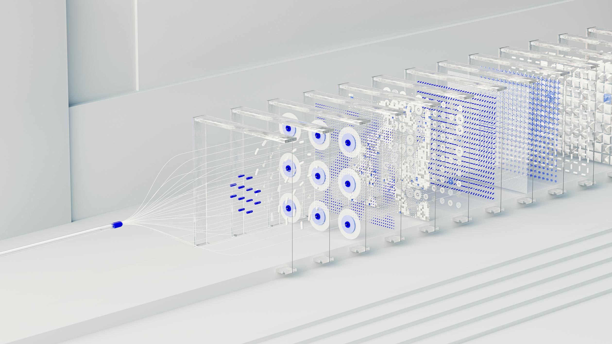

# LLM Paper Research



This repository contains implementations and illustrative code related to LLMs publications. You can find notes for each paper in the `notes` folder and below hyperlinks named `research`. It's my prototype about a specific paper for the exploration of the paper's key idea.


## Outline

1. **[Attention Is All You Need](https://arxiv.org/abs/1706.03762):** Query, Key, and Value are all you need (Also position embeddings, multiple heads, feed-forward layers, skip-connections, etc.)
   - [Research](./research/transformer/readme.md)
2. **[GPT: Improving Language Understanding by Generative Pre-Training](https://cdn.openai.com/research-covers/language-unsupervised/language_understanding_paper.pdf):** Decoder is all you need (Also, pre-training + finetuning)
   - [Research](./research/gpt-1/readme.md)
3. **[BERT: Pre-training of Deep Bidirectional Transformers for Language Understanding](https://arxiv.org/abs/1810.04805):** Encoder is all you need*. Left-to-right language modeling is NOT all you need. (*Also, pre-training + finetuning)
   - [Research](./research/bert/readme.md)
4. **[T5: Exploring the Limits of Transfer Learning with a Unified Text-to-Text Transformer](https://arxiv.org/abs/1910.10683):** Encoder-only or decoder-only is NOT all you need, though text-to-text is all you need* (Also, pre-training + finetuning)
   - [Research](./research/t5/readme.md)
5. **[GPT2: Language Models are Unsupervised Multitask Learners](https://cdn.openai.com/better-language-models/language_models_are_unsupervised_multitask_learners.pdf):** Unsupervised pre-training is all you need?!

   - [Research](./research/gpt-2/readme.md)
6. **[GPT3: Language Models are Few-Shot Learners](https://arxiv.org/abs/2005.14165):** Unsupervised pre-training + a few* examples is all you need. (From 5 examples, in Conversational QA, to 50 examples in Winogrande, PhysicalQA, and TriviaQA)
   - [Research](./research/gpt-3/readme.md)
7. **[Scaling Laws for Neural Language Models](https://arxiv.org/abs/2001.08361):** Larger models trained on lesser data* are what you you need. (10x more compute should be spent on 5.5x larger model and 1.8x more tokens)
   - [Research](./research/scaling-laws-evaluation/readme.md)
8. **[Chinchilla: Training Compute-Optimal Large Language Models](https://arxiv.org/abs/2203.15556):** Smaller models trained on more data are what you need. (10x more compute should be spent on 3.2x larger model and 3.2x more tokens)
9. **[LLaMA: Open and Efficient Foundation Language Models](https://arxiv.org/abs/2302.13971):** Smoler models trained longer—on public data—is all you need
   - [Research](./research/llama-1/readme.md)
10. **[InstructGPT: Training language models to follow instructions with human feedback](https://arxiv.org/abs/2203.02155):** 40 labelers are all you need* (Plus supervised fine-tuning, reward modeling, and PPO)
    - [Research](./research/instruct-gpt/readme.md)
11. **[LoRA: Low-Rank Adaptation of Large Language Models](https://arxiv.org/abs/2106.09685):** One rank is all you need
    - [Research](./research/gpt2-with-lora/readme.md)

12. **[QLoRA: Efficient Finetuning of Quantized LLMs](https://arxiv.org/abs/2305.14314):** 4-bit is all you need* (Plus double quantization and paged optimizers)
    - [Research](./research/llama-with-qlora/readme.md)

13. **[DPR: Dense Passage Retrieval for Open-Domain Question Answering](https://arxiv.org/abs/2004.04906):** Dense embeddings are all you need (Also, high precision retrieval)
    - [Research](./research/dpr/readme.md)

14. **[RAG: Retrieval-Augmented Generation for Knowledge-Intensive NLP Tasks](https://arxiv.org/abs/2005.11401):** Semi-parametric models* are all you need (*Dense vector retrieval as non-parametric component; pre-trained LLM as parametric component)

    - [Research](./research/rag/readme.md)
15. **[RETRO: Improving language models by retrieving from trillions of tokens](https://arxiv.org/abs/2112.04426):** Retrieving based on input chunks and chunked cross attention are all you need
    - [Research](./research/retro/readme.md)

16. **[Internet-augmented language models through few-shot prompting for open-domain question answering](https://arxiv.org/abs/2203.05115):** Google Search as retrieval is all you need
17. **[HyDE: Precise Zero-Shot Dense Retrieval without Relevance Labels](https://arxiv.org/abs/2212.10496):** LLM-generated, hypothetical documents are all you need

    - [Research](./research/hyde/readme.md)
18. **[FlashAttention: Fast and Memory-Efficient Exact Attention with IO-Awareness](https://arxiv.org/abs/2205.14135):** For-loops in SRAM are all you need
    - [Research](./research/flash-attention/readme.md)

19. **[ALiBi; Train Short, Test Long: Attention with Linear Biases Enables Input Length Extrapolation](https://arxiv.org/abs/2108.12409):** Constant bias on the query-key dot-product is all you need* (Also hyperparameter m and cached Q, K, V representations)
    - [Research](./research/alibi/readme.md)

20. **[Codex: Evaluating Large Language Models Trained on Code](https://arxiv.org/abs/2107.03374):** Finetuning on code is all you need
    - [Research](./research/codex/readme.md)

21. **[Layer Normalization](https://arxiv.org/abs/1607.06450):** Consistent mean and variance at each layer is all you need
    - [Research](./research/rnn-with-layernorm/readme.md)

22. **[On Layer Normalization in the Transformer Architecture](https://arxiv.org/abs/2002.04745):** Pre-layer norm, instead of post-layer norm, is all you need

    - [Research](./research/transformer-with-pre-layernorm/readme.md)
23. **[PPO: Proximal Policy Optimization Algorithms](https://arxiv.org/abs/1707.06347):** Clipping your surrogate function is all you need

    - [Research](./research/ppo/readme.md)
24. **[WizardCoder: Empowering Code Large Language Models with Evol-Instruct](https://arxiv.org/abs/2306.08568):** Asking the model to make the question harder is all you need* (Where do they get the responses to these harder questions though?!)
    - [Research](./research/wizard-coder/readme.md)

25. **[Llama 2: Open Foundation and Fine-Tuned Chat Models](https://arxiv.org/abs/2307.09288):** Iterative finetuning, PPO, rejection sampling, and ghost attention is all you need* (Also, 27,540 SFT annotations and more than 1 million binary comparison preference data)
    - [Research](./research/llama-2/readme.md)

26. **[RWKV: Reinventing RNNs for the Transformer Era](https://arxiv.org/abs/2305.13048):** Linear attention during inference, via RNNs, is what you need
    - [Research](./research/rwkv/readme.md)

27. **[RLAIF - Constitutional AI: Harmlessness from AI Feedback](https://arxiv.org/abs/2212.08073):** A natural language constitution* and model feedback on harmlessness is all you need (16 different variants of harmlessness principles)
    - [Research](./research/rlaif/readme.md)

28. **[Outrageously Large Neural Networks: The Sparsely-Gated Mixture-of-Experts Layer](https://arxiv.org/abs/1701.06538):** Noise in your softmax and expert regularization are all you need
    - [Research](./research/moe/readme.md)

29. **[CLIP: Learning Transferable Visual Models From Natural Language Supervision](https://arxiv.org/abs/2103.00020):** *A projection layer between text and image embeddings is all you need (*Also, 400 million image-text pairs)
    - [Research](./research/clip/readme.md)

30. **[ViT; An Image is Worth 16x16 Words: Transformers for Image Recognition at Scale](https://arxiv.org/abs/2010.11929):** Flattened 2D patches are all you need
    - [Research](./research/vit/readme.md)

31. **[Generative Agents: Interactive Simulacra of Human Behavior](https://arxiv.org/abs/2304.03442):** Reflection, memory, and retrieval are all you need
    - [Research](./research/generative-agents/readme.md)

32. **[Out-of-Domain Finetuning to Bootstrap Hallucination Detection](https://eugeneyan.com/writing/finetuning/):** Open-source, permissive-use data is what you need
33. **[DPO; Direct Preference Optimization: Your Language Model is Secretly a Reward Model](https://arxiv.org/abs/2305.18290):** A separate reward model is NOT what you need

    - [Research](./research/dpo/readme.md)
34. **[Consistency Models](https://arxiv.org/abs/2303.01469):** Mapping to how diffusion adds gaussian noise to images is all you need
    - [Research](./research/consistency-models/readme.md)

35. **[LCM; Latent Consistency Models: Synthesizing High-Resolution Images with Few-Step Inference](https://arxiv.org/abs/2310.04378):** Consistency modeling in latent space is all you need* (*Also, a diffusion model to distill from)

    - [Research](./research/latent-consistency-models/readme.md)
36. **[LCM-LoRA: A Universal Stable-Diffusion Acceleration Module](https://arxiv.org/abs/2311.05556):** Combining LoRAs is all you need
    - [Research](./research/latent-consistency-models-with-lora/readme.md)

37. **[Chain-of-Note: Enhancing Robustness in Retrieval-Augmented Language Models](https://arxiv.org/abs/2311.09210):** Asking the LLM to reflect on retrieved documents is all you need
    - [Research](./research/chain-of-noting/readme.md)

38. **[Emergent Abilities of Large Language Models](https://arxiv.org/abs/2206.07682):** The Bitter Lesson is all you need
39. **[Q-Transformer: Scalable Offline Reinforcement Learning via Autoregressive Q-Functions](https://arxiv.org/abs/2309.10150):** The Bellman equation and replay buffers are all you need
    - [Research](./research/q-transformer/readme.md)

40. **[Llama Guard: LLM-based Input-Output Safeguard for Human-AI Conversations](https://arxiv.org/abs/2312.06674):** Classification guidelines and the multiple-choice response are all you need
    - [Research](./research/llama-guard/readme.md)

41. **[RESTEM; Beyond Human Data: Scaling Self-Training for Problem-Solving with Language Models](https://arxiv.org/abs/2312.06585):** Synthetic data and a reward function are all you need

    - [Research](./research/llama-restem/readme.md)
42. **[Mixture of Experts Explained](https://huggingface.co/blog/moe):** Conditional computation and sparsity are all you need
43. **[SPIN: Self-Play Fine-Tuning Converts Weak Language Models to Strong Language Models](https://arxiv.org/abs/2401.01335):** Generator and discriminator are all you need.
    - [Research](./research/self-play-finetuning/readme.md)

44. **[Self-Instruct: Aligning Language Models with Self-Generated Instructions](https://arxiv.org/abs/2212.10560):** 54% valid instruction-input-output tuples is all you need.

    - [Research](./research/gpt3-with-self-instruct/readme.md)
45. **[Pythia: A Suite for Analyzing Large Language Models Across Training and Scaling](https://arxiv.org/abs/2304.01373)**: Well documented, publicly available model checkpoints are all you need.

    - [Research](./research/pythia/readme.md)
46. **[Self-Rewarding Language Models](https://arxiv.org/abs/2401.10020)**: Asking the model to evaluate itself is all you need.
    - [Research](./research/llama2-self-rewarding/readme.md)

47. **[Building Your Own Product Copilot - Challenges, Opportunities, and Needs](https://arxiv.org/abs/2312.14231)**: Prompt engineering LLMs is NOT all you need.
48. **[Matryoshka Representation Learning](https://arxiv.org/abs/2205.13147)**: Aggregated losses across 2n-dim embeddings is all you need.
    - [Research](./research/mrl/readme.md)

49. **[Towards Efficient Generative Large Language Model Serving: A Survey from Algorithms to Systems](https://arxiv.org/abs/2312.15234)**: Bigger GPUs is not all you need.

    - [Research](./research/bert/readme.md)
50. **[How to Generate and Use Synthetic Data for Finetuning](https://eugeneyan.com/writing/synthetic/)**: Synthetic data is almost all you need.
51. **[Whisper: Robust Speech Recognition via Large-Scale Weak Supervision](https://arxiv.org/abs/2212.04356)**: 680k hrs of audio and multitask formulated as a sequence is all you need.
    - [Research](./research/whisper/readme.md)


## Acknowledgments

Special thanks to **Eugene Yan** for this curated reading list from the [Language Modeling Reading List](https://eugeneyan.com/writing/llm-reading-list/) article, which served as an invaluable foundation for organizing these papers. This well-structured collection of fundamental language modeling papers has been instrumental in guiding my learning journey.


## Citations

```
@article{yan2024default,
  title   = {Language Modeling Reading List (to Start Your Paper Club)},
  author  = {Yan, Ziyou},
  journal = {eugeneyan.com},
  year    = {2024},
  month   = {Jan},
  url     = {https://eugeneyan.com/writing/llm-reading-list/}
}
```

