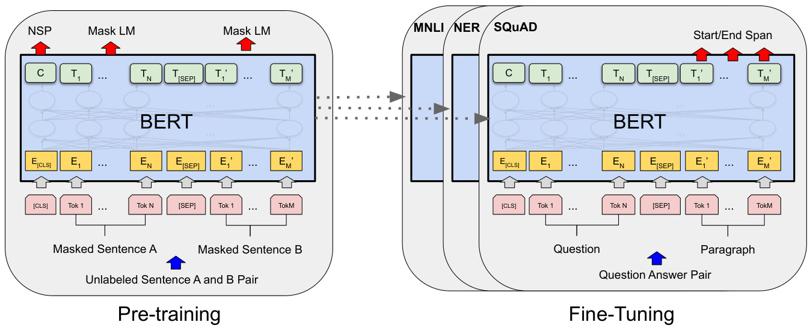
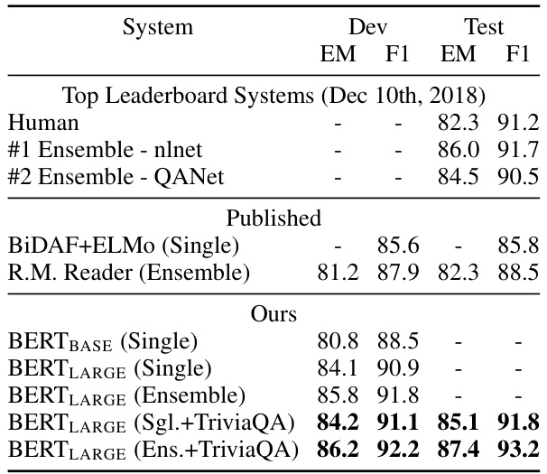
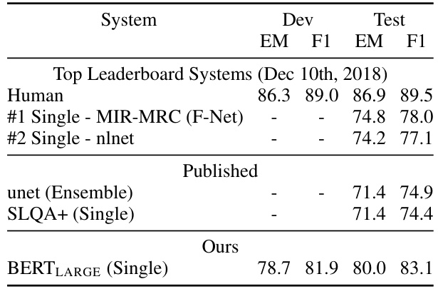
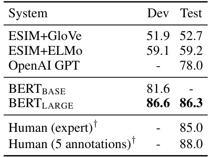
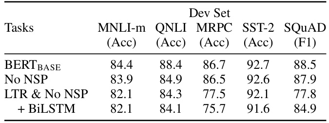
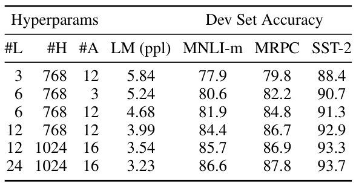
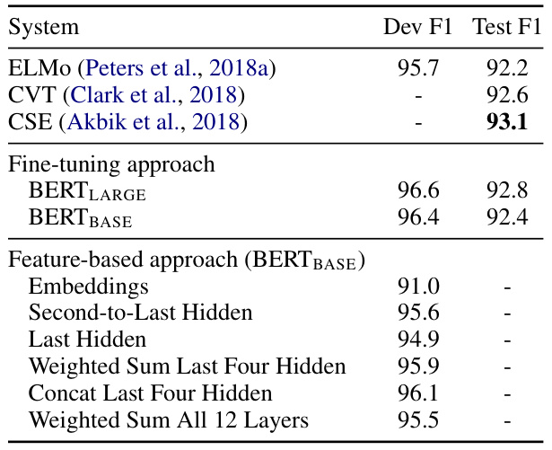
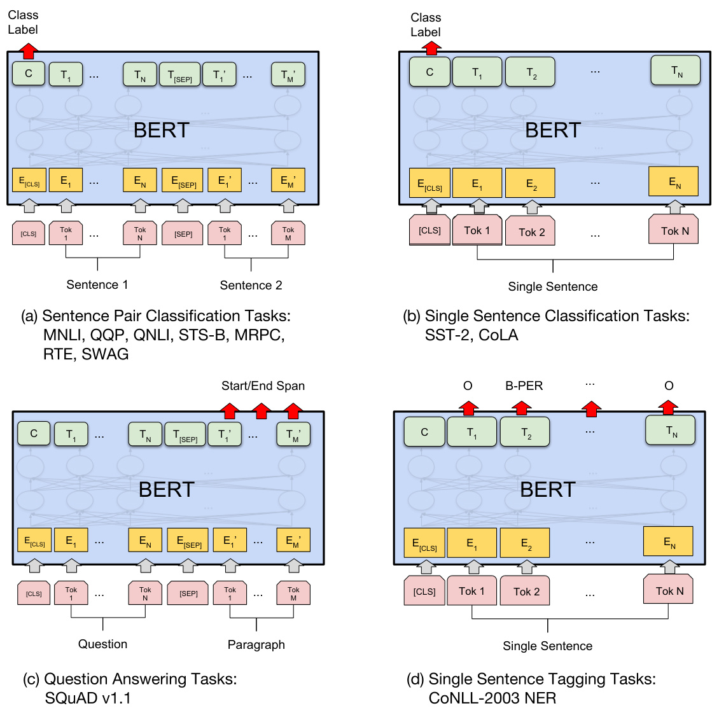
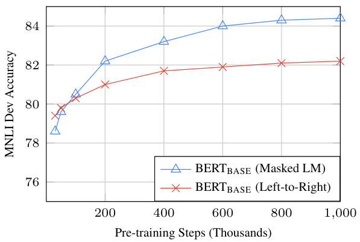
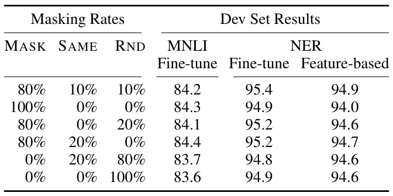

# BERT: Pre-training of Deep Bidirectional Transformers for Language Understanding  

Jacob Devlin Ming-Wei Chang Kenton Lee Kristina Toutanova Google AI Language jacobdevlin,mingweichang,kentonl,kristout @google.com  

# Abstract  

We introduce a new language representa- tion model called  BERT , which stands for B idirectional  E ncoder  R epresentations from T ransformers. Unlike recent language repre- sentation models ( Peters et al. ,  2018a ;  Rad- ford et al. ,  2018 ), BERT is designed to pre- train deep bidirectional representations from unlabeled text by jointly conditioning on both left and right context in all layers. As a re- sult, the pre-trained BERT model can be fine- tuned with just one additional output layer to create state-of-the-art models for a wide range of tasks, such as question answering and language inference, without substantial task- specific architecture modifications.  

BERT is conceptually simple and empirically powerful. It obtains new state-of-the-art re- sults on eleven natural language processing tasks, including pushing the GLUE score to  $80.5\%$   (  $7.7\%$   point absolute improvement), MultiNLI accuracy to   $86.7\%$   (  $4.6\%$   absolute improvement), SQuAD v1.1 question answer- ing Test F1 to 93.2 (1.5 point absolute im- provement) and SQuAD v2.0 Test F1 to 83.1 (5.1 point absolute improvement).  

# 1 Introduction  

Language model pre-training has been shown to be effective for improving many natural language processing tasks ( Dai and Le ,  2015 ;  Peters et al. , 2018a ;  Radford et al. ,  2018 ;  Howard and Ruder , 2018 ). These include sentence-level tasks such as natural language inference ( Bowman et al. ,  2015 ; Williams et al. ,  2018 ) and paraphrasing ( Dolan and Brockett ,  2005 ), which aim to predict the re- lationships between sentences by analyzing them holistically, as well as token-level tasks such as named entity recognition and question answering, where models are required to produce fine-grained output at the token level ( Tjong Kim Sang and De Meulder ,  2003 ;  Rajpurkar et al. ,  2016 ).  

There are two existing strategies for apply- ing pre-trained language representations to down- stream tasks:  feature-based  and  fine-tuning . The feature-based approach, such as ELMo ( Peters et al. ,  2018a ), uses task-specific architectures that include the pre-trained representations as addi- tional features. The fine-tuning approach, such as the Generative Pre-trained Transformer (OpenAI GPT) ( Radford et al. ,  2018 ), introduces minimal task-specific parameters, and is trained on the downstream tasks by simply fine-tuning  all  pre- trained parameters. The two approaches share the same objective function during pre-training, where they use unidirectional language models to learn general language representations.  

We argue that current techniques restrict the power of the pre-trained representations, espe- cially for the fine-tuning approaches. The ma- jor limitation is that standard language models are unidirectional, and this limits the choice of archi- tectures that can be used during pre-training. For example, in OpenAI GPT, the authors use a left-to- right architecture, where every token can only at- tend to previous tokens in the self-attention layers of the Transformer ( Vaswani et al. ,  2017 ). Such re- strictions are sub-optimal for sentence-level tasks, and could be very harmful when applying fine- tuning based approaches to token-level tasks such as question answering, where it is crucial to incor- porate context from both directions.  

In this paper, we improve the fine-tuning based approaches by proposing BERT:  B idirectional E ncoder R epresentations from T ransformers. BERT alleviates the previously mentioned unidi- rectionality constraint by using a “masked lan- guage model” (MLM) pre-training objective, in- spired by the Cloze task ( Taylor ,  1953 ). The masked language model randomly masks some of the tokens from the input, and the objective is to predict the original vocabulary id of the masked word based only on its context. Unlike left-to- right language model pre-training, the MLM ob- jective enables the representation to fuse the left and the right context, which allows us to pre- train a deep bidirectional Transformer. In addi- tion to the masked language model, we also use a “next sentence prediction” task that jointly pre- trains text-pair representations. The contributions of our paper are as follows:  

• We demonstrate the importance of bidirectional pre-training for language representations. Un- like  Radford et al.  ( 2018 ), which uses unidirec- tional language models for pre-training, BERT uses masked language models to enable pre- trained deep bidirectional representations. This is also in contrast to  Peters et al.  ( 2018a ), which uses a shallow concatenation of independently trained left-to-right and right-to-left LMs.  

• We show that pre-trained representations reduce the need for many heavily-engineered task- specific architectures. BERT is the first fine- tuning based representation model that achieves state-of-the-art performance on a large suite of sentence-level  and  token-level tasks, outper- forming many task-specific architectures.  

• BERT advances the state of the art for eleven NLP tasks. The code and pre-trained mod- els are available at  https://github.com/ google-research/bert .  

# 2 Related Work  

There is a long history of pre-training general lan- guage representations, and we briefly review the most widely-used approaches in this section.  

# 2.1 Unsupervised Feature-based Approaches  

Learning widely applicable representations of words has been an active area of research for decades, including non-neural ( Brown et al. ,  1992 ; Ando and Zhang ,  2005 ;  Blitzer et al. ,  2006 ) and neural ( Mikolov et al. ,  2013 ;  Pennington et al. , 2014 ) methods. Pre-trained word embeddings are an integral part of modern NLP systems, of- fering significant improvements over embeddings learned from scratch ( Turian et al. ,  2010 ). To pre- train word embedding vectors, left-to-right lan- guage modeling objectives have been used ( Mnih and Hinton ,  2009 ), as well as objectives to dis- criminate correct from incorrect words in left and right context ( Mikolov et al. ,  2013 ).  

These approaches have been generalized to coarser granularities, such as sentence embed- dings ( Kiros et al. ,  2015 ;  Logeswaran and Lee , 2018 ) or paragraph embeddings ( Le and Mikolov , 2014 ). To train sentence representations, prior work has used objectives to rank candidate next sentences ( Jernite et al. ,  2017 ;  Logeswaran and Lee ,  2018 ), left-to-right generation of next sen- tence words given a representation of the previous sentence ( Kiros et al. ,  2015 ), or denoising auto- encoder derived objectives ( Hill et al. ,  2016 ).  

ELMo and its predecessor ( Peters et al. ,  2017 , 2018a ) generalize traditional word embedding re- search along a different dimension. They extract context-sensitive  features from a left-to-right and a right-to-left language model. The contextual rep- resentation of each token is the concatenation of the left-to-right and right-to-left representations. When integrating contextual word embeddings with existing task-specific architectures, ELMo advances the state of the art for several major NLP benchmarks ( Peters et al. ,  2018a ) including ques- tion answering ( Rajpurkar et al. ,  2016 ), sentiment analysis ( Socher et al. ,  2013 ), and named entity recognition ( Tjong Kim Sang and De Meulder , 2003 ).  Melamud et al.  ( 2016 ) proposed learning contextual representations through a task to pre- dict a single word from both left and right context using LSTMs. Similar to ELMo, their model is feature-based and not deeply bidirectional.  Fedus et al.  ( 2018 ) shows that the cloze task can be used to improve the robustness of text generation mod- els.  

# 2.2 Unsupervised Fine-tuning Approaches  

As with the feature-based approaches, the first works in this direction only pre-trained word em- bedding parameters from unlabeled text ( Col- lobert and Weston ,  2008 ).  

More recently, sentence or document encoders which produce contextual token representations have been pre-trained from unlabeled text and fine-tuned for a supervised downstream task ( Dai and Le ,  2015 ;  Howard and Ruder ,  2018 ;  Radford et al. ,  2018 ). The advantage of these approaches is that few parameters need to be learned from scratch. At least partly due to this advantage, OpenAI GPT ( Radford et al. ,  2018 ) achieved pre- viously state-of-the-art results on many sentence- level tasks from the GLUE benchmark ( Wang et al. ,  2018a ). Left-to-right language model-  

  
Figure 1: Overall pre-training and fine-tuning procedures for BERT. Apart from output layers, the same architec- tures are used in both pre-training and fine-tuning. The same pre-trained model parameters are used to initialize models for different down-stream tasks. During fine-tuning, all parameters are fine-tuned.  [CLS]  is a special symbol added in front of every input example, and  [SEP]  is a special separator token (e.g. separating ques- tions/answers).  

ing and auto-encoder objectives have been used for pre-training such models ( Howard and Ruder , 2018 ;  Radford et al. ,  2018 ;  Dai and Le ,  2015 ).  

# 2.3 Transfer Learning from Supervised Data  

There has also been work showing effective trans- fer from supervised tasks with large datasets, such as natural language inference ( Conneau et al. , 2017 ) and machine translation ( McCann et al. , 2017 ). Computer vision research has also demon- strated the importance of transfer learning from large pre-trained models, where an effective recipe is to fine-tune models pre-trained with Ima- geNet ( Deng et al. ,  2009 ;  Yosinski et al. ,  2014 ).  

# 3 BERT  

We introduce BERT and its detailed implementa- tion in this section. There are two steps in our framework:  pre-training  and  fine-tuning . Dur- ing pre-training, the model is trained on unlabeled data over different pre-training tasks. For fine- tuning, the BERT model is first initialized with the pre-trained parameters, and all of the param- eters are fine-tuned using labeled data from the downstream tasks. Each downstream task has sep- arate fine-tuned models, even though they are ini- tialized with the same pre-trained parameters. The question-answering example in Figure  1  will serve as a running example for this section.  

A distinctive feature of BERT is its unified ar- chitecture across different tasks. There is mini- mal difference between the pre-trained architec- ture and the final downstream architecture.  

Model Architecture BERT’s model architec- ture is a multi-layer bidirectional Transformer en- coder based on the original implementation de- scribed in  Vaswani et al.  ( 2017 ) and released in the  tensor2tensor  library.   Because the use of Transformers has become common and our im- plementation is almost identical to the original, we will omit an exhaustive background descrip- tion of the model architecture and refer readers to Vaswani et al.  ( 2017 ) as well as excellent guides such as “The Annotated Transformer.” 2  

In this work, we denote the number of layers (i.e., Transformer blocks) as    $L$  , the hidden size as  $H$  , and the number of self-attention heads as    $A$  . We primarily report results on two model sizes: BERT    $\scriptstyle(\mathrm{L}=12$  ,   $_\mathrm{H=768}$  ,   $\scriptstyle{\mathbf{A}=12}$  , Total Param- BASE eters  $\scriptstyle=110\mathbf{M}$  ) and  BERT    $\mathrm{L}{=}24$  ,   $\scriptstyle{\mathrm{H=}1024}$  , LARGE  $\scriptstyle{\mathbf{A}=16}$  , Total Parameters  $\mathbf{\wp}\!\!=\!\!340\mathbf{M}$  .  

BERT BASE  was chosen to have the same model size as OpenAI GPT for comparison purposes. Critically, however, the BERT Transformer uses bidirectional self-attention, while the GPT Trans- former uses constrained self-attention where every token can only attend to context to its left.  

Input/Output Representations To make BERT handle a variety of down-stream tasks, our input representation is able to unambiguously represent both a single sentence and a pair of sentences (e.g.,  ⟨ Question, Answer  ⟩ ) in one token sequence. Throughout this work, a “sentence” can be an arbi- trary span of contiguous text, rather than an actual linguistic sentence. A “sequence” refers to the in- put token sequence to BERT, which may be a sin- gle sentence or two sentences packed together.  

We use WordPiece embeddings ( Wu et al. , 2016 ) with a 30,000 token vocabulary. The first token of every sequence is always a special clas- sification token ( [CLS] ). The final hidden state corresponding to this token is used as the ag- gregate sequence representation for classification tasks. Sentence pairs are packed together into a single sequence. We differentiate the sentences in two ways. First, we separate them with a special token ( [SEP] ). Second, we add a learned embed- ding to every token indicating whether it belongs to sentence  $\mathtt{A}$   or sentence  B . As shown in Figure  1 , we denote input embedding as    $E$  , the final hidden vector of the special  [CLS]  toke s    $C\,\in\,\mathbb{R}^{H}$  , and the final hidden vector for the  i  $i^{\mathrm{th}}$    input token as  $T_{i}\in\mathbb{R}^{H}$  .  

For a given token, its input representation is constructed by summing the corresponding token, segment, and position embeddings. A visualiza- tion of this construction can be seen in Figure  2 .  

# 3.1 Pre-training BERT  

Unlike  Peters et al.  ( 2018a ) and  Radford et al. ( 2018 ), we do not use traditional left-to-right or right-to-left language models to pre-train BERT. Instead, we pre-train BERT using two unsuper- vised tasks, described in this section. This step is presented in the left part of Figure  1 .  

Task #1: Masked LM Intuitively, it is reason- able to believe that a deep bidirectional model is strictly more powerful than either a left-to-right model or the shallow concatenation of a left-to- right and a right-to-left model. Unfortunately, standard conditional language models can only be trained left-to-right  or  right-to-left, since bidirec- tional conditioning would allow each word to in- directly “see itself”, and the model could trivially predict the target word in a multi-layered context.  

In order to train a deep bidirectional representa- tion, we simply mask some percentage of the input tokens at random, and then predict those masked tokens. We refer to this procedure as a “masked LM” (MLM), although it is often referred to as a Cloze  task in the literature ( Taylor ,  1953 ). In this case, the final hidden vectors corresponding to the mask tokens are fed into an output softmax over the vocabulary, as in a standard LM. In all of our experiments, we mask   $15\%$   of all WordPiece to- kens in each sequence at random. In contrast to denoising auto-encoders ( Vincent et al. ,  2008 ), we only predict the masked words rather than recon- structing the entire input.  

Although this allows us to obtain a bidirec- tional pre-trained model, a downside is that we are creating a mismatch between pre-training and fine-tuning, since the  [MASK]  token does not ap- pear during fine-tuning. To mitigate this, we do not always replace “masked” words with the ac- tual  [MASK]  token. The training data generator chooses   $15\%$   of the token positions at random for prediction. If the    $i$  -th token is chosen, we replace the  $i.$  -th token with (1) the  [MASK]  token   $80\%$   of the time (2) a random token   $10\%$   of the time (3) the unchanged    $i$  -th token   $10\%$   of the time. Then,  $T_{i}$   will be used to predict the original token with cross entropy loss. We compare variations of this procedure in Appendix  C.2 .  

Task #2: Next Sentence Prediction (NSP) Many important downstream tasks such as Ques- tion Answering (QA) and Natural Language Infer- ence (NLI) are based on understanding the  rela- tionship  between two sentences, which is not di- rectly captured by language modeling. In order to train a model that understands sentence rela- tionships, we pre-train for a binarized  next sen- tence prediction  task that can be trivially gener- ated from any monolingual corpus. Specifically, when choosing the sentences  A  and  B  for each pre- training example,   $50\%$   of the time  B  is the actual next sentence that follows  $\mathtt{A}$   (labeled as    $\scriptstyle{\mathbb{T}}_{\mathrm{SNR}\times\mathrm{t}.}$  ), and   $50\%$   of the time it is a random sentence from the corpus (labeled as  NotNext ). As we show in Figure  1 ,    $C$   is used for next sentence predic- tion (NSP).   Despite its simplicity, we demon- strate in Section  5.1  that pre-training towards this task is very beneficial to both QA and NLI.   6  

  
Figure 2: BERT input representation. The input embeddings are the sum of the token embeddings, the segmenta- tion embeddings and the position embeddings.  

The NSP task is closely related to representation- learning objectives used in  Jernite et al.  ( 2017 ) and Logeswaran and Lee  ( 2018 ). However, in prior work, only sentence embeddings are transferred to down-stream tasks, where BERT transfers all pa- rameters to initialize end-task model parameters.  

Pre-training data  The pre-training procedure largely follows the existing literature on language model pre-training. For the pre-training corpus we use the BooksCorpus (800M words) ( Zhu et al. , 2015 ) and English Wikipedia (2,500M words). For Wikipedia we extract only the text passages and ignore lists, tables, and headers. It is criti- cal to use a document-level corpus rather than a shuffled sentence-level corpus such as the Billion Word Benchmark ( Chelba et al. ,  2013 ) in order to extract long contiguous sequences.  

# 3.2 Fine-tuning BERT  

Fine-tuning is straightforward since the self- attention mechanism in the Transformer al- lows BERT to model many downstream tasks— whether they involve single text or text pairs—by swapping out the appropriate inputs and outputs. For applications involving text pairs, a common pattern is to independently encode text pairs be- fore applying bidirectional cross attention, such as  Parikh et al.  ( 2016 );  Seo et al.  ( 2017 ). BERT instead uses the self-attention mechanism to unify these two stages, as encoding a concatenated text pair with self-attention effectively includes  bidi- rectional  cross attention between two sentences.  

For each task, we simply plug in the task- specific inputs and outputs into BERT and fine- tune all the parameters end-to-end. At the in- put, sentence  A  and sentence  B  from pre-training are analogous to (1) sentence pairs in paraphras- ing, (2) hypothesis-premise pairs in entailment, (3) question-passage pairs in question answering, and (4) a degenerate text-  $\cdot\emptyset$  pair in text classification or sequence tagging. At the output, the token rep- resentations are fed into an output layer for token- level tasks, such as sequence tagging or question answering, and the  [CLS]  representation is fed into an output layer for classification, such as en- tailment or sentiment analysis.  

Compared to pre-training, fine-tuning is rela- tively inexpensive. All of the results in the pa- per can be replicated in at most 1 hour on a sin- gle Cloud TPU, or a few hours on a GPU, starting from the exact same pre-trained model.   We de- scribe the task-specific details in the correspond- ing subsections of Section  4 . More details can be found in Appendix  A.5 .  

# 4 Experiments  

In this section, we present BERT fine-tuning re- sults on 11 NLP tasks.  

# 4.1 GLUE  

The General Language Understanding Evaluation (GLUE) benchmark ( Wang et al. ,  2018a ) is a col- lection of diverse natural language understanding tasks. Detailed descriptions of GLUE datasets are included in Appendix  B.1 .  

To fine-tune on GLUE, we represent the input sequence (for single sentence or sentence pairs) as described in Section  3 , and use the final hid- den vector    ${\cal C}~\in~\mathbb{R}^{H}$    corresponding to the first input token ( [CLS] ) as the aggregate representa- tion. The only new parameters introduced during ning are lassification layer weights    $W\,\in$   $\mathbb{R}^{K\times H}$  , where  $K$   is the number of labels. We com- pute a standard classification loss with    $C$   and    $W$  , i.e.,    $\log(\operatorname{softmax}(C W^{T}))$  .  

  
Table 1: GLUE Test results, scored by the evaluation server ( https://gluebenchmark.com/leaderboard ). The number below each task denotes the number of training examples. The “Average” column is slightly different than the official GLUE score, since we exclude the problematic WNLI set.   BERT and OpenAI GPT are single- model, single task. F1 scores are reported for QQP and MRPC, Spearman correlations are reported for STS-B, and accuracy scores are reported for the other tasks. We exclude entries that use BERT as one of their components.  

We use a batch size of 32 and fine-tune for 3 epochs over the data for all GLUE tasks. For each task, we selected the best fine-tuning learning rate (among 5e-5, 4e-5, 3e-5, and 2e-5) on the Dev set. Additionally, for BERT LARGE  we found that fine- tuning was sometimes unstable on small datasets, so we ran several random restarts and selected the best model on the Dev set. With random restarts, we use the same pre-trained checkpoint but per- form different fine-tuning data shuffling and clas- sifier layer initialization.  

Results are presented in Table  1 . Both BERT BASE  and BERT LARGE  outperform all sys- tems on all tasks by a substantial margin, obtaining  $4.5\%$   and   $7.0\%$   respective average accuracy im- provement over the prior state of the art. Note that BERT BASE  and OpenAI GPT are nearly identical in terms of model architecture apart from the at- tention masking. For the largest and most widely reported GLUE task, MNLI, BERT obtains a  $4.6\%$  absolute accuracy improvement. On the official GLUE leaderboard 10 , BERT LARGE  obtains a score of 80.5, compared to OpenAI GPT, which obtains 72.8 as of the date of writing.  

We find that BERT LARGE  significantly outper- forms BERT BASE  across all tasks, especially those with very little training data. The effect of model size is explored more thoroughly in Section  5.2 .  

# 4.2 SQuAD v1.1  

The Stanford Question Answering Dataset (SQuAD v1.1) is a collection of   $100\mathbf{k}$   crowd- sourced question/answer pairs ( Rajpurkar et al. , 2016 ). Given a question and a passage from Wikipedia containing the answer, the task is to predict the answer text span in the passage.  

As shown in Figure  1 , in the question answer- ing task, we represent the input question and pas- sage as a single packed sequence, with the ques- tion using the  A  embedding and the passage using the  B  embedding. We only introduce a start vec- tor    $S\,\in\,\mathbb{R}^{H}$    and an end vector    $E\,\in\,\mathbb{R}^{H}$    during fine-tuning. The probability of word    $i$   being the start of the answer span is computed as a dot prod- uct between    $T_{i}$   and  $S$   followed by a softmax over all of the words in the paragraph: The analogous formula is used for the end of the    $\begin{array}{r}{P_{i}=\frac{e^{S\cdot T_{i}}}{\sum_{j}e^{S\cdot T_{j}}}}\end{array}$  P  . answer span. The score of a candidate span from position    $i$   to position    $j$   is defined as    $S{\cdot}T_{i}+E{\cdot}T_{j}$  , and the maximum scoring span where    $j~\geq~i$   is used as a prediction. The training objective is the sum of the log-likelihoods of the correct start and end positions. We fine-tune for 3 epochs with a learning rate of 5e-5 and a batch size of 32.  

Table  2  shows top leaderboard entries as well as results from top published systems ( Seo et al. , 2017 ;  Clark and Gardner ,  2018 ;  Peters et al. , 2018a ;  Hu et al. ,  2018 ). The top results from the SQuAD leaderboard do not have up-to-date public system descriptions available,   and are allowed to use any public data when training their systems. We therefore use modest data augmentation in our system by first fine-tuning on TriviaQA ( Joshi et al. ,  2017 ) befor fine-tuning on SQuAD.  

Our best performing system outperforms the top leaderboard system by   $+1.5\;\mathrm{F}1$   in ensembling and  $+1.3$   F1 as a single system. In fact, our single BERT model outperforms the top ensemble sys- tem in terms of F1 score. Without TriviaQA fine-  

  

  

Table 3: SQuAD 2.0 results. We exclude entries that use BERT as one of their components.  

tuning data, we only lose 0.1-0.4 F1, still outper- forming all existing systems by a wide margin.  

# 4.3 SQuAD v2.0  

The SQuAD 2.0 task extends the SQuAD 1.1 problem definition by allowing for the possibility that no short answer exists in the provided para- graph, making the problem more realistic.  

We use a simple approach to extend the SQuAD v1.1 BERT model for this task. We treat ques- tions that do not have an answer as having an an- swer span with start and end at the  [CLS]  to- ken. The probability space for the start and end answer span positions is extended to include the position of the  [CLS]  token. For prediction, we compare the score of the no-answer span:    $s_{\mathtt{n u l l}}=$   $S{\cdot}C+E{\cdot}C$   to the score of the best non-null span  

  
Table 4: SWAG Dev and Test accuracies.   † Human per- formance is measured with 100 samples, as reported in the SWAG paper.  

$\hat{s_{i,j}}=\mathtt{m a x}_{j\ge i}S{\cdot}T_{i}+E{\cdot}T_{j}$  ≥ · · . We predict a non-null answer when  $s_{i,j}^{\,\ast}\,>\,s_{\tt n u l l}+\tau$  , where the thresh- old  $\tau$   is selected on the dev set to maximize F1. We did not use TriviaQA data for this model. We fine-tuned for 2 epochs with a learning rate of 5e-5 and a batch size of 48.  

The results compared to prior leaderboard en- tries and top published work ( Sun et al. ,  2018 ; Wang et al. ,  2018b ) are shown in Table  3 , exclud- ing systems that use BERT as one of their com- ponents. We observe a  $+5.1$   F1 improvement over the previous best system.  

# 4.4 SWAG  

The Situations With Adversarial Generations (SWAG) dataset contains   $113\mathrm{k}$   sentence-pair com- pletion examples that evaluate grounded common- sense inference ( Zellers et al. ,  2018 ). Given a sen- tence, the task is to choose the most plausible con- tinuation among four choices.  

When fine-tuning on the SWAG dataset, we construct four input sequences, each containing the concatenation of the given sentence (sentence A ) and a possible continuation (sentence  B ). The only task-specific parameters introduced is a vec- tor whose dot product with the  [CLS]  token rep- resentation    $C$   denotes a score for each choice which is normalized with a softmax layer.  

We fine-tune the model for 3 epochs with a learning rate of 2e-5 and a batch size of 16. Re- sults are presented in Table  4 . BERT LARGE  out- performs the authors’ baseline ESIM  $\dotplus$  ELMo sys- tem by   $+27.1\%$   and OpenAI GPT by   $8.3\%$  .  

# 5 Ablation Studies  

In this section, we perform ablation experiments over a number of facets of BERT in order to better understand their relative importance. Additional  

  

Table 5: Ablation over the pre-training tasks using the BERT BASE  architecture. “No NSP” is trained without the next sentence prediction task. “LTR & No NSP” is trained as a left-to-right LM without the next sentence prediction, like OpenAI GPT. “  $\cdot+$  BiLSTM” adds a ran- domly initialized BiLSTM on top of the “LTR  $\mathrm{~+~No~}$  NSP” model during fine-tuning.  

ablation studies can be found in Appendix  C .  

# 5.1 Effect of Pre-training Tasks  

We demonstrate the importance of the deep bidi- rectionality of BERT by evaluating two pre- training objectives using exactly the same pre- training data, fine-tuning scheme, and hyperpa- rameters as BERT BASE :  

No NSP : A bidirectional model which is trained using the “masked LM” (MLM) but without the “next sentence prediction” (NSP) task.  

LTR & No NSP : A left-context-only model which is trained using a standard Left-to-Right (LTR) LM, rather than an MLM. The left-only constraint was also applied at fine-tuning, because removing it introduced a pre-train/fine-tune mismatch that degraded downstream performance. Additionally, this model was pre-trained without the NSP task. This is directly comparable to OpenAI GPT, but using our larger training dataset, our input repre- sentation, and our fine-tuning scheme.  

We first examine the impact brought by the NSP task. In Table  5 , we show that removing NSP hurts performance significantly on QNLI, MNLI, and SQuAD 1.1. Next, we evaluate the impact of training bidirectional representations by com- paring “No NSP” to “LTR & No NSP”. The LTR model performs worse than the MLM model on all tasks, with large drops on MRPC and SQuAD.  

For SQuAD it is intuitively clear that a LTR model will perform poorly at token predictions, since the token-level hidden states have no right- side context. In order to make a good faith at- tempt at strengthening the LTR system, we added a randomly initialized BiLSTM on top. This does significantly improve results on SQuAD, but the results are still far worse than those of the pre- trained bidirectional models. The BiLSTM hurts performance on the GLUE tasks.  

We recognize that it would also be possible to train separate LTR and RTL models and represent each token as the concatenation of the two mod- els, as ELMo does. However: (a) this is twice as expensive as a single bidirectional model; (b) this is non-intuitive for tasks like QA, since the RTL model would not be able to condition the answer on the question; (c) this it is strictly less powerful than a deep bidirectional model, since it can use both left and right context at every layer.  

# 5.2 Effect of Model Size  

In this section, we explore the effect of model size on fine-tuning task accuracy. We trained a number of BERT models with a differing number of layers, hidden units, and attention heads, while otherwise using the same hyperparameters and training pro- cedure as described previously.  

Results on selected GLUE tasks are shown in Table  6 . In this table, we report the average Dev Set accuracy from 5 random restarts of fine-tuning. We can see that larger models lead to a strict ac- curacy improvement across all four datasets, even for MRPC which only has 3,600 labeled train- ing examples, and is substantially different from the pre-training tasks. It is also perhaps surpris- ing that we are able to achieve such significant improvements on top of models which are al- ready quite large relative to the existing literature. For example, the largest Transformer explored in Vaswani et al.  ( 2017 ) is (  $\mathrm{{[L}}{=}6$  ,   $\scriptstyle{\mathrm{H=}1024}$  ,   $\scriptstyle{\mathrm{A}=16}$  ) with 100M parameters for the encoder, and the largest Transformer we have found in the literature is   $\mathrm{[L=}64$  ,   $\scriptstyle{\mathrm{H}=512}$  ,   $\mathrm{A}{=}2.$  ) with   $235\mathbf{M}$   parameters ( Al-Rfou et al. ,  2018 ). By contrast, BERT BASE contains 110M parameters and BERT LARGE  con- tains 340M parameters.  

It has long been known that increasing the model size will lead to continual improvements on large-scale tasks such as machine translation and language modeling, which is demonstrated by the LM perplexity of held-out training data shown in Table  6 . However, we believe that this is the first work to demonstrate convinc- ingly that scaling to extreme model sizes also leads to large improvements on very small scale tasks, provided that the model has been suffi- ciently pre-trained.  Peters et al.  ( 2018b ) presented mixed results on the downstream task impact of increasing the pre-trained bi-LM size from two to four layers and  Melamud et al.  ( 2016 ) men- tioned in passing that increasing hidden dimen- sion size from 200 to 600 helped, but increasing further to 1,000 did not bring further improve- ments. Both of these prior works used a feature- based approach — we hypothesize that when the model is fine-tuned directly on the downstream tasks and uses only a very small number of ran- domly initialized additional parameters, the task- specific models can benefit from the larger, more expressive pre-trained representations even when downstream task data is very small.  

# 5.3 Feature-based Approach with BERT  

All of the BERT results presented so far have used the fine-tuning approach, where a simple classifi- cation layer is added to the pre-trained model, and all parameters are jointly fine-tuned on a down- stream task. However, the feature-based approach, where fixed features are extracted from the pre- trained model, has certain advantages. First, not all tasks can be easily represented by a Trans- former encoder architecture, and therefore require a task-specific model architecture to be added. Second, there are major computational benefits to pre-compute an expensive representation of the training data once and then run many experiments with cheaper models on top of this representation.  

In this section, we compare the two approaches by applying BERT to the CoNLL-2003 Named Entity Recognition (NER) task ( Tjong Kim Sang and De Meulder ,  2003 ). In the input to BERT, we use a case-preserving WordPiece model, and we include the maximal document context provided by the data. Following standard practice, we for- mulate this as a tagging task but do not use a CRF  

  

Table 6: Ablation over BERT model size. #L  $=$   the number of layers;  $\#\mathrm{H}=$  hidden size; #A  $=$  number of at- tention heads. “LM (ppl)” is the masked LM perplexity of held-out training data.  

  
Table 7: CoNLL-2003 Named Entity Recognition re- sults. Hyperparameters were selected using the Dev set. The reported Dev and Test scores are averaged over 5 random restarts using those hyperparameters.  

layer in the output. We use the representation of the first sub-token as the input to the token-level classifier over the NER label set.  

To ablate the fine-tuning approach, we apply the feature-based approach by extracting the activa- tions from one or more layers  without  fine-tuning any parameters of BERT. These contextual em- beddings are used as input to a randomly initial- ized two-layer 768-dimensional BiLSTM before the classification layer.  

Results are presented in Table  7 . BERT LARGE performs competitively with state-of-the-art meth- ods. The best performing method concatenates the token representations from the top four hidden lay- ers of the pre-trained Transformer, which is only  $0.3\ \mathrm{F}1$   behind fine-tuning the entire model. This demonstrates that BERT is effective for both fine- tuning and feature-based approaches.  

# 6 Conclusion  

Recent empirical improvements due to transfer learning with language models have demonstrated that rich, unsupervised pre-training is an integral part of many language understanding systems. In particular, these results enable even low-resource tasks to benefit from deep unidirectional architec- tures. Our major contribution is further general- izing these findings to deep  bidirectional  architec- tures, allowing the same pre-trained model to suc- cessfully tackle a broad set of NLP tasks.  

# References  

Alan Akbik, Duncan Blythe, and Roland Vollgraf. 2018. Contextual string embeddings for sequence labeling. In  Proceedings of the 27th International Conference on Computational Linguistics , pages 1638–1649. Rami Al-Rfou, Dokook Choe, Noah Constant, Mandy Guo, and Llion Jones. 2018. Character-level lan- guage modeling with deeper self-attention. arXiv preprint arXiv:1808.04444 . Rie Kubota Ando and Tong Zhang. 2005. A framework for learning predictive structures from multiple tasks and unlabeled data.  Journal of Machine Learning Research , 6(Nov):1817–1853. Luisa Bentivogli, Bernardo Magnini, Ido Dagan, Hoa Trang Dang, and Danilo Giampiccolo. 2009. The fifth PASCAL recognizing textual entailment challenge. In  TAC . NIST. John Blitzer, Ryan McDonald, and Fernando Pereira. 2006. Domain adaptation with structural correspon- dence learning. In  Proceedings of the 2006 confer- ence on empirical methods in natural language pro- cessing , pages 120–128. Association for Computa- tional Linguistics. Samuel R. Bowman, Gabor Angeli, Christopher Potts, and Christopher D. Manning. 2015. A large anno- tated corpus for learning natural language inference. In  EMNLP . Association for Computational Linguis- tics. Peter F Brown, Peter V Desouza, Robert L Mercer, Vincent J Della Pietra, and Jenifer C Lai. 1992. Class-based n-gram models of natural language. Computational linguistics , 18(4):467–479. Daniel Cer, Mona Diab, Eneko Agirre, Inigo Lopez- Gazpio, and Lucia Specia. 2017. Semeval-2017 task 1: Semantic textual similarity multilingual and crosslingual focused evaluation . In  Proceedings of the 11th International Workshop on Semantic Evaluation (SemEval-2017) , pages 1–14, Vancou- ver, Canada. Association for Computational Lin- guistics. Ciprian Chelba, Tomas Mikolov, Mike Schuster, Qi Ge, Thorsten Brants, Phillipp Koehn, and Tony Robin- son. 2013. One billion word benchmark for measur- ing progress in statistical language modeling.  arXiv preprint arXiv:1312.3005 . Z. Chen, H. Zhang, X. Zhang, and L. Zhao. 2018. Quora question pairs . Christopher Clark and Matt Gardner. 2018. Simple and effective multi-paragraph reading comprehen- sion. In  ACL .  

Kevin Clark, Minh-Thang Luong, Christopher D Man- ning, and Quoc Le. 2018. Semi-supervised se- quence modeling with cross-view training. In  Pro- ceedings of the 2018 Conference on Empirical Meth- ods in Natural Language Processing , pages 1914– 1925. Ronan Collobert and Jason Weston. 2008. A unified architecture for natural language processing: Deep neural networks with multitask learning. In  Pro- ceedings of the 25th international conference on Machine learning , pages 160–167. ACM. Alexis Conneau, Douwe Kiela, Holger Schwenk, Lo¨ ıc Barrault, and Antoine Bordes. 2017. Supervised learning of universal sentence representations from natural language inference data . In  Proceedings of the 2017 Conference on Empirical Methods in Nat- ural Language Processing , pages 670–680, Copen- hagen, Denmark. Association for Computational Linguistics. Andrew M Dai and Quoc V Le. 2015. Semi-supervised sequence learning. In  Advances in neural informa- tion processing systems , pages 3079–3087. J. Deng, W. Dong, R. Socher, L.-J. Li, K. Li, and L. Fei- Fei. 2009. ImageNet: A Large-Scale Hierarchical Image Database. In  CVPR09 . William B Dolan and Chris Brockett. 2005. Automati- cally constructing a corpus of sentential paraphrases. In  Proceedings of the Third International Workshop on Paraphrasing (IWP2005) . William Fedus, Ian Goodfellow, and Andrew M Dai. 2018. Maskgan: Better text generation via filling in the .  arXiv preprint arXiv:1801.07736 . Dan Hendrycks and Kevin Gimpel. 2016. Bridging nonlinearities and stochastic regularizers with gaus- sian error linear units .  CoRR , abs/1606.08415. Felix Hill, Kyunghyun Cho, and Anna Korhonen. 2016. Learning distributed representations of sentences from unlabelled data. In  Proceedings of the 2016 Conference of the North American Chapter of the Association for Computational Linguistics: Human Language Technologies . Association for Computa- tional Linguistics. Jeremy Howard and Sebastian Ruder. 2018.  Universal language model fine-tuning for text classification . In ACL . Association for Computational Linguistics. Minghao Hu, Yuxing Peng, Zhen Huang, Xipeng Qiu, Furu Wei, and Ming Zhou. 2018. Reinforced mnemonic reader for machine reading comprehen- sion. In  IJCAI . Yacine Jernite, Samuel R. Bowman, and David Son- tag. 2017.  Discourse-based objectives for fast un- supervised sentence representation learning .  CoRR , abs/1705.00557.  

Mandar Joshi, Eunsol Choi, Daniel S Weld, and Luke Zettlemoyer. 2017. Triviaqa: A large scale distantly supervised challenge dataset for reading comprehen- sion. In  ACL . Ryan Kiros, Yukun Zhu, Ruslan R Salakhutdinov, Richard Zemel, Raquel Urtasun, Antonio Torralba, and Sanja Fidler. 2015. Skip-thought vectors. In Advances in neural information processing systems , pages 3294–3302. Quoc Le and Tomas Mikolov. 2014. Distributed rep- resentations of sentences and documents. In  Inter- national Conference on Machine Learning , pages 1188–1196. Hector J Levesque, Ernest Davis, and Leora Morgen- stern. 2011. The winograd schema challenge. In Aaai spring symposium: Logical formalizations of commonsense reasoning , volume 46, page 47. Lajanugen Logeswaran and Honglak Lee. 2018.  An efficient framework for learning sentence represen- tations . In  International Conference on Learning Representations . Bryan McCann, James Bradbury, Caiming Xiong, and Richard Socher. 2017. Learned in translation: Con- textualized word vectors. In  NIPS . Oren Melamud, Jacob Goldberger, and Ido Dagan. 2016. context2vec: Learning generic context em- bedding with bidirectional LSTM. In  CoNLL . Tomas Mikolov, Ilya Sutskever, Kai Chen, Greg S Cor- rado, and Jeff Dean. 2013. Distributed representa- tions of words and phrases and their compositional- ity. In  Advances in Neural Information Processing Systems 26 , pages 3111–3119. Curran Associates, Inc. Andriy Mnih and Geoffrey E Hinton. 2009.  A scal- able hierarchical distributed language model . In D. Koller, D. Schuurmans, Y. Bengio, and L. Bot- tou, editors,  Advances in Neural Information Pro- cessing Systems 21 , pages 1081–1088. Curran As- sociates, Inc. Ankur P Parikh, Oscar T¨ ackstr¨ om, Dipanjan Das, and Jakob Uszkoreit. 2016. A decomposable attention model for natural language inference. In  EMNLP . Jeffrey Pennington, Richard Socher, and Christo- pher D. Manning. 2014.  Glove: Global vectors for word representation . In  Empirical Methods in Nat- ural Language Processing (EMNLP) , pages 1532– 1543. Matthew Peters, Waleed Ammar, Chandra Bhagavat- ula, and Russell Power. 2017. Semi-supervised se- quence tagging with bidirectional language models. In  ACL . Matthew Peters, Mark Neumann, Mohit Iyyer, Matt Gardner, Christopher Clark, Kenton Lee, and Luke Zettlemoyer. 2018a. Deep contextualized word rep- resentations. In  NAACL .  

Matthew Peters, Mark Neumann, Luke Zettlemoyer, and Wen-tau Yih. 2018b. Dissecting contextual word embeddings: Architecture and representation. In  Proceedings of the 2018 Conference on Empiri- cal Methods in Natural Language Processing , pages 1499–1509. Alec Radford, Karthik Narasimhan, Tim Salimans, and Ilya Sutskever. 2018. Improving language under- standing with unsupervised learning. Technical re- port, OpenAI. Pranav Rajpurkar, Jian Zhang, Konstantin Lopyrev, and Percy Liang. 2016. Squad:   $100{,}000{+}$   questions for machine comprehension of text. In  Proceedings of the 2016 Conference on Empirical Methods in Nat- ural Language Processing , pages 2383–2392. Minjoon Seo, Aniruddha Kembhavi, Ali Farhadi, and Hannaneh Hajishirzi. 2017. Bidirectional attention flow for machine comprehension. In  ICLR . Richard Socher, Alex Perelygin, Jean Wu, Jason Chuang, Christopher D Manning, Andrew Ng, and Christopher Potts. 2013. Recursive deep models for semantic compositional it y over a sentiment tree- bank. In  Proceedings of the 2013 conference on empirical methods in natural language processing , pages 1631–1642. Fu Sun, Linyang Li, Xipeng Qiu, and Yang Liu. 2018. U-net: Machine reading comprehension with unanswerable questions. arXiv preprint arXiv:1810.06638 . Wilson L Taylor. 1953. Cloze procedure: A new tool for measuring readability.  Journalism Bulletin , 30(4):415–433. Erik F Tjong Kim Sang and Fien De Meulder. 2003. Introduction to the conll-2003 shared task: Language-independent named entity recognition. In CoNLL . Joseph Turian, Lev Ratinov, and Yoshua Bengio. 2010. Word representations: A simple and general method for semi-supervised learning. In  Proceedings of the 48th Annual Meeting of the Association for Compu- tational Linguistics , ACL ’10, pages 384–394. Ashish Vaswani, Noam Shazeer, Niki Parmar, Jakob Uszkoreit, Llion Jones, Aidan N Gomez, Lukasz Kaiser, and Illia Polosukhin. 2017. Attention is all you need. In  Advances in Neural Information Pro- cessing Systems , pages 6000–6010. Pascal Vincent, Hugo Larochelle, Yoshua Bengio, and Pierre-Antoine Manzagol. 2008. Extracting and composing robust features with denoising autoen- coders. In  Proceedings of the 25th international conference on Machine learning , pages 1096–1103. ACM. Alex Wang, Amanpreet Singh, Julian Michael, Fe- lix Hill, Omer Levy, and Samuel Bowman. 2018a. Glue: A multi-task benchmark and analysis platform  

for natural language understanding. In  Proceedings of the 2018 EMNLP Workshop BlackboxNLP: An- alyzing and Interpreting Neural Networks for NLP , pages 353–355.  

Wei Wang, Ming Yan, and Chen Wu. 2018b. Multi- granularity hierarchical attention fusion networks for reading comprehension and question answering. In  Proceedings of the 56th Annual Meeting of the As- sociation for Computational Linguistics (Volume 1: Long Papers) . Association for Computational Lin- guistics.  

Alex Warstadt, Amanpreet Singh, and Samuel R Bow- man. 2018. Neural network acceptability judg- ments.  arXiv preprint arXiv:1805.12471 .  

Adina Williams, Nikita Nangia, and Samuel R Bow- man. 2018. A broad-coverage challenge corpus for sentence understanding through inference. In NAACL .  

Yonghui Wu, Mike Schuster, Zhifeng Chen, Quoc V Le, Mohammad Norouzi, Wolfgang Macherey, Maxim Krikun, Yuan Cao, Qin Gao, Klaus Macherey, et al. 2016. Google’s neural ma- chine translation system: Bridging the gap between human and machine translation. arXiv preprint arXiv:1609.08144 .  

Jason Yosinski, Jeff Clune, Yoshua Bengio, and Hod Lipson. 2014. How transferable are features in deep neural networks? In  Advances in neural information processing systems , pages 3320–3328.  

Adams Wei Yu, David Dohan, Minh-Thang Luong, Rui Zhao, Kai Chen, Mohammad Norouzi, and Quoc V Le. 2018. QANet: Combining local convolution with global self-attention for reading comprehen- sion. In  ICLR .  

Rowan Zellers, Yonatan Bisk, Roy Schwartz, and Yejin Choi. 2018. Swag: A large-scale adversarial dataset for grounded commonsense inference. In  Proceed- ings of the 2018 Conference on Empirical Methods in Natural Language Processing (EMNLP) .  

Yukun Zhu, Ryan Kiros, Rich Zemel, Ruslan Salakhut- dinov, Raquel Urtasun, Antonio Torralba, and Sanja Fidler. 2015. Aligning books and movies: Towards story-like visual explanations by watching movies and reading books. In  Proceedings of the IEEE international conference on computer vision , pages 19–27.  

# Appendix for “BERT: Pre-training of Deep Bidirectional Transformers for Language Understanding”  

We organize the appendix into three sections:  

• Additional implementation details for BERT are presented in Appendix  A ;  

• Additional details for our experiments are presented in Appendix  B ; and • Additional ablation studies are presented in Appendix  C . We present additional ablation studies for BERT including: –  Effect of Number of Training Steps; and –  Ablation for Different Masking Proce- dures.  

# A Additional Details for BERT  

# A.1 Illustration of the Pre-training Tasks  

We provide examples of the pre-training tasks in the following.  

Masked LM and the Masking Procedure As- suming the unlabeled sentence is my dog is hairy , and during the random masking procedure we chose the 4-th token (which corresponding to hairy ), our masking procedure can be further il- lustrated by  

•   $80\%$   of the time: Replace the word with the [MASK]  token, e.g.,    $\rightarrow$  my dog is [MASK] •   $10\%$   of the time: Replace the word with a random word, e.g.,  my dog is hairy  $\rightarrow\ \mathbb{m y}$  dog is apple •   $10\%$   of the time: Keep the word un- changed, e.g.,    $\rightarrow\ \mathbb{m y}$   dog is hairy . The purpose of this is to bias the representation towards the actual observed word.  

The advantage of this procedure is that the Transformer encoder does not know which words it will be asked to predict or which have been re- placed by random words, so it is forced to keep a distributional contextual representation of  ev- ery  input token. Additionally, because random replacement only occurs for   $1.5\%$   of all tokens (i.e.,   $10\%$   of   $15\%$  ), this does not seem to harm the model’s language understanding capability. In Section  C.2 , we evaluate the impact this proce- dure.  

Compared to standard langauge model training, the masked LM only make predictions on   $15\%$   of tokens in each batch, which suggests that more pre-training steps may be required for the model  

  

Figure 3: Differences in pre-training model architectures. BERT uses a bidirectional Transformer. OpenAI GPT uses a left-to-right Transformer. ELMo uses the concatenation of independently trained left-to-right and right-to- left LSTMs to generate features for downstream tasks. Among the three, only BERT representations are jointly conditioned on both left and right context in all layers. In addition to the architecture differences, BERT and OpenAI GPT are fine-tuning approaches, while ELMo is a feature-based approach.  

to converge. In Section  C.1  we demonstrate that MLM does converge marginally slower than a left- to-right model (which predicts every token), but the empirical improvements of the MLM model far outweigh the increased training cost.  

Next Sentence Prediction The next sentence prediction task can be illustrated in the following examples.  

Label  $=$  IsNext  

Input    $=$  [CLS] the man [MASK] to the store [SEP] penguin [MASK] are flight ##less birds [SEP]  

# A.2 Pre-training Procedure  

To generate each training input sequence, we sam- ple two spans of text from the corpus, which we refer to as “sentences” even though they are typ- ically much longer than single sentences (but can be shorter also). The first sentence receives the  A embedding and the second receives the  B  embed- ding.   $50\%$   of the time  $\mathtt{B}$   is the actual next sentence that follows  $\mathtt{A}$   and   $50\%$   of the time it is a random sentence, which is done for the “next sentence pre- diction” task. They are sampled such that the com- bined length is    $\leq512$   tokens. The LM masking is applied after WordPiece tokenization with a uni- form masking rate of   $15\%$  , and no special consid- eration given to partial word pieces.  

We train with batch size of 256 sequences (256 sequences  $^\ast\,512$   tokens  $=128{,}000$   tokens/batch) for 1,000,000 steps, which is approximately 40  

epochs over the 3.3 billion word corpus. We use Adam with learning rate of 1e-4,    $\beta_{1}\:=\:0.9$  ,  $\beta_{2}~=~0.999$  , L2 weight decay of  0 . 01 , learning rate warmup over the first 10,000 steps, and linear decay of the learning rate. We use a dropout prob- ability of 0.1 on all layers. We use a  gelu  acti- vation ( Hendrycks and Gimpel ,  2016 ) rather than the standard  relu , following OpenAI GPT. The training loss is the sum of the mean masked LM likelihood and the mean next sentence prediction likelihood.  

Training of BERT BASE  was performed on 4 Cloud TPUs in Pod configuration (16 TPU chips total).   Training of BERT LARGE  was performed on 16 Cloud TPUs (64 TPU chips total). Each pre- training took 4 days to complete.  

Longer sequences are disproportionately expen- sive because attention is quadratic to the sequence length. To speed up pretraing in our experiments, we pre-train the model with sequence length of 128 for  $90\%$   of the steps. Then, we train the rest  $10\%$   of the steps of sequence of 512 to learn the positional embeddings.  

# A.3 Fine-tuning Procedure  

For fine-tuning, most model hyperparameters are the same as in pre-training, with the exception of the batch size, learning rate, and number of train- ing epochs. The dropout probability was always kept at 0.1. The optimal hyperparameter values are task-specific, but we found the following range of possible values to work well across all tasks:  

# •  Batch size : 16, 32  

# •  Learning rate (Adam) : 5e-5, 3e-5, 2e-5 •  Number of epochs : 2, 3, 4  

We also observed that large data sets (e.g.,  $100\mathrm{k}+$   labeled training examples) were far less sensitive to hyperparameter choice than small data sets. Fine-tuning is typically very fast, so it is rea- sonable to simply run an exhaustive search over the above parameters and choose the model that performs best on the development set.  

# A.4 Comparison of BERT, ELMo ,and OpenAI GPT  

Here we studies the differences in recent popular representation learning models including ELMo, OpenAI GPT and BERT. The comparisons be- tween the model architectures are shown visually in Figure  3 . Note that in addition to the architec- ture differences, BERT and OpenAI GPT are fine- tuning approaches, while ELMo is a feature-based approach.  

The most comparable existing pre-training method to BERT is OpenAI GPT, which trains a left-to-right Transformer LM on a large text cor- pus. In fact, many of the design decisions in BERT were intentionally made to make it as close to GPT as possible so that the two methods could be minimally compared. The core argument of this work is that the bi-directionality and the two pre- training tasks presented in Section  3.1  account for the majority of the empirical improvements, but we do note that there are several other differences between how BERT and GPT were trained:  

• GPT is trained on the BooksCorpus (800M words); BERT is trained on the BooksCor- pus (800M words) and Wikipedia (2,500M words).  

• GPT uses a sentence separator ( [SEP] ) and classifier token ( [CLS] ) which are only in- troduced at fine-tuning time; BERT learns [SEP] ,  [CLS]  and sentence  A / B  embed- dings during pre-training.  

• GPT was trained for 1M steps with a batch size of 32,000 words; BERT was trained for 1M steps with a batch size of 128,000 words.  

• GPT used the same learning rate of 5e-5 for all fine-tuning experiments; BERT chooses a task-specific fine-tuning learning rate which performs the best on the development set.  

To isolate the effect of these differences, we per- form ablation experiments in Section  5.1  which demonstrate that the majority of the improvements are in fact coming from the two pre-training tasks and the bidirectional it y they enable.  

# A.5 Illustrations of Fine-tuning on Different Tasks  

The illustration of fine-tuning BERT on different tasks can be seen in Figure  4 . Our task-specific models are formed by incorporating BERT with one additional output layer, so a minimal num- ber of parameters need to be learned from scratch. Among the tasks, (a) and (b) are sequence-level tasks while (c) and (d) are token-level tasks. In the figure,    $E$   represents the input embedding,    $T_{i}$  represents the contextual representation of token    $i$  , [CLS] is the special symbol for classification out- put, and [SEP] is the special symbol to separate non-consecutive token sequences.  

# B Detailed Experimental Setup B.1 Detailed Descriptions for the GLUE Benchmark Experiments.  

Our GLUE results in Table 1 are obtained from https://gluebenchmark.com/ leaderboard and https://blog. openai.com/language-unsupervised . The GLUE benchmark includes the following datasets, the descriptions of which were originally summarized in  Wang et al.  ( 2018a ):  

MNLI Multi-Genre Natural Language Inference is a large-scale, crowdsourced entailment classifi- cation task ( Williams et al. ,  2018 ). Given a pair of sentences, the goal is to predict whether the sec- ond sentence is an  entailment ,  contradiction , or neutral  with respect to the first one.  

QQP Quora Question Pairs is a binary classifi- cation task where the goal is to determine if two questions asked on Quora are semantically equiv- alent ( Chen et al. ,  2018 ).  

QNLI Question Natural Language Inference is a version of the Stanford Question Answering Dataset ( Rajpurkar et al. ,  2016 ) which has been converted to a binary classification task ( Wang et al. ,  2018a ). The positive examples are (ques- tion, sentence) pairs which do contain the correct answer, and the negative examples are (question, sentence) from the same paragraph which do not contain the answer.  

  
Figure 4: Illustrations of Fine-tuning BERT on Different Tasks.  

SST-2 The Stanford Sentiment Treebank is a binary single-sentence classification task consist- ing of sentences extracted from movie reviews with human annotations of their sentiment ( Socher et al. ,  2013 ).  

CoLA The Corpus of Linguistic Acceptability is a binary single-sentence classification task, where the goal is to predict whether an English sentence is linguistically “acceptable” or not ( Warstadt et al. ,  2018 ).  

STS-B The Semantic Textual Similarity Bench- mark is a collection of sentence pairs drawn from news headlines and other sources ( Cer et al. , 2017 ). They were annotated with a score from 1 to 5 denoting how similar the two sentences are in terms of semantic meaning.  

MRPC Microsoft Research Paraphrase Corpus consists of sentence pairs automatically extracted from online news sources, with human annotations for whether the sentences in the pair are semanti- cally equivalent ( Dolan and Brockett ,  2005 ).  

RTE Recognizing Textual Entailment is a bi- nary entailment task similar to MNLI, but with much less training data ( Bentivogli et al. ,  2009 ).  

WNLI Winograd NLI is a small natural lan- guage inference dataset ( Levesque et al. ,  2011 ). The GLUE webpage notes that there are issues with the construction of this dataset,   15   and every trained system that’s been submitted to GLUE has performed worse than the 65.1 baseline accuracy of predicting the majority class. We therefore ex- clude this set to be fair to OpenAI GPT. For our GLUE submission, we always predicted the ma- jority class.  

# C Additional Ablation Studies  

# C.1 Effect of Number of Training Steps  

Figure  5  presents MNLI Dev accuracy after fine- tuning from a checkpoint that has been pre-trained for    $k$   steps. This allows us to answer the following questions:  

1. Question: Does BERT really need such a large amount of pre-training (128,000 words/batch   $^{*}\ \ 1{,}000{,}000$   steps) to achieve high fine-tuning accuracy?  

Answer: Yes, BERT BASE  achieves almost  $1.0\%$   additional accuracy on MNLI when trained on 1M steps compared to  $500\mathbf{k}$   steps.  

2. Question: Does MLM pre-training converge slower than LTR pre-training, since only  $15\%$  of words are predicted in each batch rather than every word? Answer: The MLM model does converge slightly slower than the LTR model. How- ever, in terms of absolute accuracy the MLM model begins to outperform the LTR model almost immediately.  

# C.2 Ablation for Different Masking Procedures  

In Section  3.1 , we mention that BERT uses a mixed strategy for masking the target tokens when pre-training with the masked language model (MLM) objective. The following is an ablation study to evaluate the effect of different masking strategies.  

  
Figure 5: Ablation over number of training steps. This shows the MNLI accuracy after fine-tuning, starting from model parameters that have been pre-trained for  $k$   steps. The  $\mathbf{X}$  -axis is the value of    $k$  .  

Note that the purpose of the masking strategies is to reduce the mismatch between pre-training and fine-tuning, as the  [MASK]  symbol never ap- pears during the fine-tuning stage. We report the Dev results for both MNLI and NER. For NER, we report both fine-tuning and feature-based ap- proaches, as we expect the mismatch will be am- plified for the feature-based approach as the model will not have the chance to adjust the representa- tions.  

  

Table 8: Ablation over different masking strategies.  

The results are presented in Table  8 . In the table, M ASK  means that we replace the target token with the  [MASK]  symbol for MLM; S AME  means that we keep the target token as is; R ND  means that we replace the target token with another random token.  

The numbers in the left part of the table repre- sent the probabilities of the specific strategies used during MLM pre-training (BERT uses   $80\%$  ,   $10\%$  ,  $10\%)$  ). The right part of the paper represents the Dev set results. For the feature-based approach, we concatenate the last 4 layers of BERT as the features, which was shown to be the best approach in Section  5.3 .  

From the table it can be seen that fine-tuning is surprisingly robust to different masking strategies. However, as expected, using only the M ASK  strat- egy was problematic when applying the feature- based approach to NER. Interestingly, using only the R ND  strategy performs much worse than our strategy as well.  