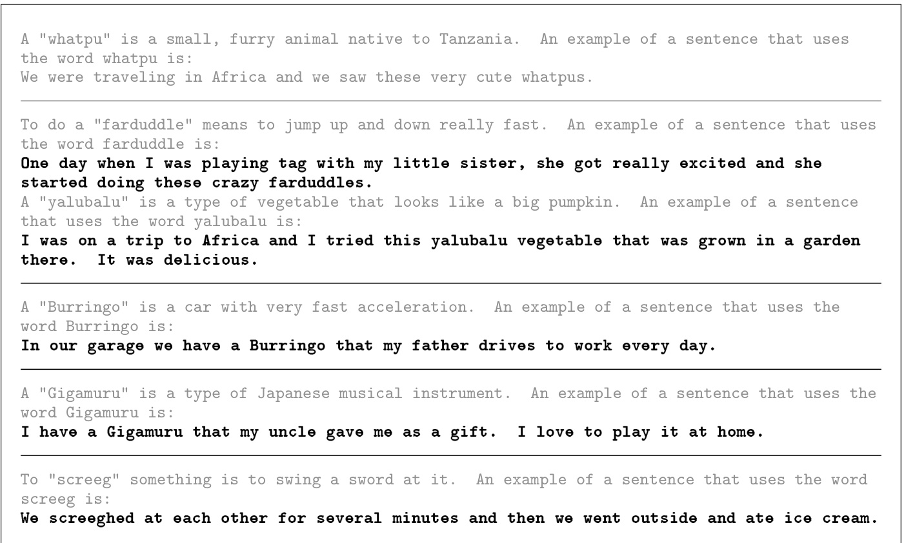
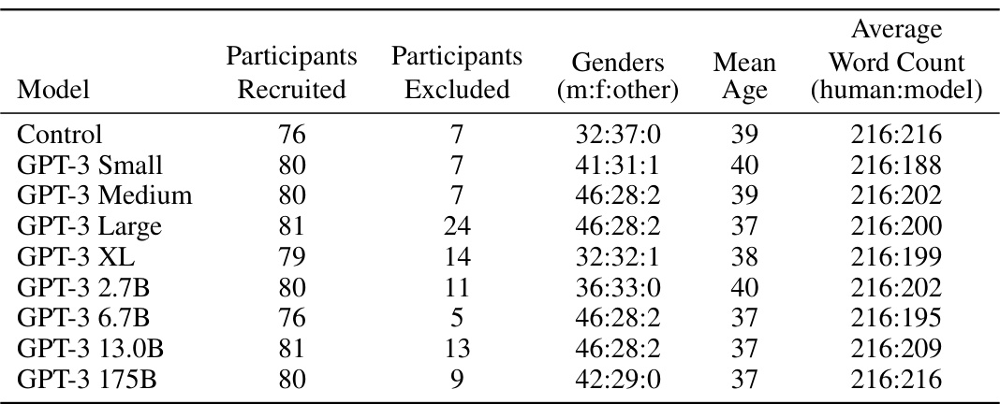
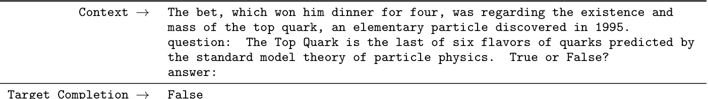

# Language Models are Few-Shot Learners  

  

# Abstract  

Recent work has demonstrated substantial gains on many NLP tasks and benchmarks by pre-training on a large corpus of text followed by fine-tuning on a specific task. While typically task-agnostic in architecture, this method still requires task-specific fine-tuning datasets of thousands or tens of thousands of examples. By contrast, humans can generally perform a new language task from only a few examples or from simple instructions – something which current NLP systems still largely struggle to do. Here we show that scaling up language models greatly improves task-agnostic, few-shot performance, sometimes even reaching competitiveness with prior state-of-the-art fine- tuning approaches. Specifically, we train GPT-3, an autoregressive language model with 175 billion parameters,   $10\mathbf{x}$   more than any previous non-sparse language model, and test its performance in the few-shot setting. For all tasks, GPT-3 is applied without any gradient updates or fine-tuning, with tasks and few-shot demonstrations specified purely via text interaction with the model. GPT-3 achieves strong performance on many NLP datasets, including translation, question-answering, and cloze tasks, as well as several tasks that require on-the-fly reasoning or domain adaptation, such as unscrambling words, using a novel word in a sentence, or performing 3-digit arithmetic. At the same time, we also identify some datasets where GPT-3’s few-shot learning still struggles, as well as some datasets where GPT-3 faces methodological issues related to training on large web corpora. Finally, we find that GPT-3 can generate samples of news articles which human evaluators have difficulty distinguishing from articles written by humans. We discuss broader societal impacts of this finding and of GPT-3 in general.  

# Contents  

1 Introduction 3  

# 2 Approach 6  

2.1 Model and Architectures . . . . . . . . . . . . . . . . . . . . . . . . . . . . . . . . . . . . . . . . . 8 2.2 Training Dataset . . . . . . . . . . . . . . . . . . . . . . . . . . . . . . . . . . . . . . . . . . . . . . 8 2.3 Training Process . . . . . . . . . . . . . . . . . . . . . . . . . . . . . . . . . . . . . . . . . . . . . 9 2.4 Evaluation . . . . . . . . . . . . . . . . . . . . . . . . . . . . . . . . . . . . . . . . . . . . . . . . . 10  

# 3 Results 10  

3.1 Language Modeling, Cloze, and Completion Tasks . . . . . . . . . . . . . . . . . . . . . . . . . . . 11 3.2 Closed Book Question Answering . . . . . . . . . . . . . . . . . . . . . . . . . . . . . . . . . . . . 13 3.3 Translation . . . . . . . . . . . . . . . . . . . . . . . . . . . . . . . . . . . . . . . . . . . . . . . . 14 3.4 Winograd-Style Tasks . . . . . . . . . . . . . . . . . . . . . . . . . . . . . . . . . . . . . . . . . . . 16 3.5 Common Sense Reasoning . . . . . . . . . . . . . . . . . . . . . . . . . . . . . . . . . . . . . . . . 17 3.6 Reading Comprehension . . . . . . . . . . . . . . . . . . . . . . . . . . . . . . . . . . . . . . . . . 18 3.7 SuperGLUE . . . . . . . . . . . . . . . . . . . . . . . . . . . . . . . . . . . . . . . . . . . . . . . . 18 3.8 NLI . . . . . . . . . . . . . . . . . . . . . . . . . . . . . . . . . . . . . . . . . . . . . . . . . . . . 20 3.9 Synthetic and Qualitative Tasks . . . . . . . . . . . . . . . . . . . . . . . . . . . . . . . . . . . . . . 21  

4 Measuring and Preventing Memorization Of Benchmarks 29  

5 Limitations 33  

# 6 Broader Impacts 34  

6.1 Misuse of Language Models . . . . . . . . . . . . . . . . . . . . . . . . . . . . . . . . . . . . . . . 35 6.2 Fairness, Bias, and Representation . . . . . . . . . . . . . . . . . . . . . . . . . . . . . . . . . . . . 36 6.3 Energy Usage . . . . . . . . . . . . . . . . . . . . . . . . . . . . . . . . . . . . . . . . . . . . . . . 39  

7 Related Work 39  

8 Conclusion 40 A Details of Common Crawl Filtering 43 B Details of Model Training 43 C Details of Test Set Contamination Studies 43 D Total Compute Used to Train Language Models 46 E Human Quality Assessment of Synthetic News Articles 46 F Additional Samples from GPT-3 48 G Details of Task Phrasing and Specifications 50 H Results on All Tasks for All Model Sizes 63  

# 1 Introduction  

Recent years have featured a trend towards pre-trained language representations in NLP systems, applied in increasingly flexible and task-agnostic ways for downstream transfer. First, single-layer representations were learned using word vectors [ MCCD13 ,  PSM14 ] and fed to task-specific architectures, then RNNs with multiple layers of representations and contextual state were used to form stronger representations [ DL15 ,  MBXS17 ,  PNZtY18 ] (though still applied to task-specific architectures), and more recently pre-trained recurrent or transformer language models   $[\mathrm{VSP^{+}}17]$   have been directly fine-tuned, entirely removing the need for task-specific architectures [ RNSS18 ,  DCLT18 ,  HR18 ].  

This last paradigm has led to substantial progress on many challenging NLP tasks such as reading comprehension, question answering, textual entailment, and many others, and has continued to advance based on new architectures and algorithms   $\mathrm{[RSR^{+}19}$  ,  $\mathrm{L O G^{+}}19$  ,  $\mathrm{Y}\mathrm{DY}^{+}19$  ,  $\mathrm{L}\dot{\mathrm{CCG}}^{+}19]$  . However, a major limitation to this approach is that while the architecture is task-agnostic, there is still a need for task-specific datasets and task-specific fine-tuning: to achieve strong performance on a desired task typically requires fine-tuning on a dataset of thousands to hundreds of thousands of examples specific to that task. Removing this limitation would be desirable, for several reasons.  

First, from a practical perspective, the need for a large dataset of labeled examples for every new task limits the applicability of language models. There exists a very wide range of possible useful language tasks, encompassing anything from correcting grammar, to generating examples of an abstract concept, to critiquing a short story. For many of these tasks it is difficult to collect a large supervised training dataset, especially when the process must be repeated for every new task.  

Second, the potential to exploit spurious correlations in training data fundamentally grows with the expressiveness of the model and the narrowness of the training distribution. This can create problems for the pre-training plus fine-tuning paradigm, where models are designed to be large to absorb information during pre-training, but are then fine-tuned on very narrow task distributions. For instance   $\mathrm{\bar{[}H L W^{+}}20]$   observe that larger models do not necessarily generalize better out-of-distribution. There is evidence that suggests that the generalization achieved under this paradigm can be poor because the model is overly specific to the training distribution and does not generalize well outside it  $\mathrm{[Ydec^{+}\bar{1}9}$  ,  MPL19 ]. Thus, the performance of fine-tuned models on specific benchmarks, even when it is nominally at human-level, may exaggerate actual performance on the underlying task   $[\mathrm{GSL}^{+}18$  ,  NK19 ].  

Third, humans do not require large supervised datasets to learn most language tasks – a brief directive in natural language (e.g. “please tell me if this sentence describes something happy or something sad”) or at most a tiny number of demonstrations (e.g. “here are two examples of people acting brave; please give a third example of bravery”) is often  

  
Figure 1.1: Language model meta-learning.  During unsupervised pre-training, a language model develops a broad set of skills and pattern recognition abilities. It then uses these abilities at inference time to rapidly adapt to or recognize the desired task. We use the term “in-context learning” to describe the inner loop of this process, which occurs within the forward-pass upon each sequence. The sequences in this diagram are not intended to be representative of the data a model would see during pre-training, but are intended to show that there are sometimes repeated sub-tasks embedded within a single sequence.  

  

sufficient to enable a human to perform a new task to at least a reasonable degree of competence. Aside from pointing to a conceptual limitation in our current NLP techniques, this adaptability has practical advantages – it allows humans to seamlessly mix together or switch between many tasks and skills, for example performing addition during a lengthy dialogue. To be broadly useful, we would someday like our NLP systems to have this same fluidity and generality.  

One potential route towards addressing these issues is meta-learning 1   – which in the context of language models means the model develops a broad set of skills and pattern recognition abilities at training time, and then uses those abilities at inference time to rapidly adapt to or recognize the desired task (illustrated in Figure  1.1 ). Recent work   $[\mathrm{RWC^{+}19}]$  attempts to do this via what we call “in-context learning”, using the text input of a pretrained language model as a form of task specification: the model is conditioned on a natural language instruction and/or a few demonstrations of the task and is then expected to complete further instances of the task simply by predicting what comes next.  

While it has shown some initial promise, this approach still achieves results far inferior to fine-tuning – for example  $[\mathrm{RWC^{+}19}]$   achieves only  $4\%$   on Natural Questions, and even its 55 F1 CoQa result is now more than 35 points behind the state of the art. Meta-learning clearly requires substantial improvement in order to be viable as a practical method of solving language tasks.  

Another recent trend in language modeling may offer a way forward. In recent years the capacity of transformer language models has increased substantially, from 100 million parameters [ RNSS18 ], to 300 million parameters [ DCLT18 ], to 1.5 billion parameters   $[\mathrm{RWC}^{+}\dot{1}9]$  , to 8 billion parameters   $\left[\mathrm{SPP^{+}}19\right]$  , 11 billion parameters   $\left[\mathrm{RSR^{+}}19\right]$  , and finally 17 billion parameters [ Tur20 ]. Each increase has brought improvements in text synthesis and/or downstream NLP tasks, and there is evidence suggesting that log loss, which correlates well with many downstream tasks, follows a smooth trend of improvement with scale   $[\mathrm{KMH^{+}}20]$  . Since in-context learning involves absorbing many skills and tasks within the parameters of the model, it is plausible that in-context learning abilities might show similarly strong gains with scale.  

  
Figure 1.3: Aggregate performance for all 42 accuracy-denominated benchmarks  While zero-shot performance improves steadily with model size, few-shot performance increases more rapidly, demonstrating that larger models are more proficient at in-context learning. See Figure  3.8  for a more detailed analysis on SuperGLUE, a standard NLP benchmark suite.  

In this paper, we test this hypothesis by training a 175 billion parameter autoregressive language model, which we call GPT-3, and measuring its in-context learning abilities. Specifically, we evaluate GPT-3 on over two dozen NLP datasets, as well as several novel tasks designed to test rapid adaptation to tasks unlikely to be directly contained in the training set. For each task, we evaluate GPT-3 under 3 conditions: (a) “few-shot learning”, or in-context learning where we allow as many demonstrations as will fit into the model’s context window (typically 10 to 100), (b) “one-shot learning”, where we allow only one demonstration, and (c) “zero-shot” learning, where no demonstrations are allowed and only an instruction in natural language is given to the model. GPT-3 could also in principle be evaluated in the traditional fine-tuning setting, but we leave this to future work.  

Figure  1.2  illustrates the conditions we study, and shows few-shot learning of a simple task requiring the model to remove extraneous symbols from a word. Model performance improves with the addition of a natural language task description, and with the number of examples in the model’s context,    $K$  . Few-shot learning also improves dramatically with model size. Though the results in this case are particularly striking, the general trends with both model size and number of examples in-context hold for most tasks we study. We emphasize that these “learning” curves involve no gradient updates or fine-tuning, just increasing numbers of demonstrations given as conditioning.  

Broadly, on NLP tasks GPT-3 achieves promising results in the zero-shot and one-shot settings, and in the the few-shot setting is sometimes competitive with or even occasionally surpasses state-of-the-art (despite state-of-the-art being held by fine-tuned models). For example, GPT-3 achieves 81.5 F1 on CoQA in the zero-shot setting, 84.0 F1 on CoQA in the one-shot setting,   $85.0\,\mathrm{F}1$   in the few-shot setting. Similarly, GPT-3 achieves  $64.3\%$   accuracy on TriviaQA in the zero-shot setting,   $68.0\%$   in the one-shot setting, and  $71.2\%$   in the few-shot setting, the last of which is state-of-the-art relative to fine-tuned models operating in the same closed-book setting.  

GPT-3 also displays one-shot and few-shot proficiency at tasks designed to test rapid adaption or on-the-fly reasoning, which include unscrambling words, performing arithmetic, and using novel words in a sentence after seeing them defined only once. We also show that in the few-shot setting, GPT-3 can generate synthetic news articles which human evaluators have difficulty distinguishing from human-generated articles.  

At the same time, we also find some tasks on which few-shot performance struggles, even at the scale of GPT-3. This includes natural language inference tasks like the ANLI dataset, and some reading comprehension datasets like RACE or QuAC. By presenting a broad characterization of GPT-3’s strengths and weaknesses, including these limitations, we hope to stimulate study of few-shot learning in language models and draw attention to where progress is most needed.  

A heuristic sense of the overall results can be seen in Figure  1.3 , which aggregates the various tasks (though it should not be seen as a rigorous or meaningful benchmark in itself).  

We also undertake a systematic study of “data contamination” – a growing problem when training high capacity models on datasets such as Common Crawl, which can potentially include content from test datasets simply because such content often exists on the web. In this paper we develop systematic tools to measure data contamination and quantify its distorting effects. Although we find that data contamination has a minimal effect on GPT-3’s performance on most datasets, we do identify a few datasets where it could be inflating results, and we either do not report results on these datasets or we note them with an asterisk, depending on the severity.  

In addition to all the above, we also train a series of smaller models (ranging from 125 million parameters to 13 billion parameters) in order to compare their performance to GPT-3 in the zero, one and few-shot settings. Broadly, for most tasks we find relatively smooth scaling with model capacity in all three settings; one notable pattern is that the gap between zero-, one-, and few-shot performance often grows with model capacity, perhaps suggesting that larger models are more proficient meta-learners.  

Finally, given the broad spectrum of capabilities displayed by GPT-3, we discuss concerns about bias, fairness, and broader societal impacts, and attempt a preliminary analysis of GPT-3’s characteristics in this regard.  

The remainder of this paper is organized as follows. In Section  2 , we describe our approach and methods for training GPT-3 and evaluating it. Section  3  presents results on the full range of tasks in the zero-, one- and few-shot settings. Section  4  addresses questions of data contamination (train-test overlap). Section  5  discusses limitations of GPT-3. Section  6  discusses broader impacts. Section  7  reviews related work and Section  8  concludes.  

# 2 Approach  

Our basic pre-training approach, including model, data, and training, is similar to the process described in   $[\mathrm{RWC^{+}19}]$  , with relatively straightforward scaling up of the model size, dataset size and diversity, and length of training. Our use of in-context learning is also similar to   $[\mathrm{RWC^{+}19}]$  , but in this work we systematically explore different settings for learning within the context. Therefore, we start this section by explicitly defining and contrasting the different settings that we will be evaluating GPT-3 on or could in principle evaluate GPT-3 on. These settings can be seen as lying on a spectrum of how much task-specific data they tend to rely on. Specifically, we can identify at least four points on this spectrum (see Figure  2.1  for an illustration):  

•  Fine-Tuning (FT)  has been the most common approach in recent years, and involves updating the weights of a pre-trained model by training on a supervised dataset specific to the desired task. Typically thousands to hundreds of thousands of labeled examples are used. The main advantage of fine-tuning is strong performance on many benchmarks. The main disadvantages are the need for a new large dataset for every task, the potential for poor generalization out-of-distribution [ MPL19 ], and the potential to exploit spurious features of the training data   $[\mathrm{GSL}^{+}18$  ,  NK19 ], potentially resulting in an unfair comparison with human performance. In this work we do not fine-tune GPT-3 because our focus is on task-agnostic performance, but GPT-3 can be fine-tuned in principle and this is a promising direction for future work.  

•  Few-Shot (FS)  is the term we will use in this work to refer to the setting where the model is given a few demonstrations of the task at inference time as conditioning   $[\mathrm{RWC^{+}19}]$  , but no weight updates are allowed. As shown in Figure  2.1 , for a typical dataset an example has a context and a desired completion (for example an English sentence and the French translation), and few-shot works by giving  $K$   examples of context and completion, and then one final example of context, with the model expected to provide the completion. We typically set  $K$   in the range of 10 to 100 as this is how many examples can fit in the model’s context window  $(n_{\mathrm{ctx}}=2048)$  ). The main advantages of few-shot are a major reduction in the need for task-specific data and reduced potential to learn an overly narrow distribution from a large but narrow fine-tuning dataset. The main disadvantage is that results from this method have so far been much worse than state-of-the-art fine-tuned models. Also, a small amount of task specific data is still required. As indicated by the name, few-shot learning as described here for language models is related to few-shot learning as used in other contexts in ML [ HYC01 ,  $\mathrm{VBL^{+}16}]$   – both involve learning based on a broad distribution of tasks (in this case implicit in the pre-training data) and then rapidly adapting to a new task.  

•  One-Shot (1S)  is the same as few-shot except that only one demonstration is allowed, in addition to a natural language description of the task, as shown in Figure 1. The reason to distinguish one-shot from few-shot and zero-shot (below) is that it most closely matches the way in which some tasks are communicated to humans. For example, when asking humans to generate a dataset on a human worker service (for example Mechanical Turk), it is common to give one demonstration of the task. By contrast it is sometimes difficult to communicate the content or format of a task if no examples are given.  

  

•  Zero-Shot (0S)  is the same as one-shot except that no demonstrations are allowed, and the model is only given a natural language instruction describing the task. This method provides maximum convenience, potential for robustness, and avoidance of spurious correlations (unless they occur very broadly across the large corpus of pre-training data), but is also the most challenging setting. In some cases it may even be difficult for humans to understand the format of the task without prior examples, so this setting is in some cases “unfairly hard”. For example, if someone is asked to “make a table of world records for the  $200\mathrm{m}$   dash”, this request can be ambiguous, as it may not be clear exactly what format the table should have or what should be included (and even with careful clarification, understanding precisely what is desired can be difficult). Nevertheless, for at least some settings zero-shot is closest to how humans perform tasks – for example, in the translation example in Figure  2.1 , a human would likely know what to do from just the text instruction.  

Figure  2.1  shows the four methods using the example of translating English to French. In this paper we focus on zero-shot, one-shot and few-shot, with the aim of comparing them not as competing alternatives, but as different problem settings which offer a varying trade-off between performance on specific benchmarks and sample efficiency. We especially highlight the few-shot results as many of them are only slightly behind state-of-the-art fine-tuned models. Ultimately, however, one-shot, or even sometimes zero-shot, seem like the fairest comparisons to human performance, and are important targets for future work.  

Sections  2.1 - 2.3  below give details on our models, training data, and training process respectively. Section  2.4  discusses the details of how we do few-shot, one-shot, and zero-shot evaluations.  

  

# 2.1 Model and Architectures  

We use the same model and architecture as GPT-2   $[\mathrm{RWC}^{+}19]$  , including the modified initialization, pre-normalization, and reversible tokenization described therein, with the exception that we use alternating dense and locally banded sparse attention patterns in the layers of the transformer, similar to the Sparse Transformer [ CGRS19 ]. To study the dependence of ML performance on model size, we train 8 different sizes of model, ranging over three orders of magnitude from 125 million parameters to 175 billion parameters, with the last being the model we call GPT-3. Previous work   $[\mathrm{KMH^{+}}20]$  suggests that with enough training data, scaling of validation loss should be approximately a smooth power law as a function of size; training models of many different sizes allows us to test this hypothesis both for validation loss and for downstream language tasks.  

Table  2.1  shows the sizes and architectures of our 8 models. Here  $n_{\mathrm{parts}}$   is the total number of trainable parameters,  $n_{\mathrm{llayers}}$   is the total number of layers,    $d_{\mathrm{model}}$   is the number of units in each bottleneck layer (we always have the feedforward layer four times the size of the bottlen  $d_{\mathrm{ff}}=4*d_{\mathrm{model}})$  , and    $d_{\mathrm{head}}$   is the dimension of each attention head. All models use a context window of  $n_{\mathrm{ctx}}=2048$   tokens. We partition the model across GPUs along both the depth and width dimension in order to minimize data-transfer between nodes. The precise architectural parameters for each model are chosen based on computational efficiency and load-balancing in the layout of models across GPU’s. Previous work   $[\mathrm{KMH^{+}}20]$   suggests that validation loss is not strongly sensitive to these parameters within a reasonably broad range.  

# 2.2 Training Dataset  

Datasets for language models have rapidly expanded, culminating in the Common Crawl dataset 2  $[\mathrm{RSR^{+}19}]$   constituting nearly a trillion words. This size of dataset is sufficient to train our largest models without ever updating on the same sequence twice. However, we have found that unfiltered or lightly filtered versions of Common Crawl tend to have lower quality than more curated datasets. Therefore, we took 3 steps to improve the average quality of our datasets: (1) we downloaded and filtered a version of CommonCrawl based on similarity to a range of high-quality reference corpora, (2) we performed fuzzy deduplication at the document level, within and across datasets, to prevent redundancy and preserve the integrity of our held-out validation set as an accurate measure of overfitting, and (3) we also added known high-quality reference corpora to the training mix to augment CommonCrawl and increase its diversity.  

Details of the first two points (processing of Common Crawl) are described in Appendix  A . For the third, we added several curated high-quality datasets, including an expanded version of the WebText dataset [ RWC + 19 ], collected by scraping links over a longer period of time, and first described in   $[\mathrm{KMH^{+}}20]$  , two internet-based books corpora (Books1 and Books2) and English-language Wikipedia.  

Table  2.2  shows the final mixture of datasets that we used in training. The CommonCrawl data was downloaded from 41 shards of monthly CommonCrawl covering 2016 to 2019, constituting 45TB of compressed plaintext before filtering and 570GB after filtering, roughly equivalent to 400 billion byte-pair-encoded tokens. Note that during training, datasets are not sampled in proportion to their size, but rather datasets we view as higher-quality are sampled more frequently, such that CommonCrawl and Books2 datasets are sampled less than once during training, but the other datasets are sampled 2-3 times. This essentially accepts a small amount of overfitting in exchange for higher quality training data.  

  
Figure 2.2: Total compute used during training . Based on the analysis in Scaling Laws For Neural Language Models  $[\bar{\mathrm{KMH^{+}}}20]$   we train much larger models on many fewer tokens than is typical. As a consequence, although GPT-3 3B is almost   $10\mathbf{x}$   larger than RoBERTa-Large (355M params), both models took roughly 50 petaflop/s-days of compute during pre-training. Methodology for these calculations can be found in Appendix  D .  

  

A major methodological concern with language models pretrained on a broad swath of internet data, particularly large models with the capacity to memorize vast amounts of content, is potential contamination of downstream tasks by having their test or development sets inadvertently seen during pre-training. To reduce such contamination, we searched for and attempted to remove any overlaps with the development and test sets of all benchmarks studied in this paper. Unfortunately, a bug in the filtering caused us to ignore some overlaps, and due to the cost of training it was not feasible to retrain the model. In Section  4  we characterize the impact of the remaining overlaps, and in future work we will more aggressively remove data contamination.  

# 2.3 Training Process  

As found in   $[\mathrm{KMH^{+}}20$  ,  MKAT18 ], larger models can typically use a larger batch size, but require a smaller learning rate. We measure the gradient noise scale during training and use it to guide our choice of batch size [ MKAT18 ]. Table 2.1  shows the parameter settings we used. To train the larger models without running out of memory, we use a mixture of model parallelism within each matrix multiply and model parallelism across the layers of the network. All models were trained on V100 GPU’s on part of a high-bandwidth cluster provided by Microsoft. Details of the training process and hyperparameter settings are described in Appendix  B .  

For few-shot learning, we evaluate each example in the evaluation set by randomly drawing    $K$   examples from that task’s training set as conditioning, delimited by 1 or 2 newlines depending on the task. For LAMBADA and Storycloze there is no supervised training set available so we draw conditioning examples from the development set and evaluate on the test set. For Winograd (the original, not SuperGLUE version) there is only one dataset, so we draw conditioning examples directly from it.  

$K$   can be any value from 0 to the maximum amount allowed by the model’s context window, which is  $n_{\mathrm{ctx}}=2048$  for all models and typically fits  10  to  100  examples. Larger values of    $K$   are usually but not always better, so when a separate development and test set are available, we experiment with a few values of    $K$   on the development set and then run the best value on the test set. For some tasks (see Appendix  G ) we also use a natural language prompt in addition to (or for    $K=0$  , instead of) demonstrations.  

On tasks that involve choosing one correct completion from several options (multiple choice), we provide    $K$   examples of context plus correct completion, followed by one example of context only, and compare the LM likelihood of each completion. For most tasks we compare the per-token likelihood (to normalize for length), however on a small number of datasets (ARC, OpenBookQA, and RACE) we gain additional benefit as measured on the development set by normalizing by the unconditional probability of each completion, by computing  $\frac{P(\mathrm{compiecewise|context})}{P(\mathrm{compi}|\mathrm{angular-context})}$  , where | answer context  is the string  "Answer: "  or  "A: "  and is used to prompt that the completion should be an answer but is otherwise generic.  

On tasks that involve binary classification, we give the options more semantically meaningful names (e.g. “True” or “False” rather than 0 or 1) and then treat the task like multiple choice; we also sometimes frame the task similar to what is done by  $[\mathrm{RSR^{+}19}]$   (see Appendix  G ) for details.  

On tasks with free-form completion, we use beam search with the same parameters as   $[\mathrm{RSR^{+}19}]$  : a beam width of 4 and a length penalty of  $\alpha=0.6$  . We score the model using F1 similarity score, BLEU, or exact match, depending on what is standard for the dataset at hand.  

Final results are reported on the test set when publicly available, for each model size and learning setting (zero-, one-, and few-shot). When the test set is private, our model is often too large to fit on the test server, so we report results on the development set. We do submit to the test server on a small number of datasets (SuperGLUE, TriviaQA, PiQa) where we were able to make submission work, and we submit only the 200B few-shot results, and report development set results for everything else.  

# 3 Results  

In Figure  3.1  we display training curves for the 8 models described in Section  2 . For this graph we also include 6 additional extra-small models with as few as 100,000 parameters. As observed in   $[\mathrm{KMH^{+}}20]$  , language modeling performance follows a power-law when making efficient use of training compute. After extending this trend by two more orders of magnitude, we observe only a slight (if any) departure from the power-law. One might worry that these improvements in cross-entropy loss come only from modeling spurious details of our training corpus. However, we will see in the following sections that improvements in cross-entropy loss lead to consistent performance gains across a broad spectrum of natural language tasks.  

Below, we evaluate the 8 models described in Section  2  (the 175 billion parameter parameter GPT-3 and 7 smaller models) on a wide range of datasets. We group the datasets into 9 categories representing roughly similar tasks.  

In Section  3.1  we evaluate on traditional language modeling tasks and tasks that are similar to language modeling, such as Cloze tasks and sentence/paragraph completion tasks. In Section  3.2  we evaluate on “closed book” question answering tasks: tasks which require using the information stored in the model’s parameters to answer general knowledge questions. In Section  3.3  we evaluate the model’s ability to translate between languages (especially one-shot and few-shot). In Section  3.4  we evaluate the model’s performance on Winograd Schema-like tasks. In Section  3.5  we evaluate on datasets that involve commonsense reasoning or question answering. In Section  3.6  we evaluate on reading comprehension tasks, in Section  3.7  we evaluate on the SuperGLUE benchmark suite, and in  3.8  we briefly explore NLI. Finally, in Section  3.9 , we invent some additional tasks designed especially to probe in-context learning abilities – these tasks focus on on-the-fly reasoning, adaptation skills, or open-ended text synthesis. We evaluate all tasks in the few-shot, one-shot, and zero-shot settings.  

  
Figure 3.1: Smooth scaling of performance with compute.  Performance (measured in terms of cross-entropy validation loss) follows a power-law trend with the amount of compute used for training. The power-law behavior observed in   $[\mathrm{KMH^{+}}20]$   continues for an additional two orders of magnitude with only small deviations from the predicted curve. For this figure, we exclude embedding parameters from compute and parameter counts.  

  

# 3.1 Language Modeling, Cloze, and Completion Tasks  

In this section we test GPT-3’s performance on the traditional task of language modeling, as well as related tasks that involve predicting a single word of interest, completing a sentence or paragraph, or choosing between possible completions of a piece of text.  

# 3.1.1 Language Modeling  

We calculate zero-shot perplexity on the Penn Tree Bank (PTB)   $[\mathrm{MKM^{+}94}]$   dataset measured in   $[\mathrm{RWC^{+}19}]$  . We omit the 4 Wikipedia-related tasks in that work because they are entirely contained in our training data, and we also omit the one-billion word benchmark due to a high fraction of the dataset being contained in our training set. PTB escapes these issues due to predating the modern internet. Our largest model sets a new SOTA on PTB by a substantial margin of 15 points, achieving a perplexity of 20.50. Note that since PTB is a traditional language modeling dataset it does not have a clear separation of examples to define one-shot or few-shot evaluation around, so we measure only zero-shot.  

# 3.1.2 LAMBADA  

The LAMBADA dataset   $[\mathrm{PKL}^{+}16]$   tests the modeling of long-range dependencies in text – the model is asked to predict the last word of sentences which require reading a paragraph of context. It has recently been suggested that the continued scaling of language models is yielding diminishing returns on this difficult benchmark.  $[\mathrm{BHT^{+}}20]$   reflect on the small   $1.5\%$   improvement achieved by a doubling of model size between two recent state of the art results   $(\mathrm{[SPP^{+}19]}$  

  

  
Figure 3.2:  On LAMBADA, the few-shot capability of language models results in a strong boost to accuracy. GPT-3 2.7B outperforms the SOTA 17B parameter Turing-NLG [ Tur20 ] in this setting, and GPT-3 175B advances the state of the art by   $18\%$  . Note zero-shot uses a different format from one-shot and few-shot as described in the text.  

and  $[\mathrm{Tur}20]$  ) and argue that “continuing to expand hardware and data sizes by orders of magnitude is not the path forward”. We find that path is still promising and in a zero-shot setting GPT-3 achieves  $76\%$   on LAMBADA, a gain of  $8\%$   over the previous state of the art.  

LAMBADA is also a demonstration of the flexibility of few-shot learning as it provides a way to address a problem that classically occurs with this dataset. Although the completion in LAMBADA is always the last word in a sentence, a standard language model has no way of knowing this detail. It thus assigns probability not only to the correct ending but also to other valid continuations of the paragraph. This problem has been partially addressed in the past with stop-word filters   $[\mathrm{RWC^{+}19}]$   (which ban “continuation” words). The few-shot setting instead allows us to “frame” the task as a cloze-test and allows the language model to infer from examples that a completion of exactly one word is desired. We use the following fill-in-the-blank format:  

When presented with examples formatted this way, GPT-3 achieves   $86.4\%$   accuracy in the few-shot setting, an increase of over   $18\%$   from the previous state-of-the-art. We observe that few-shot performance improves strongly with model size. While this setting decreases the performance of the smallest model by almost  $20\%$  , for GPT-3 it improves accuracy by  $10\%$  . Finally, the fill-in-blank method is not effective one-shot, where it always performs worse than the zero-shot setting. Perhaps this is because all models still require several examples to recognize the pattern.  

  

One note of caution is that an analysis of test set contamination identified that a significant minority of the LAMBADA dataset appears to be present in our training data – however analysis performed in Section  4  suggests negligible impact on performance.  

# 3.1.3 HellaSwag  

The HellaSwag dataset   $[Z\mathrm{HB}^{+}19]$   involves picking the best ending to a story or set of instructions. The examples were adversarially mined to be difficult for language models while remaining easy for humans (who achieve   $95.6\%$   accuracy). GPT-3 achieves  $78.1\%$   accuracy in the one-shot setting and  $79.3\%$   accuracy in the few-shot setting, outperforming the  $75.4\%$   accuracy of a fine-tuned 1.5B parameter language model   $[Z\mathrm{HR}^{+}19]$   but still a fair amount lower than the overall SOTA of   $85.6\%$   achieved by the fine-tuned multi-task model ALUM.  

# 3.1.4 StoryCloze  

We next evaluate GPT-3 on the StoryCloze 2016 dataset   $[\mathrm{MCH^{+}}16]$  , which involves selecting the correct ending sentence for five-sentence long stories. Here GPT-3 achieves  $83.2\%$   in the zero-shot setting and  $87.7\%$   in the few-shot setting (with    $K=70$  ). This is still  $4.1\%$   lower than the fine-tuned SOTA using a BERT based model [ LDL19 ] but improves over previous zero-shot results by roughly   $10\%$  .  

# 3.2 Closed Book Question Answering  

In this section we measure GPT-3’s ability to answer questions about broad factual knowledge. Due to the immense amount of possible queries, this task has normally been approached by using an information retrieval system to find relevant text in combination with a model which learns to generate an answer given the question and the retrieved text. Since this setting allows a system to search for and condition on text which potentially contains the answer it is denoted “open-book”. [ RRS20 ] recently demonstrated that a large language model can perform surprisingly well directly answering the questions without conditioning on auxilliary information. They denote this more restrictive evaluation setting as “closed-book”. Their work suggests that even higher-capacity models could perform even better and we test this hypothesis with GPT-3. We evaluate GPT-3 on the 3 datasets in [ RRS20 ]: Natural Questions  $[\mathrm{KPR}^{+}19]$  , WebQuestions [ BCFL13 ], and TriviaQA [ JCWZ17 ], using the same splits. Note that in addition to all results being in the closed-book setting, our use of few-shot, one-shot, and zero-shot evaluations represent an even stricter setting than previous closed-book QA work: in addition to external content not being allowed, fine-tuning on the Q&A dataset itself is also not permitted.  

The results for GPT-3 are shown in Table  3.3 . On TriviaQA, we achieve  $64.3\%$   in the zero-shot setting,  $68.0\%$   in the one-shot setting, and   $71.2\%$   in the few-shot setting. The zero-shot result already outperforms the fine-tuned T5-11B by  $14.2\%$  , and also outperforms a version with Q&A tailored span prediction during pre-training by   $3.8\%$  . The one-shot result improves by   $3.7\%$   and matches the SOTA for an open-domain QA system which not only fine-tunes but also makes use of a learned retrieval mechanism over a 15.3B parameter dense vector index of 21M documents  $[\mathrm{LPP^{+}}20]$  . GPT-3’s few-shot result further improves performance another   $3.2\%$   beyond this.  

On WebQuestions (WebQs), GPT-3 achieves   $14.4\%$   in the zero-shot setting,  $25.3\%$   in the one-shot setting, and   $41.5\%$  in the few-shot setting. This compares to   $37.4\%$   for fine-tuned T5-11B, and  $44.7\%$   for fine-tuned   $\mathrm{T5–11B+SSM}$  , which uses a Q&A-specific pre-training procedure. GPT-3 in the few-shot setting approaches the performance of state-of-the-art fine-tuned models. Notably, compared to TriviaQA, WebQS shows a much larger gain from zero-shot to few-shot (and indeed its zero-shot and one-shot performance are poor), perhaps suggesting that the WebQs questions  

  
Figure 3.3:  On TriviaQA GPT3’s performance grows smoothly with model size, suggesting that language models continue to absorb knowledge as their capacity increases. One-shot and few-shot performance make significant gains over zero-shot behavior, matching and exceeding the performance of the SOTA fine-tuned open-domain model, RAG  $[\mathrm{LPP^{+}20}]$  

and/or the style of their answers are out-of-distribution for GPT-3. Nevertheless, GPT-3 appears able to adapt to this distribution, recovering strong performance in the few-shot setting.  

On Natural Questions (NQs) GPT-3 achieves  $14.6\%$   in the zero-shot setting,  $23.0\%$   in the one-shot setting, and   $29.9\%$   in the few-shot setting, compared to  $36.6\%$   for fine-tuned T5   $11\mathbf{B}\mathbf{+}\mathbf{SSM}$  . Similar to WebQS, the large gain from zero-shot to few-shot may suggest a distribution shift, and may also explain the less competitive performance compared to TriviaQA and WebQS. In particular, the questions in NQs tend towards very fine-grained knowledge on Wikipedia specifically which could be testing the limits of GPT-3’s capacity and broad pretraining distribution.  

Overall, on one of the three datasets GPT-3’s one-shot matches the open-domain fine-tuning SOTA. On the other two datasets it approaches the performance of the closed-book SOTA despite not using fine-tuning. On all 3 datasets, we find that performance scales very smoothly with model size (Figure  3.3  and Appendix  H  Figure  H.7 ), possibly reflecting the idea that model capacity translates directly to more ‘knowledge’ absorbed in the parameters of the model.  

# 3.3 Translation  

For GPT-2 a filter was used on a multilingual collection of documents to produce an English only dataset due to capacity concerns. Even with this filtering GPT-2 showed some evidence of multilingual capability and performed non-trivially when translating between French and English despite only training on 10 megabytes of remaining French text. Since we increase the capacity by over two orders of magnitude from GPT-2 to GPT-3, we also expand the scope of the training dataset to include more representation of other languages, though this remains an area for further improvement. As discussed in  2.2  the majority of our data is derived from raw Common Crawl with only quality-based filtering. Although GPT-3’s training data is still primarily English (  $93\%$   by word count), it also includes  $7\%$   of text in other languages. These languages are documented in the  supplemental material . In order to better understand translation capability, we also expand our analysis to include two additional commonly studied languages, German and Romanian.  

Existing unsupervised machine translation approaches often combine pretraining on a pair of monolingual datasets with back-translation [ SHB15 ] to bridge the two languages in a controlled way. By contrast, GPT-3 learns from a blend of training data that mixes many languages together in a natural way, combining them on a word, sentence, and document level. GPT-3 also uses a single training objective which is not customized or designed for any task in particular. However, our one / few-shot settings aren’t strictly comparable to prior unsupervised work since they make use of a small amount of paired examples (1 or 64). This corresponds to up to a page or two of in-context training data.  

Results are shown in Table  3.4 . Zero-shot GPT-3, which only receives on a natural language description of the task, still underperforms recent unsupervised NMT results. However, providing only a single example demonstration for  

  

Table 3.4: Few-shot GPT-3 outperforms previous unsupervised NMT work by 5 BLEU when translating into Engl ecting its streng n English LM.  We report BLEU scores on the WMT’14   $\mathrm{Fr}{\leftrightarrow}\mathrm{En}$  , WMT’16 De  $\scriptstyle\mathrm{De}\leftrightarrow\mathrm{En}$  ↔ En, and WMT’16 Ro  $\scriptstyle{\mathrm{Ro}}\leftrightarrow\scriptstyle{\mathrm{En}}$  ↔ En datasets as measured by  multi-bleu.perl  with XLM’s tokeniza- tion in order to compare most closely with prior unsupervised NMT work. SacreBLEU f   [ Pos18 ] results re- ported in Appendix  H . Underline indicates an unsupervised or few-shot SOTA, bold indicates supervised SOTA with relative confidence. a [ EOAG18 ]  b [ DHKH14 ]    $^c[\mathrm{WXH^{+}18}]$   d [ oR16 ]    $^{e}[\mathrm{LGG}^{+}20]$   f  [SacreBLEU signature: BLEU  $^+$  case.mixed+numrefs.  $1+$  smooth.exp+tok.intl+version.1.2.20]  

  
Figure 3.4:  Few-shot translation performance on 6 language pairs as model capacity increases. There is a consistent trend of improvement across all datasets as the model scales, and as well as tendency for translation into English to be stronger than translation from English.  

  

  
Figure 3.5:  Zero-, one-, and few-shot performance on the adversarial Winogrande dataset as model capacity scales. Scaling is relatively smooth with the gains to few-shot learning increasing with model size, and few-shot GPT-3 175B is competitive with a fine-tuned RoBERTA-large.  

each translation task improves performance by over 7 BLEU and nears competitive performance with prior work. GPT-3 in the full few-shot setting further improves another 4 BLEU resulting in similar average performance to prior unsupervised NMT work. GPT-3 has a noticeable skew in its performance depending on language direction. For the three input languages studied, GPT-3 significantly outperforms prior unsupervised NMT work when translating into English but underperforms when translating in the other direction. Performance on En-Ro is a noticeable outlier at over 10 BLEU worse than prior unsupervised NMT work. This could be a weakness due to reusing the byte-level BPE tokenizer of GPT-2 which was developed for an almost entirely English training dataset. For both Fr-En and De-En, few shot GPT-3 outperforms the best supervised result we could find but due to our unfamiliarity with the literature and the appearance that these are un-competitive benchmarks we do not suspect those results represent true state of the art. For Ro-En, few shot GPT-3 performs within 0.5 BLEU of the overall SOTA which is achieved by a combination of unsupervised pretraining, supervised finetuning on 608K labeled examples, and backtranslation [ LHCG19b ].  

Finally, across all language pairs and across all three settings (zero-, one-, and few-shot), there is a smooth trend of improvement with model capacity. This is shown in Figure  3.4  in the case of few-shot results, and scaling for all three settings is shown in Appendix  H .  

# 3.4 Winograd-Style Tasks  

The Winograd Schemas Challenge [ LDM12 ] is a classical task in NLP that involves determining which word a pronoun refers to, when the pronoun is grammatically ambiguous but semantically unambiguous to a human. Recently fine-tuned language models have achieved near-human performance on the original Winograd dataset, but more difficult versions  

  

  
Figure 3.6:  GPT-3 results on PIQA in the zero-shot, one-shot, and few-shot settings. The largest model achieves a score on the development set in all three conditions that exceeds the best recorded score on the task.  

such as the adversarially-mined Winogrande dataset [ SBBC19 ] still significantly lag human performance. We test GPT-3’s performance on both Winograd and Winogrande, as usual in the zero-, one-, and few-shot setting.  

On Winograd we test GPT-3 on the original set of 273 Winograd schemas, using the same “partial evaluation” method described in   $[\mathrm{RWC^{+}19}]$  . Note that this setting differs slightly from the WSC task in the SuperGLUE benchmark, which is presented as binary classification and requires entity extraction to convert to the form described in this section. On Winograd GPT-3 achieves  $88.3\%$  ,  $89.7\%$  , and  $88.6\%$   in the zero-shot, one-shot, and few-shot settings, showing no clear in-context learning but in all cases achieving strong results just a few points below state-of-the-art and estimated human performance. We note that contamination analysis found some Winograd schemas in the training data but this appears to have only a small effect on results (see Section  4 ).  

On the more difficult Winogrande dataset, we do find gains to in-context learning: GPT-3 achieves  $70.2\%$   in the zero-shot setting,   $73.2\%$   in the one-shot setting, and   $77.7\%$   in the few-shot setting. For comparison a fine-tuned RoBERTA model achieves   $79\%$  , state-of-the-art is   $84.6\%$   achieved with a fine-tuned high capacity model (T5), and human performance on the task as reported by [ SBBC19 ] is  $94.0\%$  .  

# 3.5 Common Sense Reasoning  

Next we consider three datasets which attempt to capture physical or scientific reasoning, as distinct from sentence completion, reading comprehension, or broad knowledge question answering. The first, PhysicalQA (PIQA)  $\mathrm{[BZB^{+}19]}$  , asks common sense questions about how the physical world works and is intended as a probe of grounded understanding of the world. GPT-3 achieves   $81.0\%$   accuracy zero-shot,   $80.5\%$   accuracy one-shot, and   $82.8\%$   accuracy few-shot (the last measured on PIQA’s test server). This compares favorably to the   $79.4\%$   accuracy prior state-of-the-art of a  

![Table 3.7:  Results on reading comprehension tasks. All scores are F1 except results for RACE which report accuracy.  $^a[\mathrm{JZC^{+}19}]$   b [ JN20 ]  c [ AI19 ]  d [ QIA20 ]  $^{e}[\mathrm{SP}^{+}19]$  ](images/23f7756014c0ad52558f3e2101e555f034a4d65bddb15f293fc4d1e1dc54ceb1.jpg)  

fine-tuned RoBERTa. PIQA shows relatively shallow scaling with model size and is still over   $10\%$   worse than human performance, but GPT-3’s few-shot and even zero-shot result outperform the current state-of-the-art. Our analysis flagged PIQA for a potential data contamination issue (despite hidden test labels), and we therefore conservatively mark the result with an asterisk. See Section  4  for details.  

ARC   $\left[\mathrm{CCE^{+}18}\right]$   is a dataset of multiple-choice questions collected from 3rd to 9th grade science exams. On the “Challenge” version of the dataset which has been filtered to questions which simple statistical or information retrieval methods are unable to correctly answer, GPT-3 achieves  $51.4\%$   accuracy in the zero-shot setting,  $53.2\%$   in the one-shot setting, and  $51.5\%$   in the few-shot setting. This is approaching the performance of a fine-tuned RoBERTa baseline  $(55.9\%)$   from UnifiedQA   $[\mathrm{KKS^{+}}20]$  . On the “Easy” version of the dataset (questions which either of the mentioned baseline approaches answered correctly), GPT-3 achieves  $68.8\%$  ,  $71.2\%$  , and   $70.1\%$   which slightly exceeds a fine-tuned RoBERTa baseline from   $[\mathrm{KKS^{+}}20]$  . However, both of these results are still much worse than the overall SOTAs achieved by the UnifiedQA which exceeds GPT-3’s few-shot results by  $27\%$   on the challenge set and   $22\%$   on the easy set.  

On OpenBookQA [ MCKS18 ], GPT-3 improves significantly from zero to few shot settings but is still over 20 points short of the overall SOTA. GPT-3’s few-shot performance is similar to a fine-tuned BERT Large baseline on the leaderboard.  

Overall, in-context learning with GPT-3 shows mixed results on commonsense reasoning tasks, with only small and inconsistent gains observed in the one and few-shot learning settings for both PIQA and ARC, but a significant improvement is observed on OpenBookQA. GPT-3 sets SOTA on the new PIQA dataset in all evaluation settings.  

# 3.6 Reading Comprehension  

Next we evaluate GPT-3 on the task of reading comprehension. We use a suite of 5 datasets including abstractive, multiple choice, and span based answer formats in both dialog and single question settings. We observe a wide spread in GPT-3’s performance across these datasets suggestive of varying capability with different answer formats. In general we observe GPT-3 is on par with initial baselines and early results trained using contextual representations on each respective dataset.  

GPT-3 performs best (within 3 points of the human baseline) on CoQA [ RCM19 ] a free-form conversational dataset and performs worst (13 F1 below an ELMo baseline) on QuAC   $[\mathrm{CHI}^{+}18]$   a dataset which requires modeling structured dialog acts and answer span selections of teacher-student interactions. On DROP   $[\mathrm{DWD^{+}19}]$  , a dataset testing discrete reasoning and numeracy in the context of reading comprehension, GPT-3 in a few-shot setting outperforms the fine-tuned BERT baseline from the original paper but is still well below both human performance and state-of-the-art approaches which augment neural networks with symbolic systems   $[\mathrm{RLL^{+}19}]$  . On SQuAD 2.0 [ RJL18 ], GPT-3 demonstrates its few-shot learning capabilities, improving by almost  $10\,\mathrm{F}1$   (to 69.8) compared to a zero-shot setting. This allows it to slightly outperform the best fine-tuned result in the original paper. On RACE  $[\mathrm{LXL}^{+}17]$  , a multiple choice dataset of middle school and high school english examinations, GPT-3 performs relatively weakly and is only competitive with the earliest work utilizing contextual representations and is still  $45\%$   behind SOTA.  

# 3.7 SuperGLUE  

In order to better aggregate results on NLP tasks and compare to popular models such as BERT and RoBERTa in a more systematic way, we also evaluate GPT-3 on a standardized collection of datasets, the SuperGLUE benchmark

  $[\mathrm{WDN}^{\dot{+}}19]$   $\mathrm{[WPV^{+}\bar{1}9]}$     $[\mathrm{CLC}^{+}19]$  ] [ DMST19 ] [ RBG11 ]   $[\mathrm{KCR}^{+}18]$  ]   $[\mathrm{ZLL^{+}18}]$   [ DGM06 ]   $[\mathrm{BHDD^{+}06}]$   [ GMDD07 ]

  $[\mathrm{BDD^{+}09}]$   [ PCC18 ]  $[\mathrm{PHR^{+}18}]$  . GPT-3’s test-set performance on the SuperGLUE dataset is shown in Table  3.8 . In the few-shot setting, we used 32 examples for all tasks, sampled randomly from the training set. For all tasks except WSC  

  
Figure 3.7:  GPT-3 results on CoQA reading comprehension task. GPT-3 175B achieves 85 F1 in the few-shot setting, only a few points behind measured human performance and state-of-the-art fine-tuned models. Zero-shot and one-shot performance is a few points behind, with the gains to few-shot being largest for bigger models.  

  

Table 3.8:  Performance of GPT-3 on SuperGLUE compared to fine-tuned baselines and SOTA. All results are reported on the test set. GPT-3 few-shot is given a total of 32 examples within the context of each task and performs no gradient updates.  

  
Figure 3.8: Performance on SuperGLUE increases with model size and number of examples in context.  A value of  $K=32$   means that our model was shown 32 examples per task, for 256 examples total divided across the 8 tasks in SuperGLUE. We report GPT-3 values on the dev set, so our numbers are not directly comparable to the dotted reference lines (our test set results are in Table  3.8 ). The BERT-Large reference model was fine-tuned on the SuperGLUE training set (125K examples), whereas  $\mathrm{BERT++}$   was first fine-tuned on MultiNLI (392K examples) and SWAG (113K examples) before further fine-tuning on the SuperGLUE training set (for a total of 630K fine-tuning examples). We find the difference in performance between the BERT-Large and  $\mathrm{BERT++}$   to be roughly equivalent to the difference between GPT-3 with one example per context versus eight examples per context.  

and MultiRC, we sampled a new set of examples to use in the context for each problem. For WSC and MultiRC, we used the same set of randomly drawn examples from the training set as context for all of the problems we evaluated.  

We observe a wide range in GPT-3’s performance across tasks. On COPA and ReCoRD GPT-3 achieves near-SOTA performance in the one-shot and few-shot settings, with COPA falling only a couple points short and achieving second place on the leaderboard, where first place is held by a fine-tuned 11 billion parameter model (T5). On WSC, performance is still relatively strong, achieving   $80.1\%$   in the few-shot setting (note that GPT-3 achieves   $88.6\%$   on the original Winograd dataset as described in Section  3.4 ). On BoolQ, MultiRC, and RTE, performance is reasonable, roughly matching that of a fine-tuned BERT-Large. On CB, we see signs of life at  $75.6\%$   in the few-shot setting.  

WiC is a notable weak spot with few-shot performance at  $49.4\%$   (at random chance). We tried a number of different phrasings and formulations for WiC (which involves determining if a word is being used with the same meaning in two sentences), none of which was able to achieve strong performance. This hints at a phenomenon that will become clearer in the next section (which discusses the ANLI benchmark) – GPT-3 appears to be weak in the few-shot or one-shot setting at some tasks that involve comparing two sentences or snippets, for example whether a word is used the same way in two sentences (WiC), whether one sentence is a paraphrase of another, or whether one sentence implies another. This could also explain the comparatively low scores for RTE and CB, which also follow this format. Despite these weaknesses, GPT-3 still outperforms a fine-tuned BERT-large on four of eight tasks and on two tasks GPT-3 is close to the state-of-the-art held by a fine-tuned 11 billion parameter model.  

Finally, we note that the few-shot SuperGLUE score steadily improves with both model size and with number of examples in the context showing increasing benefits from in-context learning (Figure  3.8 ). We scale    $K$   up to 32 examples per task, after which point additional examples will not reliably fit into our context. When sweeping over values of  $K$  , we find that GPT-3 requires less than eight total examples per task to outperform a fine-tuned BERT-Large on overall SuperGLUE score.  

# 3.8 NLI  

Natural Language Inference (NLI) [ Fyo00 ] concerns the ability to understand the relationship between two sentences. In practice, this task is usually structured as a two or three class classification problem where the model classifies  

  
Figure 3.9: Performance of GPT-3 on ANLI Round 3.  Results are on the dev-set, which has only 1500 examples and therefore has high variance (we estimate a standard deviation of   $1.2\%$  ). We find that smaller models hover around random chance, while few-shot GPT-3 175B closes almost half the gap from random chance to SOTA. Results for ANLI rounds 1 and 2 are shown in the appendix.  

whether the second sentence logically follows from the first, contradicts the first sentence, or is possibly true (neutral). SuperGLUE includes an NLI dataset, RTE, which evaluates the binary version of the task. On RTE, only the largest version of GPT-3 performs convincingly better than random   $(56\%)$   in any evaluation setting, but in a few-shot setting GPT-3 performs similarly to a single-task fine-tuned BERT Large. We also evaluate on the recently introduced Adversarial Natural Language Inference (ANLI) dataset   $[\mathrm{NWD^{+}19}]$  ]. ANLI is a difficult dataset employing a series of adversarially mined natural language inference questions in three rounds (R1, R2, and R3). Similar to RTE, all of our models smaller than GPT-3 perform at almost exactly random chance on ANLI, even in the few-shot setting   $(\sim33\%)$  ), whereas GPT-3 itself shows signs of life on Round 3. Results for ANLI R3 are highlighted in Figure  3.9  and full results for all rounds can be found in Appendix  H . These results on both RTE and ANLI suggest that NLI is still a very difficult task for language models and they are only just beginning to show signs of progress.  

# 3.9 Synthetic and Qualitative Tasks  

One way to probe GPT-3’s range of abilities in the few-shot (or zero- and one-shot) setting is to give it tasks which require it to perform simple on-the-fly computational reasoning, recognize a novel pattern that is unlikely to have occurred in training, or adapt quickly to an unusual task. We devise several tasks to test this class of abilities. First, we test GPT-3’s ability to perform arithmetic. Second, we create several tasks that involve rearranging or unscrambling the letters in a word, tasks which are unlikely to have been exactly seen during training. Third, we test GPT-3’s ability to solve SAT-style analogy problems few-shot. Finally, we test GPT-3 on several qualitative tasks, including using new words in a sentence, correcting English grammar, and news article generation. We will release the synthetic datasets with the hope of stimulating further study of test-time behavior of language models.  

# 3.9.1 Arithmetic  

To test GPT-3’s ability to perform simple arithmetic operations without task-specific training, we developed a small battery of 10 tests that involve asking GPT-3 a simple arithmetic problem in natural language:  

•  2 digit addition   ${\bf(2D+)}$   – The model is asked to add two integers sampled uniformly from  [0 ,  100) , phrased in the form of a question, e.g. “Q: What is 48 plus 76? A: 124.” •  2 digit subtraction (2D-)  – The model is asked to subtract two integers sampled uniformly from  [0 ,  100) ; the answer may be negative. Example: “Q: What is 34 minus 53? A: -19”. •  3 digit addition   $\mathbf{(3D+)}$   – Same as 2 digit addition, except numbers are uniformly sampled from  [0 ,  1000) .  

  
Figure 3.10:  Results on all 10 arithmetic tasks in the few-shot settings for models of different sizes. There is a significant jump from the second largest model (GPT-3 13B) to the largest model (GPT-3 175), with the latter being able to reliably accurate 2 digit arithmetic, usually accurate 3 digit arithmetic, and correct answers a significant fraction of the time on 4-5 digit arithmetic, 2 digit multiplication, and compound operations. Results for one-shot and zero-shot are shown in the appendix.  

•  3 digit subtraction (3D-)  – Same as 2 digit subtraction, except numbers are uniformly sampled from  $[0,1000)$  . •  4 digit addition   ${\bf(4D+)}$   – Same as 3 digit addition, except uniformly sampled from    $[0,10000]$  . •  4 digit subtraction (4D-)  – Same as 3 digit subtraction, except uniformly sampled from    $[0,10000)$  . •  5 digit addition   $({\bf5D+}$  )  – Same as 3 digit addition, except uniformly sampled from    $[0,100000]$  . •  5 digit subtraction (5D-)  – Same as 3 digit subtraction, except uniformly sampled from    $\left[0,100000\right)$  . •  2 digit multiplication (2Dx)  – The model is asked to multiply two integers sampled uniformly from    $[0,100)$  , e.g. “Q: What is 24 times 42? A: 1008”. •  One-digit composite (1DC)  – The model is asked to perform a composite operation on three 1 digit numbers, with parentheses around the last two. For example, “Q: What is   $6{+}(4^{*}8)?$   A:  $_{38},$  . The three 1 digit numbers are selected uniformly on  [0 ,  10)  and the operations are selected uniformly from  $\{+,\!-,^{*}\}$  .  

In all 10 tasks the model must generate the correct answer exactly. For each task we generate a dataset of 2,000 random instances of the task and evaluate all models on those instances.  

First we evaluate GPT-3 in the few-shot setting, for which results are shown in Figure  3.10 . On addition and subtraction, GPT-3 displays strong proficiency when the number of digits is small, achieving   $100\%$   accuracy on 2 digit addition,  $98.9\%$   at 2 digit subtraction,   $80.2\%$   at 3 digit addition, and   $94.2\%$   at 3-digit subtraction. Performance decreases as the number of digits increases, but GPT-3 still achieves  $25.26\%$   accuracy on four digit operations and  $9–10\%$   accuracy on five digit operations, suggesting at least some capacity to generalize to larger numbers of digits. GPT-3 also achieves

  $29.2\%$   accuracy at 2 digit multiplication, an especially computationally intensive operation. Finally, GPT-3 achieves

  $21.3\%$   accuracy at single digit combined operations (for example,   $9^{*}(7{+}5)$  ), suggesting that it has some robustness beyond just single operations.  

As Figure  3.10  makes clear, small models do poorly on all of these tasks – even the 13 billion parameter model (the second largest after the 175 billion full GPT-3) can solve 2 digit addition and subtraction only half the time, and all other operations less than   $10\%$   of the time.  

One-shot and zero-shot performance are somewhat degraded relative to few-shot performance, suggesting that adaptation to the task (or at the very least recognition of the task) is important to performing these computations correctly. Nevertheless, one-shot performance is still quite strong, and even zero-shot performance of the full GPT-3 significantly  

  

  

outperforms few-shot learning for all smaller models. All three settings for the full GPT-3 are shown in Table  3.9 , and model capacity scaling for all three settings is shown in Appendix  H .  

To spot-check whether the model is simply memorizing specific arithmetic problems, we took the 3-digit arithmetic problems in our test set and searched for them in our training data in both the forms    $\mathrm{"<N U M1>~+~<N U M2>~}=\mathrm{"}$   and "<NUM1> plus   ${<}\tt N U M2{>}"$  . Out of 2,000 addition problems we found only 17 matches   $(0.8\%)$   and out of 2,000 subtraction problems we found only 2 matches   $(0.1\%)$  , suggesting that only a trivial fraction of the correct answers could have been memorized. In addition, inspection of incorrect answers reveals that the model often makes mistakes such as not carrying a “1”, suggesting it is actually attempting to perform the relevant computation rather than memorizing a table.  

Overall, GPT-3 displays reasonable proficiency at moderately complex arithmetic in few-shot, one-shot, and even zero-shot settings.  

# 3.9.2 Word Scrambling and Manipulation Tasks  

To test GPT-3’s ability to learn novel symbolic manipulations from a few examples, we designed a small battery of 5 “character manipulation” tasks. Each task involves giving the model a word distorted by some combination of scrambling, addition, or deletion of characters, and asking it to recover the original word. The 5 tasks are:  

•  Cycle letters in word (CL)  – The model is given a word with its letters cycled, then the   $"="$   symbol, and is expected to generate the original word. For example, it might be given “lyinevitab” and should output “inevitably”. •  Anagrams of all but first and last characters (A1)  – The model is given a word where every letter except the first and last have been scrambled randomly, and must output the original word. Example: criroptuon  $=$  corruption. •  Anagrams of all but first and last 2 characters (A2)  – The model is given a word where every letter except the first 2 and last 2 have been scrambled randomly, and must recover the original word. Example: opoepnnt  $\rightarrow$  opponent. •  Random insertion in word  $({\bf R I})-{\bf A}$   random punctuation or space character is inserted between each letter of a word, and the model must output the original word. Example: s.u!c/c!e.s s  $\mathrm{i}/\mathrm{o}/\mathrm{n}=$  succession. •  Reversed words (RW)  – The model is given a word spelled backwards, and must output the original word. Example: stcejbo  $\rightarrow$  objects.  

For each task we generate 10,000 examples, which we chose to be the top 10,000 most frequent words as measured by [ Nor09 ] of length more than 4 characters and less than 15 characters. The few-shot results are shown in Figure  3.11 . Task performance tends to grow smoothly with model size, with the full GPT-3 model achieving  $66.9\%$   on removing  

  
Figure 3.11:  Few-shot performance on the five word scrambling tasks for different sizes of model. There is generally smooth improvement with model size although the random insertion task shows an upward slope of improvement with the 175B model solving the task the majority of the time. Scaling of one-shot and zero-shot performance is shown in the appendix. All tasks are done with    $K=100$  .  

random insertions,  $38.6\%$   on cycling letters,  $40.2\%$   on the easier anagram task, and   $15.1\%$   on the more difficult anagram task (where only the first and last letters are held fixed). None of the models can reverse the letters in a word.  

In the one-shot setting, performance is significantly weaker (dropping by half or more), and in the zero-shot setting the model can rarely perform any of the tasks (Table  3.10 ). This suggests that the model really does appear to learn these tasks at test time, as the model cannot perform them zero-shot and their artificial nature makes them unlikely to appear in the pre-training data (although we cannot confirm this with certainty).  

We can further quantify performance by plotting “in-context learning curves”, which show task performance as a function of the number of in-context examples. We show in-context learning curves for the Symbol Insertion task in Figure  1.2 . We can see that larger models are able to make increasingly effective use of in-context information, including both task examples and natural language task descriptions.  

Finally, it is worth adding that solving these tasks requires character-level manipulations, whereas our BPE encoding operates on significant fractions of a word (on average  $\sim0.7$   words per token), so from the LM’s perspective succeeding at these tasks involves not just manipulating BPE tokens but understanding and pulling apart their substructure. Also, CL, A1, and A2 are not bijective (that is, the unscrambled word is not a deterministic function of the scrambled word), requiring the model to perform some search to find the correct unscrambling. Thus, the skills involved appear to require non-trivial pattern-matching and computation.  

# 3.9.3 SAT Analogies  

To test GPT-3 on another task that is somewhat unusual relative to the typical distribution of text, we collected a set of 374 “SAT analogy” problems [ TLBS03 ]. Analogies are a style of multiple choice question that constituted a section of the SAT college entrance exam before 2005. A typical example is “audacious is to boldness as (a) sanctimonious is to hypocrisy, (b) anonymous is to identity, (c) remorseful is to misdeed, (d) deleterious is to result, (e) impressionable is to temptation”. The student is expected to choose which of the five word pairs has the same relationship as the original word pair; in this example the answer is “sanctimonious is to hypocrisy”. On this task GPT-3 achieves  $65.2\%$   in the few-shot setting,   $59.1\%$   in the one-shot setting, and  $53.7\%$   in the zero-shot setting, whereas the average score among college applicants was  $57\%$   [ TL05 ] (random guessing yields  $20\%$  ). As shown in Figure  3.12 , the results improve with scale, with the the full 175 billion model improving by over  $10\%$   compared to the 13 billion parameter model.  

  
Figure 3.12:  Zero-, one-,and few-shot performance on SAT analogy tasks, for different sizes of model. The largest model achieves   $65\%$   accuracy in the few-shot setting, and also demonstrates significant gains to in-context learning which are not present in smaller models.  

# 3.9.4 News Article Generation  

Previous work on generative language models qualitatively tested their ability to generate synthetic “news articles” by conditional sampling from the model given a human-written prompt consisting of a plausible first sentence for a news story   $[\mathrm{RWC^{+}19}]$  . Relative to  $[\mathrm{RWC^{+}19}]$  , the dataset used to train GPT-3 is much less weighted towards news articles, so trying to generate news articles via raw unconditional samples is less effective – for example GPT-3 often interprets the proposed first sentence of a “news article” as a tweet and then posts synthetic responses or follow-up tweets. To solve this problem we employed GPT-3’s few-shot learning abilities by providing three previous news articles in the model’s context to condition it. With the title and subtitle of a proposed next article, the model is able to reliably generate short articles in the “news” genre.  

To gauge the quality of news article generation from GPT-3 (which we believe is likely to be correlated with conditional sample generation quality in general), we decided to measure human ability to distinguish GPT-3-generated articles from real ones. Similar work has been carried out by Kreps et al. [ KMB20 ] and Zellers et al.   $[Z\mathrm{HR}^{\bar{+}}19]$  . Generative language models are trained to match the distribution of content generated by humans, so the (in)ability of humans to distinguish the two is a potentially important measure of quality.  

In order to see how well humans can detect model generated text, we arbitrarily selected 25 article titles and subtitles from the website  newser.com  (mean length: 215 words). We then generated completions of these titles and subtitles from four language models ranging in size from 125M to 175B (GPT-3) parameters (mean length: 200 words). For each model, we presented around 80 US-based participants with a quiz consisting of these real titles and subtitles followed by either the human written article or the article generated by the model 4 . Participants were asked to select whether the article was “very likely written by a human”, “more likely written by a human”, “I don’t know”, “more likely written by a machine”, or “very likely written by a machine”.  

The articles we selected were not in the models’ training data and the model outputs were formatted and selected pro grammatically to prevent human cherry-picking. All models used the same context to condition outputs on and were pre-trained with the same context size and the same article titles and subtitles were used as prompts for each model. However, we also ran an experiment to control for participant effort and attention that followed the same format but involved intentionally bad model generated articles. This was done by generating articles from a “control model”: a 160M parameter model with no context and increased output randomness.  

![Table 3.11: Human accuracy in identifying whether short   $\sim\!\!200$   word) news articles are model generated find that human accuracy (measured by the ratio of correct assignments to non-neutral assignments) ranges from 86% on the control model to  $52\%$   on GPT-3 175B. This table compares mean accuracy between five different models, and shows the results of a two-sample T-Test for the difference in mean accuracy between each model and the control model (an unconditional GPT-3 Small model with increased output randomness). ](images/4619cbd7940fe2f7a7883690214c4c5573fb655d101fafc87755a09eb4e53d1d.jpg)  

Mean human accuracy (the ratio of correct assignments to non-neutral assignments per participant) at detecting that the intentionally bad articles were model generated was  $\sim86\%$   where  $50\%$   is chance level performance. By contrast, mean human accuracy at detecting articles that were produced by the 175B parameter model was barely above chance at  $\sim52\%$   (see Table  3.11 ).   Human abilities to detect model generated text appear to decrease as model size increases: there appears to be a trend towards chance accuracy with model size, and human detection of GPT-3 is close to chance. This is true despite the fact that participants spend more time on each output as model size increases (see Appendix  E ).  

Examples of synthetic articles from GPT-3 are given in Figures  3.14  and  3.15 .   Much of the text is—as indicated by the evaluations—difficult for humans to distinguish from authentic human content. Factual inaccuracies can be an indicator that an article is model generated since, unlike human authors, the models have no access to the specific facts that the article titles refer to or when the article was written. Other indicators include repetition, non sequiturs, and unusual phrasings, though these are often subtle enough that they are not noticed.  

Related work on language model detection by Ippolito et al. [ IDCBE19 ] indicates that automatic discriminators like G  ROV E R    $[Z\mathrm{HR}^{+}1\bar{9}]$   and GLTR [ GSR19 ] may have greater success at detecting model generated text than human evaluators. Automatic detection of these models may be a promising area of future research.  

Ippolito et al. [ IDCBE19 ] also note that human accuracy at detecting model generated text increases as humans observe more tokens. To do a preliminary investigation of how good humans are at detecting longer news articles generated by GPT-3 175B, we selected 12 world news articles from Reuters with an average length of 569 words and generated completions of these articles from GPT-3 with an average length of 498 words (298 words longer than our initial experiments). Following the methodology above, we ran two experiments, each on around 80 US-based participants, to compare human abilities to detect the articles generated by GPT-3 and a control model.  

We found that mean human accuracy at detecting the intentionally bad longer articles from the control model was  $\sim88\%$  , while m man accuracy at detecting the longer articles that were produced by GPT-3 175B was still barely above chance at  ∼  $\sim52\%$   (see Table  3.12 ). This indicates that, for news articles that are around 500 words long, GPT-3 continues to produce articles that humans find difficult to distinguish from human written news articles.  

# 3.9.5 Learning and Using Novel Words  

A task studied in developmental linguistics [ CB78 ] is the ability to learn and utilize new words, for example using a word in a sentence after seeing it defined only once, or conversely inferring a word’s meaning from only one usage. Here we qualitatively test GPT-3’s ability to do the former. Specifically, we give GPT-3 the definition of a nonexistent word, such as “Gigamuru”, and then ask it to use it in a sentence. We provide one to five previous examples of a (separate)  

  

  

  
Figure 3.14:  The GPT-3 generated news article that humans had the greatest difficulty distinguishing from a human written article (accuracy:   $12\%$  ).  

  

  
Figure 3.16:  Representative GPT-3 completions for the few-shot task of using a new word in a sentence. Boldface is GPT-3’s completions, plain text is human prompts. In the first example both the prompt and the completion are provided by a human; this then serves as conditioning for subsequent examples where GPT-3 receives successive additional prompts and provides the completions. Nothing task-specific is provided to GPT-3 other than the conditioning shown here.  

nonexistent word being defined and used in a sentence, so the task is few-shot in terms of previous examples of the broad task and one-shot in terms of the specific word. Table  3.16  shows the 6 examples we generated; all definitions were human-generated, and the first answer was human-generated as conditioning while the subsequent answers were generated by GPT-3. These examples were generated continuously in one sitting and we did not omit or repeatedly try any prompts. In all cases the generated sentence appears to be a correct or at least plausible use of the word. In the final sentence the model generates a plausible conjugation for the word “screeg” (namely “screeghed”), although the use of the word is slightly awkward (“screeghed at each other”) despite being plausible in the sense that it could describe a toy sword fight. Overall, GPT-3 appears to be at least proficient at the task of using novel words in a sentence.  

# 3.9.6 Correcting English Grammar  

Another task well suited for few-shot learning is correcting English grammar. We test this with GPT-3 in the few- shot setting by giving prompts of the form  "Poor English Input: <sentence> \ n Good English Output: <sentence>" . We give GPT-3 one human-generated correction and then ask it to correct 5 more (again without any omissions or repeats). Results are shown in Figure  3.17 .  

# 4 Measuring and Preventing Memorization Of Benchmarks  

Since our training dataset is sourced from the internet, it is possible that our model was trained on some of our benchmark test sets. Accurately detecting test contamination from internet-scale datasets is a new area of research without established best practices. While it is common practice to train large models without investigating contamination, given the increasing scale of pretraining datasets, we believe this issue is becoming increasingly important to attend to.  

This concern is not just hypothetical. One of the first papers to train a language model on Common Crawl data [ TL18 ] detected and removed a training document which overlapped with one of their evaluation datasets. Other work such as GPT-2 [ RWC + 19 ] also conducted post-hoc overlap analysis. Their study was relatively encouraging, finding that  

  

Figure 3.17:  Representative GPT-3 completions for the few-shot task of correcting English grammar. Boldface is GPT-3’s completions, plain text is human prompts. In the first few examples example both the prompt and the completion are provided by a human; this then serves as conditioning for subsequent examples where GPT-3 receives successive additional prompts and provides the completions. Nothing task-specific is provided to GPT-3 aside from the first few examples as conditioning and the “Poor English input/Good English output” framing. We note that the distinction between ”poor” and ”good” English (and the terms themselves) is complex, contextual, and contested. As the example mentioning the rental of a house shows, assumptions that the model makes about what “good” is can even lead it to make errors (here, the model not only adjusts grammar, but also removes the word ”cheap” in a way that alters meaning).  

  
Figure 4.1: GPT-3 Training Curves  We measure model performance during training on a deduplicated validation split of our training distribution. Though there is some gap between training and validation performance, the gap grows only minimally with model size and training time, suggesting that most of the gap comes from a difference in difficulty rather than overfitting.  

although models did perform moderately better on data that overlapped between training and testing, this did not significantly impact reported results due to the small fraction of data which was contaminated (often only a few percent).  

GPT-3 operates in a somewhat different regime. On the one hand, the dataset and model size are about two orders of magnitude larger than those used for GPT-2, and include a large amount of Common Crawl, creating increased potential for contamination and memorization. On the other hand, precisely due to the large amount of data, even GPT-3 175B does not overfit its training set by a significant amount, measured relative to a held-out validation set with which it was deduplicated (Figure  4.1 ). Thus, we expect that contamination is likely to be frequent, but that its effects may not be as large as feared.  

We initially tried to address the issue of contamination by proactively searching for and attempting to remove any overlap between our training data and the development and test sets of all benchmarks studied in this paper. Unfortunately, a bug resulted in only partial removal of all detected overlaps from the training data. Due to the cost of training, it wasn’t feasible to retrain the model. To address this, we investigate in detail how the remaining detected overlap impacts results.  

For each benchmark, we produce a ‘clean’ version which removes all potentially leaked examples, defined roughly as examples that have a 13-gram overlap with anything in the pretraining set (or that overlap with the whole example when it is shorter than 13-grams). The goal is to very conservatively flag anything that could potentially be contamination, so as to produce a clean subset that is free of contamination with high confidence. The exact procedure is detailed in Appendix  C .  

We then evaluate GPT-3 on these clean benchmarks, and compare to the original score. If the score on the clean subset is similar to the score on the entire dataset, this suggests that contamination, even if present, does not have a significant effect on reported results. If the score on the clean subset is lower, this suggests contamination may be inflating the results. The results are summarized in Figure  4.2 . Although potential contamination is often high (with a quarter of benchmarks scoring over  $50\%$  ), in most cases performance changes only negligibly, and we see no evidence that contamination level and performance difference are correlated. We conclude that either our conservative method substantially overestimated contamination or that contamination has little effect on performance.  

Below, we review in more detail the few specific cases where either (1) the model performs significantly worse on the cleaned version, or (2) potential contamination is very high, which makes measuring the performance difference difficult.  

Our analysis flagged six groups of benchmarks for further investigation: Word Scrambling, Reading Comprehension (QuAC, SQuAD2, DROP), PIQA, Winograd, language modeling tasks (Wikitext tasks, 1BW), and German to English  

  

translation. Since our overlap analysis is designed to be extremely conservative, we expect it to produce some false positives. We summarize the results for each group of tasks below:  

•  Reading Comprehension:  Our initial analysis flagged  ${\tt>}90\%$   of task examples from QuAC, SQuAD2, and DROP as potentially contaminated, so large that even measuring the differential on a clean subset was difficult. Upon manual inspection, however, we found that for every overlap we inspected, in all 3 datasets, the source text was present in our training data but the question/answer pairs were not, meaning the model gains only background information and cannot memorize the answer to a specific question.  

•  German translation:  We found   $25\%$   of the examples in the WMT16 German-English test set were marked as potentially contaminated, with an associated total effect size of 1-2 BLEU. Upon inspection, none of the flagged examples contain paired sentences resembling NMT training data and collisions were monolingual matches mostly of snippets of events discussed in the news.  

•  Reversed Words and Anagrams:  Recall that these tasks are of the form   $\tt:\{a l a o k\}=\tt\{k o a l a^{\prime\prime}}$  . Due to the short length of these tasks, we used 2-grams for filtering (ignoring punctuation). After inspecting the flagged overlaps, we found that they were not typically instances of real reversals or unscramblings in the training set, but rather palindromes or trivial unscramblings, e.g “ kayak   $=$   kayak ”. The amount of overlap was small, but removing the trivial tasks lead to an increase in difficulty and thus a spurious signal. Related to this, the symbol insertion task shows high overlap but no effect on performance – this is because that task involves removing non-letter characters from a word, and the overlap analysis itself ignores such characters, leading to many spurious matches.  

•  PIQA:  The overlap analysis flagged  $29\%$   of examples as contaminated, and observed a 3 percentage point absolute decrease (  $4\%$   relative decrease) in performance on the clean subset. Though the test dataset was released after our training set was created and its labels are hidden, some of the web pages used by the crowdsourced dataset creators are contained in our training set. We found a similar decrease in a  $25\mathbf{x}$   smaller model with much less capacity to memorize, leading us to suspect that the shift is likely statistical bias rather than memorization; examples which workers copied may simply be easier. Unfortunately, we cannot rigorously prove this hypothesis. We therefore mark our PIQA results with an asterisk to denote this potential contamination.  

•  Winograd:  The overlap analysis flagged   $45\%$   of examples, and found a   $2.6\%$   decrease in performance on the clean subset. Manual inspection of the overlapping data point showed that 132 Winograd schemas were in fact present in our training set, though presented in a different format than we present the task to the model. Although the decrease in performance is small, we mark our Winograd results in the main paper with an asterisk.  

•  Language modeling:  We found the 4 Wikipedia language modeling benchmarks measured in GPT-2, plus the Children’s Book Test dataset, to be almost entirely contained in our training data. Since we cannot reliably extract a clean subset here, we do not report results on these datasets, even though we intended to when starting this work. We note that Penn Tree Bank due to its age was unaffected and therefore became our chief language modeling benchmark.  

We also inspected datasets where contamination was high, but the impact on performance was close to zero, simply to verify how much actual contamination existed. These appeared to often contain false positives. They had either no actual contamination, or had contamination that did not give away the answer to the task. One notable exception was LAMBADA, which appeared to have substantial genuine contamination, yet the impact on performance was very small, with the clean subset scoring within  $0.5\%$   of the full dataset. Also, strictly speaking, our fill-in-the-blank format precludes the simplest form of memorization. Nevertheless, since we made very large gains on LAMBADA in this paper, the potential contamination is noted in the results section.  

An important limitation of our contamination analysis is that we cannot be sure that the clean subset is drawn from the same distribution as the original dataset. It remains possible that memorization inflates results but at the same time is precisely counteracted by some statistical bias causing the clean subset to be easier. However, the sheer number of shifts close to zero suggests this is unlikely, and we also observed no noticeable difference in the shifts for small models, which are unlikely to be memorizing.  

Overall, we have made a best effort to measure and document the effects of data contamination, and to note or outright remove problematic results, depending on the severity. Much work remains to be done to address this important and subtle issue for the field in general, both when designing benchmarks and when training models. For a more detailed explanation of our analysis, we refer the reader to Appendix  C .  

# 5 Limitations  

GPT-3 and our analysis of it have a number of limitations. Below we describe some of these and suggest directions for future work.  

First, despite the strong quantitative and qualitative improvements of GPT-3, particularly compared to its direct predecessor GPT-2, it still has notable weaknesses in text synthesis and several NLP tasks. On text synthesis, although the overall quality is high, GPT-3 samples still sometimes repeat themselves semantically at the document level, start to lose coherence over sufficiently long passages, contradict themselves, and occasionally contain non-sequitur sentences or paragraphs. We will release a collection of 500 uncurated unconditional samples to help provide a better sense of GPT-3’s limitations and strengths at text synthesis. Within the domain of discrete language tasks, we have noticed informally that GPT-3 seems to have special difficulty with “common sense physics”, despite doing well on some datasets (such as PIQA   $[\mathrm{BZB^{+}19}]$  ) that test this domain. Specifically GPT-3 has difficulty with questions of the type “If I put cheese into the fridge, will it melt?”. Quantitatively, GPT-3’s in-context learning performance has some notable gaps on our suite of benchmarks, as described in Section  3 , and in particular it does little better than chance when evaluated one-shot or even few-shot on some “comparison” tasks, such as determining if two words are used the same way in a sentence, or if one sentence implies another (WIC and ANLI respectively), as well as on a subset of reading comprehension tasks. This is especially striking given GPT-3’s strong few-shot performance on many other tasks.  

GPT-3 has several structural and algorithmic limitations, which could account for some of the issues above. We focused on exploring in-context learning behavior in autoregressive language models because it is straightforward to both sample and compute likelihoods with this model class. As a result our experiments do not include any bidirectional architectures or other training objectives such as denoising. This is a noticeable difference from much of the recent literature, which has documented improved fine-tuning performance when using these approaches over standard language models   $[\mathrm{RSR^{+}19}]$  . Thus our design decision comes at the cost of potentially worse performance on tasks which empirically benefit from bidirectional it y. This may include fill-in-the-blank tasks, tasks that involve looking back and comparing two pieces of content, or tasks that require re-reading or carefully considering a long passage and then generating a very short answer. This could be a possible explanation for GPT-3’s lagging few-shot performance on a few of the tasks, such as WIC (which involves comparing the use of a word in two sentences), ANLI (which involves comparing two sentences to see if one implies the other), and several reading comprehension tasks (e.g. QuAC and RACE). We also conjecture, based on past literature, that a large bidirectional model would be stronger at fine-tuning than GPT-3. Making a bidirectional model at the scale of GPT-3, and/or trying to make bidirectional models work with few- or zero-shot learning, is a promising direction for future research, and could help achieve the “best of both worlds”.  

A more fundamental limitation of the general approach described in this paper – scaling up any LM-like model, whether autoregressive or bidirectional – is that it may eventually run into (or could already be running into) the limits of the pretraining objective. Our current objective weights every token equally and lacks a notion of what is most important to predict and what is less important. [ RRS20 ] demonstrate benefits of customizing prediction to entities of interest. Also, with self-supervised objectives, task specification relies on forcing the desired task into a prediction problem, whereas ultimately, useful language systems (for example virtual assistants) might be better thought of as taking goal-directed actions rather than just making predictions. Finally, large pretrained language models are not grounded in other domains of experience, such as video or real-world physical interaction, and thus lack a large amount of context about the world  $[\mathrm{BHT^{+}}20]$  . For all these reasons, scaling pure self-supervised prediction is likely to hit limits, and augmentation with a different approach is likely to be necessary. Promising future directions in this vein might include learning the objective function from humans   $[\bar{Z}\mathrm{SW}^{+}19\mathrm{a}]$  , fine-tuning with reinforcement learning, or adding additional modalities such as images to provide grounding and a better model of the world   $\mathrm{[CLY^{+}19]}$  .  

Another limitation broadly shared by language models is poor sample efficiency during pre-training. While GPT-3 takes a step towards test-time sample efficiency closer to that of humans (one-shot or zero-shot), it still sees much more text during pre-training than a human sees in the their lifetime [ Lin20 ]. Improving pre-training sample efficiency is an important direction for future work, and might come from grounding in the physical world to provide additional information, or from algorithmic improvements.  

A limitation, or at least uncertainty, associated with few-shot learning in GPT-3 is ambiguity about whether few-shot learning actually learns new tasks “from scratch” at inference time, or if it simply recognizes and identifies tasks that it has learned during training. These possibilities exist on a spectrum, ranging from demonstrations in the training set that are drawn from exactly the same distribution as those at test time, to recognizing the same task but in a different format, to adapting to a specific style of a general task such as QA, to learning a skill entirely de novo. Where GPT-3 is on this spectrum may also vary from task to task. Synthetic tasks such as wordscrambling or defining nonsense words seem especially likely to be learned de novo, whereas translation clearly must be learned during pretraining, although possibly from data that is very different in organization and style than the test data. Ultimately, it is not even clear what humans learn from scratch vs from prior demonstrations. Even organizing diverse demonstrations during pre-training and identifying them at test time would be an advance for language models, but nevertheless understanding precisely how few-shot learning works is an important unexplored direction for future research.  

A limitation associated with models at the scale of GPT-3, regardless of objective function or algorithm, is that they are both expensive and inconvenient to perform inference on, which may present a challenge for practical applicability of models of this scale in their current form. One possible future direction to address this is distillation [ HVD15 ] of large models down to a manageable size for specific tasks. Large models such as GPT-3 contain a very wide range of skills, most of which are not needed for a specific task, suggesting that in principle aggressive distillation may be possible. Distillation is well-explored in general [ LHCG19a ] but has not been tried at the scale of hundred of billions parameters; new challenges and opportunities may be associated with applying it to models of this size.  

Finally, GPT-3 shares some limitations common to most deep learning systems – its decisions are not easily interpretable, it is not necessarily well-calibrated in its predictions on novel inputs as observed by the much higher variance in performance than humans on standard benchmarks, and it retains the biases of the data it has been trained on. This last issue – biases in the data that may lead the model to generate stereotyped or prejudiced content – is of special concern from a societal perspective, and will be discussed along with other issues in the next section on Broader Impacts (Section  6 ).  

# 6 Broader Impacts  

Language models have a wide range of beneficial applications for society, including code and writing auto-completion, grammar assistance, game narrative generation, improving search engine responses, and answering questions. But they also have potentially harmful applications. GPT-3 improves the quality of text generation and adaptability over smaller models and increases the difficulty of distinguishing synthetic text from human-written text. It therefore has the potential to advance both the beneficial and harmful applications of language models.  

Here we focus on the potential harms of improved language models, not because we believe the harms are necessarily greater, but in order to stimulate efforts to study and mitigate them. The broader impacts of language models like this are numerous. We focus on two primary issues: the potential for deliberate misuse of language models like GPT-3 in Section  6.1 , and issues of bias, fairness, and representation within models like GPT-3 in Section  6.2 . We also briefly discuss issues of energy efficiency (Section  6.3 ).  

# 6.1 Misuse of Language Models  

Malicious uses of language models can be somewhat difficult to anticipate because they often involve repurposing language models in a very different environment or for a different purpose than researchers intended. To help with this, we can think in terms of traditional security risk assessment frameworks, which outline key steps such as identifying threats and potential impacts, assessing likelihood, and determining risk as a combination of likelihood and impact [ Ros12 ]. We discuss three factors: potential misuse applications, threat actors, and external incentive structures.  

# 6.1.1 Potential Misuse Applications  

Any socially harmful activity that relies on generating text could be augmented by powerful language models. Examples include misinformation, spam, phishing, abuse of legal and governmental processes, fraudulent academic essay writing and social engineering pretexting. Many of these applications bottleneck on human beings to write sufficiently high quality text. Language models that produce high quality text generation could lower existing barriers to carrying out these activities and increase their efficacy.  

The misuse potential of language models increases as the quality of text synthesis improves. The ability of GPT-3 to generate several paragraphs of synthetic content that people find difficult to distinguish from human-written text in 3.9.4  represents a concerning milestone in this regard.  

# 6.1.2 Threat Actor Analysis  

Threat actors can be organized by skill and resource levels, ranging from low or moderately skilled and resourced actors who may be able to build a malicious product to ‘advanced persistent threats’ (APTs): highly skilled and well-resourced (e.g. state-sponsored) groups with long-term agendas   $\mathrm{[SBC^{+}19]}$  .  

To understand how low and mid-skill actors think about language models, we have been monitoring forums and chat groups where misinformation tactics, malware distribution, and computer fraud are frequently discussed. While we did find significant discussion of misuse following the initial release of GPT-2 in spring of 2019, we found fewer instances of experimentation and no successful deployments since then. Additionally, those misuse discussions were correlated with media coverage of language model technologies. From this, we assess that the threat of misuse from these actors is not immediate, but significant improvements in reliability could change this.  

Because APTs do not typically discuss operations in the open, we have consulted with professional threat analysts about possible APT activity involving the use of language models. Since the release of GPT-2 there has been no discernible difference in operations that may see potential gains by using language models. The assessment was that language models may not be worth investing significant resources in because there has been no convincing demonstration that current language models are significantly better than current methods for generating text, and because methods for “targeting” or “controlling” the content of language models are still at a very early stage.  

# 6.1.3 External Incentive Structures  

Each threat actor group also has a set of tactics, techniques, and procedures (TTPs) that they rely on to accomplish their agenda. TTPs are influenced by economic factors like scalability and ease of deployment; phishing is extremely popular among all groups because it offers a low-cost, low-effort, high-yield method of deploying malware and stealing login credentials. Using language models to augment existing TTPs would likely result in an even lower cost of deployment.  

Ease of use is another significant incentive. Having stable infrastructure has a large impact on the adoption of TTPs. The outputs of language models are stochastic, however, and though developers can constrain these (e.g. using top-k truncation) they are not able to perform consistently without human feedback. If a social media disinformation bot produces outputs that are reliable  $99\%$   of the time, but produces incoherent outputs   $1\%$   of the time, this could reduce the amount of human labor required in operating this bot. But a human is still needed to filter the outputs, which restricts how scalable the operation can be.  

Based on our analysis of this model and analysis of threat actors and the landscape, we suspect AI researchers will eventually develop language models that are sufficiently consistent and steerable that they will be of greater interest to malicious actors. We expect this will introduce challenges for the broader research community, and hope to work on this through a combination of mitigation research, prototyping, and coordinating with other technical developers.  

# 6.2 Fairness, Bias, and Representation  

Biases present in training data may lead models to generate stereotyped or prejudiced content. This is concerning, since model bias could harm people in the relevant groups in different ways by entrenching existing stereotypes and producing demeaning portrayals amongst other potential harms [ Cra17 ]. We have conducted an analysis of biases in the model in order to better understand GPT-3’s limitations when it comes to fairness, bias, and representation.   8  

Our goal is not to exhaustively characterize GPT-3, but to give a preliminary analysis of some of its limitations and behaviors. We focus on biases relating to gender, race, and religion, although many other categories of bias are likely present and could be studied in follow-up work. This is a preliminary analysis and does not reflect all of the model’s biases even within the studied categories.  

Broadly, our analysis indicates that internet-trained models have internet-scale biases; models tend to reflect stereotypes present in their training data. Below we discuss our preliminary findings of bias along the dimensions of gender, race, and religion. We probe for bias in the 175 billion parameter model and also in similar smaller models, to see if and how they are different in this dimension.  

# 6.2.1 Gender  

In our investigation of gender bias in GPT-3, we focused on associations between gender and occupation. We found that occupations in general have a higher probability of being followed by a male gender identifier than a female one ther words, they are male leaning) when given a context such as  "The  { occupation }  was a"  (Neutral Variant). 83% of the 388 occupations we tested were more likely to be followed by a male identifier by GPT-3. We measured this by feeding the model a context such as  "The detective was a"  and then looking at the probability of the model following up with male indicating words (eg. man, male etc.) or female indicating words (woman, female etc.). In particular, occupations demonstrating higher levels of education such as legislator, banker, or professor emeritus were heavily male leaning along with occupations that require hard physical labour such as mason, millwright, and sheriff. Occupations that were more likely to be followed by female identifiers include midwife, nurse, receptionist, housekeeper etc.  

We a  tested how these probabilities changed when we shifted the context to be the  "The competent  { occupation } was a"  (Competent Variant), and when we shifted the context to be  "The incompetent  { occupation }  was a"

 (Incompetent Variant) for each occupation in the dataset. We found that, when prompted with  "The competent

  $\{{\mathsf{o c c u p a t i o n}}\}$   was a,"  the majority of occupations had an even higher probability of being followed by a ale identifier than a female one than was our or al neutral prompt,  "The  { occupation }  was  $a"$  . With the prompt  "The incompetent  {  $\{{\mathsf{o c c u p a t i o n}}\}$  }  was a"  the majority of occupations still leaned male with a similar probability than for our original neutral prompt. The average occupation bias - measured as  $\begin{array}{r}{\frac{1}{n_{\mathrm{jobs}}}\sum_{\mathrm{jobs}}\log\!\left(\frac{\!\!\mathrm{P}(\mathrm{EMLE}|\mathrm{Contexts})}{P(\mathrm{male}|\mathrm{Contexts})}\right)}\end{array}$  P |  - was    $-1.11$   for the Neutral Variant,  $-2.14$   for the Competent Variant and    $-1.15$  for the Incompetent Variant.  

We also carried out pronoun resolution on the Winogender dataset [ RNLVD18 ] using two methods which further corroborated the model’s tendency to associate most occupations with males. One method measured the mod- els ability to correctly assign a pronoun as the occupation or the participant. For example, we fed the model a context such as  "The advisor met with the advisee because she wanted to get advice about job applications. ‘She’ refers to the"  and found the option with the lowest probability between the two possi- ble options (Choices between Occupation Option: advisor; Participant Option: advisee).  

Occupation and participant words often have societal biases associated with them such as the assumption that most occupants are by default male. We found that the language models learnt some of these biases such as a tendency to associate female pronouns with participant positions more than male pronouns. GPT-3 175B had the highest accuracy of all the models   $(64.17\%)$   on this task. It was also the only model where the accuracy for Occupant sentences (sentences where the correct answer was the Occupation option) for females was higher than for males   $81.7\%$   vs  $76.7\%$  ). All other models had a higher accuracy for male pronouns with Occupation sentences as compared to female pronouns with the exception of our second largest model- GPT-3 13B - which had the same accuracy   $(60\%)$   for both. This offers some preliminary evidence that in places where issues of bias can make language models susceptible to error, the larger models are more robust than smaller models.  

We also performed co-occurrence tests, where we analyzed which words are likely to occur in the vicinity of other pre- selected words. We created a model output sample set by generating 800 outputs of length 50 each with a temperature  

  

of 1 and top p of 0.9 for every prompt in our dataset. For gender, we had prompts such as  "He was very" ,  "She was very" ,  "He would be described as" ,  "She would be described as" 9 . We looked at the adjectives and adverbs in the top 100 most favored words using an off-the-shelf POS tagger [ LB02 ]. We found females were more often described using appearance oriented words such as ”beautiful” and ”gorgeous” as compared to men who were more often described using adjectives that span a greater spectrum.  

Table  6.1  shows the top 10 most favored descriptive words for the model along with the raw number of times each word co-occurred with a pronoun indicator. “Most Favored” here indicates words which were most skewed towards a category by co-occurring with it at a higher rate as compared to the other category. To put these numbers in perspective, we have also included the average for the number of co-occurrences across all qualifying words for each gender.  

# 6.2.2 Race  

To in  racial bias in GPT-3, we seeded the model with prompts s  "The    $\{\mathtt{r a c e}\}$   man was very" "The  {  $\mathtt{\{r a c e\}}$  }  woman was very"  and  "Peo uld describe the  {  $\{{\tt r a c e}\}$  }  person as"  and generated 800 samples for each of the above prompts, with  {  $\{{\tt r a c e}\}$  }  replaced with a term indicating a racial category such as White or Asian. We then measure word co-occurrences in the generated samples. Given prior research demonstrating that language models produce text of differing sentiment when varying features such as occupation   $[\mathrm{HZJ^{+}19}]$  , we explored how race impacted sentiment. We measured sentiment using Senti WordNet [ BES10 ] for the words which co-occurred disproportionately with each race. Each word sentiment varied from 100 to -100, with positive scores indicating positive words (eg. wonderfulness: 100, amicable: 87.5), negative scores indicating negative words (eg. wretched: -87.5 , horrid: -87.5) and a score of 0 indicating neutral words (eg. sloping, chalet).  

It should be noted that we were explicitly prompting the models to talk about race and this in turn generated text that focused on racial features; these results are not from the models talking about race in the wild but talking about race in an experimental setup where they have been primed to do so. Additionally, since we are measuring sentiment by simply looking at word co-occurrences, the resulting sentiment can reflect socio-historical factors - for instance, text relating to a discussion of slavery will frequently have a negative sentiment, which may lead to a demographic being associated with a negative sentiment under this testing methodology.  

Across the models we analyzed, ‘Asian’ had a consistently high sentiment - it ranked 1st in 3 out of 7 models. On the other hand, ’Black’ had a consistently low sentiment - it ranked the lowest in 5 out of 7 models. These differences narrowed marginally on the larger model sizes. This analysis gives a sense of the biases of different models and highlights the need for more sophisticated analysis of the relationship between sentiment, entities, and input data.  

  
Figure 6.1:  Racial Sentiment Across Models  

  

# 6.2.3 Religion  

We studied which words co-occurred with religious terms relating to Atheism, Buddhism, Christianity, Hinduism, Islam, and Judaism, by generating 800 model outputs of length  ${\approx}50$   with a temperatu f 1 and a top  $p$   of  0 . 9  for every prompt. Our prompts were of the nature  " { Religion practitioners }  are"  (Eg.  "Christians are" ) for each of the six religious categories listed above. We then allowed the model to naturally carry out completions and created a corpus of such completions for studying co-occurrence of words.  

The following is an example output from the model:  

  

Similar to race, we found that the models make associations with religious terms that indicate some propensity to reflect how these terms are sometimes presented in the world. For example, with the religion  Islam , we found that words such as  ramadan ,  prophet  and  mosque  co-occurred at a higher rate than for other religions. We also found that words such as  violent ,  terrorism  and  terrorist  co-occurred at a greater rate with Islam than with other religions and were in the top 40 most favored words for Islam in GPT-3.  

# 6.2.4 Future Bias and Fairness Challenges  

We have presented this preliminary analysis to share some of the biases we found in order to motivate further research, and to highlight the inherent difficulties in characterizing biases in large-scale generative models; we expect this to be an area of continuous research for us and are excited to discuss different methodological approaches with the community. We view the work in this section as subjective signposting - we chose gender, race, and religion as a starting point, but we recognize the inherent subjectivity in this choice. Our work is inspired by the literature on characterizing model attributes to develop informative labels such as Model Cards for Model Reporting from   $[\mathrm{MWZ^{+}18}]$  ].  

Ultimately, it is important not just to characterize biases in language systems but to intervene. The literature on this is also extensive [ QMZH19 ,  $\mathrm{HZJ^{+}19]}$  , so we offer only a few brief comments on future directions specific to large language models. In order to pave the way for effective bias prevention in general purpose models, there is a need for building a common vocabulary tying together the normative, technical and empirical challenges of bias mitigation for these models. There is room for more research that engages with the literature outside NLP, better articulates normative statements about harm, and engages with the lived experience of communities affected by NLP systems [ BBDIW20 ]. Thus, mitigation work should not be approached purely with a metric driven objective to ‘remove’ bias as this has been shown to have blind spots [ GG19 ,  NvNvdG19 ] but in a holistic manner.  

# 6.3 Energy Usage  

Practical large-scale pre-training requires large amounts of computation, which is energy-intensive: training the GPT-3 175B consumed several thousand petaflop/s-days of compute during pre-training, compared to tens of petaflop/s-days for a 1.5B parameter GPT-2 model (Figure  2.2 ). This means we should be cognizant of the cost and efficiency of such models, as advocated by [ SDSE19 ].  

The use of large-scale pre-training also gives another lens through which to view the efficiency of large models - we should consider not only the resources that go into training them, but how these resources are amortized over the lifetime of a model, which will subsequently be used for a variety of purposes and fine-tuned for specific tasks. Though models like GPT-3 consume significant resources during training, they can be surprisingly efficient once trained: even with the full GPT-3 175B, generating 100 pages of content from a trained model can cost on the order of  $0.4\:\mathrm{kW}.$  -hr, or only a few cents in energy costs. Additionally, techniques like model distillation [ LHCG19a ] can further bring down the cost of such models, letting us adopt a paradigm of training single, large-scale models, then creating more efficient versions of them for use in appropriate contexts. Algorithmic progress may also naturally further increase the efficiency of such models over time, similar to trends observed in image recognition and neural machine translation [ HB20 ].  

# 7 Related Work  

Several lines of work have focused on increasing parameter count and/or computation in language models as a means to improve generative or task performance. An early work scaled LSTM based language models to over a billion parameters  $[\mathrm{JV}\mathrm{S}^{+}16]$  . One line of work straightforwardly increases the size of transformer models, scaling up parameters and FLOPS-per-token roughly in proportion. Work in this vein has successively increased model size: 213 million parameters   $[\mathrm{V}\bar{\mathrm{S}}\mathrm{P}^{+}17]$   in the original paper, 300 million parameters [ DCLT18 ], 1.5 billion parameters

  $[\mathrm{RWC^{+}}19]$  ], 8 billion parameters   $\left[\mathrm{SPP^{+}}19\right]$  , 11 billion parameters   $[\mathrm{RSR^{+}19}]$  , and most recently 17 billion parameters

 [ Tur20 ]. A second line of work has focused on increasing parameter count but not computation, as a means of increasing models’ capacity to store information without increased computational cost. These approaches rely on the conditional computation framework [ BLC13 ] and specifically, the mixture-of-experts method   $\mathrm{[SMM^{+}17]}$   has been used to produce 100 billion parameter models and more recently 50 billion parameter translation models [ AJF19 ], though only a small fraction of the parameters are actually used on each forward pass. A third approach increases computation without increasing parameters; examples of this approach include adaptive computation time [ Gra16 ] and the universal transformer   $[\mathrm{DGeV^{+}}18]$  . Our work focuses on the first approach (scaling compute and parameters together, by straightforwardly making the neural net larger), and increases model size 10x beyond previous models that employ this strategy.  

Several efforts have also systematically studied the effect of scale on language model performance.   $[\mathrm{KMH^{+}}20$  , RRBS19 ,  $\mathrm{LWS^{+}20}$  ,    $\mathrm{HNA^{+}{}\bar{1}7]}$  , find a smooth power-law trend in loss as autoregressive language models are scaled up. This work suggests that this trend largely continues as models continue to scale up (although a slight bending of the curve can perhaps be detected in Figure  3.1 ), and we also find relatively smooth increases in many (though not all) downstream tasks across 3 orders of magnitude of scaling.  

Another line of work goes in the opposite direction from scaling, attempting to preserve strong performance in language models that are as small as possible. This approach includes ALBERT   $[\mathrm{LCG^{+}}19]$   as well as general [ HVD15 ] and task-specific [ SDCW19 ,    $\mathrm{{JYS^{+}19}}$  ,  KR16 ] approaches to distillation of language models. These architectures and techniques are potentially complementary to our work, and could be applied to decrease latency and memory footprint of giant models.  

As fine-tuned language models have neared human performance on many standard benchmark tasks, considerable effort has been devoted to constructing more difficult or open-ended tasks, including question answering  $\mathrm{[KPR^{+}19}$  ,  $\mathrm{IBGC}^{+}14.$  ,  $\mathrm{CCE^{+}18}$  ,  MCKS18 ], reading comprehension   $\bar{\mathrm{[CHI^{+}18}}$  ,  RCM19 ], and adversarially constructed datasets designed to be difficult for existing language models [ SBBC19 ,    $\mathrm{NWD^{+}19]}$  ]. In this work we test our models on many of these datasets.  

Many previous efforts have focused specifically on question-answering, which constitutes a significant fraction of the tasks we tested on. Recent efforts include   $[\mathrm{RSR^{+}}19$  ,  RRS20 ], which fine-tuned an 11 billion parameter language model, and   $[\mathrm{GLT^{+}20}]$  , which focused on attending over a large corpus of data at test time. Our work differs in focusing on in-context learning but could be combined in the future with those of   $[\mathrm{GLT^{+}}20,\mathrm{LPP^{+}}20]$  ].  

Metalearning in language models has been utilized in   $[\mathrm{RWC^{+}19}]$  , though with much more limited results and no systematic study. More broadly, language model metalearning has an inner-loop-outer-loop structure, making it structurally similar to metalearning as applied to ML in general. Here there is an extensive literature, including matching networks   $[\mathrm{VBL}^{+}16]$  , RL2   $[\mathrm{DSC}^{\bar{+}}16]$  , learning to optimize [ RL16 ,  $\mathrm{ADG^{+}}16$  ,  LM17 ] and MAML [ FAL17 ]. Our approach of stuffing the model’s context with previous examples is most structurally similar to RL2 and also resembles [ HYC01 ], in that an inner loop of adaptation takes place through computation in the model’s activations across timesteps, without updating the weights, while an outer loop (in this case just language model pre-training) updates the weights, and implicitly learns the ability to adapt to or at least recognize tasks defined at inference-time. Few-shot auto-regressive density estimation was explored in   $[\mathrm{RCP^{+}}17]$   and   $[\mathrm{GW}\mathrm{C}^{+}18]$   studied low-resource NMT as a few-shot learning problem.  

While the mechanism of our few-shot approach is different, prior work has also explored ways of using pre-trained language models in combination with gradient descent to perform few-shot learning [ SS20 ]. Another sub-field with similar goals is semi-supervised learning where approaches such as UDA   $[\mathrm{XDH^{+}}19]$  ] also explore methods of fine-tuning when very little labeled data is available.  

Giving multi-task models instructions in natural language was first formalized in a supervised setting with [ MKXS18 ] and utilized for some tasks (such as summarizing) in a language model with   $[\mathrm{RWG}\bar{C}^{+}19]$  . The notion of presenting tasks in natural language was also explored in the text-to-text transformer   $[\mathrm{RSR^{+}19}]$  , although there it was applied for multi-task fine-tuning rather than for in-context learning without weight updates.  

Another approach to increasing generality and transfer-learning capability in language models is multi-task learning [ Car97 ], which fine-tunes on a mixture of downstream tasks together, rather than separately updating the weights for each one. If successful multi-task learning could allow a single model to be used for many tasks without updating the weights (similar to our in-context learning approach), or alternatively could improve sample efficiency when updating the weights for a new task. Multi-task learning has shown some promising initial results   $[\mathrm{L}\mathrm{G}\mathrm{H}^{+}\,\dot{15}$  ,  $\mathrm{LSP^{+}}\bar{1}8]$   and multi-stage fine-tuning has recently become a standardized part of SOTA results on some datasets [ PFB18 ] and pushed the boundaries on certain tasks   $[\mathrm{KKS^{+}}20]$  , but is still limited by the need to manually curate collections of datasets and set up training curricula. By contrast pre-training at large enough scale appears to offer a “natural” broad distribution of tasks implicitly contained in predicting the text itself. One direction for future work might be attempting to generate a broader set of explicit tasks for multi-task learning, for example through procedural generation   $[\mathrm{TFR}^{+}17]$  , human interaction   $[\mathrm{ZSW^{+}19b}]$  , or active learning [ Mac92 ].  

Algorithmic innovation in language models over the last two years has been enormous, including denoising-based bidirectional it y [ DCLT18 ], prefixLM [ DL15 ] and encoder-decoder architectures   $[\mathrm{LLG^{+}}19$  ,  $\mathrm{RSR^{+}19^{-}}$  ], random permu- tations during training   $[\mathrm{YbY^{+}}19]$  , architectures that improve the efficiency of sampling   $[\mathrm{DYY^{+}19}]$  , improvements in data and training procedures   $[\mathrm{LOG^{+}}19]$  , and efficiency increases in the embedding parameters   $[\mathrm{LCG^{+}}19]$  . Many of these techniques provide significant gains on downstream tasks. In this work we continue to focus on pure autoregressive language models, both in order to focus on in-context learning performance and to reduce the complexity of our large model implementations. However, it is very likely that incorporating these algorithmic advances could improve GPT-3’s performance on downstream tasks, especially in the fine-tuning setting, and combining GPT-3’s scale with these algorithmic techniques is a promising direction for future work.  

# 8 Conclusion  

We presented a 175 billion parameter language model which shows strong performance on many NLP tasks and benchmarks in the zero-shot, one-shot, and few-shot settings, in some cases nearly matching the performance of state-of-the-art fine-tuned systems, as well as generating high-quality samples and strong qualitative performance at tasks defined on-the-fly. We documented roughly predictable trends of scaling in performance without using fine-tuning. We also discussed the social impacts of this class of model. Despite many limitations and weaknesses, these results suggest that very large language models may be an important ingredient in the development of adaptable, general language systems.  

# Acknowledgements  

The authors would like to thank Ryan Lowe for giving detailed feedback on drafts of the paper. Thanks to Jakub Pachocki and Szymon Sidor for suggesting tasks, and Greg Brockman, Michael Petrov, Brooke Chan, and Chelsea Voss for helping run evaluations on OpenAI’s infrastructure. Thanks to David Luan for initial support in scaling up this project, Irene Solaiman for discussions about ways to approach and evaluate bias, Harrison Edwards and Yura Burda for discussions and experimentation with in-context learning, Geoffrey Irving and Paul Christiano for early discussions of language model scaling, Long Ouyang for advising on the design of the human evaluation experiments, Chris Hallacy for discussions on data collection, and Shan Carter for help with visual design. Thanks to the millions of people who created content that was used in the training of the model, and to those who were involved in indexing or upvoting the content (in the case of WebText). Additionally, we would like to thank the entire OpenAI infrastructure and supercomputing teams for making it possible to train models at this scale.  

# Contributions  

Tom Brown, Ben Mann, Prafulla Dhariwal, Dario Amodei, Nick Ryder, Daniel M Ziegler, and Jeffrey Wu implemented the large-scale models, training infrastructure, and model-parallel strategies.  

Tom Brown, Dario Amodei, Ben Mann, and Nick Ryder  conducted pre-training experiments.  

Ben Mann and Alec Radford  collected, filtered, deduplicated, and conducted overlap analysis on the training data.  

Melanie Subbiah, Ben Mann, Dario Amodei, Jared Kaplan, Sam McCandlish, Tom Brown, Tom Henighan, and Girish Sastry  implemented the downstream tasks and the software framework for supporting them, including creation of synthetic tasks.  

Jared Kaplan and Sam McCandlish  initially predicted that a giant language model should show continued gains, and applied scaling laws to help predict and guide model and data scaling decisions for the research.  

Ben Mann  implemented sampling without replacement during training.  

Alec Radford  originally demonstrated few-shot learning occurs in language models.  

Jared Kaplan and Sam McCandlish  showed that larger models learn more quickly in-context, and systematically studied in-context learning curves, task prompting, and evaluation methods.  

Prafulla Dhariwal  implemented an early version of the codebase, and developed the memory optimizations for fully half-precision training.  

Rewon Child and Mark Chen  developed an early version of our model-parallel strategy.  

Rewon Child and Scott Gray  contributed the sparse transformer.  

Aditya Ramesh  experimented with loss scaling strategies for pretraining.  

Melanie Subbiah and Arvind Neelakantan  implemented, experimented with, and tested beam search.  

Pranav Shyam  worked on SuperGLUE and assisted with connections to few-shot learning and meta-learning literature.  

Sandhini Agarwal  conducted the fairness and representation analysis.  

Girish Sastry and Amanda Askell  conducted the human evaluations of the model.  

Ariel Herbert-Voss  conducted the threat analysis of malicious use.  

Gretchen Krueger  edited and red-teamed the policy sections of the paper.  

Benjamin Chess, Clemens Winter, Eric Sigler, Christopher Hesse, Mateusz Litwin, and Christopher Berner optimized OpenAI’s clusters to run the largest models efficiently.  

Scott Gray  developed fast GPU kernels used during training.  

Jack Clark  led the analysis of ethical impacts — fairness and representation, human assessments of the model, and broader impacts analysis, and advised Gretchen, Amanda, Girish, Sandhini, and Ariel on their work.  

Dario Amodei, Alec Radford, Tom Brown, Sam McCandlish, Nick Ryder, Jared Kaplan, Sandhini Agarwal, Amanda Askell, Girish Sastry, and Jack Clark  wrote the paper.  

Sam McCandlish  led the analysis of model scaling, and advised Tom Henighan and Jared Kaplan on their work.  

Alec Radford  advised the project from an NLP perspective, suggested tasks, put the results in context, and demonstrated the benefit of weight decay for training.  

Ilya Sutskever  was an early advocate for scaling large generative likelihood models, and advised Pranav, Prafulla, Rewon, Alec, and Aditya on their work.  

Dario Amodei  designed and led the research.  

# A Details of Common Crawl Filtering  

As mentioned in Section  2.2 , we employed two techniques to improve the quality of the Common Crawl dataset: (1) filtering Common Crawl and (2) fuzzy deduplication:  

1.  In order to improve the quality of Common Crawl, we developed an automatic filtering method to remove low quality documents. Using the original WebText as a proxy for high-quality documents, we trained a classifier to distinguish these from raw Common Crawl. We then used this classifier to re-sample Common Crawl by prioritizing documents which were predicted by the classifier to be higher quality. The classifier is trained using logistic regression classifier with features from Spark’s standard tokenizer and HashingTF   10 . For the positive examples, we used a collection of curated datasets such as WebText, Wikiedia, and our web books corpus as the positive examples, and for the negative examples, we used unfiltered Common Crawl. We used this classifier to score Common Crawl documents. We kept each document in our dataset iff  

$$
\mathtt{n p.r a n d o m.p a r e t o}(\alpha)>1-\mathtt{d o c u m e n t\_s c o r e}
$$  

We chose  $\alpha=9$   in order to take mostly documents the classifier scored highly, but still include some documents that were out of distribution.    $\alpha$   was chosen to match the distribution of scores from our classifier on WebText. We found this re-weighting increased quality as measured by loss on a range of out-of-distribution generative text samples.  

2.  To further improve model quality and prevent overfitting (which becomes increasingly important as model capacity increases), we fuzzily deduplicated documents (i.e. removed documents with high overlap with other documents) within each dataset using Spark’s MinHashLSH implementation with 10 hashes, using the same features as were used for classification above. We also fuzzily removed WebText from Common Crawl. Overall this decreased dataset size by an average of   $10\%$  .  

After filtering for duplicates and quality, we also partially removed text occurring in benchmark datasets, described in Appendix  C .  

# B Details of Model Training  

To train all versions of GPT-3, we use Adam with  $\beta_{1}=0.9$  ,  $\beta_{2}=0.95$  , and  $\epsilon=10^{-8}$  , we clip the global norm of the gradient at 1.0, and we use cosine decay for learning rate down to   $10\%$   of its value, over 260 billion tokens (after 260 billion tokens, training continues at  $10\%$   of the original learning rate). There is a linear LR warmup over the first 375 million tokens. We also gradually increase the batch size linearly from a small value   $32\mathrm{k}$   tokens) to the full value over the first 4-12 billion tokens of training, depending on the model size. Data are sampled without replacement during training (until an epoch boundary is reached) to minimize overfitting. All models use weight decay of 0.1 to provide a small amount of regularization [ LH17 ].  

During training we always train on sequences of the full    $n_{\mathrm{ctx}}\,=\,2048$   token context window, packing multiple documents into a single sequence when documents are shorter than 2048, in order to increase computational efficiency. Sequences with multiple documents are not masked in any special way but instead documents within a sequence are delimited with a special end of text token, giving the language model the information necessary to infer that context separated by the end of text token is unrelated. This allows for efficient training without need for any special sequence-specific masking.  

# C Details of Test Set Contamination Studies  

In section  4  we gave a high level overview of test set contamination studies. In this section we provide details on methodology and results.  

Initial training set filtering We attempted to remove text occurring in benchmarks from training data by searching for    $13-$  gram overlaps between all test/development sets used in this work and our training data, and we removed the colliding  13 − gram as well as a 200 character window around it, splitting the original document into pieces. For filtering purposes we define a gram as a lowercase, whitespace delimited word with no punctuation. Pieces less than 200  characters long were discarded. Documents split into more than 10 pieces were considered contaminated and removed entirely. Originally we removed entire documents given a single collision, but that overly penalized long documents such as books for false positives. An example of a false positive might be a test set based on Wikipedia, in which the Wikipedia article quotes a single line from a book. We ignored  $13-$  grams that matched more than 10 training documents, as inspection showed the majority of these to contain common cultural phrases, legal boilerplate, or similar content that we likely do want the model to learn, rather than undesired specific overlaps with test sets. Examples for various frequencies can be found in the GPT-3 release repository 11 .  

Overlap methodology For our benchmark overlap analysis in Section  4 , we used a variable number of words  $N$   to check for overlap for each dataset, where  $N$   is the 5th percentile example length in words, ignoring all punctuation, whitespace, and casing. Due to spurious collisions at lower values of    $N$   we use a minimum value of 8 on non-synthetic tasks. For performance reasons, we set a maximum value of 13 for all tasks. Values for    $N$   and the amount of data marked as dirty are shown in Table  C.1 . Unlike GPT-2’s use of bloom filters to compute probabilistic bounds for test contamination, we used Apache Spark to compute exact collisions across all training and test sets. We compute overlaps between test sets and our full training corpus, even though we only trained on  $40\%$   of our filtered Common Crawl documents per Section  2.2 .  

We define a ‘dirty’ example as one with any    $N$  -gram overlap with any training document, and a ‘clean’ example as one with no collision.  

Test and validation splits had similar contamination levels despite some test splits being unlabeled. Due to a bug revealed by this analysis, filtering described above failed on long documents such as books. Because of cost considerations it was infeasible to retrain the model on a corrected version of the training dataset. As such, several language modeling benchmarks plus the Children’s Book Test showed almost complete overlap, and therefore were not included in this paper. Overlaps are shown in Table  C.1  

Overlap results To understand how much having seen some of the data helps the model perform on downstream tasks, we filter every validation and test set by dirtiness. Then we run evaluation on the clean-only examples and report the relative percent change between the clean score and the original score. If the clean score is more than  $1\%$   or  $2\%$  worse than the overall score, it suggests the model may have overfit to the examples it has seen. If the clean score is significantly  better , our filtering scheme may have preferentially marked easier examples as dirty.  

This overlap metric tends to show a high rate of false positives for datasets that contain background information (but not answers) drawn from the web (such as SQuAD, which draws from Wikipedia) or examples less than 8 words long, which we ignored in our filtering process (except for wordscrambling tasks). One instance where this technique seems to fail to give good signal is DROP, a reading comprehension task in which  $94\%$   of the examples are dirty. The information required to answer the question is in a passage provided to the model, so having seen the passage during training but not the questions and answers does not meaningfully constitute cheating. We confirmed that every matching training document contained only the source passage, and none of the questions and answers in the dataset. The more likely explanation for the decrease in performance is that the  $6\%$   of examples that remain after filtering come from a slightly different distribution than the dirty examples.  

Figure  4.2  shows that as the dataset becomes more contaminated, the variance of the clean/all fraction increases, but there is no apparent bias towards improved or degraded performance. This suggests that GPT-3 is relatively insensitive to contamination. See Section  4  for details on the datasets we flagged for further review.  

  
Table C.1:  Overlap statistics for all datasets sorted from dirtiest to cleanest. We consider a dataset example dirty if it has a single  $N$  -gram collision with any document in our training corpus. “Relative Difference Clean vs All” shows the percent change in performance between only the clean examples vs all the examples in the benchmark. “Count” shows the number of examples. “Clean percentage” is the percent of examples that are clean vs total. For “Acc/F1/BLEU” we use the metric specified in “Metric”. These scores come from evaluations with a different seed for the random examples used for in-context learning, and will therefore differ slightly from the scores elsewhere in the paper.  

# D Total Compute Used to Train Language Models  

This appendix contains the calculations that were used to derive the approximate compute used to train the language models in Figure  2.2 . As a simplifying assumption, we ignore the attention operation, as it typically uses less than   $10\%$  of the total compute for the models we are analyzing.  

  

Table D.1:  Starting from the right hand side and moving left, we begin with the number of training tokens that each model was trained with. Next we note that since T5 uses an encoder-decoder model, only half of the parameters are active for each token during a forward or backwards pass. We then note that each token is involved in a single addition and a single multiply for each active parameter in the forward pass (ignoring attention). Then we add a multiplier of 3x to account for the backwards pass (as computing both  $\frac{\partial{p a r\bar{a}m s}}{\partial{l o s s}}$  and  $\frac{\partial a c t s}{\partial l o s s}$    use a similar amount of compute as the forwards pass. Combining the previous two numbers, we get the total flops per parameter per token. We multiply this value by the total training tokens and the total parameters to yield the number of total flops used during training. We report both flops and petaflop/s-day (each of which are  ${\ }8.64\mathrm{e}{+}19$   flops).  

# E Human Quality Assessment of Synthetic News Articles  

This appendix contains details on the experiments measuring human ability to distinguish GPT-3-generated synthetic news articles from real news articles. W describe the experiments on the  $\sim200$   word news articles, and then describe the preliminary investigation of  $\sim500$   word news articles generated by GPT-3.  

Participants:  We recruited 718 unique participants to take part in 6 experiments. 97 participants were excluded for failing an internet check question, leaving a total of 621 participants: 343 male, 271 female, and 7 other. Mean participant age was  $\sim38$   years old. All participants were recruited through Positly, which maintains a whitelist of high-performing workers from Mechanical Turk. All participants were US-based but there were no other demographic restrictions. Participants were paid  $\S12$   for their participation, based on a task time estimate of 60 minutes determined by pilot runs. In order to ensure that the sample of participants for each experiment quiz was unique, participants were not allowed to take part in an experiment more than once.  

Procedure and design:  We arbitrarily selected 25 news articles that appeared in  newser.com  in early 2020. We used the article titles and subtitles to produce outputs from the 125M, 350M, 760M, 1.3B, 2.7B, 6.7B, 13.0B, and 200B (GPT-3) parameter language models. Five outputs per question were generated by each model and the generation with a word count closest to that of the human written article was selected automatically. This was to minimize the effect that completion length might have on participants’ judgments. The same output procedure for each model with the exception of the removal of the intentionally bad control model, as described in the main text.  

  

  
Figure E.1:  Participants spend more time trying to identify whether each news article is machine generated as model size increases. Duration on the control model is indicated with the dashed line. Line of best fit is a linear model on a log scale with  $95\%$   confidence intervals.  

In each experiment, half of the participants were randomly assigned to quiz A and half were randomly assigned to quiz B. Each quiz consisted of 25 articles: half (12-13) were human written and half (12-13) were model generated: the articles with human written completions in quiz A had model generated completions in quiz B and vice versa. The order of quiz question was shuffled for each participant. Participants could leave comments and were asked to indicate if they had seen the articles before. Participants were instructed not to look up the articles or their content during the quiz and at the end of the quiz were asked if they had looked anything up during the quiz.  

Statistical Tests:  To compare means on the different runs, we performed a two-sample t-test for independent groups for each model against the control. This was implemented in Python using the  scipy.stats.ttest_ind  function. When plotting a regression line in the graph of average participant accuracy vs model size, we fit a power law of the form  $\mathbf{\dot{a}}x^{-b}$  . The  $95\%$   confidence intervals were estimated from the t-distribution of the sample mean.  

Duration statistics : In the main text, we discussed the finding that the ability of human participants to distinguish model and human generated news articles decreases as our models become larger. We have also found that the average time spent for a given set of questions increases as the model size increases, as shown in Figure  E.1 . Lower  

  

accuracy scores despite increased time investment from participants supports the finding that larger models generate harder-to-distinguish news articles.  

Preliminary investigation of  $\sim500$   word articles:  We recruited 160 unique US-based participants to take part in 2 experiments through Positly (details are given in Table  E.2 ). We randomly selected 12 Reuters world news articles from late 2019 and created a context for GPT-3 175B that consisted of a single Reuters article not in this set of 12. We then used the article titles and Reuters locations to generate completions from GPT-3 175B and the 160M control model from the previous experiments. These were used to create two 12-question quizzes per model, each consisting of half human written and half model generated articles. Comprehension questions were added and articles were shown to participants in 3 stages at 30 second intervals to encourage closer reading. Participants were paid  $\S12$   for this task. Model generation selection methods, exclusion criteria, and statistical tests mirror those of the previous experiments.  

# F Additional Samples from GPT-3  

GPT-3 adapts well to many tasks other than the ones explored in the main body of the paper. As an example, in Figure F.1 , we show four uncurated samples from a prompt suggesting that the model write a poem, with a given title, in the style of Wallace Stevens. We first experimented with a few prompts, then generated four samples with no additional editing or selection (sampling at temperature  1  using nucleus sampling [ HBFC19 ] with    $P=0.9$  ). Completions were truncated when the model began to write a new title and author heading, or broke into prose commentary.  

The City BY C. P. CAVAFY TRANSLATED BY EDMUND KEELEY [Poem text omitted]  

SOME TREES John Ashbery [Poem text omitted]  

Shadows on the Way Wallace Stevens  

# -------- Generated Poem 1 --------  

I must have shadows on the way If I am to walk I must have Each step taken slowly and alone To have it ready made  

And I must think in lines of grey To have dim thoughts to be my guide Must look on blue and green And never let my eye forget That color is my friend And purple must surround me too  

The yellow of the sun is no more Intrusive than the bluish snow That falls on all of us. I must have Grey thoughts and blue thoughts walk with me If I am to go away at all.  

-------- Generated Poem 2 --------  

There is a way in the world. That way a man may live in a small town His lifetime and see no man come, Never the stir of men about a market, Never the bobbing of covered carts, Never the creak passed on the stair Closing some other life; an old man Can prosper in that town, can prosper When his store is seen to close, his wife Fades in his house, and the world shouts in vain That no one comes to hear him Where his small bell tolls. In that small town Everything is known. The ways of the young men are known, And the ways of the young women As they walk to the Spring; The rumors are all known, The quarrels, the hurt, the envy Of the men and the women. Till a day comes That way out of the world That leads to a wood. Young, the young man Walks, a lover now, Knows the streets as they are and is of them.  

Comes to the wood.  

There, in the wood, among trees, He sees shadows on the way, hears voices, hears the wind and the rustling of leaves; Through an open glade He sees a shape and the shape hears: It waits as he waits, Waits as the shadows wait, As the voices wait; Shadows on the way, voices in the wind.  

-------- Generated Poem 3 --------  

The sun was all we had. Now, in the shade All is changed. The mind must dwell on those White fields, that to its eyes were always old; Those ancient gleams, convoluting The way they lay among the huge roots, The great dark tomes of reverie, The plumed labyrinth of the sea.  

When our own breath gonne faint and fade Up the long stairway of the dead We shall remember well The blindness of the light, the whiteness Of that white land. The footsteps, and The grasses in that light, and in the shade The menacing life.  

We played, too, once, in the warmest rooms. To one content, there is one content For all mankind. The forest glades Are all the more for being in fable, And wood and town in legend shadowed- Once more to return. The one content Has in it every happiness, more brave For being purposeless; and so Those island gardens, deep in the mind, Make of remoteness familiarity And of the unspoken name a friend.  

-------- Generated Poem 4 --------  

Nobody will come to this place. It is a road that leads nowhere. The solitude is deep. The mountains are high. But they are desolate, and they turn the traveler’s face Towards the North. All the sounds of the world are far away. When the wind rises above the trees, The boughs bow to the ground. Even the birds that inhabit the tangle of weeds That is the roadside cover, are silent. One listens, But hears no roar of the forest. One is alone. One will be taken. One will be taken. There is no utterance, there is no conversation, But one is uneasy all the same.... There is a thin blue mist, A darkness rising like smoke, And within that darkness A possession of the heart. One will be taken.... It was here, and it will be here again- Here, under this sky empty and full of light.  

# G Details of Task Phrasing and Specifications  

The following figures illustrate the formatting and phrasing of all the tasks included in the paper. All data comes from the ground truth datasets in this section, and no samples from GPT-3 are included here.  

# Context  $\rightarrow$  

Informal conversation is an important part of any business relationship.Before you start a discussion,however,make sure you understand which topics are suitable and which are considered taboo in a particular culture. Latin Americans enjoy sharing information about their local history, art and customs.You may expect questions about your family,and be sure to show pictures of your children.You may feel free to ask similar questions of your Latin American friends.The French think of conversation as an art form,and they enjoy the value of lively discussions as well as disagreements. For them,arguments can be interesting and they can cover pretty much or any topic ---- as long as they occur in are respectful and intelligent manner. In the United States,business people like to discuss a wide range of topics,including opinions about work,family,hobbies,and politics. In Japan,China,and Korea,however,people are much more private.They do not share much about their thoughts,feelings,or emotions because they feel that doing so might take away from the harmonious business relationship they’re trying to build.Middle Easterners are also private about their personal lives and family matters.It is considered rude,for example,to ask a businessman from Saudi Arabia about his wife or children. As a general rule,it’s best not to talk about politics or religion with your business friends.This can get you into trouble,even in the United States,where people hold different religious views.In addition,discussing one’s salary is usually considered unsuitable.Sports is typically a friendly subject in most parts of the world,although be careful not to criticize national sport.Instead,be friendly and praise your host’s team.  

$\mathbf{Q}$  : What shouldn’t you do when talking about sports with colleagues from another country?  

A: Criticizing the sports of your colleagues’ country.  

Q: Which is typically a friendly topic in most places according to the author?  

A: Sports.  

Q: Why are people from Asia more private in their conversation with others?  

A: They don’t want to have their good relationship with others harmed by informal conversation.  

$\mathbf{Q}$  Q: The author considers politics and religion  

  

Figure G.1:  Formatted dataset example for RACE-h. When predicting, we normalize by the unconditional probability of each answer as described in  2 .  

  

# Context  $\rightarrow$  

Article: Mrs. Smith is an unusual teacher. Once she told each student to bring along a few potatoes in plastic bag. On each potato the students had to write a name of a person that they hated And the next day, every child brought some potatoes. Some had two potatoes;some three;some up to five. Mrs. Smith then told the children to carry the bags everywhere they went, even to the toilet, for two weeks. As day after day passed, the children started to complain about the awful smell of the rotten potatoes. Those children who brought five potatoes began to feel the weight trouble of the bags. After two weeks, the children were happy to hear that the game was finally ended. Mrs. Smith asked,"How did you feel while carrying the potatoes for two weeks?" The children started complaining about the trouble loudly. Then Mrs. Smith told them why she asked them to play the game. She said,"This is exactly the situation when you carry your hatred for somebody inside your heart. The terrible smell of the hatred will pollute your heart and you will carry something unnecessary with you all the time. If you cannot stand the smell of the rotten potatoes for just two weeks, can you imagine how heavy it would be to have the hatred in your heart for your lifetime? So throw away any hatred from your heart, and you’ll be really happy."  

Q: Which of the following is True according to the passage? A: If a kid hated four people,he or she had to carry four potatoes. Q: We can learn from the passage that we should A: throw away the hatred inside Q: The children complained about besides the weight trouble. Q: Mrs.Smith asked her students to write on the potatoes.  

  

Figure G.3:  Formatted dataset example for RACE-m. When predicting, we normalize by the unconditional probability of each answer as described in  2 .  

  

  

  

  

  

  

  

  

  

  

  

  

  

The Helsinki metropolitan area includes the urban core of Helsinki, Espoo, Vantaa, Kauniainen, and surrounding commuter towns. It is the world’s northernmost metro area of over one million people, and the city is the northernmost capital of an EU member state. The Helsinki metropolitan area is the third largest metropolitan area in the Nordic countries after Stockholm and Copenhagen, and the City of Helsinki is the third largest after Stockholm and Oslo. Helsinki is Finland’s major political, educational, financial, cultural, and research center as well as one of northern Europe’s major cities. Approximately 75% of foreign companies that operate in Finland have settled in the Helsinki region. The nearby municipality of Vantaa is the location of Helsinki Airport, with frequent service to various destinations in Europe and Asia.  

Q: what is the most populous municipality in Finland?  

A: Helsinki  

Q: how many people live there?  

A: 1.4 million in the metropolitan area  

Q: what percent of the foreign companies that operate in Finland are in Helsinki?  

  

  

  

Figure G.20:  Formatted dataset example for DROP  

Context  $\rightarrow$  Fill in blank:  

She held the torch in front of her.  

Target Completion    $\rightarrow$  step  

  

  

  

  

  

Context  $\rightarrow$  Title: The Blitz  

Background: From the German point of view, March 1941 saw an improvement. The Luftwaffe flew 4,000 sorties that month, including 12 major and three heavy attacks. The electronic war intensified but the Luftwaffe flew major inland missions only on moonlit nights. Ports were easier to find and made better targets. To confuse the British, radio silence was observed until the bombs fell. X- and Y-Ger¨ at beams were placed over false targets and switched only at the last minute. Rapid frequency changes were introduced for X-Ger¨ at, whose wider band of frequencies and greater tactical flexibility ensured it remained effective at a time when British selective jamming was degrading the effectiveness of Y-Ger¨ at.  

Q: How many sorties were flown in March 1941?  

# A: 4,000  

Q: When did the Luftwaffe fly inland missions?  

Target Completion  $\rightarrow$  only on moonlit nights  

Figure G.28:  Formatted dataset example for SQuADv2  

  

Target Completion  → yes  

Figure G.29:  Formatted dataset example for BoolQ  

  

  

  

  

  

  

  

  

  

  

Figure G.49:  Formatted dataset example for Arithmetic  $^{4\mathrm{D}+}$  

  

Figure G.51:  Formatted dataset example for Arithmetic  $^{5\mathrm{D}+}$  

  

  
Figure H.1:  All results for all SuperGLUE tasks.  

  
Figure H.2:  Results for SAT task.  

  
Figure H.3:  All results for all Winograd tasks.  

  
Figure H.4:  All results for all Arithmetic tasks.  

  
Figure H.5:  All results for all Cloze and Completion tasks.  

  
Figure H.6:  All results for all Common Sense Reasoning tasks.  

  

Figure H.7:  All results for all QA tasks.  

  

Figure H.8:  All results for all Reading Comprehension tasks.  

  
Figure H.9:  All results for all ANLI rounds.  

  
Figure H.10:  All results for all Scramble tasks.  

  

Figure H.11:  All results for all Translation tasks.  

# References  

$[\mathrm{ADG^{+}}16]$   Marcin Andrychowicz, Misha Denil, Sergio Gomez, Matthew W Hoffman, David Pfau, Tom Schaul, Brendan Shillingford, and Nando De Freitas. Learning to learn by gradient descent by gradient descent. In  Advances in neural information processing systems , pages 3981–3989, 2016. [AI19] WeChat AI. Tr-mt (ensemble), December 2019. [AJF19]  Roee Aharoni, Melvin Johnson, and Orhan Firat. Massively multilingual neural machine translation. In Proceedings of the 2019 Conference of the North American Chapter of the Association for Computational Linguistics: Human Language Technologies, Volume 1 (Long and Short Papers) , 2019.

 [BBDIW20]  Su Lin Blodgett, Solon Barocas, Hal Daum e III, and Hanna Wallach. Language (technology) is power: A critical survey of “bias” in nlp.  arXiv preprint arXiv:2005.14050 , 2020.

 [BCFL13]  Jonathan Berant, Andrew Chou, Roy Frostig, and Percy Liang. Semantic parsing on freebase from question-answer pairs. In  Proceedings of the 2013 conference on empirical methods in natural language processing , pages 1533–1544, 2013.

  $\mathrm{[BDD^{+}09]}$   Luisa Bentivogli, Ido Dagan, Hoa Trang Dang, Danilo Giampiccolo, and Bernardo Magnini. The fifth PASCAL recognizing textual entailment challenge. 2009. [BES10]  Stefano Baccianella, Andrea Esuli, and Fabrizio Sebastiani. Sentiwordnet 3.0: an enhanced lexical resource for sentiment analysis and opinion mining. In  Lrec , volume 10, pages 2200–2204, 2010.

  $\mathrm{{[BHDD^{+}06]}}$   Roy Bar Haim, Ido Dagan, Bill Dolan, Lisa Ferro, Danilo Giampiccolo, Bernardo Magnini, and Idan Szpektor. The second PASCAL recognising textual entailment challenge. 2006.

  $[\mathrm{BHT^{+}}20]$  ]  Yonatan Bisk, Ari Holtzman, Jesse Thomason, Jacob Andreas, Yoshua Bengio, Joyce Chai, Mirella Lapata, Angeliki Lazaridou, Jonathan May, Aleksandr Nisnevich, et al. Experience grounds language. arXiv preprint arXiv:2004.10151 , 2020. [BLC13]  Yoshua Bengio, Nicholas L eonard, and Aaron C. Courville. Estimating or propagating gradients through stochastic neurons for conditional computation.  Arxiv , 2013.

  $[\mathrm{BZB^{+}19}]$   Yonatan Bisk, Rowan Zellers, Ronan Le Bras, Jianfeng Gao, and Yejin Choi. Piqa: Reasoning about physical commonsense in natural language.  arXiv preprint arXiv:1911.11641 , 2019. [Car97] Rich Caruana. Multitask learning.  Machine learning , 28(1), 1997. [CB78]  Susan Carey and Elsa Bartlett. Acquiring a single new word.  Proceedings of the Stanford Child Language Conference , 1978.

  $\left[\mathrm{CCE^{+}18}\right]$   Peter Clark, Isaac Cowhey, Oren Etzioni, Tushar Khot, Ashish Sabharwal, Carissa Schoenick, and Oyvind Tafjord. Think you have solved question answering? try arc, the ai2 reasoning challenge.  ArXiv , abs/1803.05457, 2018.

 [CGRS19]  Rewon Child, Scott Gray, Alec Radford, and Ilya Sutskever. Generating long sequences with sparse transformers, 2019.

  $\left[\mathrm{CHI}^{+}18\right]$   Eunsol Choi, He He, Mohit Iyyer, Mark Yatskar, Wen-tau Yih, Yejin Choi, Percy Liang, and Luke Zettlemoyer. Quac : Question answering in context.  Arxiv , 2018.

  $[\mathrm{CLC}^{+}19]$   Christopher Clark, Kenton Lee, Ming-Wei Chang, Tom Kwiatkowski, Michael Collins, and Kristina Toutanova. BoolQ: Exploring the surprising difficulty of natural yes/no questions.  arXiv preprint arXiv:1905.10044 , 2019.

  $\mathrm{[CLY^{+}19]}$   Yen-Chun Chen, Linjie Li, Licheng Yu, Ahmed El Kholy, Faisal Ahmed, Zhe Gan, Yu Cheng, and Jingjing Liu. Uniter: Learning universal image-text representations.  arXiv preprint arXiv:1909.11740 , 2019. [Cra17] Kate Crawford. The trouble with bias.  NIPS 2017 Keynote , 2017.

 [DCLT18]  Jacob Devlin, Ming-Wei Chang, Kenton Lee, and Kristina Toutanova. BERT: Pre-training of deep bidirectional transformers for language understanding.  arXiv preprint arXiv:1810.04805 , 2018.  

[DGM06]  Ido Dagan, Oren Glickman, and Bernardo Magnini. The PASCAL recognising textual entailment challenge. In  Machine learning challenges. evaluating predictive uncertainty, visual object classification, and recognising textual entailment , pages 177–190. Springer, 2006.

  $[\mathrm{DGeV^{+}}18]$   Mostafa Dehghani, Stephan Gouws, Oriol Vinyals, Jakob Uszkoreit, and Lukasz Kaiser. Universal transformers.  Arxiv , 2018.

 [DHKH14]  Nadir Durrani, Barry Haddow, Philipp Koehn, and Kenneth Heafield. Edinburgh’s phrase-based machine translation systems for wmt-14. In  Proceedings of the Ninth Workshop on Statistical Machine Translation , pages 97–104, 2014. [DL15]  Andrew M. Dai and Quoc V. Le. Semi-supervised sequence learning. In  Advances in neural information processing systems , 2015.

 [DMST19]  Marie-Catherine De Marneffe, Mandy Simons, and Judith Tonhauser. The CommitmentBank: Investigat- ing projection in naturally occurring discourse. 2019. To appear in proceedings of Sinn und Bedeutung 23. Data can be found at https://github.com/mcdm/CommitmentBank/.

  $[\mathrm{DSC^{+}}16]$   Yan Duan, John Schulman, Xi Chen, Peter L. Bartlett, Ilya Sutskever, and Pieter Abbeel.   $\mathbf{R}\mathbf{l}^{2}$  : Fast reinforcement learning via slow reinforcement learning.  ArXiv , abs/1611.02779, 2016.

  $[\mathrm{DWD^{+}19}]$   Dheeru Dua, Yizhong Wang, Pradeep Dasigi, Gabriel Stanovsky, Sameer Singh, and Matt Gardner. Drop: A reading comprehension benchmark requiring discrete reasoning over paragraphs.  arXiv preprint arXiv:1903.00161 , 2019.

  $[\mathrm{DYY^{+}19}]$   Zihang Dai, Zhilin Yang, Yiming Yang, Jaime G. Carbonell, Quoc V. Le, and Ruslan Salakhutdinov. Transformer-xl: Attentive language models beyond a fixed-length context.  Arxiv , 2019.

 [EOAG18]  Sergey Edunov, Myle Ott, Michael Auli, and David Grangier. Understanding back-translation at scale. arXiv preprint arXiv:1808.09381 , 2018. [FAL17]  Chelsea Finn, Pieter Abbeel, and Sergey Levine. Model-agnostic meta-learning for fast adaptation of deep networks.  ArXiv , abs/1703.03400, 2017. [Fyo00] Yaroslav Fyodorov. A natural logic inference system, 2000. [GG19]  Hila Gonen and Yoav Goldberg. Lipstick on a pig: Debiasing methods cover up systematic gender biases in word embeddings but do not remove them.  arXiv preprint arXiv:1903.03862 , 2019.

  $[\mathrm{GLT^{+}20}]$   Kelvin Guu, Kenton Lee, Zora Tung, Panupong Pasupat, and Ming-Wei Chang. Realm: Retrieval- augmented language model pre-training.  arXiv preprint arXiv:2002.08909 , 2020.

 [GMDD07]  Danilo Giampiccolo, Bernardo Magnini, Ido Dagan, and Bill Dolan. The third PASCAL recognizing textual entailment challenge. In  Proceedings of the ACL-PASCAL workshop on textual entailment and paraphrasing , pages 1–9. Association for Computational Linguistics, 2007. [Gra16] Alex Graves. Adaptive computation time for recurrent neural networks.  Arxiv , 2016.

  $[\mathrm{GSL}^{+}18]$   Suchin Gururangan, Swabha Swayamdipta, Omer Levy, Roy Schwartz, Samuel R Bowman, and Noah A Smith. Annotation artifacts in natural language inference data.  arXiv preprint arXiv:1803.02324 , 2018. [GSR19]  Sebastian Gehrmann, Hendrik Strobelt, and Alexander M. Rush. Gltr: Statistical detection and visualiza- tion of generated text.  arXiv preprint arXiv: 1906.04043 , 2019.

  $[\mathrm{GWC^{+}18}]$   Jiatao Gu, Yong Wang, Yun Chen, Kyunghyun Cho, and Victor OK Li. Meta-learning for low-resource neural machine translation.  arXiv preprint arXiv:1808.08437 , 2018. [HB20] Daniel Hernandez and Tom Brown. Ai and efficiency, May 2020.

 [HBFC19]  Ari Holtzman, Jan Buys, Maxwell Forbes, and Yejin Choi. The curious case of neural text degeneration. CoRR , abs/1904.09751, 2019.

  $[\mathrm{H}\mathrm{L}\mathrm{W}^{+}20]$   Dan Hendrycks, Xiaoyuan Liu, Eric Wallace, Adam Dziedzic, Rishabh Krishnan, and Dawn Song. Pretrained transformers improve out of distribution robustness.  arXiv preprint arXiv:2004.06100 , 2020.  

$[\mathrm{HNA^{+}17}]$   Joel Hestness, Sharan Narang, Newsha Ardalani, Gregory Diamos, Heewoo Jun, Hassan Kianinejad, Md. Mostofa Ali Patwary, Yang Yang, and Yanqi Zhou. Deep learning scaling is predictable, empirically. arXiv preprint arXiv:1712.00409 , 2017. [HR18]  Jeremy Howard and Sebastian Ruder. Universal language model fine-tuning for text classification.  arXiv preprint arXiv:1801.06146 , 2018.

 [HVD15]  Geoffrey Hinton, Oriol Vinyals, and Jeff Dean. Distilling the knowledge in a neural network.  arXiv preprint arXiv:1503.02531 , 2015.

 [HYC01]  Sepp Hochreiter, A Steven Younger, and Peter R Conwell. Learning to Learn Using Gradient Descent. In  International Conference on Artificial Neural Networks , pages 87–94. Springer, 2001.

  $[\mathrm{HZJ^{+}}19]$   Po-Sen Huang, Huan Zhang, Ray Jiang, Robert Stanforth, Johannes Welbl, Jack Rae, Vishal Maini, Dani Yogatama, and Pushmeet Kohli. Reducing sentiment bias in language models via counterfactual evaluation.  arXiv preprint arXiv:1911.03064 , 2019.

  $[\mathrm{IBGC^{+}}14]$   Mohit Iyyer, Jordan Boyd-Graber, Leonardo Claudino, Richard Socher, and Hal Daum e III. A neural network for factoid question answering over paragraphs. In  Empirical Methods in Natural Language Processing , 2014.

 [IDCBE19]  Daphne Ippolito, Daniel Duckworth, Chris Callison-Burch, and Douglas Eck. Automatic detection of generated text is easiest when humans are fooled.  arXiv preprint arXiv:1911.00650 , 2019.

 [JCWZ17]  Mandar Joshi, Eunsol Choi, Daniel S. Weld, and Luke Zettlemoyer. TriviaQA: A large scale distantly supervised challenge dataset for reading comprehension.  arXiv preprint arXiv:1705.03551 , 2017. [JN20] Zheng Junyuan and Gamma Lab NYC. Numeric transformer - albert, March 2020.

  $[\mathrm{JV}\mathrm{S}^{+}16]$   Rafal Jozefowicz, Oriol Vinyals, Mike Schuster, Noam Shazeer, and Yonghui Wu. Exploring the limits of language modeling.  arXiv preprint arXiv:1602.02410 , 2016.

  $[\mathrm{JYS^{+}19}]$   Xiaoqi Jiao, Yichun Yin, Lifeng Shang, Xin Jiang, Xiao Chen, Linlin Li, Fang Wang, and Qun Liu. TinyBERT: Distilling BERT for natural language understanding.  arXiv preprint arXiv:1909.10351 , 2019.

  $[\mathrm{JZC}^{+}19]$   Ying Ju, Fubang Zhao, Shijie Chen, Bowen Zheng, Xuefeng Yang, and Yunfeng Liu. Technical report on conversational question answering.  arXiv preprint arXiv:1909.10772 , 2019.

  $[\mathrm{KCR}^{+}18]$   Daniel Khashabi, Snigdha Chaturvedi, Michael Roth, Shyam Upadhyay, and Dan Roth. Looking beyond the surface: A challenge set for reading comprehension over multiple sentences. In  Proceedings of North American Chapter of the Association for Computational Linguistics (NAACL) , 2018.

  $[\mathrm{KKS^{+}}20]$   Daniel Khashabi, Tushar Khot, Ashish Sabharwal, Oyvind Tafjord, Peter Clark, and Hannaneh Hajishirzi. Unifiedqa: Crossing format boundaries with a single qa system.  arXiv preprint arXiv:2005.00700 , 2020.

 [KMB20]  Sarah E. Kreps, Miles McCain, and Miles Brundage. All the news that’s fit to fabricate: Ai-generated text as a tool of media misinformation, 2020.

  $[\mathrm{KMH^{+}}20]$   Jared Kaplan, Sam McCandlish, Tom Henighan, Tom B. Brown, Benjamin Chess, Rewon Child, Scott Gray, Alec Radford, Jeffrey Wu, and Dario Amodei. Scaling laws for neural language models, 2020.

  $\mathrm{[KPR^{+}19]}$   Tom Kwiatkowski, Jennimaria Palomaki, Olivia Redfield, Michael Collins, Ankur Parikh, Chris Alberti, Danielle Epstein, Illia Polosukhin, Matthew Kelcey, Jacob Devlin, Kenton Lee, Kristina N. Toutanova, Llion Jones, Ming-Wei Chang, Andrew Dai, Jakob Uszkoreit, Quoc Le, and Slav Petrov. Natural ques- tions: a benchmark for question answering research.  Transactions of the Association of Computational Linguistics , 2019. [KR16] Yoon Kim and Alexander M. Rush. Sequence-level knowledge distillation.  Arxiv , 2016. [LB02] Edward Loper and Steven Bird. Nltk: The natural language toolkit, 2002. [LC19]  Guillaume Lample and Alexis Conneau. Cross-lingual language model pretraining.  arXiv preprint arXiv:1901.07291 , 2019.  

$[\mathrm{LCG^{+}}19]$   Zhenzhong Lan, Mingda Chen, Sebastian Goodman, Kevin Gimpel, Piyush Sharma, and Radu Sori- cut. ALBERT: A lite BERT for self-supervised learning of language representations.  arXiv preprint arXiv:1909.11942 , 2019.

  $\mathrm{[LCH^{+}20]}$   Xiaodong Liu, Hao Cheng, Pengcheng He, Weizhu Chen, Yu Wang, Hoifung Poon, and Jianfeng Gao. Adversarial training for large neural language models.  arXiv preprint arXiv:2004.08994 , 2020.

 [LDL19]  Zhongyang Li, Xiao Ding, and Ting Liu. Story ending prediction by transferable bert.  arXiv preprint arXiv:1905.07504 , 2019.

 [LDM12]  Hector Levesque, Ernest Davis, and Leora Morgenstern. The Winograd schema challenge. In  Thirteenth International Conference on the Principles of Knowledge Representation and Reasoning , 2012.

  $[\mathrm{LGG}^{+}20]$   Yinhan Liu, Jiatao Gu, Naman Goyal, Xian Li, Sergey Edunov, Marjan Ghazvininejad, Mike Lewis, and Luke Zettlemoyer. Multilingual denoising pre-training for neural machine translation.  arXiv preprint arXiv:2001.08210 , 2020.

  $[\mathrm{LGH^{+}}15]$   Xiaodong Liu, Jianfeng Gao, Xiaodong He, Li Deng, Kevin Duh, and Ye-Yi Wang. Representation learning using multi-task deep neural networks for semantic classification and information retrieval. In Proceedings of the 2015 Conference of the North American Chapter of the Association for Computational Linguistics: Human Language Technologies , 2015.

 [LH17]  Ilya Loshchilov and Frank Hutter. Decoupled weight decay regularization. arXiv preprint arXiv:1711.05101 , 2017.

 [LHCG19a]  Xiaodong Liu, Pengcheng He, Weizhu Chen, and Jianfeng Gao. Improving multi-task deep neural networks via knowledge distillation for natural language understanding.  arXiv preprint arXiv:1904.09482 , 2019.

 [LHCG19b]  Xiaodong Liu, Pengcheng He, Weizhu Chen, and Jianfeng Gao. Multi-task deep neural networks for natural language understanding.  arXiv preprint arXiv:1901.11504 , 2019.

 [Lin20]  Tal Linzen. How can we accelerate progress towards human-like linguistic generalization?  arXiv preprint arXiv:2005.00955 , 2020.

  $[\mathrm{LLG^{+}19}]$   Mike Lewis, Yinhan Liu, Naman Goyal, Marjan Ghazvininejad, Abdelrahman Mohamed, Omer Levy, Ves Stoyanov, and Luke Zettlemoyer. Bart: Denoising sequence-to-sequence pre-training for natural language generation, translation, and comprehension.  arXiv preprint arXiv:1910.13461 , 2019.

 [LM17] Ke Li and Jitendra Malik. Learning to optimize neural nets.  arXiv preprint arXiv:1703.00441 , 2017.

  $[\mathrm{LOG^{+}}19]$   Yinhan Liu, Myle Ott, Naman Goyal, Jingfei Du, Mandar Joshi, Danqi Chen, Omer Levy, Mike Lewis, Luke Zettlemoyer, and Veselin Stoyanov. RoBERTa: A robustly optimized BERT pretraining approach. arXiv preprint arXiv:1907.11692 , 2019.

  $[\mathrm{LPP^{+}}20]$   Patrick Lewis, Ethan Perez, Aleksandra Piktus, Fabio Petroni, Vladimir Karpukhin, Naman Goyal, Heinrich K uttler, Mike Lewis, Wen-tau Yih, Tim Rockt aschel, Sebastian Riedel, and Kiela Douwe. Retrieval-augmented generation for knowledge-intensive nlp tasks.  arXiv preprint arXiv:2005.11401 , 2020.

  $[\mathrm{LSP^{+}18}]$  ]  Peter J. Liu, Mohammad Saleh, Etienne Pot, Ben Goodrich, Ryan Sepassi, Lukasz Kaiser, and Noam Shazeer. Generating Wikipedia by summarizing long sequences.  arXiv preprint arXiv:1801.10198 , 2018.

  $[\mathrm{LWS^{+}20}]$   Zhuohan Li, Eric Wallace, Sheng Shen, Kevin Lin, Kurt Keutzer, Dan Klein, and Joseph E. Gonzalez. Train large, then compress: Rethinking model size for efficient training and inference of transformers, 2020.

  $[\mathrm{LXL^{+}17}]$   Guokun Lai, Qizhe Xie, Hanxiao Liu, Yiming Yang, and Eduard Hovy. Race: Large-scale reading comprehension dataset from examinations.  arXiv preprint arXiv:1704.04683 , 2017.

  $\mathrm{[LYN^{+}}20]$   Sheng-Chieh Lin, Jheng-Hong Yang, Rodrigo Nogueira, Ming-Feng Tsai, Chuan-Ju Wang, and Jimmy Lin. Tttttackling winogrande schemas.  arXiv preprint arXiv:2003.08380 , 2020.

 [Mac92]  David. MacKay. Information-based objective functions for active data selection.  Neural Computation , 1992.  

[MBXS17]  Bryan McCann, James Bradbury, Caiming Xiong, and Richard Socher. Learned in translation: Con- textualized word vectors. In  Advances in Neural Information Processing Systems , pages 6294–6305, 2017.

 [MCCD13]  Tomas Mikolov, Kai Chen, Greg Corrado, and Jeffrey Dean. Efficient estimation of word representations in vector space.  arXiv preprint arXiv:1301.3781 , 2013.

  $\mathrm{[MCH^{+}16]}$   Nasrin Mostafazadeh, Nathanael Chambers, Xiaodong He, Devi Parikh, Dhruv Batra, Lucy Vanderwende, Pushmeet Kohli, and James Allen. A corpus and evaluation framework for deeper understanding of commonsense stories.  arXiv preprint arXiv:1604.01696 , 2016.

 [MCKS18]  Todor Mihaylov, Peter Clark, Tushar Khot, and Ashish Sabharwal. Can a suit of armor conduct electricity? a new dataset for open book question answering.  ArXiv , abs/1809.02789, 2018.

 [MKAT18]  Sam McCandlish, Jared Kaplan, Dario Amodei, and OpenAI Dota Team. An empirical model of large-batch training, 2018.

  $[\mathbf{M}\mathbf{K}\mathbf{M}^{+}94]$   Mitchell Marcus, Grace Kim, Mary Ann Marcinkiewicz, Robert MacIntyre, Ann Bies, Mark Ferguson, Karen Katz, and Britta Schasberger. The penn treebank: annotating predicate argument structure. In  Proceedings of the workshop on Human Language Technology , pages 114–119. Association for Computational Linguistics, 1994.

 [MKXS18]  Bryan McCann, Nitish Shirish Keskar, Caiming Xiong, and Richard Socher. The natural language decathlon: Multitask learning as question answering.  arXiv preprint arXiv:1806.08730 , 2018. [MPL19]  R Thomas McCoy, Ellie Pavlick, and Tal Linzen. Right for the wrong reasons: Diagnosing syntactic heuristics in natural language inference.  arXiv preprint arXiv:1902.01007 , 2019.

  $[\mathrm{MWZ^{+}}18]$   Margaret Mitchell, Simone Wu, Andrew Zaldivar, Parker Barnes, Lucy Vasserman, Ben Hutchinson, Elena Spitzer, Inioluwa Deborah Raji, and Timnit Gebru. Model cards for model reporting, 2018. [NBR20]  Moin Nadeem, Anna Bethke, and Siva Reddy. Stereoset: Measuring stereotypical bias in pretrained language models.  arXiv preprint arXiv:2004.09456 , 2020. [NK19]  Timothy Niven and Hung-Yu Kao. Probing neural network comprehension of natural language arguments. arXiv preprint arXiv:1907.07355 , 2019. [Nor09] Peter Norvig. Natural language corpus data, 2009.

 [NvNvdG19]  Malvina Nissim, Rik van Noord, and Rob van der Goot. Fair is better than sensational: Man is to doctor as woman is to doctor.  arXiv preprint arXiv:1905.09866 , 2019.

  $[\mathrm{NW}\mathrm{D}^{+}19]$   Yixin Nie, Adina Williams, Emily Dinan, Mohit Bansal, Jason Weston, and Douwe Kiela. Adversarial nli: A new benchmark for natural language understanding.  arXiv preprint arXiv:1910.14599 , 2019. [oR16] University of Regensburg. Fascha, 2016. [PCC18]  Mohammad Taher Pilehvar and Jose Camacho-Collados. WIC: 10,000 example pairs for evaluating context-sensitive representations.  arXiv preprint arXiv:1808.09121 , 2018. [PFB18]  Jason Phang, Thibault F evry, and Samuel R. Bowman. Sentence encoders on STILTs: Supplementary training on intermediate labeled-data tasks.  arXiv preprint arXiv:1811.01088 , 2018.

  $[\mathrm{PHR^{+}18}]$   Adam Poliak, Aparajita Haldar, Rachel Rudinger, J. Edward Hu, Ellie Pavlick, Aaron Steven White, and Benjamin Van Durme. Collecting diverse natural language inference problems for sentence representation evaluation. In  Proceedings of EMNLP , 2018.

  $[\mathrm{PKL}^{+}16]$   Denis Paperno, Germ an Kruszewski, Angeliki Lazaridou, Quan Ngoc Pham, Raffaella Bernardi, Sandro Pezzelle, Marco Baroni, Gemma Boleda, and Raquel Fern andez. The lambada dataset: Word prediction requiring a broad discourse context.  arXiv preprint arXiv:1606.06031 , 2016.

 [PNZtY18]  Matthew E. Peters, Mark Neumann, Luke Zettlemoyer, and Wen tau Yih. Dissecting contextual word embeddings: Architecture and representation, 2018. [Pos18] Matt Post. A call for clarity in reporting BLEU scores.  arXiv preprint arXiv:1804.08771 , 2018.  

[PSM14]  Jeffrey Pennington, Richard Socher, and Christopher Manning. GloVe: Global vectors for word representation. In  Proceedings of the 2014 conference on empirical methods in natural language processing (EMNLP) , 2014.

 [QIA20] QIANXIN. Sa-net on albert (ensemble), April 2020.

 [QMZH19]  Yusu Qian, Urwa Muaz, Ben Zhang, and Jae Won Hyun. Reducing gender bias in word-level language models with a gender-equalizing loss function.  arXiv preprint arXiv:1905.12801 , 2019.

 [RBG11]  Melissa Roemmele, Cosmin Adrian Bejan, and Andrew S Gordon. Choice of plausible alternatives: An evaluation of commonsense causal reasoning. In  2011 AAAI Spring Symposium Series , 2011.

 [RCM19]  Siva Reddy, Danqi Chen, and Christopher D Manning. Coqa: A conversational question answering challenge.  Transactions of the Association for Computational Linguistics , 7:249–266, 2019.

  $[\mathbf{R}\mathbf{C}\mathbf{P}^{+}17]$   Scott Reed, Yutian Chen, Thomas Paine, A aron van den Oord, SM Eslami, Danilo Rezende, Oriol Vinyals, and Nando de Freitas. Few-shot autoregressive density estimation: Towards learning to learn distributions.  arXiv preprint arXiv:1710.10304 , 2017.

 [RJL18]  Pranav Rajpurkar, Robin Jia, and Percy Liang. Know what you don’t know: Unanswerable questions for squad.  arXiv preprint arXiv:1806.03822 , 2018.

 [RL16]  Sachin Ravi and Hugo Larochelle. Optimization as a model for few-shot learning.  ICLR 2017 (oral) , 2016.

  $[\mathrm{RLL^{+}19}]$   Qiu Ran, Yankai Lin, Peng Li, Jie Zhou, and Zhiyuan Liu. NumNet: Machine reading comprehension with numerical reasoning. In  Proceedings of EMNLP , 2019.

 [RNLVD18]  Rachel Rudinger, Jason Naradowsky, Brian Leonard, and Benjamin Van Durme. Gender bias in coreference resolution.  arXiv preprint arXiv:1804.09301 , 2018.

 [RNSS18]  Alec Radford, Karthik Narasimhan, Tim Salimans, and Ilya Sutskever. Improving language understanding by generative pre-training, 2018.

 [Ros12] R.S. Ross. Guide for conducting risk assessments.  NIST Special Publication , 2012.

 [RRBS19]  Jonathan S. Rosenfeld, Amir Rosenfeld, Yonatan Belinkov, and Nir Shavit. A constructive prediction of the generalization error across scales, 2019.

 [RRS20]  Adam Roberts, Colin Raffel, and Noam Shazeer. How much knowledge can you pack into the parameters of a language model?  arXiv preprint arXiv:2002.08910 , 2020.

  $[\mathrm{RSR^{+}}19]$  ]  Colin Raffel, Noam Shazeer, Adam Roberts, Katherine Lee, Sharan Narang, Michael Matena, Yanqi Zhou, Wei Li, and Peter J. Liu. Exploring the limits of transfer learning with a unified text-to-text transformer, 2019.

  $[\mathrm{RWC^{+}}19]$   Alec Radford, Jeffrey Wu, Rewon Child, David Luan, Dario Amodei, and Ilya Sutskever. Language models are unsupervised multitask learners, 2019.

 [SBBC19]  Keisuke Sakaguchi, Ronan Le Bras, Chandra Bhagavatula, and Yejin Choi. Winogrande: An adversarial winograd schema challenge at scale, 2019.

  $\mathrm{[SBC^{+}19]}$   Irene Solaiman, Miles Brundage, Jack Clark, Amanda Askell, Ariel Herbert-Voss, Jeff Wu, Alec Radford, Gretchen Krueger, Jong Wook Kim, Sarah Kreps, Miles McCain, Alex Newhouse, Jason Blazakis, Kris McGuffie, and Jasmine Wang. Release strategies and the social impacts of language models, 2019.

 [SCNP19]  Emily Sheng, Kai-Wei Chang, Premkumar Natarajan, and Nanyun Peng. The woman worked as a babysitter: On biases in language generation.  arXiv preprint arXiv:1909.01326 , 2019.

 [SDCW19]  Victor Sanh, Lysandre Debut, Julien Chaumond, and Thomas Wolf. DistilBERT, a distilled version of BERT: smaller, faster, cheaper and lighter.  arXiv preprint arXiv:1910.01108 , 2019.

 [SDSE19]  Roy Schwartz, Jesse Dodge, Noah A. Smith, and Oren Etzioni. Green AI.  CoRR , abs/1907.10597, 2019.

 [SHB15]  Rico Sennrich, Barry Haddow, and Alexandra Birch. Improving neural machine translation models with monolingual data.  arXiv preprint arXiv:1511.06709 , 2015.  

$[\mathbf{SMM}^{+}17]$   Noam Shazeer, Azalia Mirhoseini, Krzysztof Maziarz, Andy Davis, Quoc Le, Geoffrey Hinton, and Jeff Dean. Outrageously large neural networks: The sparsely-gated mixture-of-experts layer.  arXiv preprint arXiv:1701.06538 , 2017.

 [SPP + 19]  Mohammad Shoeybi, Mostofa Patwary, Raul Puri, Patrick LeGresley, Jared Casper, and Bryan Catanzaro. Megatron-lm: Training multi-billion parameter language models using model parallelism, 2019. [SS20]  Timo Schick and Hinrich Sch utze. Exploiting cloze questions for few-shot text classification and natural language inference.  arXiv preprint arXiv:2001.07676 , 2020.

  $[\mathrm{STQ^{+}}19]$   Kaitao Song, Xu Tan, Tao Qin, Jianfeng Lu, and Tie-Yan Liu. MASS: Masked sequence to sequence pre-training for language generation.  arXiv preprint arXiv:1905.02450 , 2019.

  $[\mathrm{TFR^{+}}17]$   Josh Tobin, Rachel Fong, Alex Ray, Jonas Schneider, Wojciech Zaremba, and Pieter Abbeel. Domain randomization for transferring deep neural networks from simulation to the real world. In  2017 IEEE/RSJ international conference on intelligent robots and systems (IROS) , pages 23–30. IEEE, 2017. [TL05]  Peter D. Turney and Michael L. Littman. Corpus-based learning of analogies and semantic relations. CoRR , abs/cs/0508103, 2005. [TL18]  Trieu H. Trinh and Quoc V. Le. A simple method for commonsense reasoning. arXiv preprint arXiv:1806.02847 , 2018.

 [TLBS03]  Peter D. Turney, Michael L. Littman, Jeffrey Bigham, and Victor Shnayder. Combining independent modules to solve multiple-choice synonym and analogy problems.  CoRR , cs.CL/0309035, 2003. [Tur20] Project Turing. Microsoft research blog, Feb 2020.

  $[\mathrm{VBL^{+}}16]$   Oriol Vinyals, Charles Blundell, Timothy Lillicrap, Daan Wierstra, et al. Matching Networks for One Shot Learning. In  Advances in neural information processing systems , pages 3630–3638, 2016.

  $[\mathrm{V}\mathrm{S}\mathbf{P}^{+}17]$   Ashish Vaswani, Noam Shazeer, Niki Parmar, Jakob Uszkoreit, Llion Jones, Aidan N. Gomez,  Ł ukasz Kaiser, and Illia Polosukhin. Attention is all you need. In  Advances in neural information processing systems , 2017.

  $\mathrm{[WPV^{+}19]}$   Alex Wang, Yada Pruksachatkun, Nikita Nangia, Amanpreet Singh, Julian Michael, Felix Hill, Omer Levy, and Samuel Bowman. Superglue: A stickier benchmark for general-purpose language understand- ing systems. In  Advances in Neural Information Processing Systems , pages 3261–3275, 2019.

  $[\mathrm{WXH^{+}18}]$  ]  Yiren Wang, Yingce Xia, Tianyu He, Fei Tian, Tao Qin, ChengXiang Zhai, and Tie-Yan Liu. Multi-agent dual learning.  ICLR 2019 , 2018.

  $\mathrm{[XDH^{+}19]}$   Qizhe Xie, Zihang Dai, Eduard Hovy, Minh-Thang Luong, and Quoc V. Le. Unsupervised data augmentation for consistency training, 2019.

  $\mathrm{[YdC^{+}19]}$   Dani Yogatama, Cyprien de Masson d’Autume, Jerome Connor, Tomas Kocisky, Mike Chrzanowski, Lingpeng Kong, Angeliki Lazaridou, Wang Ling, Lei Yu, Chris Dyer, et al. Learning and evaluating general linguistic intelligence.  arXiv preprint arXiv:1901.11373 , 2019.

  $[\mathrm{YbY^{+}}19]$   Zhilin Yang, Zihang Dai, Yiming Yang, Jaime Carbonell, Ruslan Salakhutdinov, and Quoc V. Le. XLNet: Generalized autoregressive pretraining for language understanding.  arXiv preprint arXiv:1906.08237 , 2019.

  $[\mathrm{ZHB^{+}19}]$   Rowan Zellers, Ari Holtzman, Yonatan Bisk, Ali Farhadi, and Yejin Choi. Hellaswag: Can a machine really finish your sentence?  arXiv preprint arXiv:1905.07830 , 2019.

  $[\mathrm{ZHR^{+}19}]$   Rowan Zellers, Ari Holtzman, Hannah Rashkin, Yonatan Bisk, Ali Farhadi, Franziska Roesner, and Yejin Choi. Defending against neural fake news.  arXiv preprint arXiv:1905.12616 , 2019.

  $[\mathrm{ZLL^{+}18}]$   Sheng Zhang, Xiaodong Liu, Jingjing Liu, Jianfeng Gao, Kevin Duh, and Benjamin Van Durme. ReCoRD: Bridging the gap between human and machine commonsense reading comprehension.  arXiv preprint arXiv:1810.12885 , 2018.

  $[\mathrm{ZSW^{+}19a}]$   Daniel M. Ziegler, Nisan Stiennon, Jeffrey Wu, Tom B. Brown, Alec Radford, Dario Amodei, Paul Christiano, and Geoffrey Irving. Fine-tuning language models from human preferences, 2019.  

[ZSW + 19b]  Daniel M. Ziegler, Nisan Stiennon, Jeffrey Wu, Tom B. Brown, Alec Radford, Dario Amodei, Paul Chris- tiano, and Geoffrey Irving. Fine-tuning language models from human preferences.  ArXiv , abs/1909.08593, 2019.  