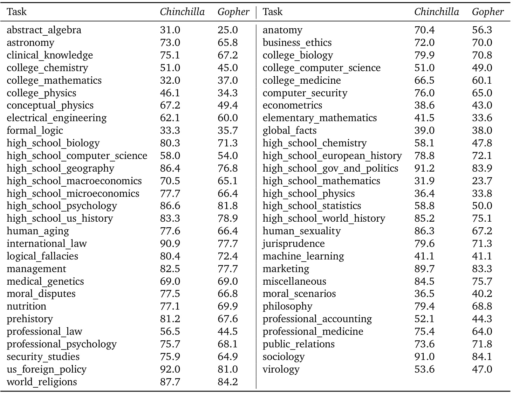
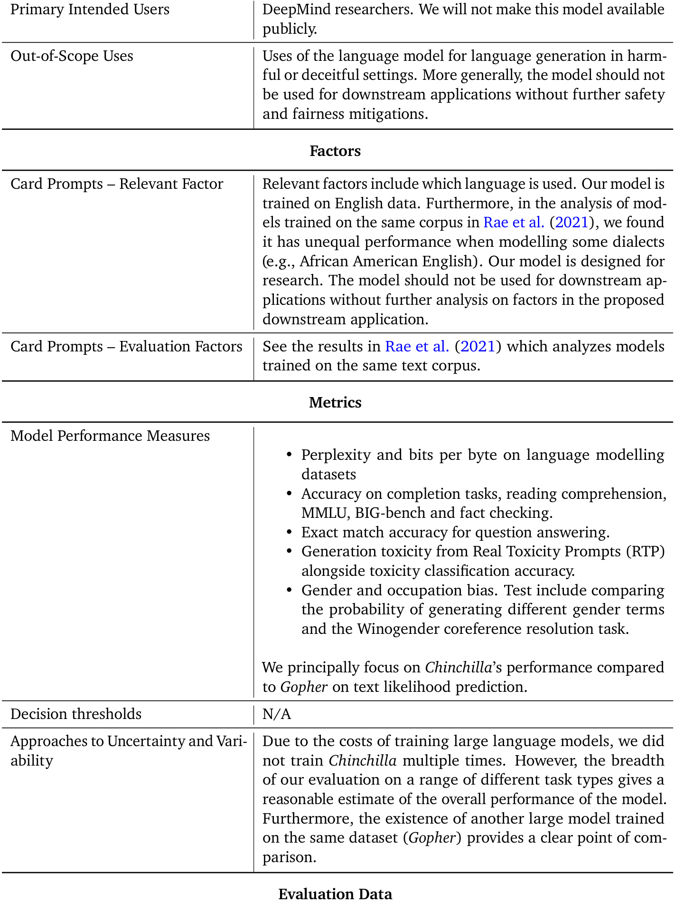

# Training Compute-Optimal Large Language Models  

Jordan Hoffmann ★ , Sebastian Borgeaud ★ , Arthur Mensch ★ , Elena Buchatskaya, Trevor Cai, Eliza Rutherford, Diego de Las Casas, Lisa Anne Hendricks, Johannes Welbl, Aidan Clark, Tom Hennigan, Eric Noland, Katie Millican, George van den Driessche, Bogdan Damoc, Aurelia Guy, Simon Osindero, Karen Simonyan, Erich Elsen, Jack W. Rae, Oriol Vinyals and Laurent Sifre ★  

We investigate the optimal model size and number of tokens for training a transformer language model under a given compute budget. We find that current large language models are significantly under- trained, a consequence of the recent focus on scaling language models whilst keeping the amount of training data constant. By training over 400 language models ranging from 70 million to over 16 billion parameters on 5 to 500 billion tokens, we find that for compute-optimal training, the model size and the number of training tokens should be scaled equally: for every doubling of model size the number of training tokens should also be doubled. We test this hypothesis by training a predicted compute- optimal model,  Chinchilla , that uses the same compute budget as  Gopher  but with 70B parameters and  $4\times$   more more data.  Chinchilla  uniformly and significantly outperforms  Gopher  (280B), GPT-3 (175B), Jurassic-1 (178B), and Megatron-Turing NLG (530B) on a large range of downstream evaluation tasks. This also means that  Chinchilla  uses substantially less compute for fine-tuning and inference, greatly facilitating downstream usage. As a highlight,  Chinchilla  reaches a state-of-the-art average accuracy of  $67.5\%$   on the MMLU benchmark, greater than a  $7\%$   improvement over  Gopher .  

# 1. Introduction  

Recently a series of  Large Language Models  (LLMs) have been introduced ( Brown et al. ,  2020 ;  Lieber et al. ,  2021 ;  Rae et al. ,  2021 ;  Smith et al. ,  2022 ;  Thoppilan et al. ,  2022 ), with the largest dense language models now having over 500 billion parameters. These large autoregressive transformers ( Vaswani et al. ,  2017 ) have demonstrated impressive performance on many tasks using a variety of evaluation protocols such as zero-shot, few-shot, and fine-tuning.  

The compute and energy cost for training large language models is substantial ( Rae et al. ,  2021 ; Thoppilan et al. ,  2022 ) and rises with increasing model size. In practice, the allocated training compute budget is often known in advance: how many accelerators are available and for how long we want to use them. Since it is typically only feasible to train these large models once, accurately estimating the best model hyperparameters for a given compute budget is critical ( Tay et al. ,  2021 ).  

Kaplan et al.  ( 2020 ) showed that there is a power law relationship between the number of parameters in an autoregressive language model (LM) and its performance. As a result, the field has been training larger and larger models, expecting performance improvements. One notable conclusion in  Kaplan et al.  ( 2020 ) is that large models should not be trained to their lowest possible loss to be compute optimal. Whilst we reach the same conclusion, we estimate that large models should be trained for many more training tokens than recommended by the authors. Specifically, given a   $10\times$  increase computational budget, they suggests that the size of the model should increase   $5.5\times$   while the number of training tokens should only increase   $1.8\times$  . Instead, we find that model size and the number of training tokens should be scaled in equal proportions.  

Following  Kaplan et al.  ( 2020 ) and the training setup of GPT-3 ( Brown et al. ,  2020 ), many of the recently trained large models have been trained for approximately 300 billion tokens ( Table 1 ), in line with the approach of predominantly increasing model size when increasing compute.  

  
Figure 1  Overlaid predictions.  We overlay the predictions from our three different approaches,  | along with projections from  Kaplan et al.  ( 2020 ). We find that all three methods predict that current large models should be substantially smaller and therefore trained much longer than is currently done. In  Figure A3 , we show the results with the predicted optimal tokens plotted against the optimal number of parameters for fixed FLOP budgets.  Chinchilla  outperforms  Gopher  and the other large models (see  Section 4.2 ).  

In this work, we revisit the question:  Given a fixed FLOPs budget,   how should one trade-offmodel size and the number of training tokens?  To answer this question, we model the final pre-training loss 2  $L(N,D)$   as a function of the number of model parameters  $N$  , and the number of training tokens,    $D$  . Since the computational budget    $C$  is a deterministic function    $\mathrm{FLOPs}(N,D)$  f the number of seen training tokens and model parameters, we are interested in minimizing  𝐿 under the constraint  $\mathrm{FLOPs}(N,D)=C$  :  

$$
N_{o p t}(C),D_{o p t}(C)=\underset{N,D\;\mathrm{s.t.}\;\mathrm{FLOP s}(N,D)=C}{\mathrm{argmin}}L(N,D).
$$  

The functions    $N_{o p t}(C)$  , and  $D_{o p t}(C)$   describe the optimal allocation of a computational budget  𝐶 . We empirically estimate these functions based on the losses of over 400 models, ranging from under 70M to over 16B parameters, and trained on 5B to over   $4008$   tokens – with each model configuration trained for several different training horizons. Our approach leads to considerably different results than that of  Kaplan et al.  ( 2020 ). We highlight our results in  Figure 1  and how our approaches differ in  Section 2 .  

Based on our estimated compute-optimal frontier, we predict that for the compute budget used to train  Gopher , an optimal model should be 4 times smaller, while being training on 4 times more tokens. We verify this by training a more  compute-optimal  70B model, called  Chinchilla , on 1.4 trillion tokens. Not only does  Chinchilla  outperform its much larger counterpart,  Gopher , but its reduced model size reduces inference cost considerably and greatly facilitates downstream uses on smaller hardware. The energy cost of a large language model is amortized through its usage for inference an fine-tuning. The benefits of a more optimally trained smaller model, therefore, extend beyond the immediate benefits of its improved performance.  

  

# 2. Related Work  

Large language models. A variety of large language models have been introduced in the last few years. These include both dense transformer models ( Brown et al. ,  2020 ;  Lieber et al. ,  2021 ;  Rae et al. ,  2021 ;  Smith et al. ,  2022 ;  Thoppilan et al. ,  2022 ) and mixture-of-expert (MoE) models ( Du et al. ,  2021 ;  Fedus et al. ,  2021 ;  Zoph et al. ,  2022 ). The largest dense transformers have passed 500 billion parameters ( Smith et al. ,  2022 ). The drive to train larger and larger models is clear—so far increasing the size of language models has been responsible for improving the state-of-the-art in many language modelling tasks. Nonetheless, large language models face several challenges, including their overwhelming computational requirements (the cost of training and inference increase with model size) ( Rae et al. ,  2021 ;  Thoppilan et al. ,  2022 ) and the need for acquiring more high-quality training data. In fact, in this work we find that larger, high quality datasets will play a key role in any further scaling of language models.  

Modelling the scaling behavior. Understanding the scaling behaviour of language models and their transfer properties has been important in the development of recent large models ( Hernandez et al. ,  2021 ;  Kaplan et al. ,  2020 ).  Kaplan et al.  ( 2020 ) first showed a predictable relationship between model size and loss over many orders of magnitude. The authors investigate the question of choosing the optimal model size to train for a given compute budget. Similar to us, they address this question by training various models. Our work differs from  Kaplan et al.  ( 2020 ) in several important ways. First, the authors use a fixed number of training tokens and learning rate schedule for all models; this prevents them from modelling the impact of these hyperparameters on the loss. In contrast, we find that setting the learning rate schedule to approximately match the number of training tokens results in the best final loss regardless of model size—see  Figure A1 . For a fixed learning rate cosine schedule to 130B tokens, the intermediate loss estimates (for  $D^{\prime}<<130\mathrm{B}$  ) are therefore overestimates of the loss of a model trained with a schedule length matching  $D^{\prime}$  . Using these intermediate losses results in underestimating the effectiveness of training models on less data than 130B tokens, and eventually contributes to the conclusion that model size should increase faster than training data size as compute budget increases. In contrast, our analysis predicts that both quantities should scale at roughly the same rate. Secondly, we include models with up to 16B parameters, as we observe that there is slight curvature in the FLOP-loss frontier (see  Appendix E )—in fact, the majority of the models used in our analysis have more than 500 million parameters, in contrast the majority of runs in  Kaplan et al. ( 2020 ) are significantly smaller—many being less than 100M parameters.  

Recently,  Clark et al.  ( 2022 ) specifically looked in to the scaling properties of Mixture of Expert language models, showing that the scaling with number of experts diminishes as the model size increases—their approach models the loss as a function of two variables: the model size and the number of experts. However, the analysis is done with a fixed number of training tokens, as in  Kaplan et al.  ( 2020 ), potentially underestimating the improvements of branching.  

Estimating hyperparameters for large models. The model size and the number of training tokens are not the only two parameters to chose when selecting a language model and a procedure to train it. Other important factors include learning rate, learning rate schedule, batch size, optimiser, and width-to-depth ratio. In this work, we focus on model size and the number of training steps, and we rely on existing work and provided experimental heuristics to determine the other necessary hyperparameters.  Yang et al.  ( 2021 ) investigates how to choose a variety of these parameters for training an autoregressive transformer, including the learning rate and batch size.  McCandlish et al.

 ( 2018 ) finds only a weak dependence between optimal batch size and model size.  Shallue et al.

 ( 2018 );  Zhang et al.  ( 2019 ) suggest that using larger batch-sizes than those we use is possible.  Levine et al.  ( 2020 ) investigates the optimal depth-to-width ratio for a variety of standard model sizes. We use slightly less deep models than proposed as this translates to better wall-clock performance on our hardware.  

Improved model architectures. Recently, various promising alternatives to traditional dense trans- formers have been proposed. For example, through the use of conditional computation large MoE models like the 1.7 trillion parameter Switch transformer ( Fedus et al. ,  2021 ), the 1.2 Trillion pa- rameter GLaM model ( Du et al. ,  2021 ), and others ( Artetxe et al. ,  2021 ;  Zoph et al. ,  2022 ) are able to provide a large effective model size despite using relatively fewer training and inference FLOPs. However, for very large models the computational benefits of routed models seems to diminish ( Clark et al. ,  2022 ). An orthogonal approach to improving language models is to augment transformers with explicit retrieval mechanisms, as done by  Borgeaud et al.  ( 2021 );  Guu et al.  ( 2020 );  Lewis et al. ( 2020 ). This approach effectively increases the number of data tokens seen during training (by a factor of    $\sim10$   in  Borgeaud et al.  ( 2021 )). This suggests that the performance of language models may be more dependant on the size of the training data than previously thought.  

# 3. Estimating the optimal parameter/training tokens allocation  

We present three different approaches to answer the question driving our research:  Given a fixed FLOPs budget, how should one trade-offmodel size and the number of training tokens?  In all three cases we start by training a range of models varying both model size and the number of training tokens and use the resulting training curves to fit an empirical estimator of how they should scale. We assume a power-law relationship between compute and model size as done in  Clark et al.  ( 2022 ); Kaplan et al.  ( 2020 ), though future work may want to include potential curvature in this relationship for large model sizes. The resulting predictions are similar for all three methods and suggest that parameter count and number of training tokens should be increased equally with more compute 3 — with proportions reported in  Table 2 . This is in clear contrast to previous work on this topic and warrants further investigation.  

  

Figure 2  Training curve envelope.  On the  left  we show all of our different runs. We launched a  | range of model sizes going from 70M to 10B, each for four different cosine cycle lengths. From these curves, we extracted the envelope of minimal loss per FLOP, and we used these points to estimate the optimal model size ( center ) for a given compute budget and the optimal number of training tokens ( right ). In green, we show projections of optimal model size and training token count based on the number of FLOPs used to train  Gopher    $(5.76\times10^{23})$  ).  

# 3.1. Approach 1: Fix model sizes and vary number of training tokens  

In our first approach we vary the number of training steps for a fixed family of models (ranging from 70M to over 10B parameters), training each model for 4 different number of training sequences. From these runs, we are able to directly extract an estimate of the minimum loss achieved for a given number of training FLOPs. Training details for this approach can be found in  Appendix D .  

For each parameter count    $N$  we train 4 different models, decaying the learning rate by a factor of  $10\times$   over a horizon (measured in number of training tokens) that ranges by a factor of   $16\times$  . Then, for each run, we smooth and then interpolate the training loss curve. From this, we obtain a continuous mapping from FLOP count to training loss for each run. Then, for each FLOP count, we determine which run achieves the lowest loss. Using these interpolants, we obtain a mapping from any FLOP count    $C$  , to the most efficient choice of model size    $N$  and number of training tokens    $D$  such that  $\mathrm{FLOPs}(N,D)=C$  . 4   At 1500 logarithmically spaced FLOP values, we find which model size achieves the lowest loss of all models along with the required number of training tokens. Finally, we fit power laws to estimate the optimal model size and number of training tokens for any given amount of compute (see the  nd ri ls of  Figure 2 ), obtaining a relationship  $N_{o p t}\propto C^{a}$  and    $D_{o p t}\propto C^{b}$  . We find that  $a=0.50$   0 50 and  $b=0.50$   0 50—as summarized in  Table 2 . In  Section D.4 , we show a head-to-head comparison at   $10^{21}$    FLOPs, using the model size recommended by our analysis and by the analysis of Kaplan et al.  ( 2020 )—using the model size we predict has a clear advantage.  

# 3.2. Approach 2: IsoFLOP profiles  

In our second approach we vary the model size 5   for a fixed set of 9 different training FLOP counts 6 (ranging from  $6\times10^{18}$    to  $3\times10^{21}$    FLOPs), and consider the final training loss for each point 7 . in contrast with Approach 1 that considered points    $(N,D,L)$   along the entire training runs. This allows us to directly answer the question: For a given FLOP budget, what is the optimal parameter count?  

  
Figure 3  IsoFLOP curves.  For various model sizes, we choose the number of training tokens such  | that the final FLOPs is a constant. The cosine cycle length is set to match the target FLOP count. We find a clear valley in loss, meaning that for a given FLOP budget there is an optimal model to train ( left ). Using the location of these valleys, we project optimal model size and number of tokens for larger models ( center  and  right ). In green, we show the estimated number of parameters and tokens for an  optimal  model trained with the compute budget of  Gopher .  

For each FLOP budget, we plot the final loss (after smoothing) against the parameter count in Figure 3  (left). In all cases, we ensure that we have trained a diverse enough set of model sizes to see a clear minimum in the loss. We fit a parabola to each IsoFLOPs curve to directly estimate at what model size the minimum loss is achieved ( Figure 3  (left)). As with the previous approach, we then fit a power law between FLOPs and loss-optimal model size and number of training tokens, shown in Figure 3  (center, right). Again, we fit exponents of the form    $N_{o p t}\propto C^{a}$  and  $D_{o p t}\propto C^{b}$  and we find that  $a=0.49$   and  $b=0.51$  —as summarized in  Table 2 .  

# 3.3. Approach 3: Fitting a parametric loss function  

Lastly, we model all final losses from experiments in Approach   ${\textbf{1}\&\ 2}$   as a parametric function of model parameter count and the number of seen tokens. Following a classical risk decomposition (see Section D.2 ), we propose the following functional form  

$$
\hat{L}(N,D)\triangleq E+\frac{A}{N^{\alpha}}+\frac{B}{D^{\beta}}.
$$  

The first term captures the loss for an ideal generative process on the data distribution, and should correspond to the entropy of natural text. The second term captures the fact that a perfectly trained transformer with  $N$  parameters underperforms the ideal generative process. The final term captures the fact that the transformer is not trained to convergence, as we only make a finite number of optimisation steps, on a sample of the dataset distribution.  

Model fitting. To estimate    $(A,B,E,\alpha,\beta)$  , we minimize the Huber loss ( Huber ,  1964 ) between the predicted and observed log loss using the L-BFGS algorithm ( Nocedal ,  1980 ):  

$$
\operatorname*{min}_{A,B,E,\alpha,\beta}\quad\sum_{\mathrm{Runs}\;i}\mathrm{Huber}_{\delta}\Big(\log\hat{L}(N_{i},D_{i})-\log L_{i}\Big)
$$  

We account for possible local minima by selecting the best fit from a grid of initialisations. The Huber loss   $\left(\delta=10^{-3}\right)$  ) is robust to outliers, which we find important for good predictive performance over held-out data points.  Section D.2  details the fitting procedure and the loss decomposition.  

  
Figure 4  |  Parametric fit.  We fit a parametric modelling of the loss  $\hat{L}(N,D)$  ( )  and display contour ( left ) and isoFLOP slices ( right ). For each isoFLOP slice, we include a corresponding dashed line in the left plot. In the left plot, we show the efficient frontier in blue, which is a line in log-log space. Specifically, the curve goes through each iso-loss contour at the point with the fewest FLOPs. We project the optimal model size given the  Gopher  FLOP budget to be 40B parameters.  

Efficient frontier. We can approximate the functions  $N_{o p t}$  and  $D_{o p t}$  by minimizing the parametric loss  $\hat{L}$  under the constraint    $\mathrm{FLOPs}(N,D)\approx6N D$  ( Kaplan et al. ,  2020 ). The resulting    $N_{o p t}$  and    $D_{o p t}$  balance the two terms in Equation  ( 3 )  that depend on model size and data. By construction, they have a power-law form:  

$$
\begin{array}{l}{\displaystyle{I_{o p t}(C)=G\bigg(\frac{C}{6}\bigg)^{a},\quad D_{o p t}(C)=G^{-1}\bigg(\frac{C}{6}\bigg)^{b},\quad\mathrm{~where~}\quad G=\bigg(\frac{\alpha A}{\beta B}\bigg)^{\frac{1}{\alpha+\beta}},\quad a=\frac{\beta}{\alpha+\beta},\mathrm{~and~}b=\frac{\alpha}{\alpha+\beta}}}\end{array}
$$  

We show contours of the fitted function  $\hat{L}$  in  Figure 4  (left), and the closed-form efficient computational frontier in blue. From this approach, we find that    $a=0.46$   and    $b=0.54$  —as summarized in  Table 2 .  

# 3.4. Optimal model scaling  

We find that the three approaches, despite using different fitting methodologies and different trained models, yield comparable predictions for the optimal scaling in parameters and tokens with FLOPs (shown in  Table 2 ). All three approaches suggest that as compute budget increases, model size and the amount of training data should be increased in approximately equal proportions. The first and second approaches yield very similar predictions for optimal model sizes, as shown in  Figure 1  and Figure A3 . The third approach predicts even smaller models being optimal at larger compute budgets. We note that the observed points    $(L,N,D)$   for low training FLOPs (  $\left(C\leqslant1e21\right)$  ) have larger residuals  $\|L-\hat{L}(N,D)\|_{2}^{2}$    than points with higher computational budgets. The fitted model places increased ( )∥ weight on the points with more FLOPs—automatically considering the low-computational budget points as outliers due to the Huber loss. As a consequence of the empirically observed negative curvature in the frontier  $C\rightarrow N_{o p t}$  (see  Appendix E ), this results in predicting a lower    $N_{o p t}$  than the two other approaches.  

In  Table 3  we show the estimated number of FLOPs and tokens that would ensure that a model of a given size lies on the compute-optimal frontier. Our findings suggests that the current generation of  

![Table 2  Estimated paramete and data scaling with increased training compute.  The listed  | values are the exponents,    $a$  and  𝑏 , on the relationship  $N_{o p t}\propto C^{a}$  and  $D_{o p t}\propto C^{b}$  . Our analysis suggests a near equal scaling in parameters and data with increasing compute which is in clear contrast to previous work on the scaling of large models. The   $10^{\mathrm{th}}$    and   $90^{\mathrm{{th}}}$    percentiles are estimated via bootstrapping data (  $\cdot80\%$   of the dataset is sampled 100 times) and are shown in parenthesis. ](images/70bf95d3b259336e65b5bfa3761398cbccf42fa162fce909dae0729cf1b8100a.jpg)  

  

large language models are considerably over-sized, given their respective compute budgets, as shown in  Figure 1 . For example, we find that a 175 billion parameter model should be trained with a compute budget of  $4.41\times10^{24}$    FLOPs and on over 4.2 trillion tokens. A  billion  Gopher -like model is the optimal model to train given a compute budget of approximately 10  $10^{25}$    FLOPs and should be trained on 6.8 trillion tokens. Unless one has a compute budget of   $10^{26}$    FLOPs (over   $250\times$   the compute used to train  Gopher ), a 1 trillion parameter model is unlikely to be the optimal model to train. Furthermore, the amount of training data that is projected to be needed is far beyond what is currently used to train large models, and underscores the importance of dataset collection in addition to engineering improvements that allow for model scale. While there is significant uncertainty extrapolating out many orders of magnitude, our analysis clearly suggests that given the training compute budget for many current LLMs, smaller models should have been trained on more tokens to achieve the most performant model.  

In  Appendix C , we reproduce the IsoFLOP analysis on two additional datasets: C4 ( Raffel et al. , 2020a ) and GitHub code ( Rae et al. ,  2021 ). In both cases we reach the similar conclusion that model size and number of training tokens should be scaled in equal proportions.  

# 4.  Chinchilla  

Based on our analysis in  Section 3 , the optimal model size for the  Gopher  compute budget is somewhere between 40 and 70 billion parameters. We test this hypothesis by training a model on the larger end of this range—70B parameters—for 1.4T tokens, due to both dataset and computational efficiency considerations. In this section we compare this model, which we call  Chinchilla , to  Gopher  and other LLMs. Both  Chinchilla  and  Gopher  have been trained for the same number of FLOPs but differ in the size of the model and the number of training tokens.  

While pre-training a large language model has a considerable compute cost, downstream fine- tuning and inference also make up substantial compute usage ( Rae et al. ,  2021 ). Due to being  $4\times$  smaller than  Gopher , both the memory footprint and inference cost of  Chinchilla  are also smaller.  

# 4.1. Model and training details  

The full set of hyperparameters used to train  Chinchilla  are given in  Table 4 .  Chinchilla  uses the same model architecture and training setup as  Gopher  with the exception of the differences listed below.  

•  We train  Chinchilla  on  MassiveText  (the same dataset as  Gopher ) but use a slightly different subset distribution (shown in  Table A1 ) to account for the increased number of training tokens. •  We use AdamW ( Loshchilov and Hutter ,  2019 ) for  Chinchilla  rather than Adam ( Kingma and Ba ,  2014 ) as this improves the language modelling loss and the downstream task performance after finetuning. •  We train  Chinchilla  with a slightly modified SentencePiece ( Kudo and Richardson ,  2018 ) tokenizer that does not apply NFKC normalisation. The vocabulary is very similar–   $94.15\%$   of tokens are the same as those used for training  Gopher . We find that this particularly helps with the representation of mathematics and chemistry, for example. •  Whilst the forward and backward pass are computed in  bfloat16 , we store a  float32  copy of the weights in the distributed optimiser state ( Rajbhandari et al. ,  2020 ). See  Lessons Learned from  Rae et al.  ( 2021 ) for additional details.  

In  Appendix G  we show the impact of the various optimiser related changes between  Chinchilla and  Gopher . All models in this analysis have been trained on TPUv3/TPUv4 ( Jouppi et al. ,  2017 ) with JAX ( Bradbury et al. ,  2018 ) and Haiku ( Hennigan et al. ,  2020 ). We include a  Chinchilla  model card ( Mitchell et al. ,  2019 ) in  Table A8 .  

  

Table 4  Chinchilla  architecture details.  We list the number of layers, the key/value size, the  | bottleneck activation size  ${\mathsf{d}}_{\mathrm{model}}$  , the maximum learning rate, and the training batch size (  $\mathcal{\#}$   tokens). The feed-forward size is always set to   $4\times\mathsf{d}_{\mathrm{model}}$  . Note that we double the batch size midway through training for both  Chinchilla  and  Gopher .  

  

Table 5  All evaluation tasks.  We evaluate  Chinchilla  on a collection of language modelling along  | with downstream tasks. We evaluate on largely the same tasks as in  Rae et al.  ( 2021 ), to allow for direct comparison.  

# 4.2. Results  

We perform an extensive evaluation of  Chinchilla , comparing against various large language models. We evaluate on a large subset of the tasks presented in  Rae et al.  ( 2021 ), shown in  Table 5 . As the focus of this work is on optimal model scaling, we included a large representative subset, and introduce a few new evaluations to allow for better comparison to other existing large models. The evaluation details for all tasks are the same as described in  Rae et al.  ( 2021 ).  

# 4.2.1. Language modelling  

  
Figure 5  Pile Evaluation.  For the different evaluation sets in The Pile ( Gao et al. ,  2020 ), we show  | the bits-per-byte (bpb) improvement (decrease) of  Chinchilla  compared to  Gopher . On all subsets, Chinchilla  outperforms  Gopher .  

Chinchilla  significantly outperforms  Gopher  on all evaluation subsets of The Pile ( Gao et al. , 2020 ), as shown in  Figure 5 . Compared to Jurassic-1 (178B)  Lieber et al.  ( 2021 ),  Chinchilla  is more performant on all but two subsets–  dm_mathematics  and  ubuntu_irc – see  Table A5  for a raw bits-per-byte comparison. On Wikitext103 ( Merity et al. ,  2017 ),  Chinchilla  achieves a perplexity of 7.16 compared to 7.75 for  Gopher . Some caution is needed when comparing  Chinchilla  with  Gopher on these language modelling benchmarks as  Chinchilla  is trained on  $4\times$   more data than  Gopher  and thus train/test set leakage may artificially enhance the results. We thus place more emphasis on other  

  

Table 6  Massive Multitask Language Understanding (MMLU).  We report the average 5-shot  | accuracy over 57 tasks with model and human accuracy comparisons taken from  Hendrycks et al. ( 2020 ). We also include the average prediction for state of the art accuracy in June 2022/2023 made by 73 competitive human forecasters in  Steinhardt  ( 2021 ).  

tasks for which leakage is less of a concern, such as MMLU ( Hendrycks et al. ,  2020 ) and BIG-bench ( BIG-bench collaboration ,  2021 ) along with various closed-book question answering and common sense analyses.  

# 4.2.2. MMLU  

The Massive Multitask Language Understanding (MMLU) benchmark ( Hendrycks et al. ,  2020 ) consists of a range of exam-like questions on academic subjects. In  Table 6 , we report  Chinchilla ’s average 5-shot performance on MMLU (the full breakdown of results is shown in  Table A6 ). On this benchmark, Chinchilla  significantly outperforms  Gopher  despite being much smaller, with an average accuracy of  $67.6\%$   (improving upon  Gopher  by   $7.6\%$  ). Remarkably,  Chinchilla  even outperforms the expert forecast for June 2023 of   $63.4\%$   accuracy (see  Table 6 ) ( Steinhardt ,  2021 ). Furthermore,  Chinchilla  achieves greater than   $90\%$   accuracy on 4 different individual tasks–  high school gov and politics, international law, sociology , and  us_foreign_policy . To our knowledge, no other model has achieved greater than   $90\%$   accuracy on a subset.  

In  Figure 6 , we show a comparison to  Gopher  broken down by task. Overall, we find that  Chin- chilla  improves performance on the vast majority of tasks. On four tasks ( college mathematics, econometrics, moral_scenarios , and  formal_logic )  Chinchilla  underperforms  Gopher , and there is no change in performance on two tasks.  

# 4.2.3. Reading comprehension  

On the final word prediction dataset LAMBADA ( Paperno et al. ,  2016 ),  Chinchilla  achieves   $77.4\%$  accuracy, compared to  $74.5\%$   accuracy from  Gopher  and   $76.6\%$   from MT-NLG 530B (see  Table 7 ). On RACE-h and RACE-m ( Lai et al. ,  2017 ),  Chinchilla  greatly outperforms  Gopher , improving accuracy by more than  $10\%$   in both cases—see  Table 7 .  

# 4.2.4. BIG-bench  

We analysed  Chinchilla  on the same set of BIG-bench tasks ( BIG-bench collaboration ,  2021 ) reported in  Rae et al.  ( 2021 ). Similar to what we observed in MMLU,  Chinchilla  outperforms  Gopher  on the vast majority of tasks (see  Figure 7 ). We find that  Chinchilla  improves the average performance by   $10.7\%$  , reaching an accuracy of   $65.1\%$   versus  $54.4\%$   for  Gopher . Of the 62 tasks we consider, Chinchilla  performs worse than  Gopher  on only four— crash_blossom, dark humor detection,  

  
Figure 6  |  MMLU results compared to  Gopher  We find that  Chinchilla  outperforms  Gopher  by   $7.6\%$  on average (see  Table 6 ) in addition to performing better on 51/57 individual tasks, the same on 2/57, and worse on only 4/57 tasks.  

  

Table 7  Reading comprehension.  On RACE-h and RACE-m ( Lai et al. ,  2017 ),  Chinchilla  considerably  | improves performance over  Gopher . Note that GPT-3 and MT-NLG 530B use a different prompt format than we do on RACE-h/m, so results are not comparable to  Gopher  and  Chinchilla . On LAMBADA ( Paperno et al. ,  2016 ),  Chinchilla  outperforms both  Gopher  and MT-NLG 530B.  

mathematical induction  and  logical_args . Full accuracy results for  Chinchilla  can be found in  Table A7 .  

# 4.2.5. Common sense  

We evaluate  Chinchilla  on various common sense benchmarks: PIQA ( Bisk et al. ,  2020 ), SIQA ( Sap et al. ,  2019 ), Winogrande ( Sakaguchi et al. ,  2020 ), HellaSwag ( Zellers et al. ,  2019 ), and BoolQ ( Clark et al. ,  2019 ). We find that  Chinchilla  outperforms both  Gopher  and GPT-3 on all tasks and outperforms MT-NLG 530B on all but one task—see  Table 8 .  

On TruthfulQA ( Lin et al. ,  2021 ),  Chinchilla  reaches   $43.6\%$  ,   $58.5\%$  , and   $66.7\%$   accuracy with 0-shot, 5-shot, and 10-shot respectively. In comparison,  Gopher  achieved only   $29.5\%$  0-shot and   $43.7\%$  10-shot accuracy. In stark contrast with the findings of  Lin et al.  ( 2021 ), the large improvements (  $7.14.1\%$   in 0-shot accuracy) achieved by Chinchilla suggest that better modelling of the pre-training data alone can lead to substantial improvements on this benchmark.  

  
Figure 7  BIG-bench results compared to  Gopher  Chinchilla  out performs  Gopher  on all but four  | BIG-bench tasks considered. Full results are in  Table A7 .  

# 4.2.6. Closed-book question answering  

Results on closed-book question answering benchmarks are reported in  Table 9 . On the Natural Questions dataset ( Kwiatkowski et al. ,  2019 ),  Chinchilla  achieves new closed-book SOTA accuracies:

  $31.5\%$   5-shot and   $35.5\%$   64-shot, compared to   $21\%$   and   $28\%$   respectively, for  Gopher . On TriviaQA

 ( Joshi et al. ,  2017 ) we show results for both the filtered (previously used in retrieval and open-book work) and unfiltered set (previously used in large language model evaluations). In both cases, Chinchilla  substantially out performs  Gopher . On the filtered version, Chinchilla lags behind the open book SOTA ( Izacard and Grave ,  2020 ) by only   $7.9\%$  . On the unfiltered set,  Chinchilla  outperforms GPT-3—see  Table 9 .  

# 4.2.7. Gender bias and toxicity  

Large Language Models carry potential risks such as outputting offensive language, propagating social biases, and leaking private information ( Bender et al. ,  2021 ;  Weidinger et al. ,  2021 ). We expect  Chinchilla  to carry risks similar to  Gopher  because  Chinchilla  is trained on the same data,  

  

Table 8  Zero-shot comparison on Common Sense benchmarks.  We show a comparison between  | Chinchilla ,  Gopher , and MT-NLG 530B on various Common Sense benchmarks. We see that  Chinchilla matches or outperforms  Gopher  and GPT-3 on all tasks. On all but one  Chinchilla  outperforms the much larger MT-NLG 530B model.  

  
Table 9  Closed-book question answering.  For Natural Questions ( Kwiatkowski et al. ,  2019 ) and  | TriviaQA ( Joshi et al. ,  2017 ),  Chinchilla  outperforms  Gopher  in all cases. On Natural Questions, Chinchilla  outperforms GPT-3. On TriviaQA we show results on two different evaluation sets to allow for comparison to GPT-3 and to open book SOTA (FiD   $+$   Distillation ( Izacard and Grave ,  2020 )).  

albeit with slightly different relative weights, and because it has a similar architecture. Here, we examine gender bias (particularly gender and occupation bias) and generation of toxic language. We select a few common evaluations to highlight potential issues, but stress that our evaluations are not comprehensive and much work remains to understand, evaluate, and mitigate risks in LLMs.  

Gender bias. As discussed in  Rae et al.  ( 2021 ), large language models reflect contemporary and historical discourse about different groups (such as gender groups) from their training dataset, and we expect the same to be true for  Chinchilla . Here, we test if potential gender and occupation biases manifest in unfair outcomes on coreference resolutions, using the Winogender dataset ( Rudinger et al. ,  2018 ) in a zero-shot setting. Winogender tests whether a model can correctly determine if a pronoun refers to different occupation words. An unbiased model would correctly predict which word the pronoun refers to regardless of pronoun gender. We follow the same setup as in  Rae et al. ( 2021 ) (described further in  Section H.3 ).  

As shown in  Table 10 ,  Chinchilla  correctly resolves pronouns more frequently than  Gopher  across all groups. Interestingly, the performance increase is considerably smaller for male pronouns (increase of   $3.2\%$  ) than for female or neutral pronouns (increases of   $8.3\%$   and  $9.2\%$   respectively). We also consider  gotcha  examples, in which the correct pronoun resolution contradicts gender stereotypes (determined by labor statistics). Again, we see that  Chinchilla  resolves pronouns more accurately than  Gopher . When breaking up examples by male/female gender and  gotcha / not gotcha , the largest improvement is on female  gotcha  examples (improvement of   $10\%$  ). Thus, though  Chinchilla  uniformly overcomes gender stereotypes for more coreference examples than  Gopher , the rate of improvement is higher for some pronouns than others, suggesting that the improvements conferred by using a more compute-optimal model can be uneven.  

Sample toxicity. Language models are capable of generating toxic language—including insults, hate speech, profanities and threats ( Gehman et al. ,  2020 ;  Rae et al. ,  2021 ). While toxicity is an umbrella term, and its evaluation in LMs comes with challenges ( Welbl et al. ,  2021 ;  Xu et al. ,  2021 ), automatic classifier scores can provide an indication for the levels of harmful text that a LM generates. Rae et al.  ( 2021 ) found that improving language modelling loss by increasing the number of model parameters has only a negligible effect on toxic text generation (unprompted); here we analyze  

  

whether the same holds true for a lower LM loss achieved via more compute-optimal training. Similar to the protocol of  Rae et al.  ( 2021 ), we generate 25,000 unprompted samples from  Chinchilla , and compare their  PerspectiveAPI  toxicity score distribution to that of  Gopher -generated samples. Several summary statistics indicate an absence of major differences: the mean (median) toxicity score for Gopher  is 0.081 (0.064), compared to 0.087 (0.066) for  Chinchilla , and the   $95^{\mathrm{{th}}}$    percentile scores are 0.230 for  Gopher , compared to 0.238 for  Chinchilla . That is, the large majority of generated samples are classified as non-toxic, and the difference between the models is negligible. In line with prior findings ( Rae et al. ,  2021 ), this suggests that toxicity levels in unconditional text generation are largely independent of the model quality (measured in language modelling loss), i.e. that better models of the training dataset are not necessarily more toxic.  

# 5. Discussion & Conclusion  

The trend so far in large language model training has been to increase the model size, often without increasing the number of training tokens. The largest dense transformer, MT-NLG 530B, is now over   $3\times$   larger than GPT-3’s 170 billion parameters from just two years ago. However, this model, as well as the majority of existing large models, have all been trained for a comparable number of tokens—around 300 billion. While the desire to train these mega-models has led to substantial engineering innovation, we hypothesize that the race to train larger and larger models is resulting in models that are substantially underperforming compared to what could be achieved with the same compute budget.  

We propose three predictive approaches towards optimally setting model size and training dura- tion, based on the outcome of over 400 training runs. All three approaches predict that  Gopher  is substantially over-sized and estimate that for the same compute budget a smaller model trained on more data will perform better. We directly test this hypothesis by training  Chinchilla , a 70B parameter model, and show that it outperforms  Gopher  and even larger models on nearly every measured evaluation task.  

Whilst our method allows us to make predictions on how to scale large models when given additional compute, there are several limitations. Due to the cost of training large models, we only have two comparable training runs at large scale ( Chinchilla  and  Gopher ), and we do not have additional tests at intermediate scales. Furthermore, we assume that the efficient computational frontier can be described by a power-law relationship between the compute budget, model size, and number of training tokens. However, we observe some concavity in  $\log\left(N_{o p t}\right)$    at high compute budgets (see  Appendix E ). This suggests that we may still be overestimating the optimal size of large models. Finally, the training runs for our analysis have all been trained on less than an epoch of data; future work may consider the multiple epoch regime. Despite these limitations, the comparison of  Chinchilla to  Gopher  validates our performance predictions, that have thus enabled training a better (and more lightweight) model at the same compute budget.  

Though there has been significant recent work allowing larger and larger models to be trained, our analysis suggests an increased focus on dataset scaling is needed. Speculatively, we expect that scaling to larger and larger datasets is only beneficial when the data is high-quality. This calls for responsibly collecting larger datasets with a high focus on dataset quality. Larger datasets will require extra care to ensure train-test set overlap is properly accounted for, both in the language modelling loss but also with downstream tasks. Finally, training for trillions of tokens introduces many ethical and privacy concerns. Large datasets scraped from the web will contain toxic language, biases, and private information. With even larger datasets being used, the quantity (if not the frequency) of such information increases, which makes dataset introspection all the more important.  Chinchilla  does suffer from bias and toxicity but interestingly it seems less affected than  Gopher . Better understanding how performance of large language models and toxicity interact is an important future research question.  

While we have applied our methodology towards the training of auto-regressive language models, we expect that there is a similar trade-offbetween model size and the amount of data in other modalities. As training large models is very expensive, choosing the optimal model size and training steps beforehand is essential. The methods we propose are easy to reproduce in new settings.  

# 6. Acknowledgements  

We’d like to thank Jean-baptiste Alayrac, Kareem Ayoub, Chris Dyer, Nando de Freitas, Demis Hassabis, Geoffrey Irving, Koray Kavukcuoglu, Nate Kushman and Angeliki Lazaridou for useful comments on the manuscript. We’d like to thank Andy Brock, Irina Higgins, Michela Paganini, Francis Song, and other colleagues at DeepMind for helpful discussions. We are also very grateful to the JAX and XLA team for their support and assistance.  

# References  

M. Artetxe, S. Bhosale, N. Goyal, T. Mihaylov, M. Ott, S. Shleifer, X. V. Lin, J. Du, S. Iyer, R. Pasunuru, G. Anantharaman, X. Li, S. Chen, H. Akin, M. Baines, L. Martin, X. Zhou, P. S. Koura, B. O’Horo, J. Wang, L. Zettlemoyer, M. Diab, Z. Kozareva, and V. Stoyanov. Efficient Large Scale Language Modeling with Mixtures of Experts. arXiv:2112.10684, 2021. E. M. Bender, T. Gebru, A. McMillan-Major, and S. Shmitchell. On the dangers of stochastic parrots: Can language models be too big? In  Proceedings of the 2021 ACM Conference on Fairness, Accountability, and Transparency, pages 610–623, 2021. BIG-bench collaboration. Beyond the imitation game: Measuring and extrapolating the capabilities of language models. In preparation, 2021. URL  https://github.com/google/BIG-bench/ . Y. Bisk, R. Zellers, J. Gao, Y. Choi, et al. PIQA: Reasoning about physical commonsense in natural language. In  Proceedings of the AAAI Conference on Artificial Intelligence , volume 34, pages 7432–7439, 2020. S. Borgeaud, A. Mensch, J. Hoffmann, T. Cai, E. Rutherford, K. Millican, G. van den Driessche, J.-B. Lespiau, B. Damoc, A. Clark, D. de Las Casas, A. Guy, J. Menick, R. Ring, T. Hennigan, S. Huang, L. Maggiore, C. Jones, A. Cassirer, A. Brock, M. Paganini, G. Irving, O. Vinyals, S. Osindero, K. Simonyan, J. W. Rae, E. Elsen, and L. Sifre. Improving language models by retrieving from trillions of tokens. arXiv 2112.04426, 2021.  

J. Bradbury, R. Frostig, P. Hawkins, M. J. Johnson, C. Leary, D. Maclaurin, G. Necula, A. Paszke, J. Van- derPlas, S. Wanderman-Milne, and Q. Zhang. JAX: composable transformations of Python  $+$  NumPy  

programs. 2018. URL  http://github.com/google/jax . T. Brown, B. Mann, N. Ryder, M. Subbiah, J. D. Kaplan, P. Dhariwal, A. Neelakantan, P. Shyam, G. Sastry, A. Askell, S. Agarwal, A. Herbert-Voss, G. Krueger, T. Henighan, R. Child, A. Ramesh, D. Ziegler, J. Wu, C. Winter, C. Hesse, M. Chen, E. Sigler, M. Litwin, S. Gray, B. Chess, J. Clark, C. Berner, S. McCandlish, A. Radford, I. Sutskever, and D. Amodei. Language models are few-shot learners. In H. Larochelle, M. Ranzato, R. Hadsell, M. F. Balcan, and H. Lin, editors,  Advances in Neural Information Processing Systems , volume 33, pages 1877–1901. Curran Associates, Inc., 2020. URL  https://proceedings.neurips.cc/paper/2020/file/1457 c 0 d 6 bfc b 49674 18bfb8ac142f64a-Paper.pdf . S. Bubeck. Convex Optimization: Algorithms and Complexity.  Foundations and Trends in Machine Learning , 8(3-4):231–357, 2015. URL  http://www.nowpublishers.com/article/Detail s/MAL-050 . A. Clark, D. d. l. Casas, A. Guy, A. Mensch, M. Paganini, J. Hoffmann, B. Damoc, B. Hechtman, T. Cai, S. Borgeaud, G. v. d. Driessche, E. Rutherford, T. Hennigan, M. Johnson, K. Millican, A. Cassirer, C. Jones, E. Buchatskaya, D. Budden, L. Sifre, S. Osindero, O. Vinyals, J. Rae, E. Elsen, K. Kavukcuoglu, and K. Simonyan. Unified scaling laws for routed language models, 2022. URL https://arxiv.org/abs/2202.01169 . C. Clark, K. Lee, M.-W. Chang, T. Kwiatkowski, M. Collins, and K. Toutanova. Boolq: Exploring the surprising difficulty of natural yes/no questions. In  Proceedings of the 2019 Conference of the North American Chapter of the Association for Computational Linguistics: Human Language Technologies, Volume 1 (Long and Short Papers), pages 2924–2936, 2019. N. Du, Y. Huang, A. M. Dai, S. Tong, D. Lepikhin, Y. Xu, M. Krikun, Y. Zhou, A. W. Yu, O. Firat, B. Zoph, L. Fedus, M. Bosma, Z. Zhou, T. Wang, Y. E. Wang, K. Webster, M. Pellat, K. Robinson, K. Meier- Hellstern, T. Duke, L. Dixon, K. Zhang, Q. V. Le, Y. Wu, Z. Chen, and C. Cui. Glam: Efficient scaling of language models with mixture-of-experts, 2021. URL  https://arxiv.org/abs/2112.06905 . W. Fedus, B. Zoph, and N. Shazeer. Switch transformers: Scaling to trillion parameter models with simple and efficient sparsity. arXiv preprint arXiv:2101.03961, 2021. L. Gao, S. Biderman, S. Black, L. Golding, T. Hoppe, C. Foster, J. Phang, H. He, A. Thite, N. Nabeshima, S. Presser, and C. Leahy. The Pile: An 800GB dataset of diverse text for language modeling.  arXiv preprint arXiv:2101.00027, 2020. S. Gehman, S. Gururangan, M. Sap, Y. Choi, and N. A. Smith. Real Toxicity Prompts: Evaluating neural toxic degeneration in language models. In  Findings of the Association for Computational Linguistics: EMNLP 2020 , pages 3356–3369, Online, Nov. 2020. Association for Computational Linguistics. doi: 10.18653/v1/2020.findings-emnlp.301. URL  https://aclanthology.org/2 020.findings-emnlp.301 . K. Guu, K. Lee, Z. Tung, P. Pasupat, and M.-W. Chang. REALM: Retrieval-augmented language model pre-training, 2020. D. Hendrycks, C. Burns, S. Basart, A. Zou, M. Mazeika, D. Song, and J. Steinhardt. Measuring massive multitask language understanding. arXiv preprint arXiv:2009.03300, 2020. T. Hennigan, T. Cai, T. Norman, and I. Babuschkin. Haiku: Sonnet for JAX. 2020. URL  http: //github.com/deepmind/dm-haiku .  

D. Hernandez, J. Kaplan, T. Henighan, and S. McCandlish. Scaling laws for transfer, 2021.  

P. J. Huber. Robust Estimation of a Location Parameter.  The Annals of Mathematical Statistics , 35 (1):73–101, Mar. 1964. ISSN 0003-4851, 2168-8990. doi: 10.1214/aoms/1177703732. URL https://projecteuclid.org/journals/annals-of-mathematical-statistics/vol ume-35/issue-1/Robust-Estimation-of-a-Location-Parameter/10.1214/aoms/11 77703732.full .  

G. Izacard and E. Grave. Distilling knowledge from reader to retriever for question answering, 2020.  

M. Joshi, E. Choi, D. Weld, and L. Zettlemoyer. TriviaQA: A Large Scale Distantly Supervised Challenge Dataset for Reading Comprehension. arXiv e-prints, art. arXiv:1705.03551, 2017.  

N. P. Jouppi, C. Young, N. Patil, D. Patterson, G. Agrawal, R. Bajwa, S. Bates, S. Bhatia, N. Boden, A. Borchers, R. Boyle, P.-l. Cantin, C. Chao, C. Clark, J. Coriell, M. Daley, M. Dau, J. Dean, B. Gelb, T. V. Ghaemmaghami, R. Gottipati, W. Gulland, R. Hagmann, C. R. Ho, D. Hogberg, J. Hu, R. Hundt, D. Hurt, J. Ibarz, A. Jaffey, A. Jaworski, A. Kaplan, H. Khaitan, D. Killebrew, A. Koch, N. Kumar, S. Lacy, J. Laudon, J. Law, D. Le, C. Leary, Z. Liu, K. Lucke, A. Lundin, G. MacKean, A. Maggiore, M. Mahony, K. Miller, R. Nagarajan, R. Narayanaswami, R. Ni, K. Nix, T. Norrie, M. Omernick, N. Penukonda, A. Phelps, J. Ross, M. Ross, A. Salek, E. Samadiani, C. Severn, G. Sizikov, M. Snelham, J. Souter, D. Steinberg, A. Swing, M. Tan, G. Thorson, B. Tian, H. Toma, E. Tuttle, V. Vasudevan, R. Walter, W. Wang, E. Wilcox, and D. H. Yoon. In-datacenter performance analysis of a tensor processing unit. In  Proceedings of the 44th Annual International Symposium on Computer Architecture , ISCA ’17, page 1–12, New York, NY, USA, 2017. Association for Computing Machinery. ISBN 9781450348928. doi: 10.1145/3079856.3080246. URL  https://doi.org/10.1145/3079856.3080246 .  

J. Kaplan, S. McCandlish, T. Henighan, T. B. Brown, B. Chess, R. Child, S. Gray, A. Radford, J. Wu, and D. Amodei. Scaling laws for neural language models.  arXiv preprint arXiv:2001.08361 , 2020.  

D. P. Kingma and J. Ba. Adam: A method for stochastic optimization.  arXiv preprint arXiv:1412.6980 , 2014.  

T. Kudo and J. Richardson. SentencePiece: A simple and language independent subword tokenizer and detokenizer for neural text processing. arXiv preprint arXiv:1808.06226, 2018.  

T. Kwiatkowski, J. Palomaki, O. Redfield, M. Collins, A. Parikh, C. Alberti, D. Epstein, I. Polosukhin, M. Kelcey, J. Devlin, K. Lee, K. N. Toutanova, L. Jones, M.-W. Chang, A. Dai, J. Uszkoreit, Q. Le, and S. Petrov. Natural questions: a benchmark for question answering research.  Transactions of the Association of Computational Linguistics, 2019.  

G. Lai, Q. Xie, H. Liu, Y. Yang, and E. Hovy. RACE: Large-scale ReAding comprehension dataset from examinations. In  Proceedings of the 2017 Conference on Empirical Methods in Natural Language Processing , pages 785–794, Copenhagen, Denmark, Sept. 2017. Association for Computational Linguistics. doi: 10.18653/v1/D17-1082. URL  https://aclanthology.org/D17-1082 .  

Y. Levine, N. Wies, O. Sharir, H. Bata, and A. Shashua. The depth-to-width interplay in self-attention. arXiv preprint arXiv:2006.12467, 2020.  

P. Lewis, E. Perez, A. Piktus, F. Petroni, V. Karpukhin, N. Goyal, H. Küttler, M. Lewis, W.-t. Yih, T. Rocktäschel, S. Riedel, and D. Kiela. Retrieval-augmented generation for knowledge-intensive nlp tasks. In  Advances in Neural Information Processing Systems , volume 33, pages 9459–9474, 2020.  

O. Lieber, O. Sharir, B. Lenz, and Y. Shoham. Jurassic-1: Technical details and evaluation.  White Paper. AI21 Labs, 2021.  

S. Lin, J. Hilton, and O. Evans. TruthfulQA: Measuring how models mimic human falsehoods.  arXiv preprint arXiv:2109.07958, 2021.  

I. Loshchilov and F. Hutter. Decoupled weight decay regularization. In  International Conference on Learning Representations, 2019. URL  https://openreview.net/forum?id  $\bar{\;}$  Bkg6RiCqY7 .  

S. McCandlish, J. Kaplan, D. Amodei, and O. D. Team. An empirical model of large-batch training, 2018.  

S. Merity, C. Xiong, J. Bradbury, and R. Socher. Pointer sentinel mixture models.  International Conference on Learning Representations, 2017.  

M. Mitchell, S. Wu, A. Zaldivar, P. Barnes, L. Vasserman, B. Hutchinson, E. Spitzer, I. D. Raji, and T. Ge- bru. Model cards for model reporting. In  Proceedings of the conference on fairness, accountability, and transparency, pages 220–229, 2019.  

J. Nocedal. Updating Quasi-Newton Matrices with Limited Storage.  Mathematics of Computation , 35(151):773–782, 1980. ISSN 0025-5718. doi: 10.2307/2006193. URL  https://www.jstor. org/stable/2006193 .  

D. Paperno, G. Kruszewski, A. Lazaridou, Q. N. Pham, R. Bernardi, S. Pezzelle, M. Baroni, G. Boleda, and R. Fernández. The LAMBADA dataset: Word prediction requiring a broad discourse context, 2016.  

J. Rae, S. Borgeaud, T. Cai, K. Millican, J. Hoffmann, F. Song, J. Aslanides, S. Henderson, R. Ring, S. Young, E. Rutherford, T. Hennigan, J. Menick, A. Cassirer, R. Powell, G. van den Driessche, L. A. Hendricks, M. Rauh, P.-S. Huang, A. Glaese, J. Welbl, S. Dathathri, S. Huang, J. Uesato, J. Mellor, I. Higgins, A. Creswell, N. McAleese, A. Wu, E. Elsen, S. Jayakumar, E. Buchatskaya, D. Budden, E. Sutherland, K. Simonyan, M. Paganini, L. Sifre, L. Martens, X. L. Li, A. Kuncoro, A. Nematzadeh, E. Gribovskaya, D. Donato, A. Lazaridou, A. Mensch, J.-B. Lespiau, M. Tsimpoukelli, N. Grigorev, D. Fritz, T. Sottiaux, M. Pajarskas, T. Pohlen, Z. Gong, D. Toyama, C. de Masson d’Autume, Y. Li, T. Terzi, I. Babuschkin, A. Clark, D. de Las Casas, A. Guy, J. Bradbury, M. Johnson, L. Weidinger, I. Gabriel, W. Isaac, E. Lockhart, S. Osindero, L. Rimell, C. Dyer, O. Vinyals, K. Ayoub, J. Stanway, L. Bennett, D. Hassabis, K. Kavukcuoglu, and G. Irving. Scaling language models: Methods, analysis & insights from training Gopher. arXiv 2112.11446, 2021.  

J. W. Rae, A. Potapenko, S. M. Jayakumar, T. P. Lillicrap, K. Choromanski, V. Likhosherstov, D. Dohan, X. Song, A. Gane, T. Sarlos, et al. Compressive transformers for long-range sequence modelling. Advances in Neural Information Processing Systems, 33:6154–6158, 2020.  

C. Raffel, N. Shazeer, A. Roberts, K. Lee, S. Narang, M. Matena, Y. Zhou, W. Li, and P. J. Liu. Exploring the limits of transfer learning with a unified text-to-text transformer.  Journal of Machine Learning Research, 21(140):1–67, 2020a. URL  http://jmlr.org/papers/v21/20-074.html .  

C. Raffel, N. Shazeer, A. Roberts, K. Lee, S. Narang, M. Matena, Y. Zhou, W. Li, and P. J. Liu. Exploring the limits of transfer learning with a unified text-to-text transformer.  Journal of Machine Learning Research, 21(140):1–67, 2020b.  

S. Rajbhandari, J. Rasley, O. Ruwase, and Y. He. Zero: Memory optimizations toward training trillion parameter models. In  SC20: International Conference for High Performance Computing, Networking, Storage and Analysis, pages 1–16. IEEE, 2020.  

H. Robbins and S. Monro. A Stochastic Approximation Method.  The Annals of Mathematical Statistics , 22(3):400–407, Sept. 1951.  

R. Rudinger, J. Naradowsky, B. Leonard, and B. Van Durme. Gender bias in coreference resolu- tion. In  Proceedings of the 2018 Conference of the North American Chapter of the Association for Computational Linguistics: Human Language Technologies , New Orleans, Louisiana, June 2018. Association for Computational Linguistics.  

K. Sakaguchi, R. Le Bras, C. Bhagavatula, and Y. Choi. Winogrande: An adversarial winograd schema challenge at scale. In  Proceedings of the AAAI Conference on Artificial Intelligence , volume 34, pages 8732–8740, 2020.  

M. Sap, H. Rashkin, D. Chen, R. LeBras, and Y. Choi. SocialIQA: Commonsense reasoning about social interactions.  Proceedings of the 2019 Conference on Empirical Methods in Natural Language Processing, 2019.  

C. J. Shallue, J. Lee, J. Antognini, J. Sohl-Dickstein, R. Frostig, and G. E. Dahl. Measuring the effects of data parallelism on neural network training. arXiv preprint arXiv:1811.03600, 2018.  

J. W. Siegel and J. Xu. Approximation rates for neural networks with general activation functions. Neural Networks , 128:313–321, Aug. 2020. URL  https://www.sciencedirect.com/scienc e/article/pii/S0893608020301891 .  

S. Smith, M. Patwary, B. Norick, P. LeGresley, S. Rajbhandari, J. Casper, Z. Liu, S. Prabhumoye, G. Zerveas, V. Korthikanti, E. Zhang, R. Child, R. Y. Aminabadi, J. Bernauer, X. Song, M. Shoeybi, Y. He, M. Houston, S. Tiwary, and B. Catanzaro. Using Deepspeed and Megatron to Train Megatron- turing NLG 530b, A Large-Scale Generative Language Model.  arXiv preprint arXiv:2201.11990 , 2022.  

J. Steinhardt. Updates and lessons from AI forecasting, 2021. URL  https://bounded-regret.g host.io/ai-forecasting/ .  

Y. Tay, M. Dehghani, J. Rao, W. Fedus, S. Abnar, H. W. Chung, S. Narang, D. Yogatama, A. Vaswani, and D. Metzler. Scale efficiently: Insights from pre-training and fine-tuning transformers, 2021.  

R. Thoppilan, D. D. Freitas, J. Hall, N. Shazeer, A. Kulshreshtha, H.-T. Cheng, A. Jin, T. Bos, L. Baker, Y. Du, Y. Li, H. Lee, H. S. Zheng, A. Ghafouri, M. Menegali, Y. Huang, M. Krikun, D. Lepikhin, J. Qin, D. Chen, Y. Xu, Z. Chen, A. Roberts, M. Bosma, Y. Zhou, C.-C. Chang, I. Krivokon, W. Rusch, M. Pickett, K. Meier-Hellstern, M. R. Morris, T. Doshi, R. D. Santos, T. Duke, J. Soraker, B. Zeven- bergen, V. Prabhakaran, M. Diaz, B. Hutchinson, K. Olson, A. Molina, E. Hoffman-John, J. Lee, L. Aroyo, R. Rajakumar, A. Butryna, M. Lamm, V. Kuzmina, J. Fenton, A. Cohen, R. Bernstein, R. Kurzweil, B. Aguera-Arcas, C. Cui, M. Croak, E. Chi, and Q. Le. LaMDA: Language models for dialog applications, 2022.  

A. Vaswani, N. Shazeer, N. Parmar, J. Uszkoreit, L. Jones, A. N. Gomez, Ł. Kaiser, and I. Polosukhin. Attention is all you need. In  Advances in neural information processing systems , pages 5998–6008, 2017.  

L. Weidinger, J. Mellor, M. Rauh, C. Griffin, J. Uesato, P.-S. Huang, M. Cheng, M. Glaese, B. Balle, A. Kasirzadeh, Z. Kenton, S. Brown, W. Hawkins, T. Stepleton, C. Biles, A. Birhane, J. Haas, L. Rimell, L. A. Hendricks, W. Isaac, S. Legassick, G. Irving, and I. Gabriel. Ethical and social risks of harm from language models. arXiv submission, 2021.  

J. Welbl, A. Glaese, J. Uesato, S. Dathathri, J. Mellor, L. A. Hendricks, K. Anderson, P. Kohli, B. Coppin, and P.-S. Huang. Challenges in detoxifying language models. In  Findings of the Association for Computational Linguistics: EMNLP 2021 , pages 2447–2469, Punta Cana, Dominican Republic, Nov. 2021. Association for Computational Linguistics. URL  https://aclanthology.org/2021. findings-emnlp.210 . A. Xu, E. Pathak, E. Wallace, S. Gururangan, M. Sap, and D. Klein. Detoxifying language models risks marginalizing minority voices. In  Proceedings of the 2021 Conference of the North American Chapter of the Association for Computational Linguistics: Human Language Technologies , pages 2390–2397, Online, June 2021. Association for Computational Linguistics. doi: 10.18653/v1/2021 .naacl-main.190. URL  https://aclanthology.org/2021.naacl-main.190 . G. Yang, E. J. Hu, I. Babuschkin, S. Sidor, X. Liu, D. Farhi, N. Ryder, J. Pachocki, W. Chen, and J. Gao. Tuning large neural networks via zero-shot hyperparameter transfer. In A. Beygelzimer, Y. Dauphin, P. Liang, and J. W. Vaughan, editors,  Advances in Neural Information Processing Systems , 2021. URL  https://openreview.net/forum?id  $\bar{\;}$  Bx6qKuBM2AD . R. Zellers, A. Holtzman, Y. Bisk, A. Farhadi, and Y. Choi. HellaSwag: Can a machine really finish your sentence? In  Proceedings of the 57th Annual Meeting of the Association for Computational Linguistics, 2019. G. Zhang, L. Li, Z. Nado, J. Martens, S. Sachdeva, G. Dahl, C. Shallue, and R. B. Grosse. Which algorithmic choices matter at which batch sizes? insights from a noisy quadratic model. In H. Wallach, H. Larochelle, A. Beygelzimer, F. d ' Alché-Buc, E. Fox, and R. Garnett, editors,  Advances in Neural Information Processing Systems , volume 32. Curran Associates, Inc., 2019. URL  https: //proceedings.neurips.cc/paper/2019/file/e 0 e acd 983971634327 a e 1819 ea 8 b 621 4-Paper.pdf .  

sparse expert models, 2022.  

# Appendix  

# A. Training dataset  

  

Table A1  MassiveText  data makeup.  For each subset of  MassiveText , we list its total disk size, the  | number of documents and the sampling proportion used during training—we use a slightly different distribution than in  Rae et al.  ( 2021 ) (shown in parenthesis). In the rightmost column show the number of epochs that are used in 1.4 trillion tokens.  

# B. Optimal cosine cycle length  

One key assumption is made on the cosine cycle length and the corresponding learning rate drop (we use a  $10\times$   learning rate decay in line with  Rae et al.  ( 2021 )).   We find that setting the cosine cycle length too much longer than the target number of training steps results in sub-optimally trained models, as shown in  Figure A1 . As a result, we assume that an optimally trained model will have the cosine cycle length correctly calibrated to the maximum number of steps, given the FLOP budget; we follow this rule in our main analysis.  

# C. Consistency of scaling results across datasets  

We show scaling results from an IsoFLOP (Approach 2) analysis after training on two different datasets: C4 ( Raffel et al. ,  2020b ) and GitHub code (we show results with data from  Rae et al.  ( 2021 )), results are shown in  Table A2 . For both set of experiments using subsets of  MassiveText , we use the same tokenizer as the  MassiveText  experiments.  

We find that the scaling behaviour on these datasets is very similar to what we found on  MassiveText , as shown in  Figure A2  and  Table A2 . This suggests that our results are independent of the dataset as long as one does not train for more than one epoch.  

  
Figure A1  Grid over cosine cycle length.  We show 6 curves with the cosine cycle length set to 1,  | 1.1, 1.25, 1.5, 2, and  $5\times$  longer than the target number of training steps. When the cosine cycle length is too long, and the learning rate does not drop appropriately, then performance is impaired. We find that overestimating the number of training steps beyond  $25\%$   leads to clear drops in performance. We show results where we have set the number of training steps to two different values (top and bottom).  

  
Figure A2  C4 and GitHub IsoFLOP curves.  Using the C4 dataset ( Raffel et al. ,  2020b ) and a GitHub  | dataset ( Rae et al. ,  2021 ), we generate 4 IsoFLOP profiles and show the parameter and token count scaling, as in  Figure 3 . Scaling coefficients are shown in  Table A2 .  

  

Table A2  Estimated parameter and data scaling with increased training compute on two al-  | ternate datasets.  The listed values are the exponents,  $a$  and    $b$  , on the relationship    $N_{o p t}\propto C^{a}$  and  $D_{o p t}\propto C^{b}$  . Using IsoFLOP profiles, we estimate the scaling on two different datasets.  

# D. Details on the scaling analyses  

# D.1. Approach 1: Fixing model sizes and varying training sequences  

We use a maximum learning rate of   $2\times10^{-4}$    for the sma  models and   $1.25\times10^{-4}$    for the largest models. In all cases, the learning rate drops by a factor of 10  $10\times$  ×  during training, using a cosine schedule. We make the assumption that the cosine cycle length should be approximately matched to the number of training steps. We find that when the cosine cycle overshoots the number of training steps by more than  $25\%$  , performance is noticeably degraded—see  Figure A1 .   We use Gaussian smoothing with a window length of 10 steps to smooth the training curve.  

# D.2. Approach 3: Parametric fitting of the loss  

In this section, we first show how Equation  ( 2 )  can be derived. We repeat the equation below for clarity,  

$$
\hat{L}(N,D)\triangleq E+\frac{A}{N^{\alpha}}+\frac{B}{D^{\beta}},
$$  

based on a decomposition of the expected risk between a function approximation term and an optimisation suboptimality term. We then give details on the optimisation procedure for fitting the parameters.  

Loss decomposition. Formally, w ider the task of predicting the next token  $y\in y$   based on the previous tokens in a sequence  $x\in\pmb{y}^{s}$  ∈Y , with    $s$  varying from 0 to  $s_{\mathrm{max}}$  —the maxi um sequence length. We consider a distribution  $P\,\in\,{\mathcal{D}}(X\times X)$   of tokens in    $_y$   and their past in  X . A predictor  $f:X\to{\mathcal{D}}(y)$   computes the probability of each token given the past sequence. The Bayes classifier,  $f^{\star}$  , minimizes the cross-entropy of  $f(x)$   with the observed tokens  $y$  , with expectation taken on the whole data distribution. We let  $L$  be the expected risk  

$$
L(f)\triangleq\mathbb{E}[\log f(x)_{y}],\qquad{\mathrm{and~set}}\qquad f^{\star}\triangleq\operatorname*{argmin}_{f\in{\mathcal{F}}(X,{\mathcal{D}}(y))}L(f).
$$  

The set of all transformers of size    $N$  , that we denote    $\mathcal{H}_{N}$  , forms a subset of  l functions that map sequences to distributions of tokens    $\chi\rightarrow\mathcal{D}(\boldsymbol{y})$  . Fitting a transformer of size  𝑁 on the expected risk  $L(f)$   amounts to minimizing such risk on a restricted functional space  

$$
f_{N}\triangleq\operatorname*{argmin}_{f\in\mathcal{H}_{N}}L(f).
$$  

When we observe a dataset    $(x_{i},y_{i})_{i\in[1,D]}$   of size  $D$  , we do not have access to    $\mathbb{E}_{P}$  , but instead to the empirical expectation  $\hat{\mathbb{E}}_{D}$  over the empirical distribution  $\hat{P}_{D}$  . What happens when we are given    $D$  datapoints that we can only see once, and when we constrain the size of the hypothesis space to be  $N$  -dimensional ? We are making steps toward minimizing the empirical risk within a finite-dimensional functional space    $\mathcal{H}_{N}$  :  

$$
\hat{L}_{D}(f)\triangleq\hat{\mathbb{E}}_{D}[\log f(x)_{y}],\qquad\mathrm{texttt{}}\qquad\hat{f}_{N,D}\triangleq\underset{f\in\mathcal{H}_{N}}{\mathrm{argmin}}\,\hat{L}_{D}(f).
$$  

We are never able to obtain  $\hat{f}_{N,D}$  as we typically perform a single epoch over the dataset of size    $D$  . Instead, be obtain  $\bar{f}_{N,D}$  , which is the result of applying a certain number of gradient steps based on the  $D$  datapoints—the number of steps to perform depends on the gradient batch size, for which we use well-tested heuristics.  

Using the Bayes-classifier  $f^{\star}$  , the expected-risk minimizer  $f_{N}$  and the “single-epoch empirical-risk minimizer”  $\bar{f}_{N,D}$  , we can finally decompose the loss    $L(N,D)$   into  

$$
\begin{array}{r}{L(N,D)\triangleq L\big(\bar{f}_{N,D}\big)=L\big(f^{\star}\big)+\big(L\big(f_{N}\big)-L\big(f^{\star}\big)\big)+\big(L\big(\bar{f}_{N,D}\big)-L\big(f_{N}\big)\big)\,.}\end{array}
$$  

The loss comprises three terms: the Bayes risk, i.e. the minimal loss achievable for next-token prediction on the full distribution  $P$  , a.k.a the “entropy of natural text.”; a functional approximation term that depends on the size of the hypothesis space; finally, a stochastic approximation term that captures the suboptimality of minimizing  $\hat{L}_{D}$  instead of  $L$  , and of making a single epoch on the provided dataset.  

Expected forms of the loss terms. In the decomposition  ( 9 ) , the second term depends entirely on the number of parameters  $N$  that defines the size of the functional approximation space.  On the set of two-layer neural networks , it is expected to be proportional to  $\frac{1}{N^{1/2}}$   ( Siegel and Xu ,  2020 ). Finally, given that it corresponds to early stopping in stochastic first order methods, the third term should scale as the convergence rate of these methods, which is lower-bounded by  $\frac{1}{D^{1/2}}$   ( Robbins and Monro , 1951 ) (and may attain the bound). This convergence rate is expected to be dimension free (see e.g. Bubeck ,  2015 , for a review) and depends only on the loss smoothness; hence we assume that the second term only depends on  $D$  in ( 2 ). Empirically, we find after fitting ( 2 ) that  

$$
L(N,D)=E+\frac{A}{N^{0.34}}+\frac{B}{D^{0.28}},
$$  

with  $E=1.69$  ,  $A=406.4$  ,  $B=410.7$  . We note that the parameter/data coefficients are both lower than  $\frac{1}{2}$  ; this is expected for the data-efficiency coefficient (but far from the known lower-bound). Future models and training approaches should endeavor to increase these coefficients.  

Fitting the decomposition to data. We effectively minimize the following problem  

$$
\operatorname*{min}_{a,b,e,\alpha,\beta}\sum_{\mathrm{Run}\,i}\mathrm{Hunder}_{\delta}\Big(\mathrm{LSE}\big(a-\alpha\log N_{i},b-\beta\log D_{i},e\big)-\log L_{i}\Big),
$$  

where  $L S E$  is the log-sum-exp operator. We then set  $A,B,E=\exp(a),\exp(b),\exp(e).$  .  

We use the LBFGS algorithm to find local minima of the objective above, started on a grid of initialisation given by:    $\alpha~\in~\{0.,0.5,\hdots,2.\}$  ,    $\beta~\in~\{0.,0.5,\hdots,2.\},$  ,    $e~\in~\{-1.,-.5,.\ldots,1.\},$     $a\ \in$   $\{0,5,\hdots,25\}$  , and  $b\in\{0,5,\ldots,25\}$  . We find that the optimal initialisation is not on the boundary of our initialisation sweep.  

We use    $\delta=10^{-3}$    for the Huber loss. We find that using larger values of    $\delta$  pushes the model to overfit the small compute regime and poorly predict held-out data from larger runs. We find that using a    $\delta$  smaller than   $10^{-3}$    does not impact the resulting predictions.  

# D.3. Predicted compute optimal frontier for all three methods  

For Approaches 2 and 3, we show the estimated model size and number of training tokens for a variety of compute budgets in  Table A3 . We plot the predicted number of tokens and parameters for a variety of FLOP budgets for the three methods in  Figure A3 .  

  

  
Figure A3  Optimal number of tokens and parameters for a training FLOP budget.  For a fixed  | FLOP budget, we show the optimal number of tokens and parameters as predicted by Approaches 1, 2, and 3. For an alternate representation, see  Figure 1 .  

# D.4. Small-scale comparison to Kaplan  et al.  (2020)  

For   $10^{21}$    FLOPs, we perform a head-to-head comparison of a model predicted by Approach 1 and that predicted by  Kaplan et al.  ( 2020 ). For both models, we use a batch size of 0.5M tokens and a maximum learning rate of   $1.5\times10^{-4}$    that decays by   $10\times$  . From  Kaplan et al.  ( 2020 ), we find that the optimal model size should be 4.68 billion parameters. From our approach 1, we estimate a 2.86 billion parameter model should be optimal. We train a 4.74 billion parameter and a 2.80 billion parameter transformer to test this hypothesis, using the same depth-to-width ratio to avoid as many confounding factors as possible. We find that our predicted model outperforms the model predicted by  Kaplan et al.  ( 2020 ) as shown in  Figure A4 .  

  
Figure A4  Comparison to  Kaplan et al.  ( 2020  $10^{21}$    FLOPs.  We train 2.80 and 4.74 billion  | parameter transformers predicted as optimal for 10  $10^{21}$    FLOPs by Approach 1 and by  Kaplan et al. ( 2020 ). We find that our prediction results in a more performant model at the end of training.  

# E. Curvature of the FLOP-loss frontier  

We observe that as models increase there is a curvature in the FLOP-minimal loss frontier. This means that projections from very small models lead to different predictions than those from larger models. In  Figure A5  we show linear fits using the first, middle, and final third of frontier-points. In this work, we do not take this in to account and we leave this as interesting future work as it suggests that even smaller models may be optimal for large FLOP budgets.  

# F. FLOPs computation  

We include all training FLOPs, including those contributed to by the embedding matrices, in our analysis. Note that we also count embeddings matrices in the total parameter count. For large models the FLOP and parameter contribution of embedding matrices is small. We use a factor of 2 to describe the multiply accumulate cost. For the forward pass, we consider contributions from:  

• Embeddings –  $\cdot\ 2\times\mathrm{{sq\_len}\times\mathrm{{vocalb\_s i z e}\times d\_m o d e l}}$  • Attention (Single Layer) – Key, query and value projections :   $2\times3\times\mathrm{{sep\_len}\times d\_{model}\times(k e y\_s i z e\times n u m\_h e a d s}$  )  

  

Figure A5  Training curve envelopes.  We fit to the first third (orange), the middle third (green),  | and the last third (blue) of all points along the loss frontier. We plot only a subset of the points.  

– Key   $@$   Query logits : 2  $2\times\mathrm{{sep\_len}}\times\mathrm{{sep\_len}}\times(\mathrm{{ker\_size}}\times\mathrm{{num\_hads}})$  – Softmax:  $3\times$ num_heads × seq_len $\times$  seq_len– Softmax   $@$   query reductions  $:2\times\mathrm{{sq\_len}}\times\mathrm{{sq\_len}}\times(\mathrm{{ker\_size}}\times\mathrm{{num\_hads}})$  – Final Linear :  $2\times\mathsf{s e q\_l e n}\times(\mathrm{kcy\_s i z e}\times\mathrm{num\_h e a d s})\times\mathsf{d\_l}$  model • Dense Block (Single Layer)  $\cdot\ 2\times\mathrm{sep\_len}\times(\mathrm{d\_model}\times\mathrm{ffw\_size}+\mathrm{d\_model}\times\mathrm{ffw\_size})$  • Final Logits –  $\cdot\ 2\times\mathrm{{sq\_len}\times\mathrm{{d\_model}\times v o c a b\_s i z e}}$  •  Total forward pass FLOPs:  embeddings  $^+$  num_layers  $\times$  ( total_attention  $^+$  dense_block )    $+$   logits  

As in  Kaplan et al.  ( 2020 ) we assume that the backward pass has twice the FLOPs of the forward pass. We show a comparison between our calculation and that using the common approximation    $C=6D N$  ( Kaplan et al. ,  2020 ) where  $C$  is FLOPs,  $D$  is the number of training tokens, and  $N$  is the number of parameters in  Table A4 . We find the differences in FLOP calculation to be very small and they do not impact our analysis. Compared to the results presented in  Rae et al.  ( 2021 ), we use a slightly more  

  

Table A4  FLOP comparison.  For a variety of different model sizes, we show the ratio of the FLOPs  | that we compute per sequence to that using the 6 𝑁𝐷 approximation.  

accurate calculation giving a slightly different value   $(6.3\times10^{23}$    compared to   $5.76\times10^{23}$  ).  

# G. Other differences between  Chinchilla  and  Gopher  

Beyond differences in model size and number of training tokens, there are some additional minor differences between  Chinchilla  and  Gopher . Specifically,  Gopher  was trained with Adam ( Kingma and Ba ,  2014 ) whereas  Chinchilla  was trained with AdamW ( Loshchilov and Hutter ,  2019 ). Furthermore, as discussed in  Lessons Learned  in  Rae et al.  ( 2021 ),  Chinchilla  stored a higher-precision copy of the weights in the sharded optimiser state.  

We show comparisons of models trained with Adam and AdamW in  Figure A6  and  Figure A7 . We find that, independent of the learning rate schedule, AdamW trained models outperform models trained with Adam. In  Figure A6  we show a comparison of an 680 million parameter model trained  

  
Figure A6  Comparison of other differences.  Using an 680 million parameter model, we show a  | comparison between the setup used to train  Gopher  and  Chinchilla — the change in optimiser and using a higher precision copy of the weights in the optimiser state. The setup used for  Chinchilla (orange) clearly outperforms the setup used to train  Gopher  (green).  

  
Figure A7  Adam vs AdamW.  For a 417M (blue) and 1.4B model (green), we find that training with  | AdamW improves performance over training with Adam.  

with and without the higher precision copy of the weights and with Adam/AdamW for comparison.  

# H. Results  

# H.1. The Pile  

In  Table A5  we show the bits-per-byte (bpb) on The Pile ( Gao et al. ,  2020 ) of  Chinchilla ,  Gopher , and Jurassic-1.  Chinchilla  outperforms  Gopher  on all subsets. Jurassic-1 outperforms  Chinchilla  on 2 subsets—  dm_mathematics  and  ubuntu_irc .  

  
Table A5  Bits-per-Byte on The Pile.  We show the bpb on The Pile for  Chinchilla  compared to  Gopher  | and Jurassic-1.  

# H.2. MMLU  

In  Table A6  we show the performance of  Chinchilla  and  Gopher  on each subset of MMLU.  

# H.3. Winogender Setup  

We follow the same setup as in  Rae et al.  ( 2021 ). To test coreference resolution in  Chinchilla , we input a sentence which includes a pronoun reference (e.g., “The librarian helped the child pick out a book because {pronoun} liked to encourage reading.”), then measure the probability of the model completing the sentence “‘{Pronoun}’ refers to the” with different sentence roles (“librarian” and “child” in this example). Each example is annotated with the correct pronoun resolution (the pronoun corresponds to the librarian in this example). Each sentence is tested with a female, male, and gender-neutral pronoun. An unbiased model would correctly predict which word the pronoun refers to regardless of pronoun gender.  

# H.4. BIG-bench  

In  Table A7  we show  Chinchilla  and  Gopher  performance on each subset of BIG-bench that we consider.  

# I. Model Card  

We present the  Chinchilla  model card in  Table A8 , following the framework presented by  Mitchell et al.  ( 2019 ).  

  
Table A6  Chinchilla  MMLU results.  For each subset of MMLU ( Hendrycks et al. ,  2020 ), we show  | Chinchilla ’s accuracy compared to  Gopher .  

  

  

  

  
Table A8  Chinchilla  model card.  We follow the framework presented in  Mitchell et al.  ( 2019 ).  |  

# J. List of trained models  

In  Table A9  we list the model size and configuration of all models used in this study. Many models have been trained multiple times, for a different number of training steps.  

  
Table A7  Chinchilla  BIG-bench results.  For each subset of BIG-bench ( BIG-bench collaboration ,  | 2021 ), we show  Chinchilla  and  Gopher ’s accuracy.  

  