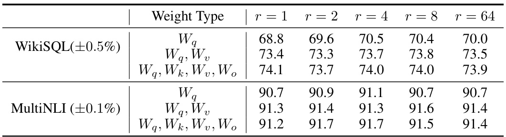
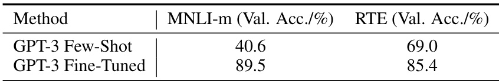

# L O RA: L OW -R ANK  A DAPTATION OF  L ARGE  L AN - GUAGE  M ODELS  

Edward $\mathbf{H}\mathbf{u}^{*}$ Yelong Shen∗Phillip WallisZeyuan Allen-ZhuYuanzhi Li Shean Wang Lu Wang Weizhu Chen Microsoft Corporation  

{ edwardhu, yeshe, phwallis, zeyuana, yuanzhil, swang, luw, wzchen } @microsoft.com yuanzhil@andrew.cmu.edu (Version 2)  

# A BSTRACT  

An important paradigm of natural language processing consists of large-scale pre- training on general domain data and adaptation to particular tasks or domains. As we pre-train larger models, full fine-tuning, which retrains all model parameters, becomes less feasible. Using GPT-3 175B as an example – deploying indepen- dent instances of fine-tuned models, each with 175B parameters, is prohibitively expensive. We propose  Lo w- R ank  A daptation, or LoRA, which freezes the pre- trained model weights and injects trainable rank decomposition matrices into each layer of the Transformer architecture, greatly reducing the number of trainable pa- rameters for downstream tasks. Compared to GPT-3 175B fine-tuned with Adam, LoRA can reduce the number of trainable parameters by 10,000 times and the GPU memory requirement by 3 times. LoRA performs on-par or better than fine- tuning in model quality on RoBERTa, DeBERTa, GPT-2, and GPT-3, despite hav- ing fewer trainable parameters, a higher training throughput, and, unlike adapters, no additional inference latency . We also provide an empirical investigation into rank-deficiency in language model adaptation, which sheds light on the efficacy of LoRA. We release a package that facilitates the integration of LoRA with PyTorch models and provide our implementations and model checkpoints for RoBERTa, DeBERTa, and GPT-2 at  https://github.com/microsoft/LoRA .  

# 1 I NTRODUCTION  

Many applications in natural language processing rely on adapt- ing  one  large-scale, pre-trained language model to  multiple  down- stream applications. Such adaptation is usually done via  fine-tuning , which updates all the parameters of the pre-trained model. The ma- jor downside of fine-tuning is that the new model contains as many parameters as in the original model. As larger models are trained every few months, this changes from a mere “inconvenience” for GPT-2 (Radford et al., b) or RoBERTa large (Liu et al., 2019) to a critical deployment challenge for GPT-3 (Brown et al., 2020) with 175 billion trainable parameters.  

Many sought to mitigate this by adapting only some parameters or learning external modules for new tasks. This way, we only need to store and load a small number of task-specific parameters in ad- dition to the pre-trained model for each task, greatly boosting the operational efficiency when deployed. However, existing techniques  

  
Figure 1: Our reparametriza- tion. We only train  $A$   and  $B$  .  

often introduce inference latency (Houlsby et al., 2019; Rebuffiet al., 2017) by extending model depth or reduce the model’s usable sequence length (Li & Liang, 2021; Lester et al., 2021; Ham- bardzumyan et al., 2020; Liu et al., 2021) (Section 3). More importantly, these method often fail to match the fine-tuning baselines, posing a trade-off between efficiency and model quality.  

We take inspiration from Li et al. (2018a); Aghajanyan et al. (2020) which show that the learned over-parametrized models in fact reside on a low intrinsic dimension. We hypothesize that the change in weights during model adaptation also has a low “intrinsic rank”, leading to our proposed Lo w- R ank  A daptation (LoRA) approach. LoRA allows us to train some dense layers in a neural network indirectly by optimizing rank decomposition matrices of the dense layers’ change during adaptation instead, while keeping the pre-trained weights frozen, as shown in Figure 1. Using GPT-3 175B as an example, we show that a very low rank (i.e.,  $r$   in Figure 1 can be one or two) suffices even when the full rank (i.e.,    $d$  ) is as high as 12,288, making LoRA both storage- and compute-efficient.  

LoRA possesses several key advantages.  

• A pre-trained model can be shared and used to build many small LoRA modules for dif- ferent tasks. We can freeze the shared model and efficiently switch tasks by replacing the matrices  $A$   and    $B$   in Figure 1, reducing the storage requirement and task-switching over- head significantly. • LoRA makes training more efficient and lowers the hardware barrier to entry by up to 3 times when using adaptive optimizers since we do not need to calculate the gradients or maintain the optimizer states for most parameters. Instead, we only optimize the injected, much smaller low-rank matrices. • Our simple linear design allows us to merge the trainable matrices with the frozen weights when deployed,  introducing no inference latency  compared to a fully fine-tuned model, by construction. • LoRA is orthogonal to many prior methods and can be combined with many of them, such as prefix-tuning. We provide an example in Appendix E.  

Terminologies and Conventions We make frequent references to the Transformer architecture and use the conventional terminologies for its dimensions. We call the input and output di- mension size of a Transformer layer    $d_{m o d e l}$  . We use    $W_{q}$  ,    $W_{k}$  ,    $W_{v}$  , and    $W_{o}$   to refer to the query/key/value/output projection matrices in the self-attention module.    $W$   or    $W_{0}$   refers to a pre- trained weight matrix and    $\Delta W$   its accumulated gradient update during adaptation. We use    $r$   to denote the rank of a LoRA module. We follow the conventions set out by (Vaswani et al., 2017; Brown et al., 2020) and use Adam (Loshchilov & Hutter, 2019; Kingma & Ba, 2017) for model optimization and use a Transformer MLP feedforward dimension  $d_{f f n}=4\times d_{m o d e l}$  .  

# 2 P ROBLEM  S TATEMENT  

While our proposal is agnostic to training objective, we focus on language modeling as our motivat- ing use case. Below is a brief description of the language modeling problem and, in particular, the maximization of conditional probabilities given a task-specific prompt.  

Suppose we   a pre-trained autoregressive language model  $P_{\Phi}(y|x)$   parametrized by    $\Phi$  . For instance,  $P_{\Phi}(y|x)$  |  can be a generic multi-task learner such as GPT (Radford et al., b; Brown et al., 2020) based on the Transformer architecture (Vaswani et al., 2017). Consider adapting this pre-trained model to downstream conditional text generation tasks, such as summarization, machine reading comprehension (MRC), and natural language to SQL (NL2SQL). Each downstream task is presented by a training dataset of context-target pairs:    $\mathcal{Z}=\{(x_{i},y_{i})\}_{i=1,..,N}$  , where both    $x_{i}$  and  $y_{i}$   are sequences of tokens. For example, in NL2SQL,  x  is a natural language query and  $y_{i}$   its corresponding SQL command; for summarization,  $x_{i}$   is the content of an article and    $y_{i}$   its summary.  

During full fine-tuning, the model is initialized to pre-trained weights  $\Phi_{0}$   and updated to  $\Phi_{0}+\Delta\Phi$  by repeatedly following the gradient to maximize the conditional language modeling objective:  

$$
\operatorname*{max}_{\Phi}\sum_{(x,y)\in\mathcal{Z}}\sum_{t=1}^{|y|}\log\left(P_{\Phi}(y_{t}|x,y_{<t})\right)
$$  

One of the main drawbacks for full fine-tuning is that for  each  downstream task, we learn a  different set of parameters    $\Delta\Phi$  ension    $|\Delta\Phi|$   equals    $\left|\Phi_{0}\right|$  . Thus, if the pre-trained model is large (such as GPT-3 with  |  $|\Phi_{0}|\,\approx\,175$  | ≈  Billion), storing and deploying many independent instances of fine-tuned models can be challenging, if at all feasible.  

In this paper, we adopt a more parameter-efficient approach, where the task-specific parameter increment    $\Delta\Phi\,=\,\Delta\Phi(\Theta)$   is further encoded by a much smaller-sized set of parameters    $\Theta$   with  $|\Theta|\ll|\Phi_{0}|$  . The task of finding  $\Delta\Phi$   thus becomes optimizing over  $\Theta$  :  

$$
\operatorname*{max}_{\Theta}\sum_{(\boldsymbol{x},\boldsymbol{y})\in\mathcal{Z}}\sum_{t=1}^{|\boldsymbol{y}|}\log\left(p_{\Phi_{0}+\Delta\Phi(\Theta)}(\boldsymbol{y}_{t}|\boldsymbol{x},\boldsymbol{y}_{<t})\right)
$$  

In the subsequent sections, we propose to use a low-rank representation to encode  $\Delta\Phi$   that is both compute- and memory-efficient. When the pre-trained model is GPT-3 175B, the number of train- able parameters  $|\Theta|$   can be as small as    $0.01\%$   of    $\left|\Phi_{0}\right|$  .  

# 3 A REN ’ T  E XISTING  S OLUTIONS  G OOD  E NOUGH ?  

The problem we set out to tackle is by no means new. Since the inception of transfer learning, dozens of works have sought to make model adaptation more parameter- and compute-efficient. See Sec- tion 6 for a survey of some of the well-known works. Using language modeling as an example, there are two prominent strategies when it comes to efficient adaptations: adding adapter layers (Houlsby et al., 2019; Rebuffiet al., 2017; Pfeiffer et al., 2021; R¨ uckl´ e et al., 2020) or optimizing some forms of the input layer activations (Li & Liang, 2021; Lester et al., 2021; Hambardzumyan et al., 2020; Liu et al., 2021). However, both strategies have their limitations, especially in a large-scale and latency-sensitive production scenario.  

Adapter Layers Introduce Inference Latency There are many variants of adapters. We focus on the original design by Houlsby et al. (2019) which has two adapter layers per Transformer block and a more recent one by Lin et al. (2020) which has only one per block but with an additional LayerNorm (Ba et al., 2016). While one can reduce the overall latency by pruning layers or exploit- ing multi-task settings (R¨ uckl´ e et al., 2020; Pfeiffer et al., 2021), there is no direct ways to bypass the extra compute in adapter layers. This seems like a non-issue since adapter layers are designed to have few parameters (sometimes  ${<}1\%$   of the original model) by having a small bottleneck di- mension, which limits the FLOPs they can add. However, large neural networks rely on hardware parallelism to keep the latency low, and adapter layers have to be processed sequentially. This makes a difference in the online inference setting where the batch size is typically as small as one. In a generic scenario without model parallelism, such as running inference on GPT-2 (Radford et al., b) medium on a single GPU, we see a noticeable increase in latency when using adapters, even with a very small bottleneck dimension (Table 1).  

This problem gets worse when we need to shard the model as done in Shoeybi et al. (2020); Lep- ikhin et al. (2020), because the additional depth requires more synchronous GPU operations such as AllReduce  and  Broadcast , unless we store the adapter parameters redundantly many times.  

Directly Optimizing the Prompt is Hard The other direction, as exemplified by prefix tuning (Li & Liang, 2021), faces a different challenge. We observe that prefix tuning is difficult to optimize and that its performance changes non-monotonically in trainable parameters, confirming similar observations in the original paper. More fundamentally, reserving a part of the sequence length for adaptation necessarily reduces the sequence length available to process a downstream task, which we suspect makes tuning the prompt less performant compared to other methods. We defer the study on task performance to Section 5.  

  
Table 1: Infernece latency of a single forward pass in GPT-2 medium measured in milliseconds, av- eraged over 100 trials. We use an NVIDIA Quadro RTX8000. “  $\left\vert\Theta\right\vert$  ” denotes the number of trainable parameters in adapter layers. Adapter L   and Adapter H   are two variants of adapter tuning, which we describe in Section 5.1. The inference latency introduced by adapter layers can be significant in an online, short-sequence-length scenario. See the full study in Appendix B.  

# 4 O UR  M ETHOD  

We describe the simple design of LoRA and its practical benefits. The principles outlined here apply to any dense layers in deep learning models, though we only focus on certain weights in Transformer language models in our experiments as the motivating use case.  

# 4.1 L OW -R ANK -P ARAMETRIZED  U PDATE  M ATRICES  

A neural network contains many dense layers which perform matrix multiplication. The weight matrices in these layers typically have full-rank. When adapting to a specific task, Aghajanyan et al. (2020) shows that the pre-trained language models have a low “instrisic dimension” and can still learn efficiently despite a random projection to a smaller subspace. Inspired by this, we hypothe- size the updates to the weights also have a low “intrinsic rank” during adaptation. For a pre-trained weight matri  $W_{0}\,\in\,\mathbb{R}^{d\times\overbar{k}}$  rain its   the latter with - composition  $W_{0}+\Delta W=W_{0}+B A$  , where  $\mathbf{\dot{B}}\in\mathbb{R}^{d\times r},\mathbf{\dot{A}}\in\mathbb{R}^{r\times\check{k}}$   ∈  ∈ , and he r k  $r\ll\operatorname*{min}(d,k)$   ≪ . During training,  $W_{0}$   is frozen and does not receive gradient updates, while  A  and  B  contain trainable parameters. Note both  $W_{0}$   and    $\Delta W=B A$   are multiplied with the same input, and their respective output vectors are summed coordinate-wise. For  $h=W_{0}x$  , our modified forward pass yields:  

$$
h=W_{0}x+\Delta W x=W_{0}x+B A x
$$  

We illustrate our re para me tri z ation in Figure 1. We use a random Gaussian initialization for  $A$   and zero for    $B$  , so  $\Delta W=B A$   is zero at the beginning of training. We then scale    $\Delta W x$   by  $\textstyle{\frac{\alpha}{r}}$    , where  $\alpha$  is a constant in  $r$  . When optimizing with Adam, tuning  $\alpha$   is roughly the same as tuning the learning rate if we scale the initialization appropriately. As a result, we simply set    $\alpha$   to the first    $r$   we try and do not tune it. This scaling helps to reduce the need to retune hyperparameters when we vary  $r$   (Yang & Hu, 2021).  

A Generalization of Full Fine-tuning. A more general form of fine-tuning allows the training of a subset of the pre-trained parameters. LoRA takes a step further and does not require the accumu- lated gradient update to weight matrices to have full-rank during adaptation. This means that when applying LoRA to all weight matrices and training all biases 2 , we roughly recover the expressive- ness of full fine-tuning by setting the LoRA rank  $r$   to the rank of the pre-trained weight matrices. In other words, as we increase the number of trainable parameters   3 , training LoRA roughly converges to training the original model, while adapter-based methods converges to an MLP and prefix-based methods to a model that cannot take long input sequences.  

No Additional Inference Latency. When deployed in production, we can explicitly compute and store    $W\,=\,W_{0}\,+\,B A$   and perform inference as usual. Note that both    $W_{0}$   and    $B A$   are in    $\mathbb{R}^{d\times k}$  . When we need to switch to another downstream task, we can recover    $W_{0}$   by subtracting    $B A$   and then adding a different    $B^{\prime}A^{\prime}$  , a quick operation with very little memory overhead. Critically, this guarantees that we do not introduce any additional latency during inference compared to a fine-tuned model by construction.  

# 4.2 A PPLYING  L O RA  TO  T RANSFORMER  

In principle, we can apply LoRA to any subset of weight matrices in a neural network to reduce the number of trainable parameters. In the Transformer architecture, there are four weight matrices in the self-attention module   $(W_{q},W_{k},W_{v},W_{o})$   and two in the MLP module. We treat    $W_{q}$   (or  $W_{k}$  ,  $W_{v}$  ) as a single matrix of dimension    $d_{m o d e l}\times d_{m o d e l}$  , even though the output dimension is usually sliced into attention heads. We limit our study to  only adapting the attention weights  for downstream tasks and freeze the MLP modules (so they are not trained in downstream tasks) both for simplicity and parameter-efficiency.We further study the effect on adapting different types of attention weight matrices in a Transformer in Section 7.1. We leave the empirical investigation of adapting the MLP layers, LayerNorm layers, and biases to a future work.  

Practical Benefits and Limitations. The most significant benefit comes from the reduction in memory and storage usage. For a large Transformer trained with Adam, we reduce that VRAM usage by up to  $2/3$   if    $r\,\ll\,d_{m o d e l}$   as we do not need to store the optimizer states for the frozen parameters. On GPT-3 175B, we reduce the VRAM consumption during training from 1.2TB to 350GB. With  $r=4$   and only the query and value projection matrices being adapted, the checkpoint size is reduced by roughly   $10{,}000\times$   (from 350GB to 35MB) 4 . This allows us to train with signifi- cantly fewer GPUs and avoid I/O bottlenecks. Another benefit is that we can switch between tasks while deployed at a much lower cost by only swapping the LoRA weights as opposed to all the parameters. This allows for the creation of many customized models that can be swapped in and out on the fly on machines that store the pre-trained weights in VRAM. We also observe a  $25\%$   speedup during training on GPT-3 175B compared to full fine-tuning 5   as we do not need to calculate the gradient for the vast majority of the parameters.  

LoRA also has its limitations. For example, it is not straightforward to batch inputs to different tasks with different    $A$   and  $B$   in a single forward pass, if one chooses to absorb  $A$   and  $B$   into  $W$   to eliminate additional inference latency. Though it is possible to not merge the weights and dynamically choose the LoRA modules to use for samples in a batch for scenarios where latency is not critical.  

# 5 E MPIRICAL  E XPERIMENTS  

We evaluate the downstream task performance of LoRA on RoBERTa (Liu et al., 2019), De- BERTa (He et al., 2021), and GPT-2 (Radford et al., b), before scaling up to GPT-3 175B (Brown et al., 2020). Our experiments cover a wide range of tasks, from natural language understanding (NLU) to generation (NLG). Specifically, we evaluate on the GLUE (Wang et al., 2019) benchmark for RoBERTa and DeBERTa. We follow the setup of Li & Liang (2021) on GPT-2 for a direct com- parison and add WikiSQL (Zhong et al., 2017) (NL to SQL queries) and SAMSum (Gliwa et al., 2019) (conversation summarization) for large-scale experiments on GPT-3. See Appendix C for more details on the datasets we use. We use NVIDIA Tesla V100 for all experiments.  

# 5.1BASELINES  

To compare with other baselines broadly, we replicate the setups used by prior work and reuse their reported numbers whenever possible. This, however, means that some baselines might only appear in certain experiments.  

Fine-Tuning (FT)  is a common approach for adaptation. During fine-tuning, the model is initialized to the pre-trained weights and biases, and all model parameters undergo gradient updates.A simple variant is to update only some layers while freezing others. We include one such baseline reported in prior work (Li & Liang, 2021) on GPT-2, which adapts just the last two layers   $(\mathbf{FT}^{\mathbf{Top2}})$  ).  

  
Table 2:   $\mathrm{RoBERTa}_{\mathrm{base}}$  ,  $\mathrm{RoBERTa}_{\mathrm{large}}$  , and   $\mathrm{DeBERTa}_{\mathrm{XXL}}$   with different adaptation methods on the GLUE benchmark. We report the overall (matched and mismatched) accuracy for MNLI, Matthew’s correlation for CoLA, Pearson correlation for STS-B, and accuracy for other tasks. Higher is better for all metrics. \* indicates numbers published in prior works.  $\dagger$   indicates runs configured in a setup similar to Houlsby et al. (2019) for a fair comparison.  

Bias-only or BitFit  is a baseline where we only train the bias vectors while freezing everything else. Contemporarily, this baseline has also been studied by BitFit (Zaken et al., 2021).  

Prefix-embedding tuning (PreEmbed)  inserts special tokens among the input tokens. These spe- cial tokens have trainable word embeddings and are generally not in the model’s vocabulary. Where to place such tokens can have an impact on performance. We focus on “prefixing”, which prepends such tokens to the prompt, and “infixing”, which appends to the prompt; both are discussed in Li & Liang (2021). We use  $l_{p}$   (resp.    $l_{i}$  ) denote the number of prefix (resp. infix) tokens. The number of trainable parameters is    $|\Theta|=d_{m o d e l}\times(l_{p}+l_{i})$  .  

Prefix-layer tuning (PreLayer)  is an extension to prefix-embedding tuning. Instead of just learning the word embeddings (or equivalently, the activations after the embedding layer) for some special tokens, we learn the activations after every Transformer layer. The activations computed from pre- vious layers are simply replaced by trainable ones. The resulting number of trainable parameters is  $|\Theta|=L\times d_{m o d e l}\times\left(l_{p}+l_{i}\right)$  , where  $L$   is the number of Transformer layers.  

Adapter tuning  as proposed in Houlsby et al. (2019) inserts adapter layers between the self- attention module (and the MLP module) and the subsequent residual connection. There are two fully connected layers with biases in an adapter layer with a nonlinearity in between. We call this original design  Adapter H . Recently, Lin et al. (2020) proposed a more efficient design with the adapter layer applied only after the MLP module and after a LayerNorm. We call it  Adapter L . This is very similar to another deign proposed in Pfeiffer et al. (2021), which we call  Adapter P . We also include another baseline call AdapterDrop (R¨ uckl´ e et al., 2020) which drops some adapter layers for greater efficiency ( Adapter D ). We cite numbers from prior works whenever possible to maximize the number of baselines we compare with; they are in rows with an asterisk   $(^{*})$   in the first column. In all cases, we have is the number of adapter layers and  $\vert\Theta\vert=\hat{L}_{A d p t}\times\left(2\times d_{m o d e l}\times r+r+d_{m o d e l}\right)+2\times\hat{L}_{L N}\times d_{m o d e l}$   ×  $\hat{L}_{L N}$   the number of trainable LayerNorms (e.g., in Adapter  × ×  ×  where  $\hat{L}_{A d p t}$  L ).  

LoRA  adds trainable pairs of rank decomposition matrices in parallel to existing weight matrices. As mentioned in Section 4.2, we only apply LoRA to  $W_{q}$   and  $W_{v}$   in most experiments for simplicity. The number of trainable parameters is determined by the rank  $r$   and the shape of the original weights:  $\vert\Theta\vert=2\times\hat{L}_{L o R A}\times d_{m o d e l}\times r$  , where  $\hat{L}_{L o R A}$   is the number of weight matrices we apply LoRA to.  

  
Table 3: GPT-2 medium (M) and large (L) with different adaptation methods on the E2E NLG Challenge. For all metrics, higher is better. LoRA outperforms several baselines with comparable or fewer trainable parameters. Confidence intervals are shown for experiments we ran. \* indicates numbers published in prior works.  

# 5.2 R O BERT A BASE / LARGE  

RoBERTa (Liu et al., 2019) optimized the pre-training recipe originally proposed in BERT (Devlin et al., 2019a) and boosted the latter’s task performance without introducing many more trainable parameters. While RoBERTa has been overtaken by much larger models on NLP leaderboards such as the GLUE benchmark (Wang et al., 2019) in recent years, it remains a competitive and popular pre-trained model for its size among practitioners. We take the pre-trained RoBERTa base (125M) and RoBERTa large (355M) from the HuggingFace Transformers library (Wolf et al., 2020) and evaluate the performance of different efficient adaptation approaches on tasks from the GLUE benchmark. We also replicate Houlsby et al. (2019) and Pfeiffer et al. (2021) according to their setup. To ensure a fair comparison, we make two crucial changes to how we evaluate LoRA when comparing with adapters. First, we use the same batch size for all tasks and use a sequence length of 128 to match the adapter baselines. Second, we initialize the model to the pre-trained model for MRPC, RTE, and STS-B, not a model already adapted to MNLI like the fine-tuning baseline. Runs following this more restricted setup from Houlsby et al. (2019) are labeled with  $\dagger$  . The result is presented in Table 2 (Top Three Sections). See Section D.1 for details on the hyperparameters used.  

# 5.3 D E BERT A  XXL  

DeBERTa (He et al., 2021) is a more recent variant of BERT that is trained on a much larger scale and performs very competitively on benchmarks such as GLUE (Wang et al., 2019) and Su- perGLUE (Wang et al., 2020). We evaluate if LoRA can still match the performance of a fully fine-tuned DeBERTa XXL (1.5B) on GLUE. The result is presented in Table 2 (Bottom Section). See Section D.2 for details on the hyperparameters used.  

# 5.4 GPT-2  MEDIUM / LARGE  

Having shown that LoRA can be a competitive alternative to full fine-tuning on NLU, we hope to answer if LoRA still prevails on NLG models, such as GPT-2 medium and large (Radford et al., b). We keep our setup as close as possible to Li & Liang (2021) for a direct comparison. Due to space constraint, we only present our result on E2E NLG Challenge (Table 3) in this section. See Section F.1 for results on WebNLG (Gardent et al., 2017) and DART (Nan et al., 2020). We include a list of the hyperparameters used in Section D.3.  

  

Table 4: Performance of different adaptation methods on GPT-3 175B. We report the logical form validation accuracy on WikiSQL, validation accuracy on MultiNLI-matched, and Rouge-1/2/L on SAMSum. LoRA performs better than prior approaches, including full fine-tuning. The results ve a fluctuation around    $\pm0.5\%$  , MNLI-m around    $\pm0.1\%$  , and SAMSum around  $\pm0.2/\pm0.2/\pm0.1$  ± ± ±  for the three metrics.  

# 5.5 S CALING UP TO  GPT-3 175B  

As a final stress test for LoRA, we scale up to GPT-3 with 175 billion parameters. Due to the high training cost, we only report the typical standard deviation for a given task over random seeds, as opposed to providing one for every entry. See Section D.4 for details on the hyperparameters used.  

As shown in Table 4, LoRA matches or exceeds the fine-tuning baseline on all three datasets. Note that not all methods benefit monotonically from having more trainable parameters, as shown in Fig- ure 2. We observe a significant performance drop when we use more than 256 special tokens for prefix-embedding tuning or more than 32 special tokens for prefix-layer tuning. This corroborates similar observations in Li & Liang (2021). While a thorough investigation into this phenomenon is out-of-scope for this work, we suspect that having more special tokens causes the input distri- bution to shift further away from the pre-training data distribution. Separately, we investigate the performance of different adaptation approaches in the low-data regime in Section F.3.  

  
Figure 2: GPT-3 175B validation accuracy vs. number of trainable parameters of several adaptation methods on WikiSQL and MNLI-matched. LoRA exhibits better scalability and task performance. See Section F.2 for more details on the plotted data points.  

# 6 R ELATED  W ORKS  

Transformer Language Models. Transformer (Vaswani et al., 2017) is a sequence-to-sequence architecture that makes heavy use of self-attention. Radford et al. (a) applied it to autoregressive lan- guage modeling by using a stack of Transformer decoders. Since then, Transformer-based language models have dominated NLP, achieving the state-of-the-art in many tasks. A new paradigm emerged with BERT (Devlin et al., 2019b) and GPT-2 (Radford et al., b) – both are large Transformer lan- guage models trained on a large amount of text – where fine-tuning on task-specific data after pre- training on general domain data provides a significant performance gain compared to training on task-specific data directly. Training larger Transformers generally results in better performance and remains an active research direction. GPT-3 (Brown et al., 2020) is the largest single Transformer language model trained to-date with 175B parameters.  

Prompt Engineering and Fine-Tuning. While GPT-3 175B can adapt its behavior with just a few additional training examples, the result depends heavily on the input prompt (Brown et al., 2020). This necessitates an empirical art of composing and formatting the prompt to maximize a model’s performance on a desired task, which is known as prompt engineering or prompt hacking. Fine-tuning retrains a model pre-trained on general domains to a specific task Devlin et al. (2019b); Radford et al. (a). Variants of it include learning just a subset of the parameters Devlin et al. (2019b); Collobert & Weston (2008), yet practitioners often retrain all of them to maximize the downstream performance. However, the enormity of GPT-3 175B makes it challenging to perform fine-tuning in the usual way due to the large checkpoint it produces and the high hardware barrier to entry since it has the same memory footprint as pre-training.  

Parameter-Efficient Adaptation. Many have proposed inserting  adapter  layers between existing layers in a neural network (Houlsby et al., 2019; Rebuffiet al., 2017; Lin et al., 2020). Our method uses a similar bottleneck structure to impose a low-rank constraint on the weight updates. The key functional difference is that our learned weights can be merged with the main weights during inference, thus not introducing any latency, which is not the case for the adapter layers (Section 3). A comtenporary extension of adapter is  COMPACTER  (Mahabadi et al., 2021), which essentially parametrizes the adapter layers using Kronecker products with some predetermined weight sharing scheme. Similarly, combining LoRA with other tensor product-based methods could potentially improve its parameter efficiency, which we leave to future work. More recently, many proposed optimizing the input word embeddings in lieu of fine-tuning, akin to a continuous and differentiable generalization of prompt engineering (Li & Liang, 2021; Lester et al., 2021; Hambardzumyan et al., 2020; Liu et al., 2021). We include comparisons with Li & Liang (2021) in our experiment section. However, this line of works can only scale up by using more special tokens in the prompt, which take up available sequence length for task tokens when positional embeddings are learned.  

Low-Rank Structures in Deep Learning. Low-rank structure is very common in machine learn- ing. A lot of machine learning problems have certain intrinsic low-rank structure (Li et al., 2016; Cai et al., 2010; Li et al., 2018b; Grasedyck et al., 2013). Moreover, it is known that for many deep learning tasks, especially those with a heavily over-parametrized neural network, the learned neural network will enjoy low-rank properties after training (Oymak et al., 2019). Some prior works even explicitly impose the low-rank constraint when training the original neural network (Sainath et al., 2013; Povey et al., 2018; Zhang et al., 2014; Jaderberg et al., 2014; Zhao et al., 2016; Kho- dak et al., 2021; Denil et al., 2014); however, to the best of our knowledge, none of these works considers low-rank update to a frozen model for  adaptation to downstream tasks . In theory liter- ature, it is known that neural networks outperform other classical learning methods, including the corresponding (finite-width) neural tangent kernels (Allen-Zhu et al., 2019; Li & Liang, 2018) when the underlying concept class has certain low-rank structure (Ghorbani et al., 2020; Allen-Zhu & Li, 2019; Allen-Zhu & Li, 2020a). Another theoretical result in Allen-Zhu & Li (2020b) suggests that low-rank adaptations can be useful for adversarial training. In sum, we believe that our proposed low-rank adaptation update is well-motivated by the literature.  

# 7 U NDERSTANDING THE  L OW -R ANK  U PDATES  

Given the empirical advantage of LoRA, we hope to further explain the properties of the low-rank adaptation learned from downstream tasks. Note that the low-rank structure not only lowers the hardware barrier to entry which allows us to run multiple experiments in parallel, but also gives better interpret ability of how the update weights are correlated with the pre-trained weights. We focus our study on GPT-3 175B, where we achieved the largest reduction of trainable parameters (up to   $10{,}000\times)$   without adversely affecting task performances.  

We perform a sequence of empirical studies to answer the following questions: 1) Given a parameter budget constraint,  which subset of weight matrices  in a pre-trained Transformer should we adapt to maximize downstream performance? 2) Is the “optimal” adaptation matrix    $\Delta W$   really rank- deficient ? If so, what is a good rank to use in practice? 3) What is the connection between    $\Delta W$   and  $W?$   Does    $\Delta W$   highly correlate with  W ? How large is  $\Delta W$   comparing to  $W?$  

We believe that our answers to question (2) and (3) shed light on the fundamental principles of using pre-trained language models for downstream tasks, which is a critical topic in NLP.  

Given a limited parameter budget, which types of weights should we adapt with LoRA to obtain the best performance on downstream tasks? As mentioned in Section 4.2, we only consider weight matrices in the self-attention module. We set a parameter budget of 18M (roughly 35MB if stored in FP16) on GPT-3 175B, which corresponds to    $r=8$   if we adapt one type of attention weights or  $r=4$   if we adapt two types, for all 96 layers. The result is presented in Table 5.  

  

Table 5: Validation accuracy on WikiSQL and MultiNLI after applying LoRA to different types of attention weights in GPT-3, given the same number of trainable parameters. Adapting both    $W_{q}$   and  $W_{v}$   gives the best performance overall. We find the standard deviation across random seeds to be consistent for a given dataset, which we report in the first column.  

Note that putting all the parameters in    $\Delta W_{q}$   or    $\Delta W_{k}$   results in significantly lower performance, while adapting both  $W_{q}$   and    $W_{v}$   yields the best result. This suggests that even a rank of four captures enough information in  $\Delta W$   such that it is preferable to adapt more weight matrices than adapting a single type of weights with a larger rank.  

# 7.2 W HAT IS THE  O PTIMAL  R ANK  $r$   FOR  L O RA?  

  

Table 6: Validation accuracy on WikiSQL and MultiNLI with different rank    $r$  . To our surprise, a rank as small as one suffices for adapting both  $W_{q}$   and  $W_{v}$   on these datasets while training  $W_{q}$   alone needs a larger  $r$  . We conduct a similar experiment on GPT-2 in Section H.2.  

Table 6 shows that, surprisingly, LoRA already performs competitively with a very small    $r$   (more so for    $\{W_{q},W_{v}\}$   than just  $W_{q,i}$  ). This suggests the update matrix    $\Delta W$   could have a very small “intrinsic rank”.   To further support this finding, we check the overlap of the subspaces learned by different choices of    $r$   and by different random seeds. We argue that increasing  $r$   does not cover a more meaningful subspace, which suggests that a low-rank adaptation matrix is sufficient.  

Subspace similarity between different    $\mathbfit{\mathbf{r}}$  . Given  $A_{r=8}$   and    $A_{r=64}$   which are the learned adapta- tion matrices with rank  $r=8$   and  64  using the  same pre-trained model , we perform singular value decomposition and obtain the right-singular unitary matrices    $U_{A_{r=8}}$   and  $U_{A_{r=64}}$  . 7   We hope to an- swer: how much of the subspace spanned y the top  $i$   singular  in  $U_{A_{r=8}}$   $1\leq i\leq8)$  ) is contained in the subspace spanned by top  j  singular vectors of  $U_{A_{r=64}}$   (for  $1\leq j\leq64)$   ≤  ≤ )? We mea- sure this quantity with a normalized subspace similarity based on the Grassmann distance (See Ap- pendix  $\mathbf{G}$   for a more formal discussion)  

$$
\phi(A_{r=8},A_{r=64},i,j)=\frac{||U_{A_{r=8}}^{i\top}U_{A_{r=64}}^{j}||_{F}^{2}}{\operatorname*{min}(i,j)}\in[0,1]
$$  

where  $U_{A_{r=8}}^{i}$    represents the columns of    $U_{A_{r=8}}$    corresponding to the top-  $i$   singular vectors.  

$\phi(\cdot)$   has a range of    $[0,1]$  , where  1 represents a complete overl p of subspaces and  0  a complete separation. See Figure 3 for how  φ  changes as we vary  i  and  j . We only look at the 48th layer (out of 96) due to space constraint, but the conclusion holds for other layers as well, as shown in Section H.1.  

$$
\phi(A_{r=64},A_{r=8},i,j)
$$  

  
Figure 3: Subspace similarity between column vectors of    $A_{r=8}$   and  $A_{r=64}$   for both  $\Delta W_{q}$   and    $\Delta W_{v}$  . The third and the fourth figures zoom in on the lower-left triangle in the first two figures. The top directions in    $r=8$   are included in    $r=64$  , and vice versa.  

We make an  important observation  from Figure 3.  

Directions corresponding to the top singular vector overlap significantly between  $A_{r=8}$   and    $A_{r=64}$  , while others do not. Specifically,    $\Delta W_{v}$   (resp.    $\Delta W_{q})$  ) of    $A_{r=8}$  and    $\Delta W_{v}$   (resp.    $\Delta W_{q})$  ) of  $A_{r=64}$   share a subspace of dimension 1 with normalized similarity  $>\,0.5$  , providing an explanation of why  $r=1$   performs quite well in our downstream tasks for GPT-3.  

Since both    $A_{r=8}$   and    $A_{r=64}$   are learned using the same pre-trained model, Figure 3 indicates that the top singular-vector directions of    $A_{r=8}$   and    $A_{r=64}$   are the most useful, while other directions potentially contain mostly random noises accumulated during training. Hence, the adaptation matrix can indeed have a very low rank.  

Subspace similarity between different random seeds. We further confirm this by plotting the normalized subspace similarity between two randomly seeded runs with    $r=64$  , shown in Figure 4.  $\Delta W_{q}$   appears to have a higher “intrinsic rank” than    $\Delta W_{v}$  , since more common singular value direc- tions are learned by both runs for    $\Delta W_{q}$  , which is in line with our empirical observation in Table 6. As a comparison, we also plot two random Gaussian matrices, which do not share any common singular value directions with each other.  

# 7.3HOW DOES THE ADAPTATION MATRIX ∆W COMPARE TO  $W$  ?  

We further investigate the relationship between  $\Delta W$   and    $W$  . In particular, does    $\Delta W$   highly correlate with  W ? (Or mathematically, is    $\Delta W$   mostly contained in the top singular directions of  $W?$  ) Also,  

  
Figure 4:  Left and Middle:  Normalized subspace similarity between the column vectors of    $A_{r=64}$  from two random seeds, for both    $\Delta W_{q}$   and    $\Delta W_{v}$   in the 48-th layer.  Right:  the same heat-map between the column vectors of two random Gaussian matrices. See Section H.1 for other layers.  

how “large” is    $\Delta W$   comparing to its corresponding directions in    $W^{\ast}$  ? This can shed light on the underlying mechanism for adapting pre-trained language models.  

To answer these questions, we project    $W$   onto the    $r$  -dimensional subspace of    $\Delta W$   by comput- ing    $U^{\top}W V^{\top}$  , with    $U/V$   being the left/right singular-vector matrix of    $\Delta W$  . Then, we com- enius norm b n    $\|U^{\top}W V^{\top}\|_{F}$   and    $\|W\|_{F}$   . As  comparison, we also compute  $\mathbf{\bar{\|}}U^{\top}W V^{\top}\mathbf{\|}_{F}$  ∥ ∥  by replacing  $U,V$   with the top  r  singular vectors of  W  or a random matrix.  

Table 7: The Frobenius norm of    $U^{\top}W_{q}V^{\top}$  where    $U$   and    $V$   are the left/right top  $r$   singular vector directions of either (1)    $\Delta W_{q}$  , (2)  $W_{q}$  , or (3) a random matrix. The weight matrices are taken from the  $48\mathrm{th}$   layer of GPT-3.  

We draw  several conclusions  from Table 7. First,    $\Delta W$   has a stronger correlation with  $W$   compared to a random matrix, indicating that    $\Delta W$   amplifies some features that are already in    $W$  . Second, instead of repeating the top singular directions of    $W$  ,    $\Delta W$   only  amplifies directions that are not emphasized in    $W$  . Thir mplification factor is rather huge:    $\bar{21}.\dot{5}\,\approx\,6.91/0.32$   for    $r\,=\,4$  . See Section H.4 for why  $r=64$   has a smaller amplification factor. We also provide a visualization in Section H.3 for how the correlation changes as we include more top singular directions from  $W_{q}$  . This suggests that the low-rank adaptation matrix potentially  amplifies the important features for specific downstream tasks that were learned but not emphasized in the general pre-training model .  

# 8 C ONCLUSION AND  F UTURE  W ORK  

Fine-tuning enormous language models is prohibitively expensive in terms of the hardware required and the storage/switching cost for hosting independent instances for different tasks. We propose LoRA, an efficient adaptation strategy that neither introduces inference latency nor reduces input sequence length while retaining high model quality. Importantly, it allows for quick task-switching when deployed as a service by sharing the vast majority of the model parameters. While we focused on Transformer language models, the proposed principles are generally applicable to any neural networks with dense layers.  

There are many directions for future works. 1) LoRA can be combined with other efficient adapta- tion methods, potentially providing orthogonal improvement. 2) The mechanism behind fine-tuning or LoRA is far from clear – how are features learned during pre-training transformed to do well on downstream tasks? We believe that LoRA makes it more tractable to answer this than full fine- tuning. 3) We mostly depend on heuristics to select the weight matrices to apply LoRA to. Are there more principled ways to do it? 4) Finally, the rank-deficiency of    $\Delta W$   suggests that    $W$   could be rank-deficient as well, which can also be a source of inspiration for future works.  

# R EFERENCES  

Armen Aghajanyan, Luke Zettlemoyer, and Sonal Gupta. Intrinsic Dimensionality Explains the Effectiveness of Language Model Fine-Tuning.  arXiv:2012.13255 [cs] , December 2020. URL http://arxiv.org/abs/2012.13255 .  

Zeyuan Allen-Zhu and Yuanzhi Li. What Can ResNet Learn Efficiently, Going Beyond Kernels? In NeurIPS , 2019. Full version available at  http://arxiv.org/abs/1905.10337 .  

Zeyuan Allen-Zhu and Yuanzhi Li. Backward feature correction: How deep learning performs deep learning.  arXiv preprint arXiv:2001.04413 , 2020a.  

Zeyuan Allen-Zhu and Yuanzhi Li. Feature purification: How adversarial training performs robust deep learning.  arXiv preprint arXiv:2005.10190 , 2020b.  

Zeyuan Allen-Zhu, Yuanzhi Li, and Zhao Song. A convergence theory for deep learning via over- parameter iz ation. In  ICML , 2019. Full version available at  http://arxiv.org/abs/1811. 03962 .  

Jimmy Lei Ba, Jamie Ryan Kiros, and Geoffrey E. Hinton. Layer normalization, 2016.  

Tom B. Brown, Benjamin Mann, Nick Ryder, Melanie Subbiah, Jared Kaplan, Prafulla Dhari- wal, Arvind Neelakantan, Pranav Shyam, Girish Sastry, Amanda Askell, Sandhini Agarwal, Ariel Herbert-Voss, Gretchen Krueger, Tom Henighan, Rewon Child, Aditya Ramesh, Daniel M. Ziegler, Jeffrey Wu, Clemens Winter, Christopher Hesse, Mark Chen, Eric Sigler, Mateusz Litwin, Scott Gray, Benjamin Chess, Jack Clark, Christopher Berner, Sam McCandlish, Alec Radford, Ilya Sutskever, and Dario Amodei. Language Models are Few-Shot Learners.  arXiv:2005.14165 [cs] , July 2020. URL  http://arxiv.org/abs/2005.14165 .  

Jian-Feng Cai, Emmanuel J Cand\` es, and Zuowei Shen. A singular value thresholding algorithm for matrix completion.  SIAM Journal on optimization , 20(4):1956–1982, 2010.  

Daniel Cer, Mona Diab, Eneko Agirre, Inigo Lopez-Gazpio, and Lucia Specia. Semeval-2017 task 1: Semantic textual similarity multilingual and crosslingual focused evaluation.  Proceedings of the 11th International Workshop on Semantic Evaluation (SemEval-2017) , 2017. doi: 10.18653/ v1/s17-2001. URL  http://dx.doi.org/10.18653/v1/S17-2001 .  

Ronan Collobert and Jason Weston. A unified architecture for natural language processing: deep neural networks with multitask learning. In  Proceedings of the 25th international conference on Machine learning , ICML ’08, pp. 160–167, New York, NY, USA, July 2008. Association for Computing Machinery. ISBN 978-1-60558-205-4. doi: 10.1145/1390156.1390177. URL https://doi.org/10.1145/1390156.1390177 .  

Misha Denil, Babak Shakibi, Laurent Dinh, Marc’Aurelio Ranzato, and Nando de Freitas. Predicting parameters in deep learning, 2014.  

Jacob Devlin, Ming-Wei Chang, Kenton Lee, and Kristina Toutanova. Bert: Pre-training of deep bidirectional transformers for language understanding, 2019a.  

Jacob Devlin, Ming-Wei Chang, Kenton Lee, and Kristina Toutanova. BERT: Pre-training of Deep Bidirectional Transformers for Language Understanding.  arXiv:1810.04805 [cs] , May 2019b. URL  http://arxiv.org/abs/1810.04805 . arXiv: 1810.04805.  

William B. Dolan and Chris Brockett. Automatically constructing a corpus of sentential paraphrases. In  Proceedings of the Third International Workshop on Paraphrasing (IWP2005) , 2005. URL https://aclanthology.org/I05-5002 .  

Claire Gardent, Anastasia Shimorina, Shashi Narayan, and Laura Perez-Beltrachini. The webnlg challenge: Generating text from rdf data. In  Proceedings of the 10th International Conference on Natural Language Generation , pp. 124–133, 2017.  

Behrooz Ghorbani, Song Mei, Theodor Misiakiewicz, and Andrea Montanari. When do neural networks outperform kernel methods?  arXiv preprint arXiv:2006.13409 , 2020. Bogdan Gliwa, Iwona Mochol, Maciej Biesek, and Aleksander Wawer. Samsum corpus: A human- annotated dialogue dataset for abstractive summarization.  CoRR , abs/1911.12237, 2019. URL http://arxiv.org/abs/1911.12237 . Lars Grasedyck, Daniel Kressner, and Christine Tobler. A literature survey of low-rank tensor approximation techniques.  GAMM-Mitteilungen , 36(1):53–78, 2013. Jihun Ham and Daniel D. Lee. Grassmann discriminant analysis: a unifying view on subspace-based learning. In  ICML , pp. 376–383, 2008. URL  https://doi.org/10.1145/1390156. 1390204 . Karen Hambardzumyan, Hrant Khachatrian, and Jonathan May. WARP: Word-level Adversarial ReProgramming.  arXiv:2101.00121 [cs] , December 2020. URL  http://arxiv.org/abs/ 2101.00121 . arXiv: 2101.00121. Pengcheng He, Xiaodong Liu, Jianfeng Gao, and Weizhu Chen. Deberta: Decoding-enhanced bert with disentangled attention, 2021. Neil Houlsby, Andrei Giurgiu, Stanislaw Jastrzebski, Bruna Morrone, Quentin de Laroussilhe, Andrea Gesmundo, Mona Attariyan, and Sylvain Gelly. Parameter-Efficient Transfer Learning for NLP.  arXiv:1902.00751 [cs, stat] , June 2019. URL  http://arxiv.org/abs/1902. 00751 . Max Jaderberg, Andrea Vedaldi, and Andrew Zisserman. Speeding up convolutional neural networks with low rank expansions.  arXiv preprint arXiv:1405.3866 , 2014. Mikhail Khodak, Neil Tenenholtz, Lester Mackey, and Nicol\` o Fusi. Initialization and regularization of factorized neural layers, 2021. Diederik P. Kingma and Jimmy Ba. Adam: A method for stochastic optimization, 2017. Dmitry Lepikhin, HyoukJoong Lee, Yuanzhong Xu, Dehao Chen, Orhan Firat, Yanping Huang, Maxim Krikun, Noam Shazeer, and Zhifeng Chen. Gshard: Scaling giant models with conditional computation and automatic sharding, 2020. Brian Lester, Rami Al-Rfou, and Noah Constant. The Power of Scale for Parameter-Efficient Prompt Tuning.  arXiv:2104.08691 [cs] , April 2021. URL  http://arxiv.org/abs/2104.08691 . arXiv: 2104.08691. Chunyuan Li, Heerad Farkhoor, Rosanne Liu, and Jason Yosinski. Measuring the Intrinsic Di- mension of Objective Landscapes. arXiv:1804.08838 [cs, stat] , April 2018a. URL  http: //arxiv.org/abs/1804.08838 . arXiv: 1804.08838. Xiang Lisa Li and Percy Liang. Prefix-Tuning: Optimizing Continuous Prompts for Generation. arXiv:2101.00190 [cs] , January 2021. URL  http://arxiv.org/abs/2101.00190 . Yuanzhi Li and Yingyu Liang. Learning over parameterized neural networks via stochastic gradient descent on structured data. In  Advances in Neural Information Processing Systems , 2018. Yuanzhi Li, Yingyu Liang, and Andrej Risteski. Recovery guarantee of weighted low-rank ap- proximation via alternating minimization. In  International Conference on Machine Learning , pp. 2358–2367. PMLR, 2016. Yuanzhi Li, Tengyu Ma, and Hongyang Zhang. Algorithmic regularization in over-parameterized matrix sensing and neural networks with quadratic activations. In  Conference On Learning The- ory , pp. 2–47. PMLR, 2018b. Zhaojiang Lin, Andrea Madotto, and Pascale Fung. Exploring versatile generative language model via parameter-efficient transfer learning. In  Findings of the Association for Computational Lin- guistics: EMNLP 2020 , pp. 441–459, Online, November 2020. Association for Computational Linguistics. doi: 10.18653/v1/2020.findings-emnlp.41. URL  https://aclanthology. org/2020.findings-emnlp.41 .  

Xiao Liu, Yanan Zheng, Zhengxiao Du, Ming Ding, Yujie Qian, Zhilin Yang, and Jie Tang. GPT Understands, Too.  arXiv:2103.10385 [cs] , March 2021. URL  http://arxiv.org/abs/ 2103.10385 . arXiv: 2103.10385. Yinhan Liu, Myle Ott, Naman Goyal, Jingfei Du, Mandar Joshi, Danqi Chen, Omer Levy, Mike Lewis, Luke Zettlemoyer, and Veselin Stoyanov. Roberta: A robustly optimized bert pretraining approach, 2019. Ilya Loshchilov and Frank Hutter. Decoupled weight decay regularization. arXiv preprint arXiv:1711.05101 , 2017. Ilya Loshchilov and Frank Hutter. Decoupled weight decay regularization, 2019. Rabeeh Karimi Mahabadi, James Henderson, and Sebastian Ruder. Compacter: Efficient low-rank hypercomplex adapter layers, 2021. Linyong Nan, Dragomir Radev, Rui Zhang, Amrit Rau, Abhinand Sivaprasad, Chiachun Hsieh, Xiangru Tang, Aadit Vyas, Neha Verma, Pranav Krishna, et al. Dart: Open-domain structured data record to text generation.  arXiv preprint arXiv:2007.02871 , 2020. Jekaterina Novikova, Ondˇ rej Duˇ sek, and Verena Rieser. The e2e dataset: New challenges for end- to-end generation.  arXiv preprint arXiv:1706.09254 , 2017. Samet Oymak, Zalan Fabian, Mingchen Li, and Mahdi Soltanolkotabi. Generalization guaran- tees for neural networks via harnessing the low-rank structure of the jacobian.  arXiv preprint arXiv:1906.05392 , 2019. Jonas Pfeiffer, Aishwarya Kamath, Andreas R¨ uckl´ e, Kyunghyun Cho, and Iryna Gurevych. Adapter- fusion: Non-destructive task composition for transfer learning, 2021. Daniel Povey, Gaofeng Cheng, Yiming Wang, Ke Li, Hainan Xu, Mahsa Yarmohammadi, and San- jeev Khudanpur. Semi-orthogonal low-rank matrix factorization for deep neural networks. In Interspeech , pp. 3743–3747, 2018. Alec Radford, Karthik Narasimhan, Tim Salimans, and Ilya Sutskever. Improving Language Under- standing by Generative Pre-Training. pp. 12, a. Alec Radford, Jeffrey Wu, Rewon Child, David Luan, Dario Amodei, and Ilya Sutskever. Language Models are Unsupervised Multitask Learners. pp. 24, b. Pranav Rajpurkar, Robin Jia, and Percy Liang. Know what you don’t know: Unanswerable questions for squad.  CoRR , abs/1806.03822, 2018. URL  http://arxiv.org/abs/1806.03822 . Sylvestre-Alvise Rebuffi, Hakan Bilen, and Andrea Vedaldi. Learning multiple visual domains with residual adapters.  arXiv:1705.08045 [cs, stat] , November 2017. URL  http://arxiv.org/ abs/1705.08045 . arXiv: 1705.08045. Andreas R¨ uckl´ e, Gregor Geigle, Max Glockner, Tilman Beck, Jonas Pfeiffer, Nils Reimers, and Iryna Gurevych. Adapterdrop: On the efficiency of adapters in transformers, 2020. Tara N Sainath, Brian Kingsbury, Vikas Sindhwani, Ebru Arisoy, and Bhuvana Ramabhadran. Low- rank matrix factorization for deep neural network training with high-dimensional output targets. In  2013 IEEE international conference on acoustics, speech and signal processing , pp. 6655– 6659. IEEE, 2013. Mohammad Shoeybi, Mostofa Patwary, Raul Puri, Patrick LeGresley, Jared Casper, and Bryan Catanzaro. Megatron-lm: Training multi-billion parameter language models using model par- allelism, 2020. Richard Socher, Alex Perelygin, Jean Wu, Jason Chuang, Christopher D. Manning, Andrew  $\mathrm{Ng}.$  , and Christopher Potts. Recursive deep models for semantic compositional it y over a sentiment treebank. In  Proceedings of the 2013 Conference on Empirical Methods in Natural Language Processing , pp. 1631–1642, Seattle, Washington, USA, October 2013. Association for Computa- tional Linguistics. URL  https://aclanthology.org/D13-1170 .  

Ashish Vaswani, Noam Shazeer, Niki Parmar, Jakob Uszkoreit, Llion Jones, Aidan N Gomez, Łukasz Kaiser, and Illia Polosukhin. Attention is all you need. In  Proceedings of the 31st In- ternational Conference on Neural Information Processing Systems , pp. 6000–6010, 2017. Alex Wang, Amanpreet Singh, Julian Michael, Felix Hill, Omer Levy, and Samuel R. Bowman. Glue: A multi-task benchmark and analysis platform for natural language understanding, 2019. Alex Wang, Yada Pruksachatkun, Nikita Nangia, Amanpreet Singh, Julian Michael, Felix Hill, Omer Levy, and Samuel R. Bowman. Superglue: A stickier benchmark for general-purpose language understanding systems, 2020. Alex Warstadt, Amanpreet Singh, and Samuel R Bowman. Neural network acceptability judgments. arXiv preprint arXiv:1805.12471 , 2018. Adina Williams, Nikita Nangia, and Samuel Bowman. A broad-coverage challenge corpus for sen- tence understanding through inference. In  Proceedings of the 2018 Conference of the North American Chapter of the Association for Computational Linguistics: Human Language Technolo- gies, Volume 1 (Long Papers) , pp. 1112–1122, New Orleans, Louisiana, June 2018. Association for Computational Linguistics. doi: 10.18653/v1/N18-1101. URL  https://www.aclweb. org/anthology/N18-1101 . Thomas Wolf, Lysandre Debut, Victor Sanh, Julien Chaumond, Clement Delangue, Anthony Moi, Pierric Cistac, Tim Rault, R´ emi Louf, Morgan Funtowicz, Joe Davison, Sam Shleifer, Patrick von Platen, Clara Ma, Yacine Jernite, Julien Plu, Canwen Xu, Teven Le Scao, Sylvain Gug- ger, Mariama Drame, Quentin Lhoest, and Alexander M. Rush. Transformers: State-of-the-art natural language processing. In  Proceedings of the 2020 Conference on Empirical Methods in Natural Language Processing: System Demonstrations , pp. 38–45, Online, October 2020. As- sociation for Computational Linguistics. URL  https://www.aclweb.org/anthology/ 2020.emnlp-demos.6 . Greg Yang and Edward J. Hu. Feature Learning in Infinite-Width Neural Networks. arXiv:2011.14522 [cond-mat] , May 2021. URL  http://arxiv.org/abs/2011.14522 . arXiv: 2011.14522. Elad Ben Zaken, Shauli Ravfogel, and Yoav Goldberg. Bitfit: Simple parameter-efficient fine-tuning for transformer-based masked language-models, 2021. Yu Zhang, Ekapol Chuangsuwanich, and James Glass. Extracting deep neural network bottleneck features using low-rank matrix factorization. In  2014 IEEE international conference on acoustics, speech and signal processing (ICASSP) , pp. 185–189. IEEE, 2014. Yong Zhao, Jinyu Li, and Yifan Gong. Low-rank plus diagonal adaptation for deep neural networks. In  2016 IEEE International Conference on Acoustics, Speech and Signal Processing (ICASSP) , pp. 5005–5009. IEEE, 2016. Victor Zhong, Caiming Xiong, and Richard Socher. Seq2sql: Generating structured queries from natural language using reinforcement learning.  CoRR , abs/1709.00103, 2017. URL  http:// arxiv.org/abs/1709.00103 .  

# A L ARGE  L ANGUAGE  M ODELS  S TILL  N EED  P ARAMETER  U PDATES  

Few-shot learning, or prompt engineering, is very advantageous when we only have a handful of training samples. However, in practice, we can often afford to curate a few thousand or more training examples for performance-sensitive applications. As shown in Table 8, fine-tuning improves the model performance drastically compared to few-shot learning on datasets large and small. We take the GPT-3 few-shot result on RTE from the GPT-3 paper (Brown et al., 2020). For MNLI-matched, we use two demonstrations per class and six in-context examples in total.  

  

# B I NFERENCE  L ATENCY  I NTRODUCED BY  A DAPTER  L AYERS  

Adapter layers are external modules added to a pre-trained model in a  sequential  manner, whereas our proposal, LoRA, can be seen as external modules added in a parallel manner. Consequently, adapter layers must be computed in addition to the base model, inevitably introducing additional latency. While as pointed out in R¨ uckl´ e et al. (2020), the latency introduced by adapter layers can be mitigated when the model batch size and/or sequence length is large enough to full utilize the hardware parallelism. We confirm their observation with a similar latency study on GPT-2 medium and point out that there are scenarios, notably online inference where the batch size is small, where the added latency can be significant.  

We measure the latency of a single forward pass on an NVIDIA Quadro RTX8000 by averaging over 100 trials. We vary the input batch size, sequence length, and the adapter bottleneck dimension  $r$  . We test two adapter designs: the original one by Houlsby et al. (2019), which we call Adapter H , and a recent, more efficient variant by Lin et al. (2020), which we call Adapter L . See Section 5.1 for more details on the designs. We plot the slow-down in percentage compared to the no-adapter baseline in Figure 5.  

  
Figure 5: Percentage slow-down of inference latency compared to the no-adapter   $(r=0)$  ) baseline. The top row shows the result for Adapter H   and the bottom row Adapter L . Larger batch size and sequence length help to mitigate the latency, but the slow-down can be as high as over   $30\%$   in an online, short-sequence-length scenario. We tweak the colormap for better visibility.  

# C D ATASET  D ETAILS  

GLUE Benchmark  is a wide-ranging collection of natural language understanding tasks. It includes MNLI (inference, Williams et al. (2018)), SST-2 (sentiment analysis, Socher et al. (2013)), MRPC

 (paraphrase detection, Dolan & Brockett (2005)), CoLA (linguistic acceptability, Warstadt et al.

 (2018)), QNLI (inference, Rajpurkar et al. (2018)),  $\mathbf{Q}\mathbf{Q}\mathbf{P}^{8}$    (question-answering), RTE (inference), and STS-B (textual similarity, Cer et al. (2017)). The broad coverage makes GLUE benchmark a standard metric to evaluate NLU models such as RoBERTa and DeBERTa. The individual datasets are released under different permissive licenses.  

WikiSQL  is introduced in Zhong et al. (2017) and contains  56 ,  355 / 8 ,  421  training/validation ex- amples. The task is to generate SQL queries from natural language questions and table schemata. We encode context as    $x=\{\mathrm{{tblue~schema},q u e r y}\}$   and target as    $y=\{\mathrm{SQL}\}$  . The dataset is release under the BSD 3-Clause License.  

SAMSum  is introduced in Gliwa et al. (2019) and contains  14 ,  732 / 819  training/test examples. It consists of staged chat conversations between two people and corresponding abstractive summaries written by li ode context as  $\leftrightsquigarrow$   concatenated utterances followed by a   $\leftrightsquigarrow\mathfrak{n}\backslash\mathfrak{n}^{\ast}\right.$  , and target as  $y=\{\mathrm{summandY}\}$   { } . The dataset is released under the non-commercial licence: Creative Commons BY-NC-ND 4.0.  

E2E NLG Challenge  was first introduced in Novikova et al. (2017) as a dataset for training end-to- end, data-driven natural language generation systems and is commonly used for data-to-text evalua- tion. The E2E dataset consists of roughly  42 ,  000  training,  4 ,  600  validation, and  4 ,  600  test exam- ples from the restaurant domain. Each source table used as input can have multiple references. Each sample input    $(x,y)$   consists of a sequence of slot-value pairs, along with a corresponding natural language reference text. The dataset is released under Creative Commons BY-NC-SA 4.0.  

DART  is an open-domain data-to-text dataset described in Nan et al. (2020). DART inputs are structured as sequences of ENTITY — RELATION — ENTITY triples. With    $82K$   examples in total, DART is a significantly larger and more complex data-to-text task compared to E2E. The dataset is released under the MIT license.  

WebNLG  is another commonly used dataset for data-to-text evaluation (Gardent et al., 2017). With  $22K$   examples in total WebNLG comprises 14 distinct categories, nine of which are seen during training. Since five of the 14 total categories are not seen during training, but are represented in the test set, evaluation is typically broken out by “seen” categories (S), “unseen” categories (U) and “all” (A). Each input example is represented by a sequence of SUBJECT — PROPERTY — OBJECT triples. The dataset is released under Creative Commons BY-NC-SA 4.0.  

# D H YPERPARAMETERS  U SED IN  E XPERIMENTS  

D.1 R O BERT A  

We train using AdamW with a linear learning rate decay schedule. We sweep learning rate, number of training epochs, and batch size for LoRA. Following Liu et al. (2019), we initialize the LoRA modules to our best MNLI checkpoint when adapting to MRPC, RTE, and STS-B, instead of the usual initialization; the pre-trained model stays frozen for all tasks. We report the median over 5 random seeds; the result for each run is taken from the best epoch. For a fair comparison with the setup in Houlsby et al. (2019) and Pfeiffer et al. (2021), we restrict the model sequence length to 128 and used a fixed batch size for all tasks. Importantly, we start with the pre-trained RoBERTa large model when adapting to MRPC, RTE, and STS-B, instead of a model already adapted to MNLI. The runs with this restricted setup are marked with    $\dagger$  . See the hyperparameters used in our runs in Table 9.  

D.2 D E BERT A  

We again train using AdamW with a linear learning rate decay schedule. Following He et al. (2021), we tune learning rate, dropout probability, warm-up steps, and batch size. We use the same model sequence length used by (He et al., 2021) to keep our comparison fair. Following He et al. (2021), we initialize the LoRA modules to our best MNLI checkpoint when adapting to MRPC, RTE, and STS-B, instead of the usual initialization; the pre-trained model stays frozen for all tasks. We report the median over 5 random seeds; the result for each run is taken from the best epoch. See the hyperparameters used in our runs in Table 10.  

  

# D.3 GPT-2  

We train all of our GPT-2 models using AdamW (Loshchilov & Hutter, 2017) with a linear learning rate schedule for 5 epochs. We use the batch size, learning rate, and beam search beam size described in Li & Liang (2021). Accordingly, we also tune the above hyperparameters for LoRA. We report the mean over 3 random seeds; the result for each run is taken from the best epoch. The hyperparameters used for LoRA in GPT-2 are listed in Table 11. For those used for other baselines, see Li & Liang (2021).  

# D.4 GPT-3  

For all GPT-3 experiments, we train using AdamW (Loshchilov & Hutter, 2017) for 2 epochs with a batch size of 128 samples and a weight decay factor of 0.1. We use a sequence length of 384 for  

  

  

WikiSQL (Zhong et al., 2017), 768 for MNLI (Williams et al., 2018), and 2048 for SAMSum (Gliwa et al., 2019). We tune learning rate for all method-dataset combinations. See Section D.4 for more details on the hyperparameters used. For prefix-embedding tuning, we find the optimal    $l_{p}$   and    $l_{i}$  to be 256 and 8, respectively, totalling    $3.2M$   trainable parameters. We use    $l_{p}\,=\,8$   and  $l_{i}\,=\,8$   for prefix-layer tuning with    $20.2M$   trainable parameters to obtain the overall best performance. We present two parameter budgets for LoRA: 4.7M   $r_{q}=r_{v}=1$   or  $r_{v}=2$  ) and 37.7M   $(r_{q}=r_{v}=8$  or  $r_{q}=r_{k}=r_{v}=r_{o}=2)$  ). We report the best validation performance from each run. The training hyperparameters used in our GPT-3 experiments are listed in Table 12.  

# E C OMBINING  L O RA  WITH  P REFIX  T UNING  

LoRA can be naturally combined with existing prefix-based approaches. In this section, we evaluate two combinations of LoRA and variants of prefix-tuning on WikiSQL and MNLI.  

LoRA+PrefixEmbed   $(\mathbf{LO}\mathbf{AA}+\mathbf{PE})$  )  combines LoRA with prefix-embedding tuning, where we insert  $l_{p}+l_{i}$   special tokens whose embeddings are treated as trainable parameters. For more on prefix- embedding tuning, see Section 5.1.  

LoRA+PrefixLayer   $(\mathbf{LOAA+PL})$  )  combines LoRA with prefix-layer tuning. We also insert  $l_{p}+l_{i}$  special tokens; however, instead of letting the hidden representations of these tokens evolve natu-  

  
Table 12: The training hyperparameters used for different GPT-3 adaption methods. We use the same hyperparameters for all datasets after tuning learning rate.  

rally, we replace them after every Transformer block with an input agnostic vector. Thus, both the embeddings and subsequent Transformer block activations are treated as trainable parameters. For more on prefix-layer tuning, see Section 5.1.  

In Table 15, we show the evaluation results of  $_\mathrm{L oRA+PE}$   and  $_\mathrm{LoRAA+PL}$   on WikiSQL and MultiNLI. First of all,   $_\mathrm{L oRA+PE}$   significantly outperforms both LoRA and prefix-embedding tuning on WikiSQL, which indicates that LoRA is somewhat orthogonal to prefix-embedding tuning. On MultiNLI, the combination of  $_\mathrm{L oRA+PE}$   doesn’t perform better than LoRA, possibly because LoRA on its own already achieves performance comparable to the human baseline. Secondly, we notice that   $_\mathrm{L oRA+PL}$   performs slightly worse than LoRA even with more trainable parameters. We at- tribute this to the fact that prefix-layer tuning is very sensitive to the choice of learning rate and thus makes the optimization of LoRA weights more difficult in  $_\mathrm{L oRA+PL}$  .  

# F A DDITIONAL  E MPIRICAL  E XPERIMENTS  

# F.1 A DDITIONAL  E XPERIMENTS ON  GPT-2  

We also repeat our experiment on DART (Nan et al., 2020) and WebNLG (Gardent et al., 2017) following the setup of Li & Liang (2021). The result is shown in Table 13. Similar to our result on E2E NLG Challenge, reported in Section 5, LoRA performs better than or at least on-par with prefix-based approaches given the same number of trainable parameters.  

  

Table 13: GPT-2 with different adaptation methods on DART. The variances of MET and TER are less than  0 . 01  for all adaption approaches.  

  
Table 14: GPT-2 with different adaptation methods on WebNLG. The variances of MET and TER are less than  0 . 01  for all the experiments we ran. “U” indicates unseen categories, “S” indicates seen categories, and “A” indicates all categories in the test set of WebNLG.  

# F.2 A DDITIONAL  E XPERIMENTS ON  GPT-3  

We present additional runs on GPT-3 with different adaptation methods in Table 15. The focus is on identifying the trade-off between performance and the number of trainable parameters.  

# F.3 L OW -D ATA  R EGIME  

To evaluate the performance of different adaptation approaches in the low-data regime. we randomly sample 100, 1k and   $10\mathbf{k}$   training examples from the full training set of MNLI to form the low-data MNLI-  $\cdot n$   tasks. In Table 16, we show the performance of different adaptation approaches on MNLI-  $n$  . To our surprise, PrefixEmbed and PrefixLayer performs very poorly on MNLI-100 dataset, with PrefixEmbed performing only slightly better than random chance   $(37.6\%$   vs.   $33.3\%$  ). PrefixLayer performs better than PrefixEmbed but is still significantly worse than Fine-Tune or LoRA on MNLI- 100. The gap between prefix-based approaches and LoRA/Fine-tuning becomes smaller as we in- crease the number of training examples, which might suggest that prefix-based approaches are not suitable for low-data tasks in GPT-3. LoRA achieves better performance than fine-tuning on both MNLI-100 and MNLI-Full, and comparable results on MNLI-1k and MNLI-10K considering the  $(\pm0.3)$   variance due to random seeds.  

The training hyperparameters of different adaptation approaches on MNLI-n are reported in Ta- ble 17. We use a smaller learning rate for PrefixLayer on the MNLI-100 set, as the training loss does not decrease with a larger learning rate.  

# G M EASURING  S IMILARITY  B ETWEEN  S UBSPACES  

In this paper we use the measure  $\begin{array}{r}{\phi(A,B,i,j)=\psi(U_{A}^{i},U_{B}^{j})=\frac{||U_{A}^{i\top}U_{B}||_{F}^{2}}{\operatorname*{min}\{i,j\}}}\end{array}$  to measure the subspace { } similarity between two column orthonormal matrices    $U_{A}^{i}\,\in\,\mathbb{R}^{d\times i}$    ∈  and    $U_{B}^{j}\,\in\,\mathbb{R}^{d\times j}$    ∈ , obtained by taking columns of the left singular matrices of    $A$   and    $B$  . We point out that this similarity is simply a reverse of the standard Projection Metric that measures distance between subspaces Ham & Lee (2008).  

  

  

Table 16: Validation accuracy of different methods on subsets of MNLI using GPT-3 175B. MNLI-  $n$   describes a subset with    $n$   training examples. We evaluate with the full validation set. LoRA performs exhibits favorable sample-efficiency compared to other methods, including fine-tuning.  

To be concrete, let the singular values of    $U_{A}^{i\top}U_{B}^{j}$    to be    $\sigma_{1},\sigma_{2},\cdots,\sigma_{p}$   where    $p=\operatorname*{min}\{i,j\}$  . We know that the Projection Metric Ham & Lee (2008) is defined as:  

$$
d(U_{A}^{i},U_{B}^{j})=\sqrt{p-\sum_{i=1}^{p}\sigma_{i}^{2}}\in[0,\sqrt{p}]
$$  

  

where our similarity is defined as:  

$$
\phi(A,B,i,j)=\psi(U_{A}^{i},U_{B}^{j})=\frac{\sum_{i=1}^{p}\sigma_{i}^{2}}{p}=\frac{1}{p}\left(1-d(U_{A}^{i},U_{B}^{j})^{2}\right)
$$  

This similarity satisfies that if    $U_{A}^{i}$    and  $U_{B}^{j}$    share the same column span, then    $\phi(A,B,i,j)=1$  . If they are completely orthogonal, then  $\phi(\tilde{A,}B,i,j)=0$  . Otherwise,    $\phi(A,B,i,j)\in(0,1)$  .  

# H A DDITIONAL  E XPERIMENTS ON  L OW -R ANK  M ATRICES  

We present additional results from our investigation into the low-rank update matrices.  

# H.1 C ORRELATION BETWEEN  L O RA M ODULES  

See Figure 6 and Figure 7 for how the results presented in Figure 3 and Figure 4 generalize to other layers.  

# H.2 E FFECT OF  $r$   ON  GPT-2  

We repeat our experiment on the effect of  $r$   (Section 7.2) in GPT-2. Using the E2E NLG Challenge dataset as an example, we report the validation loss and test metrics achieved by different choices of    $r$   after training for 26,000 steps. We present our result in Table 18. The optimal rank for GPT-2 Medium is between 4 and 16 depending on the metric used, which is similar to that for GPT-3 175B. Note that the relationship between model size and the optimal rank for adaptation is still an open question.  

# H.3 C ORRELATION BETWEEN  $W$   AND    $\Delta W$  

See Figure 8 for the normalized subspace similarity between    $W$   and    $\Delta W$   with varying  $r$  .  

Note again that    $\Delta W$   does not contain the top singular directions of    $W$  , since the similarity between the top 4 directions in  $\Delta W$   and the top-  $.10\%$   of those in  $W$   barely exceeds 0.2. This gives evidence that  $\Delta W$   contains those “task-specific” directions that are otherwise  not  emphasized in  $W$  .  

An interesting next question to answer, is how “strong” do we need to amplify those task-specific directions, in order for the model adaptation to work well?  

  
Figure 6: Normalized subspace similarity between the column vectors of    $A_{r=8}$   and  $A_{r=64}$   for both  $\Delta W_{q}$   and  $\Delta W_{v}$   from the 1st, 32nd, 64th, and 96th layers in a 96-layer Transformer.  

# H.4 A MPLIFICATION  F ACTOR  

One can naturally consider a  feature amplification factor  as the  ratio  $\frac{||\Delta W||_{F}}{||U^{\top}W V^{\top}||_{F}}$    , where    $U$   and    $V$  ∥ ∥ are the left- and right-singular matrices of the SVD decomposition of    $\Delta W$  . (Recall    $U U^{\top}W V^{\top}V$  gives the “projection” of  $W$   onto the subspace spanned by    $\Delta W$  .)  

Intuitively, when  $\Delta W$   mostly contains task-specific directions, this quantity measures how much of them are amplified by  $\Delta W$  . As shown in Section 7.3, for  $r=4$  , this amplification factor is as large as 20. In other words, there are (generally speaking) four feature directions in each layer (out of the entire feature space from the pre-trained model  $W$  ), that need to be amplified by a very large factor 20, in order to achieve our reported accuracy for the downstream specific task. And, one should expect a very different set of feature directions to be amplified for each different downstream task.  

One may notice, however, for    $r\,=\,64$  , this amplification factor is only around 2, meaning that most  directions learned in    $\Delta W$   with    $r\,=\,64$   are  not  being amplified by much. This should not be surprising, and in fact gives evidence (once again) that the intrinsic rank  needed  to represent the “task-specific directions” (thus for model adaptation) is low. In contrast, those directions in the rank-4 version of    $\Delta W$   (corresponding to  $r=4$  ) are amplified by a much larger factor 20.  

  
Figure 7: Normalized subspace similarity between the column vectors of    $A_{r=64}$   from two randomly seeded runs, for both    $\Delta W_{q}$   and    $\Delta W_{v}$   from the 1st, 32nd, 64th, and 96th layers in a 96-layer Trans- former.  

  

Table 18: Validation loss and test set metrics on E2E NLG Challenge achieved by LoRA with different rank  $r$   using GPT-2 Medium. Unlike on GPT-3 where  $r=1$   suffices for many tasks, here the performance peaks at    $r\,=\,16$   for validation loss and  $r\,=\,4$   for BLEU, suggesting the GPT-2 Medium has a similar intrinsic rank for adaptation compared to GPT-3 175B. Note that some of our hyperparameters are tuned on  $r=4$  , which matches the parameter count of another baseline, and thus might not be optimal for other choices of    $r$  .  

  
Figure 8: Normalized subspace similarity between the singular directions of    $W_{q}$   and those of    $\Delta W_{q}$  with varying    $r$   and a random baseline.    $\Delta W_{q}$   amplifies directions that are important but not empha- sized in    $W$  .    $\Delta W$   with a larger  $r$   tends to pick up more directions that are already emphasized in  $W$  .  