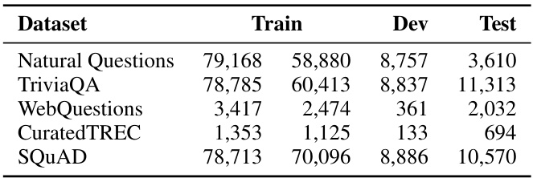
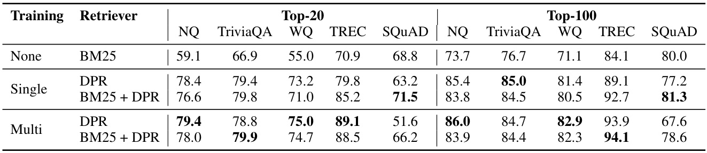
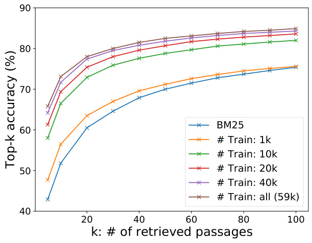
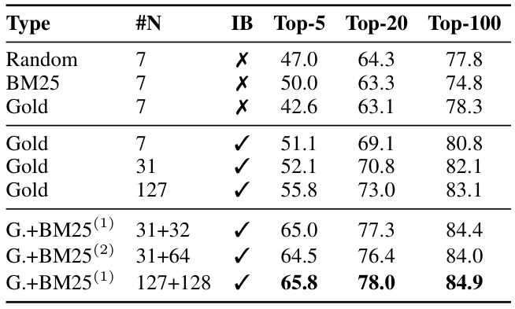
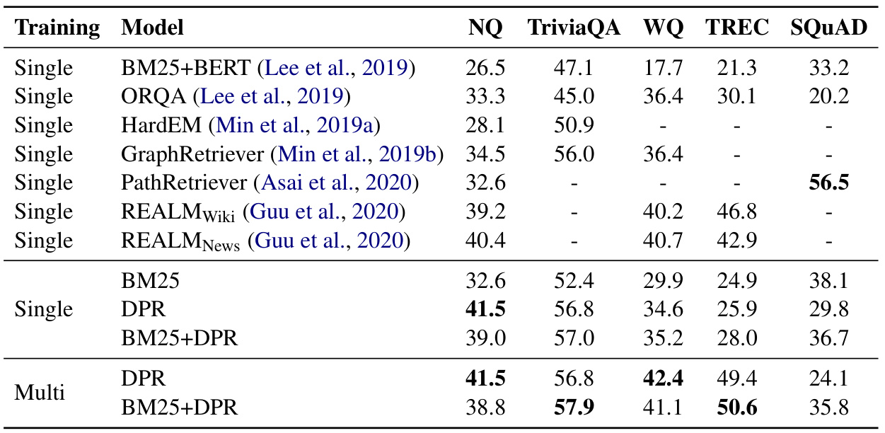
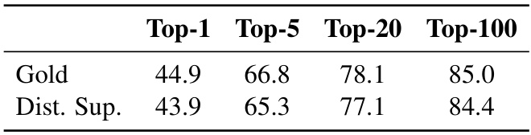
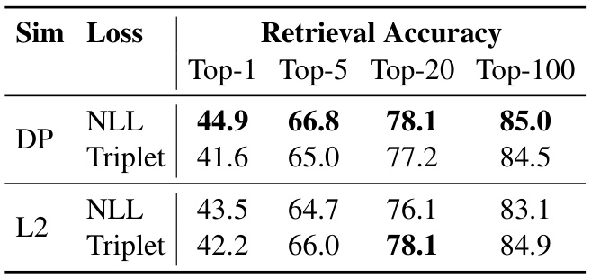
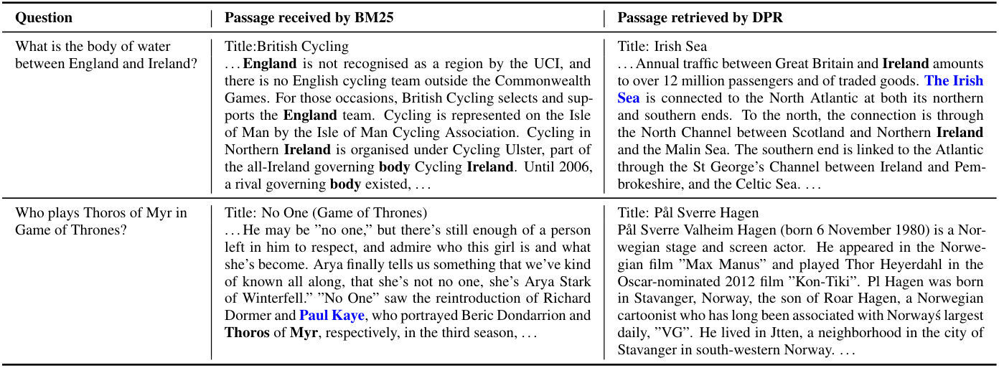

# Dense Passage Retrieval for Open-Domain Question Answering  

# Vladimir Karpukhin , Barlas O˘ guz , Sewon Min † , Patrick Lewis, Ledell Wu, Sergey Edunov, Danqi Chen ‡ , Wen-tau Yih  

Facebook AI † University of Washington ‡ Princeton University  

{ vladk, barlaso, plewis, ledell, edunov, scottyih } @fb.com sewon@cs.washington.edu danqic@cs.princeton.edu  

# Abstract  

Open-domain question answering relies on ef- ficient passage retrieval to select candidate contexts, where traditional sparse vector space models, such as TF-IDF or BM25, are the de facto method. In this work, we show that retrieval can be practically implemented us- ing  dense  representations alone, where em- beddings are learned from a small number of questions and passages by a simple dual- encoder framework. When evaluated on a wide range of open-domain QA datasets, our dense retriever outperforms a strong Lucene- BM25 system greatly by  $9\%–19\%$   absolute in terms of top-20 passage retrieval accuracy, and helps our end-to-end QA system establish new state-of-the-art on multiple open-domain QA benchmarks.  

# 1 Introduction  

Open-domain question answering (QA) ( Voorhees , 1999 ) is a task that answers factoid questions us- ing a large collection of documents. While early QA systems are often complicated and consist of multiple components ( Ferrucci  ( 2012 );  Moldovan et al.  ( 2003 ),  inter alia ), the advances of reading comprehension models suggest a much simplified two-stage framework: (1) a context  retriever  first selects a small subset of passages where some of them contain the answer to the question, and then (2) a machine  reader  can thoroughly exam- ine the retrieved contexts and identify the correct answer ( Chen et al. ,  2017 ). Although reducing open-domain QA to machine reading is a very rea- sonable strategy, a huge performance degradation is often observed in practice 2 , indicating the needs of improving retrieval.  

Retrieval in open-domain QA is usually imple- mented using TF-IDF or BM25 ( Robertson and Zaragoza ,  2009 ), which matches keywords effi- ciently with an inverted index and can be seen as representing the question and context in high- dimensional, sparse vectors (with weighting). Con- versely, the  dense , latent semantic encoding is  com- plementary  to sparse representations by design. For example, synonyms or paraphrases that consist of completely different tokens may still be mapped to vectors close to each other. Consider the question “Who is the bad guy in lord of the rings?” , which can be answered from the context  “Sala Baker is best known for portraying the villain Sauron in the Lord of the Rings trilogy.”  A term-based system would have difficulty retrieving such a context, while a dense retrieval system would be able to better match  “bad guy”  with  “villain”  and fetch the cor- rect context. Dense encodings are also  learnable by adjusting the embedding functions, which pro- vides additional flexibility to have a task-specific representation. With special in-memory data struc- tures and indexing schemes, retrieval can be done efficiently using maximum inner product search (MIPS) algorithms (e.g.,  Shrivastava and Li  ( 2014 ); Guo et al.  ( 2016 )).  

However, it is generally believed that learn- ing a good dense vector representation needs a large number of labeled pairs of question and con- texts. Dense retrieval methods have thus never be shown to outperform TF-IDF/BM25 for open- domain QA before ORQA ( Lee et al. ,  2019 ), which proposes a sophisticated inverse cloze task (ICT) objective, predicting the blocks that contain the masked sentence, for additional pretraining. The question encoder and the reader model are then fine- tuned using pairs of questions and answers jointly. Although ORQA successfully demonstrates that dense retrieval can outperform BM25, setting new state-of-the-art results on multiple open-domain QA datasets, it also suffers from two weaknesses. First, ICT pretraining is computationally intensive and it is not completely clear that regular sentences are good surrogates of questions in the objective function. Second, because the context encoder is not fine-tuned using pairs of questions and answers, the corresponding representations could be subop- timal.  

In this paper, we address the question: can we train a better dense embedding model using only pairs of questions and passages (or answers),  with- out  additional pretraining? By leveraging the now standard BERT pretrained model ( Devlin et al. , 2019 ) and a dual-encoder architecture ( Bromley et al. ,  1994 ), we focus on developing the right training scheme using a relatively small number of question and passage pairs. Through a series of careful ablation studies, our final solution is surprisingly simple: the embedding is optimized for maximizing inner products of the question and relevant passage vectors, with an objective compar- ing all pairs of questions and passages in a batch. Our  Dense Passage Retriever  (DPR) is exception- ally strong. It not only outperforms BM25 by a large margin (  $65.2\%$   vs.  $42.9\%$   in Top-5 accuracy), but also results in a substantial improvement on the end-to-end QA accuracy compared to ORQA  $(41.5\%$   vs.  $33.3\%$  ) in the open Natural Questions setting ( Lee et al. ,  2019 ;  Kwiatkowski et al. ,  2019 ).  

Our contributions are twofold. First, we demon- strate that with the proper training setup, sim- ply fine-tuning the question and passage encoders on existing question-passage pairs is sufficient to greatly outperform BM25. Our empirical results also suggest that additional pretraining may not be needed. Second, we verify that, in the context of open-domain question answering, a higher retrieval precision indeed translates to a higher end-to-end QA accuracy. By applying a modern reader model to the top retrieved passages, we achieve compara- ble or better results on multiple QA datasets in the open-retrieval setting, compared to several, much complicated systems.  

# 2 Background  

The problem of open-domain QA studied in this paper can be described as follows. Given a factoid question, such as “ Who first voiced Meg on Family Guy? ” or “ Where was the 8th Dalai Lama born? ”, a system is required to answer it using a large corpus of diversified topics. More specifically, we assume the extractive QA setting, in which the answer is restricted to a span appearing in one or more pas- sages in the corpus. Assume that our collection contains    $D$   documents,    $d_{1},d_{2},\cdot\cdot\cdot\ ,d_{D}$  . We first split each of the documents into text passages of equal lengths as the basic retrieval units 3   and get    $M$  total passages in our corpus    $\mathcal{C}=\{p_{1},p_{2},.\,.\,.\,,p_{M}\}$  , where each passage  $p_{i}$   can be viewed as a sequence of tokens    $w_{1}^{\bar{(i)}},w_{2}^{\bar{(i)}},\cdot\cdot\cdot,w_{|p_{i}|}^{(i)}$  . Given a question    $q$  , | | the task is to find a span    $w_{s}^{(i)},\cdot\,_{w_{s+1}^{(i)}},\cdot\cdot\cdot\,,w_{e}^{(i)}$   · · · from one of the passages  $p_{i}$   that can answer the question. Notice that to cover a wide variety of domains, the corpus size can easily range from millions of docu- ments (e.g., Wikipedia) to billions (e.g., the Web). As a result, any open-domain QA system needs to include an efficient  retriever  component that can se- lect a small set of relevant texts, before applying the reader to extract the answer ( Chen et al. ,  2017 ). Formally speaking, a retriever    $R\,:\,(q,{\mathcal{C}})\,\rightarrow\,{\mathcal{C}}_{\mathcal{F}}$  is a function that takes as input a question    $q$   and a corpus    $\mathcal{C}$   and returns a much smaller  filter set  of xts    ${\mathcal{C}}_{{\mathcal{F}}}\subset{\mathcal{C}}$  , where    $|{\mathcal{C}}_{{\mathcal{F}}}|=k\ll|{\mathcal{C}}|$  . For a fixe  $k$  , a  retriever  can be evaluated in isolation on  top-k retrieval accuracy , which is the fraction of ques- tions for which    $\mathcal{C_{F}}$  contains a span that answers the question.  

# 3 Dense Passage Retriever (DPR)  

We focus our research in this work on improv- ing the  retrieval  component in open-domain QA. Given a collection of    $M$   text passages, the goal of our dense passage retriever (DPR) is to index all the passages in a low-dimensional and continuous space, such that it can retrieve efficiently the top  $k$   passages relevant to the input question for the reader at run-time. Note that    $M$   can be very large (e.g., 21  million  passages in our experiments, de- scribed in Section  4.1 ) and    $k$   is usually small, such as  20 – 100 .  

# 3.1 Overview  

Our dense passage retriever (DPR) uses a dense encoder    $E_{P}(\cdot)$   which maps any text passage to a    $d\cdot$  - dimensional real-valued vectors and builds an index for all the    $M$   passages that we will use for retrieval.  

At run-time, DPR applies a different ncoder    $E_{Q}(\cdot)$  that maps the input question to a  d -dimensional vector, and retrieves  $k$   passages of which vectors are the closest to the question vector. We define the similarity between the question and the passage using the dot product of their vectors:  

$$
\begin{array}{r}{\sin(q,p)=E_{Q}(q)^{\mathsf{T}}E_{P}(p).}\end{array}
$$  

Although more expressive model forms for measur- ing the similarity between a question and a passage do exist, such as networks consisting of multiple layers of cross attentions, the similarity function needs to be decomposable so that the represen- tations of the collection of passages can be pre- computed. Most decomposable similarity functions are some transformations of Euclidean distance (L2). For instance, cosine is equivalent to inner product for unit vectors and the Mahalanobis dis- tance is equivalent to L2 distance in a transformed space. Inner product search has been widely used and studied, as well as its connection to cosine similarity and L2 distance ( Mussmann and Ermon , 2016 ;  Ram and Gray ,  2012 ). As our ablation study finds other similarity functions perform compara- bly (Section  5.2 ; Appendix  B ), we thus choose the simpler inner product function and improve the dense passage retriever by learning better encoders.  

Encoders Although in principle the question and passage encoders can be implemented by any neu- ral networks, in this work we use two independent BERT ( Devlin et al. ,  2019 ) networks (base, un- cased) and take the representation at the  [CLS] token as the output, so  $d=768$  .  

Inference During inference time, we apply the passage encoder  $E_{P}$   to all the passages and index them using FAISS ( Johnson et al. ,  2017 ) offline. FAISS is an extremely efficient, open-source li- brary for similarity search and clustering of dense vectors, which can easily be applied to billions of vectors. Given a question    $q$   at run-time, we derive its embedding    $v_{q}=E_{Q}(q)$   and retrieve the top    $k$  passages with embeddings closest to    $v_{q}$  .  

# 3.2 Training  

Training the encoders so that the dot-product sim- ilarity (Eq.  ( 1 ) ) becomes a good ranking function for retrieval is essentially a  metric learning  prob- lem ( Kulis ,  2013 ). The goal is to create a vector space such that relevant pairs of questions and pas- sages will have smaller distance (i.e., higher simi- larity) than the irrelevant ones, by learning a better embedding function.  

Let    $\mathcal{D}~=~\{\langle q_{i},p_{i}^{+},p_{i,1}^{-},\cdot\cdot\cdot,p_{i,n}^{-}\rangle\}_{i=1}^{m}$    be the training data that consists of    $m$   instances. Each instance contains one question    $q_{i}$   and one relevant (positive) passage    $p_{i}^{+}$  , along with  $n$   irrelevant (neg- ative) passages    $p_{i,j}^{-}$  . We optimize the loss function as the negative log likelihood of the positive pas- sage:  

$$
\begin{array}{r l r}&{}&{L(q_{i},p_{i}^{+},p_{i,1}^{-},\cdot\cdot\cdot\,,p_{i,n}^{-})\quad\quad}\\ &{=}&{-\log\frac{e^{\mathrm{sim}(q_{i},p_{i}^{+})}}{e^{\mathrm{sim}(q_{i},p_{i}^{+})}+\sum_{j=1}^{n}e^{\mathrm{sim}(q_{i},p_{i,j}^{-})}}.}\end{array}
$$  

Positive and negative passages For retrieval problems, it is often the case that positive examples are available explicitly, while negative examples need to be selected from an extremely large pool. For instance, passages relevant to a question may be given in a QA dataset, or can be found using the answer. All other passages in the collection, while not specified explicitly, can be viewed as irrelevant by default. In practice, how to select negative ex- amples is often overlooked but could be decisive for learning a high-quality encoder. We consider three different types of negatives: (1) Random: any random passage from the corpus; (2) BM25: top passages returned by BM25 which don’t contain the answer but match most question tokens; (3) Gold: positive passages paired with other questions which appear in the training set. We will discuss the impact of different types of negative passages and training schemes in Section  5.2 . Our best model uses gold passages from the same mini-batch and one BM25 negative passage. In particular, re-using gold passages from the same batch as negatives can make the computation efficient while achiev- ing great performance. We discuss this approach below.  

In-batch negatives Assume that we have    $B$  questions in a mini-batch and each one is asso- ciated with a relevant passage. Let    $\mathbf{Q}$   and    $\mathbf{P}$   be the  $(B\times d)$   matrix of  estion and passage embeddings in a batch of size  B .    $\mathbf{S}=\mathbf{Q}\mathbf{P}^{T}$    is a    $(B\times B)$   ma- trix of similarity scores, where each row of which corresponds to a question, paired with    $B$   passages. In this way, we reuse computation and effectively train on    $B^{2}\,(q_{i},p_{j})$   question/passage pairs in each batch. Any   $(q_{i},p_{j})$   pair is a positive example when  $i=j$  , and negative otherwise. This creates    $B$   train- ing instances in each batch, where there are    $B-1$  negative passages for each question.  

The trick of in-batch negatives has been used in the full batch setting ( Yih et al. ,  2011 ) and more recently for mini-batch ( Henderson et al. ,  2017 ; Gillick et al. ,  2019 ). It has been shown to be an effective strategy for learning a dual-encoder model that boosts the number of training examples.  

# 4 Experimental Setup  

In this section, we describe the data we used for experiments and the basic setup.  

# 4.1 Wikipedia Data Pre-processing  

Following ( Lee et al. ,  2019 ), we use the English Wikipedia dump from Dec. 20, 2018 as the source documents for answering questions. We first apply the pre-processing code released in DrQA ( Chen et al. ,  2017 ) to extract the clean, text-portion of articles from the Wikipedia dump. This step re- moves semi-structured data, such as tables, info- boxes, lists, as well as the disambiguation pages. We then split each article into multiple, disjoint text blocks of 100 words as  passages , serving as our basic retrieval units, following ( Wang et al. ,  2019 ), which results in 21,015,324 passages in the end. Each passage is also prepended with the title of the Wikipedia article where the passage is from, along with an  [SEP]  token.  

# 4.2 Question Answering Datasets  

We use the same five QA datasets and train- ing/dev/testing splitting method as in previous work ( Lee et al. ,  2019 ). Below we briefly describe each dataset and refer readers to their paper for the details of data preparation.  

Natural Questions (NQ)  ( Kwiatkowski et al. , 2019 ) was designed for end-to-end question an- swering. The questions were mined from real Google search queries and the answers were spans in Wikipedia articles identified by annotators.  

TriviaQA  ( Joshi et al. ,  2017 ) contains a set of trivia questions with answers that were originally scraped from the Web.  

WebQuestions (WQ)  ( Berant et al. ,  2013 ) consists of questions selected using Google Suggest API, where the answers are entities in Freebase.  

CuratedTREC (TREC)  ( Baudi s and   Sediv y , 2015 ) sources questions from TREC QA tracks  

  
Table 1: Number of questions in each QA dataset. The two columns of  Train  denote the original training ex- amples in the dataset and the actual questions used for training DPR after filtering. See text for more details.  

as well as various Web sources and is intended for open-domain QA from unstructured corpora.  

SQuAD v1.1  ( Rajpurkar et al. ,  2016 ) is a popu- lar benchmark dataset for reading comprehension. Annotators were presented with a Wikipedia para- graph, and asked to write questions that could be answered from the given text. Although SQuAD has been used previously for open-domain QA re- search, it is not ideal because many questions lack context in absence of the provided paragraph. We still include it in our experiments for providing a fair comparison to previous work and we will discuss more in Section  5.1 .  

Selection of positive passages Because only pairs of questions and answers are provided in TREC, WebQuestions and TriviaQA 6 , we use the highest-ranked passage from BM25 that contains the answer as the positive passage. If none of the top 100 retrieved passages has the answer, the ques- tion will be discarded. For SQuAD and Natural Questions, since the original passages have been split and processed differently than our pool of candidate passages, we match and replace each gold passage with the corresponding passage in the candidate pool.   We discard the questions when the matching is failed due to different Wikipedia versions or pre-processing. Table  1  shows the num- ber of questions in training/dev/test sets for all the datasets and the actual questions used for training the retriever.  

# 5 Experiments: Passage Retrieval  

In this section, we evaluate the retrieval perfor- mance of our Dense Passage Retriever (DPR), along with analysis on how its output differs from  

  
Table 2: Top-20 & Top-100 retrieval accuracy on test sets, measured as the percentage of top 20/100 retrieved passages that contain the answer.  Single  and  Multi  denote that our Dense Passage Retriever (DPR) was trained using individial or combined training datasets (all the datasets excluding SQuAD). See text for more details.  

traditional retrieval methods, the effects of different training schemes and the run-time efficiency.  

The DPR model used in our main experiments is trained using the in-batch negative setting (Sec- tion  3.2 ) with a batch size of  128  and one additional BM25 negative passage per question. We trained the question and passage encoders for up to  40 epochs for large datasets (NQ, TriviaQA, SQuAD) and  100  epochs for small datasets (TREC, WQ), with a learning rate of    $10^{-5}$    using Adam, linear scheduling with warm-up and dropout rate  0 . 1 .  

While it is good to have the flexibility to adapt the retriever to each dataset, it would also be de- sirable to obtain a single retriever that works well across the board. To this end, we train a  multi - dataset encoder by combining training data from all datasets excluding SQuAD.   In addition to DPR, we also present the results of BM25, the traditional retrieval method 9   and   $\mathrm{BM25+DPR}$  , using a linear combination of their scores as the new ranking function. Specifically, we obtain two initial sets of top-2000 passages based on BM25 and DPR, respectively, and rerank the union of them using  ${\bf B M}25(q,p)+\lambda\cdot\mathrm{sin}(q,p)$   as the ranking function. We used  $\lambda=1.1$   based on the retrieval accuracy in the development set.  

# 5.1 Main Results  

Table  2  compares different passage retrieval sys- tems on five QA datasets, using the top-  $\cdot k$   accuracy  $(k\,\in\,\{20,100\})$  ). With the exception of   $\mathrm{{\bfS}Q u A D}$  , DPR performs consistently better than BM25 on all datasets. The gap is especially large when    $k$   is small (e.g.,  $78.4\%$   vs.   $59.1\%$   for top-20 accuracy on Natural Questions). When training with mul-  

  
Figure 1: Retriever top-  $\cdot k$   accuracy with different num- bers of training examples used in our dense passage re- triever vs BM25. The results are measured on the de- velopment set of Natural Questions. Our DPR trained using 1,000 examples already outperforms BM25.  

tiple datasets, TREC, the smallest dataset of the five, benefits greatly from more training examples. In contrast, Natural Questions and WebQuestions improve modestly and TriviaQA degrades slightly. Results can be improved further in some cases by combining DPR with BM25 in both single- and multi-dataset settings.  

We conjecture that the lower performance on SQuAD is due to two reasons. First, the annota- tors wrote questions after seeing the passage. As a result, there is a high lexical overlap between passages and questions, which gives BM25 a clear advantage. Second, the data was collected from only   $500+$   Wikipedia articles and thus the distribu- tion of training examples is extremely biased, as argued previously by  Lee et al.  ( 2019 ).  

# 5.2 Ablation Study on Model Training  

To understand further how different model training options affect the results, we conduct several addi- tional experiments and discuss our findings below.  

Sample efficiency We explore how many train- ing examples are needed to achieve good passage retrieval performance. Figure  1  illustrates the top-  $k$  retrieval accuracy with respect to different num- bers of training examples, measured on the devel- opment set of Natural Questions. As is shown, a dense passage retriever trained using only 1,000 ex- amples already outperforms BM25. This suggests that with a general pretrained language model, it is possible to train a high-quality dense retriever with a small number of question–passage pairs. Adding more training examples (from 1k to 59k) further improves the retrieval accuracy consistently.  

In-batch negative training We test different training schemes on the development set of Natural Questions and summarize the results in Table  3 The top block is the standard 1-of-  $\cdot N$   training set- ting, where each question in the batch is paired with a positive passage and its own set of    $n$   neg- ative passages (Eq.  ( 2 ) ). We find that the choice of negatives — random, BM25 or gold passages (positive passages from other questions) — does not impact the top-  $k$   accuracy much in this setting when  $k\geq20$  .  

The middle bock is the in-batch negative training (Section  3.2 ) setting. We find that using a similar configuration (7 gold negative passages), in-batch negative training improves the results substantially. The key difference between the two is whether the gold negative passages come from the same batch or from the whole training set. Effectively, in-batch negative training is an easy and memory-efficient way to reuse the negative examples already in the batch rather than creating new ones. It produces more pairs and thus increases the number of train- ing examples, which might contribute to the good model performance. As a result, accuracy consis- tently improves as the batch size grows.  

Finally, we explore in-batch negative training with additional “hard” negative passages that have high BM25 scores given the question, but do not contain the answer string (the bottom block). These additional passages are used as negative passages for all questions in the same batch. We find that adding a single BM25 negative passage improves the result substantially while adding two does not help further.  

Impact of gold passages We use passages that match the gold contexts in the original datasets (when available) as positive examples (Section  4.2 ).  

  

Table 3: Comparison of different training schemes, measured as top-  $\cdot k$   retrieval accuracy on Natural Ques- tions (development set). #N: number of negative examples, IB: in-batch training.  $\mathrm{G.+BM}25^{(1)}$    and  $\scriptstyle\mathbf{G.+B M}25^{(2)}$    denote in-batch training with 1 or 2 ad- ditional BM25 negatives, which serve as negative pas- sages for all questions in the batch.  

Our experiments on Natural Questions show that switching to distantly-supervised passages (using the highest-ranked BM25 passage that contains the answer), has only a small impact: 1 point lower top-  $\cdot k$   accuracy for retrieval. Appendix  A  contains more details.  

Similarity and loss Besides dot product, cosine and Euclidean L2 distance are also commonly used as decomposable similarity functions. We test these alternatives and find that L2 performs compara- ble to dot product, and both of them are superior to cosine. Similarly, in addition to negative log- likelihood, a popular option for ranking is triplet loss, which compares a positive passage and a nega- tive one directly with respect to a question ( Burges et al. ,  2005 ). Our experiments show that using triplet loss does not affect the results much. More details can be found in Appendix  B .  

Cross-dataset generalization One interesting question regarding DPR’s discriminative training is how much performance degradation it may suf- fer from a non-iid setting. In other words, can it still generalize well when directly applied to a different dataset without additional fine-tuning? To test the cross-dataset generalization, we train DPR on Natural Questions only and test it directly on the smaller WebQuestions and CuratedTREC datasets. We find that DPR generalizes well, with 3-5 points loss from the best performing fine-tuned model in top-20 retrieval accuracy (69.9/86.3 vs. 75.0/89.1 for WebQuestions and TREC, respec- tively), while still greatly outperforming the BM25 baseline (55.0/70.9).  

# 5.3 Qualitative Analysis  

Although DPR performs better than BM25 in gen- eral, passages retrieved by these two methods dif- fer qualitatively. Term-matching methods like BM25 are sensitive to highly selective keywords and phrases, while DPR captures lexical variations or semantic relationships better. See Appendix  C for examples and more discussion.  

# 5.4 Run-time Efficiency  

The main reason that we require a retrieval compo- nent for open-domain QA is to reduce the number of candidate passages that the reader needs to con- sider, which is crucial for answering user’s ques- tions in real-time. We profiled the passage retrieval speed on a server with Intel Xeon CPU E5-2698 v4  $@~2.20\mathrm{GHz}$   and 512GB memory. With the help of FAISS in-memory index for real-valued vectors 10 , DPR can be made incredibly efficient, processing 995.0 questions per second, returning top 100 pas- sages per question. In contrast, BM25/Lucene (im- plemented in Java, using file index) processes 23.7 questions per second per CPU thread.  

On the other hand, the time required for building an index for dense vectors is much longer. Com- puting dense embeddings on 21-million passages is resource intensive, but can be easily parallelized, taking roughly 8.8 hours on 8 GPUs. However, building the FAISS index on 21-million vectors on a single server takes 8.5 hours. In comparison, building an inverted index using Lucene is much cheaper and takes only about 30 minutes in total.  

# 6 Experiments: Question Answering  

In this section, we experiment with how different passage retrievers affect the final QA accuracy.  

# 6.1 End-to-end QA System  

We implement an end-to-end question answering system in which we can plug different retriever systems directly. Besides the retriever, our QA sys- tem consists of a neural  reader  that outputs the answer to the question. Given the top    $k$   retrieved passages (up to  100  in our experiments), the reader assigns a passage selection score to each passage. In addition, it extracts an answer span from each passage and assigns a span score. The best span from the passage with the highest passage selection score is chosen as the final answer. The passage selection model serves as a reranker through cross- attention between the question and the passage. Al- though cross-attention is not feasible for retrieving relevant passages in a large corpus due to its non- decomposable nature, it has more capacity than the dual-encoder model    $\mathrm{sim}(q,p)$   as in Eq.  ( 1 ) . Apply- ing it to selecting the passage from a small number of retrieved candidates has been shown to work well ( Wang et al. ,  2019 ,  2018 ;  Lin et al. ,  2018 ).  

Specifically, let  $\mathbf{P}_{i}\,\in\,\mathbb{R}^{L\times h}$   $(1\,\leq\,i\,\leq\,k)$  bea BERT (base, uncased in our experiments) rep- resentation for the    $i$  -th passage, where    $L$   is the maximum length of the passage and    $h$   the hidden dimension. The probabilities of a token being the starting/ending positions of an answer span and a passage being selected are defined as:  

$$
\begin{array}{r l r}{P_{\mathrm{start},i}(s)}&{=}&{\mathrm{softmax}\big(\mathbf{P}_{i}\mathbf{w}_{\mathrm{start}}\big)_{s},}\\ {P_{\mathrm{end},i}(t)}&{=}&{\mathrm{softmax}\big(\mathbf{P}_{i}\mathbf{w}_{\mathrm{end}}\big)_{t},}\\ {P_{\mathrm{selected}}(i)}&{=}&{\mathrm{softmax}\big(\hat{\mathbf{P}}^{\intercal}\mathbf{w}_{\mathrm{selected}}\big)_{i},}\end{array}
$$  

where    $\hat{\mathbf{P}}~=~[\mathbf{P}_{1}^{\mathrm{[CLS]}},\dots,\mathbf{P}_{k}^{\mathrm{[CLS]}}]~\in~\mathbb{R}^{h\times k}$   ∈   and  $\mathbf{v}_{\mathrm{start}},\,\mathbf{w}_{\mathrm{end}},\,\mathbf{w}_{\mathrm{selected}}\,\in\,\mathbb{R}^{h}$    are  earnab e vectors. We compute a span score of the  s -th to  t -th words from the    $i$  -th passage as    $P_{\mathrm{start},i}(s)\times P_{\mathrm{end},i}(t)$  , and a passage selection score of the    $i$  -th passage as  $P_{\mathrm{selected}}(i)$  .  

During training, we sample one positive and  $\tilde{m}-1$  −  negative passages from the top 100 passages returned by the retrieval system (BM25 or DPR) for each question.  $\tilde{m}$   is a hyper-parameter and we use  $\tilde{m}=24$   in all the experiments. The training ob- jective is to maximize the marginal log-likelihood of all the correct answer spans in the positive pas- sage (the answer string may appear multiple times in one passage), combined with the log-likelihood of the positive passage being selected. We use the batch size of 16 for large (NQ, TriviaQA, SQuAD) and 4 for small (TREC, WQ) datasets, and tune  $k$  on the development set. For experiments on small datasets under the  Multi  setting, in which using other datasets is allowed, we fine-tune the reader trained on Natural Questions to the target dataset. All experiments were done on eight 32GB GPUs.  

# 6.2 Results  

Table  4  summarizes our final end-to-end QA re- sults, measured by  exact match  with the reference answer after minor normalization as in ( Chen et al. , 2017 ;  Lee et al. ,  2019 ). From the table, we can  

  
Table 4: End-to-end QA (Exact Match) Accuracy. The first block of results are copied from their cited papers. REALM Wiki  and  $\mathrm{REALM_{N e w s}}$   are the same model but pretrained on Wikipedia and CC-News, respectively.  Single and  Multi  denote that our Dense Passage Retriever (DPR) is trained using individual or combined training datasets (all except SQuAD). For WQ and TREC in the  Multi  setting, we fine-tune the reader trained on NQ.  

see that higher retriever accuracy typically leads to better final QA results: in all cases except SQuAD, answers extracted from the passages retrieved by DPR are more likely to be correct, compared to those from BM25. For large datasets like NQ and TriviaQA, models trained using multiple datasets (Multi) perform comparably to those trained using the individual training set (Single). Conversely, on smaller datasets like WQ and TREC, the multi- dataset setting has a clear advantage. Overall, our DPR-based models outperform the previous state- of-the-art results on four out of the five datasets, with   $1\%$   to   $12\%$   absolute differences in exact match accuracy. It is interesting to contrast our results to those of ORQA ( Lee et al. ,  2019 ) and also the concurrently developed approach, REALM ( Guu et al. ,  2020 ). While both methods include addi- tional pretraining tasks and employ an expensive end-to-end training regime, DPR manages to out- perform them on both NQ and TriviaQA, simply by focusing on learning a strong passage retrieval model using pairs of questions and answers. The additional pretraining tasks are likely more useful only when the target training sets are small. Al- though the results of DPR on WQ and TREC in the single-dataset setting are less competitive, adding more question–answer pairs helps boost the perfor- mance, achieving the new state of the art.  

To compare our pipeline training approach with joint learning, we run an ablation on Natural Ques- tions where the retriever and reader are jointly trained, following  Lee et al.  ( 2019 ). This approach obtains a score of 39.8 EM, which suggests that our strategy of training a strong retriever and reader in isolation can leverage effectively available supervi- sion, while outperforming a comparable joint train- ing approach with a simpler design (Appendix  D ).  

One thing worth noticing is that our reader does consider more passages compared to ORQA, al- though it is not completely clear how much more time it takes for inference. While DPR processes up to 100 passages for each question, the reader is able to fit all of them into one batch on a sin- gle 32GB GPU, thus the latency remains almost identical to the single passage case (around 20ms). The exact impact on throughput is harder to mea- sure: ORQA uses  ${\mathbf{\mathit{2-3x}}}$   longer passages compared to DPR (288 word pieces compared to our 100 tokens) and the computational complexity is super- linear in passage length. We also note that we found    $k=50$   to be optimal for NQ, and  $k=10$  leads to only marginal loss in exact match accu- racy (40.8 vs. 41.5 EM on NQ), which should be roughly comparable to ORQA’s 5-passage setup.  

# 7 Related Work  

Passage retrieval has been an important compo- nent for open-domain QA ( Voorhees ,  1999 ). It not only effectively reduces the search space for answer extraction, but also identifies the support context for users to verify the answer. Strong sparse vector space models like TF-IDF or BM25 have been used as the standard method applied broadly to various QA tasks (e.g.,  Chen et al. ,  2017 ;  Yang et al. ,  2019a , b ;  Nie et al. ,  2019 ;  Min et al. ,  2019a ; Wolfson et al. ,  2020 ). Augmenting text-based re- trieval with external structured information, such as knowledge graph and Wikipedia hyperlinks, has also been explored recently ( Min et al. ,  2019b ;  Asai et al. ,  2020 ).  

The use of dense vector representations for re- trieval has a long history since Latent Semantic Analysis ( Deerwester et al. ,  1990 ). Using labeled pairs of queries and documents, disc rim i natively trained dense encoders have become popular re- cently ( Yih et al. ,  2011 ;  Huang et al. ,  2013 ;  Gillick et al. ,  2019 ), with applications to cross-lingual document retrieval, ad relevance prediction, Web search and entity retrieval. Such approaches com- plement the sparse vector methods as they can po- tentially give high similarity scores to semantically relevant text pairs, even without exact token match- ing. The dense representation alone, however, is typically inferior to the sparse one. While not the focus of this work, dense representations from pre- trained models, along with cross-attention mecha- nisms, have also been shown effective in passage or dialogue re-ranking tasks ( Nogueira and Cho , 2019 ;  Humeau et al. ,  2020 ). Finally, a concurrent work ( Khattab and Zaharia ,  2020 ) demonstrates the feasibility of full dense retrieval in IR tasks. Instead of employing the dual-encoder framework, they introduced a late-interaction operator on top of the BERT encoders.  

Dense retrieval for open-domain QA has been explored by  Das et al.  ( 2019 ), who propose to re- trieve relevant passages iteratively using reformu- lated question vectors. As an alternative approach that skips passage retrieval,  Seo et al.  ( 2019 ) pro- pose to encode candidate answer phrases as vectors and directly retrieve the answers to the input ques- tions efficiently. Using additional pretraining with the objective that matches surrogates of questions and relevant passages,  Lee et al.  ( 2019 ) jointly train the question encoder and reader. Their approach outperforms the BM25 plus reader paradigm on multiple open-domain QA datasets in QA accuracy, and is further extended by REALM ( Guu et al. , 2020 ), which includes tuning the passage encoder asynchronously by re-indexing the passages dur- ing training. The pretraining objective has also recently been improved by  Xiong et al.  ( 2020b ). In contrast, our model provides a simple and yet effective solution that shows stronger empirical per- formance, without relying on additional pretraining or complex joint training schemes.  

DPR has also been used as an important mod- ule in very recent work. For instance, extending the idea of leveraging hard negatives,  Xiong et al. ( 2020a ) use the retrieval model trained in the pre- vious iteration to discover new negatives and con- struct a different set of examples in each training iteration. Starting from our trained DPR model, they show that the retrieval performance can be further improved. Recent work ( Izacard and Grave , 2020 ;  Lewis et al. ,  2020b ) have also shown that DPR can be combined with generation models such as BART ( Lewis et al. ,  2020a ) and T5 ( Raf- fel et al. ,  2019 ), achieving good performance on open-domain QA and other knowledge-intensive tasks.  

# 8 Conclusion  

In this work, we demonstrated that dense retrieval can outperform and potentially replace the tradi- tional sparse retrieval component in open-domain question answering. While a simple dual-encoder approach can be made to work surprisingly well, we showed that there are some critical ingredients to training a dense retriever successfully. Moreover, our empirical analysis and ablation studies indicate that more complex model frameworks or similarity functions do not necessarily provide additional val- ues. As a result of improved retrieval performance, we obtained new state-of-the-art results on multiple open-domain question answering benchmarks.  

# Acknowledgments  

We thank the anonymous reviewers for their helpful comments and suggestions.  

# References  

Akari Asai, Kazuma Hashimoto, Hannaneh Hajishirzi, Richard Socher, and Caiming Xiong. 2020. Learn- ing to retrieve reasoning paths over Wikipedia graph for question answering. In  International Conference on Learning Representations (ICLR) . Petr Baudiˇ s and Jan  Sediv\` y. 2015. Modeling of the question answering task in the yodaqa system. In  In- ternational Conference of the Cross-Language Eval- uation Forum for European Languages , pages 222– 228. Springer. Jonathan Berant, Andrew Chou, Roy Frostig, and Percy Liang. 2013. Semantic parsing on Freebase from  

question-answer pairs. In  Empirical Methods in Nat- ural Language Processing (EMNLP) .  

Jane Bromley, Isabelle Guyon, Yann LeCun, Eduard S¨ ackinger, and Roopak Shah. 1994. Signature verifi- cation using a “Siamese” time delay neural network. In  NIPS , pages 737–744. Chris Burges, Tal Shaked, Erin Renshaw, Ari Lazier, Matt Deeds, Nicole Hamilton, and Greg Hullender. 2005. Learning to rank using gradient descent. In Proceedings of the 22nd international conference on Machine learning , pages 89–96. Danqi Chen, Adam Fisch, Jason Weston, and Antoine Bordes. 2017. Reading Wikipedia to answer open- domain questions. In  Association for Computa- tional Linguistics (ACL) , pages 1870–1879. Rajarshi Das, Shehzaad Dhuliawala, Manzil Zaheer, and Andrew McCallum. 2019. Multi-step retriever- reader interaction for scalable open-domain question answering. In  International Conference on Learn- ing Representations (ICLR) . Scott Deerwester, Susan T Dumais, George W Fur- nas, Thomas K Landauer, and Richard Harshman. 1990. Indexing by latent semantic analysis.  Jour- nal of the American society for information science , 41(6):391–407. Jacob Devlin, Ming-Wei Chang, Kenton Lee, and Kristina Toutanova. 2019. BERT: Pre-training of deep bidirectional transformers for language under- standing. In  North American Association for Com- putational Linguistics (NAACL) . David A Ferrucci. 2012. Introduction to “This is Wat- son”.  IBM Journal of Research and Development , 56(3.4):1–1. Daniel Gillick, Sayali Kulkarni, Larry Lansing, Alessandro Presta, Jason Baldridge, Eugene Ie, and Diego Garcia-Olano. 2019. Learning dense repre- sentations for entity retrieval. In  Computational Nat- ural Language Learning (CoNLL) . Ruiqi Guo, Sanjiv Kumar, Krzysztof Choromanski, and David Simcha. 2016. Quantization based fast inner product search. In  Artificial Intelligence and Statis- tics , pages 482–490. Kelvin Guu, Kenton Lee, Zora Tung, Panupong Pa- supat, and Ming-Wei Chang. 2020. REALM: Retrieval-augmented language model pre-training. ArXiv , abs/2002.08909. Matthew Henderson, Rami Al-Rfou, Brian Strope, Yun- hsuan Sung, L´ aszl´ o Luk´ acs, Ruiqi Guo, Sanjiv Ku- mar, Balint Miklos, and Ray Kurzweil. 2017. Effi- cient natural language response suggestion for smart reply.  ArXiv , abs/1705.00652. Po-Sen Huang, Xiaodong He, Jianfeng Gao, Li Deng, Alex Acero, and Larry Heck. 2013. Learning deep structured semantic models for Web search using  

clickthrough data. In  ACM International Confer- ence on Information and Knowledge Management (CIKM) , pages 2333–2338. Samuel Humeau, Kurt Shuster, Marie-Anne Lachaux, and Jason Weston. 2020. Poly-encoders: Architec- tures and pre-training strategies for fast and accurate multi-sentence scoring. In  International Conference on Learning Representations (ICLR) . Gautier Izacard and Edouard Grave. 2020. Leveraging passage retrieval with generative models for open do- main question answering.  ArXiv , abs/2007.01282. Jeff Johnson, Matthijs Douze, and Herv´ e J´ egou. 2017. Billion-scale similarity search with GPUs. ArXiv , abs/1702.08734. Mandar Joshi, Eunsol Choi, Daniel Weld, and Luke Zettlemoyer. 2017. TriviaQA: A large scale dis- tantly supervised challenge dataset for reading com- prehension. In  Association for Computational Lin- guistics (ACL) , pages 1601–1611. Omar Khattab and Matei Zaharia. 2020. ColBERT: Efficient and effective passage search via contextu- alized late interaction over BERT. In  ACM SIGIR Conference on Research and Development in Infor- mation Retrieval (SIGIR) , pages 39–48. Brian Kulis. 2013. Metric learning: A survey.  Foun- dations and Trends in Machine Learning , 5(4):287– 364. Tom Kwiatkowski, Jennimaria Palomaki, Olivia Red- field, Michael Collins, Ankur Parikh, Chris Alberti, Danielle Epstein, Illia Polosukhin, Matthew Kelcey, Jacob Devlin, Kenton Lee, Kristina N. Toutanova, Llion Jones, Ming-Wei Chang, Andrew Dai, Jakob Uszkoreit, Quoc Le, and Slav Petrov. 2019. Natu- ral questions: a benchmark for question answering research.  Transactions of the Association of Compu- tational Linguistics (TACL) . Kenton Lee, Ming-Wei Chang, and Kristina Toutanova. 2019. Latent retrieval for weakly supervised open domain question answering. In  Association for Com- putational Linguistics (ACL) , pages 6086–6096. Mike Lewis, Yinhan Liu, Naman Goyal, Mar- jan Ghazvininejad, Abdelrahman Mohamed, Omer Levy, Veselin Stoyanov, and Luke Zettlemoyer. 2020a. BART: Denoising sequence-to-sequence pre- training for natural language generation, translation, and comprehension. In  Association for Computa- tional Linguistics (ACL) , pages 7871–7880. Patrick Lewis, Ethan Perez, Aleksandara Piktus, Fabio Petroni, Vladimir Karpukhin, Naman Goyal, Heinrich K¨ uttler, Mike Lewis, Wen-tau Yih, Tim Rockt¨ aschel, Sebastian Riedel, and Douwe Kiela. 2020b. Retrieval-augmented generation for knowledge-intensive NLP tasks. In  Advances in Neural Information Processing Systems (NeurIPS) .  

Yankai Lin, Haozhe Ji, Zhiyuan Liu, and Maosong Sun. 2018. Denoising distantly supervised open-domain question answering. In  Association for Computa- tional Linguistics (ACL) , pages 1736–1745. Sewon Min, Danqi Chen, Hannaneh Hajishirzi, and Luke Zettlemoyer. 2019a. A discrete hard EM ap- proach for weakly supervised question answering. In  Empirical Methods in Natural Language Process- ing (EMNLP) . Sewon Min, Danqi Chen, Luke Zettlemoyer, and Han- naneh Hajishirzi. 2019b. Knowledge guided text re- trieval and reading for open domain question answer- ing.  ArXiv , abs/1911.03868. Dan Moldovan, Marius Pas ¸ca, Sanda Harabagiu, and Mihai Surdeanu. 2003. Performance issues and er- ror analysis in an open-domain question answering system.  ACM Transactions on Information Systems (TOIS) , 21(2):133–154. Stephen Mussmann and Stefano Ermon. 2016. Learn- ing and inference via maximum inner product search. In  International Conference on Machine Learning (ICML) , pages 2587–2596. Yixin Nie, Songhe Wang, and Mohit Bansal. 2019. Re- vealing the importance of semantic retrieval for ma- chine reading at scale. In  Empirical Methods in Nat- ural Language Processing (EMNLP) . Rodrigo Nogueira and Kyunghyun Cho. 2019. Passage re-ranking with BERT.  ArXiv , abs/1901.04085. Colin Raffel, Noam Shazeer, Adam Roberts, Katherine Lee, Sharan Narang, Michael Matena, Yanqi Zhou, Wei Li, and Peter J Liu. 2019. Exploring the limits of transfer learning with a unified text-to-text trans- former.  ArXiv , abs/1910.10683. Pranav Rajpurkar, Jian Zhang, Konstantin Lopyrev, and Percy Liang. 2016. SQuAD:   $100{,}000{+}$   questions for machine comprehension of text. In  Empirical Methods in Natural Language Processing (EMNLP) , pages 2383–2392. Parikshit Ram and Alexander G Gray. 2012. Maximum inner-product search using cone trees. In  Proceed- ings of the 18th ACM SIGKDD international con- ference on Knowledge discovery and data mining , pages 931–939. Adam Roberts, Colin Raffel, and Noam Shazeer. 2020. How much knowledge can you pack into the param- eters of a language model?  ArXiv , abs/2002.08910. Stephen Robertson and Hugo Zaragoza. 2009. The probabilistic relevance framework: BM25 and be- yond.  Foundations and Trends in Information Re- trieval , 3(4):333–389. Minjoon Seo, Jinhyuk Lee, Tom Kwiatkowski, Ankur Parikh, Ali Farhadi, and Hannaneh Hajishirzi. 2019. Real-time open-domain question answering with dense-sparse phrase index. In  Association for Com- putational Linguistics (ACL) .  

Anshumali Shrivastava and Ping Li. 2014. Asymmet- ric LSH (ALSH) for sublinear time maximum inner product search (MIPS). In  Advances in Neural In- formation Processing Systems (NIPS) , pages 2321– 2329. Ellen M Voorhees. 1999. The TREC-8 question an- swering track report. In  TREC , volume 99, pages 77–82. Shuohang Wang, Mo Yu, Xiaoxiao Guo, Zhiguo Wang, Tim Klinger, Wei Zhang, Shiyu Chang, Gerry Tesauro, Bowen Zhou, and Jing Jiang. 2018. Rˆ3: Reinforced ranker-reader for open-domain question answering. In  Conference on Artificial Intelligence (AAAI) . Zhiguo Wang, Patrick Ng, Xiaofei Ma, Ramesh Nalla- pati, and Bing Xiang. 2019. Multi-passage BERT: A globally normalized bert model for open-domain question answering. In  Empirical Methods in Natu- ral Language Processing (EMNLP) . Tomer Wolfson, Mor Geva, Ankit Gupta, Matt Gard- ner, Yoav Goldberg, Daniel Deutch, and Jonathan Berant. 2020. Break it down: A question under- standing benchmark.  Transactions of the Associa- tion of Computational Linguistics (TACL) . Lee Xiong, Chenyan Xiong, Ye Li, Kwok-Fung Tang, Jialin Liu, Paul Bennett, Junaid Ahmed, and Arnold Overwijk. 2020a. Approximate nearest neighbor negative contrastive learning for dense text retrieval. ArXiv , abs/2007.00808. Wenhan Xiong, Hankang Wang, and William Yang Wang. 2020b. Progressively pretrained dense corpus index for open-domain question answering.  ArXiv , abs/2005.00038. Wei Yang, Yuqing Xie, Aileen Lin, Xingyu Li, Luchen Tan, Kun Xiong, Ming Li, and Jimmy Lin. 2019a. End-to-end open-domain question answering with bertserini. In  North American Association for Com- putational Linguistics (NAACL) , pages 72–77. Wei Yang, Yuqing Xie, Luchen Tan, Kun Xiong, Ming Li, and Jimmy Lin. 2019b. Data augmentation for bert fine-tuning in open-domain question answering. ArXiv , abs/1904.06652. Wen-tau Yih, Kristina Toutanova, John C Platt, and Christopher Meek. 2011. Learning discriminative projections for text similarity measures. In  Com- putational Natural Language Learning (CoNLL) , pages 247–256.  

# A Distant Supervision  

When training our final DPR model using Natural Questions, we use the passages in our collection that best match the gold context as the positive passages. As some QA datasets contain only the question and answer pairs, it is thus interesting to see when using the passages that contain the answers as positives (i.e., the distant supervision setting), whether there is a significant performance degradation. Using the question and answer to- gether as the query, we run Lucene-BM25 and pick the top passage that contains the answer as the pos- itive passage. Table  5  shows the performance of DPR when trained using the original setting and the distant supervision setting.  

# B Alternative Similarity Functions & Triplet Loss  

In addition to dot product (DP) and negative log- likelihood based on softmax (NLL), we also exper- iment with Euclidean distance (L2) and the triplet loss. We negate L2 similarity scores before ap- plying softmax and change signs of question-to- positive and question-to-negative similarities when applying the triplet loss on dot product scores. The margin value of the triplet loss is set to 1. Ta- ble  6  summarizes the results. All these additional experiments are conducted using the same hyper- parameters tuned for the baseline (DP, NLL).  

Note that the retrieval accuracy for our “baseline” settings reported in Table  5  (Gold) and Table  6 (DP, NLL) is slightly better than those reported in Table 3. This is due to a better hyper-parameter setting used in these analysis experiments, which is documented in our code release.  

# C Qualitative Analysis  

Although DPR performs better than BM25 in gen- eral, the retrieved passages of these two retrievers actually differ qualitatively. Methods like BM25 are sensitive to highly selective keywords and phrases, but cannot capture lexical variations or se- mantic relationships well. In contrast, DPR excels at semantic representation, but might lack sufficient capacity to represent salient phrases which appear rarely. Table  7  illustrates this phenomenon with two examples. In the first example, the top scor- ing passage from BM25 is irrelevant, even though keywords such as  England  and  Ireland  appear mul- tiple times. In comparison, DPR is able to return  

  

  
Table 6: Retrieval Top-  $\cdot k$   accuracy on the development set of Natural Questions using different similarity and loss functions.  

the correct answer, presumably by matching  “body of water”  with semantic neighbors such as  sea  and channel , even though no lexical overlap exists. The second example is one where BM25 does better. The salient phrase  “Thoros of Myr”  is critical, and DPR is unable to capture it.  

# D Joint Training of Retriever and Reader  

We fix the passage encoder in our joint-training scheme while allowing only the question encoder to receive backpropagation signal from the com- bined (retriever   $^+$   reader) loss function. This allows us to leverage the HNSW-based FAISS index for efficient low-latency retrieving, without reindexing the passages during model updates. Our loss func- tion largely follows ORQA’s approach, which uses log probabilities of positive passages selected from the retriever model, and correct spans and passages selected from the reader model. Since the passage encoder is fixed, we could use larger amount of retrieved passages when calculating the retriever loss. Specifically, we get top 100 passages for each question in a mini-batch and use the method similar to in-batch negative training: all retrieved passages’ vectors participate in the loss calculation for  all questions in a batch. Our training batch size is set to 16, which effectively gives 1,600 passages per question to calculate retriever loss. The reader still uses 24 passages per question, which are selected  

  
Table 7: Examples of passages returned from BM25 and DPR. Correct answers are written in  blue  and the content words in the question are written in bold.  

from the top 5 positive and top 30 negative passages (from the set of top 100 passages retrieved from the same question). The question encoder’s initial state is taken from a DPR model previously trained on the NQ dataset. The reader’s initial state is a BERT-base model. In terms of the end-to-end QA results, our joint-training scheme does not provide better results compared to the usual retriever/reader training pipeline, resulting in the same 39.8 exact match score on NQ dev as in our regular reader model training.  