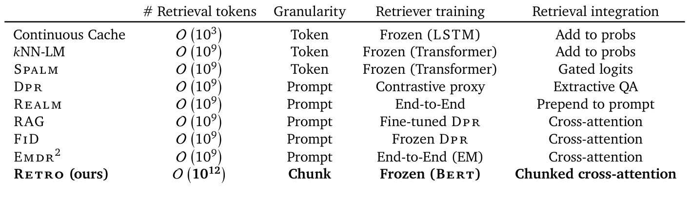

# Improving language models by retrieving from trillions of tokens  

Sebastian Borgeaud † , Arthur Mensch † , Jordan Hoffmann † , Trevor Cai, Eliza Rutherford, Katie Millican, George van den Driessche, Jean-Baptiste Lespiau, Bogdan Damoc, Aidan Clark, Diego de Las Casas, Aurelia Guy, Jacob Menick, Roman Ring, Tom Hennigan, Saffron Huang, Loren Maggiore, Chris Jones, Albin Cassirer, Andy Brock, Michela Paganini, Geoffrey Irving, Oriol Vinyals, Simon Osindero, Karen Simonyan, Jack W. Rae ‡ , Erich Elsen ‡   and Laurent Sifre † , ‡ All authors from DeepMind,   † Equal contributions,   ‡ Equal senior authorship  

We enhance auto-regressive language models by conditioning on document chunks retrieved from a large corpus, based on local similarity with preceding tokens. With a 2 trillion token database, our Retrieval-Enhanced Transformer (Retro) obtains comparable performance to GPT-3 and Jurassic-1 on the Pile, despite using   $25\times$   fewer parameters. After fine-tuning, Retro performance translates to downstream knowledge-intensive tasks such as question answering. Retro combines a frozen Bert retriever, a differentiable encoder and a chunked cross-attention mechanism to predict tokens based on an order of magnitude more data than what is typically consumed during training. We typically train Retro from scratch, yet can also rapidly Retrofit pre-trained transformers with retrieval and still achieve good performance. Our work opens up new avenues for improving language models through explicit memory at unprecedented scale.  

# 1. Introduction  

Language modelling (LM) is an unsupervised task that consists of modelling the probability of text, usually by factorising it into conditional next-token predictions    $\begin{array}{r}{p(x_{1},\ldots,x_{n})=\prod_{i}p(x_{i}|x_{<i})}\end{array}$  ( | ) . Neural networks have proven to be powerful language models, first in the form of recurrent architectures ( Graves ,  2013 ;  Jozefowicz et al. ,  2016 ;  Mikolov et al. ,  2010 ) and more recently in the form of Transformers ( Vaswani et al. ,  2017 ), that use attention to contextualise the past. Large performance improvements have come from increasing the amount of data, training compute, or model parameters. Transformers have been scaled from 100 million parameter models in seminal work to over hundred billion parameters ( Brown et al. ,  2020 ;  Radford et al. ,  2019 ) in the last two years which has led to models that do very well on a wide array of tasks in a zero or few-shot formulation. Increasing model size predictably improves performance on a wide range of downstream tasks ( Kaplan et al. ,  2020 ). The benefits of increasing the number of parameters come from two factors: additional computations at training and inference time, and increased memorization of the training data.  

In this work, we endeavor to decouple these, by exploring efficient means of augmenting language models with a massive-scale memory without significantly increasing computations. Specifically, we suggest retrieval from a large text database as a complementary path to scaling language models. Instead of increasing the size of the model and training on more data, we equip models with the ability to directly access a large database to perform predictions—a semi-parametric approach. At a high level, our Retrieval Transformer ( Retro ) model splits the input sequence into chunks and retrieves text similar to the previous chunk to improve the predictions in the current chunk. Existing retrieval for language modelling work only considers small transformers (100 millions parameters) and databases of limited size (up to billions of tokens) ( Guu et al. ,  2020 ;  Khandelwal et al. ,  2020 ; Lewis et al. ,  2020 ;  Yogatama et al. ,  2021 ). To our knowledge, our work is the first to show the benefits of scaling the retrieval database to trillions of tokens for large parametric language models. Our main  

  
Figure 1  Scaling of Retro.  The performance gain of our retrieval models remains constant with  | model scale (left), and is comparable to multiplying the parameteric model size by    $\sim10\times$  . The gain increases with the size of the retrieval database (middle) and the number of retrieved neighbours (right) on the C4 validation set, when using up to 40 neighbours. Past this, performance begins to degrade, perhaps due to the reduced quality. At evaluation  Retro  can be used without retrieval data ( Retro [OFF]), bringing limited performance degradation compared to baseline transformers.  

contributions are the following.  

We introduce  Retro , a retrieval-enhanced autoregressive language model ( §2.2 ). We use a chunked cross-attention module to incorporate the retrieved text ( §2.4 ), with time complexity linear in the amount of retrieved data. We show that retrieving based on a pre-trained frozen Bert  model ( §2.3 ) works at scale, removing the need for training and updating a retriever network.  

•  We show that our method scales well with model size and database size ( Fig. 1 ):  Retro provides a constant gain for models ranging from 150M to 7B parameters, and  Retro  can be improved at evaluation time by increasing the database size and the number of retrieved neigh- bours. Our largest model obtains state-of-the-art results on a range of downstream evaluation datasets including Wikitext103 ( Merity et al. ,  2017 ) and the Pile ( Gao et al. ,  2020 ) ( §4 ). We show that Retro can be fine-tuned to achieve competitive performance on downstream tasks such as question answering ( §4.3 ).  

We propose an evaluation aware of proximity of test documents with the training set ( §2.6 ), addressing the problem of test set leakage ( Lee et al. ,  2021 ). This is relevant for all language models, and especially for retrieval-enhanced models since they have direct access to the training dataset during evaluation. Using this methodology, we show that the performance of  Retro comes from both explicit neighbour copying and general knowledge extraction ( §4.4 ).  

# 2. Method  

We design our retrieval-enhanced architecture to be capable of retrieving from a database with trillions of tokens. For this purpose, we retrieve at the level of contiguous token  chunks  instead of individual tokens which reduces storage and computation requirements by a large linear factor. Our method first constructs a key-value database, where values store raw chunks of text tokens and keys are frozen Bert  embedddings ( Devlin et al. ,  2019 ). We use a frozen model to avoid having to periodically re-compute embeddings over the entire database during training. Each training sequence is then split into chunks, which are augmented with their  $k$  -nearest neighbour retrieved from the database. An encoder-decoder architecture integrates retrieval chunks into the model’s predictions. We summarize the  Retro  architecture in  Fig. 2 , and detail it in this section. We end the section by introducing  

  
Figu |  Retro arch re.  Left:  simplified version  e a sequence o gth  $n=12$   is split into  $l=3$   3 chunks of size  $m=4$   4. For each chunk, we retrieve  $k=2$   2 neighbours of  $r=5$   5 tokens each. The retrieval pathway is shown on top.  Right:  Details of the interactions in the  Cca  operator. Causality is maintained as neighbours of the first chunk only affect the last token of the first chunk and tokens from the second chunk.  

a new methodology to evaluate language models when an evaluation set is partially present in the training set.  

# 2.1. Training dataset  

We use a multi-lingual version of  MassiveText  ( Rae et al. ,  2021 ) for both training and retrieval data. The dataset consists of text documents from multiple sources and multiple languages totalling over 5 trillion tokens (detailed in  Table 1 ). Sequences are sampled from subsets of the training data, with sampling weights given in the right-most column of  Table 1 . We tokenize the dataset using SentencePiece ( Kudo and Richardson ,  2018 ) with a vocabulary of 128,000 tokens. During training (unless otherwise specified), we retrieve from 600B tokens from the training data. The training retrieval database is made of the same subsets as the training data, in proportion that matches the training sampling frequencies. During evaluation the retrieval database consists in the full union of these datasets, with the exception of books for which we use a sub-sample of   $4\%$  . The evaluation retrieval database thus contains 1.75T tokens. To limit test set leakage, we compute the 13-gram Jaccard similarity between train and test documents using the MinHash scheme and remove all training documents with high similarity (0.8 or higher) to a validation or test set document. Additionally, we remove all validation and test articles from Wikitext103 ( Merity et al. ,  2017 ) from our Wikipedia training data.  

# 2.2. Retrieval-enhanced autoregressive token models  

Our approach uses retrieval as a way to augment input examples at the granularity of small chunks of tokens. Formally, we onsider sequences of integer tokens in    $\mathbb{V}=\left[1,\nu\right]$  , obtained using a text tokenizer 1 . We split each  𝑛 -token-long example  $X=(x_{1},\dots,x_{n})$   into a sequence of  𝑙 chunks    $(C_{1},\hdots,C_{l})$  of size  $\begin{array}{r}{m=\frac{n}{l}}\end{array}$  , i.e.    $C_{1}\,\triangleq\,\left(x_{1},\ldots,x_{m}\right)$  , . . . ,   $C_{l}\triangleq\left(x_{n-m+1},.\,.\,.\,,x_{n}\right)\ \in\ \mathbb{V}^{m}$  . We use    $n=2048$  nd  $m=64$  . We augment each chunk    $C_{u}$  with a set    $\operatorname{R E T}_{\mathcal{D}}(C_{u})$   of  𝑘 neighbours from the database  D .  $\mathrm{R}\mathbf{E}\mathbf{T}_{\mathcal{D}}$   (or Ret  for brevity) is a non-trainable operator specified in    $\S2.3$  . Token likelihoods are provided by a model, parameterized by    $\theta$  , that takes as input both previous tokens and their retrieved neighbours. This defines the following retrieval-enhanced sequence log-likelihood:  

$$
L\left(X|\theta,\mathcal{D}\right)\triangleq\sum_{u=1}^{l}\sum_{i=1}^{m}\ell_{\theta}\left(x_{(u-1)\,m+i}|(x_{j})_{j<(u-1)\,m+i},\;(\mathtt{R E T}_{\mathcal{D}}(C_{u^{\prime}}))_{u^{\prime}<u}\right).
$$  

We set    $\mathrm{RET}(C_{1})=\emptyset$  , namely the likelihood of tokens from the first chunk does not depend on any retrieval data. This likelihood definition preserves  autoregressivity : the probability of the    $i\cdot$  -th token of the    $u$  -th chunk,  $x_{(u-1)m+i}$  , only depends on previously seen tokens    $(x_{j})_{1\leqslant j<(u-1)m+i}$  and on the data retrieved from the previous chunks    $({\bf R E T}\big(C_{u^{\prime}}\big)\big)_{u^{\prime}<u}$  . We can therefore directly  sample  with log- probability    $\ell$  , where sampling within the chunk    $C_{u}$  is conditioned on the neighbours    $({\mathrm{RET}}\left(C_{u^{\prime}}\right))_{u^{\prime}<u}$  . This makes retrieval-enhanced models directly comparable with the largest language models that are evaluated by sampling.  

# 2.3. Nearest neighbour retrieval  

Retrieval neighbours. Our database consists of a key-value memory. Each value consists of two contiguous chunks of tok s which we denote    $[N,F]$   where  $N$  is the  neighbour  chunk which is used to compute the key, and  𝐹 is its  continuation  in the original document. The corresponding key is the Bert embedding of  $N$  , averaged over time, that we denote    $\mathbf{B}\mathbf{E}\,\mathbf{R}\mathbf{T}\big(N\big)$  . For each chunk    $C$  , we retrieve its approximate  𝑘 -nearest neighbours from our key-value database using the  $L_{2}$   distance on BERT embeddings    $d\bigl(C,N\bigr)\,=\,\bigl||\mathtt{B E R T}\bigl(C\bigr)\,-\,\mathtt{B E R T}\bigl(N\bigr)||_{2}^{2}$  . The model receives the corresponding values  $\mathtt{R E T}(C)\,\triangleq\,\big(\big[N^{1},F^{1}\big],\ldots,\big[N^{k},F^{k}\big]\big)$  . Both neighbour chunks and their continuations provide meaningful improvements, as illustrated in our ablation study ( Appendix D ). We use a length 64 for both  $N^{j}$  and  $F^{j}$  , thus    $\mathbf{R}\mathbf{E}\mathbf{T}(C)$   has a shape of  $k\times r$  with    $r=128$  . To avoid retrieving the chunk    $C_{u+1}$  in the retrieval set  $\mathrm{RET}(C_{u})$  , which would break causality during training, we filter out neighbours originating from the same document as the training sequence    $X$  .  

For a database of    $T$  elements, we can query the approximate nearest neighbours in    $O(\log T)$   time. We use the SCaNN library ( Guo et al. ,  2020 ) to achieve this. This means that we can query our 2 trillion token database in   $10\,\mathrm{ms}$   whilst evaluating or sampling from the model; this expense is amortized over a chunk length. Performing retrieval on-the-fly is too slow to keep up with the training calculations—we leverage the frozen aspect of the embedding operator  Bert  to precompute all approximate nearest neighbours and save the results as part of the data. In  Fig. 9  in the Appendix, we show results where we only retrieve neighbours within Wikipedia. We find that neighbours tend to come from 2-3 links away from a given article whereas random articles are more than 5 links apart.  

Table 1  MassiveText . The last column indicates the sampling weight during training. The multilingual  | subsets include documents in 10 languages. The full breakdown is given in    $\S A.1$  .  

  

# 2.4. Retro model architecture  

Our model relies on an encoder-decoder transformer architecture, integrating the retrieved data through a cross-attention mechanism as introduced in  Vaswani et al.  ( 2017 ). First, the retrieved tokens  $\mathbf{R}\mathbf{E}\mathbf{T}(C)$   are fed into an encoder Transformer, which computes the encoded neighbours set  $E$  . Denoting the intermediate activations by    $H$  , our transformer decoder then interleaves  Retro -blocks  $\operatorname{RETRO}(H,E)$   $\mathrm{{L}}\mathbf{M}(H)$   (the hyperparameter    $P\subseteq[1,L]$   determines at which layers we use a  Retro -block). These blocks are built from three different residual operators with signature  $\mathbb{R}^{n\times d}\rightarrow\mathbb{R}^{n\times d}$  : a fully-connected layer  Ffw , the standard sequence-level self-attention   layer  Attn , and a chunked cross-attention layer    $\mathtt{C C A}(\cdot,E)$   that incorporates information from the retrieval encoder:  

$$
\mathtt{R E T R O}\left(H,E\right)\triangleq\mathtt{F F W}\left(\mathtt{C C A}\left(\mathtt{A T T N}\left(H\right),E\right)\right),\quad\mathrm{and}\quad\mathtt{L M}\left(H\right)\triangleq\mathtt{F F W}\left(\mathtt{A T N}\left(H\right)\right)
$$  

Since  Ffw ,  Attn  and  Cca  are all autoregressive operators whose output at position  𝑖 only depends on    $(h_{j})_{j\leqslant i:}$  , any succession of  Retro  and  lm  layers, followed by a token classification head defines an autoregressive log-likelihood  ( 1 ) . An overview of the model architecture is given in Algorithm 1  and in  Fig. 2 . We next describe the retrieval encoder and the chunked cross-attention layer in more detail, and explain how to sample from Retro.  

Encoding retrieval neighbours. For each chunk  $C_{u}.$  , the  $k$  r  $\operatorname{R}_{\mathbf{E}\mathbf{T}}(C_{u})$  a bi-directional transformer  Encoder , yielding the outputs  $E_{u}^{j}\triangleq\mathbb{E n c o D E R}(\mathbf{R}_{\mathbf{ET}}(C_{u})^{j},H_{u})\in\mathbb{R}^{r\times d^{\prime}}$  ( ( ) ) ∈ , where    $j~\in~[1,k]$   indexes each neighbour. The retrieval encoder is a non-causal transformer. It is conditioned on    $H_{u}$  , the activations of chunk    $C_{u}$  , through cross-attention layers; this allows the representations of the retrieval encoder to be modulated by the retrieving chunk in a differentiable way. More precisely, the encoding of the  $j^{\mathrm{th}}$    neighbour of the  $u^{\mathrm{th}}$    chunk,  $\mathbf{R}\mathbf{E}\mathbf{T}(C_{u})^{j}$  , depends on the attended  activation    $H_{u}\,\triangleq\,\big(h_{(u-1)m+i}\big)_{i\in[1,m]}\,\in\,\mathbb{R}^{m\times d}$  of chunk    $C_{u}$  at layer    $\operatorname*{min}(P)$  . All neighbours for all chunks are encoded in parallel, yielding a full encoded set    $E\triangleq\left(E_{u}^{j}\right)_{u\in[1,l],j\in[1,k]}\in\mathbb{R}^{l\times k\times r\times d^{\prime}}$  ∈[ ] ∈[ ]   . We denote  $E_{u}\in\mathbb{R}^{k\times r\times d^{\prime}}$  as the encoded neighbours for chunk    $u\in[1,l]$  .  

vation Chunked cross-attention.  $H\in\mathbb{R}^{n\times d}$  into  $_{l-1}$   attending chunks To perform the  $\left(H_{u}^{+}\triangleq\bar{{\left(h_{u\,m+i-1}\right)}_{i\in\left[1,m\right]}}\in\bar{\mathbb{R}^{m\times d}}\right)_{u\in\left[1,l-1\right]},$   Cca  operation, we first split a given intermediate acti-  , as depicted on the right of  Fig. 2 .  $H_{u}^{+}$  holds the intermediary embeddings of the last token in chunk    $C_{u}$  and of the first  $m-1$   tokens in  $C_{u+1}$    2 . We compute the cross-attention between  $H_{u}^{+}$  and  $E_{u}$  —the encoded retrieval set obtained from chunk  $C_{u}$  . Attention is computed across time and across neighbours simultaneously, as we merge the neighbour and time dimensions of  $E_{u}$  before applying cross-attention. Since there is a notion of alignment between data chunks and retrieval neighbours, we use relative positional encodings as described in    $\S\mathrm{B}.1.2$  .  

We concatenate the  $_{l-1}$   outputs of the per-chunk cross-attentions (each of shape  $m\times d$  ) across time, and properly pad the result; we thus form the output activation    ${\mathsf{C C A}}(H,E)\in\mathbb{R}^{n\times d}$  . Formally, for each chunk  $C_{u}$  and for each token  $i\in[1,m]$   we set  

$$
\mathsf{C C A}(H,E)_{u\,m+i-1}\triangleq\mathsf{C A}\big(h_{u\,m+i-1},E_{u}\big),
$$  

# Algorithm 1: Overview of Retro model architecture.  

Hyperparam:  $P$  and    $P_{\tt e n c}$  , indices of layers with cross-attention in the decoder and encoder respectively Hyperparam:  $L$  and    $L_{\tt e n c}$  , number of decoder layers and number of encoder layers. Input:  $X\in\mathbb{V}^{n}$  uence of tokens.    $\left(\mathrm{RET}\left(C_{u}\right)\right)_{1\leqslant u\leqslant l}$  : the retrieved neighbours Output:  $O\in\mathbb{R}^{n\times\vert\mathbb{V}\vert}$  : the output logits  

def  $E N C O D E R\big(R E T\big(C_{u}\big)_{1\leqslant u\leqslant l},H\big)$  :  $(H_{u})_{u\in[1,l]}\leftarrow\mathbf{SPLIT}(H)$  for  $j\in[1,k],u\in[1,l]\textup{\bf{c}}$  ∈[ ] ∈[ ]  do  // Encoder shared across neighbours and chunks  $E_{u}^{j}=\mathtt{E M B}_{\mathtt{E n c}}(\mathtt{R E T}(C_{u})^{j})$  ( ( ) )  // May be shared with the decoder E  M B for    $p^{\prime}\in[1,L_{e n c}]$   do  $E_{u}^{j}\gets\mathsf{A T T N e n c}(E_{u}^{j})$  ← ( )  // Bi-directional attention if    $p^{\prime}\in P_{e n c}$   then  $\begin{array}{r l}{\big|}&{{}E_{u}^{j}\leftarrow\mathtt{C A}_{\mathtt{e n c}}(E_{u}^{j},H_{u})}\end{array}$  ← ( ) 𝑗 Ffw 𝑗 𝐸𝑢←enc(𝐸𝑢)return  𝐸  $H\gets\mathbf{E}\,\mathbf{M}\,\mathbf{B}\left(X\right)$  for  $p\in[1,L]$   do  $H\gets\mathrm{ATTN}\big(H)$   // Causal attention if  $p=\operatorname*{min}(P)$   then // The neighbour E  N C O D E R  is conditioned with the decoder activations of the last layer before the first cross-attention  $E=\mathtt{E N C O D E R}\big(\mathtt{R E T}\big(C_{u}\big)_{1\leqslant u\leqslant l},H\big)$  if then  $p\in P$  ∈  $H\gets\mathsf{C C A}(H,E)$   $H\gets\mathbf{F}\mathbf{F}\mathbf{W}(H)$  

where  Ca  is the cross-attention residual operator over time-concatenated encoded neighbours. We l tha rator is  d in i st version by three parameter matrices    $K\in\mathbb{R}^{d\times c}$  ,  $Q\in$   $\mathbb{R}^{d\times c}$  and  $V\in\mathbb{R}^{d\times d}$  . For all  $h\in\mathbb{R}^{d}$  and  $Y\in\mathbb{R}^{T\times d}$  , we define  

$$
\mathsf{C A}(h,Y)\triangleq\mathsf{s o f t m a x}(Y K Q^{T}h)Y V,
$$  

where the softmax is performed on the second dimension and all products are matrix products. We use multi-head cross-attention, and add positional encodings to the softmax(see    $\S\mathrm{B}.1.2)$  .  

The first  $m-1$   tokens cannot attend to any neighbour of a previous chunk; at these positions, we define  Cca  as the identity, setting    $\mathsf{C C A}\big(H,E\big)_{j}\triangleq h_{j}$  for all tokens    $j\in[1,m-1]$  . Finally, the last token  $h_{l m}$  attends to the last retrieval set  $E_{l}$  and we set    $h_{l\,m}\,\triangleq\,\mathsf{C A}\big(h_{l\,m},E_{l}\big)$   (not shown in  Fig. 2 ).  Listing 1 contains a simplified implementation of  Cca . Note that chunked cross-attention is autoregressive: the output of  Cca  at position  𝑖 depends on the sequence from tokens from 0 to  𝑖 that is input to  Cca .  

With  Retro  models, even though each  Cca  cross-attention attends only to the neighbours of the preceding chunk    $\mathbf{R}\mathbf{E}\,\mathbf{T}\bigl(C_{u-1}\bigr)$  , the depende es over previ  neighbours are propagated via the self-attention operations. The activations of the  $i^{\mathrm{th}}$    token in the  $u^{\mathrm{th}}$    chunk therefore potentially depend upon the set of  $a l l$   previous neighbours    ${\scriptstyle{\mathrm{RET}}}\left(C_{u^{\prime}}\right)_{u^{\prime}<u}$  , without incurring the quadratic cost of cross attending to that set.  

Sampling. When sampling, at the end of a chunk    $C_{u}$  , we use SCaNN to retrieve neighbours    $\operatorname{R}_{\mathbf{E}\mathbf{T}}(C_{u})$  , based on the embedding    $\operatorname{BELRT}\left(C_{u}\right)$  . The encoded neighbours  $E_{u}={\tt E N C O D E R}({\tt R E T}(C_{u}))$  used to condition the generation of the next chunk    $C_{u+1}$  , which we do incrementally: overall the cost of sampling is thus quadratic in the size of the sampled sequence, as when sampling from regular Transformers; the added cost of retrieval is linear in the number of chunks  $l$  , and is negligible compared to the token sampling cost in practice.  

# 2.5. Baseline Transformer architecture  

We use a transformer ( Vaswani et al. ,  2017 ) similar to the one described in ( Radford et al. ,  2019 ), with some minimal changes: we replace LayerNorm with RMSNorm ( Zhang and Sennrich ,  2019 ) and use relative position encodings ( Dai et al. ,  2019 ). As baselines, we train retrieval-free transformers with 132M, 368M, 1.3B and 7.0B parameters (embedding matrices are excluded from parameter counts). The hyperparameters we used are detailed in  Table 2 . All retrieval models use the same size encoder for the retrieval data, with  $d^{\prime}=896$   and 2 layers, which roughly adds 19 𝑀 parameters. The encoder uses relative positional encodings. The retrieval models contain one  Retro -block every 3 blocks, starting from layer 6. For our smallest model,  Cca  is applied in layers 6, 9 and 12 of the main pathway and also once for query conditioning in the encoder, which adds an additional 12 𝑀 parameters. The relative number of extra parameters reduces as we increase the baseline model size. All models are implemented using JAX ( Bradbury et al. ,  2018 ) and Haiku ( Hennigan et al. ,  2020 ).  

# 2.6. Quantifying dataset leakage exploitation  

Retro models may arguably benefit more easily from evaluation dataset leakage, i.e. the fact that we evaluate on data that were also present in the training set. To better understand how retrieval improves language modelling performance, we therefore quantify evaluation likelihood as a function of the overlap between the evaluation and training datasets.  

The following approach can be used with any language model, and depends only on the frozen retriever system presented in    $\S2.3$  . We split the evaluation sequences    $\left(X_{i}\right)_{i}$  into chunks of length  $m\,\leq\,64$  , and we see the training data as a set of chunks    $C$  . For each evaluation chunk    $C\in C$  , we retrieve the 10 closest neighbours (of length up to 128) in the training data. We then compute the longest token substring common to both the evaluation chunk and its neighbours. This gives a number  $s\in[0,m]$  . The value  $\textstyle r(C)={\frac{s}{m}}$  , ranging from 0 (chunk never seen) to 1 (chunk entirely seen), gives a reliable indication of how much overlap there is between the evaluation chunk and the training data. For a given model, we then obtain the log-likelihood    $\ell(C)$   of each chunk    $C$  , and the number of bytes  $N(C)$   it encodes. We then consider the filtered bits-per-bytes of the model:  

$$
\forall\,\alpha\in[0,1],\quad C_{\alpha}\triangleq\{C\in C,r(C)\leqslant\alpha\},\quad\mathsf{b p b}(\alpha)\triangleq\frac{\sum_{C\in C_{\alpha}}\ell(C)}{\sum_{C\in C_{\alpha}}N(C)},
$$  

  

which correspond to the bits-per-bytes on the set of chunks that overlap less than    $\alpha\,\%$   with the training chunks. Note that the full evaluation bit-per-bytes performance is recovered by  bpb 1 . The function ( ) bpb  allows us to evaluate the impact of evaluation leakage over predictive performance: for low , (·)    $\alpha$  bpb  $(\alpha)$   gives an indication on how the model performs on chunks that are entirely new; the slope of bpb  shows how much the model exploits evaluation leakage. (·)  

# 3. Related Work  

We first review existing work on using retrieval for language modelling, and compare Retro to these works (see  Table 3 ). As we train Retro models on a large dataset containing a substantial section of the internet, our work raises potential privacy, safety, and fairness issues that we then review.  

# 3.1. Retrieval for language modelling  

Brants et al.  ( 2007 ) show that scaling the training data to trillions of tokens improves the machine translation performance of  $n$  -gram models. More recently, GPT-2 ( Radford et al. ,  2019 ), GPT-3 ( Brown et al. ,  2020 ), and Jurassic-1 ( Lieber et al. ,  2021 ) show that scaling up language models leads to massive improvements on many downstream tasks. At the same time,  Carlini et al.  ( 2021 ) demonstrate that large-scale language models can perfectly memorise parts of their training data, suggesting that enhancing models with retrieval may lead to further improvements. However, significant leakage between train and test datasets ( Lee et al. ,  2021 ;  Lewis et al. ,  2021 ) makes comparing and evaluating large models trained on large datasets difficult, especially once retrieval capabilities over the training dataset are added.  

Historically, information retrieval for text relies on inverted index matching such as TF-IDF and BM25 ( Robertson and Zaragoza ,  2009 ). Foundational work use latent topic modelling approaches like LDA ( Blei et al. ,  2003 ) to identify relevant neighbours ( Wei and Croft ,  2006 ). Work in machine translation such as  Zhang et al.  ( 2018 ) and  Gu et al.  ( 2018 ) retrieve translation pairs based on edit distance between source sentences and guide the translation output using the closest retrieved target sentences. The retrieval database may also be structured — for example,  Ahn et al.  ( 2016 ) use a symbolic knowledge graph to improve an RNN language model.  

With the success of deep learning, retrieving systems have partly switched to dense learned representations based on a neural network’s activations. Continuous cache ( Grave et al. ,  2017 ) adds probability mass to tokens for which previous activations resemble the current activation vector, extending the model’s context to the local history.  𝑘 NN-LM  ( Khandelwal et al. ,  2020 ) applies this idea to transformers and extends the retrieval database to English Wikipedia, resulting in  

  

substantial improvements on Wikitext103 evaluation. Continuous cache and  𝑘 NN-LM  do not modify the underlying neural-network models, but interpolate at inference between the language model’s output and distributions computed from retrieved tokens. These methods can therefore be plugged into any model without additional training, although this limits the model’s ability to reason about the retrieved text.  Spalm  ( Yogatama et al. ,  2021 ) addresses this limitation by adding an extra gating network to post-process the retrieved data; yet most of the network is unaffected by the retrieval during inference.  

The retrieval representations may be trained directly instead of relying on a pre-trained model— retriever systems have been developed for this purpose, primarily on open-domain question answering. For example,  Dpr  ( Karpukhin et al. ,  2020 ) trains two  Bert  models (for queries and keys respectively) using a contrastive loss to align the representations of a question and of its answers.  Lee et al.  ( 2019 ) use an inverse cloze task to find semantic representations of passages for retrieval. These works differs from continuous cache and  𝑘 NN-LM  in that they embeds passages (or chunks) of text together, as opposed to each token individually. The retriever network is trained in isolation of the downstream task that uses the retrieval data. This potential issue is specifically addressed by  Realm  ( Guu et al. , 2020 ), which trains the retrieval system end-to-end to maximize the final training cross-entropy. This comes with the extra complexity of searching the database during training and periodically updating the embedding table, severely limiting the scale at which it can operate.  RAG  ( Lewis et al. ,  2020 ) and  FiD  ( Izacard and Grave ,  2021 ) build upon  Dpr  to set the state of the art on question answering benchmarks by training encoder-decoder transformer models. More recently,    $\scriptstyle\operatorname{E}\!\mathbf{M}\,\mathbf{D}\mathbf{R}^{2}$    ( Sachan et al. , 2021 ) extends  FiD  by using an expectation-maximization algorithm to train the retriever end-to-end and achieves state of the art results compared to similarly sized models.  

In the open-domain dialogue setting, BlenderBot 2.0 ( Komeili et al. ,  2021 ) learns to issue textual internet queries, outperforming dense retrieval methods when evaluated on a task measuring how close model responses are to those of humans. This involves collecting a dataset of human dialogues with associated search queries, which limits the scalability of this approach.  Hashemi et al.  ( 2020 ) introduce the Guided Transformer, a modified Transformer similar to Retro, for document retrieval and clarifying question selection. Although effective on question answering and other tasks with strong conditioning, none of these methods are designed to model arbitrary text sequences, in contrast with Retro.  

Retro  shares components with  𝑘 NN-LM  and  Dpr  in that it uses frozen retrieval representations. Retro models longer sequences than QA examples; this requires to reason at a sub-sequence level, and to retrieve different documents for the different chunks of a sequence. Similar to  FiD ,  Retro processes the retrieved neighbours separately in the encoder, and assemble them in the chunked cross-attention. This differs from e.g. Realm, that prepends retrieved documents to the prompt. Using chunks allows for repeated retrieval whilst generating a sequence as opposed to retrieving only once based on the prompt alone. Furthermore, retrieval is done during the whole pre-training process in Retro, and is not simply plugged-in to solve a certain downstream task. Finally, previous methods based on dense query vectors use small models and retrieval datasets with less than 3B tokens (English Wikipedia).  Table 3  summarizes the difference of Retro with existing approaches.  

# 3.2. Privacy, safety and fairness  

Bender et al.  ( 2021 );  Weidinger et al.  ( 2021 ) highlight several dangers of large language models. Those stem from their ability to memorise training data, their high training cost, the static nature of their training data ( Lazaridou et al. ,  2021 ), their tendency of amplifying inherent biases in the training data, and their ability to generate toxic language ( Gehman et al. ,  2020 ). In this section we inspect these dangers, focusing on how retrieval augmented language models may exacerbate or  

#  

Large language models can perfectly memorise parts of their training data ( Carlini et al. ,  2021 ). When coupled with large training datasets gathered from the web or other sources, this has clear privacy and safety implications. Retrieval models such as  Retro  that have access to the entire training dataset during inference exacerbate these privacy issues by being able to directly copy training data. However, retrieval systems offer a path towards mitigating these concerns via obliteration of the retrievable data at inference time. In addition, differential privacy training ( Abadi et al. ,  2016 ) of retrieval models could guarantee that no private information is stored in the model weights, while individual is ation on private data could be made by updating the retrieval database at inference time.  

Due to their high training cost, re-training large language model regularly to incorporate new data, languages, and norms is prohibitively expensive. To keep retrieval models up-to-date, it may be sufficient to update the retrieval database, which is orders of magnitude cheaper than re-training a model from scratch. In addition to the benefits of updating models in terms of fairness and bias, simply training large language models has a significant energy cost ( Schwartz et al. ,  2020 ;  Strubell et al. ,  2019 ). Retrieval mechanisms offer a path to reducing the compute requirements needed to train and update language models that reach a certain performance.  

Large language models are prone to generating toxic outputs, as shown in  Gehman et al.  ( 2020 ). Bender et al.  ( 2021 );  Jo and Gebru  ( 2020 ) advocate for the importance of better training data curation and documentation. Additionally, if portions of the training data are found to be eliciting biased or toxic outputs after training, retrieval allows for some correction, as the offending retrieval data can be retroactively filtered. However, it is also the case that without careful analysis and intervention, retrieval models may exacerbate biases that are present in the training data. Retrieval models can also add a further source of bias through the selection mechanism for retrieval documents. Further work in this area is required to better understand how retrieval affects the bias and toxicity of the model outputs.  

Finally, samples from large models are difficult to interpret, making mitigating these issues all the more challenging ( Belinkov et al. ,  2020 ;  Jain and Wallace ,  2019 ). Retrieval provides more insights in to the outputs of a model, as one can directly visualise or modify the neighbours that are being used. The examples in  Table 6 ,  7 ,  20  and  21  illustrate how retrieval makes language models more factual and interpretable by providing more transparent outputs.  

# 4. Results  

We first report results on language modelling benchmarks. Second, we show how to Retrofit pre-trained Transformer language models into retrieval models with few additional FLOPs. Next, we report  Retro  results on question answering. Finally, we report evaluation metrics with leakage filtering, to better understand the source of the gains with retrieval.  

# 4.1. Language modelling  

Datasets. We evaluate our models on C4 ( Raffel et al. ,  2020 ), Wikitext103 ( Merity et al. ,  2017 ), Curation Corpus ( Curation ,  2020 ), Lambada ( Paperno et al. ,  2016 ) and the Pile ( Gao et al. ,  2020 ). We also evaluate on a set of manually selected Wikipedia articles that were added or heavily edited in September 2021, months after our pre-training and retrieval dataset was collected (details are given in  $\S A.2)$  . We construct the dataset with articles from the “future” and manually remove new articles that strongly overlap documents in our training data. This guarantees that the evaluation documents are not leaked in our training data.  

  
Figure 3  Scaling with respect to model size.  (a) LAMBADA top-1 accuracy. (b) Evaluation loss on  | curation corpus. (c) Perplexity on Wikitext103 valid. (d) Bits-per-byte on selected Wikipedia articles from September 2021.  

For C4, Wikitext103, the Pile, and our Wikipedia dataset we evaluate the language modelling performance on entire documents and measure the bits-per-byte (bpb). We favour bits-per-byte over loss as it is tokenizer agnostic. We evaluate with a sequence length of 2048 tokens but use a stride of 1024 within documents to mitigate boundary effects. On Curation Corpus we concatenate the article, the “ TL;DR: ” string, and the summary, but only evaluate the bpb on the summary. For Lambada we evaluate the accuracy on the last word, using greedy generation.  

Model scaling. In  Fig. 1 (left) and  Fig. 3  we show the language modelling performance as we scale models from 150 million to 7 billion (non-embedding) parameters. We see that on all datasets, Retro  outperforms the baseline at all model sizes. Furthermore, we observe that improvements do not diminish as we scale the models. The performance is dataset dependent, with the largest gains on Wikitext103 and C4. Wikipedia articles and other web pages are similar to Wikitext103 documents, even if not exact copies ( §4.4 ), we thus obtain dramatic improvements on Wikitext103 as our retrieval model is able to directly exploit these overlaps. The smallest gains are for Curation Corpus, where Retro  only slightly outperforms the baseline. This is expected as Curation Corpus summaries are designed to only contain information from the source article and are not included in our retrieval database. On our “future” Wikipedia September 2021 dataset, we also observe consistent gains for all model sizes.  

Data scaling. Fig. 1  (middle) shows how scaling the retrieval database at evaluation improves the language modelling performance. We observe dramatic gains as the retrieval data is increased from Wikipedia (4 billion tokens) to all of Massive text (1.7T tokens).  Fig. 1 (right) shows how performance scales as we increase the number of retrieved chunks. Despite being only trained with 2 neighbours, we see consistent improvements for all models when the number of neighbours is increased from 1 to 10. Furthermore, we observe that larger models are able to better utilise more neighbours: the 172M model improves with up to 10 neighbours, whereas the 7B model improves with up to 40 neighbours.  

The Pile. We evaluate our 7B models on the Pile test sets 3   and compare against the 178B parameter Jurrasic-1 ( Lieber et al. ,  2021 ) model and the 280B parameter Gopher ( Rae et al. ,  2021 ) model. We do not compare against GPT-3 as it is outperformed by Jurassic-1 and Gopher on almost all subsets. Fig. 4  shows the relative improvements in bits-per-byte over our 7B transformer baseline for our  

  
Figure 4  The Pile: Comparison of our 7B baseline against Jurassic-1, Gopher, and Retro.  We  | observe that the retrieval model outperforms the baseline on all test sets and outperforms Jurassic-1 on a majority of them, despite being over an order of magnitude smaller.  

7.5B Retro model, Jurassic-1 and Gopher. Jurassic-1 outperforms the baseline on all datasets except for books, likely due to the inclusion of books in our training data. Gopher and Retro outperform the baseline on all test sets. Overall, Retro 7.5B outperforms Jurassic-1 and Gopher on a majority of the test sets. On the  dm_mathematics  and  ubuntu_irc  subsets, our Retro model does not outperform our 7B baseline and underperforms Jurassic-1. We hypothesise that the retrieved neighbours on these datasets are not helpful, due to a combination of what is in our retrieval dataset and the efficacy of the nearest-neighbour search.  

Wikitext103. To validate our approach in a controlled setting, we compare our method with  𝑘 NN-LM ( Khandelwal et al. ,  2020 ) on the Wikitext103 dataset in  Table 4 . We train a baseline transformer on the training set of Wikitext103. This transformer has 24 layers, 1024 hidden units, 16 heads and a key size of 64, as in  Baevski and Auli  ( 2019 ). Our baseline does not have adaptive input, and our tokenizer has an open vocabulary, unlike  Baevski and Auli  ( 2019 ), which makes our baseline  

Table 4  Perplexities on Wikitext103.  When using the Wikpedia dataset for retrieval,  Retro  | performs similarly to our implementation of  𝑘 NN-LM . As we scale the retrieval dataset,  Retro performs much better. The perplexities for retrieving from full MassiveText are quite low, which is partly due to partial overlap with Wikitext103 not caught by our deduplication.  

  

perplexities a bit higher. The full experiment details and hyperparameters are given in    $\S C.2$   and Table 11 .  

We re-implement    $k\mathrm{NN}\mathrm{-}\mathrm{LL}$   with our tokenizer and baseline transformer to produce embeddings of size  n Wikitext -LM   ities  $p_{k\mathrm{NN-LH}}=\lambda p_{k\mathrm{NN}}+(1-\lambda)p_{\mathrm{LM}}$  with  $p_{k\mathrm{NN}}\left(n_{k}\right)\propto\exp\left(-\alpha d_{k}\right)$   ( ) ∝  (− ) . We tune  $\lambda=0.118$  118 and  $\alpha=0.00785$  00785 on the validation set ( Fig. 7 ) and report performance for these hyperparameters on both the validation and test set.  

We fine-tune our baseline transformer into a  Retro  model ( Fig. 7 ), using the Wikitext103 training data and retrieving from Wikipedia with 2 neighbours. We only train the new weights, as explained in    $\S4.2$  , and share the embedding weights between the encoder and the main pathway. This is necessary for Wikitext103 which is quite small, as training  Retro  from scratch in this setting leads to over-fitting.  

We evaluate the fine-tuned  Retro  model with different retrieval sets. We use 10 neighbours at evaluation for both  Retro  and  𝑘 NN-LM . When retrieving from Wikipedia, we obtain results com- parable to our  𝑘 NN-LM implementation. Furthermore, scaling the retrieval database to MassiveText yields dramatic improvements, though this is partly due to leakage (see    $\S4.4)$  . For reproducibility, we also include results when retrieving from C4, which are close to previous state-of-the-art and comparable to using   $10~\%$   of MassiveText.  

It is worth noting that  𝑘 NN-LM  requires 1024 floats for every token in the retrieval dataset, totalling 15 terabytes (Tb) for the 4 billion tokens in Wikipedia.  𝑘 NN-LM  and other token-level retrieval approaches therefore don’t scale to retrieval databases with trillions of tokens such as MassiveText. In comparison,  Retro  only requires 215Gb to index our Wikipedia dataset, and 93Tb for MassiveText. Inspecting the number of retrieval database entries in  Table 4  makes it clear why retrieving at the chunk level is necessary when scaling to datasets with trillions of tokens.  

# 4.2. Retro-fitting baseline models  

We extend baseline models into  Retro  models by freezing the pre-trained weights and training only chunked cross-attention and neighbour encoder parameters (less than   $10\%$   of weights for the 7B model) in  Fig. 5 . This offers an efficient alternative path to enhance transformers with retrieval, requiring only 6 million sequences (  $3\%$   of the pre-training sequences that we used). Additionally, by only training the new weights we ensure that when evaluated without retrieval, the original model performance is exactly maintained. Retrofitting models quickly surpasses the performance of baseline models and even achieves performance close to that of  Retro  models trained from scratch. The experiment hyperparameters are given in    $\S C.3$  .  

# 4.3. Question answering  

We fine-tune our retrieval models on the Natural Questions ( Kwiatkowski et al. ,  2019 ) dataset to demonstrate that our retrieval pathway can be used to inject information from arbitrary data sources. We use the version 4   provided by  Izacard and Grave  ( 2021 ) which is augmented with the retrieved passages from  Dpr  ( Karpukhin et al. ,  2020 ). We fine-tune all the weights of our 7.5B pre-trained  Retro  model for 25,000 steps using the top 20 retrieved passages. We format the data as “ question: {question} \n answer: {answer} ” and left pad the data such that “ answer: ” coincides with the end of the first chunk of 64 tokens and thus aligns with the first retrieving chunk. The model has access to the question via the previous tokens in the sequence as well as the top 20 DPR Wikipedia passages and their titles via the chunked cross-attention mechanism.  

  
Figure 5  Retro-fitting a baseline transformer.  Any transformer can be fine-tuned into a retrieval-  | enhanced transformer by randomly initializing and training only the chunked cross-attention and retrieval encoder weights. Fine-tuning in this way quickly recovers and surpasses the non-retrieval performance, and almost achieves the same performance as training a retrieval model from scratch (shown by the arrow on the right hand side of each plot). We find good performance  Retro -fitting our models training on only   $3\%$   the number of tokens seen during pre-training.  

The exact match scores are shown in  Table 5  and the full fine-tuning details are given in    $\S C.4$  . Our method is competitive with previous approaches such as  Realm ,  RAG  and  Dpr , but underperforms the more recent  FiD . In contrast with this work, we find that increasing the number of neighbours past 20 does not improve  Retro  performance on this task. We hypothesise that the encoder-decoder structure of T5—the base model in  FiD — and the T5 pre-training objective leads to a model that relies more on the encoder output than  Retro , which is important in the QA setting. To compete with T5-finetuned models, future work should consider ways of forcing Retro to rely further on the retrieval encoder output when producing tokens.  

# 4.4. Relating retrieval performance to dataset leakage.  

We report the filtered eval losses as detailed in    $\S2.6$   on C4, Curation Corpus and Wikitext103 in  Fig. 6 . On C4 and Wikitext103, for which there is leakage into the training set, the slope is negative for both baseline models and Retro models. Retro models exploit leakage more strongly than baseline models, as indicated by the more negative slope. This is due to its explicit ability to copy-paste existing training chunks to predict leaked evaluation chunks (see a qualitative example of this model behavior  

Table 5  Question answering results.  Exact match accuracy on Natural Questions.  |  

  

  
Figure 6  Performance vs. longest common retrieval substring.  Evaluation loss as a function of  | allowed longest common substring between evaluation data chunks and their nearest neighbours. Retrieval still helps when considering chunks with no more than 8 contiguous tokens overlapping with training dataset chunks.  

on a Wikitext103 article in  Table 19 ). On Curation Corpus, retrieval provides a constant offset, which is expected as there is by design no leakage between Curation Corpus and the training dataset.  

On the other hand, Retro outperforms baseline models at all leakage levels, down to    $\alpha=12.5\%$  . At this level, the loss is computed on chunks with less than 8 contiguous tokens shared with the closest matching chunk in the training dataset—this is a reasonable level of overlap at which we consider that there is no local leakage. Retrieval thus improves predictions on both chunks that are syntactically similar to chunks in the training set, and on chunks that are syntactically different from all training chunks. This points toward a non trivial Retro capacity of generalizing based on both model parameters and retrieval database. Similar results are found on the Pile dataset (see  Fig. 12 ,  $\S\mathrm{F}.3)$  .  

# 4.5. Using Retro for sampling  

We show examples of samples obtained using the 7.5B  Retro  model in  Table 6 ,  Table 7  and Appendix E . For each chunk (the first one being the prompt), we juxtapose sampled chunks    $C_{u}$  with retrieved neighbours    $\mathrm{RE\,T}\big(C_{u}\big)$  . To give an indication of local overlap, we colour each sampled token in chunk  $C_{u}$  based on the length of the longest common prefix (LCP) found in the retrieved chunks  $\mathrm{IET}\left(C_{u-1}\right)$  . Similarly, we colour the retrieved chunks based on the LCP in the sampled chunk. For the sample in  Table 6 , for which we chose the prompt, we observe that the retrieved chunks influence the sample as there are overlaps between the sampled tokens and neighbour tokens. Overall, retrieval reduces hallucinations (in line with the findings of  Shuster et al.  ( 2021 )) and makes the model more knowledgeable, when comparing with samples produced with retrieval disabled. In the sample in Table 7 , the model recognises that the prompt is the beginning of the first scene of Hamlet and leverages retrieval data to continue it with only a few mistakes. We provide further examples in Appendix E , including examples from the evaluation sets, as well as the detailed procedure used for colouring the tables.  

# 5. Conclusion  

We present Retrieval-Enhanced Transformers ( Retro ), a method for modelling arbitrary text se- quences whilst retrieving from databases with trillions of tokens—scaling the data available to models by an order of magnitude compared to what is typically consumed during training.  Retro  models gains do not diminish for models with up to at least 7B parameters, and correspond to non-retrieval models with   $10\times$   more parameters on certain datasets. On Wikitext103 and the Pile, Retro outper- forms previous models trained on large scale datasets. We also show that Retro is competitive on retrieval-intensive downstream tasks such as question answering.  

Retro  models are flexible and can be used without retrieval at evaluation and still achieve comparable performance to baseline models. Conversely, baseline models can be rapidly fine-tuned into  Retro  models to obtain nearly the same performance as if trained from scratch. Careful analysis shows that only a modest fraction of the gains obtained by  Retro  are due to test set leakage. In general, we caution for such leakage in large-scale language datasets and suggest further work in better understanding the role of test set leakage in the performance of large-scale language models.  

Overall, our work demonstrates at an unprecedented scale that semi-parametric approaches can provide an orthogonal, more efficient approach than raw parameter scaling as we seek to build more powerful language models.  

# Acknowledgements  

We would like to thank Nikolai Grigorev, Marc’aurelio Ranzato, Cyprien de Masson d’Autume, Po-Sen Huang, Johannes Welbl, Lisa Anne Hendricks, Ethan Perez, JeffStanway, Eric Noland, Gregory Wayne, John Jumper, Julian Schrittwieser, Lorrayne Bennett, Devang Agrawal, Dani Yogatama, Susannah Young, Nando de Freitas, Demis Hassabis, and Koray Kavukcuoglu for their help, advice and reviews. Additionally, we would like to thank Zonglin Li, David Simcha, and the ScaNN developers for their help.  

# Table 6  |  Sample - Beavers are interesting animals . The  Retro[Off]  sample quickly diverges to other animals while the  Retro[On]  sample tends to stay focused on the beaver topic due to neighbour conditioning.  

  

  

# References  

M. Abadi, A. Chu, I. Goodfellow, H. B. McMahan, I. Mironov, K. Talwar, and L. Zhang. Deep learning with differential privacy. In  ACM SIGSAC Conference on Computer and Communications Security , 2016. S. Ahn, H. Choi, T. Pärnamaa, and Y. Bengio. A neural knowledge language model.  arXiv preprint arXiv:1608.00318 , 2016. A. Baevski and M. Auli. Adaptive input representations for neural language modeling. In  International Conference on Learning Representations , 2019. URL  https://openreview.net/forum?id  $=$  ByxZX20qFQ . Y. Belinkov, S. Gehrmann, and E. Pavlick. Interpret ability and analysis in neural NLP. In  Proceedings of the 58th Annual Meeting of the Association for Computational Linguistics: Tutorial Abstracts , pages 1–5, Online, July 2020. Association for Computational Linguistics. doi: 10.18653/v1/2020. acl-tutorials.1. URL  https://aclanthology.org/2020.acl-tutorials.1 . E. M. Bender, T. Gebru, A. McMillan-Major, and S. Shmitchell. On the dangers of stochastic parrots: Can language models be too big? In  ACM Conference on Fairness, Accountability, and Transparency , 2021. D. M. Blei, A. Y. Ng, and M. I. Jordan. Latent Dirichlet Allocation.  Journal of Machine Learn- ing Research , 3(Jan):993–1022, 2003. URL  https://jmlr.csail.mit.edu/papers/v3/ blei03a.html . J. Bradbury, R. Frostig, P. Hawkins, M. J. Johnson, C. Leary, D. Maclaurin, G. Necula, A. Paszke, J. V. der Plas, S. Wanderman-Milne, and Q. Zhang. JAX: composable transformations of Python  $^{+}$  NumPy programs, 2018. URL  http://github.com/google/jax . T. Brants, A. C. Popat, P. Xu, F. J. Och, and J. Dean. Large Language models in machine translation. In  Joint Conference on Empirical Methods in Natural Language Processing and Computational Natural Language Learning , pages 858–867, 2007. T. Brown, B. Mann, N. Ryder, M. Subbiah, J. D. Kaplan, P. Dhariwal, A. Neelakantan, P. Shyam, G. Sastry, A. Askell, S. Agarwal, A. Herbert-Voss, G. Krueger, T. Henighan, R. Child, A. Ramesh, D. Ziegler, J. Wu, C. Winter, C. Hesse, M. Chen, E. Sigler, M. Litwin, S. Gray, B. Chess, J. Clark, C. Berner, S. McCandlish, A. Radford, I. Sutskever, and D. Amodei. Language models are few-shot learners. In  Advances in Neural Information Processing Systems , 2020. URL  https://proceedings.neurips.cc/ paper/2020/file/1457 c 0 d 6 bfc b 4967418 b fb 8 ac 142 f 64 a-Paper.pdf . N. Carlini, F. Tramer, E. Wallace, M. Jagielski, A. Herbert-Voss, K. Lee, A. Roberts, T. Brown, D. Song, U. Erlingsson, A. Oprea, and C. Raffel. Extracting training data from large language models. Preprint , 2021. C. Consonni, D. Laniado, and A. Montresor. Wikilinkgraphs: a complete, longitudinal and multi- language dataset of the wikipedia link networks. In  AAAI International Conference on Web and Social Media , volume 13, 2019. Curation. Curation corpus base, 2020. Z. Dai, Z. Yang, Y. Yang, J. Carbonell, Q. Le, and R. Salakhutdinov. Transformer-XL: Attentive language  

models beyond a fixed-length context. In  Annual Meeting of the Association for Computational Linguistics , July 2019. URL  https://aclanthology.org/P19-1285 .  

J. Devlin, M.-W. Chang, K. Lee, and K. Toutanova. BERT: Pre-training of deep bidirectional transformers for language understanding. In  Conference of the North American Chapter of the Association for Computational Linguistics , June 2019. URL  https://aclanthology.org/N19-1423 .  

L. Gao, S. Biderman, S. Black, L. Golding, T. Hoppe, C. Foster, J. Phang, H. He, A. Thite, N. Nabeshima, S. Presser, and C. Leahy. The Pile: An 800GB dataset of diverse text for language modeling.  arXiv preprint arXiv:2101.00027 , 2020.  

S. Gehman, S. Gururangan, M. Sap, Y. Choi, and N. A. Smith. Real Toxicity Prompts: Evaluating neural toxic degeneration in language models. In  Conference on Empirical Methods in Natural Language Processing , Nov. 2020. URL  https://aclanthology.org/2020.findings-emnlp.301 .  

E. Grave, A. Joulin, and N. Usunier. Improving neural language models with a continuous cache. In International Conference on Learning Representations , 2017. URL  https://openreview.net/ forum?id  $=$  B184E5qee .  

A. Graves. Generating sequences with recurrent neural networks.  arXiv preprint arXiv:1308.0850 , 2013.  

J. Gu, Y. Wang, K. Cho, and V. O. Li. Search engine guided neural machine translation. In  AAAI Conference on Artificial Intelligence , 2018.  

R. Guo, P. Sun, E. Lindgren, Q. Geng, D. Simcha, F. Chern, and S. Kumar. Accelerating large-scale inference with anisotropic vector quantization. In  International Conference on Machine Learning , 2020. URL  https://arxiv.org/abs/1908.10396 .  

K. Guu, K. Lee, Z. Tung, P. Pasupat, and M. Chang. Retrieval augmented language model pre-training. In  International Conference on Machine Learning , 2020.  

H. Hashemi, H. Zamani, and W. B. Croft. Guided transformer: Leveraging multiple external sources for representation learning in conversational search. In  Proceedings of the 43rd International ACM SIGIR Conference on Research and Development in Information Retrieval , pages 1131–1140, 2020.  

T. Hennigan, T. Cai, T. Norman, and I. Babuschkin. Haiku: Sonnet for JAX, 2020. URL  http: //github.com/deepmind/dm-haiku .  

G. Izacard and E. Grave. Leveraging passage retrieval with generative models for open domain question answering. In  Conference of the European Chapter of the Association for Computational Linguistics , Apr. 2021. URL  https://aclanthology.org/2021.eacl-main.74 .  

G. Izacard, F. Petroni, L. Hosseini, N. De Cao, S. Riedel, and E. Grave. A memory efficient baseline for open domain question answering.  arXiv preprint arXiv:2012.15156 , 2020.  

S. Jain and B. C. Wallace. Attention is not Explanation. In  Proceedings of the 2019 Conference of the North American Chapter of the Association for Computational Linguistics: Human Language Technologies, Volume 1 (Long and Short Papers) , pages 3543–3556, Minneapolis, Minnesota, June 2019. Association for Computational Linguistics. doi: 10.18653/v1/N19-1357. URL  https: //aclanthology.org/N19-1357 .  

E. S. Jo and T. Gebru. Lessons from archives: Strategies for collecting sociocultural data in machine learning. In  Proceedings of the 2020 Conference on Fairness, Accountability, and Transparency , pages 306–316, 2020.  

R. Jozefowicz, O. Vinyals, M. Schuster, N. Shazeer, and Y. Wu. Exploring the limits of language modeling.  arXiv preprint arXiv:1602.02410 , 2016.  

J. Kaplan, S. McCandlish, T. Henighan, T. B. Brown, B. Chess, R. Child, S. Gray, A. Radford, J. Wu, and D. Amodei. Scaling laws for neural language models.  CoRR , 2020. URL  https://arxiv. org/abs/2001.08361 . V. Karpukhin, B. Oguz, S. Min, P. Lewis, L. Wu, S. Edunov, D. Chen, and W.-t. Yih. Dense passage re- trieval for open-domain question answering. In  Conference on Empirical Methods in Natural Language Processing , Nov. 2020. URL  https://aclanthology.org/2020.emnlp-main.550 . U. Khandelwal, O. Levy, D. Jurafsky, L. Zettlemoyer, and M. Lewis. Generalization through memoriza- tion: Nearest neighbor language models. In  International Conference on Learning Representations , 2020. URL  https://openreview.net/forum?id  $\it{.}\overline{{\overline{{\tau}}}}$  HklBjCEKvH . M. Komeili, K. Shuster, and J. Weston. Internet-augmented dialogue generation.  arXiv preprint arXiv:2107.07566 , 2021. T. Kudo and J. Richardson. Sentencepiece: A simple and language independent subword tokenizer and detokenizer for neural text processing.  arXiv preprint arXiv:1808.06226 , 2018. T. Kwiatkowski, J. Palomaki, O. Redfield, M. Collins, A. Parikh, C. Alberti, D. Epstein, I. Polosukhin, M. Kelcey, J. Devlin, K. Lee, K. N. Toutanova, L. Jones, M.-W. Chang, A. Dai, J. Uszkoreit, Q. Le, and S. Petrov. Natural Questions: a benchmark for question answering research.  Transactions of the Association of Computational Linguistics , 7:452–466, Mar. 2019. URL  https://aclanthology. org/Q19-1026 . A. Lazaridou, A. Kuncoro, E. Gribovskaya, D. Agrawal, A. Liska, T. Terzi, M. Gimenez, C. de Mas- son d’Autume, S. Ruder, D. Yogatama, K. Cao, T. Kociský, S. Young, and P. Blunsom. Pitfalls of static language modelling.  CoRR , 2021. URL  https://arxiv.org/abs/2102.01951 . K. Lee, M.-W. Chang, and K. Toutanova. Latent Retrieval for Weakly Supervised Open Domain Question Answering. In  Annual Meeting of the Association for Computational Linguistic , June 2019. URL  http://arxiv.org/abs/1906.00300 . K. Lee, D. Ippolito, A. Nystrom, C. Zhang, D. Eck, C. Callison-Burch, and N. Carlini. Deduplicating training data makes language models better.  arXiv preprint arXiv:2107.06499 , 2021. P. Lewis, E. Perez, A. Piktus, F. Petroni, V. Karpukhin, N. Goyal, H. Küttler, M. Lewis, W.-t. Yih, T. Rocktäschel, S. Riedel, and D. Kiela. Retrieval-augmented generation for knowledge-intensive NLP tasks. In  Advances in Neural Information Processing Systems , 2020. URL  https://proceedings. neurips.cc/paper/2020/file/6 b 493230205 f 780 e 1 bc 26945 df 7481 e 5-Paper.pdf . P. Lewis, P. Stenetorp, and S. Riedel. Question and answer test-train overlap in open-domain question answering datasets. In  Conference of the European Chapter of the Association for Computational Linguistics , Apr. 2021. URL  https://aclanthology.org/2021.eacl-main.86 . O. Lieber, O. Sharir, B. Lenz, and Y. Shoham. Jurassic-1: Technical details and evaluation.  White Paper. AI21 Labs , 2021. I. Loshchilov and F. Hutter. Decoupled weight decay regularization. In  International Conference on Learning Representations , 2019. URL  https://openreview.net/forum?id  $\it{.}=$  Bkg6RiCqY7 . S. Merity, C. Xiong, J. Bradbury, and R. Socher. Pointer sentinel mixture models. In  International Conference on Learning Representations , 2017. URL  https://openreview.net/forum?id  $=$  Byj72udxe .  

T. Mikolov, M. Karafiát, L. Burget, J. Cernock y, and S. Khudanpur. Recurrent neural network based language model.  Interspeech , 2(3):1045–1048, 2010.  

D. Paperno, G. Kruszewski, A. Lazaridou, N. Q. Pham, R. Bernardi, S. Pezzelle, M. Baroni, G. Boleda, and R. Fernández. The LAMBADA dataset: Word prediction requiring a broad discourse context. In  Annual Meeting of the Association for Computational Linguistics , Aug. 2016. URL  https:// aclanthology.org/P16-1144 .  

A. Radford, J. Wu, R. Child, D. Luan, D. Amodei, and I. Sutskever. Language models are unsupervised multitask learners.  Preprint , 2019.  

J. Rae, S. Borgeaud, T. Cai, K. Millican, J. Hoffmann, F. Song, J. Aslanides, S. Henderson, R. Ring, S. Young, E. Rutherford, T. Hennigan, J. Menick, A. Cassirer, R. Powell, G. van den Driessche, L. A. Hendricks, M. Rauh, P.-S. Huang, A. Glaese, J. Welbl, S. Dathathri, S. Huang, J. Uesato, J. Mellor, I. Higgins, A. Creswell, N. McAleese, A. Wu, E. Elsen, S. Jayakumar, E. Buchatskaya, D. Budden, E. Sutherland, K. Simonyan, M. Paganini, L. Sifre, L. Martens, X. L. Li, A. Kuncoro, A. Nematzadeh, E. Gribovskaya, D. Donato, A. Lazaridou, A. Mensch, J.-B. Lespiau, M. Tsimpoukelli, N. Grigorev, D. Fritz, T. Sottiaux, M. Pajarskas, T. Pohlen, Z. Gong, D. Toyama, C. de Masson d’Autume, Y. Li, T. Terzi, V. Mikulik, I. Babuschkin, A. Clark, D. de Las Casas, A. Guy, J. Bradbury, M. Johnson, B. Hechtman, L. Weidinger, I. Gabriel, W. Isaac, E. Lockhart, S. Osindero, L. Rimell, C. Dyer, O. Vinyals, K. Ayoub, J. Stanway, L. Bennett, D. Hassabis, K. Kavukcuoglu, and G. Irving. Scaling language models: Methods, analysis & insights from training Gopher.  arXiv submission , 2021.  

C. Raffel, N. Shazeer, A. Roberts, K. Lee, S. Narang, M. Matena, Y. Zhou, W. Li, and P. J. Liu. Exploring the limits of transfer learning with a unified text-to-text transformer.  Journal of Machine Learning Research , 21(140):1–67, 2020. URL  http://jmlr.org/papers/v21/20-074.html .  

S. Rajbhandari, J. Rasley, O. Ruwase, and Y. He. Zero: Memory optimizations toward training trillion parameter models. In  IEEE International Conference for High Performance Computing, Networking, Storage and Analysis , 2020.  

S. Robertson and H. Zaragoza. The probabilistic relevance framework: BM25 and beyond.  Foundations and Trends in Information Retrieval , 3:333–389, Jan 2009.  

D. S. Sachan, S. Reddy, W. Hamilton, C. Dyer, and D. Yogatama. End-to-end training of multi-document reader and retriever for open-domain question answering.  arXiv preprint arXiv:2106.05346 , 2021.  

R. Schwartz, J. Dodge, N. A. Smith, and O. Etzioni. Green AI.  Communications of the Association for Computing Machinery , 63(12):54–63, Nov. 2020.  

M. Shoeybi, M. Patwary, R. Puri, P. LeGresley, J. Casper, and B. Catanzaro. Megatron-LM: Training multi-billion parameter language models using model parallelism.  CoRR , 2019. URL  http: //arxiv.org/abs/1909.08053 .  

K. Shuster, S. Poff, M. Chen, D. Kiela, and J. Weston. Retrieval augmentation reduces hallucination in conversation.  arXiv:2104.07567 [cs] , Apr. 2021. URL  http://arxiv.org/abs/2104.07567 .  

E. Strubell, A. Ganesh, and A. McCallum. Energy and policy considerations for deep learning in NLP. In  Association for Computational Linguistics , July 2019. URL  https://aclanthology.org/ P19-1355 .  

A. Vaswani, N. Shazeer, N. Parmar, J. Uszkoreit, L. Jones, A. N. Gomez, L. u. Kaiser, and I. Polosukhin. Attention is all you need. In  Advances in Neural Information Pro- cessing Systems , 2017. URL  https://proceedings.neurips.cc/paper/2017/file/ 3f5ee243547dee91fbd053c1c4a845aa-Paper.pdf .  

X. Wei and W. B. Croft. LDA-based document models for ad-hoc retrieval. In  ACM SIGIR International Conference on Research and Development in Information Retrieval , 2006. URL  http://portal. acm.org/citation.cfm?doid  $=$  1148170.1148204 . L. Weidinger, I. Gabriel, C. Griffin, M. Rauh, J. Uesato, J. Mellor, W. Isaac, P.-S. Huang, L. A. Hendricks, M. Cheng, B. Balle, J. Haas, C. Biles, L. Rimell, W. Hawkins, M. Glaese, A. Kasirzadeh, Z. Kenton, S. Brown, A. Birhane, T. Stepleton, G. Irving, and S. Legassick. Ethical and social risks of harm from language models.  arXiv submission , 2021. D. Yogatama, C. de Masson d’Autume, and L. Kong. Adaptive semiparametric language models. Transactions of the Association for Computational Linguistics , 9:362–373, 2021. B. Zhang and R. Sennrich. Root mean square layer normalization. In  Advances in Neural Information Processing Systems , 2019. URL  https://proceedings.neurips.cc/paper/2019/file/ 1e8a19426224ca89e83cef47f1e7f53b-Paper.pdf . J. Zhang, M. Utiyama, E. Sumita, G. Neubig, and S. Nakamura. Guiding neural machine translation with retrieved translation pieces. In  Conference of the North American Chapter of the Association for Computational Linguistics , 2018.  

# A. Datasets  

We provide a full description of MassiveText and of our extract of recent Wikipedia articles.  

# A.1. Full description of MassiveText  

The full break down of MassiveText by source and languages is given in  Table 8 . For a full description and analysis of MassiveText, see  Rae et al.  ( 2021 ).  

  
Table 8  MassiveText dataset.  The final column indicates the sampling weight for each dataset  | during training. For the retrieval database, the entire dataset is used, with the exception of books for which we use a sub-sample of   $4\%$  .  

# A.2. Wikipedia September 2021  

We create an evaluation dataset consisting of 23 Wikipedia articles that were added or heavily edited in September 2021, after we collected our training dataset. In addition, we filter out articles that rely too heavily on templated content, using the method detailed in    $\S2.6$   to identify articles with chunks that have a high overlap with their neighbours.  Fig. 10  show that little overlap remains between our test dataset and the retrieved neighbours from the training dataset. The full list of included articles is given in  Table 9 .  

Table 9  Full set of articles included in our  Wikipedia Sept. 2021  evaluation dataset.  |  

Megan Rohrer Aakashavaani Emma Raducanu Junior Eurovision Song Contest 2021 Ambra Sabatini Pavilion Bukit Jalil WhyDonate Blake Desjarlais The Juggernaut (company) 2021 All-Ireland Senior Football Championship Final Angela Diaz Drift-barrier hypothesis 2020 Summer Paralympics Venomics 2021 Afghan protests Great Circle (novel) Rexh Xhakli Hurricane Ida Julia Laskin 2021 Montenegrin episcopal enthronement protests Cuijk At War With the Silverfish Ghoubet Wind Power Station  

We first parse articles using  mwparserfromhell 5 . We then remove sections with the following titles: “references”, “external links”, “sources”, “further reading”, “see also”, “citations”, and “note”. In the remaining sections, we remove Wikilinks and remove the following templates: “reflist”, “notelist”,

 “notelist-ua”, “notelist-lr”, “notelist-ur”, and “notelist-lg”. We also exclude objects with the “ref” or

 “table” tag and clean the remaining text with the  strip_code  function. Finally, we concatenate the title and all the sections and use    $\textstyle\sum\Omega$   to delimitate them.  

# B. Details on the retrieval architecture  

We give details on the Retro architecture, and on the fine-tuning procedure we use for Retrofitting existing language models.  

# B.1. Retro architecture and implementation  

# B.1.1. Feed-forward architecture  

As mentioned in the main text, the overall encoder-decoder architecture is fully feed-forward. We start with a se e  $X\in\mathbb{V}^{n}=(C_{u})_{1\leqslant u\leqslant l},$   and its pre-computed neighbours    $\left(\mathrm{R E T}\!\left(C_{u}\right)\right)_{1\leqslant u\leqslant l}$  and returns logits in  $\mathbb{R}^{n\times\vert\mathbb{V}\vert}$  . Along with  Attn ,  Ffw ,  Cca  and  Ca  operators introduced in the main text, we define the decoder embedding layer    $\mathbf{E_{MB}}:\mathbb{V}^{n}\rightarrow\mathbb{R}^{n\times d}$  , the  Split  operator that extracts c mediary embeddings    $\mathbf{S}_{\mathbf{P}\mathbf{L}\mathbf{I}\mathbf{T}}(H)\triangleq(H_{u})_{1\leqslant u\leqslant l}\in\mathbb{R}^{l\times m\times d}$  and the read-out layer  Read  :  $\mathbb{R}^{n\times d}\to$  →  $\mathbb{R}^{n\times\vert\mathbb{V}\vert}$  . We then describe the forward pass in  Algorithm 1 . In addition to the usual Transformer ones, Retro  architecture hyperparameters involves the layer indices  $P_{\mathrm{enc}}$   and    $P$  , at which the encoder and the decoder perform cross-attention.  

# B.1.2. Relative positional encoding in the chunked cross-attention layer  

The  Ca  operator uses relative positional logits, that are computed from a specific relative distance separating data tokens from retrieval tokens. Indeed, we expect any retrieval neighbour    $\mathbf{RE\,T}(C_{u})^{j}$  and the chunk  $C_{u}$  to be relatively well aligned, and assume that they start at the same position. Therefore, when computing  $\mathsf{C A}(H_{u}^{+},E_{u})$  ) , we set the distance between the data token  $i\in[1,l]$   of chunk    $C_{u}^{+}$  and the retrieval token  $i^{\prime}\in[1,2l]$   of   $\mathbf{R}\mathbf{E}\mathbf{T}(C_{u})^{j}$  to be  

$$
d\bigl(i,i^{\prime}\bigr)\triangleq i-i^{\prime}+l-1.
$$  

When computing the encoder cross-attentions    $\mathsf{C A}(\mathsf{R E T}(C_{u})^{j},H_{u})$  , we set the distance between the retrieval token    $i^{\prime}\in[1,2l]$   and the data token    $i\in[1,l]$   to be  

$$
d_{\mathsf{e n c}}(i^{\prime},i)\triangleq i^{\prime}-i.
$$  

Positional logits are obtained as a linear transform of a cosine vector computed from    $(d(i,i^{\prime}))_{i,i^{\prime}}$  , and are added to content logits, as in a regular self-attention block.  

# B.1.3. Chunked cross-attention implementation  

Our implementation of the  Cca  operator, shown in  Listing 1 , is based on a vectorized application of a cross-attention layer. For simplicity, we omit the multi-head attention logic and use the simplest Q,K,V attention. We omit relative positional logits computation, described above.  

# B.1.4. Optional sharing of embedding matrices  

We use disjoint embeddings for the encoder and decoder by default, which allows us to use a different di lity for the encoder (typically kept at    $d_{\tt E N C}=896)$   and for the decoder (that we scale up to  $d=8192$   8192). It is possible to share the embeddings, with little difference in training, as we show in the ablation section.  

# B.2. Baseline to Retro model fine-tuning  

As shown in  Fig. 5 , we found that we were able to take a pre-trained baseline transformer and add Retro  through fine-tuning. In all cases, we froze all weights from pre-training and freshly initialised the retrieval encoder and cross-attention weights. In all cases, the cross-attention is added every third layer starting at layer six. The learning rate for the three smaller models was set to   $2\times10^{-4}$    and half that for the larger model. We experimented with allowing the entire model to resume training during fine-tuning but consistently found that the best approach was to freeze the pre-trained model. This kept the retrieval-offperformance frozen whereas when all weights were tuned the retrieval off performance would degrade.  

# C. Training details and hyperparameters  

We provide the hyperparameters used in the various experiments of    $\S4$  

# C.1. Language model pre-training  

In  Table 10 , we show the hyperparameters of the different models we train. In all cases, we train for 419,430,400,000 training tokens. The three smaller models are trained with a batch size of 256 and the largest model is trained with a batch size of 1024. The minimum learning rate is set to 0.1 times the maximum learning rate, which is shown in  Table 10 . The learning rate is decayed using a cosine cycle length that matches the total number of training tokens. All models are trained using  AdamW ( Loshchilov and Hutter ,  2019 ) with a weight decay parameter of 0.1. The learning rate linearly increases from   $10^{-7}$    to the maximum learning rate over the first 750 steps of training. All models use ZeRO to shard the optimiser state ( Rajbhandari et al. ,  2020 ). Additional infrastructure details can be found in  Rae et al.  ( 2021 ).  

# Listing 1  Jax implementation of the  chunked cross attention , simplified.  |  

$\boldsymbol{\mathrm{~\:~\Omega~}}=\mathrm{~\Omega~}\boldsymbol{1}\boldsymbol{2}\boldsymbol{8}$  # Sequence length

  $\mathrm{~m~}=\mathrm{~\textperthousand~\textperthousand~\textperthousand~\textperthousand~\textperthousand~\textperthousand~\textperthousand~\textperthousand~\textperthousand~\textperthousand~\textperthousand~\textperthousand~\textperthousand~\textperthousand~\textperthousand~\textperthousand~\textperthousand~\textperthousand~\textperthousand~\textem$  # Chunk length

  $\texttt{r}=\texttt{32}$  # Retrieval length

  $\mathrm{~\textit~{~k~}~}=\mathrm{~\textit~{~4~}~}$  # Number of neighbours

  $\mathrm{~d~}=\mathrm{~1~6~}$  # Embedding size

  $\perp~=~\mathrm{~n~}$   // m # Number of chunks  

# Parameters  

$\textsc{Q}=$   jnp.zeros((d, d))

  $\begin{array}{r l}{\mathbb{K}}&{{}=}\end{array}$   jnp.zeros((d, d))

  $\begin{array}{r l}{\mathbb{V}}&{{}=}\end{array}$   jnp.zeros((d, d))  

def  relative positional encodings (attending length, attended_length): # Classical relative positional encodings ...  

def  cross_attention (chunk, neighbour):  

r,   $\mathrm{~d~}=$   neighbour.shape queries  $=$   chunk @ Q keys   $=$   neighbour @ K logits  $=$   queries @ keys.T values  $=$   neighbour @ V return  logits, values  

def  multi neighbour cross attention (chunk, neighbours): m,   $\mathrm{~d~}=$   chunk.shape k, r, d  $=$   neighbours.shape  

logits, values  $=$   jnp.vectorize( cross_attention , signature  $={'}$  (m,d),  $(\,\mathtt{r}\,,\,\mathtt{d}\,)->(\mathtt{m}\,,\,\mathtt{r}\,)\ ,\ (\,\mathtt{r}\,,\,\mathtt{d}\,)\ ^{\prime}\ )$  ( chunk, neighbours)  

assert logits.shape   $==$   (k, m, r) assert values.shape   $==$   (k, r, d) logits   $+=$   relative positional encodings (m, r)[None, :, :] logits  $=$   jnp.moveaxis(logits, 0, -1).reshape((m, r \* k)) values $=$  jnp.moveaxis(values, 0, 1).reshape( $(\mathrm{\boldmath~\boldsymbol{r}~}\mathrm{\boldmath~\star~}\mathrm{\boldmath~\boldsymbol{k}\,,~}\mathrm{\boldmath~\mathsf{d}~})$ )return  jax.nn.softmax(logits) @ values  

def  multi chunk cross attention (observation, neighbours):  

attending chunks   $=$   jnp.pad(observation[m-1:], ((0, m - 1), (0, 0)), mode $\,={}^{\prime}$ constant’).reshape(l, m, d)  

chunked_output  $=$   jnp.vectorize( multi neighbour cross attention , signature  $={'}$  (m,d),(k,r,d)->(m,d)’ )( attending chunks, neighbours)  

assert chunked_output.shape  $==$   (l, m, d)  

output  $=$   jnp.pad(chunked_output.reshape(n, d), ((m - 1, 0), (0, 0)), mode  $={'}$  constant’ )[:n]  

return  output  

observation   $=$   jnp.zeros((n, d)) # Input neighbours   $=$   jnp.zeros((l, k, r, d))  

$\mathrm{~h~}=$   multi chunk cross attention (observation, neighbours)  

assert h.shape  $==$   (n, d)  # Output  

  

  

# C.2. Wikitext103 comparison  

We provide more details on our Wikitext103 results presented in  $\S4.1$   and  Table 4 . We train a baseline transformer on the Wikitext103 training set with the hyperparameters presented in  Table 11 . The  rate ramps linearly from   $1\times10^{-7}$    to   $2.5\times10^{-4}$    in the first 4,000 steps, then decays to  $2\times10^{-5}$   ×   at 100,000 steps using a cosine schedule. The baseline checkpoint a p 35,000 has the lowest perplexity on Wikitext103 valid, of 21 . 58, for overlapping proportion of 75% (sliding window evaluation that only uses probabilities for tokens that have at least   $75\%$   of the sequence length of context, when available). We use this checkpoint for all our baseline and  𝑘 NN-LM  numbers reported in  Table 4 , except that  Table 4  reports for an overlapping proportion of   $87.5\;\%$  , which slightly lowers the perplexity of our baseline to 21.53 on Wikitext103 valid.  

We also use the 35,000 step baseline checkpoint as initialization for a  Retro fit, which otherwise uses the same optimiser and schedule hyperparameters but only trains the new retrieval weights, as explained in  $\S4.2$  . Our best  Retro fit checkpoint has a Wikitext103 valid perplexity 18 . 46, when retrieving from Wikipedia. We use this  Retro  checkpoint in  Table 4  for all other retrieval sets. The evaluation curves for our baseline and  Retro fit is shown if  Fig. 7  (left). In this particular case, because Wikitext103 is quite small, training a  Retro  model from scratch led to weaker results than the baseline, at least when retrieving from Wikipedia, as we couldn’t find an effective way to mitigate the increased over-fitting due to the additional weights of Retro.  

We also re-implement  𝑘 NN-LM  using the same tokenizer and dataset that we use for our base- line and  Retro fitting experiments.    $k\mathrm{NN}\mathrm{-}\mathrm{LL}$   has pro  $p_{k\mathrm{NN-LH}}=\lambda p_{L M}+(1-\lambda)p_{k N N}$  with  $p_{k N N}(n_{k})\propto\exp(-\alpha d_{k})$  . To tune  $\lambda$  and    $\alpha$  , we begin with  $\alpha=0.0012$  0012, which corresponds to th of the standard deviation of the norm of the embeddings that we use as keys and queries for NN-LM . We find the best  $\lambda=0.118$  . We then find the best    $\alpha=0.00785$   for that value of  $\lambda$  .  Fig. 7  center and right respectively show the perplexity of    $k\mathrm{NN}\mathrm{-}\mathrm{LL}$   as a function of  $\lambda$  and    $\alpha$  .  

  
Figure 7  Wikitext 103 valid perplexities.  Left:  Baseline and  Retro fit (initialized from baseline’s  | checkpoint at 35,000 steps) perplexities as a function of training steps.  Center and right:  𝑘 NN-LM perplexity as a function of    $\lambda$  (for    $\alpha=0.0012)$  ) and    $\alpha$  (for    $\lambda=0.12$  ) respectively.  

# C.3. Retrofitting baseline models experiments  

In  Table 12 , we give the hyperparameters used for Retrofitting the models on Massive Text.  

  

# C.4. Question answering experiments  

We fine-tune our 7.5B Retro model for 25,000 steps, using a batch size of 128, a learning rate cosine scheduled from  $10^{-6}$    to   $10^{-7}$  , with a linear ramp of 750 steps. We use dropout in the decoder only, as it performs better than using dropout in both the encoder and the decoder. Each neighbour is formatted as  title: {title}, source: {source} . We use the top 20 neighbours from Dpr when training and evaluating.  

  

# D. Model ablations  

We validate important design choices by evaluating what happens when we do not include them. We use the 247M parameter model for all experiments and we train on a compressed 157 billion token schedule for all ablation experiments. We describe results relative to the default settings presented in the main text and recalled here. We report C4 evaluation loss at the end of the training process, and also compares how the evaluation loss decrease versus the training time, measured relatively to the baseline training time. Results are reported in  Fig. 8  and  Table 13 .  

Using relative encodings in cross-attention. Using relative encodings in cross-attention, as de- scribed in    $\S\mathrm{B}.1.2$  , provides a pure improvement both in the number of steps to reach a given perfor- mance and computational efficiency.  

Conditioning the encoder on the previous chunk. Conditioning the encoder on the previous chunk’s intermediate embeddings, as described in    $\S\mathrm{B}.1.1$  , provides a pure improvement both in term of number of steps and computational efficiency.  

Sharing embeddings. Sharing embeddings across the encoder and the decoder does not affect performance. This motivates us using separate embeddings, as it allows to have a narrower encoder than decoder as we scale up the decoder size.  

Attending neighbours and their continuation. Retro models are trained by attending, for a given chunk, to both the neighbours of the preceding chunk and their continuation in time. We measure how training and evaluating Retro models on neighbours only and their continuation only affects performance. Overall, attending to neighbours only provides   $22\%$   of the performance improvement due to retrieval in Retro, while attending the future of the neighbours gives   $56\%$   of  

  
Figure 8  Computational efficiency for different variants.  We report the training curves plotting  | C4 evaluation bytes per bits against time, relative to the time taken to train the baseline Retro model. Overall, our design choices are optimal in term of computational efficiency.  

the performance. Attending to both neighbours and their continuation is the most efficient choice both in term of final performance and training efficiency.  

Training a deeper encoder. All models in the text use a relatively small Retro encoder. We experimented with a  $3\times$   deeper encoder. We found that this resulted in a tiny decrease in loss–   $0.15\%$  at the cost of a larger training time   $(+20\%)$  . Overall, using a shallow encoder is the best choice in term of training efficiency.  

Training with multiple neighbours. We measure the effect of training on a single retrieved neigh- bour, as well as training on 4 neighbours (Retro uses 2 neighbours in training). Training on a single neighbour results in a large decrease in performance, while training on 4 neighbours does not give substantial performance improvement at the end of training, but induces a large computational overhead. Overall, we find that using 2 neighbours is the best choice in term of training efficiency. Furthermore, evaluation can be done with additional neighbours.  

Frequency of cross-attention. We measure how the frequency of cross-attention in the decoder affects performance. Overall, attending only once at the top or the bottom layer is a bad choice, while attending once on a mid-depth layer is relatively sound. We choose to have cross-attention every 3 layer as this provides a good trade-offbetween performance and run-time.  

# E. Qualitative experiments  

We illustrate the usage of Retro models by looking at the perplexity of evaluation samples and by producing samples auto regressive ly.  

# E.1. Inspecting neighbours and perplexities on evaluation data  

To build an intuition of what kind of information is leveraged by  Retro  models, we suggest to have a closer look at a few evaluation documents and the corresponding retrieved data in Tables 16 ,  17 ,  18  and  19 . In these tables, the 4 rows corresponds to the first 4 chunks of the documents. The left-most column shows the chunk    $C_{u}$  from the document being evaluated, where each token is coloured by the negative cross entropy loss difference  $L_{\mathrm{RETRO}}[\mathrm{OFF}]-L_{\mathrm{RETRO}}$  , a positive value, coloured in yellow, indicates that  Retro  performs better when it has access to neighbours data. The second columns also shows the evaluated chunk  $C_{u}$  but where each token    $i$  is coloured by the length of the longest common prefix (LCP) with the preceding neighbours, i.e. the largest integer  $j$  such that the prefix    $(x_{i-j-1},.\cdot\cdot,x_{i})$   also appears in  $\mathbf{\widetilde{R e T}}\left(C_{u-1}\right)$  . Conversely, columns three and four show the first two neighbours and their continuation, respectively    $[N_{u}^{1},F_{u}^{1}]$  ]  and    $[N_{u}^{2},F_{u}^{2}]$  ]  coloured by LCP with subsequent chunk  $C_{u+1}$  . LCP colouring helps to visually identify where the evaluated document overlaps the retrieved data. Note that the first chunk,  $C_{1}$  , in the second column is not coloured as it does not have any preceding neighbours to compute LCP with. Similarly, we do not show the neighbours of the fourth chunk, as these are not used to condition any of the first four chunks.  

Our qualitative analysis exhibits two major behaviors.  

Firstly, we observe that sometimes, specific facts in    $C_{u}$  can be extracted from the preceding neighbours    $\mathbf{R}\mathbf{E}\mathbf{T}\left(C_{u-1}\right)$   and that this can correspond to significant reduction in loss from the  Retro model for the corresponding tokens. Some examples of such behavior include the journal name Publishers Weekly  in  Table 16 , the football team name  Tyrone  in  Table 17  or the event dates  25 August to 6 September 2020  in  Table 18 . In these three examples, the evaluated data consists of recent Wikipedia articles written in September 2021, after we built our retrieval dataset (see section  §A.2 ). Yet, relevant information to predict this new data was available in the pre-existing retrieval data and the Retro model seems to be able to correctly leverage it.  

On the other hand, we also observe that some of the evaluation data can partially leak in our training and retrieval data, despite the use of deduplication.  Retro  can dramatically exploit such leakage.  Table 19  illustrates this behavior, where the chunks    $C_{2}$   and  $C_{3}$   largely overlaps    $\mathrm{R\,E\,T}\big(C_{1}\big)$   and  $\mathrm{R}\mathbf{E}\mathbf{T}\left(C_{2}\right)$   respectively, up to small formatting differences, which leads to much lower  Retro  loss for all the corresponding tokens.  Fig. 6  shows that it is possible to quantify how much of the  Retro  loss reduction is due to each of these two behaviors, by filtering out evaluation chunks that overlaps with the retrieval set.  

# E.2. Inspecting samples  

We can follow the same procedure as above on samples generated using Retro models, in order to better understand where retrieval data had an influence on sampling. We show examples of samples obtained using the 7.5B Retro model in  Table 6 ,  7 ,  20  and  21 .  

# E.3. Neighbour quantification  

To quantify a notion of distance between the source document and the retrieved chunks, we can ask the distance between source articles when retrieving only from Wikipedia.  Consonni et al.  ( 2019 )  

  

Figure 9  Wikipedia link-distance between retrieved articles.  For each sequences, chunk combina-  | tion we compute the link distance between the target and the top-5 neighbours using only Wikipedia. The rank shows the relative neighbour distance, where rank-1 is the first neighbour and rank 5 is the fifth. The different colours represent link distance. Because we do not retrieve from the same document, 1 is the smallest value. We find, on average, the distance between random articles with a path between them is over 5.0  

provides a Wikipedia link dataset which, for each article, contains a list of neighbouring articles. Using this, we construct a directed graph and compute the distance from one page to another. In Fig. 9  we compute the link-distance between training sequences and the retrieved neighbours. We find that retrieved documents tend to be from articles that are quite close to the article containing the target. Furthermore, we find that on average the distance increases with rank, suggesting that our neighbours are both useful and that the order is reasonable. This provides confidence for our larger-scale experiments where document distance is less well defined.  

# F. Complementary quantitative results  

We report tables corresponding to quantitative figures of the main text, as well as further filtered language model results on the Pile.  

# F.1. Main text datasets  

We report the performance of  Retro  and baseline models, measured in bits-per-bytes on evaluation set, in  Table 14 .  

# F.2. The Pile  

In  Fig. 4 , we compare Retro against Jurassic-1 ( Lieber et al. ,  2021 ). The full bits-per-bytes results are reported in  Table 15 .  

# F.3. Filtered results  

Distribution of leaked chunks in our main evaluation sets. We evaluate leakage between the evaluation sets and the training set by measuring the proportion of evaluation chunks with a certain  

  

overlap    $r(C)$  . We show histograms in  Fig. 10 . We can see that  𝐶 4 has some slight overlaps between train and evaluation. Similarly, chunks of Wikitext103 appear in the training set despite having removed the actual Wikitext103 evaluation documents from the training set. On the other hand, our Wikipedia September 21 dataset shows almost no leakage (data being original documents that did not exist at training data creation), and neither does Curation Corpus.  

Filtered results on the Pile. We report chunk overlap distribution and filtered performance curves on the Pile in  Fig. 12  and  Fig. 11 , respectively. The qualitative interpretation of the filtered curves is the same: Retro models exploit leakage more, but the performance improvement they provide remains significant even on original chunks that haven’t been observed in the training set.  

  

  
Figure 10  Distribution of the overlap between evaluation and train chunks  for C4, Curation  | Corpus, Wikitext103 and Wikipedia Sept. 2021.  

  
Figure 11  Filtered evaluation losses on the Pile , with baseline Transformers and Retro.  |  

  
Figure 12  Distribution of the overlap between evaluation and train chunks  for the Pile evaluation  | sets.  

ble   $16\mid$   Great Circle (novel) , from Wikipedia September 21. The article is about a recent novel and chunks  $C_{3}$   and  $C_{4}$   are specifically about its reception. The name  Publishers Weekly  of the journal that reviewed the novel appears both in the neighbours    $[N_{3}^{\bar{1}},F_{3}^{1}],[N_{3}^{2},F_{3}^{2}]$   of chunk    $C_{3}$   and in the subsequent chunk  $C_{4}$  , where the loss for those tokens is significantly reduced by Retro.  

  

  
Table 17  |  All-Ireland Senior Football Championship rom Wiki dia September 21. The name f the team  Tyrone  appears both in the second neighbours  [  $[N_{1}^{2},F_{1}^{2}]$   of chunk  $C_{1}$   and in the subsequent chunk  $C_{2}$  , where the loss for those tokens is significantly reduced by Retro.  

Table 18  |  2020 Summer Paralympics , from Wikipedia Septem inal dates f the event, 25 August to 6 September 2020 , appears both in the neighbors  [  $[N_{1}^{1},F_{1}^{1}]$  ,  [  $[N_{1}^{2},F_{1}^{2}]$   of chunk  $C_{1}$   and in the subsequent chunk    $C_{2}$  , where the loss for those tokens is significantly reduced by  Retro . Interestingly, in this case, the neighbors were written at a time when the event hadn’t yet been postponed.  

  

Table 19  |  Daniel Radcliffe , from W 03Val eval data from c4. The chunks  $C_{2}$   and  $C_{3}$   are almost entirely retrieved from neighbours  [  $[N_{1},F_{1}]$  ]  and  [  $[N_{2},F_{2}]$  ]  respectively, up to formatting differences, which dramatically reduces the loss for these tokens. This example illustrates that when training data leaks into evaluation sets despite deduplication, our Retro model can directly exploit this leakage.  

  

![Table 20  |  Sample - Déclaration des droits de l’homme: Article premier.  The  Retro[Off]  sample has correct syntax and is almost plausible but is hallucinated. The  Retro[On]  sample is correctly copied from neighbour data, and robustly re-formated according to our prompt. ](images/c53fa9c3a36bbf1d87a3b130e0b8af613cc156e59b63d07fc330802de3c42cd1.jpg)  

  