# T RAIN  S HORT , T EST  L ONG : A TTENTION WITH  L INEAR B IASES  E NABLES  I NPUT  L ENGTH  E XTRAPOLATION  

Ofir Press 1 , Noah A. Smith 1 , Mike Lewis 2  

1 Paul G. Allen School of Computer Science & Engineering, University of Washington 2 Facebook AI Research 3 Allen Institute for AI ofirp@cs.washington.edu  

# A BSTRACT  

Since the introduction of the transformer model by Vaswani et al. (2017), a funda- mental question has yet to be answered: how does a model achieve extrapolation at inference time for sequences that are longer than it saw during training? We first show that extrapolation can be enabled by simply changing the position represen- tation method, though we find that current methods do not allow for  efficient  ex- trapolation. We therefore introduce a simpler and more efficient position method, Attention with Linear Biases (ALiBi). ALiBi does not add positional embeddings to word embeddings; instead, it biases query-key attention scores with a penalty that is proportional to their distance. We show that this method trains a   $1.3{\mathrm{~bil.}}$  - lion parameter model on input sequences of length 1024 that extrapolates to input sequences of length 2048, achieving the same perplexity as a sinusoidal position embedding model trained on inputs of length 2048 but training   $11\%$   faster and using   $11\%$   less memory. ALiBi’s inductive bias towards recency also leads it to outperform multiple strong position methods on the WikiText-103 benchmark.  

# 1 I NTRODUCTION  

When constructing a transformer-based language model, a major design decision is the length of training sequences, denoted    $L$   herein, which has to date been equivalent to the length of inference sequences. More context, achieved by larger  $L$  , improves predictions at inference time. But longer sequences are more expensive to train on.  

Before transformers, RNN language models were trained on shorter-  $L$   sequences and assumed to generalize to longer contexts at inference time (Mikolov et al., 2010; Mikolov & Zweig, 2012; Zaremba et al., 2014). Vaswani et al. (2017), introducing the transformer, speculated that it “may [...] extrapolate to sequence lengths longer than the ones encountered during training.” We define extrapolation  as a model’s ability to continue performing well as the number of input tokens during validation increases beyond the number of tokens on which the the model was trained. We find that transformer language models (LMs) that use sinusoidal position embeddings have very weak extrapolation abilities; see Figure 1.  

We demonstrate that this failure to extrapolate is caused by the position embedding method. As shown in Figure 1, recent alternatives to the original sinusoidal position method (Su et al., 2021; Raffel et al., 2020) have improved extrapolation. However, the better of these, the T5 bias, is con- siderably slower than the sinusoidal approach and uses extra memory and parameters (Figure 2).  

We therefore introduce Attention with Linear Biases (ALiBi) to facilitate efficient extrapolation. ALiBi negatively biases attention scores with a linearly decreasing penalty proportional to the dis- tance between the relevant key and query. Our simple approach eliminates position embeddings.  

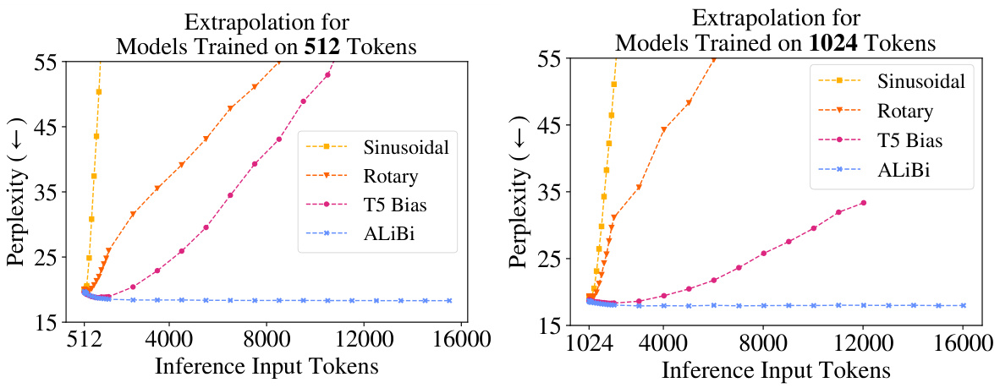  
Figure 1: Extrapolation: as the (validation-set’s) input sequence gets longer (  $x$  -axis), current po- sition methods (sinusoidal, rotary, and T5) show degraded perplexity (  $\it{\Delta}y$  -axis, lower is better), but our method (§3) does not. Models were trained on WikiText-103 with sequences of    $L=512$   (left) or    $L=1,\!024$   (right) tokens. T5 ran out of memory on our 32GB GPU. For more detail on exact perplexities and runtimes, see Tables 2 and 3 in the appendix.  

Compared to a sinusoidal model trained on the same input length, our method requires no additional runtime or parameters and incurs a negligible   $(0{-}0.7\%)$   memory increase. ALiBi can be imple- mented by changing only a few lines of existing transformer code.  

Using ALiBi, a transformer LM can be trained on short-  $L$   sequences and therefore at much lower cost, and it can still be reliably applied to long sequences at runtime. For example, a 1.3 billion parameter LM trained on  $L=1024$   tokens with ALiBi achieves the same perplexity as a sinusoidal model trained on    $L=2048$   when both are tested on sequences of 2048 tokens, even though  our model is   $I I\%$   faster and uses   $I I\%$   less memory.  

Though performance peaks at around two times the number of tokens that the model was trained on, ALiBi maintains strong performance even on sequences of length 10,000. In recently explored set- tings where NLP training examples are given as context to an LM (Brown et al., 2020), our approach will allow exposure to more examples. Additionally, it enables generation of longer outputs.  

# 2CURRENT APPROACHES DO NOT EXTRAPOLATE EFFICIENTLY  

We show for the first time that the sinusoidal position method, which technically should be able to extrapolate, in practice has very limited extrapolation capabilities. Though the rotary position method improves over the sinusoidal one, it still does not achieve satisfying results. Holding every- thing else constant, we are the first to observe that the T5 bias method leads to better extrapolation than either of these, and so we conclude that extrapolation ability depends heavily on the position embedding. Unfortunately, the T5 bias is computationally costly (Figure 2).  

# 2.1 B ACKGROUND AND  E XPERIMENTAL  S ETUP  

A transformer LM receives a list of tokens and outputs a probability distribution representing its prediction for the next token. We call the input list the  current input subsequence  since the inputs to language models are typically subsequences from (much longer) training or evaluation sequences. During both training and perplexity evaluation (i.e., scoring a fixed sequence), many predictions can be calculated at once; this is done using a “causal mask” that ensures each position’s prediction is influenced only by tokens to its left. Let  $L$   be the length of each input subsequence during training; it includes  $L$   predictions, which on average have access to    $\textstyle{\frac{L+1}{2}}$  tokens of (left) context. To explore a model’s extrapolation abilities, we are interested in cases where sequences of length    $L_{\nu a l i d}>L$   are considered at evaluation time. When  $L$   differs between inference and training, we use  $L$   to refer to the length of subsequences during training and  $L_{\nu a l i d}$   to refer to their length at validation.  

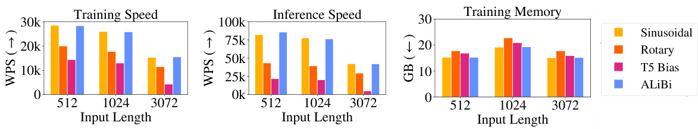  
Figure 2: A comparison of batched training, inference speed and memory use of the sinusoidal, rotary, T5 bias, and our ALiBi position methods. The speed differences between our method and the sinusoidal are within   $1\%$   during training and  $3\%$   for inference, which is insignificant on our hardware. ALiBi uses 100MB of extra memory when training on input lengths 1024 and 3072 in this setting. Memory usage is lower in all approaches when training on 3072 tokens (compared to 1024) since we break batches into multiple updates. See Table 1 in the appendix for exact numbers.  

Nonoverlapping Inference To train on or evaluate a sequence longer than    $L$   tokens, it is typical to segment the sequence into    $L$  -length subsequences and train on or evaluate them independently. Unless otherwise stated, we use nonoverlapping inference to report perplexity scores.  

Extrapolation During Inference Formally, the functions that define a transformer layer are ag- nostic to input length; 3   they map from some arbitrary, unfixed number of input vectors to the same number of output vectors. When transformers are applied to data that is inherently sequential, like text, positional information is injected into the inputs in various ways.  

Vaswani et al. (2017) discussed two options for embedding positions into vectors to be added to word embeddings: learning embeddings for specific positions and unlearned sinusoidal embeddings. They observed similar performance between these two but preferred the sinusoidal approach, which they argued might extrapolate to longer input sequences during inference. We find that this model cannot extrapolate to more than a few dozen tokens beyond    $L$  .  

Experiment Setup We first test the extrapolation abilities of various position methods on the WikiText-103 corpus (Merity et al., 2016) using the transformer language model of Baevski & Auli (2018). We use this model because of its prominent role in recent language modeling develop- ments (Khandelwal et al., 2020; Press et al., 2021). The training set is about 103 million tokens from English Wikipedia (half a gigabyte). The model has  16  transformer layers of dimension  1024 , with  8  heads, and a feedforward inner dimension of  4096 . This model ties the word embedding and softmax matrices (Press & Wolf, 2017; Inan et al., 2017). In our experiments, other than varying the position method and training subsequence length, we modify no other hyperparameters, including the random seed and number of training epochs (205).  

# 2.2 M EASURING  E XTRAPOLATION  

Sinusoidal Position Embeddings Sinusoidal position embeddings (Vaswani et al., 2017;   $\S3.5)$  ) are constant, non-learned vectors that are added to token embeddings on input to the first layer of the transformer. They are frequently used in transformer language modeling (Baevski & Auli, 2018; Lewis et al., 2021) and machine translation (Vaswani et al., 2017; Ott et al., 2018) models. We first consider the unmodified model of Baevski & Auli (2018), which uses sinusoidal position embeddings, and train it on  $L\,=\,512$   tokens; we then run inference with it on the validation set on    $L+k$   tokens, with    $k$   ranging from 0 to 15,000. Figure 1 (left) and the corresponding Table 2 (in the appendix) show that while the model improves perplexity up to  $k=20$  , performance stops improving and stays steady from  $k=20$   to    $k=50$   and then begins degrading. Similar results are obtained for a model trained with  $L=1024$   tokens (Figure 1 (right) and Table 3 in the appendix). That model improves for up to    $L_{\nu a l i d}=L+50$   tokens, after which performance declines.  

Rotary Position Embeddings The rotary method was introduced by Su et al. (2021) and has recently been popularized by the open source GPT-3 (Brown et al., 2020) implementation GPT- J (Wang & Komatsuzaki, 2021). Instead of adding sinusoidal embeddings at the bottom of the transformer, they multiply the keys and queries of every attention layer by sinusoidal embeddings.  

Unlike the sinusoidal or learned positional embedding approach, the rotary method injects position information into the model at every layer, not just at the initial one. In addition, it adds no position information to the values of the self-attention sublayer. The output of a self-attention sublayer is a linearly transformed, weighted sum of the input value vectors; therefore, by not inserting position information into the values, the outputs of each transformer-layer contain no explicit position infor- mation. We suspect that this segregation of position information may be beneficial for extrapolation, and we draw inspiration from it in the design of our method (§3).  

We apply the rotary position embedding method to our Baevski & Auli baseline.   The perplexity results (Figure 1 and Appendix Tables 2 and 3) are better than the sinusoidal approach: the model with  $L=512$     $L=1024)$  ) improves perplexity with up to  $k=200$   (  $k=100$  ) more tokens than it saw during training, but this comes at the cost of slower training and inference (Figure 2).  

T5 Bias Though most models use trained or sinusoidal position embeddings, the T5 model of Raf- fel et al. (2020) uses a relative position method (Shaw et al., 2018; Huang et al., 2019) that adds no position information to word embeddings (as in the previous method). Instead, it modifies the way attention values are computed. We refer to this as the “T5 bias” method.   To compute attention values in the unmodified transformer, we compute the dot product of every query with every rele- vant key and then softmax these attention values. In this method, we compute the attention values as before, but then we add a learned, shared bias to each query-key score that is dependent on just the distance between the query and key. Therefore, all query-key scores where the query and key distance are zero (i.e., the query and key represent the same token) get a specific learned bias, all scores where the query and key are one word away get a different learned bias, and so on, up to a certain point, from where multiple different distances share the same learned bias (which might be beneficial for extrapolation). As in the rotary method, the T5 bias injects position information into the model at every layer and integrates no explicit position information into the self-attention value vectors.  

Raffel et al. (2020) propose that the T5 bias may allow extrapolation, but they did not report exper- iments testing this. Here, we show that the T5 bias does allow language models to extrapolate. We do this by again modifying the Baevski & Auli model, this time to insert the T5 bias into it.  

As Figure 1 shows, the T5 bias improves perplexity with longer sequences than the ones it was trained on, i.e.,  $k=600$   (  $k=800$  ) extra tokens for a model trained on    $L=512$     $L=1024)$  ) input tokens. Unfortunately, this impressive performance comes at a cost: training is at least twice as slow as with the sinusoidal model. Therefore, this model’s extrapolation ability provides no efficiency advantage. For example, to do inference on 1024 tokens, we could either train the sinusoidal model with  $L=1024$   or train the T5 bias model on    $L=512$   tokens and extrapolate to 1024 for inference. However, the    $L=1024$   sinusoidal model runs at   $28.5\mathbf{k}$   words per second (WPS), while the    $L=$  512 T5 bias model runs at   $14.4\mathrm{k}$   WPS (Appendix Table 1), so there is no speedup when training on shorter sequences with this method.  

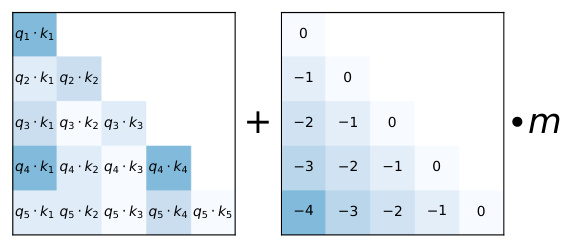  

Figure 3: When computing attention scores for each head, our linearly biased attention method, AL- iBi, adds a constant bias (right) to each attention score   $(\mathbf{q}_{i}\cdot\mathbf{k}_{j}$  , left). As in the unmodified attention sublayer, the softmax function is then applied to these scores, and the rest of the computation is un- modified.  m is a head-specific scalar  that is set and not learned throughout training. We show that our method for setting  $m$   values generalizes to multiple text domains, models and training compute budgets. When using ALiBi, we do  not  add positional embeddings at the bottom of the network.  

# 3 A TTENTION WITH  L INEAR  B IASES  (AL I B I )  

In the transformer model of Vaswani et al. (2017), position embeddings are added to the word embeddings at the bottom of the network. For an input subsequence of length    $L$  , the attention sublaye comp ention s ores for the    $i$  th query  $\mathbf{\dot{q}}_{i}\in\mathbb{R}^{1\times\hat{d}}$  ,   $(1\leq i\leq L)$   in each head, given the first  i  keys  $\mathbf{K}\in\mathbb{R}^{i\times d}$  , where  d  is the head dimension:  

$$
\mathrm{softmax}(\mathbf{q}_{i}\mathbf{K}^{\top})
$$  

These attention scores are then multiplied by the values to return the output of the attention sublayer.  

When using ALiBi, we do not add position embeddings at any point in the network. The only modification we apply is after the query-key dot product, where we add a static, non-learned bias: 10  

$$
\mathrm{softmax}(\mathbf{q}_{i}\mathbf{K}^{\top}+m\cdot[-(i-1),...,-2,-1,0]),
$$  

where scalar  $m$   is a head-specific slope fixed before training. Figure 3 offers a visualization.  

For our models with 8 heads, the slopes that we used are the geometric sequence:  ${\frac{1}{2^{1}}},{\frac{1}{2^{2}}},...,{\frac{1}{2^{8}}}$   . For models that require 16 heads, we interpolate those 8 slopes by geometrically averaging every consecutive pair, resulting in the geometric sequence that starts at  $\textstyle{\frac{1}{\sqrt{2}}}$    and has the ratio of  $\frac{1}{\sqrt{2}}$  :  $\textstyle{\frac{1}{2^{0.5}}},\,{\frac{1}{2^{1}}},\,{\frac{1}{2^{1.5}}},...,\,{\frac{1}{2^{8}}}$   . In general, for    $n$   heads, our set of slopes is the geometric sequence that starts at  $2^{\frac{-8}{n}}$   and uses that same value as its ratio.  

In   $\S4$  , we observe that this set of slopes works on a wide variety of text domains and model sizes. Therefore, we do not believe that it is necessary to tune these slope values every time a new model is trained on a new dataset. This makes our method similar to the sinusoidal approach, where the hyperparameters (the start and end of the geometric progression of wavelengths) were set once by Vaswani et al. (2017) and then reused in different models of different sizes on different datasets.  

ALiBi has an inductive bias towards recency; it penalizes attention scores between distant query-key pairs, with the penalty increasing as the distance between a key and a query grows. The different heads increase their penalties at different rates, depending on the slope magnitude.  

We initially experimented with making the slopes trainable, but this did not yield strong extrapola- tion results.   A brief manual exploration of around ten slope sets led us to discover the set of slopes that we finally picked. Our main insight from this exploration is that the slope sets that work best are those with slopes in the    $(0,1)$   range, with the slopes’ density increasing as we get closer to  0 . We also found our method to be robust to slope choice. Even randomly sampling from the exponential distribution worked well in some cases (although that method had high variance).  

Since ALiBi is a relative position method, we add position information at every layer to the keys and queries but not to the values, as is done in the T5 bias and rotary methods. We hypothesize that these properties might be beneficial for extrapolation.  

Implementation. ALiBi is easy to implement, with all changes accomplished in a few lines of code. We implement it by modifying the mask matrix by adding the linear biases to it (in practice, when training a transformer LM, query  $\mathbf{q}_{i}$   attends only to keys  1  to    $i$  ; this is implemented by adding a mask matrix to the query-key dot product before the softmax operation is applied). This means that there is no runtime penalty when using our method since we add no operations to the network.  

Compared to the sinusoidal model trained on the same input lengths, AliBi incurs a memory increase (up to 100MB in some of our experiments): in t ified tra former, the mask is of size  $L\times L$  ; when using ALiBi, the mask is a slightly larger  $n\times L\times L$  × ×  (where  n  is the number of heads) since the linear biases added for each head uses a different slope. But, as we show, ALiBi enables training on much smaller sequences while still achieving (and occasionally surpassing) results obtained using sinusoidal embeddings on longer sequences, which saves multiple gigabytes of memory.  

# 4 R ESULTS  

We first show that on WikiText103 ALiBi is efficient and enables training models with short input subsequences that outperform strong baselines even when the ALiBi models extrapolate to more than six times the number of tokens that they were trained on. We then take the same hyperparameters for our method (the set of slopes) that worked on WikiText-103 and show that – with no modification – they provide strong results on a dataset in a very different domain: books. Finally, we show that a 1.3B parameter model trained with AliBi on a much larger (461 GB) dataset with much more compute provides a superior alternative to the sinusoidal method since it achieves similar perplexity scores while running faster and using less memory (since it is trained on shorter inputs).  

While multiple alternatives to the position methods presented in Vaswani et al. (2017) have been proposed, few have been adopted in large (1B or more parameter) LMs since that setting is much more challenging than the smaller scale experiments. GPT-3 and Jurassic-1 (Lieber et al., 2021) use the learned position embedding method from Vaswani et al., and GPT-J uses the rotary method. Our results on the 1.3B parameter model show our method’s ability to generalize to larger models, dataset sizes and training durations without retuning the hyperparameter.  

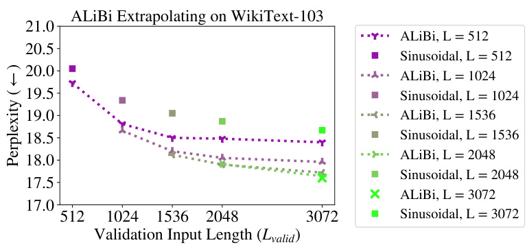  
4.1 R ESULTS ON  W IKI T EXT -103  AND  T ORONTO  B OOK C ORPUS  

Figure 4: ALiBi models trained and evaluated on varying sequence lengths on the WikiText-103 validation set and the sinusoidal baseline (not evaluated on longer sequences). All of our models outperform the sinusoidal ones even when trained on fewer tokens. Appendix Table 5 has exact perplexities, more ALiBi models (trained on fewer tokens), and results for rotary and T5 bias models.  

We first develop our method on the WikiText-103 corpus (Merity et al., 2016), replacing the sinu- soidal position embeddings in the language model of Baevski & Auli (2018) with ALiBi.  

Figure 4 (and the corresponding Appendix Table 5) show our results for models trained with varying numbers of input subsequence tokens  $(L)$  , extrapolating to longer subsequence lengths on the valida- tion dataset. Our first observation is that, without extrapolation, for every  $L$  , our models outperform those using the sinusoidal method, sometimes by a significant amount. For example, the Baevski & Auli m ves   $18.67{\pm}0.24$   (std. dev.) perplexity when trained with    $L=3072$  s, but our  $L=3072$   model achieves 17.60 perplexity (when both models evaluate with  $L_{\nu a l i d}=3072$  Our second observation is that all of our models can extrapolate, and they obtain improved perplexity scores when handling more tokens than they observed during training. For example, our model trained on 512 tokens (which achieves 19.73 perplexity when evaluating subsequences of length 512 in the development set) achieves a perplexity score of 18.40 on the development set when extrapolating to subsequences of length 3072. Surprisingly, this surpasses the score that the    $L=$  3072  sinusoidal model obtains on the development set by a statistically significant margin. Note that all our models trained on  $L\,=\,512$   to    $L\,=\,2048$   outperform the sinusoidal baseline trained on    $L\:=\:3072$   when extrapolating to    $L_{\nu a l i d}=3072$   even though those models all take much less time to train since they train on shorter subsequences (Appendix Figure 8 compares training speed to perplexity for these models)! The    $L\;=\;512$   model is 1.84 times faster to train and yet still outperforms the    $L\:=\:3072$   sinusoidal model when extrapolating to    $L_{\nu a l i d}\,=\,3072$  . In addition, training the    $L=3072$   sinusoidal model requires a GPU with more than 16 GB of memory to fit the large attention matrices, which our  $L=512$   outperforms even though it can be trained on a GPU with much less memory due to much smaller attention matrices.  

Additionally, Table 5 (in the appendix) also shows that, for    $L s$   of 1024 and 3072, our method per- forms better than the rotary and T5 bias models even when    $L_{\nu a l i d}=L$   (i.e., no extrapolation is occurring). Figure 1 (and the corresponding Appendix Tables 2 and 3) more broadly explore our method vs. the other position methods. They show that the T5 bias (the best of the baselines) im- proves perplexity until  $L_{\nu a l i d}$   is around  $2L$  , but on the WikiText-103 dataset our method continually improves perplexity until at least around    $3L$  , with the  $L\,=\,512$   model improving perplexity even when    $L_{\nu a l i d}$   exceeds   $12\mathbf{k}$   tokens. Even when unable to improve perplexity given longer sequences, ALiBi always maintains strong performance as more tokens are added.  

Appendix Table 6 shows that our results on the validation set also transfer to the test set of WikiText- 103. Currently, almost all models that present results on WikiText-103 use sliding window evalu- ation (defined in   $\S\mathbf{B}$  ) to compute perplexities. We apply that method to our (and to the sinusoidal, rotary and T5 bias) models in Appendix Table 7. We find that our  $\begin{array}{r}{\mathrm{L}=3072}\end{array}$   model surpasses the performance of Transformer-XL (Dai et al., 2019), the Sandwich (Press et al., 2020), and Short- former (Press et al., 2021) models. Our results are similar to the ones obtained with staged train- ing (Press et al., 2021) but fall short of results obtained by Routing Transformer (Roy et al., 2020) and kNN-LM (Khandelwal et al., 2020). The methods used in those models are orthogonal to ours, and we hypothesize that combining them with ours might lead to even larger performance increases.  

After developing our method on WikiText-103, in Appendix Section A.3, we run one set of experi- ments on a different domain (books) using a similar model architecture and without modifying any of the ALiBi hyperparameters (the slopes) and show that our results fully transfer to this new do- main. Our models are able to both surpass the sinusoidal baseline when not extrapolating while also outperforming it when extrapolating to longer sequences.  

# 4.2RESULTS ON THE CC100+ROBERTA CORPUS  

Our final set of experiments investigates whether ALiBi transfers to a larger model trained with a larger computational budget on a larger dataset than the ones we previously used. We show that our method achieves strong results in this more challenging setting, obtaining similar performance to the sinusoidal baseline while using significantly less memory, since we train on shorter subsequences.  

The dataset we choose is a combination of the datasets used to train the RoBERTa (Liu et al., 2019) implementation of BERT (Devlin et al., 2019) and the English part of the CC-100 corpus intro- duced in Conneau et al. (2020), for a total of 461 GB. The RoBERTa training corpus—i.e., the Toronto Book Corpus (Zhu et al., 2015), English Wikipedia, CC-News (Nagel, 2016), OpenWeb- Text (Gokaslan & Cohen, 2019) and Stories (Trinh & Le, 2018))—is 161 gigabytes, and the English part of the CC-100 corpus is 300 gigabytes. The validation set contains 649K tokens.  

Our models for this dataset have 25 transformer layers with 16 heads and a dimension of 2048, with an 8192 hidden dimension of the feedforward sublayers. These models have 1.3B parameters. We train our models for one epoch, which is  $50\mathrm{k}$   updates on 128 V100 GPUs.  

In Figure 5 (left), we compare the validation perplexity for    $L_{\nu a l i d}=1024$   throughout the training process for an ALiBi model trained with    $L=512$   compared to the sinusoidal model trained with  $L=1024$  . Since our model is trained on shorter sequences, it is  $7\%$   faster and uses 1.6 GB less  

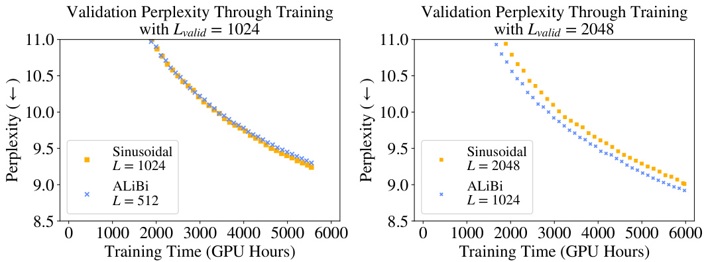  
Figure 5: On the left (right), a 1.3B-parameter ALiBi model trained on 512 (1024) and evaluated on 1024 (2048) tokens during training, compared to the sinusoidal baseline trained on 1024 (2048) to- kens. The ALiBi models obtain strong results even though they use  $6\%–11\%$   less memory since they train on shorter sequences. Appendix Table 11 shows memory use and end-of-training perplexities.  

memory. We halt training of the sinusoidal baseline when our model reaches the end of its training (one epoch). At that time, our model is just 0.06 perplexity away from the baseline even though it was trained on sequences that are half the length of those the baseline used and requires less memory.  

In Figure 5 (right), results become even more impressive, showing that our model trained on    $L=$  1024 outperforms by 0.09 perplexity the sinusoidal model trained on    $L=2048$   (when evaluating with  $L_{\nu a l i d}=2048)$  ) even though our model uses 3.1 GB less memory. Our model maintains a lead in perplexity over the sinusoidal model during the entire training process. By sampling five evenly distributed points across the training process, we compute that our    $L=1024$   model reaches a given perplexity value, on average,   $11\%$   faster than the sinusoidal model does.  

Since our models in these comparisons use much less memory, they allow for stacking more layers, which would further improve performance (with negligible, if any, runtime cost). To keep our experiments as straightforward as possible, however, we do not add layers to our models.  

Appendix Table 12 presents additional results comparing our models to the sinusoidal baseline when both are trained on the same    $L$  , showing that ALiBi performs similarly to the sinusoidal baseline when not extrapolating. This contrasts with the results presented on the smaller datasets, where ALiBi consistently outperforms other position methods even when not extrapolating, suggesting that ALiBi’s inductive bias provides additional benefits for lower-resource language modeling.  

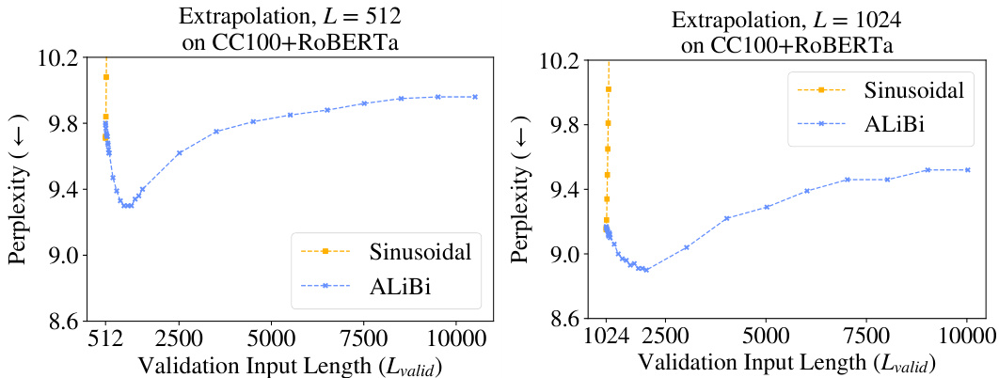  
Figure 6: The ALiBi and sinusoidal models (with both    $L=512$   and 1024) trained for  $50\mathrm{k}$   updates (1 epoch) on the   $\mathrm{CC100+R}$  oBERTa corpus, extrapolating on the validation set. ALiBi achieves the best results at around    $2L$   but maintains strong performance even up to 10000 tokens in these experiments.  

Figure 6 shows that our models trained on  $L=512$   and  $L=1024$   achieve the best results when extrapolating to about double the tokens that they were trained on. Specifically, the  $L=512$   model (that obtains 9.79 perplexity when    $L_{\nu a l i d}=512)$  ) achieves its best score (9.3) when extrapolating to 1012 tokens, and the    $L=1024$   model (that obtains 9.16 perplexity when    $L_{\nu a l i d}=1024)$  ) achieves its best score (8.9) when extrapolating to 2024 tokens.  

One possible explanation is that the subsequences the model observes during training are up to    $L$  tokens long. When performing inference on subsequences of length  $2L$  , half of the subsequences the model consumes are as long as the examples seen during training. When inference is performed on subsequences of length    $2L+1$   or longer, less than half of the predictions the model makes are on subsequences of lengths seen during training, and that might degrade performance.  

The sinusoidal model cannot extrapolate at all in this setting, with its performance degrading for both the  $L=512$   and 1024 models as soon as one token more than    $L$   is added during evaluation.  

In Appendix B, we find that ALiBi’s edge over sinusoidal embeddings is largely explained by its improved avoidance of the early token curse. We posit that future work building on ALiBi might achieve further gains by more efficiently exploiting longer histories.  

# 5 R ELATED  W ORK  

In parallel with our work, Wennberg & Henter (2021) introduce a relative position method that, like our method, adds a bias to attention scores that is a function of the distance between the key and query elements. Unlike our ALiBi method, which uses a non-learned linear function, their method uses a radial-basis function, with multiple trainable parameters (in our experiments, this led to a slight decrease in runtime). In addition, they present experiments on text classification, not on language modeling. They do not explore extrapolation. The Distance Aware Transformer (Wu et al., 2021) multiplies attention scores by a bias that is a function of the distance between the key and query. This function uses a different, learned parameter in every head. They show results only on text classification. In our experiments (not presented), multiplying attention scores by the bias (instead of adding, as in ALiBi) degraded performance.  

Transformer-XL (Dai et al., 2019) presented a language model that uses a cache and can attend to more tokens during inference than it was trained on (by increasing the length of the cache). However, this work presents results only where output length is limited to the    $L$   (the training length), and their relative position method is very slow (Press et al., 2021). The Longformer (Beltagy et al., 2020) adapts models trained on shorter sequences to document-level tasks. However, to achieve this they had to partially train their models on longer sequences. Our ALiBi method enables extrapolation without any additional training on longer sequences.  

To our knowledge, extrapolation has not been previously explored in transformer language model- ing, but it has been investigated previously and concurrently with transformers on other tasks, such as machine translation (Rosendahl et al., 2019; Neishi & Yoshinaga, 2019; Newman et al., 2020; Kiyono et al., 2021), sequence-to-sequence models trained on an artificial dataset (Hupkes et al., 2020), pretrained sequence-to-sequence models tested on arithmetic tasks (Nogueira et al., 2021, Appendix C), models trained with reinforcement learning (Lampinen et al., 2021), image, speech recognition, and machine translation models (Likhomanenko et al., 2021), and protein structure prediction (Jumper et al., 2021, Appendix 1.5).  

# 6 C ONCLUSION  

We showed that the sinusoidal position embedding approach does not enable transformers to extrap- olate to inputs longer than the ones they were trained on. We then established that extrapolation in transformers can be enabled by just changing the position method. We showed that our ALiBi method offers an extremely simple replacement for existing position approaches and allow models to extrapolate. In addition, when not extrapolating, our method achieves either better perplexity than the sinusoidal method (in models smaller than 1B parameters, trained on less data) or similar perplexity (in larger, billion parameter models trained on much more data). ALiBi is simple to im- plement and does not slow down runtime or require extra parameters (but does occasionally require a negligible amount of extra memory). Using our method, we sped up the training of a 1.3 billion parameter model evaluated on the same input sequence length as GPT-3 (2048).  

# A CKNOWLEDGMENTS  

We thank Tim Dettmers, Gabriel Ilharco, Jungo Kasai, Hao Peng, Sewon Min, Sofia Serrano, Sam Shleifer, Luke Zettlemoyer, Julian Michael, Nikolaos Pappas, Yizhong Wang, and the anonymous reviewers for their valuable feedback and fruitful discussions.  

# R EFERENCES  

Alexei Baevski and Michael Auli. Adaptive input representations for neural language modeling. CoRR , abs/1809.10853, 2018. URL  http://arxiv.org/abs/1809.10853 .  

Iz Beltagy, Matthew E. Peters, and Arman Cohan. Longformer: The long-document transformer. arXiv:2004.05150 , 2020.  

Tom B. Brown, Benjamin Mann, Nick Ryder, Melanie Subbiah, Jared Kaplan, Prafulla Dhari- wal, Arvind Neelakantan, Pranav Shyam, Girish Sastry, Amanda Askell, Sandhini Agarwal, Ariel Herbert-Voss, Gretchen Krueger, Tom Henighan, Rewon Child, Aditya Ramesh, Daniel M. Ziegler, Jeffrey Wu, Clemens Winter, Christopher Hesse, Mark Chen, Eric Sigler, Mateusz Litwin, Scott Gray, Benjamin Chess, Jack Clark, Christopher Berner, Sam McCandlish, Alec Radford, Ilya Sutskever, and Dario Amodei. Language models are few-shot learners, 2020.  

Alexis Conneau, Kartikay Khandelwal, Naman Goyal, Vishrav Chaudhary, Guillaume Wenzek, Francisco Guzm´ an, Edouard Grave, Myle Ott, Luke Zettlemoyer, and Veselin Stoyanov. Un- supervised cross-lingual representation learning at scale.  Proceedings of the 58th Annual Meeting of the Association for Computational Linguistics , 2020. doi: 10.18653/v1/2020.acl-main.747. URL  http://dx.doi.org/10.18653/v1/2020.acl-main.747 .  

Zihang Dai, Zhilin Yang, Yiming Yang, Jaime Carbonell, Quoc Le, and Ruslan Salakhutdinov. Transformer-XL: Attentive language models beyond a fixed-length context. In  Proceedings of the 57th Annual Meeting of the Association for Computational Linguistics , pp. 2978–2988, Florence, Italy, July 2019. Association for Computational Linguistics. doi: 10.18653/v1/P19-1285. URL https://aclanthology.org/P19-1285 .  

Jacob Devlin, Ming-Wei Chang, Kenton Lee, and Kristina Toutanova. BERT: Pre-training of deep bidirectional transformers for language understanding. In  Proceedings of the 2019 Conference of the North American Chapter of the Association for Computational Linguistics: Human Language Technologies, Volume 1 (Long and Short Papers) , pp. 4171–4186, Minneapolis, Minnesota, June 2019. Association for Computational Linguistics. doi: 10.18653/v1/N19-1423. URL  https: //www.aclweb.org/anthology/N19-1423 .  

Aaron Gokaslan and Vanya Cohen. Openwebtext corpus.  http://Skylion007.github.io/ Open Web Text Corpus , 2019.  

Cheng-Zhi Anna Huang, Ashish Vaswani, Jakob Uszkoreit, Ian Simon, Curtis Hawthorne, Noam M. Shazeer, Andrew M. Dai, M. Hoffman, M. Dinculescu, and D. Eck. Music transformer: Generat- ing music with long-term structure. In  ICLR , 2019.  

Dieuwke Hupkes, Verna Dankers, Mathijs Mul, and Elia Bruni. Compositional it y decomposed: How do neural networks generalise? Journal of Artificial Intelligence Research , 67:757–795, April 2020. doi: 10.1613/jair.1.11674. URL  https://doi.org/10.1613/jair.1. 11674 .  

Hakan Inan, Khashayar Khosravi, and Richard Socher. Tying word vectors and word classifiers: A loss framework for language modeling. In  ICLR , 2017. URL  https://openreview.net/ forum?id  $=$  r1aPbsFle .  

J. Jumper, Richard Evans, A. Pritzel, Tim Green, Michael Figurnov, O. Ronneberger, Kathryn Tun- yasuvunakool, Russ Bates, Augustin Z´ ıdek, Anna Potapenko, A. Bridgland, Clemens Meyer, Simon A A Kohl, Andy Ballard, A. Cowie, B. Romera-Paredes, Stanislav Nikolov, Rishub Jain, J. Adler, T. Back, Stig Petersen, D. Reiman, Ellen Clancy, Michal Zielinski, Martin Steinegger, Michalina Pacholska, Tamas Berghammer, S. Bodenstein, D. Silver, Oriol Vinyals, A. Senior, K. Kavukcuoglu, P. Kohli, and D. Hassabis. Highly accurate protein structure prediction with alphafold.  Nature , 596:583 – 589, 2021.  

Urvashi Khandelwal, Omer Levy, Dan Jurafsky, Luke Zettlemoyer, and Mike Lewis. Generalization through Memorization: Nearest Neighbor Language Models. In  International Conference on Learning Representations (ICLR) , 2020.  

Shun Kiyono, Sosuke Kobayashi, Jun Suzuki, and Kentaro Inui. Shape: Shifted absolute position embedding for transformers.  ArXiv , abs/2109.05644, 2021.  

Andrew Kyle Lampinen, Stephanie C. Y. Chan, Andrea Banino, and Felix Hill. Towards mental time travel: a hierarchical memory for reinforcement learning agents.  CoRR , abs/2105.14039, 2021. URL  https://arxiv.org/abs/2105.14039 .  

Mike Lewis, Shruti Bhosale, Tim Dettmers, Naman Goyal, and Luke Zettlemoyer. Base layers: Simplifying training of large, sparse models, 2021.  

Opher Lieber, Or Sharir, Barak Lenz, and Yoav Shoham. Jurassic-1: Technical details and evalua- tion. Technical report, AI21 Labs, August 2021.  

Tatiana Likhomanenko, Qiantong Xu, Ronan Collobert, Gabriel Synnaeve, and Alex Rogozhnikov. CAPE: encoding relative positions with continuous augmented positional embeddings.  CoRR , abs/2106.03143, 2021. URL  https://arxiv.org/abs/2106.03143 .  

Yinhan Liu, Myle Ott, Naman Goyal, Jingfei Du, Mandar Joshi, Danqi Chen, Omer Levy, Mike Lewis, Luke Zettlemoyer, and Veselin Stoyanov. Roberta: A robustly optimized bert pretraining approach, 2019.  

Stephen Merity, Caiming Xiong, James Bradbury, and Richard Socher. Pointer sentinel mixture models, 2016.  

Tomas Mikolov and G. Zweig. Context dependent recurrent neural network language model.  2012 IEEE Spoken Language Technology Workshop (SLT) , pp. 234–239, 2012.  

Tomas Mikolov, M. Karafi´ at, L. Burget, J. Cernock´ y, and S. Khudanpur. Recurrent neural network based language model. In  INTERSPEECH , 2010.  

Sebastian Nagel. Cc-news. https://commoncrawl.org/2016/10/ news-dataset-available/ , 2016.  

Sharan Narang, Hyung Won Chung, Yi Tay, William Fedus, Thibault Fevry, Michael Matena, Kar- ishma Malkan, Noah Fiedel, Noam Shazeer, Zhenzhong Lan, Yanqi Zhou, Wei Li, Nan Ding, Jake Marcus, Adam Roberts, and Colin Raffel. Do transformer modifications transfer across implementations and applications?, 2021.  

Masato Neishi and Naoki Yoshinaga. On the relation between position information and sen- tence length in neural machine translation. In  Proceedings of the 23rd Conference on Com- putational Natural Language Learning (CoNLL) , pp. 328–338, Hong Kong, China, Novem- ber 2019. Association for Computational Linguistics. doi: 10.18653/v1/K19-1031. URL https://aclanthology.org/K19-1031 .  

Benjamin Newman, John Hewitt, Percy Liang, and Christopher D. Manning. The eos decision and length extrapolation. In  BlackBoxNLP@EMNLP , 2020. URL  https://nlp.stanford. edu/pubs/newman 2020 extrapolation.pdf .  

Rodrigo Nogueira, Zhiying Jiang, and Jimmy J. Li. Investigating the limitations of the transformers with simple arithmetic tasks.  ArXiv , abs/2102.13019, 2021.  

Myle Ott, Sergey Edunov, David Grangier, and Michael Auli. Scaling neural machine translation. In  Proceedings of the Third Conference on Machine Translation (WMT) , 2018.  

Ankur Parikh, Oscar T¨ ackstr¨ om, Dipanjan Das, and Jakob Uszkoreit. A decomposable atten- tion model for natural language inference. In  Proceedings of the 2016 Conference on Em- pirical Methods in Natural Language Processing , pp. 2249–2255, Austin, Texas, November 2016. Association for Computational Linguistics. doi: 10.18653/v1/D16-1244. URL  https: //aclanthology.org/D16-1244 .  

Ofir Press and Lior Wolf. Using the output embedding to improve language models. In  Proceedings of the 15th Conference of the European Chapter of the Association for Computational Linguistics: Volume 2, Short Papers , pp. 157–163, Valencia, Spain, April 2017. Association for Computational Linguistics. URL  https://www.aclweb.org/anthology/E17-2025 .  

Ofir Press, Noah A. Smith, and Omer Levy. Improving transformer models by reordering their sublayers. In  Proceedings of the 58th Annual Meeting of the Association for Computational Linguistics , pp. 2996–3005, Online, July 2020. Association for Computational Linguistics. doi: 10.18653/v1/2020.acl-main.270. URL  https://www.aclweb.org/anthology/2020. acl-main.270 .  

Ofir Press, Noah A. Smith, and Mike Lewis. Shortformer: Better language modeling using shorter inputs. In  Proceedings of the 59th Annual Meeting of the Association for Computational Lin- guistics and the 11th International Joint Conference on Natural Language Processing (Volume 1: Long Papers) , pp. 5493–5505, Online, August 2021. Association for Computational Linguistics. URL  https://aclanthology.org/2021.acl-long.427 .  

Jack W. Rae, Anna Potapenko, Siddhant M. Jayakumar, Chloe Hillier, and Timothy P. Lilli- crap. Compressive transformers for long-range sequence modelling. In  International Confer- ence on Learning Representations , 2020. URL  https://openreview.net/forum?id  $=$  SylKikSYDH .  

Colin Raffel, Noam Shazeer, Adam Roberts, Katherine Lee, Sharan Narang, Michael Matena, Yanqi Zhou, Wei Li, and Peter J. Liu. Exploring the limits of transfer learning with a unified text-to- text transformer.  Journal of Machine Learning Research , 21(140):1–67, 2020. URL  http: //jmlr.org/papers/v21/20-074.html .  

Jan Rosendahl, Viet Anh Khoa Tran, Weiyue Wang, and Hermann Ney. Analysis of positional encodings for neural machine translation. In  International Workshop on Spoken Language Trans- lation , Hong Kong, China, November 2019.  

Aurko Roy, Mohammad Saffar, Ashish Vaswani, and David Grangier. Efficient content-based sparse attention with routing transformers, 2020.  

Peter Shaw, Jakob Uszkoreit, and Ashish Vaswani. Self-attention with relative position representa- tions. In  Proceedings of the 2018 Conference of the North American Chapter of the Association for Computational Linguistics: Human Language Technologies, Volume 2 (Short Papers) , pp. 464–468, New Orleans, Louisiana, June 2018. Association for Computational Linguistics. doi: 10.18653/v1/N18-2074. URL  https://www.aclweb.org/anthology/N18-2074 .  

Jianlin Su, Yu Lu, Shengfeng Pan, Bo Wen, and Yunfeng Liu. Roformer: Enhanced transformer with rotary position embedding, 2021.  

Trieu H. Trinh and Quoc V. Le. A simple method for commonsense reasoning, 2018.  

Ashish Vaswani, Noam Shazeer, Niki Parmar, Jakob Uszkoreit, Llion Jones, Aidan N Gomez, Ł ukasz Kaiser, and Illia Polosukhin. Attention is all you need. In I. Guyon, U. V. Luxburg, S. Bengio, H. Wallach, R. Fergus, S. Vishwanathan, and R. Garnett (eds.),  Advances in Neural Information Processing Systems , volume 30. Curran Asso- ciates, Inc., 2017. URL  https://proceedings.neurips.cc/paper/2017/file/ 3f5ee243547dee91fbd053c1c4a845aa-Paper.pdf .  

Ben Wang and Aran Komatsuzaki. GPT-J-6B: A 6 Billion Parameter Autoregressive Language Model.  https://github.com/kingoflolz/mesh-transformer-jax , May 2021.  

Ulme Wennberg and Gustav Eje Henter. The case for translation-invariant self-attention in transformer-based language models, 2021.  

Thomas Wolf, Lysandre Debut, Victor Sanh, Julien Chaumond, Clement Delangue, Anthony Moi, Pierric Cistac, Tim Rault, R´ emi Louf, Morgan Funtowicz, Joe Davison, Sam Shleifer, Patrick von Platen, Clara Ma, Yacine Jernite, Julien Plu, Canwen Xu, Teven Le Scao, Sylvain Gug- ger, Mariama Drame, Quentin Lhoest, and Alexander M. Rush. Transformers: State-of-the-art natural language processing. In  Proceedings of the 2020 Conference on Empirical Methods in Natural Language Processing: System Demonstrations , pp. 38–45, Online, October 2020. As- sociation for Computational Linguistics. URL  https://www.aclweb.org/anthology/ 2020.emnlp-demos.6 .  

Chuhan Wu, Fangzhao Wu, and Yongfeng Huang. DA-transformer: Distance-aware transformer. In  Proceedings of the 2021 Conference of the North American Chapter of the Association for Computational Linguistics: Human Language Technologies , pp. 2059–2068, Online, June 2021. Association for Computational Linguistics. doi: 10.18653/v1/2021.naacl-main.166. URL https://aclanthology.org/2021.naacl-main.166 . Wojciech Zaremba, Ilya Sutskever, and Oriol Vinyals. Recurrent neural network regularization, 2014. Yukun Zhu, Ryan Kiros, Rich Zemel, Ruslan Salakhutdinov, Raquel Urtasun, Antonio Torralba, and Sanja Fidler. Aligning books and movies: Towards story-like visual explanations by watching movies and reading books. In  Proceedings of the IEEE international conference on computer vision , pp. 19–27, 2015.  

# A A PPENDIX  

# A.1 I NTRODUCTION  

The training speed of transformer LMs gets slower as the input subsequence length    $L$   increases. Figure 7 visualizes this.  

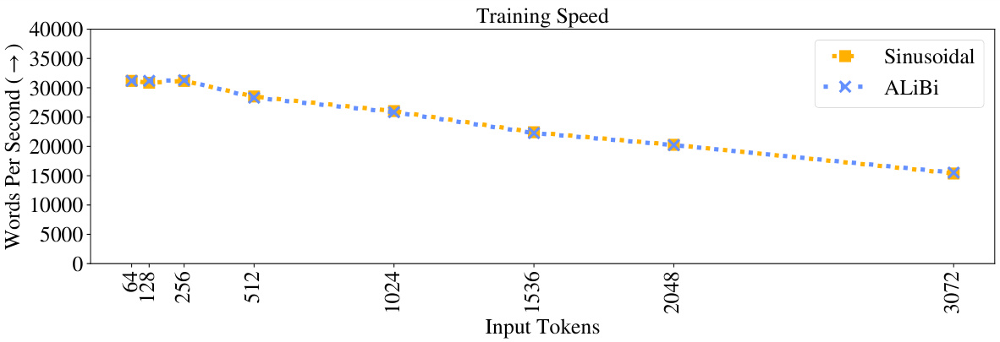  
Figure 7: Training speed of our model and the sinusoidal baseline trained on different amounts of input subsequence tokens    $L$  .  

Table 1 contains the runtimes and memory use statistics for models using the various position meth- ods discussed in this work.  

Table 1: The speed (during training and evaluation, in words per second) and memory usage (during training) of the rotary, T5 bias, and ALiBi models compared to the sinusoidal baseline on WikiText- 103. Training and inference are batched, and speeds are shown for one V100 GPU.  

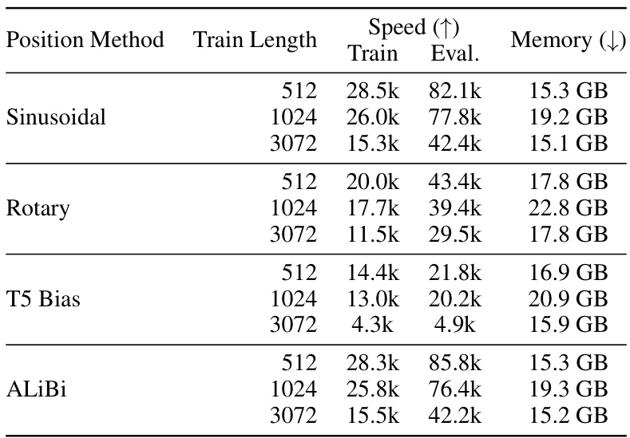  

Tables 2, 3, and 4 show the perplexity and runtime of models using the sinusoidal, rotary T5 bias, and ALiBi position methods when extrapolating to sequences longer than the ones they were trained on. The models used in these tables were trained on    $L=512$  ,  1024  and  3072  tokens.  

  

  

  

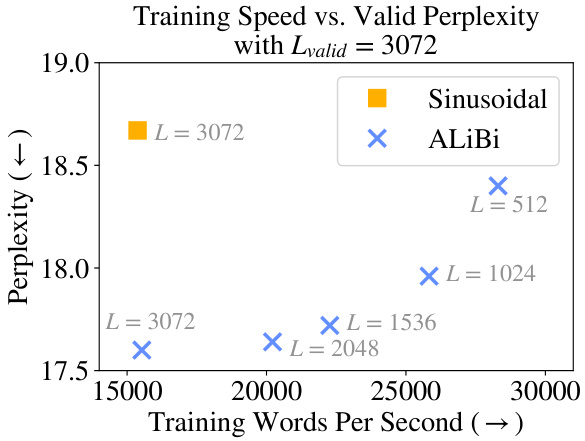  
Figure 8: The training speed and validation perplexity (with    $L_{\nu a l i d}=3072)$   for ALiBi models and the sinusoidal model trained with    $L=3072$  . All our models trained on 512 or more tokens achieve better perplexity than the sinusoidal model even though all of them (except the  $L=3072,$  ) require less time and memory to train.  

Figure 8 depicts a cross section of Figure 4, showing our models with different train lengths and the sinusoidal baseline, all evaluated on  $L_{\nu a l i d}=3072$   tokens. We observe that all our models with  $512\leq L<3072$   are faster to train than the sinusoidal model w  $L=3072$  , but they all achieve greater perplexity scores on the validation set. Our model with  = 3072 trains just as fast as the sinusoidal one but bests its score by more than one perplexity point; (the standard deviation for the the sinusoidal model with    $L=3072$   is 0.24).  

Table 5 shows the perplexity values obtained when 8 different ALiBi models, trained on    $L$   values between 64 and 3072, extrapolating to    $L_{\nu a l i d}$   values longer than the ones they were trained on. In addition, we present results for the sinusoidal, rotary and T5 bias models, with  $L_{\nu a l i d}=L$  .  

Table 5: Perplexity when ALiBi extrapolates on the WikiText-103 development set.   ∗ For results we present for the sinusoidal, rotary and T5 bias models,  $L=L_{\nu a l i d}$   (so we do not test the extrapolation abilities of those baselines here).  

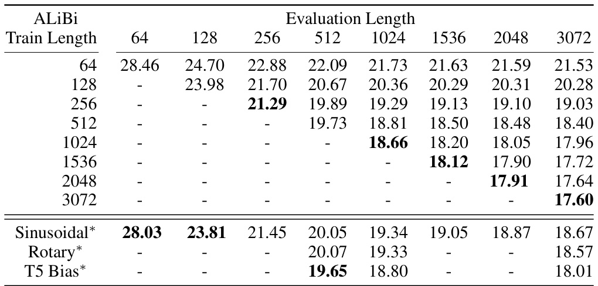  

Table 6 compares ALiBi to the sinusoidal, rotary and T5 bias baselines on the test set of WikiText- 103, and Table 7 compares ALiBi to the current state of the art models on that test set.  

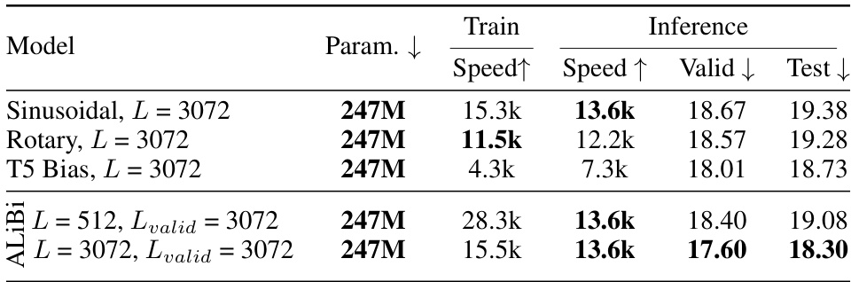  

Table 7: Valid and test perplexity scores on WikiText-103 for two of our ALiBi models and models that use the sinusoidal, rotary and T5 bias methods with sliding window evaluation (  $\S\mathbf{B}$   and  $\scriptstyle{S=512}$  following (Baevski & Auli, 2018; Khandelwal et al., 2020; Press et al., 2021)). The sinusoidal model presents our results from training and inference with the model of Baevski & Auli.  

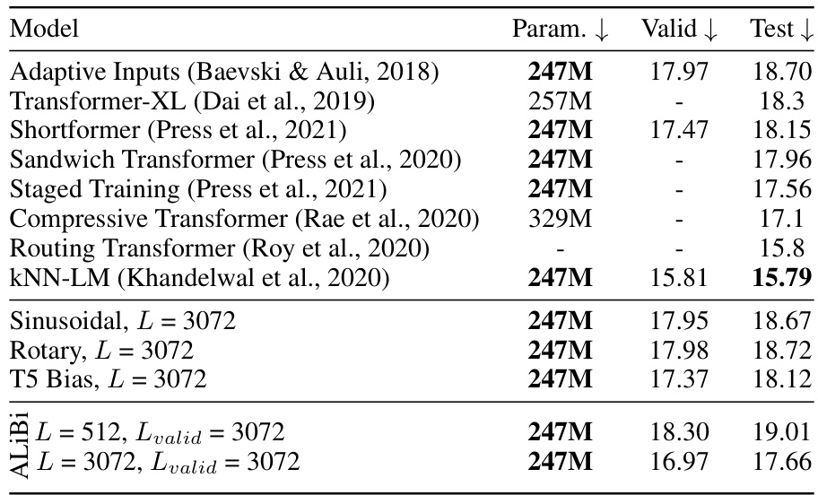  

# A.3 R ESULTS ON THE  T ORONTO  B OOK  C ORPUS  

To ensure that our results are not specific to the WikiText-103 corpus, we next apply our model and the baselines to a different domain while using a similar model architecture and the same ALiBi slopes as those used in the previous subsection.  

We emphasize that our set of slopes was chosen by running experiments on the WikiText-103 corpus, and here we apply that set of slopes to a model trained on a very different text domain. Throughout the entire process of developing this method, we ran only one set of experiments on this domain using the previously selected set of slopes.  

Specifically, we use the Toronto BooksCorpus (Zhu et al., 2015), which has been used to train BERT (Devlin et al., 2019) (in conjuction with the English Wikipedia). The corpus is about 700M tokens (2.9 GB).  

We use the same train/validation/test split as Khandelwal et al. (2020) and their tokenization, which uses BERT’s vocabulary of 29K byte-pair encodings. Since the vocabulary is much smaller than WikiText-103’s, we replace the adaptive word embedding and softmax of Baevski & Auli (2018) with a tied word embedding and softmax matrix (Press & Wolf, 2017; Inan et al., 2017).  

Our results in Figure 9 (and Table 8) replicate our success on the WikiText-103 dataset. Our model surpasses the sinusoidal baseline when trained on the same amount of input tokens   $(L)$   and, in  

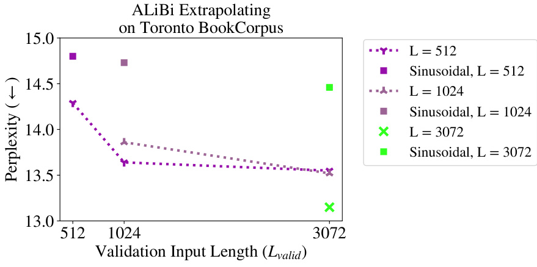  
Figure 9: ALiBi-enabled models evaluated on different input lengths on the Toronto BookCorpus. Our models extrapolate to longer sequence lengths and outperform the sinusoidal baseline even when trained on much shorter sequences.  

addition, our model is able to extrapolate to longer sequences at inference. This occurs even though our set of slopes was  not  tuned on this dataset. This result establishes the generality of ALiBi and the particular set of slopes we found and suggests that they may be used on different text domains without further hyperparameter tuning.  

Tables 9 and 10 present the perplexities for our ALiBi models, the baselines, and the current state of the art on the Toronto BookCorpus validation and test sets. Our results here mirror our results on WikiText-103: we improve over the sinusoidal baseline even when AliBi is trained on fewer tokens.  

Table 8: ALiBi models extrapolating on the Toronto BookCorpus development set.   ∗ For the results of the sinusoidal models,    $L=L_{\nu a l i d}$   (so we do not test the extrapolation abilities of those models here).  

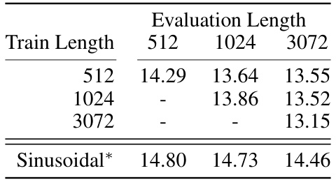  

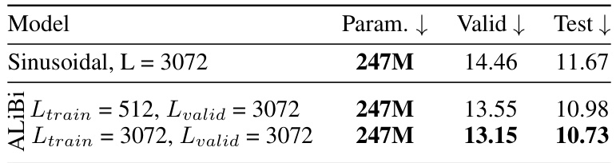  

# A.4 R ESULTS ON THE  ${\mathrm{CC100+}}$  R O BERT A  C ORPUS  

Table 11 compares our 1.3 billion parameter ALiBi models when extrapolating to two times the number of tokens that they were trained on. We use the sinusoidal model as our baseline, and train it for the same amount of time as we train the ALiBi model that we compare it to (and so since our ALiBi models run faster in this setting, the sinusoidal models complete less updates).  

Table 10: Validation and test perplexities on the Toronto Book Corpus dataset with a sliding window  $(\S\mathbf{B})$  . Following (Baevski & Auli, 2018; Khandelwal et al., 2020; Press et al., 2020; 2021), we set the sliding window stride    $\scriptstyle{S=512}$  .  

  

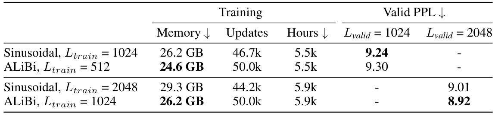  

Table 12 compares our 1.3 billion parameter ALiBi models to the sinusoidal baselines, with and without extrapolation, with all models completing 50,000 updates.  

Table 12: Perplexity, train time and memory use of the sinusoidal and ALiBi models on the CC100+RoBERTa corpus when all models are trained with  $50\mathbf{k}$   updates.  

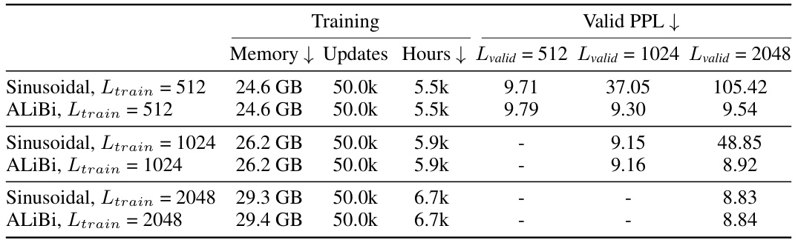  

# B A NALYSIS  

In this section we investigate why ALiBi works so effectively. We find that ALiBi’s decrease in perplexity when given longer sequences is largely explained by its improved avoidance of the early token curse. We hypothesize that future work building on ALiBi might achieve further gains by more efficiently exploiting longer histories.  

B.1DEFINING SLIDING WINDOW EVALUATION AND THE EARLY TOKEN CURSE  

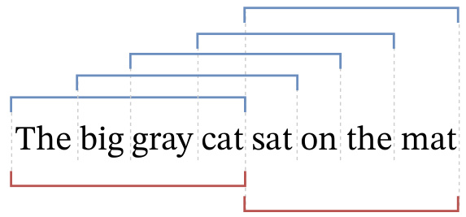  

Figure 10: Sliding window evaluation (top; blue) compared to nonoverlapping evaluation (bottom; red) on a sequence of 8 words using a model with    $L_{\nu a l i d}=4$  . Nonoverlapping evaluation is much faster since it requires just two inference passes (as opposed to the five passes required by the siding window approach). But the sliding window approach provides more context for each prediction.  

Sliding Window Inference As mentioned in Section 2, nonoverlapping inference is commonly used to evaluate sequences longer than  $L$   (the number of tokens in each training subsequence). An alternative is to use a sliding window during evaluation (Baevski & Auli, 2018).  

A stride    $S$   is picked between 1   $L-1$  , and the window is advanced by    $S$   tokens after each forw d pass.   This means that  $L-S$   −  tokens from the previous subsequence are re-encoded, and only  S  new tokens are output. The advantage is that all outputs in each subsequence after the first have at least  $L\mathrm{~-~}S$   previous tokens to condition on. However, since tokens m re-encoded multiple times, this approach is much slower than the nonoverlapping one. When  $S=1$  , we output one token every inference pass, each using the maximal context window that the model can handle; however, this is the slowest approach. Figure 10 is a visualization of the nonoverlapping and sliding window evaluation approaches.  

We use sliding window inference as a tool to analyze our models, but we note that it is normally prohibitively slow in practice (Press et al., 2021).  

Early Token Curse Splitting an evaluation set into subsequences means that predictions occuring early in each subsequence cannot access many previous context tokens (appearing at the end of the previous subsequence). The result, referred to as the  early token curse  (Press et al., 2021), increases (i.e., degrades) perplexity scores. A workaround is to evaluate the model using a sliding window, giving each prediction more context. This solution is slow since it requires many more forward passes of the model.  

# B.2 E XTRAPOLATION REDUCES THE EARLY TOKEN CURSE  

We presented results showing that our ALiBi method (and, to a lesser extent, the T5 bias) allows LMs to extrapolate during inference. Two reasons could explain why these methods enable LMs to achieve better perplexity given longer input subsequences:  

1. Performance improves because the models can use longer contexts to make more accurate predictions. For example, the average article length in the WikiText-103 corpus is about 3600 tokens; therefore, if a model trained on    $L\;=\;512$   tokens extrapolates to    $L_{\nu a l i d}=$  3072 tokens during inference and achieves better results, that might be because it can spot patterns occurring across more than 512 tokens. 2. Performance improves because longer input sequences mean the early token curse is re- duced. For example, during nonoverlapping evaluation on sequences of length    $L_{\nu a l i d}=$  1000,   $10\%$   of predictions have 100 tokens of context or less. If we rerun nonoverlapping evaluation on that model with  $L_{\nu a l i d}=2000$   tokens, now only   $5\%$   of predictions have 100  

tokens of context or less. So, by simply being able to handle longer sequences, a model can substantially reduce the early token curse and improve performance.  

To better understand what might be occurring, we re-evaluate the development set of WikiText-103 with our models and the sinusoidal baseline with    $L=512$  ,  1024 ,  3072 . However, this time we use sliding window evaluation with a stride of    $S=1$  , meaning that we move the sliding window just one token after every inference pass, giving each prediction the maximum number of context tokens that the model can use.  

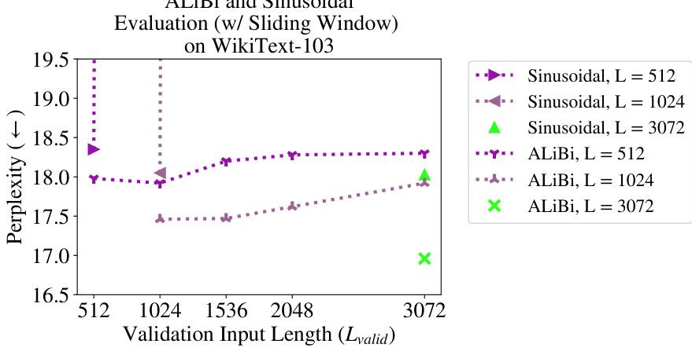  

Figure 11: ALiBi models evaluated on different input lengths on WikiText-103 with sliding window evaluation (with stride    $S=1$  ). Unlike results shown in Figure 4, where performance improves in each of our models as we increase the validation sequence length, here performance stays relatively flat as we increase  $L_{\nu a l i d}$  . This might mean that ALiBi increases performance when    $L_{\nu a l i d}>L$   not because it uses longer contexts, but because fewer tokens suffer from the early token curse. Note that as in  $\S2$  , the perplexity of the sinusoidal model explodes when  $L_{\nu a l i d}>L$   even when using sliding window evaluation.  

The results are shown in Figure 11 and in the corresponding Tables 13 (sinusoidal) and 15 (ALiBi).  

Unsurprisingly, for the sinusoidal model, as in  $\S2$  , increasing  $L_{\nu a l i d}$   causes an explosion in perplexity even when using sliding window evaluation. Our ALiBi models cannot improve perplexity when looking at longer sequences in this setting, but they keep perplexity flat when    $L_{\nu a l i d}$   increases.  

This leads us to believe that our perplexity improvement when increasing  $L_{\nu a l i d}$   and using nonover- lapping evaluation is caused by explanation 2, not explanation 1. Because sliding window evaluation provides long context windows for  every  prediction made, it curtails the early token curse. In this setting, ALiBi’s performance remains flat when  $L_{\nu a l i d}$   increases, leading us to hypothesize that the gains seen while increasing    $L_{\nu a l i d}$   in  $\S4$   were the result of larger  $L_{\nu a l i d}$   values mitigating the early token curse.  

Our ALiBi results mirror what occurs in the model using the T5 bias: when using sliding window evaluation, perplexity remains relatively flat when evaluating longer sequences (see Table 14).  

Our analysis reveals that when  $L_{\nu a l i d}>L$  , ALiBi might not be using contexts longer than the ones it was trained on. This highlights a research direction that could be pursued in future work.  

These findings do not lessen the value of ALiBi. When  $L_{\nu a l i d}=L$  , ALiBi achieves either superior or similar results to the sinusoidal method and other alternatives even though it is simpler and requires no learned parameters. When evaluating  $L_{\nu a l i d}>L$   tokens, even if ALiBi does not attend to more than    $L$   tokens, it yields better results than the other alternatives that can be used in this case, i.e., standard nonoverlapping inference (which is cheap, but does not perform as well) and the more accurate sliding window approach (which is very slow).  

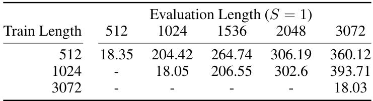  

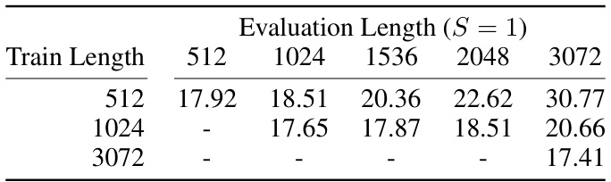  

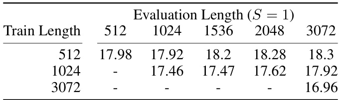  