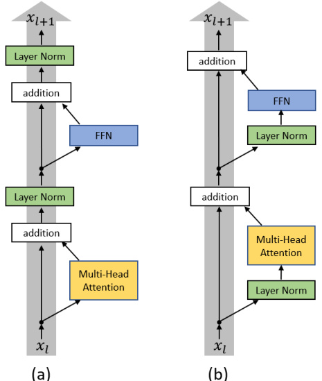
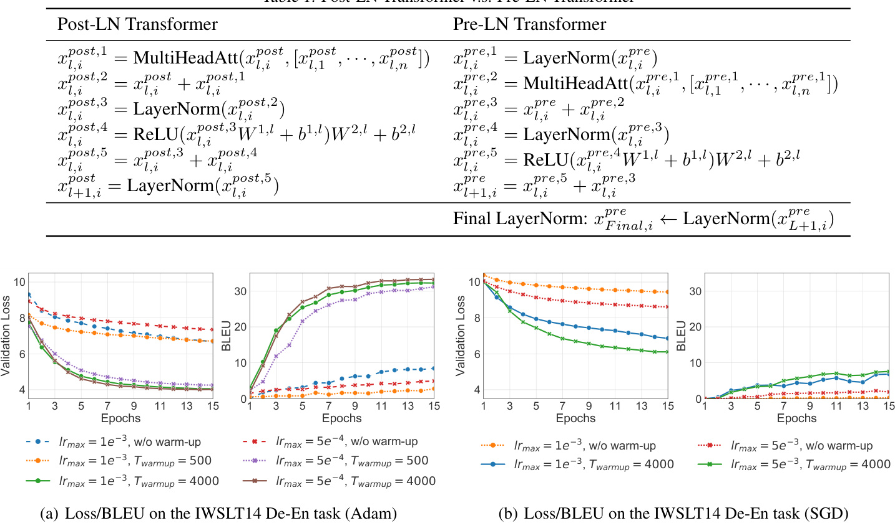
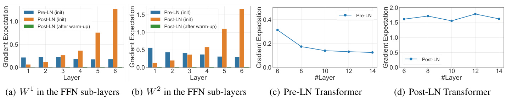
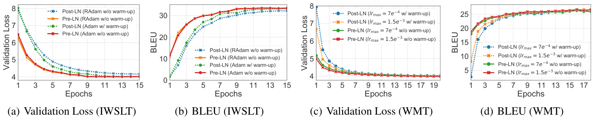
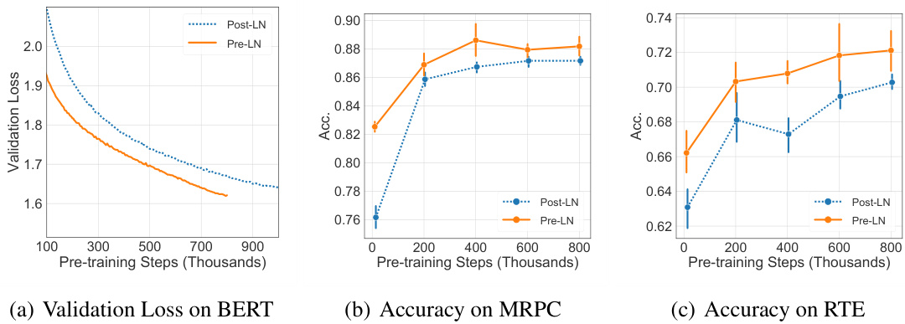
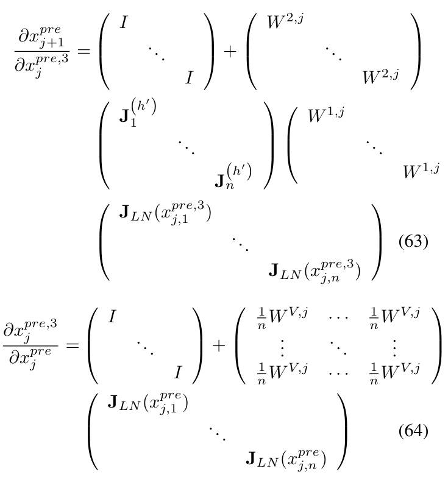
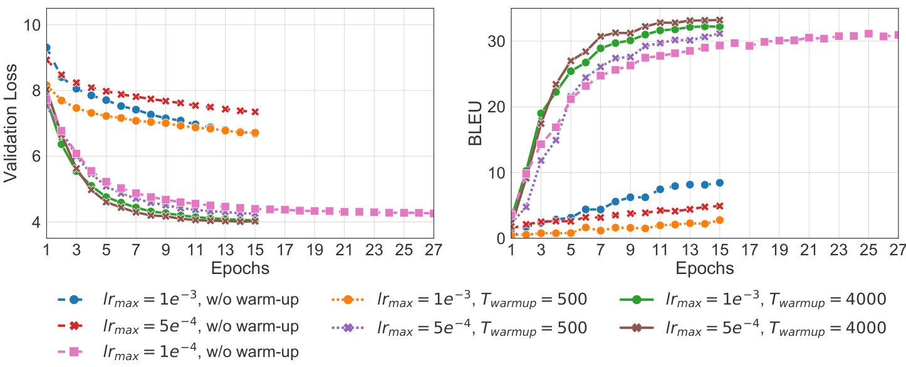

# On Layer Normalization in the Transformer Architecture  

# Ruibin Xiong † \*  1 2   Yunchang Yang \*  3   Di He   4 5   Kai Zheng   4   Shuxin Zheng   5   Chen Xing   6   Huishuai Zhang   5 Yanyan Lan   1 2   Liwei Wang   4 3   Tie-Yan Liu   5  

# Abstract  

The Transformer is widely used in natural lan- guage processing tasks. To train a Transformer however, one usually needs a carefully designed learning rate warm-up stage, which is shown to be crucial to the final performance but will slow down the optimization and bring more hyper- parameter tunings. In this paper, we first study theoretically why the learning rate warm-up stage is essential and show that the location of layer nor- malization matters. Specifically, we prove with mean field theory that at initialization, for the original-designed Post-LN Transformer, which places the layer normalization between the resid- ual blocks, the expected gradients of the parame- ters near the output layer are large. Therefore, us- ing a large learning rate on those gradients makes the training unstable. The warm-up stage is prac- tically helpful for avoiding this problem. On the other hand, our theory also shows that if the layer normalization is put inside the residual blocks (recently proposed as Pre-LN Transformer), the gradients are well-behaved at initialization. This motivates us to remove the warm-up stage for the training of Pre-LN Transformers. We show in our experiments that Pre-LN Transformers without the warm-up stage can reach comparable results with baselines while requiring significantly less training time and hyper-parameter tuning on a wide range of applications.  

# 1. Introduction  

The Transformer ( Vaswani et al. ,  2017 ) is one of the most commonly used neural network architectures in natural lan- guage processing. Layer normalization ( Lei Ba et al. ,  2016 ) plays a key role in Transformer’s success. The originally de- signed Transformer places the layer normalization between the residual blocks, which is usually referred to as the Trans- former with Post-Layer Normalization (Post-LN) ( Wang et al. ,  2019 ). This architecture has achieved state-of-the-art performance in many tasks including language modeling ( Dai et al. ,  2019 ;  Al-Rfou et al. ,  2018 ) and machine transla- tion ( Dehghani et al. ,  2018 ;  Edunov et al. ,  2018 ). Unsuper- vised pre-trained models based on the Post-LN Transformer architecture also show impressive performance in many downstream tasks ( Radford et al. ,  2019 ;  Devlin et al. ,  2018 ; Yang et al. ,  2019b ).  

Despite its great success, people usually need to deal with the optimization of the Post-LN Transformer more carefully than convolutional networks or other sequence-to-sequence models ( Popel & Bojar ,  2018 ). In particular, to train the model from scratch, any gradient-based optimization ap- proach requires a learning rate warm-up stage ( Vaswani et al. ,  2017 ;  Liu et al. ,  2019a ): the optimization starts with an extremely small learning rate, and then gradually in- creases it to a pre-defined maximum value in a pre-defined number of iterations. Such a warm-up stage not only slows down the optimization process but also brings more hyper- parameter tunings.  Popel & Bojar  ( 2018 ) has shown that the final model performance is quite sensitive to the value of the maximum learning rate and the number of warm-up iterations. Tuning such sensitive hyper-parameters is costly in training large-scale models, e.g., BERT ( Devlin et al. , 2018 ) or XLNet ( Yang et al. ,  2019b ).  

In this paper, we try to alleviate this problem by finding ways to safely remove the learning rate warm-up stage. As the warm-up stage happens in the first several iterations, we investigate the optimization behavior at initialization using mean field theory ( Lee et al. ,  2017 ;  Xiao et al. ,  2018 ;  Yang et al. ,  2019a ;  Yang ,  2019 ;  Lee et al. ,  2019 ;  Zhang et al. , 2019 ). According to our theoretical analysis, when putting the layer normalization between the residual blocks, the expected gradients of the parameters near the output layer  

  
Figure 1.  (a) Post-LN Transformer layer; (b) Pre-LN Transformer layer.  

are large. Therefore, without the warm-up stage, directly using a large learning rate to those parameters can make the optimization process unstable. Using a warm-up stage and training the model with small learning rates practically avoid this problem. Extensive experiments are provided to support our theoretical findings.  

Our theory also shows that the layer normalization plays a crucial role in controlling the gradient scales. This motivates us to investigate whether there are some other ways of po- sitioning the layer normalization that lead to well-behaved gradients. In particular, we study another variant, the Trans- former with Pre-Layer Normalization (Pre-LN) ( Baevski & Auli ,  2018 ;  Child et al. ,  2019 ;  Wang et al. ,  2019 ). The Pre-LN Transformer puts the layer normalization inside the residual connection and equips with an additional  final-layer normalization  before prediction (Please see Figure  1  for the differences between the two variants of the Transformer architectures). We show that at initialization, the gradients are well-behaved without any exploding or vanishing for the Pre-LN Transformer both theoretically and empirically.  

Given the gradients are well-behaved in the Pre-LN Trans- former, it is natural to consider removing the learning rate warm-up stage during training. We conduct a variety of experiments, including IWSLT14 German-English transla- tion, WMT14 English-German translation, and BERT pre- training tasks. We show that, in all tasks, the learning rate warm-up stage can be safely removed, and thus, the number of hyper-parameter is reduced. Furthermore, we observe that the loss decays faster for the Pre-LN Transformer model. It can achieve comparable final performances but use much less training time. This is particularly important for training large-scale models on large-scale datasets.  

Transformer and the Pre-LN Transformer, using mean field theory. By studying the gradients at initialization, we pro- vide evidence to show why the learning rate warm-up stage is essential in training the Post-LN Transformer.  

•  We are the first to show that the learning-rate warm-up stage can be removed for the Pre-LN Transformer, which eases the hyperparameter tuning. We further show that by using proper learning rate schedulers, the training time can be largely reduced on a wide range of applications.  

# 2. Related work  

Gradient descent-based methods ( Kingma & Ba ,  2014 Zeiler ,  2012 ;  Duchi et al. ,  2011 ;  Tieleman & Hinton ,  2012 ) are popularly used in optimizing deep neural networks. For convolutional neural networks and recurrent neural net- works, a relatively large learning rate is usually set in the be- ginning, and then decreased along with the optimization pro- cess ( He et al. ,  2016 ;  2017 ;  Sutskever et al. ,  2014 ;  Gehring et al. ,  2017 ;  He et al. ,  2019 ). The learning rate warm-up stage has only been shown essential in dealing with some very specific problems, e.g., the large-batch training.  Goyal et al.  ( 2017 );  He et al.  ( 2019 );  You et al.  ( 2018 ) showed that a learning rate warm-up stage is preferred when training neural networks with extremely large batch sizes.  

However, the learning rate warm-up stage is essential and critical when optimizing the Transformer models in a ma- jority of scenarios ( Vaswani et al. ,  2017 ;  Devlin et al. ,  2018 Dai et al. ,  2019 ;  Radford et al. ,  2019 ;  Lu et al. ,  2019 ).  Popel & Bojar  ( 2018 ) investigated the influence of different warm- up strategies for the optimization of the Post-LN Trans- former model and found that without or with relatively less warm-up iterations, the optimization diverges. The Pre- LN Transformer has been proposed in several recent works ( Baevski & Auli ,  2018 ;  Child et al. ,  2019 ;  Wang et al. ,  2019 ) to alleviate some optimization issues when training deeper models, but the troublesome warm-up stage still remains in their training pipelines.  

( Liu et al. ,  2019a ) claimed that the benefit of the warm-up stage comes from reducing the variance for the adaptive learning rate in the Adam optimizer ( Kingma & Ba ,  2014 ). They proposed to rectify the variance of adaptive learning rate by a new variant of Adam called RAdam. However, we find that not only for Adam, the learning rate warm-up stage also helps quite a lot for other optimizers. This may indicate that Adam is not the prerequisite for the necessity of the warm-up stage. In a concurrent and independent work, Nguyen & Salazar  ( 2019 ) also empirically observed that the Pre-LN Transformer can be trained without learning rate warm-up stage. Our work provides a more comprehensive study regrading this with a theoretical analysis.  

# 3. Optimization for the Transformer  

# 3.1. Transformer with Post-Layer Normalization  

The Transformer architecture usually consists of stacked Transformer layers ( Vaswani et al. ,  2017 ;  Devlin et al. , 2018 ), each of which takes a sequence of vectors as input and outputs a new sequence of vectors with the same shape. A Transformer layer has two sub-layers: the (multi-head) self-attention sub-layer and the position-wise feed-forward network sub-layer. Residual connection ( He et al. ,  2016 ) and layer normalization ( Lei Ba et al. ,  2016 ) are applied for both sub-layers individually. We first introduce each component of the Transformer layer and then present the entire architecture.  

Self-attention sub-layer An attention function can be formulated as querying an entry with key-value pairs ( Vaswani et al. ,  2017 ). The self-attention sub-layer uses scaled dot-product attention, which is defined as: Attention  $\begin{array}{r}{(Q,K,V)=\mathrm{softmax}\big(\frac{Q K^{T}}{\sqrt{d}}\big)V}\end{array}$   , where  $d$   is the di- mensionality of the hidden representations, and  $Q$   (Query),  $K$   (Key),  $V$   (Value) are specified as the hidden represen- tations of the previous layer. The multi-head variant of the self-attention sub-layer is popularly used which allows the model to jointly attend to information from different representation sub-spaces, and is defined as  

$$
\begin{array}{r}{(Q,K,V)=\mathrm{Concat}(\mathrm{head}_{1},\cdot\cdot\cdot,\mathrm{head}_{H})W^{O}\qquad\qquad}\\ {\mathrm{head}_{k}=\mathrm{Attention}(Q W_{k}^{Q},K W_{k}^{K},V W_{k}^{V}),}\end{array}
$$  

where    $\begin{array}{r l r l r}{W_{k}^{Q}}&{{}\in}&{\mathbb{R}^{d\times d_{K}},W_{k}^{K}}&{{}\in}&{\mathbb{R}^{d\times d_{K}},W_{k}^{V}}&{{}\in}\end{array}$  ∈ ∈  $\mathbb{R}^{d\times d_{V}}$  ,  and  W  $\begin{array}{r l r}{W^{O}}&{{}\in}&{\mathbb{R}^{H\dot{d}_{V}\times d}}\end{array}$  ∈   are project param- eter matrices,  $H$  is the number of heads.  $d_{K}$  and    $d_{V}$  are the dimensional i ties of Key and Value. Without any confusion, given a sequence of vectors  $(x_{1},...,x_{n})$ , we use MultiHeadAtt $(x_{i},[x_{1},x_{2},\cdot\cdot\cdot,x_{n}])$ as the multi-head self-attention mechanism on position  $i$   which considers the attention from    $x_{i}$   to the en- tire sequence, i.e.,  MultiHeadAtt  $\left(x_{i},\left[x_{1},x_{2},\cdot\cdot\cdot,x_{n}\right]\right)\:=$  Multi-head  $(x_{i},[x_{1},.\,.\,.\,,x_{n}]$  ,  $[x_{1},.\,.\,.\,,x_{n}])$  ) .  

Position-wise FFN sub-layer In addition to the self- attention sub-layer, each Transformer layer contains a fully connected network, which is applied to each position sep- arately and identically. This sub-layer is a two-layer feed- forward network with a ReLU activation function. Given a sequence of vectors    $h_{1},...,h_{n}$  , the computation of a position-wise FFN sub-layer on any    $h_{i}$   is defined as:  

$$
\mathrm{FFN}(h_{i})=\mathrm{ReLU}(h_{i}W^{1}+b^{1})W^{2}+b^{2},
$$  

where    $W^{1},W^{2},$   $b^{1}$    and  $b^{2}$    are parameters.  

Residual connection and layer normalization Besides the two sub-layers described above, the residual connection and layer normalization are also key components to the Transformer. For any vector    $v$  , the layer normalization is computed as  La  $\begin{array}{r}{\mathrm{erNorm}(v)\,=\,\gamma\frac{v-\mu}{\sigma}+\beta}\end{array}$  , in which  $\mu,\sigma$  are the mean and standard deviation of the elements in  $v$  , i.e.,    $\begin{array}{r}{\mu=\frac{1}{d}\sum_{k=1}^{d}v_{k}}\end{array}$  P  and  $\begin{array}{r}{\sigma^{2}=\frac{1}{d}\sum_{k=1}^{d}(v_{k}-\mu)^{2}}\end{array}$  P  − . Scale  $\gamma$  and bias vector    $\beta$   are parameters.  

Different orders of the sub-layers, residual connection and layer normalization in a Transformer layer lead to variants of Transformer architectures. One of the original and most popularly used architecture for the Transformer and BERT ( Vaswani et al. ,  2017 ;  Devlin et al. ,  2018 ) follows “self- attention (FFN) sub-layer  $\rightarrow$  residual connection  $\rightarrow$  layer normalization”, which we call the Transformer with Post- Layer normalization (Post-LN Transformer), as illustrated in Figure  1 .  

Post-LN Transformer Denote  as the input of the  $l$  -th  $x_{l,i}$  Transformer layer at position  $i$  , where  $x_{l,i}$   is a real-valued vector of dimension  d ,  $i=1,2,...,n$  ,    $l=1,2,...,L$  .    $n$   is the length of the sequence and    $L$   is the number of layers. For completeness, we define    $x_{0,i}$   as the input embedding at position  $i$   which is usually a combination of word embed- ding and positional embedding. The computations inside the    $l$  -th layer are composed of several steps, and we use super-scripts on  $x$   to present the input(output) of different steps as in Table 1 (left), where    $W^{1,l}$  ,    $W^{2,l}$  ,    $b^{1,l}$    and  $b^{2,l}$    are parameters of the FFN sub-layer in the  $l$  -th layer.  

# 3.2. The learning rate warm-up stage  

We are interested in the  learning rate warm-up  stage in the optimization of the Post-LN Transformer. Different from the optimization of many other architectures in which the learn- ing rate starts from a relatively large value and then decays ( Bahdanau et al. ,  2017 ;  Dauphin et al. ,  2017 ), a learning rate warm-up stage for the Post-LN Transformer seems  critical ( Popel & Bojar ,  2018 ). We denote the learning rate of the  $t$  -th iteration as  $\mathrm{lr}(t)$   and the maximum learning rate during training as    $\mathrm{lr}_{m a x}$  . Given a predefined time frame    $T_{\mathrm{rampup}}$  the learning rate scheduler for the first    $T_{\mathrm{slashup}}$   iterations ( Vaswani et al. ,  2018 ) is defined as  

$$
\mathrm{Ir}(t)=\frac{t}{T_{\mathrm{wall}}}\mathrm{Ir}_{m a x},t\leq T_{\mathrm{warrow}}.
$$  

After this warm-up stage, the learning rate will be set by classical learning rate schedulers, such as the linear decay, the inverse square-root decay, or forced decay at particular iterations. We conduct experiments to show that this learn- ing rate warm-up stage is essential for training Post-LN Transformer models.  

Experimental setting We conduct experiments on the IWSLT14 German-to-English (De-En) machine translation  

  
Figure 2.  Performances of the models optimized by Adam and SGD on the IWSLT14 De-En task.  

task. We mainly investigate two aspects: whether the learn- ing rate warm-up stage is essential and whether the final model performance is sensitive to the value of    $T_{\mathrm{group}}$  . To study the first aspect, we train the model with the Adam optimizer ( Kingma & Ba ,  2014 ) and the vanilla SGD op- timizer ( Ruder ,  2016 ) respectively. For both optimziers, we check whether the warm-up stage can be removed. We follow  Vaswani et al.  ( 2017 ) to set hyper-parameter    $\beta$   to be  (0 . 9 ,  0 . 98)  in Adam. We also test different  $\mathrm{lr}_{m a x}$   for both optimizers. For Adam, we set  $\mathbf{l}\mathbf{r}_{m a x}=5e^{-4}$    or  $1e^{-3}$  , and for SGD, we set    $\mathbf{l r}_{m a x}\,=\,5e^{-3}$    or    $1e^{-3}$  . When the warm-up stage is used, we set    $T_{\mathrm{warmup}}=4000$   as suggested by the original paper ( Vaswani et al. ,  2017 ). To study the second aspect, we set    $T_{\mathrm{group}}$   to be   $1/500/4000$   (“1” refers to the no warm-up setting) and use    $\mathbf{l}\mathbf{r}_{m a x}=5e^{-4}$    or  $1e^{-3}$  with Adam. For all experiments, a same inverse square root learning rate scheduler is used after the warm-up stage. We use both validation loss and BLEU ( Papineni et al. ,  2002 ) as the evaluation measure of the model performance.  

Results and discussions We record the model check- points for every epoch during training and calculate the validation loss and BLEU score. The performance of the models are plotted in Figure  2(a)  and Figure  2(b) . The x-axis is the epoch number and the y-axis is the BLEU score/validation loss. "w/o warm-up" indicates “without the warm-up stage” while "w/ warm-up" indicates “with the warm-up stage”.  

First, we can see that for both optimizers, the learning rate warm-up stage is essential. Without the warm-up stage, the BLEU score of the model trained with Adam optimizer can only achieve 8.45. As a comparison, the model trained using the warm-up stage can achieve around 34 in terms of BLEU score. The same trend can also be observed on the validation loss curves. Although the performance of the model trained with SGD is significantly worse than Adam, we can still see similar phenomena as Adam. The BLEU score is just above zero in 15 epochs without using the warm-up stage.  

Second, we can see that the optimization process is sensitive to the value of  $T_{\mathrm{rampup}}$  , which means    $T_{\mathrm{group}}$   is an important hyper-parameter in training the Post-LN Transformer. For example, when setting    $T_{\mathrm{warmup}}=500$  , the learned models with Adam achieve only 31.16 and 2.77 in term of BLEU score for    $l r_{m a x}=5e^{-4}$    and    $1e^{-3}$    respectively.  

Such a warm-up stage has several disadvantages. First, its configuration significantly affects the final performance. The practitioners need a careful hyper-parameter tuning, which is computationally expensive for large-scale NLP tasks. Second, the warm-up stage could slow down the op- timization. Standard optimization algorithms usually start with a large learning rate for fast convergence. However, when using the warm-up stage, the learning rate has to gradually increase from zero, which may make the training inefficient.  Liu et al.  ( 2019a ) suggests that the warm-up stage plays a role in reducing the undesirably significant variance in Adam in the early stage of model training. How- ever, according to our results, the warm-up stage also helps the training of SGD. This suggests that the benefit of the warm-up stage may be not for a particular optimizer.  

# 3.3. Understanding the Transformer at initialization  

We can see that the Post-LN Transformer cannot be trained with a large learning rate from scratch. This motivates us to investigate what happens at the model initialization. We first introduce the parameter initialization setting for our theoretical analysis and then present our theoretical findings.  

Notations We denote    $\mathcal{L}(\cdot)$   as the loss function of one po- sition,  $\tilde{\mathcal{L}}(\cdot)$  L ·  as th loss function of the whole sequence,  $\lVert\cdot\rVert_{2}$  and    $\|{\cdot}\|_{F}$   as the  $l_{2}$   norm (spectral norm) and the Frobenius norm,  ${\bf L N}(x)$   as the standard layer normalization with scale  $\gamma=1$   and bias    $\beta\,=\,0$  , and  $\begin{array}{r}{\dot{\mathbf{J}_{L N}}(x)=\frac{{\partial}\mathbf{LN}(x)}{{\partial}x}}\end{array}$  as the Ja- cobian matrix of  ${\bf L N}(x)$  . Let  $\mathcal{O}(\cdot)$   denote standard Big-O notation that suppress multiplicative constants.  

Parameter Initialization The parameter matrices in each Transformer layer are usually initialized by the Xavier ini- tialization ( Glorot & Bengio ,  2010 ). Given a matrix of size  $n_{i n}\times n_{o u t}$  , the Xavier initialization sets the value of each element by independently sampling from Gaussian distribu- tion    $\begin{array}{r}{N(0,\frac{2}{n_{i n}+n_{o u t}})}\end{array}$  . The bias vectors are usually initialized as zero vectors. The scale  $\gamma$   in the layer normalization is set to one.  

For theoretical analysis, we study a simpler setting. First, we focus on single-head attention instead of the multi- head variant and for all layers, we set the shape of  $W^{Q,l}$  ,  $W^{K,l}$  ,    $W^{V,l}$  ,    $W^{1,l},\!W^{2,l}$    to be    $d\times d$  . Second, we ini- tialize the parameter matrices in the self-attention sub- layer  $W^{Q,l}$    and  $W^{K,l}$    to be zero matrices. In this setting, the attention is a uniform distribution at initialization and MultiHeadAtt  $\mathbf{\Phi}(x_{l,i}^{1},[x_{l,1}^{1},x_{l,2}^{1},\cdot\cdot\cdot,x_{l,n}^{1}])$   can be simplified as  $\textstyle{\frac{1}{n}}\sum_{j=1}^{n}x_{l,j}W^{V,l}$  P . Third, we assume the input vectors are also sampled from the same Gaussian distribution. This is reasonable since the inputs are linear combinations of word embeddings and learnable positional embeddings, both of which are initialized by Gaussian distributions.  

Post-LN Transformer v.s. Pre-LN Transformer We compare the Post-LN Transformer with another variant of the Transformer architecture, the Transformer with Pre- Layer Normalization (Pre-LN). The Pre-LN Transformer was implemented in several systems ( Vaswani et al. ,  2018 ;  

Klein et al. ,  2018 ;  Liu et al. ,  2019b ).  Wang et al.  ( 2019 ) sug- gested that the Pre-LN Transformer outperforms the Post- LN Transformer when the number of layers increases. Dif- ferent from the Post-LN Transformer that puts the layer nor- malization between the residual blocks, the Pre-LN Trans- former puts the layer normalization inside the residual con- nection and places it before all other non-linear transforma- tions. Additionally, the Pre-LN Transformer uses a  final layer normalization  right before the prediction. We pro- vide the mathematical formulations and visualizations of the Post-LN/Pre-LN Transformer in Table  1  and Figure  1 .  

For both architectures, each    $x_{L,i}$   passes through a soft- max layer to produce a distribution over the dictionary  $V$  . The loss function is defined on the softmax distribution. For example, in sequence prediction, the loss function is defined as    $\mathcal{L}(\bar{x_{L+1,i}^{p o s t}})\;=\;\bar{-\log}\bigl(\mathrm{softmax}_{y_{i}}\bigl(W^{e m b}x_{L+1,i}^{p o s t}\bigr)\bigr)$  for the Post-LN Transformer and  $\begin{array}{r l}{\mathcal{L}(x_{F i n a l,i}^{p r e})}&{{}=}\end{array}$   $-\log(\mathrm{softmax}_{y_{i}}(W^{e m b}x_{F i n a l,i}^{p r e}))$   for the Pre-LN Trans- former, where    $\mathrm{softmax}_{y_{i}}$   is the probability of ground truth token  $y_{i}$   outputted by the softmax distribution and    $W^{e m b}$  is the word embedding matrix. The loss of the whole se- quence is an average of the loss on each position. Without loss of generality, we assume that all the derivatives are bounded. We introduce the following concentration prop- erty of random variables which will be further used in the theorem.  

Definition 1.  A random variable  $Z\,\geq\,0$   is called    $(\epsilon,\delta)$  - ed if ability at least  $1-\delta$  − ,  $\begin{array}{r}{\frac{Z-\mathbb{E}Z}{\mathbb{E}Z}\leq\epsilon,}\end{array}$  , where  $\epsilon>0$   and  0  $0<\delta<1$  .  

Intuitively, if the random variable    $Z$   is    $(\epsilon,\delta)$  -bounded, then with a high probability its realization will not get too far away from its expectation. For example, if    $Y$   is a    $d$  -dimensional standard Gaussian random vector, then  $Z\ =\ \|Y\|_{2}^{2}$    is    $(\epsilon,\delta)$  -bounded with    $\delta~=~\exp(-d\epsilon^{2}/8)$  ,  $0\,<\,\epsilon\,<\,1$   (see supplementary material for details). As parameter matrices in self-attention sub-layers and FFN sub- layers are initialized by Gaussian distributions, if the norm of the hidden states in the Transformer satisfies the concen- trated condition above, we have the following theorem to characterize the scale of the gradients.  

Theorem 1  (Gradients of the last layer in the Transformer) . Assum  that    $||x_{L,i}^{p o s t,5}||_{2}^{2}$    and    $\|x_{L+1,i}^{p r e}\|_{2}^{2}$    are    $(\epsilon,\delta)$  -bounded for all  i , where  ϵ  and    $\delta\,=\,\delta(\epsilon)$   are small numbers. Then with probability a east    $\begin{array}{r}{0.99-\delta-\frac{\epsilon}{0.9+\epsilon}}\end{array}$  , for the Post-LN Transformer with  L  layers, the gradient of the parameters of the last layer satisfies  

$$
\|\frac{\partial\tilde{\mathcal{L}}}{\partial W^{2,L}}\|_{F}\leq\mathcal{O}(d\sqrt{\ln{d}})
$$  

and for the Pre-LN Transformer with  $L$   layers,  

$$
\|\frac{\partial\tilde{\mathcal{L}}}{\partial W^{2,L}}\|_{F}\leq\mathcal{O}\left(d\sqrt{\frac{\ln d}{L}}\right).
$$  

From Theorem 1, we can see that for the Post-LN Trans- former, the scale of the gradients to the last FFN layer is of order    $\mathcal{O}(d\sqrt{\ln d})$   which is independent of    $L$  . For the Pre-LN Transformer, the scale of the gradients is much smaller. We first study the forward propagation of the Post- LN Transformer and the Pre-LN Transformer. Lemma 1 will be served as a basic tool to prove the main theorem and other lemmas.  

Lemma 1.  If    $X~\in~\mathbb{R}^{d}$  ∈   is a Gaussian vector,    $X~\sim$  ∼  $N(0,\sigma^{2}\mathbf{I}_{d})$  , then    $\begin{array}{r}{\mathbb{E}(\|R e L U(X)\|_{2}^{2})=\frac{1}{2}\sigma^{2}d.}\end{array}$  .  

Based on Lemma 1, we have the following lemma to esti- mate the scale of the hidden states in different layers for the Post-LN Transformer and the Pre-LN Transformer.  

Lemma 2.  At initialization, for the Post-LN Transformer,  $\mathbb{E}(\|x_{l,i}^{p o s t,5}\|_{2}^{2})\,=\,\textstyle{\frac{3}{2}}d$   for all    $l\,>\,0$   and  i . For the Pre-LN Transformer,    $\begin{array}{r}{(1+\frac{l}{2})d\leq\mathbb{E}(\|x_{l,i}^{p r e}\|_{2}^{2})\leq(1+\frac{3l}{2})d}\end{array}$     for all  $l>0$   and    $i$  . Expectations are taken over the input and the randomness of initialization.  

Lemma 2 studies the expected norm of the hidden states in both Post-LN/Pre-LN Transformer. It is obviously that in the Post-LN Transformer, the norm of    $x_{l,i}^{p o s t}$  is  $\sqrt{d}$   and thus we study the norm of    $x_{l,i}^{p o s t,5}$  instead. As we can see from Lemma 2, the scale of the hidden states in the Post-LN Transformer keeps to be the same in expectation while the scale of the hidden states in the Pre-LN Transformer grows linearly along with the depth. The next lemma shows that the scale of the hidden states highly relates to the scale of the gradient in the architectures using layer normalization.  

Lemma 3.  For  $\boldsymbol{x}\in\mathbb{R}^{d}$  , we have  $\begin{array}{r}{\|\mathbf{J}_{L N}(x)\|_{2}{=}\;\mathcal{O}(\frac{\sqrt{d}}{\|x\|_{2}})\;i n}\end{array}$  ∥ ∥ which  $\begin{array}{r}{\mathbf{J}_{L N}(x)=\frac{\partial L N(x)}{\partial x}}\end{array}$  .  

The proof of Lemma 1, Lemma 2, Lemma 3, and Theorem 1 can be found in the supplementary material. The main idea is that the layer normalization will normalize the gra- dients. In the Post-LN Transformer, the scale of the inputs to the layer normalization is independent of    $L$  , and thus the gradients of parameters in the last layer are independent of  $L$  . While in the Pre-LN Transformer, the scale of the input to the final layer normalization is linear in  $L$  , and thus the gradients of all parameters will be normalized by  $\sqrt{L}$  .  

Extended theory to other layers/parameters We have provided a formal proof on the gradients of the last FFN sub- layer as above. In order to fully understand the optimization, we also make some preliminary analysis for other layers and other parameters. Our main result is that the gradient norm in the Post-LN Transformer is large for the parameters near the output and will be likely to decay as the layer index  $l$   decreases. On the contrary, the gradient norm in the Pre- Transformer will be likely to stay the same for any layer  $l$  All the preliminary theoretical results are provided in the supplementary material.  

# 3.4. Empirical verification of the theory and discussion  

As our theory is derived based on several simplifications of the problem, we conduct experiments to study whether our theoretical insights are consistent with what we observe in real scenarios. The general model and training configuration exactly follow Section 3.2. The experiments are repeated ten times using different random seeds.  

On the concentration property Given an initialized model, we record the hidden states in the Post-LN/Pre-LN Transformer across batches and find that the norm of the hidden states satisfies the property ((0.1,0.125)-bounded).  

On Theorem 1 Theorem 1 suggests that for any sizes of the Post-LN Transformer, the scale of the gradient norm in the last FFN sub-layer remains the same. On the contrary, that of the Pre-LN Transformer decreases as the size of the model grows. We calculate and record the gradient norm in the last FFN sub-layer in 6-6/8-8/10-10/12-12/14-14 Post- LN/Pre-LN Transformer models at initialization. The results are plotted in Figure  3(c)  and  3(d) . The   $\mathbf{X}$  -axis is the size of the model, and the y-axis is the value of the gradient norm of  $W^{2}$    in the final FFN sub-layer. The figures show when the number of layers grows, the gradient norm remains in the Post-LN Transformer (around 1.6) and decreases in the Pre-LN Transformer. This observation is consistent with our theory.  

On the extended theory We calculate the gradient norm of each paramter matrix in 6-6 Post-LN/Pre-LN Transformer. We record the gradient for each parameter for different mini- batches. For elements in a parameter matrix, we calculate their expected gradients and use the Frobenius norm of those values as the scale of the expected gradient of the matrix. Figure  3(a)  and  3(b)  shows those statistics for FFN sub-layers. The   $\mathbf{X}$  -axis indexes different Transformer layers. It can be seen from the figure, the scale of the expected gradients grows along with the layer index for the Post-LN Transformer. On the contrary, the scale almost keeps the same for different layers in the Pre-LN Transformer. These observations are consistent with our theoretical findings.  

The critical warm-up stage for Post-LN Transformer Given the analysis above, we hypothesize that the gradi- ent scale is one of the reasons that the Post-LN Transformer needs a careful learning rate scheduling. Since the gradients are large for some layers, using a large learning rate without warm-up may make the training unstable.  

To verify this argument, first, we study the gradient statistics for the Post-LN Transformer after the warm-up stage with Adam. It can be seen from Figure  3(a)  and  3(b)  that the scale  

  

of the gradients are very small, and the model can be trained with large learning rates. Second, we conduct an experiment to train the Post-LN Transformer from scratch using a fixed small learning rate, i.e.,  $1e^{-4}$  , to verify whether using small- step updates mitigates the issue. The details are provided in the supplementary material. In general, using a very small and fixed learning rate can mitigate the problem and optimize the Post-LN Transformer to a certain extent but the convergence is significantly slower. Both experiments above are supportive to our claim.  

# 4. Experiments  

We find in the previous section that the gradients at initializa- tion for Pre-LN Transformer are well-behaved. Given this observation, we deduce that the learning rate warm-up stage can be safely removed when training Pre-LN Transformer. In this section, we empirically verify it on two main tasks in NLP, machine translation and unsupervised pre-training.  

# 4.1. Experiment Settings  

Machine Translation We conduct our experiments on two widely used tasks: the IWSLT14 German-to-English (De-En) task and the WMT14 English-to-German (En-De) task. For the IWSLT14 De-En task, we use the same model configuration as in Section 3. For the WMT14 En-De task, we use the Transformer  base  setting. More details can be found in the supplementary material.  

For training the Pre-LN Transformer, we remove the learn- ing rate warm-up stage. On the IWSLT14 De-En task, we set the initial learning rate to be  $5e^{-4}$    and decay the learning rate at the 8-th epoch by 0.1. On the WMT14 En-De task, we run two experiments in which the initial learning rates are set to be    $7e^{-4}/1.5e^{-3}$    respectively. Both learning rates are decayed at the 6-th epoch followed by the inverse square root learning rate scheduler.  

We train the Post-LN Transformer using the learning rate warm-up stage as the baseline. In both IWSLT14 De-En task and WMT14 En-De task, we set the number of the warm-up stage to be 4000 following  Vaswani et al.  ( 2017 ) and then use the inverse square root learning rate scheduler. For all experiments above, we use the Adam optimizer and set the hyper-parameter  $\beta$   to be  (0 . 9 ,  0 . 98) . We set  $l r_{m a x}$   as same as the initial learning rates of the Pre-LN Transformer in each corresponding experiment. Since  Liu et al.  ( 2019a ) sug- gests that the learning rate warm-up stage can be removed using RAdam, we try this optimizer on the IWSLT14 De-En task. We use linear learning rate decay suggested by  Liu et al.  ( 2019a ) and keep all other hyper-parameters to be the same as in other experiments.  

Unsupervised Pre-training (BERT) We follow ( Devlin et al. ,  2018 ) to use English Wikipedia corpus and Book- Corpus for pre-training. As the dataset BookCorpus ( Zhu et al. ,  2015 ) is no longer freely distributed. We follow the suggestions from ( Devlin et al. ,  2018 ) to crawl and collect BookCorpus on our own. The concatenation of two datasets contains roughly 3.4B words in total, which is compara- ble with the data corpus used in ( Devlin et al. ,  2018 ). We randomly split documents into one training set and one vali- dation set. The training-validation ratio for pre-training is 199:1.  

We use  base  model configuration in our experiments. Simi- lar to the translation task, we train the Pre-LN BERT without the warm-up stage and compare it with the Post-LN BERT. We follow the same hyper-parameter configuration in  Devlin et al.  ( 2018 ) to train the Post-LN BERT using  $10\mathbf{k}$   warm- up steps with  $\mathbf{l}\mathbf{r}_{m a x}\,=\,1e^{-4}$  . For the Pre-LN BERT, we use linear learning rate decay starting from    $3e^{-4}$    without the warm-up stage. We have tried to use a larger learning rate (such as  $3e^{-4}$  ) for the Post-LN BERT but found the optimization diverged.  

# 4.2. Experiment Results  

Machine Translation We record the model checkpoints for every epoch during training and calculate the validation loss and BLEU score. The performance of the models at different checkpoints are plotted in Figure  4(a)  -  4(d) .  

First, as we can see from the figure, the learning rate warm- up stage is not critical anymore for training the Pre-LN Transformer and the performance of the learned model is competitive. For example, on the IWSLT14 De-En task, the  

  
Figure 4.  Performances of the models on the IWSLT14 De-En task and WMT14 En-De task  

  
Figure 5.  Performances of the models on unsupervised pre-training (BERT) and downstream tasks  

BLEU score and validation loss of the Pre-LN Transformer can achieve around 34 and 4, which are comparable with the performance of the Post-LN Transformer.  

Second, the Pre-LN Transformer converges faster than the Post-LN Transformer using the same    $\mathrm{lr}_{m a x}$  . On the IWSLT14 De-En task, the 9-th checkpoint of the Pre-LN Transformer achieves nearly the same performance (vali- dation loss/BLEU score) as 15-th checkpoint of the Post- LN Transformer. Similar observations can be found in the WMT14 En-De task.  

Third, compared with RAdam, we find that the change of the position of layer normalization “dominates” the change of the optimizer. According to our experiments on the IWSLT14 De-En task, we can see that although RAdam trains the Post-LN Transformer well without the warm-up stage, it has little difference with Adam when training the Pre-LN Transformer.  

Unsupervised Pre-training (BERT) We record valida- tion loss of the model checkpoints and plot them in Figure 5(a) . Similar to the machine translation tasks, the learning rate warm-up stage can be removed for the Pre-LN model. The Pre-LN model can be trained faster. For example, the Post-LN model achieves 1.69 validation loss at  $500\mathrm{k}$   updates while the Pre-LN model achieves similar validation loss at  $700\mathbf{k}$   updates, which suggests there is a  $40\%$   speed-up rate. Note that  $T_{w a r m u p}$   (10k) is far less than the acceleration (200k) which suggests the Pre-LN Transformer is easier to optimize using larger learning rates. We also evaluate different model checkpoints on the downstream task MRPC and RTE (more details can be found in the supplementary material). The experiments results are plotted in Figure  5(b) and  5(c) . We can see that the Pre-LN model also converges faster on the downstream tasks.  

As a summary, all the experiments on different tasks show that training the Pre-LN Transformer does not rely on the learning rate warm-up stage and can be trained much faster than the Post-LN Transformer.  

# 5. Conclusion and Future Work  

In this paper, we study why the learning rate warm-up stage is important in training the Transformer and show that the location of layer normalization matters. We show that in the original Transformer, which locates the layer normalization outside the residual blocks, the expected gradients of the parameters near the output layer are large at initialization. This leads to an unstable training when using a large learning rate. We further show that the Transformer which locates the layer normalization inside the residual blocks, can be trained without the warm-up stage and converges much faster. In the future, we will investigate other strategies of positioning the layer normalization and understand the optimization of Transformer from a theoretical perspective.  

# References  

Al-Rfou, R., Choe, D., Constant, N., Guo, M., and Jones, L. Character-level language modeling with deeper self- attention.  arXiv preprint arXiv:1808.04444 , 2018. Baevski, A. and Auli, M. Adaptive input representa- tions for neural language modeling. arXiv preprint arXiv:1809.10853 , 2018. Bahdanau, D., Cho, K., and Bengio, Y. Neural machine translation by jointly learning to align and translate. 2017. Bentivogli, L., Dagan, I., Dang, H. T., Giampiccolo, D., and Magnini, B. The fifth PASCAL recognizing textual entailment challenge. 2009. Child, R., Gray, S., Radford, A., and Sutskever, I. Gen- erating long sequences with sparse transformers.  arXiv preprint arXiv:1904.10509 , 2019. Dai, Z., Yang, Z., Yang, Y., Cohen, W. W., Carbonell, J., Le, Q. V., and Salakhutdinov, R. Transformer-xl: Attentive language models beyond a fixed-length context.  arXiv preprint arXiv:1901.02860 , 2019. Dauphin, Y. N., Fan, A., Auli, M., and Grangier, D. Lan- guage modeling with gated convolutional networks. In International Conference on Machine Learning , pp. 933– 941, 2017. Dehghani, M., Gouws, S., Vinyals, O., Uszkoreit, J., and Kaiser, Ł. Universal transformers. arXiv preprint arXiv:1807.03819 , 2018. Devlin, J., Chang, M.-W., Lee, K., and Toutanova, K. Bert: Pre-training of deep bidirectional transformers for lan- guage understanding.  arXiv preprint arXiv:1810.04805 , 2018. Dolan, W. B. and Brockett, C. Automatically constructing a corpus of sentential paraphrases. In  Proceedings of the International Workshop on Paraphrasing. , 2005. Duchi, J., Hazan, E., and Singer, Y. Adaptive subgradient methods for online learning and stochastic optimization. Journal of Machine Learning Research , 12(Jul):2121– 2159, 2011. Edunov, S., Ott, M., Auli, M., and Grangier, D. Un- derstanding back-translation at scale. arXiv preprint arXiv:1808.09381 , 2018. Gehring, J., Auli, M., Grangier, D., Yarats, D., and Dauphin, Y. N. Convolutional sequence to sequence learning. In International Conference on Machine Learning , pp. 1243– 1252, 2017.  

Glorot, X. and Bengio, Y. Understanding the difficulty of training deep feedforward neural networks. In  Pro- ceedings of the thirteenth international conference on artificial intelligence and statistics , pp. 249–256, 2010. Goyal, P., Dollár, P., Girshick, R., Noordhuis, P., Wesolowski, L., Kyrola, A., Tulloch, A., Jia, Y., and He, K. Accurate, large minibatch sgd: Training imagenet in 1 hour.  arXiv preprint arXiv:1706.02677 , 2017. He, K., Zhang, X., Ren, S., and Sun, J. Deep residual learn- ing for image recognition. In  Proceedings of the IEEE conference on computer vision and pattern recognition , pp. 770–778, 2016. He, K., Gkioxari, G., Dollár, P., and Girshick, R. Mask r- cnn. In  Proceedings of the IEEE international conference on computer vision , pp. 2961–2969, 2017. He, T., Zhang, Z., Zhang, H., Zhang, Z., Xie, J., and Li, M. Bag of tricks for image classification with convolutional neural networks. In  Proceedings of the IEEE Conference on Computer Vision and Pattern Recognition , pp. 558– 567, 2019. Kingma, D. P. and Ba, J. Adam: A method for stochastic optimization.  arXiv preprint arXiv:1412.6980 , 2014. Klein, G., Kim, Y., Deng, Y., Nguyen, V., Senellart, J., and Rush, A. Opennmt: Neural machine translation toolkit. In  Proceedings of the 13th Conference of the Associa- tion for Machine Translation in the Americas (Volume 1: Research Papers) , volume 1, pp. 177–184, 2018. Koehn, P., Hoang, H., Birch, A., Callison-Burch, C., Fed- erico, M., Bertoldi, N., Cowan, B., Shen, W., Moran, C., Zens, R., et al. Moses: Open source toolkit for statistical machine translation. In  Proceedings of the 45th annual meeting of the association for computational linguistics companion volume proceedings of the demo and poster sessions , pp. 177–180, 2007. Lee, J., Bahri, Y., Novak, R., Schoenholz, S. S., Penning- ton, J., and Sohl-Dickstein, J. Deep neural networks as gaussian processes.  arXiv preprint arXiv:1711.00165 , 2017. Lee, J., Xiao, L., Schoenholz, S. S., Bahri, Y., Sohl- Dickstein, J., and Pennington, J. Wide neural networks of any depth evolve as linear models under gradient descent. arXiv preprint arXiv:1902.06720 , 2019. Lei Ba, J., Kiros, J. R., and Hinton, G. E. Layer normaliza- tion.  arXiv preprint arXiv:1607.06450 , 2016. Liu, L., Jiang, H., He, P., Chen, W., Liu, X., Gao, J., and Han, J. On the variance of the adaptive learning rate and beyond.  arXiv preprint arXiv:1908.03265 , 2019a.  

Liu, Y., Ott, M., Goyal, N., Du, J., Joshi, M., Chen, D., Levy, O., Lewis, M., Zettlemoyer, L., and Stoyanov, V. Roberta: A robustly optimized bert pretraining approach. arXiv preprint arXiv:1907.11692 , 2019b. Lu, Y., Li, Z., He, D., Sun, Z., Dong, B., Qin, T., Wang, L., and Liu, T.-Y. Understanding and improving transformer from a multi-particle dynamic system point of view.  arXiv preprint arXiv:1906.02762 , 2019. Nguyen, T. Q. and Salazar, J. Transformers without tears: Improving the normalization of self-attention. arXiv preprint arXiv:1910.05895 , 2019. Papineni, K., Roukos, S., Ward, T., and Zhu, W.-J. Bleu: a method for automatic evaluation of machine translation. In  Proceedings of the 40th annual meeting on association for computational linguistics , pp. 311–318. Association for Computational Linguistics, 2002. Popel, M. and Bojar, O. Training tips for the transformer model.  The Prague Bulletin of Mathematical Linguistics , 110(1):43–70, 2018. Radford, A., Wu, J., Child, R., Luan, D., Amodei, D., and Sutskever, I. Language models are unsupervised multitask learners. 2019. Ruder, S. An overview of gradient descent optimization algorithms.  arXiv preprint arXiv:1609.04747 , 2016. Sennrich, R., Haddow, B., and Birch, A. Neural machine translation of rare words with subword units. arXiv preprint arXiv:1508.07909 , 2015. Sennrich, R., Haddow, B., and Birch, A. Neural machine translation of rare words with subword units. In  ACL , 2016. Sutskever, I., Vinyals, O., and Le, Q. V. Sequence to se- quence learning with neural networks. In  Advances in neural information processing systems , pp. 3104–3112, 2014. Szegedy, C., Vanhoucke, V., Ioffe, S., Shlens, J., and Wojna, Z. Rethinking the inception architecture for computer vision. In  Proceedings of the IEEE Conference on Com- puter Vision and Pattern Recognition , pp. 2818–2826, 2016. Tieleman, T. and Hinton, G. Lecture 6.5-rmsprop, coursera: Neural networks for machine learning.  University of Toronto, Technical Report , 2012. Vaswani, A., Shazeer, N., Parmar, N., Uszkoreit, J., Jones, L., Gomez, A. N., Kaiser, Ł., and Polosukhin, I. Atten- tion is all you need. In  Advances in neural information processing systems , pp. 5998–6008, 2017.  

Vaswani, A., Bengio, S., Brevdo, E., Chollet, F., Gomez, A. N., Gouws, S., Jones, L., Kaiser, L., Kalchbrenner, N., Parmar, N., Sepassi, R., Shazeer, N., and Uszkoreit, J. Tensor2tensor for neural machine translation.  CoRR , abs/1803.07416, 2018. URL  http://arxiv.org/ abs/1803.07416 .  

Wainwright, M. J. High-dimensional statistics: A non- asymptotic viewpoint , volume 48. Cambridge University Press, 2019.  

Wang, Q., Li, B., Xiao, T., Zhu, J., Li, C., Wong, D. F., and Chao, L. S. Learning deep transformer models for machine translation.  arXiv preprint arXiv:1906.01787 , 2019.  

Xiao, L., Bahri, Y., Sohl-Dickstein, J., Schoenholz, S., and Pennington, J. Dynamical isometry and a mean field theory of cnns: How to train 10,000-layer vanilla convo- lutional neural networks. In  International Conference on Machine Learning , pp. 5389–5398, 2018.  

Yang, G. Scaling limits of wide neural networks with weight sharing: Gaussian process behavior, gradient in- dependence, and neural tangent kernel derivation.  arXiv preprint arXiv:1902.04760 , 2019.  

Yang, G., Pennington, J., Rao, V., Sohl-Dickstein, J., and Schoenholz, S. S. A mean field theory of batch normal- ization.  arXiv preprint arXiv:1902.08129 , 2019a.  

Yang, Z., Dai, Z., Yang, Y., Carbonell, J., Salakhutdinov, R., and Le, Q. V. Xlnet: Generalized autoregressive pretraining for language understanding.  arXiv preprint arXiv:1906.08237 , 2019b.  

You, Y., Zhang, Z., Hsieh, C.-J., Demmel, J., and Keutzer, K. Imagenet training in minutes. In  Proceedings of the 47th International Conference on Parallel Processing , pp. 1. ACM, 2018.  

Zeiler, M. D. Adadelta: an adaptive learning rate method. arXiv preprint arXiv:1212.5701 , 2012.  

Zhang, H., Dauphin, Y. N., and Ma, T. Fixup initialization: Residual learning without normalization.  arXiv preprint arXiv:1901.09321 , 2019.  

Zhu, Y., Kiros, R., Zemel, R., Salakhutdinov, R., Urta- sun, R., Torralba, A., and Fidler, S. Aligning books and movies: Towards story-like visual explanations by watching movies and reading books. In  arXiv preprint arXiv:1506.06724 , 2015.  

# A. Experimental Settings  

# A.1. Machine Translation  

Experiment on Section 3 The training/validation/test sets of the IWSLT14 German-to-English (De-En) task con- tain about 153K/7K/7K sentence pairs, respectively. We use a vocabulary of 10K tokens based on a joint source and target byte pair encoding (BPE) ( Sennrich et al. ,  2015 ). All of our experiments use a Transformer architecture with a 6-layer encoder and 6-layer decoder. The size of embedding is set to 512, the size of hidden nodes in attention sub-layer and position-wise feed-forward network sub-layer are set to 512 and 1024, and the number of heads is set to 4. Label smoothed cross entropy is used as the objective function by setting  $\epsilon=0.1$   ( Szegedy et al. ,  2016 ), and we apply dropout with a ratio 0.1. The batch size is set to be 4096 tokens. When we decode translation results from the model during inference, we set beam size as 5 and the length penalty as 1.2.  

Experiment on Section 4 The configuration of IWLST14 De-En task is the same as in Section   $3^{1}$  . For the WMT14 En-De task, we replicate the setup of ( Vaswani et al. ,  2017 ), which consists of about   $4.5\mathbf{M}$   training parallel sentence pairs, and uses a 37K vocabulary based on a joint source and target BPE. Newstest2013 is used as the validation set, and Newstest2014 is used as the test set. One of the basic configurations of the Transformer architecture is the  base setting, which consists of a 6-layer encoder and 6-layer decoder. The size of the hidden nodes and embeddings are set to 512. The number of heads is 8. Label smoothed cross entropy is used as the objective function by setting  $\epsilon=0.1$  . The batch size is set to be 8192 tokens per GPU on 16 NVIDIA Tesla P40 GPUs.  

# A.2. Unsupervised Pretraining  

We follow  Devlin et al.  ( 2018 ) to use English Wikipedia corpus and BookCorpus for the pre-training. As the dataset BookCorpus ( Zhu et al. ,  2015 ) is no longer freely distributed. We follow the suggestions from  Devlin et al.  ( 2018 ) to crawl and collect BookCorpus 2   on our own. The concatenation of two datasets includes roughly 3.4B words in total, which is comparable with the data corpus used in  Devlin et al. ( 2018 ). We first segment documents into sentences with Spacy 3 ; Then, we normalize, lower-case, and tokenize texts using Moses ( Koehn et al. ,  2007 ) and apply BPE( Sennrich et al. ,  2016 ). We randomly split documents into one training set and one validation set. The training-validation ratio for pre-training is 199:1. All experiments are conducted on 32 NVIDIA Tesla P40 GPUs.  

The base model in  Devlin et al.  ( 2018 ) consists of 12 Trans- former layers. The size of hidden nodes and embeddings are set to 768, and the number of heads is set to 12.  

# A.3. GLUE Dataset  

MRPC The Microsoft Research Paraphrase Corpus ( Dolan & Brockett ,  2005 ) is a corpus of sentence pairs auto- matically extracted from online news sources, with human annotations for whether the sentences in the pair are seman- tically equivalent, and the task is to predict the equivalence. The performance is evaluated by the accuracy.  

RTE The Recognizing Textual Entailment (RTE) datasets come from a series of annual textual entailment challenges ( Bentivogli et al. ,  2009 ). The task is to predict whether sen- tences in a sentence pair are entailment. The performance is evaluated by the accuracy.  

Fine-tuning on GLUE tasks We use the validation set for evaluation. To fine-tune the models, following  Devlin et al. ( 2018 );  Liu et al.  ( 2019b ), we search the optimization hyper- parameters in a search space including different batch sizes

 (16/32), learning rates   $(1e^{-5}\cdot1e^{-4})$   and number of epochs

 (3-8). We find that the validation accuracy are sensitive to random seeds, so we repeat fine-tuning on each task for 6 times using different random seeds and compute the  $95\%$  confidence interval of validation accuracy.  

# B. Proof of Lemma 1  

Proof.  Denote    $\begin{array}{l l l}{X}&{=}&{\left(X_{1},X_{2},...,X_{d}\right)}\end{array}$   in which    $X_{i}$  are i.i.d. Gaussian random variables with distribu- tion    $N(0,\sigma^{2})$  . Denote    $\rho_{X}(x)$   as the probability den- sity function of    $X_{1}$  . Then    $\begin{array}{r l}{\mathbb{E}(\|{\mathrm{ReLU}}(X)\|_{2}^{2})}&{{}=}\end{array}

$   $\begin{array}{r l r}{\sum_{i=1}^{d}\mathbb{E}[{\mathsf{R e L U}}(X_{i})^{2}]}&{{}=}&{\sum_{i=1}^{d}\mathbb{E}[{\mathsf{R e L U}}(X_{i})^{2}|X_{i}}\end{array}$  P | ≥  $\begin{array}{r l r}{\bar{\mathbb{P}}(\bar{X}_{i}\stackrel{\cdot}{\mathrm{~\tiny~\geq~}}0)}&{{}=}&{\frac{d}{2}\mathbb{E}[{\mathbf{\bar{R e L}U}}(\bar{X_{1}})^{2}|X_{1}\stackrel{\cdot}{\mathrm{~\tiny~\geq~}}0}\end{array}$  ≥ | ≥ 0] =

  $\begin{array}{r l r l}{\frac{d}{2}\mathbb{E}[X_{1}^{2}|X_{1}}&{{}\geq}&{0]}&{{}\stackrel{=}{=}}&{\frac{d}{2}\int_{-\infty}^{+\infty}x^{2}\rho_{X|X>0}(x)d x}&{{}\stackrel{=}{=}}\\ {\frac{d}{2}\int_{0}^{+\infty}x^{2}2\rho_{X}(x)d x=\frac{1}{2}\sigma^{2}d.}\end{array}$  =  

# C. Proof of Lemma 2  

Proof.  At initialization, the layer normalization is computed as  $\begin{array}{r}{\dot{\bf N}(v)=\frac{v-\mu}{\sigma}}\end{array}$  . It is easy to see that layer normalization at initialization projects any vector  $v$   onto the  $d{-}1$  -sphere of radius  $\sqrt{d}$   since  ∥  $\begin{array}{r}{\|\mathrm{LN}(v)\|_{2}^{2}\!\!=\|\frac{v-\mu}{\sigma}\|_{2}^{2}\!\!=\frac{\sum_{k=1}^{d}\left(v_{k}-\mu\right)^{2}}{\sigma^{2}}=d.}\end{array}$    . We first estimate the expected  $l_{2}$   norm of each intermediate output    $x_{l,i}^{p o s t,1},\cdot\cdot\cdot,x_{l,i}^{p o s t,5}$  for    $l>0$  . Using Xavier initial- ization, the elements in    $W^{V,l}$    are i.i.d. Gaussian random variables sampled from    $N(0,1/d)$  . Since    $||x_{l,i}^{p o s t}||_{2}^{2}{=}\,d$    ∥  by the definition of Layer Normalization when  $l>0$  , we have  

Pre-LN Transformer.  

$$
\begin{array}{r l}{\mathbb{E}(\|x_{i,\cdot}^{p r e,3}\|_{2}^{2})=\mathbb{E}(\|x_{l,i}^{p r e}\|_{2}^{2})+\mathbb{E}(\|x_{l,i}^{p r e,2}\|_{2}^{2})}&{}\\ {+2\mathbb{E}(x_{t,i}^{p r e}x_{t,i}^{2p r e})}&{}\\ {=\mathbb{E}(\|x_{l,i}^{p r e}\|_{2}^{2})+\mathbb{E}(\|x_{l,i}^{p r e,2}\|_{2}^{2})}&{}\\ {+\displaystyle\frac{2}{n}\mathbb{E}(\displaystyle\sum_{j=1}^{n}x_{l,j}^{p r e,1}W^{l,i}x_{p}^{p r e}{}^{\top})}&{}\\ {=\mathbb{E}(\|x_{l,i}^{p r e}\|_{2}^{2})+\mathbb{E}(\|x_{l,i}^{p r e,2}\|_{2}^{2})}&{}\\ {=\mathbb{E}(\|x_{l,i}^{p r e}\|_{2}^{2})+\mathbb{E}(\|\displaystyle\sum_{i=1}^{n}x_{l,i}^{p r e,1}\|_{2}^{2})}&{}\end{array}
$$  

$$
\begin{array}{r l}{\mathbb{E}(\|x_{l_{i}}^{p o s t,a}\|_{2}^{2})=\mathbb{E}(\|x_{l_{i}}^{p o t,a}\|_{2}^{2})+\mathbb{E}(\|x_{l_{i}}^{p o t,a}\|_{2}^{2})}&{}\\ {+\displaystyle2\mathbb{E}(x_{l_{i}}^{p o t,a}x_{l_{i}}^{p o s t})}&{}\\ {=\mathbb{E}(\|x_{l_{i}}^{p o s t,a}\|_{2}^{2})+\mathbb{E}(\|x_{l_{i}}^{p o s t,a}\|_{2}^{2})}&{}\\ {+\displaystyle\frac{2}{n}\mathbb{E}(\sum_{j=1}^{n}x_{l_{i}}^{p o s t}W^{l_{i}}x_{l_{i}}^{p o s t})}&{}\\ {=\mathbb{E}(\|x_{l_{i},i}^{p o t,a}\|_{2}^{2})+\mathbb{E}(\|x_{l_{i},i}^{p o s t,a}\|_{2}^{2})}&{}\\ {=\mathbb{E}(\|x_{l_{i},i}^{p o s t}\|_{2}^{2})+\mathbb{E}(\|\frac{1}{n}\displaystyle\sum_{i=1}^{n}x_{l_{i},i}^{p o s t}\|_{2}^{2})}&{}\\ {\le2d}&{}\end{array}
$$  

It is easy to see that we have  $\mathbb{E}(\|x_{l,i}^{p r e}\|_{2}^{2})\le\mathbb{E}(\|x_{l,i}^{p r e,3}\|_{2}^{2})\le$     $\mathbb{E}(\|x_{l,i}^{p r e}\|_{2}^{2})+d.$  . And similar to (10)-(12),  

$$
\begin{array}{r l}&{\mathbb{E}(\|x_{l+1,i}^{p r e}\|_{2}^{2})=\!\mathbb{E}(\|x_{l,i}^{p r e,3}\|_{2}^{2})+\mathbb{E}(\|x_{l,i}^{p r e,5}\|_{2}^{2})}\\ &{\qquad\qquad+\;2\mathbb{E}(x_{l,i}^{p r e,3}x_{l,i}^{p r e,5}{}^{\top})}\\ &{\qquad\qquad=\!\mathbb{E}(\|x_{l,i}^{p r e,3}\|_{2}^{2})+\mathbb{E}(\|x_{l,i}^{p r e,5}\|_{2}^{2})}\\ &{\qquad\qquad=\!\mathbb{E}(\|x_{l,i}^{p r e,3}\|_{2}^{2})+\frac{1}{2}d}\end{array}
$$  

# and  $\mathbb{E}(\|x_{l,i}^{p o s t,2}\|_{2}^{2})\ =\ \mathbb{E}(\|x_{l,i}^{p o s t}\|_{2}^{2})\,+\,\mathbb{E}(\|x_{l,i}^{p o s t,1}\|_{2}^{2})\ =$     $\begin{array}{r}{\mathbb{E}(\|x_{l,i}^{p o s t}\|_{2}^{2})+\mathbb{E}(\|\frac{1}{n}\sum_{i=1}^{n}x_{l,i}^{p o s t}\|_{2}^{2})\geq\mathbb{E}(\|x_{l,i}^{p o s t}\|_{2}^{2})=d.}\end{array}$  .  

Similarly, we have  ∥  $||x_{l,i}^{p o s t,3}||_{2}^{2}{=}\,d$   by the definition of Layer Normalization. Again, for the ReLU activation function, the elements in  $W^{1,l}$    and  $W^{2,l}$    are i.i.d. Gaussian random variables sampled from    $N(0,1/d)$  . According to Lemma 1, we have  

Combining both, we have  $\begin{array}{r l r}{\mathbb{E}\big(\|x_{l,i}^{p r e}\|_{2}^{2}\big)}&{{}\!+\!}&{\!\frac{1}{2}d\quad\le}\end{array}$     $\mathbb{E}(\|x_{l+1,i}^{p r e}\|_{2}^{2})\;\leq\;\mathbb{E}(\|x_{l,i}^{p r e}\|_{2}^{2})\,+\,\textstyle{\frac{3}{2}}d$    . Then we have    $(1+$   $\begin{array}{r}{\frac{l}{2})d\leq\mathbb{E}(\|x_{l,i}^{p r e}\|_{2}^{2})\leq(1+\frac{3l}{2})d}\end{array}$     by induction.  

$$
\begin{array}{r l r}{\lefteqn{\mathbb{E}(\|x_{l,i}^{p o s t,3}4\|_{2}^{2})=\mathbb{E}(\|\mathrm{ReLU}(x_{l,i}^{p o s t,3}W^{1,l})W^{2,l}\|_{2}^{2})}}&{}&{(}\\ &{}&{=\!\mathbb{E}(\mathbb{E}(\|\mathrm{ReLU}(x_{l,i}^{p o s t,3}W^{1,l})W^{2,l}\|_{2}^{2}}\\ &{}&{\quad|x_{l,i}^{p o s t,3},W^{1,l})|x_{l,i}^{p o s t,3}))}&{}&{(}\\ &{}&{=\!\mathbb{E}(\mathbb{E}(\|\mathrm{ReLU}(x_{l,i}^{p o s t,3}W^{1,l})\|_{2}^{2}|x_{l,i}^{p o s t,3}))}&{}&{(}\\ &{}&{=\!\mathbb{E}(\frac{1}{2}\|x_{l,i}^{p o s t,3}\|_{2}^{2})=\frac{d}{2}}&{(1-\frac{\lambda}{2})}\end{array}
$$  

# D. Proof of Lemma 3  

The proof of Lemma 3 is based on Lemma 4.1:  

Lemma 4.  Let  $\alpha\in\mathbb{R}^{d}$  a vector s ch t at    $\|\alpha\|_{2}{=}~1$  , then the eigenvalue of  $I-\alpha^{\top}\alpha$   −  is either 1 or 0.  

Based on this, we can estimate the scale of    $\mathbb{E}(\|x_{l,i}^{p o s t,5}\|_{2}^{2})$  as follows.  

Proof.  Let    $\{e_{1},...,e_{d}\}$   be unit vecto  $e_{1}=\alpha$   $\boldsymbol{e}_{i}\bot\boldsymbol{e}_{j}$   $(i,j)$  Then  $e_{1}(I-\alpha^{\top}\alpha)\,=\,e_{1}\,-$   $e_{1}\boldsymbol{\alpha}^{\intercal}\boldsymbol{\alpha}=e_{1}-\boldsymbol{\alpha}=0$     and  $e_{i}(I-\ensuremath{\alpha^{\top}}\ensuremath{\alpha})=e_{i}-e_{i}\ensuremath{\alpha^{\top}}\ensuremath{\alpha}=e_{i}$   − for  $i\neq1$   ̸ . So  $e_{i}$   are all the eigenvectors of  $I-\alpha^{\top}\alpha$   − , and their corresponding eigenvalues are    $(0,1,1,...,1)$  . Hence we complete our proof.  

Proof of Lemma 3.  Denote    $y=x(I-{\textstyle\frac{1}{d}}\mathbf{1}^{\top}\mathbf{1})$  , where  $\mathbf{1}=$   $(1,1,...,1)\in\mathbb{R}^{d}$  , then the layer normalization can be rewrit- ten as  

$$
\mathbf{\Sigma}=\!\mathbb{E}(\|x_{l,i}^{p o s t,3}\|_{2}^{2})+\mathbb{E}(\|x_{l,i}^{p o s t,4}\|_{2}^{2})=d+\frac{d}{2}=\frac{3}{2}d
$$  

$$
\mathrm{LN}(x)_{i}=\frac{y_{i}}{\sqrt{\frac{1}{d}\sum_{j=1}^{d}y_{j}^{2}}}
$$  

Using similar technique we can bound  $\mathbb{E}(\|x_{l,i}^{p r e}\|_{2}^{2})$   for the  

We explicitly calculate the Jacobian of layer normalization as  

$$
\begin{array}{r l r}{\lefteqn{\frac{\partial\mathrm{LN}(x)_{i}}{\partial y_{j}}=\frac{\partial}{\partial y_{j}}(\frac{y_{i}}{\sqrt{\frac{1}{d}\sum_{k=1}^{n}y_{k}^{2}}})}}&{}&{(2)}\\ &{}&{=\frac{\delta_{i j}\sqrt{\frac{1}{d}\sum_{k=1}^{n}y_{k}^{2}}-y_{i}\frac{\frac{1}{d}y_{j}}{\sqrt{\frac{1}{d}\sum_{k=1}^{n}y_{k}^{2}}}}{\frac{1}{d}\sum_{k=1}^{n}y_{k}^{2}}}&{}&{(2)}\\ &{}&{=\sqrt{d}\frac{\delta_{i j}\|y\|_{2}^{2}-y_{i}y_{j}}{\|y\|_{2}^{\frac{3}{2}}}=\frac{\sqrt{d}}{\|y\|_{2}}(\delta_{i j}-\frac{y_{i}y_{j}}{\|y\|_{2}^{2}})}\\ &{}&\end{array}
$$  

where  $\delta_{i j}=1$   when  $i=j$   and    $\delta_{i j}=0$   when  $i\neq j$  . In the matrix form,  

$$
\frac{\partial\mathrm{LN}(x)}{\partial y}=\frac{\sqrt{d}}{\|y\|_{2}}(I-\frac{y^{\top}y}{\|y\|_{2}^{2}})
$$  

and  

$$
\begin{array}{l}{{{\bf{J}}_{L N}}(x)\mathrm{{=}}\displaystyle\frac{\partial{\bf{L N}}(x)}{\partial x}}\\ {\mathrm{{=}}\displaystyle\frac{\partial{\bf{L N}}(x)}{\partial y}\frac{\partial y}{\partial x}}\\ {\mathrm{{=}}\sqrt{d}\displaystyle\frac{1}{\|y\|_{2}}(I-\frac{{y^{\top}}y}{\|y\|_{2}^{2}})(I-\frac{1}{d}{\bf{1}}^{\top}{\bf{1}}).}\end{array}
$$  

Since the eigenvalue of the matrix  $\big(I-{\frac{y^{\top}y}{\|y\|_{2}^{2}}}\big)$   and  $(I-{\textstyle\frac{1}{d}}\mathbf{1}^{\top}\mathbf{1})$  ∥ ∥ are either 1 or 0 (by Lemma 4.1), we have  $\|(I-{\frac{y^{\top}y}{\|y\|_{2}^{2}}})\|_{2}{=}$  ∥ ∥

  $\mathcal{O}(1)$   and  ∥  $\|(I-{\textstyle\frac{1}{d}}\mathbf{1}^{\top}\mathbf{1})\|_{2}{=}\,\mathcal{O}(1)$  . So the spectral norm of

  ${\bf J}_{L N}(x)$   is  

$$
\|\mathbf{J}_{L N}(x)\|_{2}{=\mathcal{O}(\frac{\sqrt{d}}{\|y\|_{2}})=\mathcal{O}(\frac{\sqrt{d}}{\|x\|_{2}})}
$$  

# E. Proof of Theorem 1  

The proof of Theorem 1 is based on Lemma 4.2:  

Lemma 5.  Let    $Y$  be a random variable that is never larger than  $B$  . Then for all    $a<B$  ,  

$$
\operatorname*{Pr}[Y\leq a]\leq{\frac{\mathbb{E}[B-Y]}{B-a}}
$$  

Proof.  Let  $X=B-Y$  , then  $X\geq0$   and Markov’s inequal- ity tells us that  

$$
\operatorname*{Pr}[X\geq B-a]\leq{\frac{\mathbb{E}[X]}{B-a}}
$$  

Hence  

$$
\operatorname*{Pr}[Y\leq a]\leq{\frac{\mathbb{E}[B-Y]}{B-a}}
$$  

Proof of Theorem   $I$  .  We prove Theorem 1 by estimating each element of the gradient matrix. Namely, we will an- alyze  $\frac{\partial\tilde{\mathcal{L}}}{\partial W_{p q}^{2,L}}$  for    $p,q\in\{1,...,d\}$  . The loss of the post-LN Transformer can be written as  

$$
\Tilde{\mathcal{L}}(x_{L+1,1}^{p o s t},...,x_{L+1,n}^{p o s t})=\frac{1}{n}\sum_{i=1}^{n}\mathcal{L}(x_{L+1,i}^{p o s t})
$$  

Through back propagation, for each  $i\in\{1,2,...,n\}$   the gra- of    $\mathcal{L}(x_{L+1,i})$   with respect to the last layer’s parameter  $W^{2,L}$    in the post-LN setting can be written as:  

$$
\begin{array}{r l}&{\frac{\partial\mathcal{L}(x_{L+1,i}^{p o s t})}{\partial W_{p q}^{i,i}}=\frac{\partial\mathcal{L}(x_{L+1,i}^{p o s t})}{\partial x_{L+1,i}^{p o s t}}\frac{\partial x_{L+1,i}^{p o s t}}{\partial x_{L,i}^{p o s t}}\frac{\partial x_{L,i}^{p o s t,5}}{\partial x_{L,i}^{p o s t,4}}\frac{\partial x_{L,i}^{p o s t,4}}{\partial W_{p q}^{i,q}}}\\ &{\qquad\qquad\qquad\qquad\qquad\qquad\qquad\qquad\qquad\qquad\left(3\right)}\\ &{\qquad\qquad=\frac{\partial\mathcal{L}(x_{L+1,i}^{p o s t})}{\partial x_{L,i}^{p o s t}}\mathbf{J}_{L N}(x_{L,i}^{p o s t,5})\frac{\partial x_{L,i}^{p o s t,4}}{\partial W_{p q}^{i,q}}\quad(3)}\\ &{\qquad\qquad\qquad\qquad\qquad\qquad\frac{\partial\mathcal{L}(x_{L+1,i}^{p o s t})}{\partial x_{L+1,i}^{p o s t}}\mathbf{J}_{L N}(x_{L,i}^{p o s t,5})(0,0,\ldots,}\\ &{\qquad\qquad\qquad\qquad\qquad\qquad\qquad\left[\mathrm{ReLU}(x_{L,i}^{p o s t,3}W^{1,L})\right]_{p},\ldots,0)^{\top}\qquad(3)}\end{array}
$$  

Here    $[\mathbf{ReLU}(x_{L,i}^{p o s t,3}W^{1,L})]_{p}$   means the    $p$  -th element of  $\mathrm{ReLU}(x_{L,i}^{p o s t,3}W^{1,L})$  . So the absolute value of  $\frac{\partial\mathcal{L}(x_{L+1,i}^{p o s t})}{\partial W_{p q}^{2,L}}$  can be bounded by  

$$
\begin{array}{r l}&{|\frac{\partial\mathcal{L}(x_{L+1,i}^{p o s t})}{\partial W_{p q}^{2,L}}|\!\leq\!\|\frac{\partial\mathcal{L}(x_{L+1,i}^{p o s t})}{\partial x_{L+1,i}^{p o s t}}\|_{2}\|\mathbf{J}_{L N}(x_{L,i}^{p o s t,5})\|_{2}}\\ &{\qquad\qquad\qquad\qquad\|(0,0,...,[\mathsf{R e L U}(x_{L,i}^{p o s t,3}W^{1,L})]_{p},...,0)^{\top}\|_{2}}\end{array}
$$  

$$
=\|\frac{\partial\mathcal{L}(x_{L+1,i}^{p o s t})}{\partial x_{L+1,i}^{p o s t}}\|_{2}\|\mathbf{J}_{L N}(x_{L,i}^{p o s t,5})\|_{2}
$$  

which implies  

$$
|\frac{\partial\mathcal{L}(x_{L+1,i}^{p o s t})}{\partial W_{p q}^{2,L}}|^{2}{\leq}\|\frac{\partial\mathcal{L}(x_{L+1,i}^{p o s t})}{\partial x_{L+1,i}^{p o s t}}\|_{2}^{2}\|\mathbf{J}_{L N}(x_{L,i}^{p o s t,5})\|_{2}^{2}
$$  

Since all the derivatives are bounded, we have  $\|\frac{\partial\mathcal{L}(x_{L+1,i}^{p o s t})}{\partial x_{L+1,i}^{p o s t}}\|_{2}^{2}{=\mathcal{O}(1)}$  . So  

$$
\begin{array}{l}{\displaystyle|\frac{\partial\mathcal{L}(x_{L+1,i}^{p o s t})}{\partial W_{p q}^{2,L}}|^{2}}\\ {=\!\!\mathcal{O}(\Big[\|\mathbf{J}_{L N}(x_{L,i}^{p o s t,5})\|_{2}^{2}|[\mathrm{ReLU}(x_{L,i}^{p o s t,3}W^{1,L})]_{p}|^{2}\Big])}\end{array}
$$  

Since    $\begin{array}{r l}{\|x_{L,i}^{p o s t,3}\|_{2}^{2}{=}}&{{}d,\ \ [x_{L,i}^{p o s t,3}W^{1,L}]_{p}}\end{array}$   has distribution  $N(0,1)$  , using Chernoff bound we have  

$$
\mathrm{Pr}[|[x_{L,i}^{p o s t,3}W^{1,L}]_{p}|\!\geq a_{0}]\leq\exp(-\frac{a_{0}^{2}}{2}).
$$  

So  

$$
\operatorname*{Pr}[\mathbf{\cal{R}e L U}([x_{L,i}^{p o s t,3}W^{1,L}]_{p})^{2}\geq2\ln100d]\leq\frac{0.01}{d}.
$$  

Thus with probability at least  0 . 99 , for all  $p=1,2,...,d$   we have  $\mathrm{ReLU}([x_{L,i}^{p o s t,3}W^{1,L}]_{p})^{2}\leq2\ln100\bar{d}$  .  

Since with probability    $1-\delta(\epsilon)$  ,  $\begin{array}{r}{\frac{||x_{L,i}^{p o s t,5}||_{2}^{2}-\mathbb{E}||x_{L,i}^{p o s t,5}||_{2}^{2}|}{\mathbb{E}||x_{L,i}^{p o s t,5}||_{2}^{2}}\leq\epsilon,}\end{array}$  , we have    $\|x_{L,i}^{p o s t,5}\|_{2}^{2}{\le}~(1+\epsilon)\mathbb{E}\|x_{L,i}^{p o s t,5}\|_{2}^{2}$  . Using Lemma 4.2, we have  

$$
\begin{array}{r l}&{\mathrm{Pr}[\|x_{L,i}^{p o s t,5}\|_{2}^{2}{\leq}\alpha_{0}\mathbb{E}\|x_{L,i}^{p o s t,5}\|_{2}^{2}]}\\ &{\qquad\qquad\qquad\leq\frac{(1+\epsilon)\mathbb{E}\|x_{L,i}^{p o s t,5}\|_{2}^{2}{-}\mathbb{E}\|x_{L,i}^{p o s t,5}\|_{2}^{2}}{(1+\epsilon-\alpha_{0})\mathbb{E}\|x_{L,i}^{p o s t,5}\|_{2}^{2}}}\\ &{\qquad\qquad\qquad=\frac{\epsilon}{1+\epsilon-\alpha_{0}}}\end{array}
$$  

for an arbitrary constant    $\alpha_{0}>0$  , which equals  

$$
\mathrm{Pr}[\|x_{L,i}^{p o s t,5}\|_{2}^{2}\!\ge\alpha_{0}\mathbb{E}\|x_{L,i}^{p o s t,5}\|_{2}^{2}]\ge1-\frac{\epsilon}{1+\epsilon-\alpha_{0}}
$$  

So according to union bound, with probability at least    $\begin{array}{r}{0.99~-~\delta(\epsilon)~-~\frac{\epsilon}{1+\epsilon-\alpha_{0}}}\end{array}$    we have    $\begin{array}{r}{\overline{{|\frac{\partial\mathcal{L}({x_{L+1,i}^{p o s t}})}{\partial W_{p q}^{2,L}}|^{2}}}=}\end{array}$  −

  $\mathcal{O}(\left[||\mathbf{J}_{L N}(x_{L,i}^{p o s t,5})||_{2}^{2}|[\mathbf{ReLU}(x_{L,i}^{p o s t,3}W^{1,L})]_{p}|^{2}\right])$  i ≤

  $\begin{array}{r}{\mathcal{O}(\frac{\bar{2}d\ln100d}{\|x_{L,i}^{p o s t,5}\|_{2}^{2}})\le\mathcal{O}(\frac{d\ln d}{\alpha_{0}\mathbb{E}\|x_{L,i}^{p o s t,5}\|_{2}^{2}})=\mathcal{O}(\frac{\ln d}{\alpha_{0}})}\end{array}$  . So we have  

$$
\begin{array}{r l r}{\lefteqn{|\frac{\partial\tilde{\mathcal{L}}}{\partial W_{p q}^{2,L}}|^{2}}}&{=}&{\frac{1}{n}\sum_{i=1}^{n}\frac{\partial\mathcal{L}(x_{L+1,i}^{p o s t})}{\partial W_{p q}^{2,L}}|^{2}}\\ &{}&{\leq}&{\frac{1}{n}\sum_{i=1}^{n}|\frac{\partial\mathcal{L}(x_{L+1,i}^{p o s t})}{\partial W_{p q}^{2,L}}|^{2}{=}\,\mathcal{O}(\frac{\ln d}{\alpha_{0}})}\end{array}
$$  

and  

$$
\|\frac{\partial\tilde{\mathcal{L}}}{\partial W^{2,L}}\|_{F}=\sqrt{\sum_{p,q=1}^{d}|\frac{\partial\tilde{\mathcal{L}}}{\partial W_{p q}^{2,L}}|^{2}}=\mathcal{O}(\sqrt{\frac{d^{2}\ln d}{\alpha_{0}}})
$$  

The loss of the pre-LN Transformer can be written as  

$$
\Tilde{\mathcal{L}}(x_{F i n a l,1}^{p r e},...,x_{F i n a l,n}^{p r e})=\frac{1}{n}\sum_{i=1}^{n}\mathcal{L}(x_{F i n a l,i}^{p r e})
$$  

Using the same technique, in the pre-LN setting the gradient of    $\mathcal{L}(x_{F i n a l,i}^{p r e})$   with respect to the last layer’s parameter  $W^{2,L}$    can be written as  

$$
\frac{\partial\mathcal{L}(x_{F i n a l,i}^{p r e})}{\partial W_{p q}^{2,L}}=\!\frac{\partial\mathcal{L}(x_{F i n a l,i}^{p r e})}{\partial x_{F i n a l,i}^{p r e}}\frac{\partial x_{F i n a l,i}^{p r e}}{\partial x_{L+1,i}^{p r e}}\frac{\partial x_{L+1,i}^{p r e,5}}{\partial x_{L,i}^{p r e,5}}\frac{\partial x_{L,i}^{p r e,5}}{\partial W_{p q}^{2,L}}
$$  

$$
\mathbf{\Phi}=\frac{\partial\mathcal{L}(x_{F i n a l,i}^{p r e})}{\partial x_{F i n a l,i}^{p r e}}\mathbf{J}_{L N}(x_{L+1,i}^{p r e})(0,0,...,
$$  

So the absolute value of each component of the gradient is bounded by  

$$
\begin{array}{r l r}&{\displaystyle\frac{\partial\mathcal{L}\big(x_{F i n a l,i}^{p r e}\big)}{\partial W_{p q}^{2,L}}\!\leq\!\|\frac{\partial\mathcal{L}\big(x_{F i n a l,i}^{p r e}\big)}{\partial x_{F i n a l,i}^{p r e}}\|_{2}\|\mathbf{J}_{L N}\big(x_{L+1,i}^{p r e}\big)\|_{2}}&\\ &{\displaystyle\quad\quad\quad\|(0,0,...,[\mathrm{ReLU}\big(x_{L,i}^{p r e,4}W^{1,L}\big)]_{p},...,0\big)\|_{2}}&\\ &{\displaystyle\quad\quad\quad\quad\quad\quad\quad\quad\quad\quad\quad\quad\quad\quad\quad\quad\quad(50)}\\ &{\displaystyle=\!\|\frac{\partial\mathcal{L}\big(x_{F i n a l,i}^{p r e}\big)}{\partial x_{F i n a l,i}^{p r e}}\|_{2}\|\mathbf{J}_{L N}\big(x_{L+1,i}^{p r e}\big)\|_{2}}&\\ &{\displaystyle\quad\quad\quad\quad\quad\quad\quad\|[\mathrm{ReLU}\big(x_{L,i}^{p r e,4}W^{1,L}\big)]_{p}|\quad}&{(51)}\end{array}
$$  

Since    $\|x_{L,i}^{p r e,4}\|_{2}^{2}{=}\;d$   and    $[x_{L,i}^{p r e,4}W^{1,L}]_{p}$   obeys distribution  $N(0,1)$  , using Chernoff bound we have  

$$
\mathrm{Pr}[|[x_{L,i}^{p r e,4}W^{1,L}]_{p}|\!\geq a_{0}]\leq\exp(-\frac{a_{0}^{2}}{2}).
$$  

So  

$$
\operatorname*{Pr}[\mathrm{ReLU}([x_{L,i}^{p r e,4}W^{1,L}]_{p})^{2}\geq2\ln100d]\leq\frac{0.01}{d}.
$$  

So with probability at least  0 . 99 , for all    $p=1,2,...,d$   we have R  $\mathsf{i e L U}([x_{L,i}^{p r e,4}W^{1,L}]_{p})^{2}\leq2\ln100\bar{d}.$  .  

Since with probability  $1-\delta(\epsilon)$  ,  $\begin{array}{r}{\frac{||x_{L+1,i}^{p r e}||_{2}^{2}-\mathbb{E}||x_{L+1,i}^{p r e}||_{2}^{2}|}{\mathbb{E}||x_{L+1,i}^{p r e}||_{2}^{2}}\leq\epsilon,}\end{array}$  , we have    $\|x_{L+1,i}^{p r e}\|_{2}^{2}{\le}\;(1+\epsilon)\mathbb{E}\|x_{L+1,i}^{p r e}\|_{2}^{2}$  . Using Lemma 5, we have  

$$
\begin{array}{r l}&{\mathrm{Pr}[\|x_{L+1,i}^{p r e}\|_{2}^{2}{\leq}\alpha_{0}\mathbb{E}\|x_{L+1,i}^{p r e}\|_{2}^{2}]}\\ &{\qquad\qquad\qquad\leq\frac{(1+\epsilon)\mathbb{E}\|x_{L+1,i}^{p r e}\|_{2}^{2}{-}\mathbb{E}\|x_{L+1,i}^{p r e}\|_{2}^{2}}{(1+\epsilon-\alpha_{0})\mathbb{E}\|x_{L+1,i}^{p r e}\|_{2}^{2}}}\\ &{\qquad\qquad\qquad=\frac{\epsilon}{1+\epsilon-\alpha_{0}}}\end{array}
$$  

which equals  

$$
\mathrm{Pr}[\|x_{L+1,i}^{p r e}\|_{2}^{2}\!\ge\alpha_{0}\mathbb{E}\|x_{L+1,i}^{p r e}\|_{2}^{2}]\ge1-\frac{\epsilon}{1+\epsilon-\alpha_{0}}
$$  

According to union bound, with probability  $\begin{array}{c c c c c}{{0.99}}&{{-}}&{{\delta(\epsilon)}}&{{-}}&{{\frac{\epsilon}{1+\epsilon-\alpha_{0}}}}\end{array}$  we have  $|\frac{\partial\mathcal{L}(\dot{x_{F i n a l,i}^{p r e}})}{\partial W_{p q}^{2,L}}|^{2}{=}$  −  

$$
\begin{array}{r l}&{\mathcal{O}(\Big[\|\mathbf{J}_{L N}\big(x_{L+1,i}^{p r e}\big)\|_{2}^{2}\big|\big[\mathrm{ReLU}\big(x_{L,i}^{p r e,4}W^{1,L}\big)\big]_{p}|^{2}\Big])}\\ &{\mathcal{O}(\frac{2d\ln100d}{\|x_{L+1,i}^{p r e}\|_{2}^{2}})\leq\mathcal{O}(\frac{d\ln d}{\alpha_{0}\mathbb{E}\|x_{L+1,i}^{p r e}\|_{2}^{2}})=\mathcal{O}(\frac{\ln d}{\alpha_{0}L}).\ \mathrm{so}}\end{array}
$$  

$$
|\frac{\partial\tilde{\mathcal{L}}}{\partial W_{p q}^{2,L}}|^{2}{=}~|\frac{1}{n}\sum_{i=1}^{n}\frac{\partial\mathcal{L}(x_{F i n a l,i}^{p r e})}{\partial W_{p q}^{2,L}}|^{2}{=}~\mathcal{O}(\frac{\ln d}{\alpha_{0}L})
$$  

Take    $\alpha_{0}\ =\ {\frac{1}{10}}$  , we have that with probability at least  $\begin{array}{r}{0.99-\delta(\epsilon)-\frac{\epsilon}{0.9+\epsilon}}\end{array}$  , for the Post-LN Transformer we have  $\begin{array}{r}{\|\frac{\partial\tilde{\mathcal{L}}}{\partial W^{2,L}}\|_{F}\leq\mathcal{O}(d\sqrt{\ln{d}})}\end{array}$   ∥  ≤O  and for the Pre-LN Transformer we have  ∥  $\begin{array}{r}{\|\frac{\partial\tilde{\mathcal{L}}}{\partial W^{2,L}}\|_{F}\!\le\mathcal{O}(d\sqrt{\frac{\ln d}{L}})}\end{array}$  q  

# F. Extension to other layers  

simplicity, we denote    $x_{l}\;=\;\mathrm{Concat}(x_{l,1},...,x_{l,n})\;\in$   $\mathbb{R}^{n d}$    and    $x_{l}^{k}\ =\ \mathsf{C o n c a t}(x_{l,1}^{k},...,x_{l,n}^{k})\ \in\ \mathbb{R}^{n d}$   for  k  $k\;=\;$   $\{1,2,3,4,5\}$  . Then in the Pos -LN Transform e gra- dient of the parameters in the  l -th layer (take  $W^{2,l}$    as an example) can be written as  

$$
\frac{\partial\tilde{\mathcal{L}}}{\partial W^{2,l}}=\frac{\partial\tilde{\mathcal{L}}}{\partial x_{L+1}^{p o s t}}(\prod_{j=l+1}^{L}\frac{\partial x_{j+1}^{p o s t}}{\partial x_{j}^{p o s t}})\frac{\partial x_{l+1}^{p o s t}}{\partial W^{2,l}},
$$  

where  

$$
\frac{\partial x_{j+1}^{p o s t}}{\partial x_{j}^{p o s t}}=\frac{\partial x_{j+1}^{p o s t}}{\partial x_{j}^{p o s t,5}}\frac{\partial x_{j}^{p o s t,5}}{\partial x_{j}^{p o s t,3}}\frac{\partial x_{j}^{p o s t,3}}{\partial x_{j}^{p o s t,2}}\frac{\partial x_{j}^{p o s t,2}}{\partial x_{j}^{p o s t}}.
$$  

The Jacobian matrices of the Post-LN Transformer layers are:  

$$
\frac{\partial x_{j+1}^{p o s t}}{\partial x_{j}^{p o s t,5}}=\left(\begin{array}{c c c c}{\mathbf{J}_{L N}(x_{j,1}^{p o s t,5})}&&&\\ &{\ddots}&&\\ &&{\mathbf{J}_{L N}(x_{j,n}^{p o s t,5})}\end{array}\right)
$$  

$$
\begin{array}{r}{\frac{\partial x_{j}^{p o s t,5}}{\partial x_{j}^{p o s t,3}}=\left(\begin{array}{l l l}{I}&&&\\ &{\ddots}&\\ &&{I}\end{array}\right)+\left(\begin{array}{l l l}{W^{2,j}}&&\\ &{\ddots}&\\ &&{W^{2,j}}\end{array}\right)}\\ {\left(\begin{array}{l l l}{\mathbf{J}_{1}^{j}}&&\\ &{\ddots}&\\ &&{\mathbf{J}_{n}^{j}}\end{array}\right)\left(\begin{array}{l l l}{W^{1,l}}&&\\ &{\ddots}&\\ &&{W^{1,l}}\end{array}\right)}\end{array}
$$  

where  

$$
\begin{array}{r l}&{\mathbf{J}_{i}^{j}}\\ &{=\operatorname{diag}\left(\sigma^{\prime}\left(x_{j,i}^{p o s t,3}\left(\mathbf{w}_{1}^{1,j}\right)^{\top}\right),...,\sigma^{\prime}\left(x_{j,i}^{p o s t,3}\left(\mathbf{w}_{d}^{1,j}\right)^{\top}\right)\right)}\\ &{\in\mathbb{R}^{d\times d}}\end{array}
$$  

$$
\frac{\partial x_{j}^{p o s t,3}}{\partial x_{j}^{p o s t,2}}=\left(\begin{array}{c c c c}{{\mathbf{J}_{L N}(x_{j,1}^{p o s t,2})}}&{{}}&{{}}&{{}}\\ {{}}&{{\ddots}}&{{}}&{{}}\\ {{}}&{{}}&{{}}&{{\mathbf{J}_{L N}(x_{j,n}^{p o s t,2})}}\end{array}\right)
$$  

$$
\frac{\partial x_{j}^{p o s t,2}}{\partial x_{j}^{p o s t}}=\left(\begin{array}{c c c}{{I}}&{{}}&{{}}\\ {{}}&{{\ddots}}&{{}}\\ {{}}&{{}}&{{I}}\end{array}\right)+\left(\begin{array}{c c c}{{\frac{1}{n}W^{V,j}}}&{{\cdot\cdot\cdot}}&{{\frac{1}{n}W^{V,j}}}\\ {{\vdots}}&{{\ddots}}&{{\vdots}}\\ {{\frac{1}{n}W^{V,j}}}&{{\cdot\cdot\cdot}}&{{\frac{1}{n}W^{V,j}}}\end{array}\right)
$$  

Using Hölder’s inequality, we have  

$\begin{array}{r l}&{\quad\mathbb{E}\|\frac{\partial x_{j+1}^{p o s t}}{\partial x_{j}^{p o s t}}\|_{2}}\\ &{\leq\!\!\mathbb{E}\left[\|\frac{\partial x_{j+1}^{p o s t}}{\partial x_{j}^{p o s t,5}}\|_{2}\|\frac{\partial x_{j}^{p o s t,5}}{\partial x_{j}^{p o s t,3}}\|_{2}\|\frac{\partial x_{j}^{p o s t,3}}{\partial x_{j}^{p o s t,2}}\|_{2}\|\frac{\partial x_{j}^{p o s t,2}}{\partial x_{j}^{p o s t}}\|_{2}\right]}\end{array}$  (61)

  $\!\!\!\!\!\!\!\!\!\!\!\!\!\!\!\!\!\!\!\!\!\!\!\!\!\!\!\!\!\!\!\!\!\!\!\!\!\!\!\!\!\!\!\!\!\!\!\!\!\!\!\!\!\!\!\!\!\!\!\!\!\!\!\!\!\!\!\!\!\!\!\!\!\!\!\!\!\!\!\!\!\!\!\!\!\!\!\!\!\!\!\!\!\!\!\!\!\!\!\!\!\!\!\!\!\!\!\!\!\!\!\!\!\!\!\!\!\!\!\!\!\!\!\!\!\!\!\!\!\!\!\!\!\!\!\!\!\!\!\!\!\!\!\!\!\!\!\!\!\!\!\!\!\!\!\!\!\!\!\!\!\!\!\!\!\!\!\!\!\!\!\!\!\!\!\!\!\!\!\!\!\!\!\!\!\!\!\!\!\!\!\!\!\!\!\!\!\!\!\!\!\!\!\!\!\!\!\!\!\!\!\!\!\!\!\!\!\!\!\!\!\!\!\!\!\!\!\!\!\!\!\!\!\!\!\!\!\!\!\!\!\!\!\!\!\!\!\!\!\!\!\!\!\!\!\!\!\!\!\!\!\!\!\!\!\!\!\!\!\!\!\!\!\!\!\!\!\!\!\!\!\!\!\!\!\!\!\!\!\!\!\!\!\!\!\!\!\!\!\!\!\!\!\!\!\!\!\!\!\!\!\!\!\!\!\!\!\!\!\!\!\!\!\!\!\!\!\!\!\!\!\!\!\!\!\!\!\!\!\!\!\!\!\!\!\!\!\!\!\!\!\!\!\!\!\!\!\!\!\!\!\!\!\!\!\!\!\!\!\!\!\!\!\!\!\!\!\!\!\!\!\!\!\!\!\!\!\!\!\!\!\!\!\!\!\!\!\!\!\!\!\!\!\!\!\!\!\!\!\!\!\!\!\!\!\!\!\!\!\!\!\!\!\!\!\!\!\!\!\!\!\!\!\!\!\!\!\!\!\!\!\!\!\!\!\!\!\!\!\!\!\!\!\!\!\!\!\!\!\!\!\!\!\!\!\!\!\!\!\!\!\!\!\!\!\!\!\!\!\!\!\!\!\!\!\!\!\!\!\!\!\!\!\!\!\!\!\!\!\!\!\!\!\!\!\!\!\!\!\!\!\$  (62) Since  $\begin{array}{r}{\frac{\partial x_{j+1}}{\partial x_{i}^{p o s t,5}}\ \ =\ \,d i a g(\mathbf{J}_{L N}(x_{j,1}^{p o s t,5}),...,\mathbf{J}_{L N}(x_{j,n}^{p o s t,5})),}\end{array}$  we have  $\begin{array}{r}{\sqrt{\mathbb{E}\left[\|\frac{\partial x_{j+1}^{p o s t}}{\partial x_{j}^{p o s t,5}}\|_{2}^{2}\right]}\approx\sqrt{\mathbb{E}\frac{d}{\|x_{j,1}^{p o s t,5}\|_{2}^{2}}}\approx\sqrt{\frac{2}{3}}}\end{array}$    when  $||x_{j,1}^{p o s t,5}||_{2}^{2}$    concentrates around its expectation    $\mathbb{E}\|x_{j,1}^{p o s t,5}\|_{2}^{2}$  which equals  ${\textstyle\frac{3}{2}}d$   according to Lemma 2. Therefore, when we estimate the norm of  $\frac{\partial\tilde{\mathcal{L}}}{\partial W^{2,l}}$   for post-LN transformer, there exist  a term  O  $\mathcal{O}\big({\textstyle{\frac{2}{3}}}^{(L-l)/2}\big)$  , which exponentially de- creases as  l  goes smaller. Similarly, in the pre-LN Trans- former, the gradient can be written as  

$$
\frac{\partial\tilde{\mathcal{L}}}{\partial W^{2,l}}=\frac{\partial\tilde{\mathcal{L}}}{\partial x_{F i n a l}^{p r e}}\frac{\partial x_{F i n a l}^{p r e}}{\partial x_{L+1}^{p r e}}(\prod_{j=l+1}^{L}\frac{\partial x_{j+1}^{p r e}}{\partial x_{j}^{p r e}})\frac{\partial x_{l+1}^{p r e}}{\partial W^{V,l}},
$$  

where  

$$
\frac{\partial x_{j+1}^{p r e}}{\partial x_{j}^{p r e}}=\frac{\partial x_{j+1}^{p r e}}{\partial x_{j}^{p r e,3}}\frac{\partial x_{j}^{p r e,3}}{\partial x_{j}^{p r e}}.
$$  

The Jacobian matrices of the Pre-LN Transformer layers are:  

  

If    $l$   is sufficiently large, the norm of    $\mathbf{J}_{L N}(x_{j,i}^{p r e})$   and  $\mathbf{J}_{L N}(x_{j,i}^{p r e,3})$   are very small (of order    $\mathcal{O}(\textstyle\frac{1}{\sqrt{j}}))$  ) as  $j$   is be- tween    $l+1$   and  $L$  , which means the eigenvalues of matrix

  $\frac{\partial x_{j+1}^{p r e}}{\partial x_{j}^{p r e,3}}$  and  $\frac{\partial x_{j}^{p r e,3}}{\partial x_{j}^{p r e}}$  are close to 1. Then we can see that

  $\mathbb{E}\|\frac{\partial x_{j+1}^{p r e}}{\partial x_{j}^{p r e,3}}\|_{2}$   and    $\mathbb{E}\|\frac{\partial x_{j}^{p r e,3}}{\partial x_{j}^{p r e}}\|_{2}$   are nearly 1, and the norm of

  $\frac{\partial\tilde{\mathcal{L}}}{\partial W^{2,l}}$   for pre-LN transformer is independent of  $l$   when    $l$   is large.  

and from Example 2.5 in ( Wainwright ,  2019 ), the    $\chi^{2}$  variable  $Y$   is sub-exponential with parameters    $(\nu,\alpha)\;=$   $(2{\sqrt{n}},4)$  . So we can derive the one-sided bound  

$$
\begin{array}{r}{\mathbb{P}\left[Y-n\ge n\epsilon\right]\le\exp(-n\epsilon^{2}/8),\ \ \ \,f o r\,a l l\,\epsilon\in(0,1)}\end{array}
$$  

# H. Small learning rate experiment  

Theoretically, we find that the gradients of the parameters near the output layers are very large for the Post-LN Trans- former and suggest using large learning rates to those pa- rameters makes the training unstable. To verify whether using small-step updates mitigates the issue, we use a very small but fixed learning rate and check whether it can op- timize the Post-LN Transformer (without the learning rate warm-up step) to a certain extent. In detail, we use a fixed learning rate of    $1e^{-4}$    at the beginning of the optimization, which is much smaller than the  $\mathbf{l r}_{m a x}\,=\,1e^{-3}$    in the pa- per. Please note that as the learning rates during training are small, the training converges slowly, and this setting is not very practical in real large-scale tasks. We plot the validation curve together with other baseline approaches in Figure 6. We can see from the figure, the validation loss (pink curve) is around 4.3 in 27 epochs. This loss is much lower than that of the Post-LN Transformer trained using a large learning rate (blue curve). But it is still worse than the SOTA performance (green curve).  

# G. Examples of    $(\epsilon,\delta)$  -bounded random variables  

In this section we give an example of    $(\epsilon,\delta)$  -bounded ran- dom variable. This example comes from Example 2.5 in ( Wainwright ,  2019 ) and we give a short description below.  

If    $Z=(Z_{1},...,Z_{n})$   is a Gaussian vector with distribution  $N(0,I_{n})$  , then  $\begin{array}{r}{Y\stackrel{.}{=}\|Z\|_{2}^{2}{=}\sum_{k=1}^{n}Z_{k}^{2}}\end{array}$   P   has distribution    $\chi_{n}^{2}$  And  $\begin{array}{r}{\mathbb{E}Y=\sum_{k=1}^{n}\mathbb{E}Z_{k}^{2}=n}\end{array}$  

A random variable  $X$   with mean    $\mu=\mathbb{E}[X]$   is called  sub- exponential  if there are non-negative parameters    $(\nu,\alpha)$   such that  $\begin{array}{r}{\mathbb{E}[\exp(\lambda(X-\mu))]\leq\exp(\frac{\nu^{2}\lambda^{2}}{2})}\end{array}$   for all    $\begin{array}{r}{|\lambda|<\frac{1}{\alpha}}\end{array}$  . The next proposition comes from Proposition 2.2 in ( Wainwright , 2019 ).  

Proposition 1  (Sub-exponential tail bound) .  Suppose that  $X$   is sub-exponential with parameters    $(\nu,\alpha)$  . Then  

$$
\begin{array}{r}{\mathbb{P}[X-\mu\geq t]\leq\left\{\begin{array}{l l}{\exp(-\frac{t^{2}}{2\nu^{2}})}&{\ i f0\leq t\leq\frac{\nu^{2}}{\alpha},}\\ {\exp(-\frac{t}{2\alpha})}&{\ f o r\,t>\frac{\nu^{2}}{\alpha}}\end{array}\right.}\end{array}
$$  

  
Figure 6.  Performances of the models on the IWSLT14 De-En task.  