# Proximal Policy Optimization Algorithms  

John Schulman, Filip Wolski, Prafulla Dhariwal, Alec Radford, Oleg Klimov OpenAI { joschu, filip, prafulla, alec, oleg } @openai.com  

# Abstract  

We propose a new family of policy gradient methods for reinforcement learning, which al- ternate between sampling data through interaction with the environment, and optimizing a “surrogate” objective function using stochastic gradient ascent. Whereas standard policy gra- dient methods perform one gradient update per data sample, we propose a novel objective function that enables multiple epochs of minibatch updates. The new methods, which we call proximal policy optimization (PPO), have some of the benefits of trust region policy optimiza- tion (TRPO), but they are much simpler to implement, more general, and have better sample complexity (empirically). Our experiments test PPO on a collection of benchmark tasks, includ- ing simulated robotic locomotion and Atari game playing, and we show that PPO outperforms other online policy gradient methods, and overall strikes a favorable balance between sample complexity, simplicity, and wall-time.  

# 1 Introduction  

In recent years, several different approaches have been proposed for reinforcement learning with neural network function approximators. The leading contenders are deep    $Q$  -learning [Mni+15],

 “vanilla” policy gradient methods [Mni  $+$  16], and trust region / natural policy gradient methods

 [Sch+15b]. However, there is room for improvement in developing a method that is scalable (to large models and parallel implementations), data efficient, and robust (i.e., successful on a variety of problems without hyperparameter tuning).    $Q$  -learning (with function approximation) fails on many simple problems  $^{1}$    and is poorly understood, vanilla policy gradient methods have poor data effiency and robustness; and trust region policy optimization (TRPO) is relatively complicated, and is not compatible with architectures that include noise (such as dropout) or parameter sharing (between the policy and value function, or with auxiliary tasks).  

This paper seeks to improve the current state of affairs by introducing an algorithm that attains the data efficiency and reliable performance of TRPO, while using only first-order optimization. We propose a novel objective with clipped probability ratios, which forms a pessimistic estimate (i.e., lower bound) of the performance of the policy. To optimize policies, we alternate between sampling data from the policy and performing several epochs of optimization on the sampled data.  

Our experiments compare the performance of various different versions of the surrogate objec- tive, and find that the version with the clipped probability ratios performs best. We also compare PPO to several previous algorithms from the literature. On continuous control tasks, it performs better than the algorithms we compare against. On Atari, it performs significantly better (in terms of sample complexity) than A2C and similarly to ACER though it is much simpler.  

# 2 Background: Policy Optimization  

# 2.1 Policy Gradient Methods  

Policy gradient methods work by computing an estimator of the policy gradient and plugging it into a stochastic gradient ascent algorithm. The most commonly used gradient estimator has the form  

$$
\hat{g}=\hat{\mathbb{E}}_{t}\Big[\nabla_{\theta}\log\pi_{\theta}(a_{t}\mid s_{t})\hat{A}_{t}\Big]
$$  

where    is a stochastic policy and   $\hat{A}_{t}$   is an estimator of the advantage function at timestep    $t$  .  $\,^{7/}\theta$  Here, the expectation   $\hat{\mathbb{E}}_{t}[.\;.]$  ] indicates the empirical average over a finite batch of samples, in an algorithm that alternates between sampling and optimization. Implementations that use automatic differentiation software work by constructing an objective function whose gradient is the policy gradient estimator; the estimator  g  is obtained by differentiating the objective  

$$
L^{P G}(\theta)=\hat{\mathbb{E}}_{t}\Bigl[\log\pi_{\theta}(a_{t}\mid s_{t})\hat{A}_{t}\Bigl].
$$  

While it is appealing to perform multiple steps of optimization on this loss    $L^{P G}$    using the same trajectory, doing so is not well-justified, and empirically it often leads to destructively large policy updates (see Section  6.1 ; results are not shown but were similar or worse than the “no clipping or penalty” setting).  

# 2.2 Trust Region Methods  

In TRPO [Sch+15b], an objective function (the “surrogate” objective) is maximized subject to a constraint on the size of the policy update. Specifically,  

$$
\begin{array}{r l}&{\underset{\theta}{\mathrm{maximize}}\quad\hat{\mathbb{E}}_{t}\bigg[\frac{\pi_{\theta}\left(a_{t}\mid s_{t}\right)}{\pi_{\theta_{\mathrm{old}}}\left(a_{t}\mid s_{t}\right)}\hat{A}_{t}\bigg]}\\ &{\mathrm{subject~to}\quad\hat{\mathbb{E}}_{t}[\mathrm{KL}[\pi_{\theta_{\mathrm{old}}}(\cdot\mid s_{t}),\pi_{\theta}(\cdot\mid s_{t})]]\leq\delta.}\end{array}
$$  

Here,    $\theta_{\mathrm{old}}$   is the vector of policy parameters before the update. This problem can efficiently be approximately solved using the conjugate gradient algorithm, after making a linear approximation to the objective and a quadratic approximation to the constraint.  

The theory justifying TRPO actually suggests using a penalty instead of a constraint, i.e., solving the unconstrained optimization problem  

$$
\underset{\theta}{\operatorname{maximize}}\,\hat{\mathbb{E}}_{t}\bigg[\frac{\pi_{\theta}\big(a_{t}\mid s_{t}\big)}{\pi_{\theta_{\mathrm{old}}}\big(a_{t}\mid s_{t}\big)}\hat{A}_{t}-\beta\,\mathrm{KL}\big[\pi_{\theta_{\mathrm{old}}}\big(\cdot\mid s_{t}\big),\pi_{\theta}\big(\cdot\mid s_{t}\big)\big]\bigg]
$$  

for some coefficient    $\beta$  . This follows from the fact that a certain surrogate objective (which computes the max KL over states instead of the mean) forms a lower bound (i.e., a pessimistic bound) on the performance of the policy    $\pi$  . TRPO uses a hard constraint rather than a penalty because it is hard to choose a single value of    $\beta$   that performs well across different problems—or even within a single problem, where the the characteristics change over the course of learning. Hence, to achieve our goal of a first-order algorithm that emulates the monotonic improvement of TRPO, experiments show that it is not sufficient to simply choose a fixed penalty coefficient    $\beta$   and optimize the penalized objective Equation ( 5 ) with SGD; additional modifications are required.  

# 3 Clipped Surrogate Objective  

Let    $r_{t}(\theta)$   denote the probability ratio    $\begin{array}{r}{r_{t}(\theta)\;=\;\frac{\pi_{\theta}(a_{t}\;|\;s_{t})}{\pi_{\theta_{\mathrm{old}}}(a_{t}\;|\;s_{t})}}\end{array}$  , so    $r(\theta_{\mathrm{old}})\,=\,1$  . TRPO maximizes a “surrogate” objective  

$$
L^{C P I}(\theta)=\hat{\mathbb{E}}_{t}\bigg[\frac{\pi_{\theta}(a_{t}\mid s_{t})}{\pi_{\theta_{\mathrm{old}}}(a_{t}\mid s_{t})}\hat{A}_{t}\bigg]=\hat{\mathbb{E}}_{t}\Big[r_{t}(\theta)\hat{A}_{t}\Big].
$$  

The superscript    $C P I$   refers to conservative policy iteration [KL02], where this objective was pro- posed. Without a constraint, maximization of    $L^{C P I}$    would lead to an excessively large policy update; hence, we now consider how to modify the objective, to penalize changes to the policy that move    $r_{t}(\theta)$   away from 1.  

The main objective we propose is the following:  

$$
L^{C L I P}(\theta)=\hat{\mathbb{E}}_{t}\Big[\mathrm{min}(r_{t}(\theta)\hat{A}_{t},\mathrm{clip}(r_{t}(\theta),1-\epsilon,1+\epsilon)\hat{A}_{t})\Big]
$$  

where epsilon is a hyperparameter, say,    $\epsilon=0.2$  . The motivation for this objective is as follows. The first term inside the min is    $L^{C P I}$  . The second term,   $\mathrm{clip}(r_{t}(\theta),1-\epsilon,1+\epsilon)\hat{A}_{t}$  , modifies the surrogate objective by clipping the probability ratio, which removes the incentive for moving    $r_{t}$   outside of the interval   $[1-\epsilon,1+\epsilon]$  . Finally, we take the minimum of the clipped and unclipped objective, so the final objective is a lower bound (i.e., a pessimistic bound) on the unclipped objective. With this scheme, we only ignore the change in probability ratio when it would make the objective improve, and we include it when it makes the objective worse. Note that    $L^{C L I P}(\theta)=L^{C P I}(\theta)$   to first order around    $\theta_{\mathrm{old}}$   (i.e., where    $r=1$  ), however, they become different as    $\theta$   moves away from    $\theta_{\mathrm{old}}$  . Figure    $1$   $L^{C L I P}$  plots a single term (i.e., a single    $t$  ) in   ; note that the probability ratio    $r$   is clipped at   $1-\epsilon$  or   $1+\epsilon$   depending on whether the advantage is positive or negative.  

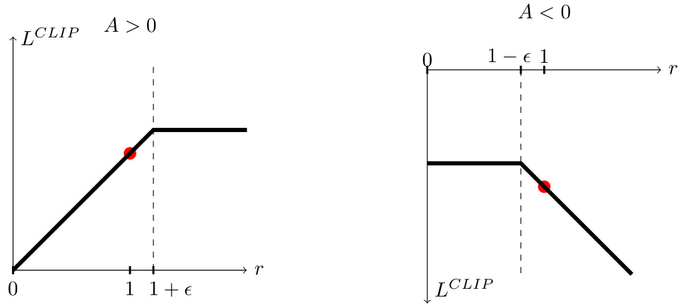  
Figure 1: Plots showing one term (i.e., a single timestep) of the surrogate function    $L^{C L I P}$    as a function of the probability ratio    $r$  , for positive advantages (left) and negative advantages (right). The red circle on each plot shows the starting point for the optimization, i.e.,    $r=1$  . Note that    $L^{C L I P}$    sums many of these terms.  

Figure  2  provides another source of intuition about the surrogate objective    $L^{C L I P}$  . It shows how several objectives vary as we interpolate along the policy update direction, obtained by proximal policy optimization (the algorithm we will introduce shortly) on a continuous control problem. We can see that    $L^{C L I P}$    is a lower bound on    $L^{C P I}$  , with a penalty for having too large of a policy update.  

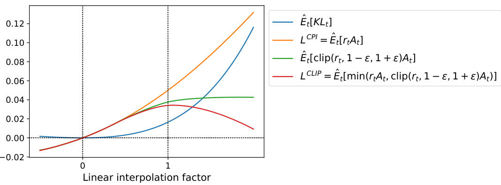  
Figure 2: Surrogate objectives, as we interpolate between the initial policy parameter    $\theta_{\mathrm{old}}$  , and the updated policy parameter, which we compute after one iteration of PPO. The updated policy has a KL divergence of about 0 . 02 from the initial policy, and this is the point at which    $L^{C L I P}$    is maximal. This plot corresponds to the first policy update on the Hopper-v1 problem, using hyperparameters provided in Section  6.1 .  

# 4 Adaptive KL Penalty Coefficient  

Another approach, which can be used as an alternative to the clipped surrogate objective, or in addition to it, is to use a penalty on KL divergence, and to adapt the penalty coefficient so that we achieve some target value of the KL divergence    $d_{\mathrm{targ}}$   each policy update. In our experiments, we found that the KL penalty performed worse than the clipped surrogate objective, however, we’ve included it here because it’s an important baseline.  

In the simplest instantiation of this algorithm, we perform the following steps in each policy update:  

•  Using several epochs of minibatch SGD, optimize the KL-penalized objective  

$$
L^{K L P E N}(\theta)=\hat{\mathbb{E}}_{t}\bigg[\frac{\pi_{\theta}(a_{t}\mid s_{t})}{\pi_{\theta_{\mathrm{old}}}(a_{t}\mid s_{t})}\hat{A}_{t}-\beta\,\mathrm{KL}\big[\pi_{\theta_{\mathrm{old}}}(\cdot\mid s_{t}),\pi_{\theta}(\cdot\mid s_{t})\big]\bigg]
$$  

•  Compute    $d=\hat{\mathbb{E}}_{t}[\mathrm{KL}[\pi_{\theta_{\mathrm{old}}}(\cdot\mid s_{t}),\pi_{\theta}(\cdot\mid s_{t})]]$  · | · |  

$$
\begin{array}{l}{-\mathrm{~If~}d<d_{\mathrm{targ}}/1.5,\,\beta\gets\beta/2}\\ {-\mathrm{~If~}d>d_{\mathrm{targ}}\times1.5,\,\beta\gets\beta\times2}\end{array}
$$  

The updated    $\beta$   is used for the next policy update. With this scheme, we occasionally see policy updates where the KL divergence is significantly different from    $d_{\mathrm{targ}}$  , however, these are rare, and  $\beta$   quickly adjusts. The parameters 1 . 5 and 2 above are chosen heuristically, but the algorithm is not very sensitive to them. The initial value of    $\beta$   is a another hyperparameter but is not important in practice because the algorithm quickly adjusts it.  

# 5 Algorithm  

The surrogate losses from the previous sections can be computed and differentiated with a minor change to a typical policy gradient implementation. For implementations that use automatic dif- ferentation, one simply constructs the loss    $L^{C L I P}$    or    $L^{K L P E N}$    instead of    $L^{P G}$  , and one performs multiple steps of stochastic gradient ascent on this objective.  

Most techniques for computing variance-reduced advantage-function estimators make use a learned state-value function    $V(s)$  ; for example, generalized advantage estimation [Sch+15a], or the finite-horizon estimators in [Mni+16]. If using a neural network architecture that shares parameters between the policy and value function, we must use a loss function that combines the policy surrogate and a value function error term. This objective can further be augmented by adding an entropy bonus to ensure sufficient exploration, as suggested in past work [Wil92; Mni+16]. Combining these terms, we obtain the following objective, which is (approximately) maximized each iteration:  

$$
L_{t}^{C L I P+V F+S}(\theta)=\hat{\mathbb{E}}_{t}\big[L_{t}^{C L I P}(\theta)-c_{1}L_{t}^{V F}(\theta)+c_{2}S[\pi_{\theta}](s_{t})\big],
$$  

where    are coefficients, and    $S$   denotes an entropy bonus, and    $L_{t}^{V F}$  is a squared-error loss  $c_{1},c_{2}$   $(V_{\theta}(s_{t})-V_{t}^{\mathrm{targ}})^{2}$  .  

One style of policy gradient implementation, popularized in [Mni+16] and well-suited for use with recurrent neural networks, runs the policy for    $T$   timesteps (where    $T$   is much less than the episode length), and uses the collected samples for an update. This style requires an advantage estimator that does not look beyond timestep    $T$  . The estimator used by [Mni+16] is  

$$
\hat{A}_{t}=-V(s_{t})+r_{t}+\gamma r_{t+1}+\cdot\cdot\cdot+\gamma^{T-t+1}r_{T-1}+\gamma^{T-t}V(s_{T})
$$  

where    $t$   specifies the time index in   $[0,T]$  , within a given length-  $T$   trajectory segment. Generalizing this choice, we can use a truncated version of generalized advantage estimation, which reduces to Equation ( 10 ) when    $\lambda=1$  :  

$$
\begin{array}{r l}&{\hat{A}_{t}=\delta_{t}+(\gamma\lambda)\delta_{t+1}+\cdot\cdot\cdot+\cdot\cdot+(\gamma\lambda)^{T-t+1}\delta_{T-1},}\\ &{\mathrm{where}\quad\delta_{t}=r_{t}+\gamma V\big(s_{t+1}\big)-V\big(s_{t}\big)}\end{array}
$$  

A proximal policy optimization (PPO) algorithm that uses fixed-length trajectory segments is shown below. Each iteration, each of    $N$   (parallel) actors collect    $T$   timesteps of data. Then we construct the surrogate loss on these    $N T$   timesteps of data, and optimize it with minibatch SGD (or usually for better performance, Adam [KB14]), for    $K$   epochs.  

# Algorithm 1  PPO, Actor-Critic Style  

for  iteration=  $1,2,\ldots$  .  do for  actor  $\mathbf{\lambda=}1,2,\ldots,N$   do Run policy    in environment for    $T$   timesteps  $\gamma_{\parallel}\theta_{\mathrm{old}}$  Compute advantage estimates   $\hat{A}_{1},\dots,\hat{A}_{T}$  end for Optimize surrogate    $L$   wrt    $\theta$  , with    $K$   epochs and minibatch size    $M\leq N T'$   $\theta_{\mathrm{old}}\leftarrow\theta$  

# end for  

# 6 Experiments  

# 6.1 Comparison of Surrogate Objectives  

First, we compare several different surrogate objectives under different hyperparameters. Here, we compare the surrogate objective    $L^{C L I P}$    to several natural variations and ablated versions.  

No clipping or penalty:  $\begin{array}{r l}&{L_{t}(\theta)=r_{t}(\theta)\hat{A}_{t}}\\ &{L_{t}(\theta)=\operatorname*{min}(r_{t}(\theta)\hat{A}_{t},\mathrm{clip}(r_{t}(\theta)),1-\epsilon,1+\epsilon)\hat{A}_{t}}\\ &{L_{t}(\theta)=r_{t}(\theta)\hat{A}_{t}-\beta\operatorname{KL}[\pi_{\theta_{\mathrm{old}}},\pi_{\theta}]}\end{array}$  Clipping: KL penalty (fixed or adaptive)  

For the KL penalty, one can either use a fixed penalty coefficient    $\beta$   or an adaptive coefficient as described in Section  4  using target KL value    $d_{\mathrm{targ}}$  . Note that we also tried clipping in log space, but found the performance to be no better.  

Because we are searching over hyperparameters for each algorithm variant, we chose a compu- 2 tationally cheap benchmark to test the algorithms on. Namely, we used 7 simulated robotics tasks implemented in OpenAI Gym [Bro+16], which use the MuJoCo [TET12] physics engine. We do one million timesteps of training on each one. Besides the hyperparameters used for clipping ( ϵ ) and the KL penalty   $(\beta,d_{\mathrm{targ}})$  , which we search over, the other hyperparameters are provided in in Table  3 .  

To represent the policy, we used a fully-connected MLP with two hidden layers of 64 units, and tanh nonlinearities, outputting the mean of a Gaussian distribution, with variable standard deviations, following [Sch+15b; Dua+16]. We don’t share parameters between the policy and value function (so coefficient    $c_{1}$   is irrelevant), and we don’t use an entropy bonus.  

Each algorithm was run on all 7 environments, with 3 random seeds on each. We scored each run of the algorithm by computing the average total reward of the last 100 episodes. We shifted and scaled the scores for each environment so that the random policy gave a score of 0 and the best result was set to 1, and averaged over 21 runs to produce a single scalar for each algorithm setting.  

The results are shown in Table  1 . Note that the score is negative for the setting without clipping or penalties, because for one environment (half cheetah) it leads to a very negative score, which is worse than the initial random policy.  

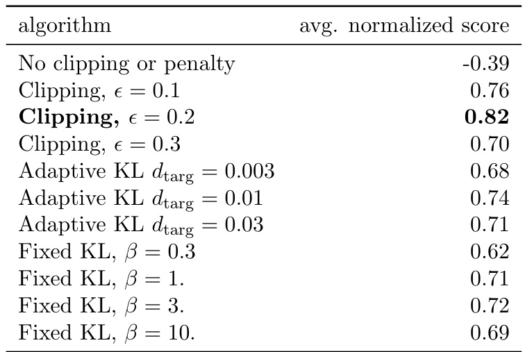  
Table 1: Results from continuous control benchmark. Average normalized scores (over 21 runs of the algorithm, on 7 environments) for each algorithm / hyperparameter setting .    $\beta$   was initialized at 1.  

# 6.2 Comparison to Other Algorithms in the Continuous Domain  

Next, we compare PPO (with the “clipped” surrogate objective from Section  3 ) to several other methods from the literature, which are considered to be effective for continuous problems. We com- pared against tuned implementations of the following algorithms: trust region policy optimization 3 [Sch+15b], cross-entropy method (CEM) [SL06], vanilla policy gradient with adaptive stepsize , A2C [Mni+16], A2C with trust region [Wan+16]. A2C stands for advantage actor critic, and is a synchronous version of A3C, which we found to have the same or better performance than the asynchronous version. For PPO, we used the hyperparameters from the previous section, with  $\epsilon=0.2$  . We see that PPO outperforms the previous methods on almost all the continuous control environments.  

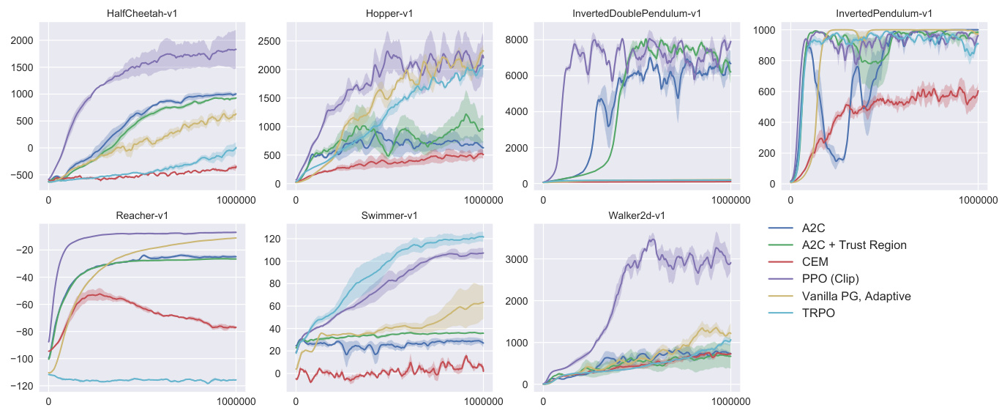  
Figure 3: Comparison of several algorithms on several MuJoCo environments, training for one million timesteps.  

# 6.3 Showcase in the Continuous Domain: Humanoid Running and Steering  

To showcase the performance of PPO on high-dimensional continuous control problems, we train on a set of problems involving a 3D humanoid, where the robot must run, steer, and get up offthe ground, possibly while being pelted by cubes. The three tasks we test on are (1) Ro- bo school Humanoid: forward locomotion only, (2) Rob o school Humanoid Flag run: position of target is randomly varied every 200 timesteps or whenever the goal is reached, (3) Rob o school Humanoid- FlagrunHarder, where the robot is pelted by cubes and needs to get up offthe ground. See Figure  5 for still frames of a learned policy, and Figure  4  for learning curves on the three tasks. Hyperpa- rameters are provided in Table  4 . In concurrent work, Heess et al. [Hee+17] used the adaptive KL variant of PPO (Section  4 ) to learn locomotion policies for 3D robots.  

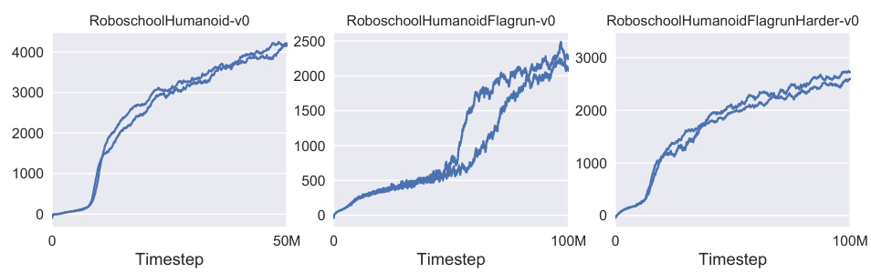  
Figure 4: Learning curves from PPO on 3D humanoid control tasks, using Roboschool.  

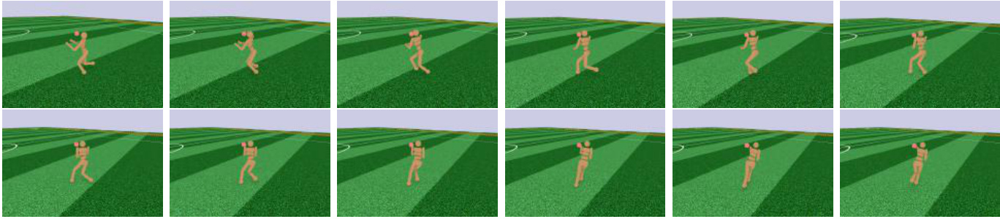  
Figure 5: Still frames of the policy learned from Rob o school Humanoid Flag run. In the first six frames, the robot runs towards a target. Then the position is randomly changed, and the robot turns and runs toward the new target.  

# 6.4 Comparison to Other Algorithms on the Atari Domain  

We also ran PPO on the Arcade Learning Environment [Bel+15] benchmark and compared against well-tuned implementations of A2C [Mni+16] and ACER [Wan+16]. For all three algorithms, we used the same policy network architechture as used in [Mni+16]. The hyperparameters for PPO are provided in Table  5 . For the other two algorithms, we used hyperparameters that were tuned to maximize performance on this benchmark.  

A table of results and learning curves for all 49 games is provided in Appendix  B . We consider the following two scoring metrics: (1)  average reward per episode over entire training period  (which favors fast learning), and (2)  average reward per episode over last 100 episodes of training  (which favors final performance). Table  2  shows the number of games “won” by each algorithm, where we compute the victor by averaging the scoring metric across three trials.  

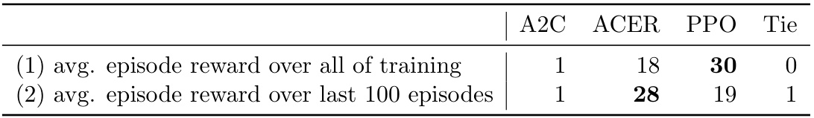  

# 7 Conclusion  

We have introduced proximal policy optimization, a family of policy optimization methods that use multiple epochs of stochastic gradient ascent to perform each policy update. These methods have the stability and reliability of trust-region methods but are much simpler to implement, requiring only few lines of code change to a vanilla policy gradient implementation, applicable in more general settings (for example, when using a joint architecture for the policy and value function), and have better overall performance.  

# 8 Acknowledgements  

Thanks to Rocky Duan, Peter Chen, and others at OpenAI for insightful comments.  

# References  

[Bel+15] M. Bellemare, Y. Naddaf, J. Veness, and M. Bowling. “The arcade learning environ- ment: An evaluation platform for general agents”. In:  Twenty-Fourth International Joint Conference on Artificial Intelligence . 2015.

 [Bro+16] G. Brockman, V. Cheung, L. Pettersson, J. Schneider, J. Schulman, J. Tang, and W. Zaremba. “OpenAI Gym”. In:  arXiv preprint arXiv:1606.01540  (2016).

 [Dua+16] Y. Duan, X. Chen, R. Houthooft, J. Schulman, and P. Abbeel. “Benchmarking Deep Reinforcement Learning for Continuous Control”. In:  arXiv preprint arXiv:1604.06778 (2016).

 [Hee+17] N. Heess, S. Sriram, J. Lemmon, J. Merel, G. Wayne, Y. Tassa, T. Erez, Z. Wang, A. Eslami, M. Riedmiller, et al. “Emergence of Locomotion Behaviours in Rich Envi- ronments”. In:  arXiv preprint arXiv:1707.02286  (2017).

 [KL02] S. Kakade and J. Langford. “Approximately optimal approximate reinforcement learn- ing”. In:  ICML . Vol. 2. 2002, pp. 267–274.

 [KB14] D. Kingma and J. Ba. “Adam: A method for stochastic optimization”. In:  arXiv preprint arXiv:1412.6980  (2014).

 [Mni+15] V. Mnih, K. Kavukcuoglu, D. Silver, A. A. Rusu, J. Veness, M. G. Bellemare, A. Graves, M. Riedmiller, A. K. Fidjeland, G. Ostrovski, et al. “Human-level control through deep reinforcement learning”. In:  Nature  518.7540 (2015), pp. 529–533.

 [Mni+16] V. Mnih, A. P. Badia, M. Mirza, A. Graves, T. P. Lillicrap, T. Harley, D. Silver, and K. Kavukcuoglu. “Asynchronous methods for deep reinforcement learning”. In:  arXiv preprint arXiv:1602.01783  (2016).

 [Sch+15a] J. Schulman, P. Moritz, S. Levine, M. Jordan, and P. Abbeel. “High-dimensional contin- uous control using generalized advantage estimation”. In:  arXiv preprint arXiv:1506.02438 (2015).

 [Sch+15b] J. Schulman, S. Levine, P. Moritz, M. I. Jordan, and P. Abbeel. “Trust region policy optimization”. In:  CoRR, abs/1502.05477  (2015).

 [SL06] I. Szita and A. L¨ orincz. “Learning Tetris using the noisy cross-entropy method”. In: Neural computation  18.12 (2006), pp. 2936–2941.

 [TET12] E. Todorov, T. Erez, and Y. Tassa. “MuJoCo: A physics engine for model-based con- trol”. In:  Intelligent Robots and Systems (IROS), 2012 IEEE/RSJ International Con- ference on . IEEE. 2012, pp. 5026–5033.

 [Wan+16] Z. Wang, V. Bapst, N. Heess, V. Mnih, R. Munos, K. Kavukcuoglu, and N. de Freitas. “Sample Efficient Actor-Critic with Experience Replay”. In:  arXiv preprint arXiv:1611.01224 (2016).

 [Wil92] R. J. Williams. “Simple statistical gradient-following algorithms for connectionist re- inforcement learning”. In:  Machine learning  8.3-4 (1992), pp. 229–256.  

# A Hyperparameters  

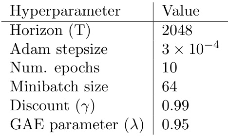  

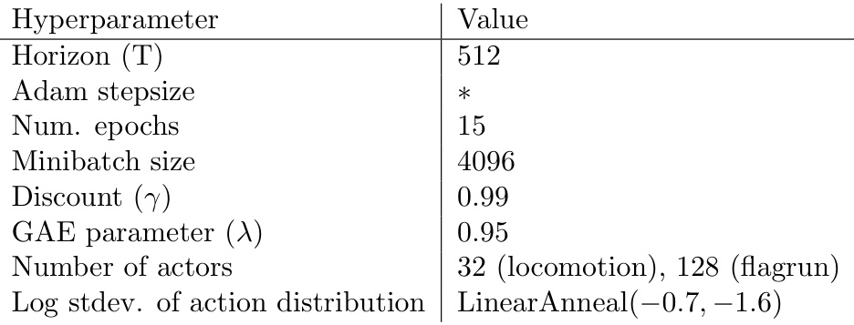  

Table 4: PPO hyperparameters used for the Roboschool experiments. Adam stepsize was adjusted based on the target value of the KL divergence.  

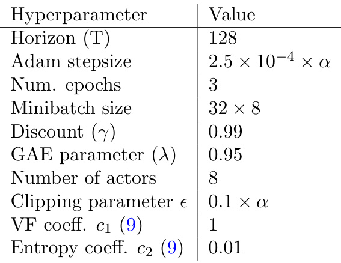  

Table 5: PPO hyperparameters used in Atari experiments.    $\alpha$   is linearly annealed from 1 to 0 over the course of learning.  

# B Performance on More Atari Games  

Here we include a comparison of PPO against A2C on a larger collection of 49 Atari games. Figure  6 shows the learning curves of each of three random seeds, while Table  6  shows the mean performance.  

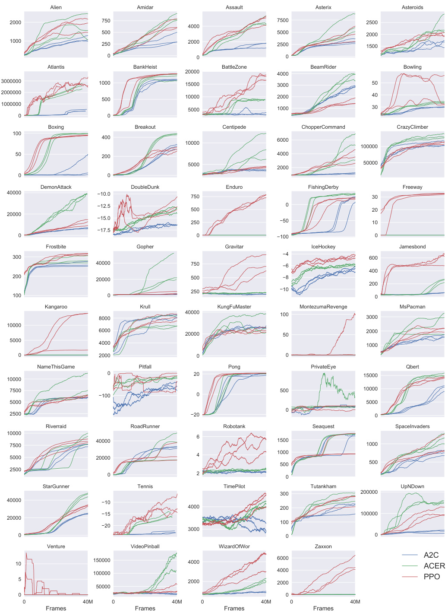  

Figure 6: Comparison of PPO and A2C on all 49 ATARI games included in OpenAI Gym at the time of publication.  

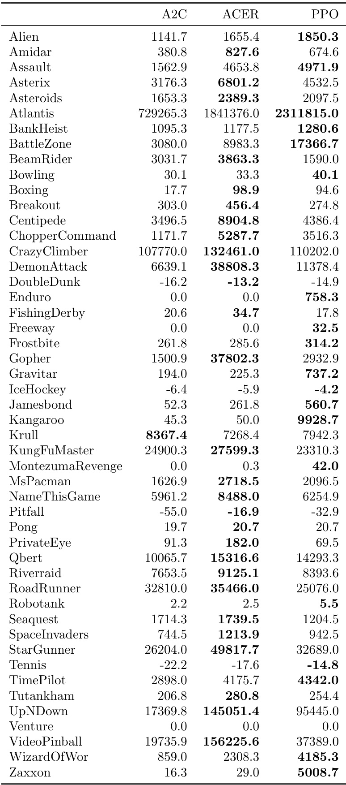  