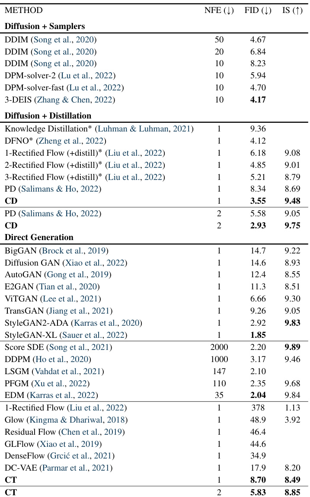
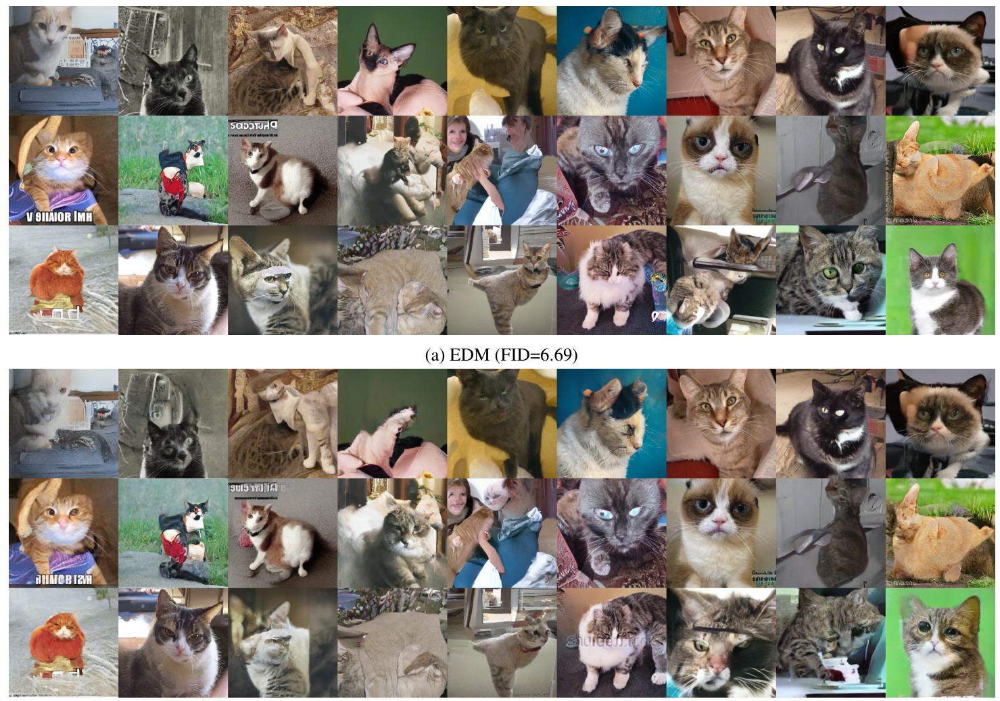

# Consistency Models  

# Yang Song   1   Prafulla Dhariwal   1   Mark Chen   1   Ilya Sutskever  

# Abstract  

Diffusion models have significantly advanced the fields of image, audio, and video generation, but they depend on an iterative sampling process that causes slow generation. To overcome this limita- tion, we propose  consistency models , a new fam- ily of models that generate high quality samples by directly mapping noise to data. They support fast one-step generation by design, while still al- lowing multistep sampling to trade compute for sample quality. They also support zero-shot data editing, such as image inpainting, colorization, and super-resolution, without requiring explicit training on these tasks. Consistency models can be trained either by distilling pre-trained diffu- sion models, or as standalone generative models altogether. Through extensive experiments, we demonstrate that they outperform existing distilla- tion techniques for diffusion models in one- and few-step sampling, achieving the new state-of- the-art FID of 3.55 on CIFAR-10 and 6.20 on ImageNet  $64\times64$   for one-step generation. When trained in isolation, consistency models become a new family of generative models that can outper- form existing one-step, non-adversarial generative models on standard benchmarks such as CIFAR- 10, ImageNet  $64\times64$   and LSUN  $256\times256$  .  

# 1. Introduction  

Diffusion models ( Sohl-Dickstein et al. ,  2015 ;  Song & Er- mon ,  2019 ;  2020 ;  Ho et al. ,  2020 ;  Song et al. ,  2021 ), also known as score-based generative models, have achieved unprecedented success across multiple fields, including im- age generation ( Dhariwal & Nichol ,  2021 ;  Nichol et al. , 2021 ;  Ramesh et al. ,  2022 ;  Saharia et al. ,  2022 ;  Rombach et al. ,  2022 ), audio synthesis ( Kong et al. ,  2020 ;  Chen et al. , 2021 ;  Popov et al. ,  2021 ), and video generation ( Ho et al. ,  

  

Figure 1: Given a  Probability Flow (PF) ODE  that smoothly converts data to noise, we learn to map any point ( e.g .,  $\mathbf{x}_{t}$  ,  $\mathbf{x}_{t^{\prime}}$  , and  $\mathbf{x}_{T}$  ) on the ODE trajectory to its origin   $(e.g.,\mathbf{x}_{0})$  for generative modeling. Models of these mappings are called  consistency models , as their outputs are trained to be consistent for points on the same trajectory.  

2022b ; a ). A key feature of diffusion models is the iterative sampling process which progressively removes noise from random initial vectors. This iterative process provides a flexible trade-off of compute and sample quality, as using extra compute for more iterations usually yields samples of better quality. It is also the crux of many zero-shot data editing capabilities of diffusion models, enabling them to solve challenging inverse problems ranging from image inpainting, colorization, stroke-guided image editing, to Computed Tomography and Magnetic Resonance Imaging ( Song & Ermon ,  2019 ;  Song et al. ,  2021 ;  2022 ;  2023 ;  Kawar et al. ,  2021 ;  2022 ;  Chung et al. ,  2023 ;  Meng et al. ,  2021 ). However, compared to single-step generative models like GANs ( Goodfellow et al. ,  2014 ), VAEs ( Kingma & Welling , 2014 ;  Rezende et al. ,  2014 ), or normalizing flows ( Dinh et al. ,  2015 ;  2017 ;  Kingma & Dhariwal ,  2018 ), the iterative generation procedure of diffusion models typically requires 10–2000 times more compute for sample generation ( Song

 & Ermon ,  2020 ;  Ho et al. ,  2020 ;  Song et al. ,  2021 ;  Zhang

 & Chen ,  2022 ;  Lu et al. ,  2022 ), causing slow inference and limited real-time applications.  

Our objective is to create generative models that facilitate ef- ficient, single-step generation without sacrificing important advantages of iterative sampling, such as trading compute for sample quality when necessary, as well as performing zero-shot data editing tasks. As illustrated in Fig.  1 , we build on top of the probability flow (PF) ordinary differen- tial equation (ODE) in continuous-time diffusion models ( Song et al. ,  2021 ), whose trajectories smoothly transition the data distribution into a tractable noise distribution. We propose to learn a model that maps any point at any time step to the trajectory’s starting point. A notable property of our model is self-consistency:  points on the same tra- jectory map to the same initial point . We therefore refer to such models as  consistency models . Consistency models allow us to generate data samples (initial points of ODE trajectories,  e.g .,  $\mathbf{x}_{\mathrm{0}}$   in Fig.  1 ) by converting random noise vectors (endpoints of ODE trajectories,  e.g .,    $\mathbf{x}_{T}$   in Fig.  1 ) with only one network evaluation. Importantly, by chaining the outputs of consistency models at multiple time steps, we can improve sample quality and perform zero-shot data editing at the cost of more compute, similar to what iterative sampling enables for diffusion models.  

To train a consistency model, we offer two methods based on enforcing the self-consistency property. The first method relies on using numerical ODE solvers and a pre-trained diffusion model to generate pairs of adjacent points on a PF ODE trajectory. By minimizing the difference between model outputs for these pairs, we can effectively distill a diffusion model into a consistency model, which allows gen- erating high-quality samples with one network evaluation. By contrast, our second method eliminates the need for a pre-trained diffusion model altogether, allowing us to train a consistency model in isolation. This approach situates consistency models as an independent family of generative models. Importantly, neither approach necessitates adver- sarial training, and they both place minor constraints on the architecture, allowing the use of flexible neural networks for parameterizing consistency models.  

We demonstrate the efficacy of consistency models on sev- eral image datasets, including CIFAR-10 ( Krizhevsky et al. , ageNet  $64\times64$   ( Deng et al. ,  2009 ), and LSUN  $256\times256$   ˆ  ( Yu et al. ,  2015 ). Empirically, we observe that as a distillation approach, consistency models outperform existing diffusion distillation methods like progressive dis- tillation ( Salimans & Ho ,  2022 ) across a variety of datasets in few-step generation: On CIFAR-10, consistency models reach new state-of-the-art FIDs of 3.55 and 2.93 for one-step and two-step generation; on ImageNet  $64\times64$  , it achieves record-breaking FIDs of 6.20 and 4.70 with one and two net- work evaluations respectively. When trained as standalone generative models, consistency models can match or surpass the quality of one-step samples from progressive distillation, despite having no access to pre-trained diffusion models. They are also able to outperform many GANs, and exist- ing non-adversarial, single-step generative models across multiple datasets. Furthermore, we show that consistency models can be used to perform a wide range of zero-shot data editing tasks, including image denoising, interpolation, inpainting, colorization, super-resolution, and stroke-guided image editing (SDEdit,  Meng et al.  ( 2021 )).  

# 2. Diffusion Models  

Consistency models are heavily inspired by the theory of continuous-time diffusion models ( Song et al. ,  2021 ;  Karras et al. ,  2022 ). Diffusion models generate data by progres- sively perturbing data to noise via Gaussian perturbations, then creating samples from noise via sequential denoising steps. Let  $p_{\mathrm{data}}(\mathbf{x})$   denote the data distribution. Diffusion models start by diffusing  $p_{\mathrm{data}}(\mathbf{x})$   with a stochastic differen- tial equation (SDE) ( Song et al. ,  2021 )  

$$
\begin{array}{r}{\mathrm{d}\mathbf{x}_{t}=\pmb{\mu}(\mathbf{x}_{t},t)\,\mathrm{d}t+\sigma(t)\,\mathrm{d}\mathbf{w}_{t},}\end{array}
$$  

re    $t\,\in\,[0,T]$  ,  $T\,>\,0$   is a fixed constant,    $\pmb{\mu}(\cdot,\cdot)$   and  $\sigma(\cdot)$  p¨q  are the drift and diffusion coefficients respectively, and    $\{\mathbf{w}_{t}\}_{t\in[0,T]}$   denotes the  nda ownian motion. We denote the distribution of  $\mathbf{x}_{t}$   as  $p_{t}(\mathbf{x})$  p q  and as a result  $p_{0}(\mathbf{x})\,\equiv\,p_{\mathrm{data}}(\mathbf{x})$  . A remarkable property of this SDE is the existence of an ordinary differential equation (ODE), dubbed the  Probability Flow   $(P F)~O D E$   by  Song et al. ( 2021 ), whose solution trajectories sampled at    $t$   are dis- tributed according to  $p_{t}(\mathbf{x})$  :  

$$
\mathrm{d}\mathbf{x}_{t}=\left[\mu(\mathbf{x}_{t},t)-\frac{1}{2}\sigma(t)^{2}\nabla\log p_{t}(\mathbf{x}_{t})\right]\mathrm{d}t.
$$  

Here    $\nabla\log p_{t}(\mathbf{x})$   is the  score function  of  $p_{t}(\mathbf{x})$  ; hence dif- fusion models are also known as  score-based generative models  ( Song & Ermon ,  2019 ;  2020 ;  Song et al. ,  2021 ).  

Typically, the SDE in Eq. ( 1 ) is designed such  $p_{T}(\mathbf{x})$  is close to a tractable Gaussian distribution  $\pi(\mathbf{x})$  p q . We hereafter adopt the settings in  Karras et al.  ( 2022 ), where  $\mu(\mathbf{x},t)\ =\ \mathbf{0}$   and    $\sigma(t){\begin{array}{l}{{\bar{=}}}\end{array}}{\sqrt{2t}}$  ? . In this case, we have  $p_{t}(\mathbf{x})=p_{\mathrm{data}}(\mathbf{x})\otimes\mathcal{N}(\mathbf{0},t^{2}I)$  , where  $\otimes$   denotes the convo- lution operation, and  $\boldsymbol\pi({\bf x})=\mathcal{N}({\bf0},T^{2}I)$  . For sampling, we first train a  score model    $\begin{array}{r}{s_{\phi}(\mathbf{x},t)\approx\nabla\log p_{t}(\mathbf{x})}\end{array}$   via  score matching  ( Hyv arinen & Dayan ,  2005 ;  Vincent ,  2011 ;  Song et al. ,  2019 ;  Song   $\&$   Ermon ,  2019 ;  Ho et al. ,  2020 ), then plug it into Eq. ( 2 ) to obtain an empirical estimate of the PF ODE, which takes the form of  

$$
\frac{\mathrm{d}\mathbf{x}_{t}}{\mathrm{d}t}=-t\pmb{s}_{\phi}(\mathbf{x}_{t},t).
$$  

We call Eq. ( 3 ) the  empirical PF ODE . Next, we sample  $\hat{\mathbf{x}}_{T}\sim\pi=\mathcal{N}(\mathbf{0},T^{2}I)$   „  “  N p q  to initialize the empirical PF ODE and solve it backwards in time with any numerical ODE solver, such as Euler ( Song et al. ,  2020 ;  2021 ) and Heun solvers ( Karras et al. ,  2022 ), to obtain the solution trajectory  $\{\hat{\mathbf{x}}_{t}\}_{t\in[0,T]}$  . The resulting  $\hat{\mathbf{x}}_{0}$   can then be viewed as an Pr  s approximate sample from the data distribution  $p_{\mathrm{data}}(\mathbf{x})$  . To avoid numerical instability, one typically stops the solver at    $t~=~\epsilon$  where    $\epsilon$   is a fixed small positive number, and accepts  $\hat{\mathbf{x}}_{\epsilon}$   as the approximate sample. Following  Karras et a le image pixel values to    $[-1,1]$  , and set  $T=80,\epsilon=0.002$  .  

  

Figure 2:  Consistency models  are trained to map points on any trajectory of the  PF ODE  to the trajectory’s origin.  

Diffusion models are bottlenecked by their slow sampling speed. Clearly, using ODE solvers for sampling requires iterative evaluations of the score model    $\boldsymbol{s}_{\phi}(\mathbf{x},t)$  , which is computationally costly. Existing methods for fast sampling include faster numerical ODE solvers ( Song et al. ,  2020 ; Zhang & Chen ,  2022 ;  Lu et al. ,  2022 ;  Dockhorn et al. ,  2022 ), and distillation techniques ( Luhman & Luhman ,  2021 ;  Sali- mans & Ho ,  2022 ;  Meng et al. ,  2022 ;  Zheng et al. ,  2022 ). However, ODE solvers still need more than 10 evaluation steps to generate competitive samples. Most distillation methods like  Luhman & Luhman  ( 2021 ) and  Zheng et al. ( 2022 ) rely on collecting a large dataset of samples from the diffusion model prior to distillation, which itself is com- putationally expensive. To our best knowledge, the only distillation approach that does not suffer from this drawback is progressive distillation (PD,  Salimans & Ho  ( 2022 )), with which we compare consistency models extensively in our experiments.  

# 3. Consistency Models  

We propose consistency models, a new type of models that support single-step generation at the core of its design, while still allowing iterative generation for trade-offs between sam- ple quality and compute, and zero-shot data editing. Consis- tency models can be trained in either the distillation mode or the isolation mode. In the former case, consistency models distill the knowledge of pre-trained diffusion models into a single-step sampler, significantly improving other distilla- tion approaches in sample quality, while allowing zero-shot image editing applications. In the latter case, consistency models are trained in isolation, with no dependence on pre- trained diffusion models. This makes them an independent new class of generative models.  

Below we introduce the definition, parameter iz ation, and sampling of consistency models, plus a brief discussion on their applications to zero-shot data editing.  

Definition  Given a solution trajectory    $\{\mathbf{x}_{t}\}_{t\in[\epsilon,T]}$   of the PF ODE in Eq. ( 2 ), we define the  consistency function  as  $f:(\mathbf{x}_{t},t)\mapsto\mathbf{x}_{\epsilon}$  . A consistency function has the property of  self-consistency : its outputs are consistent for arbitrary pairs of    $\left({{\bf{x}}_{t}},t\right)$   that belong to the same PF ODE trajectory, i.e .,    $\pmb{f}(\mathbf{x}_{t},t)=\pmb{f}(\mathbf{x}_{t^{\prime}},t^{\prime})$   for all  $t,t^{\prime}\in[\epsilon,T]$  . As illustrated in Fig.  2 , the goal of a  consistency model , symbolized as  $f_{\theta}$  , is to estimate this consistency function    $\pmb{f}$   from data by learning to enforce the self-consistency property (details in Sections  4  and  5 ). Note that a similar definition is used for neural flows ( Bilo s et al. ,  2021 ) in the context of neural ODEs ( Chen et al. ,  2018 ). Compared to neural flows, how- ever, we do not enforce consistency models to be invertible.  

Para For a sistency function    $\pmb{f}(\cdot,\cdot)$  , we have  $f(\mathbf{x}_{\epsilon},\epsilon)=\mathbf{x}_{\epsilon}$  p q “ ,  i.e .,  $f(\cdot,\epsilon)$  p¨ q  is an identity function. We call this constraint the  boundary condition . All consistency models have to meet this boundary condition, as it plays a crucial role in the successful training of consistency models. This boundary condition is also the most confining archi- tectural constraint on consistency models. For consistency models based on deep neural networks, we discuss two ways to implement this boundary condition  almost for free Suppose we have a free-form deep neural netw k    $F_{\boldsymbol{\theta}}(\mathbf{x},t)$  whose output has the same dimensionality as  x . The first way is to simply parameterize the consistency model as  

$$
\begin{array}{r}{f_{\theta}(\mathbf{x},t)=\left\{\begin{array}{l l}{\mathbf{x}\quad}&{t=\epsilon}\\ {F_{\theta}(\mathbf{x},t)\quad}&{t\in(\epsilon,T]}\end{array}\right..}\end{array}
$$  

The second method is to parameterize the consistency model using skip connections, that is,  

$$
\pmb{f}_{\pmb{\theta}}(\mathbf{x},t)=c_{\mathrm{skin}}(t)\mathbf{x}+c_{\mathrm{out}}(t)F_{\pmb{\theta}}(\mathbf{x},t),
$$  

where    $c_{\mathrm{skin}}(t)$   and    $c_{\mathrm{out}}(t)$   are differentiable functions such that    $c_{\mathrm{skin}}(\epsilon)~=~1$  , and    $c_{\mathrm{out}}(\epsilon)~=~0$  . This way, the consistency model is differentiable at    $t\quad=\quad\epsilon$  “  if  $F_{\theta}(\mathbf{x},t),c_{\mathrm{skin}}(t),c_{\mathrm{out}}(t)$   are all differentiable, which is criti- cal for training continuous-time consistency models (Appen- dices  B.1  and  B.2 ). The parameter iz ation in Eq. ( 5 ) bears strong resemblance to many successful diffusion models ( Karras et al. ,  2022 ;  Balaji et al. ,  2022 ), making it easier to borrow powerful diffusion model architectures for construct- ing consistency models. We therefore follow the second parameter iz ation in all experiments.  

Sampling  With a well-trained consistency model    $f_{\theta}(\cdot,\cdot)$  , we can generate samples by sampling from the initial dis- tribution  $\hat{\mathbf{x}}_{T}\sim\mathcal{N}(\mathbf{0},T^{2}I)$   „   en evaluating the consis- tency model for  $\hat{\mathbf{x}}_{\epsilon}\,=\,f_{\theta}(\hat{\mathbf{x}}_{T},T)$   “ p q . This involves only one forward pass through the consistency model and therefore generates samples in a single step . Importantly, one can also evaluate the consistency model multiple times by al- ternating denoising and noise injection steps for improved sample quality. Summarized in Algorithm  1 , this  multistep sampling procedure provides the flexibility to trade com- pute for sample quality. It also has important applications in zero-shot data editing. In practice, we find time points  

# Algorithm 1  Multistep Consistency Sampling  

Input:  Consistency model    $f_{\theta}(\cdot,\cdot)$  , sequence of time  $\tau_{1}>\tau_{2}>\dots>\tau_{N-1}$  , initial noise  $\hat{\mathbf{x}}_{T}$   $\mathbf{x}\gets f_{\theta}(\hat{\mathbf{x}}_{T},T)$    q for  $n=1$   “    $N-1$  Sample  $\mathbf{z}\sim\mathcal{N}(\mathbf{0},I)$   „ p q  $\hat{\mathbf{x}}_{\tau_{n}}\gets\mathbf{x}+\sqrt{\tau_{n}^{2}-\epsilon^{2}}\mathbf{z}$  a   ´  ${\bf x}\gets f_{\boldsymbol{\theta}}(\hat{\bf x}_{\tau_{n}},\tau_{n})$   Ð p q end for Output:  x  

$\left\{\tau_{1},\tau_{2},\cdot\cdot\cdot\mathbf{\tau},\tau_{N-1}\right\}$   in Algorithm  1  with a greedy algorithm, where the time points are pinpointed one at a time using ternary search to optimize the FID of samples obtained from Algorithm  1 . This assumes that given prior time points, the FID is a unimodal function of the next time point. We find this assumption to hold empirically in our experiments, and leave the exploration of better strategies as future work.  

Zero-Shot Data Editing  Similar to diffusion models, con- sistency models enable various data editing and manipu- lation applications in zero shot; they do not require ex- plicit training to perform these tasks. For example, consis- tency models define a one-to-one mapping from a Gaussian noise vector to a data sample. Similar to latent variable models like GANs, VAEs, and normalizing flows, consis- tency models can easily interpolate between samples by traversing the latent space (Fig.  11 ). As consistency models are trained to recover    $\mathbf{x}_{\epsilon}$   from any noisy input    $\mathbf{x}_{t}$   where  $t\,\in\,[\epsilon,T]$  , they can perform denoising for various noise levels (Fig.  12 ). Moreover, the multistep generation pro- cedure in Algorithm  1  is useful for solving certain inverse problems in zero shot by using an iterative replacement pro- cedure similar to that of diffusion models ( Song & Ermon , 2019 ;  Song et al. ,  2021 ;  Ho et al. ,  2022b ). This enables many applications in the context of image editing, including inpainting (Fig.  10 ), colorization (Fig.  8 ), super-resolution (Fig.  6b ) and stroke-guided image editing (Fig.  13 ) as in SDEdit ( Meng et al. ,  2021 ). In Section  6.3 , we empiri- cally demonstrate the power of consistency models on many zero-shot image editing tasks.  

# 4.  Training Consistency Models via Distillation  

We present our first method for training consistency mod- els based on distilling a pre-trained score model    $\boldsymbol{s}_{\phi}(\mathbf{x},t)$  Our discussion revolves around the empirical PF ODE in Eq. ( 3 ), obtained by plugging the score model    $\boldsymbol{s}_{\phi}(\mathbf{x},t)$  into the PF ODE. Consider discretizing the time horizon  $[\epsilon,T]$   $N-1$  tervals, with boundaries    $t_{1}=\epsilon<$   $t_{2}~<~\cdot\cdot\cdot~<~t_{N}~=~T$   ă ¨ ¨ ¨ ă  “ . In practice, we follow  Karras et al. ) to determine the boundaries with the formula  $t_{i}=(\epsilon^{1/\rho}+i\!-\!1\!/_{N-1}\!(T^{1/\rho}-\epsilon^{1/\rho}))^{\rho}$  , where    $\rho=7$  . When  $N$   is sufficiently large, we can obtain an accurate estimate of  $\mathbf{x}_{t_{n}}$   from  $\mathbf{x}_{t_{n+1}}$   by running one discretization step of a numerical ODE solver. This estimate, which we denote as  $\hat{\mathbf{x}}_{t_{n}}^{\phi}$  , is defined by  

$$
\begin{array}{r}{\hat{\mathbf{x}}_{t_{n}}^{\phi}:=\mathbf{x}_{t_{n+1}}+(t_{n}-t_{n+1})\Phi(\mathbf{x}_{t_{n+1}},t_{n+1};\phi),}\end{array}
$$  

where    $\Phi(\cdot\cdot\cdot;\phi)$   represents the update function of a one- step ODE solver applied to the empirical PF ODE. For example, when using the Euler solver, we have  $\Phi({\bf x},t;\phi)=$   $-t{\bf\nabla}s_{\phi}({\bf x},t)$   which corresponds to the following update rule  

$$
\begin{array}{r}{\hat{\mathbf{x}}_{t_{n}}^{\phi}=\mathbf{x}_{t_{n+1}}-(t_{n}-t_{n+1})t_{n+1}s_{\phi}(\mathbf{x}_{t_{n+1}},t_{n+1}).}\end{array}
$$  

For simplicity, we only consider one-step ODE solvers in this work. It is straightforward to generalize our framework to multistep ODE solvers and we leave it as future work.  

Due to the connection between the PF ODE in Eq. ( 2 ) and the SDE in Eq. ( 1 ) (see Section  2 ), one can sample along the distribution of ODE trajectories by first sampling  $\mathbf{x}\sim p_{\mathrm{data}}$  , then adding Gaussian noise to  x . Specifically, given a data point  $\mathbf{x}$  , we can generate a pair of adjacent data points  $\bar{(\hat{\mathbf{x}}_{t_{n}}^{\phi},\mathbf{x}_{t_{n+1}})}$   on the PF ODE trajectory efficiently by sam- \` pling  $\mathbf{x}$   from the dataset, followed by sampling  $\mathbf{x}_{t_{n+1}}$   from the transition density of the SDE    $\mathcal{N}(\mathbf{x},t_{n+1}^{2}I)$  \` q , and then computing  $\hat{\mathbf{x}}_{t_{n}}^{\phi}$    using one discretization step of the numeri- cal ODE solver according to Eq. ( 6 ). Afterwards, we train the consistency model by minimizing its output differences on the pair    $(\hat{\mathbf{x}}_{t_{n}}^{\dot{\phi}},\mathbf{x}_{t_{n+1}})$  \` . This motivates our following  con- sistency distillation  loss for training consistency models.  

Definition 1.  The consistency distillation loss is defined as  

$$
\begin{array}{r l}&{\mathcal{L}_{C D}^{N}(\pmb{\theta},\pmb{\theta}^{-};\phi):=}\\ &{\quad\quad\quad\quad\mathbb{E}[\lambda(t_{n})d(\pmb{f_{\theta}}(\mathbf{x}_{t_{n+1}},t_{n+1}),\pmb{f_{\theta^{-}}}(\hat{\mathbf{x}}_{t_{n}}^{\phi},t_{n}))],}\end{array}
$$  

where the expectation is taken with respect to  $\mathbf{x}\sim p_{d a t a},\,n\sim$   $\mathcal{U}[\![1,N-1]\!]$  , and  $\mathbf{x}_{t_{n+1}}\sim\mathcal{N}(\mathbf{x};t_{n+1}^{2}I)$  q  $\mathcal{U}[\![1,N-1]\!]$  \` denotes the uniform distribution over  t  $\{1,2,\cdot\cdot\cdot\,,N\,-\,1\},$   ¨ ¨ ¨  ´ u  $\lambda(\cdot)\in\mathbb{R}^{+}$  p¨q P is a positive weighting function,  $\hat{\mathbf{x}}_{t_{n}}^{\phi}$    is given by Eq.  ( 6 ) ,  $\pmb{\theta}^{-}$    denotes a running average of the past values of  $\pmb{\theta}$   during the course of optimization, and  $d(\cdot,\cdot)$   is a metric function th es  $\forall\mathbf{x},\mathbf{y}:d(\mathbf{x},\mathbf{y})\geqslant0$   and    $d(\mathbf{x},\mathbf{y})=0$  if and only if  $i f\mathbf{x}=\mathbf{y}$   “ .  

Unless otherwise stated, we adopt the notations in Defi- nition  1  throughout this paper, and use    $\mathbb{E}[\cdot]$   to denote the expectation over all random variables. In our experiments, we consider the squared  $\ell_{2}$   distance    $d(\mathbf{x},\mathbf{y})=\|\mathbf{x}-\mathbf{y}\|_{2}^{2},\,\ell$   $\ell_{1}$  distance  $d(\mathbf{x},\mathbf{y})=\|\mathbf{x}-\mathbf{y}\|_{1}$  , and the Learned Perceptual Image Patch Similarity (LPIPS,  Zhang et al.  ( 2018 )). We find    $\lambda(t_{n})\equiv1$   performs well across all tasks and datasets. In practice, we minimize the objective by stochastic gradient descent on the model parameters    $\pmb{\theta}$  , while updating    $\theta^{-}$    with exponential moving average (EMA). That is, given a decay  

#  Consistency Distillation (CD)  

Input:  dataset  $\mathcal{D}$   $\pmb{\theta}$  , learning rate  $\eta$  solver  $\Phi(\cdot,\cdot;\phi)$  p¨  ¨ q ,  $d(\cdot,\cdot),\lambda(\cdot)$  , and  $\mu$   $\pmb{\theta}^{-}\leftarrow\pmb{\theta}$    Ð repeat  $\mathbf x\sim\mathcal D$   $n\sim\mathcal{U}[1,N-1]$  Sample  $\mathbf{x}_{t_{n+1}}\sim\mathcal{N}(\mathbf{x};t_{n+1}^{2}I)$  \`  „  N p \` q  $\begin{array}{r l}&{\hat{\mathbf{x}}_{t_{n}}^{\phi}\leftarrow\mathbf{x}_{t_{n+1}}+(t_{n}-t_{n+1})\Phi(\mathbf{x}_{t_{n+1}},t_{n+1};\phi)}\\ &{\mathcal{L}(\pmb{\theta},\pmb{\theta}^{-};\phi)\leftarrow}\\ &{\quad\lambda(t_{n})d(\pmb{f_{\theta}}(\mathbf{x}_{t_{n+1}},t_{n+1}),\pmb{f_{\theta^{-}}}(\hat{\mathbf{x}}_{t_{n}}^{\phi},t_{n}))}\\ &{\pmb{\theta}\leftarrow\pmb{\theta}-\eta\nabla_{\pmb{\theta}}\mathcal{L}(\pmb{\theta},\pmb{\theta}^{-};\phi)}\\ &{\pmb{\theta}^{-}\leftarrow\mathrm{stopgrad}(\mu\pmb{\theta}^{-}+(1-\mu)\pmb{\theta})}\end{array}$  until  convergence  

rate  $0\leqslant\mu<1$  , we perform the following update after each optimization step:  

$$
\pmb\theta^{-}\leftarrow\mathrm{stored}(\mu\pmb\theta^{-}+(1-\mu)\pmb\theta).
$$  

The overall training procedure is summarized in Algo- rithm  2 . In alignment with the convention in deep reinforce- ment learning ( Mnih et al. ,  2013 ;  2015 ;  Lillicrap et al. ,  2015 ) and momentum based contrastive learning ( Grill et al. ,  2020 ; He et al. ,  2020 ), we refer to  $f_{\theta^{-}}$   as the “target network”, and    $f_{\theta}$   as the “online network”. We find that compared to simply setting  $\pmb{\theta}^{-}\,=\,\pmb{\theta}$  , the EMA update and “stopgrad” operator in Eq. ( 8 ) can greatly stabilize the training process and improve the final performance of the consistency model.  

Below we provide a theoretical justification for consistency distillation based on asymptotic analysis.  

1.  Let    $\begin{array}{r}{\Delta t:=\operatorname*{max}_{n\in\left[\!\left\Vert1,N-1\right\Vert\right]}\{\left|t_{n+1}-t_{n}\right|\},}\end{array}$  ,   $\pmb{f}(\cdot,\cdot;\phi)$  p¨  ¨ q  be the consistency function of the empirical PF ODE in Eq.  ( 3 ) . Assume  $f_{\theta}$   satisfies the Lipschitz condition: there exists    $L\,>\,0$   such that for all    $t\,\in\,[\epsilon,T],\,\mathbf{x},$  , and    $\mathbf{y}$  we have    $\|f_{\theta}(\mathbf{x},t)-f_{\theta}(\mathbf{y},t)\|_{2}\,\leqslant\,L\,\|\mathbf{x}-\mathbf{y}\|_{2}$  . Assume at  $t_{n+1}$   has local error uniformly bounded by that f  $n\in[\![1,N-1]\!]$   P  J  $O((t_{n+1}-$  pp  ´ \` \`  $t_{n})^{p+1})$  q q  with  $p\geqslant1$   ě . Then, if  L  $\mathcal{L}_{C D}^{N}(\pmb{\theta},\pmb{\theta};\phi)=0$  p q “ , we have  

$$
\operatorname*{sup}_{n,\mathbf{x}}\|f_{\theta}(\mathbf{x},t_{n})-f(\mathbf{x},t_{n};\boldsymbol{\phi})\|_{2}=O((\Delta t)^{p}).
$$  

Proof.  The proof is based on induction and parallels the classic proof of global error bounds for numerical ODE solvers ( S uli & Mayers ,  2003 ). We provide the full proof in Appendix  A.2 .  

Since  $\pmb{\theta}^{-}$    is a running average of the history of    $\pmb{\theta}$  , we have  $\pmb{\theta}^{-}=\pmb{\theta}$   when the optimization of Algorithm  2  converges. That is, the target and online consistency models will eventu- ally match each other. If the consistency model additionally achieves zero consistency distillation loss, then Theorem  1 Algorithm 3  Consistency Training (CT) Input:  dataset  $\mathcal{D}$  , initial model parameter  $\pmb{\theta}$  , learning rate  $\eta$  , step schedule    $N(\cdot)$  , EMA decay rate schedule    $\mu(\cdot)$  ,  $d(\cdot,\cdot)$     $\lambda(\cdot)$   $\pmb{\theta}^{-}\leftarrow\pmb{\theta}$    Ð  and  $k\gets0$   Ð repeat  $\mathbf x\sim\mathcal D$   $n\sim\mathcal{U}[1,N(k)-1]$  Sample  $\mathbf{z}\sim\mathcal{N}(\mathbf{0},I)$   N q  $\begin{array}{r l}&{\mathcal{L}(\pmb{\theta},\pmb{\theta}^{-})\leftarrow}\\ &{\quad\lambda(t_{n})d(\pmb{f_{\theta}}(\mathbf x+t_{n+1}\mathbf z,t_{n+1}),\pmb{f_{\theta^{-}}}(\mathbf x+t_{n}\mathbf z,t_{n}))}\\ &{\pmb{\theta}\leftarrow\pmb{\theta}-\eta\nabla_{\pmb{\theta}}\mathcal{L}(\pmb{\theta},\pmb{\theta}^{-})}\\ &{\pmb{\theta}^{-}\leftarrow\mathrm{stoprad}(\mu(k)\pmb{\theta}^{-}+(1-\mu(k))\pmb{\theta})}\\ &{k\leftarrow k+1}\end{array}$  until  convergence  

implies that, under some regularity conditions, the estimated consistency model can become arbitrarily accurate, as long as the step size of the ODE solver is sufficiently small. Im- portantly, our boundary condition    $f_{\theta}(\mathbf{x},\epsilon)\equiv\mathbf{x}$   precludes the trivial solution  $f_{\theta}(\mathbf{x},t)\equiv\mathbf{0}$   from arising in consistency model training.  

The consistency distillation loss    $\mathcal{L}_{\mathrm{CD}}^{N}(\theta,\theta^{-};\phi)$  p ex- o hold for infinitely many time steps (  Ñ 8 ) if  $\pmb{\theta}^{-}=\pmb{\theta}$    “  or    $\pmb\theta^{-}=\operatorname{stopgrad}(\pmb\theta)$  . The resulti  continuous- time loss functions do not require specifying  N  nor the time steps    $\{t_{1},t_{2},\cdot\cdot\cdot,t_{N}\}$  . Nonetheless, they involve Jacobian- vector products and require forward-mode automatic dif- ferentiation for efficient implementation, which may not be well-supported in some deep learning frameworks. We provide these continuous-time distillation loss functions in Theorems  3  to  5 , and relegate details to Appendix  B.1 .  

# 5. Training Consistency Models in Isolation  

Consistency models can be trained without relying on any pre-trained diffusion models. This differs from existing diffusion distillation techniques, making consistency models a new independent family of generative models.  

Recall that in consistency distillation, we rely on a pre- trained score model    $\boldsymbol{s}_{\phi}(\mathbf{x},t)$   to approximate the ground truth score function    $\nabla\log{p_{t}(\mathbf{x})}$  . It turns out that we can avoid this pre-trained score model altogether by leveraging the following unbiased estimator (Lemma  1  in Appendix  A ):  

$$
\nabla\log p_{t}(\mathbf{x}_{t})=-\mathbb{E}\left[\frac{\mathbf{x}_{t}-\mathbf{x}}{t^{2}}\biggm|\mathbf{x}_{t}\right],
$$  

here  $\mathbf{x}\sim p_{\mathrm{data}}$   and  $\mathbf{x}_{t}\sim\mathcal{N}(\mathbf{x};t^{2}I)$  .     $\mathbf{x}$   and  $\mathbf{x}_{t}$  , we can estimate  ∇  $\nabla\log{p_{t}(\mathbf{x}_{t})}$  p q  with  ´p  $-({\bf x}_{t}-{\bf x})/t^{2}$  q{ .  

This unbiased estimate suffices to replace the pre-trained diffusion model in consistency distillation when using the Euler method as the ODE solver in the limit of    $N\to\infty$  , as justified by the following result.  

Theo m 2 t    $\begin{array}{r}{\Delta t:=\operatorname*{max}_{n\in\left[\!\left\Vert1,N-1\right\Vert\right]}\left\{\left|t_{n+1}-t_{n}\right|\right\}}\end{array}$  . As- sume  d  and  $f_{\theta^{-}}$   are both twice continuously differentiable with bounded second derivatives, the weighting function  $\lambda(\cdot)$   is bounded, and    $\mathbb{E}[\|\nabla\log p_{t_{n}}(\mathbf{x}_{t_{n}})\|_{2}^{2}]\mathbf{\Sigma}\bar{<\mathbf{\Sigma}}\infty$  s ă 8 . As- sume further that we use the Euler ODE solver, and the pre-trained score model matches the ground truth,  i.e .,  $\forall t\in[\epsilon,T]:s_{\phi}(\mathbf{x},t)\equiv\nabla\log p_{t}(\mathbf{x})$  . Then,  

$$
\mathcal{L}_{C D}^{N}(\pmb{\theta},\pmb{\theta}^{-};\phi)=\mathcal{L}_{C T}^{N}(\pmb{\theta},\pmb{\theta}^{-})+o(\Delta t),
$$  

where the expectation is taken with respect to  $\mathbf{x}\sim p_{d a t a},\,n\sim$   $\mathcal{U}[\![1,N-1]\!]$  , and  $\mathbf{x}_{t_{n+1}}\sim\mathcal{N}(\mathbf{x};t_{n+1}^{2}I)$  \` q . The consistency training objective, denoted by  L  $\mathcal{L}_{C T}^{N}(\pmb{\theta},\pmb{\theta}^{-})$  q , is defined as  

$$
\mathbb{E}\big[\lambda(t_{n})d(\pmb{f_{\theta}}(\mathbf{x}+t_{n+1}\mathbf{z},t_{n+1}),\pmb{f_{\theta^{-}}}(\mathbf{x}+t_{n}\mathbf{z},t_{n}))\big],
$$  

where    $\mathbf{z}\,\sim\,\mathcal{N}(\mathbf{0},\mathbf{I})$  . Moreover,    ${\mathcal L}_{C T}^{N}(\theta,\theta^{-})\;\geqslant\;{\cal O}(\Delta t)\;i f$  p q ě p q  $\operatorname*{inf}_{N}\mathcal{L}_{C D}^{N}(\theta,\theta^{-};\phi)>0$  .  

Proof.  The proof is based on Taylor series expansion and properties of score functions (Lemma  1 ). A complete proof is provided in Appendix  A.3 .  

We refer to Eq. ( 10 ) as the  consistency training  (CT) loss. Crucially,    $\mathcal{L}(\pmb{\theta},\pmb{\theta}^{-})$   only depends on the online network  $f_{\theta}$  , and the target network    $f_{\theta^{-}}$  , while being completely agnostic to diffusion model parameters  $\phi$  . The loss function  $\mathcal{L}(\pmb{\theta},\pmb{\theta}^{-})\;\geqslant\;O(\Delta t)$   decreases at a slower rate than the re  $o(\Delta t)$  9 ) as  and  $\Delta t\to0$  .  

For improved practical performance, we propose to progres- sively increase    $N$   during training according to a schedule function    $N(\cdot)$  . The intuition   $\mathit{(c f.}$  ., Fig.  3d ) is that the consis- tency training loss has less “variance” but more “bias” with respect to the underlying consistency distillation loss ( i.e ., the left-hand side of Eq. ( 9 )) when    $N$   is small ( i.e .,    $\Delta t$   is large), which facilitates faster convergence at the beginning of training. On the contrary, it has more “variance” but less “bias” when  $N$   is large ( i.e .,  $\Delta t$   is small), which is desirable when closer to the end of training. For best performance, we also find that    $\mu$   should change along with    $N$  , according to a schedule function  $\mu(\cdot)$  . The full algorithm of consis- tency training is provided in Algorithm  3 , and the schedule functions used in our experiments are given in Appendix  C  

Similar to consistency distillation, the consistency training loss    $\mathcal{L}_{\mathrm{CT}}^{N}(\pmb{\theta},\pmb{\theta}^{-})$  q  can be extended to hold in continuous time ( i.e .,  Ñ 8 ) if    $\pmb\theta^{-}=\operatorname{stopgrad}(\pmb\theta)$  , as shown in Theo- rem  6 . This continuous-time loss function does not require schedule functions for  $N$   or  $\mu$  , but requires forward-mode automatic differentiation for efficient implementation. Un- like the discrete-time CT loss, there is no undesirable “bias” associated with the continuous-time objective, as we effec- tively take  $\Delta t\to0$   in Theorem  2 . We relegate more details to Appendix  B.2 .  

# 6. Experiments  

We employ consistency distillation and consistency train- ing to learn consistency models on real image datasets, including CIFAR-10 ( Krizhevsky et al. ,  2009 ), ImageNet  $64\times64$   ( Deng  ), LSUN Bedroom    $256\times256$  , and LSUN Cat  $256\,\times\,256$   ˆ  ( Yu et al. ,  2015 ). Results are compared according to Fr echet Inception Distance (FID, Heusel et al.  ( 2017 ), lower is better), Inception Score (IS, Salimans et al.  ( 2016 ), higher is better), Precision (Prec., Kynk a anniemi et al.  ( 2019 ), higher is better), and Recall (Rec.,  Kynk a anniemi et al.  ( 2019 ), higher is better). Addi- tional experimental details are provided in Appendix  C .  

# 6.1. Training Consistency Models  

We perform a series of experiments on CIFAR-10 to under- stand the effect of various hyperparameters on the perfor- mance of consistency models trained by consistency distil- lation (CD) and consistency training (CT). We first focus on the effect of the metric function    $d(\cdot,\cdot)$  , the ODE solver, and the number of discretization steps  N  in CD, then investigate the effect of the schedule functions  $N(\cdot)$   and  $\mu(\cdot)$   in CT.  

To set up our experiments for CD, we consider the squared

  $\ell_{2}$   distance    $d(\mathbf{x},\mathbf{y})\ =\ \lVert\mathbf{x}\ -\ \mathbf{y}\rVert_{2}^{2}$  ,  $\ell_{1}$    distance    $d(\mathbf{x},\mathbf{y})\ =$  2

  $\|\mathbf{x}-\mathbf{y}\|_{1}$  , and the Learned Perceptual Image Patch Simi- larity (LPIPS,  Zhang et al.  ( 2018 )) as the metric function. For the ODE solver, we compare Euler’s forward method and Heun’s second order method as detailed in  Karras et al. ( 2022 ). For the number of discretization steps    $N$  , we com- pare    $N\,\in\,\{9,12,18,36,50,60,80,120\}$  . All consistency models trained by CD in our experiments are initialized with the corresponding pre-trained diffusion models, whereas models trained by CT are randomly initialized.  

As visualized in Fig.  3a , the optimal metric for CD is LPIPS, which outperforms both    $\ell_{1}$   and    $\ell_{2}$   by a large margin over all training iterations. This is expected as the outputs of consistency models are images on CIFAR-10, and LPIPS is specifically designed for measuring the similarity between natural images. Next, we investigate which ODE solver and which discretization step    $N$   work the best for CD. As shown in Figs.  3b  and  3c , Heun ODE solver and  $N=18$   are the best choices. Both are in line with the recommendation of  Karras et al.  ( 2022 ) despite the fact that we are train- ing consistency models, not diffusion models. Moreover, Fig.  3b  shows that with the same  $N$  , Heun’s second order solver uniformly outperforms Euler’s first order solver. This corroborates with Theorem  1 , which states that the optimal consistency models trained by higher order ODE solvers have smaller estimation errors with the same    $N$  . The results of Fig.  3c  also indicate that once    $N$   is sufficiently large, the performance of CD becomes insensitive to    $N$  . Given these insights, we hereafter use LPIPS and Heun ODE solver for CD unless otherwise stated. For  $N$   in CD, we follow the  

  
Figure 3: Various factors that affect consistency distillation (CD) and consistency training (CT) on CIFAR-10. The best configuration for CD is LPIPS, Heun ODE solver, and  $N=18$  . Our adaptive schedule functions for  $N$   and  $\mu$   make CT converge significantly faster than fixing them to be constants during the course of optimization.  

  
Figure 4: Multistep image generation with consistency distillation (CD). CD outperforms progressive distillation (PD) across all datasets and sampling steps. The only exception is single-step generation on Bedroom  $256\times256$  .  

suggestions in  Karras et al.  ( 2022 ) on CIFAR-10 and Im- ageNet    $64\times64$  . We tune    $N$   separately on other datasets (details in Appendix  C ).  

Due to the strong connection between CD and CT, we adopt LPIPS for our CT experiments throughout this paper. Unlike CD, there is no need for using Heun’s second order solver in CT as the loss function does not rely on any particular numerical ODE solver. As demonstrated in Fig.  3d , the con- vergence of CT is highly sensitive to  $N$  —smaller    $N$   leads to faster convergence but worse samples, whereas larger  $N$   leads to slower convergence but better samples upon convergence. This matches our analysis in Section  5 , and motivates our practical choice of progressively growing  $N$  and    $\mu$   for CT to balance the trade-off between convergence speed and sample quality. As shown in Fig.  3d , adaptive schedules of    $N$   and  $\mu$   significantly improve the convergence speed and sample quality of CT. In our experiments, we tune the schedules  $N(\cdot)$   and    $\mu(\cdot)$   separately for images of different resolutions, with more details in Appendix  C .  

# 6.2. Few-Step Image Generation  

Distillation  In current literature, the most directly compara- ble approach to our consistency distillation (CD) is progres- sive distillation (PD,  Salimans & Ho  ( 2022 )); both are thus far the only distillation approaches that  do not construct synthetic data before distillation . In stark contrast, other dis- tillation techniques, such as knowledge distillation ( Luhman & Luhman ,  2021 ) and DFNO ( Zheng et al. ,  2022 ), have to prepare a large synthetic dataset by generating numerous samples from the diffusion model with expensive numerical ODE/SDE solvers. We perform comprehensive comparison  CD on CIFAR-10, ImageNet  $64\times64$  , and LSUN  $256\times256$   ˆ , with all results reported in Fig.  4 . All methods distill from an EDM ( Karras et al. ,  2022 ) model that we pre- trained in-house. We note that across all sampling iterations, using the LPIPS metric uniformly improves PD compared to the squared  $\ell_{2}$   distance in the original paper of  Salimans & Ho  ( 2022 ) . Both PD and CD improve as we take more sampling steps. We find that CD uniformly outperforms PD across all datasets, sampling steps, and metric functions considered, except for single-step generation on Bedroom  $256\times256$  , where CD with  $\ell_{2}$   slightly underperforms PD with  $\ell_{2}$  . As shown in Table  1 , CD even outperforms distilla- tion approaches that require synthetic dataset construction, such as Knowledge Distillation ( Luhman & Luhman ,  2021 ) and DFNO ( Zheng et al. ,  2022 ).  

Direct Generation  In Tables  1  and  2 , we compare the sample quality of consistency training (CT) with other gen- erative models using one-step and two-step generation. We also include PD and CD results for reference. Both tables re- port PD results obtained from the  $\ell_{2}$   metric function, as this is the default setting used in the original paper of  Salimans  

  

Table 2: Sample n ImageNet  $64\times64$  , and LSUN Bedroom & Cat  $256\times256$  . : Distillation techniques.  

  

  
Figure 5: Samples generated by EDM ( top ),  $\mathrm{CT}+$  single-step generation ( middle ), and  $\mathrm{CT}+2$  -step generation ( Bottom ). All corresponding images are generated from the same initial noise.  

  
(c)  Left : A stroke input provided by users.  Right : Stroke-guided image generation.  

Figure 6: Zero-shot image editing with a consistency model trained by consistency distillation on LSUN Bedroom  $256\times256$  .  

& Ho  ( 2022 ). For fair comparison, we ensure PD and CD distill the same EDM models. In Tables  1  and  2 , we observe that CT outperforms existing single-step, non-adversarial generative models,  i.e ., VAEs and normalizing flows, by a significant margin on CIFAR-10. Moreover,  CT achieves comparable quality to one-step samples from PD without relying on distillation . In Fig.  5 , we provide EDM samples (top), single-step CT samples (middle), and two-step CT samples (bottom). In Appendix  E , we show additional sam- ples for both CD and CT in Figs.  14  to  21 . Importantly,  all samples obtained from the same initial noise vector share significant structural similarity , even though CT and EDM models are trained independently from one another. This indicates that CT is less likely to suffer from mode collapse, as EDMs do not.  

# 6.3. Zero-Shot Image Editing  

Similar to diffusion models, consistency models allow zero- shot image editing by modifying the multistep sampling process in Algorithm  1 . We demonstrate this capability with a consistency model trained on the LSUN bedroom dataset using consistency distillation. In Fig.  6a , we show such a consistency model can colorize gray-scale bedroom images at test time, even though it has never been trained on colorization tasks. In Fig.  6b , we show the same con- sistency model can generate high-resolution images from low-resolution inputs. In Fig.  6c , we additionally demon- strate that it can generate images based on stroke inputs cre- ated by humans, as in SDEdit for diffusion models ( Meng et al. ,  2021 ). Again, this editing capability is zero-shot, as the model has not been trained on stroke inputs. In Appendix  D , we additionally demonstrate the zero-shot capability of consistency models on inpainting (Fig.  10 ), interpolation (Fig.  11 ) and denoising (Fig.  12 ), with more examples on colorization (Fig.  8 ), super-resolution (Fig.  9 ) and stroke-guided image generation (Fig.  13 ).  

# 7. Conclusion  

We have introduced consistency models, a type of generative models that are specifically designed to support one-step and few-step generation. We have empirically demonstrated that our consistency distillation method outshines the exist- ing distillation techniques for diffusion models on multiple image benchmarks and small sampling iterations. Further- more, as a standalone generative model, consistency models generate better samples than existing single-step genera- tion models except for GANs. Similar to diffusion models, they also allow zero-shot image editing applications such as inpainting, colorization, super-resolution, denoising, inter- polation, and stroke-guided image generation.  

In addition, consistency models share striking similarities with techniques employed in other fields, including deep Q-learning ( Mnih et al. ,  2015 ) and momentum-based con- trastive learning ( Grill et al. ,  2020 ;  He et al. ,  2020 ). This offers exciting prospects for cross-pollination of ideas and methods among these diverse fields.  

# Acknowledgements  

We thank Alex Nichol for reviewing the manuscript and providing valuable feedback, Chenlin Meng for providing stroke inputs needed in our stroke-guided image generation experiments, and the OpenAI Algorithms team.  

# References  

Balaji, Y., Nah, S., Huang, X., Vahdat, A., Song, J., Kreis, K., Aittala, M., Aila, T., Laine, S., Catanzaro, B., Kar- ras, T., and Liu, M.-Y. ediff-i: Text-to-image diffusion models with ensemble of expert denoisers.  arXiv preprint arXiv:2211.01324 , 2022. Bilo s, M., Sommer, J., Rangapuram, S. S., Januschowski, T., and G unnemann, S. Neural flows: Efficient alternative to neural odes.  Advances in Neural Information Processing Systems , 34:21325–21337, 2021. Brock, A., Donahue, J., and Simonyan, K. Large scale GAN training for high fidelity natural image synthesis. In International Conference on Learning Representations , 2019. URL  https://openreview.net/forum? id  $=$  B1xsqj09Fm . Chen, N., Zhang, Y., Zen, H., Weiss, R. J., Norouzi, M., and Chan, W. Wavegrad: Estimating gradients for waveform generation. In  International Conference on Learning Representations (ICLR) , 2021. Chen, R. T., Rubanova, Y., Bettencourt, J., and Duvenaud, D. K. Neural Ordinary Differential Equations. In  Ad- vances in neural information processing systems , pp. 6571–6583, 2018. Chen, R. T., Behrmann, J., Duvenaud, D. K., and Jacobsen, J.-H. Residual flows for invertible generative modeling. In  Advances in Neural Information Processing Systems , pp. 9916–9926, 2019. Chung, H., Kim, J., Mccann, M. T., Klasky, M. L., and Ye, J. C. Diffusion posterior sampling for general noisy in- verse problems. In  International Conference on Learning Representations , 2023. URL  https://openreview. net/forum?id=OnD9zGAGT0k . Deng, J., Dong, W., Socher, R., Li, L.-J., Li, K., and Fei-Fei, L. Imagenet: A large-scale hierarchical image database. In  2009 IEEE conference on computer vision and pattern recognition , pp. 248–255. Ieee, 2009. Dhariwal, P. and Nichol, A. Diffusion models beat gans on image synthesis.  Advances in Neural Information Processing Systems (NeurIPS) , 2021. Dinh, L., Krueger, D., and Bengio, Y. NICE: Non-linear independent components estimation.  International Con- ference in Learning Representations Workshop Track , 2015. Dinh, L., Sohl-Dickstein, J., and Bengio, S. Density es- timation using real NVP. In  5th International Confer- ence on Learning Representations, ICLR 2017, Toulon, France, April 24-26, 2017, Conference Track Proceedings .  

OpenReview.net, 2017. URL  https://openreview. net/forum?id $=$ HkpbnH9lx.Dockhorn, T., Vahdat, A., and Kreis, K. Genie: Higher- order denoising diffusion solvers. arXiv preprint arXiv:2210.05475 , 2022. Gong, X., Chang, S., Jiang, Y., and Wang, Z. Autogan: Neural architecture search for generative adversarial net- works. In  Proceedings of the IEEE/CVF International Conference on Computer Vision , pp. 3224–3234, 2019. Goodfellow, I., Pouget-Abadie, J., Mirza, M., Xu, B., Warde-Farley, D., Ozair, S., Courville, A., and Bengio, Y. Generative adversarial nets. In  Advances in neural information processing systems , pp. 2672–2680, 2014. Grci c, M., Grubi si c, I., and   Segvi c, S. Densely connected normalizing flows.  Advances in Neural Information Pro- cessing Systems , 34:23968–23982, 2021. Grill, J.-B., Strub, F., Altch e, F., Tallec, C., Richemond, P., Buchatskaya, E., Doersch, C., Avila Pires, B., Guo, Z., Gheshlaghi Azar, M., et al. Bootstrap your own latent-a new approach to self-supervised learning.  Advances in neural information processing systems , 33:21271–21284, 2020. He, K., Fan, H., Wu, Y., Xie, S., and Girshick, R. Mo- mentum contrast for unsupervised visual representation learning. In  Proceedings of the IEEE/CVF conference on computer vision and pattern recognition , pp. 9729–9738, 2020. Heusel, M., Ramsauer, H., Unterthiner, T., Nessler, B., and Hochreiter, S. GANs trained by a two time-scale update rule converge to a local Nash equilibrium. In  Advances in Neural Information Processing Systems , pp. 6626–6637, 2017. Ho, J., Jain, A., and Abbeel, P. Denoising Diffusion Proba- bilistic Models.  Advances in Neural Information Process- ing Systems , 33, 2020. Ho, J., Chan, W., Saharia, C., Whang, J., Gao, R., Gritsenko, A., Kingma, D. P., Poole, B., Norouzi, M., Fleet, D. J., et al. Imagen video: High definition video generation with diffusion models.  arXiv preprint arXiv:2210.02303 , 2022a. Ho, J., Salimans, T., Gritsenko, A. A., Chan, W., Norouzi, M., and Fleet, D. J. Video diffusion models. In  ICLR Workshop on Deep Generative Models for Highly Struc- tured Data , 2022b. URL  https://openreview. net/forum?id=BBelR2NdDZ5 . Hyv arinen, A. and Dayan, P. Estimation of non-normalized statistical models by score matching.  Journal of Machine Learning Research (JMLR) , 6(4), 2005.  

Jiang, Y., Chang, S., and Wang, Z. Transgan: Two pure transformers can make one strong gan, and that can scale up.  Advances in Neural Information Processing Systems , 34:14745–14758, 2021. Karras, T., Aila, T., Laine, S., and Lehtinen, J. Progres- sive growing of GANs for improved quality, stability, and variation. In  International Conference on Learning Representations , 2018. URL  https://openreview. net/forum?id  $=$  Hk99zCeAb . Karras, T., Laine, S., Aittala, M., Hellsten, J., Lehtinen, J., and Aila, T. Analyzing and improving the image quality of stylegan. 2020. Karras, T., Aittala, M., Aila, T., and Laine, S. Elucidating the design space of diffusion-based generative models. In Proc. NeurIPS , 2022. Kawar, B., Vaksman, G., and Elad, M. Snips: Solving noisy inverse problems stochastically.  arXiv preprint arXiv:2105.14951 , 2021. Kawar, B., Elad, M., Ermon, S., and Song, J. Denoising diffusion restoration models. In  Advances in Neural In- formation Processing Systems , 2022. Kingma, D. P. and Dhariwal, P. Glow: Generative flow with invertible 1x1 convolutions. In Bengio, S., Wal- lach, H., Larochelle, H., Grauman, K., Cesa-Bianchi, N., and Garnett, R. (eds.),  Advances in Neural Information Processing Systems 31 , pp. 10215–10224. 2018. Kingma, D. P. and Welling, M. Auto-encoding variational bayes. In  International Conference on Learning Repre- sentations , 2014. Kong, Z., Ping, W., Huang, J., Zhao, K., and Catanzaro, B. DiffWave: A Versatile Diffusion Model for Audio Synthesis.  arXiv preprint arXiv:2009.09761 , 2020. Krizhevsky, A., Hinton, G., et al. Learning multiple layers of features from tiny images. 2009. Kynk a anniemi, T., Karras, T., Laine, S., Lehtinen, J., and Aila, T. Improved precision and recall metric for assess- ing generative models.  Advances in Neural Information Processing Systems , 32, 2019. Lee, K., Chang, H., Jiang, L., Zhang, H., Tu, Z., and Liu, C. Vitgan: Training gans with vision transformers.  arXiv preprint arXiv:2107.04589 , 2021. Lillicrap, T. P., Hunt, J. J., Pritzel, A., Heess, N., Erez, T., Tassa, Y., Silver, D., and Wierstra, D. Continuous control with deep reinforcement learning.  arXiv preprint arXiv:1509.02971 , 2015.  

Liu, L., Jiang, H., He, P., Chen, W., Liu, X., Gao, J., and Han, J. On the variance of the adaptive learning rate and beyond.  arXiv preprint arXiv:1908.03265 , 2019. Liu, X., Gong, C., and Liu, Q. Flow straight and fast: Learning to generate and transfer data with rectified flow. arXiv preprint arXiv:2209.03003 , 2022. Lu, C., Zhou, Y., Bao, F., Chen, J., Li, C., and Zhu, J. Dpm-solver: A fast ode solver for diffusion probabilis- tic model sampling in around 10 steps.  arXiv preprint arXiv:2206.00927 , 2022. Luhman, E. and Luhman, T. Knowledge distillation in iterative generative models for improved sampling speed. arXiv preprint arXiv:2101.02388 , 2021. Meng, C., Song, Y., Song, J., Wu, J., Zhu, J.-Y., and Ermon, S. Sdedit: Image synthesis and editing with stochastic differential equations.  arXiv preprint arXiv:2108.01073 , 2021. Meng, C., Gao, R., Kingma, D. P., Ermon, S., Ho, J., and Salimans, T. On distillation of guided diffusion models. arXiv preprint arXiv:2210.03142 , 2022. Mnih, V., Kavukcuoglu, K., Silver, D., Graves, A., Antonoglou, I., Wierstra, D., and Riedmiller, M. Playing atari with deep reinforcement learning.  arXiv preprint arXiv:1312.5602 , 2013. Mnih, V., Kavukcuoglu, K., Silver, D., Rusu, A. A., Veness, J., Bellemare, M. G., Graves, A., Riedmiller, M., Fidje- land, A. K., Ostrovski, G., et al. Human-level control through deep reinforcement learning.  nature , 518(7540): 529–533, 2015. Nichol, A., Dhariwal, P., Ramesh, A., Shyam, P., Mishkin, P., McGrew, B., Sutskever, I., and Chen, M. Glide: Towards photorealistic image generation and editing with text-guided diffusion models. arXiv preprint arXiv:2112.10741 , 2021. Parmar, G., Li, D., Lee, K., and Tu, Z. Dual contra distinctive generative autoencoder. In  Proceedings of the IEEE/CVF Conference on Computer Vision and Pattern Recognition , pp. 823–832, 2021. Popov, V., Vovk, I., Gogoryan, V., Sadekova, T., and Kudi- nov, M. Grad-TTS: A diffusion probabilistic model for text-to-speech.  arXiv preprint arXiv:2105.06337 , 2021. Ramesh, A., Dhariwal, P., Nichol, A., Chu, C., and Chen, M. Hierarchical text-conditional image generation with clip latents.  arXiv preprint arXiv:2204.06125 , 2022. Rezende, D. J., Mohamed, S., and Wierstra, D. Stochastic backpropagation and approximate inference in deep gen- erative models. In  Proceedings of the 31st International Conference on Machine Learning , pp. 1278–1286, 2014.  

Rombach, R., Blattmann, A., Lorenz, D., Esser, P., and Ommer, B. High-resolution image synthesis with latent diffusion models. In  Proceedings of the IEEE/CVF Con- ference on Computer Vision and Pattern Recognition , pp. 10684–10695, 2022.  

Saharia, C., Chan, W., Saxena, S., Li, L., Whang, J., Denton, E., Ghasemipour, S. K. S., Ayan, B. K., Mahdavi, S. S., Lopes, R. G., et al. Photorealistic text-to-image diffusion models with deep language understanding.  arXiv preprint arXiv:2205.11487 , 2022.  

Salimans, T. and Ho, J. Progressive distillation for fast sampling of diffusion models. In  International Confer- ence on Learning Representations , 2022. URL  https: //openreview.net/forum?id=TIdIXIpzhoI .  

Salimans, T., Goodfellow, I., Zaremba, W., Cheung, V., Radford, A., and Chen, X. Improved techniques for train- ing gans. In  Advances in neural information processing systems , pp. 2234–2242, 2016.  

Sauer, A., Schwarz, K., and Geiger, A. Stylegan-xl: Scaling stylegan to large diverse datasets. In  ACM SIGGRAPH 2022 conference proceedings , pp. 1–10, 2022.  

Sohl-Dickstein, J., Weiss, E., Maheswaranathan, N., and Ganguli, S. Deep Unsupervised Learning Using Nonequi- librium Thermodynamics. In  International Conference on Machine Learning , pp. 2256–2265, 2015.  

Song, J., Meng, C., and Ermon, S. Denoising diffusion implicit models.  arXiv preprint arXiv:2010.02502 , 2020.  

Song, J., Vahdat, A., Mardani, M., and Kautz, J. Pseudoinverse-guided diffusion models for inverse prob- lems. In  International Conference on Learning Represen- tations , 2023. URL  https://openreview.net/ forum?id  $\it{.}\equiv$  9_gsMA8MRKQ .  

Song, Y. and Ermon, S. Generative Modeling by Estimating Gradients of the Data Distribution. In  Advances in Neural Information Processing Systems , pp. 11918–11930, 2019.  

Song, Y. and Ermon, S. Improved Techniques for Training Score-Based Generative Models.  Advances in Neural Information Processing Systems , 33, 2020.  

Song, Y., Garg, S., Shi, J., and Ermon, S. Sliced score matching: A scalable approach to density and score esti- mation. In  Proceedings of the Thirty-Fifth Conference on Uncertainty in Artificial Intelligence, UAI 2019, Tel Aviv, Israel, July 22-25, 2019 , pp. 204, 2019.  

Song, Y., Sohl-Dickstein, J., Kingma, D. P., Kumar, A., Ermon, S., and Poole, B. Score-based generative mod- eling through stochastic differential equations. In  In- ternational Conference on Learning Representations ,  

# 2021. URL  https://openreview.net/forum? id=PxTIG12RRHS .  

Song, Y., Shen, L., Xing, L., and Ermon, S. Solving inverse problems in medical imaging with score-based genera- tive models. In  International Conference on Learning Representations , 2022. URL  https://openreview. net/forum?id $=$ vaRCHVj0uGI.  

S uli, E. and Mayers, D. F.  An introduction to numerical analysis . Cambridge university press, 2003.  

Tian, Y., Wang, Q., Huang, Z., Li, W., Dai, D., Yang, M., Wang, J., and Fink, O. Off-policy reinforcement learn- ing for efficient and effective gan architecture search. In Computer Vision–ECCV 2020: 16th European Confer- ence, Glasgow, UK, August 23–28, 2020, Proceedings, Part VII 16 , pp. 175–192. Springer, 2020.  

Vahdat, A., Kreis, K., and Kautz, J. Score-based generative modeling in latent space.  Advances in Neural Information Processing Systems , 34:11287–11302, 2021.  

Vincent, P. A Connection Between Score Matching and Denoising Autoencoders.  Neural Computation , 23(7): 1661–1674, 2011.  

Wu, J., Huang, Z., Acharya, D., Li, W., Thoma, J., Paudel, D. P., and Gool, L. V. Sliced wasserstein generative models. In  Proceedings of the IEEE/CVF Conference on Computer Vision and Pattern Recognition , pp. 3713– 3722, 2019.  

Xiao, Z., Yan, Q., and Amit, Y. Generative latent flow.  arXiv preprint arXiv:1905.10485 , 2019.  

Xiao, Z., Kreis, K., and Vahdat, A. Tackling the generative learning trilemma with denoising diffusion GANs. In International Conference on Learning Representations , 2022. URL  https://openreview.net/forum? id=JprM0p-q0Co.  

Xu, Y., Liu, Z., Tegmark, M., and Jaakkola, T. S. Pois- son flow generative models. In Oh, A. H., Agarwal, A., Belgrave, D., and Cho, K. (eds.),  Advances in Neural Information Processing Systems , 2022. URL  https: //openreview.net/forum?id  $=$  voV_TRqcWh .  

Yu, F., Seff, A., Zhang, Y., Song, S., Funkhouser, T., and Xiao, J. Lsun: Construction of a large-scale image dataset using deep learning with humans in the loop. arXiv preprint arXiv:1506.03365 , 2015.  

Zhang, Q. and Chen, Y. Fast sampling of diffusion models with exponential integrator. arXiv preprint arXiv:2204.13902 , 2022.  

Zhang, R., Isola, P., Efros, A. A., Shechtman, E., and Wang, O. The unreasonable effectiveness of deep features as a perceptual metric. In  CVPR , 2018. Zheng, H., Nie, W., Vahdat, A., Azizzadenesheli, K., and Anandkumar, A. Fast sampling of diffusion models via operator learning.  arXiv preprint arXiv:2211.13449 , 2022. Zheng, H., He, P., Chen, W., and Zhou, M. Truncated diffu- sion probabilistic models and diffusion-based adversarial auto-encoders. In  The Eleventh International Confer- ence on Learning Representations , 2023. URL  https: //openreview.net/forum?id  $=$  HDxgaKk956l .  

# Contents  

1 Introduction 1  

2 Diffusion Models 2  

3 Consistency Models 3  

4 Training Consistency Models via Distillation 4 5 Training Consistency Models in Isolation 5  

# 6 Experiments 6  

6.1 Training Consistency Models  . . . . . . . . . . . . . . . . . . . . . . . . . . . . . . . . . . . . . . . . . 6 6.2 Few-Step Image Generation . . . . . . . . . . . . . . . . . . . . . . . . . . . . . . . . . . . . . . . . . 7 6.3 Zero-Shot Image Editing  . . . . . . . . . . . . . . . . . . . . . . . . . . . . . . . . . . . . . . . . . . . 9  

Conclusion 9  

Appendices 15  

# Appendix A Proofs 15  

A.1 Notations . . . . . . . . . . . . . . . . . . . . . . . . . . . . . . . . . . . . . . . . . . . . . . . . . . . 15 A.2 Consistency Distillation  . . . . . . . . . . . . . . . . . . . . . . . . . . . . . . . . . . . . . . . . . . . . 15 A.3 Consistency Training  . . . . . . . . . . . . . . . . . . . . . . . . . . . . . . . . . . . . . . . . . . . . . 16  

# Appendix B Continuous-Time Extensions 18  

B.1 Consistency Distillation in Continuous Time  . . . . . . . . . . . . . . . . . . . . . . . . . . . . . . . . . 18 B.2 Consistency Training in Continuous Time  . . . . . . . . . . . . . . . . . . . . . . . . . . . . . . . . . . 22 B.3 Experimental Verifications  . . . . . . . . . . . . . . . . . . . . . . . . . . . . . . . . . . . . . . . . . . 24  

# Appendix C Additional Experimental Details 25  

Model Architectures  . . . . . . . . . . . . . . . . . . . . . . . . . . . . . . . . . . . . . . . . . 25 Parameter iz ation for Consistency Models  . . . . . . . . . . . . . . . . . . . . . . . . . . . . . . 25 Schedule Functions for Consistency Training  . . . . . . . . . . . . . . . . . . . . . . . . . . . . 26 Training Details  . . . . . . . . . . . . . . . . . . . . . . . . . . . . . . . . . . . . . . . . . . . . 26  

# Appendix D Additional Results on Zero-Shot Image Editing 26  

Inpainting  . . . . . . . . . . . . . . . . . . . . . . . . . . . . . . . . . . . . . . . . . . . . . . . 27 Colorization . . . . . . . . . . . . . . . . . . . . . . . . . . . . . . . . . . . . . . . . . . . . . 27 Super-resolution . . . . . . . . . . . . . . . . . . . . . . . . . . . . . . . . . . . . . . . . . . . 28  

Stroke-guided image generation  . . . . . . . . . . . . . . . . . . . . . . . . . . . . . . . . . . . 28 Denoising  . . . . . . . . . . . . . . . . . . . . . . . . . . . . . . . . . . . . . . . . . . . . . . . 28 Interpolation . . . . . . . . . . . . . . . . . . . . . . . . . . . . . . . . . . . . . . . . . . . . . 28  

# Appendices  

# A. Proofs  

# A.1. Notations  

We use    $f_{\theta}(\mathbf{x},t)$   to denot  consistency model parameterized by  $\pmb{\theta}$  , and    $f(\mathbf{x},t;\phi)$   the consistency function of the empirical PF ODE in Eq. ( 3 ). Here  ϕ  symbolizes its d cy on the pre-trained score model  $\boldsymbol{s}_{\phi}(\mathbf{x},t)$  . For the consistency function of the PF O E in Eq. ( 2 ), we denote it as  $f(\mathbf{x},t)$  p q . Given a multi-vari e function    $h(\mathbf{x},\mathbf{y})$  , we let  $\hat{v}_{1}h(\mathbf{x},\mathbf{y})$   denote the Jacobian of  h  over  $\mathbf{x}$  , and analogously    $\hat{v}_{2}h(\mathbf{x},\mathbf{y})$   denote  b n of  h  over  $\mathbf{y}$  . Unless otherwise stated,  $\mathbf{x}$  ed to a random variabl rom th ibution  $p_{\mathrm{data}}(\mathbf{x})$  p q ,  n  is sampled om from  J  $[\![1,N-1]\!]$   ´ K , and  $\mathbf{x}_{t_{n}}$   is sampled from  N  $\mathcal{N}(\mathbf{x};t_{n}^{2}I)$  q . Here  $[\![1,N-1]\!]$   represents the set of integers  t  $\{1,2,\cdot\cdot\cdot,N-1\}$  u . Furthermore, recall that we define  

$$
\begin{array}{r}{\hat{\mathbf{x}}_{t_{n}}^{\phi}:=\mathbf{x}_{t_{n+1}}+(t_{n}-t_{n+1})\Phi(\mathbf{x}_{t_{n+1}},t_{n+1};\phi),}\end{array}
$$  

where    $\Phi(\cdot\cdot\cdot;\phi)$   denotes the update function of a one-step ODE solver for the empirical PF ODE defined by the score model    $\boldsymbol{s}_{\phi}(\mathbf{x},t)$  . By default,    $\mathbb{E}[\cdot]$   denotes the expectation over all relevant random variables in the expression.  

# A.2. Consistency Distillation  

$\begin{array}{r}{\Delta t:=\operatorname*{max}_{n\in[\![1,N-1]\!]}\{|t_{n+1}-t_{n}|\}}\end{array}$  , and    $\pmb{f}(\cdot,\cdot;\phi)$  tency funct  empi  PF ODE in Eq.  ( 3 ) . Assume  f θ  satisfies the Lipschitz condition: there exists  $L>0$   ą  such that for all  $t\in[\epsilon,T]$   P r s ,  x , and  y , we have  $\|f_{\theta}(\mathbf{x},t)-f_{\theta}(\mathbf{y},t)\|_{2}\leqslant L\left\|\mathbf{x}-\mathbf{y}\right\|_{2}$  ∥ p q ´ p q ∥  ď furthe  for all  $n\in[\![1,N-1]\!]$    ODE solver called at  $t_{n+1}$  \`  has local error uniformly bounded by  $O((t_{n+1}-t_{n})^{p+1})$  pp \` q q  with  $p\geqslant1$   ě . Then, if  L  $\mathcal{L}_{C D}^{N}(\pmb{\theta},\pmb{\theta};\phi)=0$  p q “ , we have  

$$
\operatorname*{sup}_{n,\mathbf{x}}\|f_{\theta}(\mathbf{x},t_{n})-f(\mathbf{x},t_{n};\boldsymbol{\phi})\|_{2}=O((\Delta t)^{p}).
$$  

Proof.  From    $\mathcal{L}_{\mathrm{CD}}^{N}(\theta,\theta;\phi)=0$  p q “ , we have  

$$
\begin{array}{r}{\mathcal{L}_{\mathrm{CD}}^{N}(\pmb{\theta},\pmb{\theta};\phi)=\mathbb{E}\big[\lambda(t_{n})d(\pmb{f}_{\pmb{\theta}}(\mathbf{x}_{t_{n+1}},t_{n+1}),\pmb{f}_{\pmb{\theta}}(\hat{\mathbf{x}}_{t_{n}}^{\phi},t_{n}))\big]=0.}\end{array}
$$  

According to t , we have    $p_{t_{n}}\big(\mathbf{x}_{t_{n}}\big)=p_{\mathrm{data}}(\mathbf{x})\otimes\mathcal{N}(\mathbf{0},t_{n}^{2}I)$  q  where  $t_{n}\geqslant\epsilon>0$  . It follows that    $p_{t_{n}}(\mathbf{x}_{t_{n}})>0$   for every  $\mathbf{x}_{t_{n}}$   and  $1\leqslant n\leqslant N$   ď  ď . Therefore, Eq. ( 11 ) entails  

$$
\begin{array}{r}{\lambda(t_{n})d(\pmb{f_{\theta}}(\mathbf{x}_{t_{n+1}},t_{n+1}),\pmb{f_{\theta}}(\hat{\mathbf{x}}_{t_{n}}^{\phi},t_{n}))\equiv0.}\end{array}
$$  

Because    $\lambda(\cdot)>0$   and    $d(\mathbf{x},\mathbf{y})=0\Leftrightarrow\mathbf{x}=\mathbf{y}$  , this further implies that  

$$
\pmb{f}_{\pmb{\theta}}(\mathbf{x}_{t_{n+1}},t_{n+1})\equiv\pmb{f}_{\pmb{\theta}}(\hat{\mathbf{x}}_{t_{n}}^{\phi},t_{n}).
$$  

Now let  $e_{n}$   represent the error vector at  $t_{n}$  , which is defined as  

$$
e_{n}:={\pmb f}_{\pmb\theta}(\mathbf x_{t_{n}},t_{n})-{\pmb f}(\mathbf x_{t_{n}},t_{n};\boldsymbol\phi).
$$  

We can easily derive the following recursion relation  

$$
e_{n+1}=f_{\pmb\theta}\big(\mathbf{x}_{t_{n+1}},t_{n+1}\big)-f\big(\mathbf{x}_{t_{n+1}},t_{n+1};\boldsymbol{\phi}\big)
$$  

$$
\begin{array}{r l}&{\overset{(i)}{=}\pmb{f_{\theta}}(\hat{\mathbf{x}}_{t_{n}}^{\phi},t_{n})-\pmb{f}(\mathbf{x}_{t_{n}},t_{n};\phi)}\\ &{=\pmb{f_{\theta}}(\hat{\mathbf{x}}_{t_{n}}^{\phi},t_{n})-\pmb{f_{\theta}}(\mathbf{x}_{t_{n}},t_{n})+\pmb{f_{\theta}}(\mathbf{x}_{t_{n}},t_{n})-\pmb{f}(\mathbf{x}_{t_{n}},t_{n};\phi)}\\ &{=\pmb{f_{\theta}}(\hat{\mathbf{x}}_{t_{n}}^{\phi},t_{n})-\pmb{f_{\theta}}(\mathbf{x}_{t_{n}},t_{n})+\pmb{e_{n}},}\end{array}
$$  

where (i) is due to Eq. ( 13 ) and    $\pmb{f}(\mathbf{x}_{t_{n+1}},t_{n+1};\phi)=\pmb{f}(\mathbf{x}_{t_{n}},t_{n};\phi)$  . Because    $f_{\theta}(\cdot,t_{n})$   has Lipschitz constant  $L$  , we have  

$$
\begin{array}{r l}&{\left\|e_{n+1}\right\|_{2}\leqslant\left\|e_{n}\right\|_{2}+L\left\|\hat{\mathbf{x}}_{t_{n}}^{\phi}-\mathbf{x}_{t_{n}}\right\|_{2}}\\ &{\qquad\qquad\overset{(i)}{=}\left\|e_{n}\right\|_{2}+L\cdot O((t_{n+1}-t_{n})^{p+1})}\\ &{\qquad\qquad\quad=\left\|e_{n}\right\|_{2}+O((t_{n+1}-t_{n})^{p+1}),}\end{array}
$$  

where (i) holds because the ODE solver has local error bounded by    $O((t_{n+1}-t_{n})^{p+1})$  . In addition, we observe that  $e_{1}=\mathbf{0}$  , because  

$$
\begin{array}{r l}&{e_{1}=f_{\pmb\theta}(\mathbf x_{t_{1}},t_{1})-f(\mathbf x_{t_{1}},t_{1};\phi)}\\ &{\quad\overset{(i)}{=}\mathbf x_{t_{1}}-f(\mathbf x_{t_{1}},t_{1};\phi)}\\ &{\quad\overset{(i i)}{=}\mathbf x_{t_{1}}-\mathbf x_{t_{1}}}\\ &{\quad=\mathbf0.}\end{array}
$$  

Here (i) is true because the consistency model is parameterized such that    $f(\mathbf{x}_{t_{1}},t_{1};\phi)=\mathbf{x}_{t_{1}}$   and (ii) is entailed by the definition of    $\pmb{f}(\cdot,\cdot;\phi)$  . This allows us to perform induction on the recursion formula Eq. ( 14 ) to obtain  

$$
\begin{array}{r l}{\|\epsilon_{n}\|_{2}<\|\epsilon\|_{1}\|_{2}+\displaystyle\sum_{t=1}^{n}O((t_{k+1}-t_{k})r^{t+1})}\\ &{=\displaystyle\sum_{t=1}^{n}O((t_{k+1}-t_{k})r^{t+1})}\\ &{=\displaystyle\sum_{t=1}^{n}(t_{k+1}-t_{k})O((t_{k+1}-t_{k})r^{t})}\\ &{\leqslant\displaystyle\sum_{t=1}^{n}(t_{k+1}-t_{k})O((\Delta t)r^{t})}\\ &{=O((\Delta t)r^{t})\displaystyle\sum_{t=1}^{n}(t_{k+1}-t_{k})}\\ &{=O((\Delta t)r^{t})\displaystyle(n-t_{1})}\\ &{<O((\Delta t)r^{t})(r-t_{1})}\\ &{=O((\Delta t)r^{t}).}\end{array}
$$  

which completes the proof.  

# A.3. Consistency Training  

The following lemma provides an unbiased estimator for the score function, which is crucial to our proof for Theorem  2 .  

Lemma 1.  Let  $\mathbf{x}\sim p_{d a t a}(\mathbf{x})$  ,  $\mathbf{x}_{t}\sim\mathcal{N}(\mathbf{x};t^{2}I)$  , and    $p_{t}(\mathbf{x}_{t})=p_{d a t a}(\mathbf{x}){\otimes}\mathcal{N}(\mathbf{0},t^{2}I)$  . We have  $\begin{array}{r}{\nabla\log p_{t}(\mathbf{x})=-\mathbb{E}\bigl[\frac{\mathbf{x}_{t}-\mathbf{x}}{t^{2}}\mid\mathbf{x}_{t}\bigr]}\end{array}$  .  

ding to the definition of    $p_{t}(\mathbf{x}_{t})$  , we have  $\begin{array}{r}{\nabla\log p_{t}(\mathbf{x}_{t})=\nabla_{\mathbf{x}_{t}}\log\int p_{\mathrm{data}}(\mathbf{x})p(\mathbf{x}_{t}\mid\mathbf{x})\,\mathrm{d}\mathbf{x}}\end{array}$  ş  | , where    $p(\mathbf{x}_{t}\mid\mathbf{x})=$   $\mathcal{N}(\mathbf{x}_{t};\mathbf{x},t^{2}I)$  N p q . This expression can be further simplified to yield  

$$
\nabla\log p_{t}(\mathbf{x}_{t})=\frac{\int p_{\mathrm{data}}(\mathbf{x})\nabla_{\mathbf{x}_{t}}p(\mathbf{x}_{t}\mid\mathbf{x})\,\mathrm{d}\mathbf{x}}{\int p_{\mathrm{data}}(\mathbf{x})p(\mathbf{x}_{t}\mid\mathbf{x})\,\mathrm{d}\mathbf{x}}
$$  

$$
\begin{array}{r l}&{=\frac{\int p_{\mathrm{data}}(\mathbf{x})p(\mathbf{x}_{t}\mid\mathbf{x})\nabla_{\mathbf{x}_{t}}\log p(\mathbf{x}_{t}\mid\mathbf{x})\,\mathrm{d}\mathbf{x}}{\int p_{\mathrm{data}}(\mathbf{x})p(\mathbf{x}_{t}\mid\mathbf{x})\,\mathrm{d}\mathbf{x}}}\\ &{=\frac{\int p_{\mathrm{data}}(\mathbf{x})p(\mathbf{x}_{t}\mid\mathbf{x})\nabla_{\mathbf{x}_{t}}\log p(\mathbf{x}_{t}\mid\mathbf{x})\,\mathrm{d}\mathbf{x}}{p_{t}(\mathbf{x}_{t})}}\\ &{=\frac{\int p_{\mathrm{data}}(\mathbf{x})p(\mathbf{x}_{t}\mid\mathbf{x})\nabla_{\mathbf{x}_{t}}\log p(\mathbf{x}_{t}\mid\mathbf{x})\,\mathrm{d}\mathbf{x}}{p_{t}(\mathbf{x}_{t})}}\\ &{\stackrel{(i)}{=}\int p(\mathbf{x}\mid\mathbf{x}_{t})\nabla_{\mathbf{x}_{t}}\log p(\mathbf{x}_{t}\mid\mathbf{x})\,\mathrm{d}\mathbf{x}}\\ &{=\mathbb{E}[\nabla_{\mathbf{x}_{t}}\log p(\mathbf{x}_{t}\mid\mathbf{x})\mid\mathbf{x}_{t}]}\\ &{=-\mathbb{E}\left[\frac{\mathbf{x}_{t}-\mathbf{x}}{t^{2}}\mid\mathbf{x}_{t}\right],}\end{array}
$$  

where (i) is due to Bayes’ rule.  

Theorem  2 .  Let  $\begin{array}{r}{\Delta t:=\operatorname*{max}_{n\in\left[\!\left\Vert1,N-1\right\Vert\right]}\left\{\left|t_{n+1}-t_{n}\right|\right\}}\end{array}$   $d$   and    $f_{\theta^{-}}$  ly differentiable with bounded second derivatives, the weighting function  $\lambda(\cdot)$  p¨q  is bounded, and  $\mathbb{E}[\|\nabla\log p_{t_{n}}(\mathbf{x}_{t_{n}})\|_{2}^{2}]<\infty$  ∥∇ ∥ . Assume further that we use the Euler ODE solver, and the pre-trained score model matches the ground truth,  i.e .,    $\forall t\in[\epsilon,T]:s_{\phi}(\mathbf{x},t)\equiv$   $\nabla\log{p_{t}(\mathbf{x})}$  . Then,  

$$
\mathcal{L}_{C D}^{N}(\pmb{\theta},\pmb{\theta}^{-};\phi)=\mathcal{L}_{C T}^{N}(\pmb{\theta},\pmb{\theta}^{-})+o(\Delta t),
$$  

where the expectation is take ct to  $\mathbf{x}\sim p_{d a t a}$  ,    $n\sim\mathcal{U}[1,N-1]$  , and    $\mathbf{x}_{t_{n+1}}\sim\mathcal{N}(\mathbf{x};t_{n+1}^{2}I)$  q . The consistency \` training objective, denoted by  L  $\mathcal{L}_{C T}^{N}(\pmb{\theta},\pmb{\theta}^{-})$  q , is defined as  

where  $\mathbf{z}\sim\mathcal{N}(\mathbf{0},\mathbf{I})$  . Moreover,  L  

Proof.  With Taylor expansion, we have  

$$
\begin{array}{r l}&{\mathcal{L}_{D}^{\mathrm{NC}}(\pmb{\theta},\pmb{\theta}^{\prime};\pmb{\theta})=\mathbb{E}[\lambda(t_{n})d(\pmb{f}_{\pmb{\theta}}(\mathbf{x}_{t_{n+1}},t_{n+1}),\mathbf{f}_{\pmb{\theta}}(-\mathbf{\hat{x}}_{t_{n}}^{\ell},t_{n})]}\\ &{=\mathbb{E}[\lambda(t_{n})d(\mathbf{f}_{\pmb{\theta}}(\mathbf{x}_{t_{n+1}},t_{n+1}),\mathbf{f}_{\pmb{\theta}^{\prime}}-(\mathbf{x}_{t_{n+1}}+(t_{n+1}-t_{n})t_{n+1}\nabla\log p_{t_{n+1}}(\mathbf{x}_{t_{n+1}}),t_{n}))]}\\ &{=\mathbb{E}[\lambda(t_{n})d(\mathbf{f}_{\pmb{\theta}}(\mathbf{x}_{t_{n+1}},t_{n+1}),\mathbf{f}_{\pmb{\theta}^{\prime}}-(\mathbf{x}_{t_{n+1}},t_{n+1})+c_{1}\mathbf{f}_{\pmb{\theta}}-(\mathbf{x}_{t_{n+1}},t_{n+1})(t_{n+1}-t_{n})t_{n+1}\nabla\log p_{t_{n+1}}(\mathbf{x}_{t_{n+1}})]}\\ &{\qquad\qquad+c_{2}\mathbf{f}_{\pmb{\theta}^{\prime}}-(\mathbf{x}_{t_{n+1}},t_{n+1})(t_{n}-t_{n+1})+o(|t_{n+1}-t_{n}|)]}\\ &{=\mathbb{E}[\lambda(t_{n})d(\mathbf{f}_{\pmb{\theta}}(\mathbf{x}_{t_{n+1}},t_{n+1}),\mathbf{f}_{\pmb{\theta}^{\prime}}-(\mathbf{x}_{t_{n+1}},t_{n+1}))+\lambda(t_{n})\hat{c}_{2}d(\mathbf{f}_{\pmb{\theta}}(\mathbf{x}_{t_{n+1}},t_{n+1}),\mathbf{f}_{\pmb{\theta}^{\prime}}-(\mathbf{x}_{t_{n+1}},t_{n+1}))[}\\ &{\qquad\hat{c}_{1}\mathbf{f}_{\pmb{\theta}^{\prime}}-(\mathbf{x}_{t_{n+1}},t_{n+1})(t_{n+1}-t_{n})t_{n}\nabla\log p_{t_{n+1}}(\mathbf{x}_{t_{n+1}})+c_{2}\mathbf{f}_{\pmb{\theta}^{\prime}}-(\mathbf{x}_{t_{n+1}},t_{n+1
$$  

Then, we apply Lemma  1  to Eq. ( 15 ) and use Taylor expansion in the reverse direction to obtain  

$$
\begin{array}{r l}&{\mathcal{L}_{\mathrm{CD}}^{\mathcal{L}}(\pmb{\theta},\pmb{\theta}^{-};\phi)}\\ &{=\mathbb{E}[\lambda(t_{n})d(\pmb{f_{\theta}}(\mathbf{x}_{t_{n+1}},t_{n+1}),\pmb{f_{\theta^{-}}}(\mathbf{x}_{t_{n+1}},t_{n+1}))]}\\ &{\qquad+\,\mathbb{E}\left\{\lambda(t_{n})\hat{c}_{2}d(\pmb{f_{\theta}}(\mathbf{x}_{t_{n+1}},t_{n+1}),\pmb{f_{\theta^{-}}}(\mathbf{x}_{t_{n+1}},t_{n+1}))\left[\hat{c}_{1}\pmb{f_{\theta^{-}}}(\mathbf{x}_{t_{n+1}},t_{n+1})(t_{n}-t_{n+1})t_{n+1}\mathbb{E}\left[\frac{\mathbf{x}_{t_{n+1}}(\mathbf{x}_{t_{n+1}},t_{n+1})}{\mathbf{x}_{t_{n+1}}}\right]\right]\right\}}\\ &{\qquad+\,\mathbb{E}\{\lambda(t_{n})\hat{c}_{2}d(\pmb{f_{\theta}}(\mathbf{x}_{t_{n+1}},t_{n+1}),\pmb{f_{\theta^{-}}}(\mathbf{x}_{t_{n+1}},t_{n+1}))[\hat{c}_{2}\pmb{f_{\theta^{-}}}(\mathbf{x}_{t_{n+1}},t_{n+1})(t_{n}-t_{n+1})]\}+\mathbb{E}[\omega_{0}]}\\ &{\overset{(i)}{=}\mathbb{E}[\lambda(t_{n})d(\pmb{f_{\theta}}(\mathbf{x}_{t_{n+1}},t_{n+1}),\pmb{f_{\theta^{-}}}(\mathbf{x}_{t_{n+1}},t_{n+1}))]}\\ &{\qquad+\,\mathbb{E}\left\{\lambda(t_{n})\hat{c}_{2}d(\pmb{f_{\theta}}(\mathbf{x}_{t_{n+1}},t_{n+1}),\pmb{f_{\theta^{-}}}(\mathbf{x}_{t_{n+1}},t_{n+1}))\left[\hat{c}_{1}\pmb{f_{\theta^{-}}}(\mathbf{x}_{t_{n+1}},t_{n+1})(t_{n}-t_{n+1})t_{n+1}\left(\frac{\mathbf{x}_{t_{n+1}}(\mathbf{x}_{t_{n+1}},t_{n+1})}{\mathbf{x}_{t_{n+1}}}\right)\right]\right\}}\end{array}
$$  

$\begin{array}{r l}&{\quad+\mathbb{E}\{M_{t}\}(\sigma_{t})\sigma_{t}(\mathbf{f}(\mathbf{x}_{t+1},t_{t}),\mathbf{f}_{\sigma}(\mathbf{x}_{t+1},t_{t+1}))(\hat{\varepsilon}_{t})\mathbf{f}_{\sigma}\left(\mathbf{x}_{t+1},t_{t+1}\right)(t_{t}-t_{t+1})\}\Bigg|+\mathbb{E}\{\sigma}}\\ &{=\mathbb{E}\Bigg[\lambda(t_{t})d\mathbf{f}(\mathbf{f}(\mathbf{x}_{t+1},t_{t+1}),\mathbf{f}_{\sigma}(\mathbf{x}_{t+1},t_{t+1}))}\\ &{\quad+\lambda(t_{t})\hat{\varepsilon}_{t}\sigma_{t}(\mathbf{f}(\mathbf{x}_{t+1},t_{t+1}),\mathbf{f}_{\sigma}(\mathbf{x}_{t+1},t_{t+1}))\Bigg]\Bigg\{\hat{\varepsilon}_{t}\mathbf{f}_{\sigma}(\mathbf{x}_{t+1},t_{t+1})(t_{t}-t_{t+1})\}+\mathbb{E}\{\frac{M_{t}}{t_{t}^{2}}}\\ &{\quad+\lambda(t_{t})\hat{\varepsilon}_{t}\sigma_{t}(\mathbf{f}(\mathbf{x}_{t+1},t_{t+1}),\mathbf{f}_{\sigma}(\mathbf{x}_{t+1},t_{t+1}))(\hat{\varepsilon}_{t})\mathbf{f}_{\sigma}\left(\mathbf{x}_{t+1},t_{t+1}\right)(t_{t}-t_{t+1})\Bigg\}+\mathbb{E}\{\sigma(t_{t+1}-t_{t})\}}\\ &{\quad+\mathbb{E}\{\left|\mathbf{f}_{\sigma}(\mathbf{x}_{t+1},t_{t+1})\right|\}}\\ &{=\mathbb{E}\Bigg[\lambda(t_{t})d\mathbf{f}\left(\mathbf{f}(\mathbf{x}_{t+1},t_{t+1}),\mathbf{f}_{\sigma}\left(\mathbf{x}_{t+1},t_{t+1}\right),\mathbf{f}_{\sigma}(\mathbf{x}_{t+1},t_{t+1})\right)\Bigg]+\mathbb{E}\{\sigma(t_{t+1}-t_{t})\}}\\ &{=\mathbb{E}\Bigg[\lambda(t_{t})d\mathbf{f}\left(\mathbf{x}_{t+1},t_{t+1}\right),\mathbf{f}_{\sigma}\left(\mathbf{x}_{t+1},t_{t+1}\right)+\mathbb{E}\{\sigma(t_{t+1}-t_{t+1})\}\Bigg]\Bigg|+\mathbb{E}\{\sigma(t_{t+1}-t_{t})\}}\\ &{=\mathbb{E}\{\left|\lambda($   ´  x ˙ȷ 1

 “ L N p θ ,  θ ´ q \`  o p ∆ t q , CT  

where (i) is due to the law of total expectation, and  $\begin{array}{r}{\textbf{z}:=\begin{array}{l}{\frac{\mathbf{x}_{t_{n+1}}-\mathbf{x}}{t_{n+1}}}\end{array}\sim\mathcal{N}(\mathbf{0},I)}\end{array}$  . This implies    ${\mathcal L}_{\mathrm{CD}}^{N}(\theta,\theta^{-};\phi)\;=$  q “

  $\mathcal{L}_{\mathrm{CT}}^{N}(\pmb{\theta},\pmb{\theta}^{-})\,+\,o(\Delta t)$  p q \` p q  and thus comple 9 ). Moreo  $\mathcal{L}_{\mathrm{CT}}^{N}(\pmb{\theta},\pmb{\theta}^{-})\;\geqslant\;O(\Delta t)$  p q ě p q  whenever

  $\operatorname*{inf}_{N}\mathcal{L}_{\mathrm{CD}}^{N}(\pmb{\theta},\pmb{\theta}^{-};\phi)\,>\,0$  p  $\mathcal{L}_{\mathrm{CT}}^{N}(\pmb{\theta},\pmb{\theta}^{-})\;<\;O(\Delta t)$  p q ă p q  and thus  $\begin{array}{r}{\operatorname*{lim}_{\Delta t\to0}\mathcal{L}_{\mathrm{CD}}^{N}(\bar{\pmb{\theta},\bar{\pmb{\theta}}^{-}};\phi)\;=\;0}\end{array}$  Ñ  L p q “ , which is a clear contradiction to  $\operatorname*{inf}_{N}\mathcal{L}_{\mathrm{CD}}^{N}(\theta,\theta^{-};\phi)>0$   L p q ą .  

Remark 1.  When the condition    $\mathcal{L}_{C T}^{N}(\theta,\theta^{-})\geqslant O(\Delta t)$  p q ě p q  is not satisfied, such as in the case where  $\pmb{\theta}^{-}=\mathrm{stopgrad}(\pmb{\theta}).$  , the validity of  $\mathcal{L}_{C T}^{N}(\pmb{\theta},\pmb{\theta}^{-})$  p q  as a training objective for consistency models can still be justified by referencing the result provided in Theorem  6 .  

# B. Continuous-Time Extensions  

The consistency distillation and consistency training objectives can be generalized to hold for infinite time steps   $(N\rightarrow\infty)$  ) under suitable conditions.  

# B.1. Consistency Distillation in Continuous Time  

Depending on whether  $\pmb{\theta}^{-}=\pmb{\theta}$   or    $\pmb\theta^{-}=\operatorname{stopgrad}(\pmb\theta)$   (same as setting    $\mu=0$  ), there are two possible continuous-time ons for the c ency distillation obj    $\mathcal{L}_{\mathrm{CD}}^{N}(\theta,\theta^{-};\phi)$  q . Given a twice continuously differentiable metric function  $d(\mathbf{x},\mathbf{y})$  p q , we define  $G(\mathbf{x})$  p q  as a matrix, whose  p  $(i,j)$  q -th entry is given by  

$$
[G({\bf x})]_{i j}:=\left.\frac{\partial^{2}d({\bf x},{\bf y})}{\partial y_{i}\partial y_{j}}\right|_{{\bf y}={\bf x}}.
$$  

Similarly, we define    $H(\mathbf{x})$   as  

$$
[H(\mathbf{x})]_{i j}:=\left.\frac{\partial^{2}d(\mathbf{y},\mathbf{x})}{\partial y_{i}\partial y_{j}}\right|_{\mathbf{y}=\mathbf{x}}.
$$  

The matrices  $G$   and  $\pmb{H}$   play a crucial role in forming continuous-time objectives for consistency distillation. Additionally, we denote the Jacobian of    $f_{\theta}(\mathbf{x},t)$   with respect to  $\mathbf{x}$   as    $\begin{array}{r l}{\frac{\partial f_{\theta}(\mathbf{x},t)}{\partial\mathbf{x}}}\end{array}$  .  

When    $\pmb{\theta}^{-}=\pmb{\theta}$   (with no stopgrad operator), we have the following theoretical result.  

Theore  3.  Let    $\begin{array}{r}{t_{n}=\tau\big(\frac{n-1}{N-1}\big)}\end{array}$  q , where  $n\in[\![1,N]\!]$  , and  $\tau(\cdot)$   is a strictly monotonic function with  $\tau(0)=\epsilon$   and    $\tau(1)=T$  . ´ Assume  τ  is continuously differentiable in  r  $[0,1]$  s ,  d  is three times continuously differentiable with bounded third derivatives, and  f θ  is twice continuously differentiable with bounded first and second derivatives. Assume further that the weighting function    $\lambda(\cdot)$   is bounded, and    $\begin{array}{r}{\operatorname*{sup}_{\mathbf x,t\in[\epsilon,T]}\left\|s_{\phi}(\mathbf x,t)\right\|_{2}<\infty}\end{array}$  . Then with the Euler solver in consistency distillation, we have  

$$
\operatorname*{lim}_{N\to\infty}(N-1)^{2}\mathcal{L}_{C D}^{N}(\pmb{\theta},\pmb{\theta};\phi)=\mathcal{L}_{C D}^{\infty}(\pmb{\theta},\pmb{\theta};\phi),
$$  

where    $\mathcal{L}_{C D}^{\infty}(\pmb{\theta},\pmb{\theta};\pmb{\phi})$  p q  is defined as  

$$
\frac{\lambda(t)}{[(\tau^{-1})^{\prime}(t)]^{2}}\left(\frac{\partial f_{\theta}(\mathbf{x}_{t},t)}{\partial t}-t\frac{\partial f_{\theta}(\mathbf{x}_{t},t)}{\partial\mathbf{x}_{t}}s_{\phi}(\mathbf{x}_{t},t)\right)^{\top}G(f_{\theta}(\mathbf{x}_{t},t))\left(\frac{\partial f_{\theta}(\mathbf{x}_{t},t)}{\partial t}-t\frac{\partial f_{\theta}(\mathbf{x}_{t},t)}{\partial\mathbf{x}_{t}}s_{\phi}(\mathbf{x}_{t},t)\right),
$$  

Here the expectation above is taken over  $\sim p_{d a t a},\,u\sim\mathcal{U}[0,1],\,t=\tau(u)$  , and  $\mathbf{x}_{t}\sim\mathcal{N}(\mathbf{x},t^{2}I)$  .  

Proof.  Let    $\begin{array}{r}{\Delta u=\frac{1}{N-1}}\end{array}$    and    $\begin{array}{r}{u_{n}=\frac{n-1}{N-1}}\end{array}$  . First, we can derive the following equation with Taylor expansion:  

$$
\begin{array}{l}{{\pmb{\mathscr{f}}_{\pmb{\theta}}(\hat{\mathbf{x}}_{t_{n}}^{\phi},t_{n})-\pmb{\mathscr{f}}_{\pmb{\theta}}(\mathbf{x}_{t_{n+1}},t_{n+1})=\pmb{\mathscr{f}}_{\pmb{\theta}}(\mathbf{x}_{t_{n+1}}+t_{n+1}\pmb{s}_{\phi}(\mathbf{x}_{t_{n+1}},t_{n+1})\tau^{\prime}(u_{n})\Delta u,t_{n})-\pmb{\mathscr{f}}_{\pmb{\theta}}(\mathbf{x}_{t_{n+1}},t_{n+1})}}\\ {{=\!t_{n+1}\displaystyle\frac{\partial\mathbf{\mathscr{f}}_{\pmb{\theta}}(\mathbf{x}_{t_{n+1}},t_{n+1})}{\partial\mathbf{\mathbf{x}}_{t_{n+1}}}\pmb{s}_{\phi}(\mathbf{x}_{t_{n+1}},t_{n+1})\tau^{\prime}(u_{n})\Delta u-\displaystyle\frac{\partial\mathbf{\mathscr{f}}_{\pmb{\theta}}(\mathbf{x}_{t_{n+1}},t_{n+1})}{\partial t_{n+1}}\tau^{\prime}(u_{n})\Delta u+O((\Delta u)^{2}),}}\end{array}
$$  

Note that  $\begin{array}{r}{\tau^{\prime}(u_{n})=\frac{1}{\tau^{-1}(t_{n+1})}}\end{array}$  . Then, we apply Taylor expansion to the consistency distillation loss, which gives  

$$
\begin{array}{r l}&{\quad(N-1)^{2}\mathcal{E}_{\mathbf{X}}^{0}(\pmb{\theta},\pmb{\phi})=\frac{1}{(\Delta u)^{2}}\mathcal{E}_{\mathbf{X}}^{0}(\pmb{\theta},\pmb{\phi})=\frac{1}{(\Delta u)^{2}}\mathbb{E}[\lambda(t_{n})|\mathcal{F}_{\mathbf{f}}(\pmb{\phi}_{\mathbf{f}(\mathbf{x}_{n+1},t_{n+1})},\pmb{\phi}_{\mathbf{f}(\mathbf{x}_{n+1}^{0},t_{n})})]}\\ &{\overset{(1)}{=}\frac{\lambda(t_{n})}{2(\Delta u)^{2}}\Bigg(\mathbb{E}\{\lambda(t_{n})^{T}\nu(u_{n})^{2}[\mathcal{F}_{\mathbf{f}}(\pmb{\hat{x}}_{n+1}^{0},t_{n})-\mathcal{F}_{\mathbf{f}}(\pmb{x}_{n+1},t_{n+1})]\}\cdot[\mathcal{F}_{\mathbf{f}}(\pmb{\hat{x}}_{n+1}^{0},t_{n+1},t_{n+1})]\Bigg)+\mathbb{E}[O(\pmb{\hat{x}}_{n+1}^{0},t_{n+1})-\mathcal{F}_{\mathbf{f}}(\pmb{x}_{n+1},t_{n+1})]\Bigg)\Bigg)+\mathbb{E}[O(\pmb{\hat{x}}_{n+1}^{0},t_{n+1})]}\\ &{\quad\quad\quad\quad\quad\quad\quad\quad\quad\quad\quad\quad\quad\quad\quad\quad\quad\cdot[\mathcal{F}_{\mathbf{f}}(\pmb{\hat{x}}_{n+1}^{0},t_{n})-\mathcal{F}_{\mathbf{f}}(\pmb{x}_{n+1},t_{n+1})]\Bigg)\mp\mathbb{E}[O(\pmb{\hat{x}}_{n+1}^{0},t_{n+1})]}\\ &{\overset{(1)}{=}\frac{\lambda}{2}\mathbb{E}\Bigg[\lambda(t_{n})^{T}\nu(u_{n})^{2}\left(\frac{\mathcal{F}_{\mathbf{f}}(\pmb{\hat{x}}_{n+1},t_{n+1})}{\mathcal{F}_{\mathbf{f}}(\pmb{\hat{x}}_{n+1},t_{n+1})}-t_{n+1}\frac{\mathcal{F}_{\mathbf{f}}(\pmb{\hat{x}}_{n+1},t_{n+1})}{\mathcal{F}_{\mathbf{X}}(\pmb{\hat{x}}_{n+1},t_{n+1})}\delta_{\mathbf{g}(\mathbf{x}_{n+1},t_{n+1})}\right)\Bigg]\mp\mathbb{E}}\\ &{\quad\quad\quad\quad
$$  

where we obtain (i) by expanding  $d(f_{\theta}(\mathbf{x}_{t_{n+1}},t_{n+1}),\cdot)$   to second order and o  $d(\mathbf{x},\mathbf{x})\equiv0$   and  $\nabla_{\mathbf{y}}d(\mathbf{x},\mathbf{y})|_{\mathbf{y}=\mathbf{x}}\equiv\mathbf{0}$  . We obtain (ii) using Eq. ( 19 ). By taking the limit for both sides of Eq. ( 20 ) as  $\Delta u\to0$   Ñ  or equivalently  Ñ 8 , we arrive at Eq. ( 17 ), which completes the proof.  

Remark 2.  Although Theorem  3  assumes the Euler ODE solver for technical simplicity, we believe an analogous result can be derived for more general solvers, since all ODE solvers should perform similarly as  $N\to\infty$  . We leave a more general version of Theorem  3  as future work.  

Remark 3.  Theorem  3  implies that consistency models can be trained by minimizing    $\mathcal{L}_{C D}^{\infty}(\pmb{\theta},\pmb{\theta};\pmb{\phi})$  q . In particular, when  $d(\mathbf{x},\mathbf{y})=\|\mathbf{x}-\mathbf{y}\|_{2}^{2},$  , we have  

$$
\mathcal{L}_{C D}^{\infty}(\pmb{\theta},\pmb{\theta};\phi)=\mathbb{E}\left[\frac{\lambda(t)}{[(\tau^{-1})^{\prime}(t)]^{2}}\left\|\frac{\partial\mathbf{f}_{\pmb{\theta}}(\mathbf{x}_{t},t)}{\partial t}-t\frac{\partial\mathbf{f}_{\pmb{\theta}}(\mathbf{x}_{t},t)}{\partial\mathbf{x}_{t}}\mathbf{s}_{\phi}(\mathbf{x}_{t},t)\right\|_{2}^{2}\right].
$$  

However, this continuous-time objective requires computing Jacobian-vector products as a subroutine to evaluate the loss function, which can be slow and laborious to implement in deep learning frameworks that do not support forward-mode automatic differentiation.  

Remark 4.  If    $f_{\theta}(\mathbf{x},t)$   matches the ground truth consistency function for the empirical PF ODE of    $\boldsymbol{s}_{\phi}(\mathbf{x},t)$  , then  

$$
\frac{\partial f_{\pmb\theta}(\mathbf{x},t)}{\partial t}-t\frac{\partial f_{\pmb\theta}(\mathbf{x},t)}{\partial\mathbf{x}}s_{\phi}(\mathbf{x},t)\equiv0
$$  

and therefore  $\mathcal{L}_{C D}^{\infty}(\boldsymbol{\theta},\boldsymbol{\theta};\boldsymbol{\phi})=0$  p q “ . This can be proved by noting that    $f_{\theta}(\mathbf{x}_{t},t)\equiv\mathbf{x}_{\epsilon}$   for all    $t\in[\epsilon,T]$  , and then taking the time-derivative of this identity:  

$$
\begin{array}{r l}&{\qquad f_{\pmb\theta}(\mathbf{x}_{t},t)\equiv\mathbf{x}_{\epsilon}}\\ &{\Longleftrightarrow\frac{\partial f_{\pmb\theta}(\mathbf{x}_{t},t)}{\partial\mathbf{x}_{t}}\frac{\mathrm{d}\mathbf{x}_{t}}{\mathrm{d}t}+\frac{\partial f_{\pmb\theta}(\mathbf{x}_{t},t)}{\partial t}\equiv0}\\ &{\Longleftrightarrow\frac{\partial f_{\pmb\theta}(\mathbf{x}_{t},t)}{\partial\mathbf{x}_{t}}[-t s_{\phi}(\mathbf{x}_{t},t)]+\frac{\partial f_{\pmb\theta}(\mathbf{x}_{t},t)}{\partial t}\equiv0}\\ &{\Longleftrightarrow\frac{\partial f_{\pmb\theta}(\mathbf{x}_{t},t)}{\partial t}-t\frac{\partial f_{\pmb\theta}(\mathbf{x}_{t},t)}{\partial\mathbf{x}_{t}}s_{\phi}(\mathbf{x}_{t},t)\equiv0.}\end{array}
$$  

The above observation provides another motivation for    $\mathcal{L}_{C D}^{\infty}(\pmb{\theta},\pmb{\theta};\phi)$  p q , as it is minimized if and only if the consistency model matches the ground truth consistency function.  

For some metric functions, such as t  $\ell_{1}$   norm, the Hessian  $G(\mathbf{x})$   is zero so Theorem  3  is vacuous. Below we show that a non-vacuous statement holds for the  $\ell_{1}$   norm with just a small modification of the proof for Theorem  3 .  

Theore  4.  Let    $\begin{array}{r}{t_{n}=\tau\big(\frac{n-1}{N-1}\big)}\end{array}$  , where  $n\in[\![1,N]\!]$  , a  $\tau(\cdot)$   is a strictly mo  $\tau(0)=\epsilon$   and    $\tau(1)=T$  . ´ Assume  τ  is continuously differentiable in  r  $[0,1]$  s , and  $f_{\theta}$   is twice continuously differentiable with bounded first and second derivatives. Assume further tha ion  $\lambda(\cdot)$  p¨q  is bounded, and  $\begin{array}{r}{\operatorname*{sup}_{\mathbf x,t\in[\epsilon,T]}\left\|s_{\phi}(\mathbf x,t)\right\|_{2}<\infty}\end{array}$  Pr  s  ∥  ă 8 . Suppose we use the Euler ODE solver, and set  $d(\mathbf{x},\mathbf{y})=\|\mathbf{x}-\mathbf{y}\|_{1}$   in consistency distillation. Then we have  

$$
\operatorname*{lim}_{N\to\infty}(N-1)\mathcal{L}_{C D}^{N}(\pmb{\theta},\pmb{\theta};\phi)=\mathcal{L}_{C D,\;\ell_{1}}^{\infty}(\pmb{\theta},\pmb{\theta};\phi),
$$  

where  

$$
\mathcal{L}_{C D,\;\ell_{1}}^{\infty}(\pmb{\theta},\pmb{\theta};\phi):=\mathbb{E}\left[\frac{\lambda(t)}{(\tau^{-1})^{\prime}(t)}\left\|t\frac{\partial\mathbf{f}_{\pmb{\theta}}(\mathbf{x}_{t},t)}{\partial\mathbf{x}_{t}}\mathbf{s}_{\phi}(\mathbf{x}_{t},t)-\frac{\partial\mathbf{f}_{\pmb{\theta}}(\mathbf{x}_{t},t)}{\partial t}\right\|_{1}\right]
$$  

where the expectation above is taken over  $\mathbf{x}\sim p_{d a t a},\,u\sim\mathcal{U}[0,1],\,t=\tau(u),$  , and    $\mathbf{x}_{t}\sim\mathcal{N}(\mathbf{x},t^{2}I)$  .  

Proof.  Let    $\begin{array}{r}{\Delta u=\frac{1}{N-1}}\end{array}$    and  $\begin{array}{r}{u_{n}=\frac{n-1}{N-1}}\end{array}$  . We have ´ ´  

$$
\begin{array}{r l}&{\quad(N-1)\mathcal{L}_{\mathrm{CD}}^{N}(\pmb{\theta},\pmb{\theta};\phi)=\cfrac{1}{\Delta u}\mathbb{E}[\lambda(t_{n})\lVert\pmb{f_{\pmb{\theta}}}(\mathbf{x}_{t_{n+1}},t_{n+1})-\mathbf{f}_{\pmb{\theta}}(\mathbf{\tilde{x}}_{t_{n}}^{\phi},t_{n})\rVert_{1}]}\\ &{\overset{i)}{=}\cfrac{1}{\Delta u}\mathbb{E}\left[\lambda(t_{n})\left\lVert t_{n+1}\cfrac{\partial\mathbf{f}_{\pmb{\theta}}(\mathbf{x}_{t_{n+1}},t_{n+1})}{\partial\mathbf{x}_{t_{n+1}}}s_{\phi}(\mathbf{x}_{t_{n+1}},t_{n+1})\tau^{\prime}(u_{n})-\cfrac{\partial\mathbf{f}_{\pmb{\theta}}(\mathbf{x}_{t_{n+1}},t_{n+1})}{\partial t_{n+1}}\tau^{\prime}(u_{n})+O((\Delta u)\frac{\partial\mathbf{f}_{\pmb{\theta}}(\mathbf{x}_{t_{n+1}},t_{n+1})}{\partial\mathbf{x}_{t_{n+1}}})\right\rVert_{1}\right]}\\ &{=\mathbb{E}\left[\lambda(t_{n})\tau^{\prime}(u_{n})\left\lVert t_{n+1}\cfrac{\partial\mathbf{f}_{\pmb{\theta}}(\mathbf{x}_{t_{n+1}},t_{n+1})}{\partial\mathbf{x}_{t_{n+1}}}s_{\phi}(\mathbf{x}_{t_{n+1}},t_{n+1})-\cfrac{\partial\mathbf{f}_{\pmb{\theta}}(\mathbf{x}_{t_{n+1}},t_{n+1})}{\partial t_{n+1}}+O(\Delta u)\right\rVert_{1}\right]}\\ &{=\mathbb{E}\left[\frac{\lambda(t_{n})}{(\tau^{-1})^{\prime}(t_{n})}\left\lVert t_{n+1}\cfrac{\partial\mathbf{f}_{\pmb{\theta}}(\mathbf{x}_{t_{n+1}},t_{n+1})}{\partial\mathbf{x}_{t_{n+1}}}s_{\phi}(\mathbf{x}_{t_{n+1}},t_{n+1})-\cfrac{\partial\mathbf{f}_{\pmb{\theta}}(\mathbf{x}_{t_{n+1}},t_{n+1})}{\partial t_{n+1}}+O(\Delta u)\right\rVert_{1}\right]}\end{array}
$$  

where (i) is obta plugging Eq. ( 19 ) into the previous equation. Taking the limit for both sides of Eq. ( 23 ) as    $\Delta u\to0$  or equivalently  N  Ñ 8  leads to Eq. ( 22 ), which completes the proof.  

Remark 5.  According to Theorem  4 , consistency models can be trained by minimizing    $\mathcal{L}_{C D,\;\ell_{1}}^{\infty}(\pmb{\theta},\pmb{\theta};\pmb{\phi})$  q . Moreover, the same reasoning in Remark  $\mathcal{4}$   can be applied to show that    $\mathcal{L}_{C D,\;\ell_{1}}^{\infty}(\pmb{\theta},\pmb{\theta};\pmb{\phi})=0$   if and only if    $f_{\theta}(\mathbf{x}_{t},t)=\mathbf{x}_{\epsilon}$   for all  $\mathbf{x}_{t}\in\mathbb{R}^{d}$   and  $t\in[\epsilon,T]$  .  

In the seco  $\pmb{\theta}^{-}=\operatorname{stopgrad}(\pmb{\theta})$   can derive a so-called “pseudo-objective” whose gradient matches the gradient of  L  $\mathcal{L}_{\mathrm{CD}}^{N}(\theta,\theta^{-};\phi)$  p q  in the limit of  Ñ 8 . Minimizing this pseudo-objective with gradient descent gives another way to train consistency models via distillation. This pseudo-objective is provided by the theorem below.  

Theore  5.  Let    $\begin{array}{r}{t_{n}=\tau\big(\frac{n-1}{N-1}\big)}\end{array}$  , where  $n\in[\![1,N]\!]$  , and  $\tau(\cdot)$   is a strictly monotonic function with  $\tau(0)=\epsilon$   and    $\tau(1)=T$  . ´ Assu  τ  is continuously differentiable in  r  $[0,1]$  s ,  d  is three times continuously differentiable with bounded third derivatives, and  $f_{\theta}$   is twice continuously differentiable with bounded first and second derivatives. Assume further that the weighting function    $\lambda(\cdot)$   is b  $\begin{array}{r}{\operatorname*{sup}_{\mathbf{x},t\in[\epsilon,T]}\left\|s_{\phi}(\mathbf{x},t)\right\|_{2}<\infty,}\end{array}$  , and  $\begin{array}{r}{\operatorname*{sup}_{\mathbf x,t\in[\epsilon,T]}\left\|\nabla_{\pmb\theta}\pmb{f}_{\pmb\theta}(\mathbf x,t)\right\|_{2}<\infty.}\end{array}$  . Suppose we use the Euler ODE solver, and  $\pmb{\theta}^{-}=\mathrm{stopgrad}(\pmb{\theta})$    “ p q  in consistency distillation. Then,  

$$
\operatorname*{lim}_{N\to\infty}(N-1)\nabla_{\pmb{\theta}}\mathcal{L}_{C D}^{N}(\pmb{\theta},\pmb{\theta}^{-};\phi)=\nabla_{\pmb{\theta}}\mathcal{L}_{C D}^{\infty}(\pmb{\theta},\pmb{\theta}^{-};\phi),
$$  

where  

$$
\mathbf{\Pi}_{C D}^{\infty}(\pmb{\theta},\pmb{\theta}^{-};\pmb{\phi}):=\mathbb{E}\left[\frac{\lambda(t)}{(\tau^{-1})^{\prime}(t)}\pmb{f_{\theta}}(\mathbf{x}_{t},t)^{\top}\pmb{H}(\pmb{f_{\theta^{-}}}(\mathbf{x}_{t},t))\left(\frac{\partial\pmb{f_{\theta^{-}}}(\mathbf{x}_{t},t)}{\partial t}-t\frac{\partial\pmb{f_{\theta^{-}}}(\mathbf{x}_{t},t)}{\partial\mathbf{x}_{t}}\pmb{s}_{\phi}(\mathbf{x}_{t},t)\right)\right].
$$  

Here the expectation above is taken over  $\mathbf{x}\sim p_{d a t a}$  ,    $u\sim\mathcal{U}[0,1]$  ,  $t=\tau(u)$  , and  $\mathbf{x}_{t}\sim\mathcal{N}(\mathbf{x},t^{2}I)$  .  

Proof.  We denote    $\begin{array}{r}{\Delta u=\frac{1}{N-1}}\end{array}$    and    $\begin{array}{r}{u_{n}=\frac{n-1}{N-1}}\end{array}$  . First, we leverage Taylor series expansion to obtain  

$$
\begin{array}{c}{N-1)\mathcal{L}_{\mathrm{CD}}^{N}(\pmb{\theta},\pmb{\theta}^{-};\phi)=\displaystyle\frac{1}{\Delta u}\mathcal{L}_{\mathrm{CD}}^{N}(\pmb{\theta},\pmb{\theta}^{-};\phi)=\displaystyle\frac{1}{\Delta u}\mathbb{E}\big[\lambda(t_{n})d\big(\pmb{f_{\theta}}(\mathbf{x}_{t_{n+1}},t_{n+1}),\pmb{f_{\theta}}(\hat{\mathbf{x}}_{t_{n}}^{\phi},t_{n})\big)\big]}\\ {\displaystyle\frac{1}{\Delta u}\Big(\mathbb{E}\{\lambda(t_{n})[\pmb{f_{\theta}}(\mathbf{x}_{t_{n+1}},t_{n+1})-\pmb{f_{\theta-}}(\hat{\mathbf{x}}_{t_{n}}^{\phi},t_{n})]^{\top}\pmb{H}\big(\pmb{f}_{\theta-}(\hat{\mathbf{x}}_{t_{n}}^{\phi},t_{n})\big)}\\ {\hphantom{x}{D-\frac{1}{\Delta u}\Big(\mathbb{E}\{\lambda(t_{n})[\pmb{f_{\theta}}(\mathbf{x}_{t_{n+1}},t_{n+1})-\pmb{f_{\theta-}}(\hat{\mathbf{x}}_{t_{n}}^{\phi},t_{n})]\Big)}\cdot\big[\pmb{f_{\theta}}(\mathbf{x}_{t_{n+1}},t_{n+1})-\pmb{f_{\theta-}}(\hat{\mathbf{x}}_{t_{n}}^{\phi},t_{n})\big]\big\}+\mathbb{E}\big[O(|\Delta u|^{2})\big]}\\ {\hphantom{x}{D-\frac{1}{\Delta u}\Big(\mathbb{E}\{\lambda(t_{n})[\pmb{f_{\theta}}(\mathbf{x}_{t_{n+1}},t_{n+1})-\pmb{f_{\theta-}}(\hat{\mathbf{x}}_{t_{n}}^{\phi},t_{n})]^{\top}\pmb{H}\big(\pmb{f}_{\theta-}(\hat{\mathbf{x}}_{t_{n}}^{\phi},t_{n})\big)[\pmb{f_{\theta}}(\mathbf{x}_{t_{n+1}},t_{n+1})-\pmb{f_{\theta-}}(\hat{\mathbf{x}}_{t_{n}}^{\phi},t_{n})\big]\}}}\end{array}
$$  

where (i) is derived by expanding    $d(\cdot,f_{\theta^{-}}(\hat{\mathbf{x}}_{t_{n}}^{\phi},t_{n}))$  qq  to se nd order and leveraging    $d(\mathbf{x},\mathbf{x})\equiv0$   and    $\nabla_{\mathbf{y}}d(\mathbf{y},\mathbf{x})|_{\mathbf{y}=\mathbf{x}}\equiv\mathbf{0}$  . Next, we compute the gradient of Eq. ( 26 ) with respect to  θ  and simplify the result to obtain  

$$
\begin{array}{r l r}&{}&{\langle N-1\rangle\nabla_{x}W\langle\Phi_{i}^{\infty}(\theta^{*},\phi^{*})-\Phi_{i}^{\infty}(\theta^{*},\phi^{*})}\\ &{}&{-\frac{1}{2\pi\epsilon}\mathcal{L}_{i}(\lambda_{i},t_{i})[\mathcal{L}_{i}\phi(x_{i+1},t_{i+1})-\mathcal{L}_{i}\phi(x_{i+1},t_{i+1})]H(f_{i}(x_{i+1}^{\epsilon},t_{i+1}))[H(f_{i}(x_{i+1},t_{i+1})-f_{i}(x_{i}^{\epsilon},t_{i+1}^{\epsilon}))]+}\\ &{}&{\frac{1}{\epsilon^{2}}\mathcal{L}_{i}(\lambda_{i},t_{i})[\mathcal{L}_{i}\phi(x_{i+1},t_{i+1})-\mathcal{L}_{i}\phi(x_{i+1},t_{i+1})]H(f_{i}(x_{i+1}^{\epsilon},t_{i+1})-f_{i}(x_{i}^{\epsilon},t_{i+1}^{\epsilon}))]+}\\ &{}&{-\frac{1}{2\pi\epsilon}\mathcal{L}_{i}(\lambda_{i},t_{i})[\mathcal{L}_{i}\phi(x_{i+1},t_{i+1})-\mathcal{L}_{i}\phi(x_{i+1},t_{i+1})]H(f_{i}(x_{i+1}^{\epsilon},t_{i+1})-f_{i}(x_{i}^{\epsilon},t_{i+1}^{\epsilon}))]+}\\ &{}&{-\frac{1}{\epsilon^{2}}\mathcal{L}_{i}(\lambda_{i},t_{i})[\mathcal{L}_{i}\phi(x_{i+1},t_{i+1})-\mathcal{L}_{i}\phi(x_{i+1},t_{i+1})]H(f_{i}(x_{i+1}^{\epsilon},t_{i+1})-f_{i}(x_{i}^{\epsilon},t_{i+1}^{\epsilon}))]+}\\ &{}&{-\frac{\mathcal{L}_{i}(f_{i}(x_{i+1},t_{i+1})-\lambda_{i})}{2\pi\epsilon}\mathcal{L}_{i}(\lambda_{i},t_{i+1})[\mathcal{L}_{i}\phi(x_{i+1},t_{i+1})-\mathcal{L}_{i}\phi(x_{i+1},t_{i+1})]^{2}+}\\ &{}&{-\frac{\mathcal{L}_{i}(f_{i}(x_{i+1},t_{i+1})-\lambda_{i})}{2\pi\epsilon}\mathcal{L}_{i}(\lambda_{i+1},t_{i+1})[\mathcal{L}_{i}\phi
$$  

Here (i) results from the chain rule, and (ii) fro 9 ) and    $f_{\theta}(\mathbf{x},t)\equiv f_{\theta^{-}}(\mathbf{x},t)$  , since    $\pmb\theta^{-}=\operatorname{stopgrad}(\pmb\theta)$  . Taking the limit for both sides of Eq. ( 28 ) as  $\Delta u\to0$   Ñ  (or  Ñ 8 ) yields Eq. ( 24 ), which completes the proof.  

Remark 6.  When  $d(\mathbf{x},\mathbf{y})=\|\mathbf{x}-\mathbf{y}\|_{2}^{2},$  , the pseudo-objective    $\mathcal{L}_{C D}^{\infty}(\theta,\theta^{-};\phi)$  q  can be simplified to  

$$
\mathcal{L}_{C D}^{\infty}(\pmb{\theta},\pmb{\theta}^{-};\phi)=2\mathbb{E}\left[\frac{\lambda(t)}{(\tau^{-1})^{\prime}(t)}\pmb{f}_{\pmb{\theta}}(\mathbf{x}_{t},t)^{\top}\left(\frac{\partial\mathbf{f}_{\pmb{\theta}^{-}}(\mathbf{x}_{t},t)}{\partial t}-t\frac{\partial\mathbf{f}_{\pmb{\theta}^{-}}(\mathbf{x}_{t},t)}{\partial\mathbf{x}_{t}}\pmb{s}_{\phi}(\mathbf{x}_{t},t)\right)\right].
$$  

Remark 7.  The objective    $\mathcal{L}_{C D}^{\infty}(\theta,\theta^{-};\phi)$  p q  defined in Theorem  5  is only meaningful in terms of its gradient—one cannot measure the progress of training by tracking the value of  $\mathcal{L}_{C D}^{\infty}(\theta,\theta^{-};\phi)$  p q , but can still apply gradient descent to this objective to distill consistency models from pre-trained diffusion models. Because this objective is not a typical loss function, we refer to it as the “pseudo-objective” for consistency distillation.  

the same reasoning in Remark  4 , we can easily derive that    ${\mathcal L}_{C D}^{\infty}(\theta,\theta^{-};\phi)~~=~~~0$  p q “  and  $\nabla_{\boldsymbol{\theta}}\mathcal{L}_{C D}^{\infty}(\boldsymbol{\theta},\boldsymbol{\theta}^{-};\boldsymbol{\phi})\;=\;\mathbf{0}$  ∇ L p q “  if    $f_{\theta}(\mathbf{x},t)$   matches the ground truth consistency function for the empirical   $P F~O D E$   that in- volves    $\boldsymbol{s}_{\phi}(\mathbf{x},t)$  . However, the converse does not hold true in general. This distinguishes    $\mathcal{L}_{C D}^{\infty}(\theta,\theta^{-};\phi)$  p q  from    $\mathcal{L}_{C D}^{\infty}(\theta,\theta;\phi)$  q , the latter of which is a true loss function.  

# B.2. Consistency Training in Continuous Time  

A remarkable observation is that the pseudo-objective in Theorem  5  can be estimated without any pre-trained diffusion models, which enables direct consistency training of consistency models. More precisely, we have the following result.  

Theore  6.  Let    $\begin{array}{r}{t_{n}=\tau\big(\frac{n-1}{N-1}\big)}\end{array}$  q , where  $n\in[\![1,N]\!]$  , and  $\tau(\cdot)$   is a strictly monotonic function with  $\tau(0)=\epsilon$   and    $\tau(1)=T$  . ´ Assume  τ  is continuously differentiable in  r  $[0,1]$  s ,  d  is three times continuously differentiable with bounded third derivatives, and  f θ  is twice continuously differentiable with bounded first and second derivatives. Assume further that the weighting function    $\lambda(\cdot)$   is bounded,    $\mathbb{E}\big[\|\nabla\check{\log}\,p_{t_{n}}\big(\mathbf{x}_{t_{n}}\big)\|_{2}^{2}\big]<\infty$  s ă 8 ,    $\begin{array}{r}{\operatorname*{sup}_{\mathbf x,t\in[\epsilon,T]}\left\|\nabla_{\theta}\pmb{f}_{\theta}(\mathbf x,t)\right\|_{2}<\infty,}\end{array}$  , and  $\phi$   represents diffusion model parameters that satisfy  $\begin{array}{r}{s_{\phi}(\mathbf{x},t)\equiv\nabla\log p_{t}(\mathbf{x})}\end{array}$  p q ”  ∇ p q . Then if  $\pmb{\theta}^{-}=\mathrm{stopgrad}(\pmb{\theta})$    “ p q , we have  

$$
\operatorname*{lim}_{N\to\infty}(N-1)\nabla_{\theta}\mathcal{L}_{C D}^{N}(\theta,\theta^{-};\phi)=\operatorname*{lim}_{N\to\infty}(N-1)\nabla_{\theta}\mathcal{L}_{C T}^{N}(\theta,\theta^{-})=\nabla_{\theta}\mathcal{L}_{C T}^{\infty}(\theta,\theta^{-}),
$$  

where    $\mathcal{L}_{C D}^{N}$    uses the Euler ODE solver, and  

$$
\mathcal{L}_{C T}^{\infty}(\pmb{\theta},\pmb{\theta}^{-}):=\mathbb{E}\left[\frac{\lambda(t)}{(\tau^{-1})^{\prime}(t)}\pmb{f}_{\pmb{\theta}}(\mathbf{x}_{t},t)^{\top}\pmb{H}(\pmb{f}_{\pmb{\theta}^{-}}(\mathbf{x}_{t},t))\left(\frac{\partial\pmb{f}_{\pmb{\theta}^{-}}(\mathbf{x}_{t},t)}{\partial t}+\frac{\partial\pmb{f}_{\pmb{\theta}^{-}}(\mathbf{x}_{t},t)}{\partial\mathbf{x}_{t}}\cdot\frac{\mathbf{x}_{t}-\mathbf{x}}{t}\right)\right].
$$  

Here the expectation above is taken over  $\mathbf{x}\sim p_{d a t a},\,u\sim\mathcal{U}[0,1],\,t=\tau(u)$  , and  $\mathbf{x}_{t}\sim\mathcal{N}(\mathbf{x},t^{2}I)$  .  

Proof.  The proof mostly follows that of Theorem  5 . First, we leverage Taylor series expansion to obtain  

$$
\begin{array}{c}{\displaystyle(N-1)\mathcal{L}_{\mathrm{CT}}^{N}(\theta,\theta^{-})=\frac{1}{\Delta u}\mathcal{L}_{\mathrm{CT}}^{N}(\theta,\theta^{-})=\frac{1}{\Delta u}\mathbb{E}\big[\lambda(t_{n})d(\pmb{f_{\theta}}(\mathbf{x}+t_{n+1}\mathbf{z},t_{n+1}),\mathbf{f_{\theta^{-}}}(\mathbf{x}+t_{n}\mathbf{z},t_{n}))\big]}\\ {\displaystyle\frac{1}{2\Delta u}\bigg(\mathbb{E}\{\lambda(t_{n})[\pmb{f_{\theta}}(\mathbf{x}+t_{n+1}\mathbf{z},t_{n+1})-\mathbf{f_{\theta^{-}}}(\mathbf{x}+t_{n}\mathbf{z},t_{n})]^{\top}\pmb{H}(\mathbf{f_{\theta^{-}}}(\mathbf{x}+t_{n}\mathbf{z},t_{n}))}\\ {\displaystyle\qquad\qquad\qquad\qquad\cdot\left[\pmb{f_{\theta}}(\mathbf{x}+t_{n+1}\mathbf{z},t_{n+1})-\mathbf{f_{\theta^{-}}}(\mathbf{x}+t_{n}\mathbf{z},t_{n})\right]\}+\mathbb{E}[O(\mathbf{x})]^{\top}\mathbf{E}\{\lambda(t_{n})[\pmb{f_{\theta^{-}}}(\mathbf{x}+t_{n}\mathbf{z},t_{n})]\}}\\ {\displaystyle=\!\frac{1}{2\Delta u}\mathbb{E}\{\lambda(t_{n})[\pmb{f_{\theta}}(\mathbf{x}+t_{n+1}\mathbf{z},t_{n+1})-\mathbf{f_{\theta^{-}}}(\mathbf{x}+t_{n}\mathbf{z},t_{n})]^{\top}\pmb{H}(\mathbf{f_{\theta^{-}}}(\mathbf{x}+t_{n}\mathbf{z},t_{n}))}\\ {\displaystyle\qquad\qquad\qquad\qquad\cdot\left[\mathbf{f_{\theta}}(\mathbf{x}+t_{n+1}\mathbf{z},t_{n+1})-\mathbf{f_{\theta^{-}}}(\mathbf{x}+t_{n}\mathbf{z},t_{n})\right]\}+\mathbb{E}[O(\mathbf{x})]^{\top}\mathbf{E}[O(\mathbf{x})]^{\top}\mathbf{E}[O(\mathbf{x})]^{\top}\mathbf{E}[O(\mathbf{x})].}\end{array}
$$  

where  $\mathbf{z}\sim\mathcal{N}(\mathbf{0},I)$  , (i) is derived by first expanding    $d(\cdot,f_{\theta^{-}}(\mathbf{x}+t_{n}\mathbf{z},t_{n}))$   to second  der, and then noting that    $d(\mathbf{x},\mathbf{x})\equiv0$  and  $\nabla_{\mathbf{y}}d(\mathbf{y},\mathbf{x})|_{\mathbf{y}=\mathbf{x}}\equiv\mathbf{0}$  . Next, we compute the gradient of Eq. ( 31 ) with respect to  θ  and simplify the result to obtain  

$$
\begin{array}{l}{{\displaystyle(N-1)\nabla_{\theta}\mathcal{L}_{\mathrm{CT}}^{N}(\theta,\theta^{-})=\frac{1}{\Delta u}\nabla_{\theta}\mathcal{L}_{\mathrm{CT}}^{N}(\theta,\theta^{-})}\ ~}\\ {{\displaystyle=\frac{1}{2\Delta u}\nabla_{\theta}\mathbb{E}\{\lambda(t_{n})[\pmb{f_{\theta}}(\mathbf{x}+t_{n+1}\mathbf{z},t_{n+1})-\pmb{f_{\theta^{-}}}(\mathbf{x}+t_{n}\mathbf{z},t_{n})]^{\top}\pmb{H}(\mathbf{f_{\theta^{-}}}(\mathbf{x}+t_{n}\mathbf{z},t_{n}))}\ ~}\\ {{\displaystyle~~~~~~~~~~~~~~~~~~~~~~\cdot[\pmb{f_{\theta}}(\mathbf{x}+t_{n+1}\mathbf{z},t_{n+1})-\mathbf{f_{\theta^{-}}}(\mathbf{x}+t_{n}\mathbf{z},t_{n})]\}+\mathbb{E}[\mathbf{x},\theta^{-}].}}\end{array}
$$  

$$
\begin{array}{r l r}&{}&{\frac{\langle\hat{U}_{j}\rangle}{\Delta t}\mathbb{E}\{\lambda_{j}\backslash\Gamma(u_{j})\|\nabla f\Phi(x+t_{j+1},\mathbb{E}_{t+1})\}^{T}H(f_{\Phi}(x+t_{j+1},t_{k}))}\\ &{}&{+\mathbb{E}_{t}\{f_{\Phi}(x+t_{j+1},t_{k+1})\}-f_{\Phi}(x+t_{j+1},t_{k})\}\Big]+\mathbb{E}}\\ &{}&{\frac{\langle\hat{U}_{j}\rangle}{\Delta t}\mathbb{E}\Bigg\{\lambda_{j}\backslash\Gamma(u_{j})\|\nabla f\Phi(x+t_{j+1},\mathbb{E}_{t+1})\}^{T}H(f_{\Phi}(x+t_{j+1},t_{k+1}))\Bigg\}\left(\Gamma(u_{j})\Delta t_{j}\right)f_{\Phi}(x+t_{j},t_{k})}\\ &{}&{+\frac{\langle\hat{\lambda}_{j}\rangle}{\Delta t}f_{\Phi}(x+t_{j+1},t_{k+1})\Bigg\}+3}\\ &{}&{-\mathbb{E}\Bigg\{\lambda_{j}\backslash\Gamma(u_{j})\|\nabla f\Phi(x+t_{j+1},t_{k+1})\|^{2}H(f_{\Phi}(x+t_{j},t_{k+1}))\Bigg\}\left[\hat{\lambda}_{j}\cdot\Gamma(x+t_{j},t_{k+1},t_{k})\right]}\\ &{}&{+3\hat{\lambda}_{j}\cdot\Gamma(x-t_{j}+t_{k+1},t_{k+1})\Bigg\}\Bigg\}+3}\\ &{}&{-\nabla\mathbb{E}\Bigg\{\lambda_{j}\backslash\Gamma(u_{j})\|f\Phi(x+t_{j+1},t_{k+1})\|^{2}H(f_{\Phi}(x+t_{j+1},t_{k+1}))\Bigg\}\left[\hat{\lambda}_{j}\cdot\Gamma(x+t_{j+1},t_{k+1})\right]}\\ &{}&{+\mathcal{D}_{\mathcal{G}}(x+t_{j},t_{k+1},t_{k})\Bigg\}\Bigg\}+1}\\ &{}&{-\nabla\mathbb{E}\Bigg\{\lambda_{j}\backslash\Gamma(u_{j})\|f\Phi(x+t_{j+1},t_{k+1})\|^{2}H(f_{\Phi}(x-t_{j},t_{k+1}))\Bigg\}\left[\hat{\lambda}_{j}\cdot\Gamma(x+t_{j},t_{k+1})\right]}\\ &{}&{-\nabla\mathbb{E}\Bigg\{\frac{\lambda_{j}\backslash\Gamma(t_{j+1})}{\Delta t}f_{\Phi}(x+t_{j+
$$  

Here (i) results from the chain rule, and (ii) follows from Taylor expansion. Taking the limit for both sides of Eq. ( 33 ) as  $\Delta u\to0$   or  $N\to\infty$   yields the second equality in Eq. ( 29 ).  

Now we prove the first equality. Applying Taylor expansion again, we obtain  

$$
\begin{array}{r l}&{(N-1)\nabla\phi\overline{{C}}_{\mathbf{x},t_{0}}^{(1)}(\theta,\theta^{*},\cdot)=\displaystyle\frac{1}{\Delta u}\nabla\phi\overline{{C}}_{\mathbf{x},t_{0}}^{(1)}(\theta,\theta^{*},\cdot)=\displaystyle\frac{1}{\Delta u}\nabla\Xi\big[\lambda(t_{n})(f_{\theta}(\mathbf{x}_{t_{n+1}},t_{n+1}),f_{\theta^{*}}(\cdot)\overline{{\Delta_{\theta^{*},t_{0}}^{*}}})\big]}\\ &{\displaystyle-\frac{1}{\Delta u}\mathbb{E}\big[\lambda(t_{n})\nabla f_{\theta}(\mathbf{x}_{t_{n+1}},t_{n+1}),f_{\theta^{*}}(\mathbf{x}_{t_{n+1}},t_{n+1})\big]}\\ &{\displaystyle-\frac{1}{\Delta u}\mathbb{E}\big[\lambda(t_{n})\nabla f_{\theta}(\mathbf{x}_{t_{n+1}},t_{n+1})\big]\overline{{C}}_{t}\lambda(f_{\theta}(\mathbf{x}_{t_{n+1}},t_{n+1}),f_{\theta^{*}}(\cdot\overline{{\Delta_{\theta^{*},t_{0}}^{*}}}))\big]}\\ &{\displaystyle-\frac{1}{\Delta u}\mathbb{E}\Big[\lambda(t_{n})\nabla f_{\theta}(\mathbf{x}_{t_{n+1}},t_{n+1})\Big]^{T}\Big[\frac{\partial}{\partial t}\big(f_{\theta^{*}}(\mathbf{x}_{t_{n}},t_{n}),f_{\theta^{*}}(\mathbf{x}_{t_{n+1}})\big)}\\ &{\qquad\qquad\qquad\quad+H(f_{\theta^{*}}(\mathbf{x}_{t_{n+1}},t_{n+1})(f_{\theta^{*}}(\mathbf{x}_{t_{n+1}},t_{n+1})-f_{\theta^{*}}(\cdot\overline{{\Delta_{\theta^{*},t_{0}}^{*}}}))\big)+}\\ &{\qquad\qquad\qquad\qquad\qquad\qquad\qquad\qquad\qquad\qquad\qquad\qquad\qquad\qquad\qquad\quad+H\big(f_{\theta^{*}}(\mathbf{x}_{t_{n+1}},t_{n+1})(f_{\theta^{*}}(\mathbf{x}_{t_{n+1}},t_{n+1})-f_{\theta^{*}}(\cdot\overline{{\Delta_{\theta^{*},t_{0}}^{*}}}))\big)\Big]+O(|\Delta u|^{2})}\\ &{\displaystyle-\frac{1}{\Delta u}\mathbb{E}\big[\lambda(t_{n})\nabla f_{\theta}(\mathbf{x}_{t_{n+1}},t_{n+
$$  

i) holds because  ${\bf x}_{t_{n+1}}={\bf x}+t_{n+1}{\bf z}$   and  $\begin{array}{r}{\hat{\mathbf{x}}_{t_{n}}^{\phi}=\mathbf{x}_{t_{n+1}}-(t_{n}-t_{n+1})t_{n+1}\frac{-(\mathbf{x}_{t_{n+1}}-\mathbf{x})}{t_{n+1}^{2}}=\mathbf{x}_{t_{n+1}}+(t_{n}-t_{n+1})\mathbf{z}=}\end{array}$  \`

  $\mathbf{x}+t_{n}\mathbf{z}$   \` . Because (i) matches Eq. ( 32 ), we can use the same reasoning procedure from Eq. ( 32 ) to Eq. ( 33 ) to conclude

  $\begin{array}{r}{\operatorname*{lim}_{N\to\infty}(N-1)\nabla_{\pmb\theta}\mathcal{L}_{\mathrm{CD}}^{N}(\pmb\theta,\pmb\theta^{-};\bar{\pmb\phi})=\operatorname*{lim}_{N\to\infty}(N-1)\nabla_{\pmb\theta}\mathcal{L}_{\mathrm{CT}}^{N}(\pmb\theta,\pmb\theta^{-}),}\end{array}$  Ñ8 ∇ L , completing the proof.  

Remark 9.  Note that    $\mathcal{L}_{C T}^{\infty}(\pmb{\theta},\pmb{\theta}^{-})$  p q  does not depend on the diffusion model parameter    $\phi$   and hence can be optimized without any pre-trained diffusion models.  

  
Figure 7: Comparing discrete consistency distillation/training algorithms with continuous counterparts.  

Remark 10.  When    $d(\mathbf{x},\mathbf{y})=\|\mathbf{x}-\mathbf{y}\|_{2}^{2},$  , the continuous-time consistency training objective becomes  

$$
\mathcal{L}_{C T}^{\infty}(\pmb{\theta},\pmb{\theta}^{-})=2\mathbb{E}\left[\frac{\lambda(t)}{(\tau^{-1})^{\prime}(t)}\pmb{f}_{\pmb{\theta}}(\mathbf{x}_{t},t)^{\mathsf{T}}\left(\frac{\partial\pmb{f}_{\pmb{\theta}^{-}}(\mathbf{x}_{t},t)}{\partial t}+\frac{\partial\pmb{f}_{\pmb{\theta}^{-}}(\mathbf{x}_{t},t)}{\partial\mathbf{x}_{t}}\cdot\frac{\mathbf{x}_{t}-\mathbf{x}}{t}\right)\right].
$$  

Remark 11.  Similar to    $\mathcal{L}_{C D}^{\infty}(\theta,\theta^{-};\phi)$  p q  in Theorem  5 ,    $\mathcal{L}_{C T}^{\infty}(\pmb{\theta},\pmb{\theta}^{-})$  p q  is a pseudo-objective; one cannot track training by monitoring the value of    $\mathcal{L}_{C T}^{\infty}(\pmb{\theta},\pmb{\theta}^{-})$  p q , but can still apply gradient descent on this loss function to train a consistency model    $f_{\theta}(\mathbf{x},t)$   directly from data. Moreover, the same observation in Remark  8  holds true:    ${\mathcal{L}}_{C T}^{\infty}(\pmb{\theta},\pmb{\theta}^{-})\ =\ 0$  p q “  and  $\nabla_{\boldsymbol{\theta}}\mathcal{L}_{C T}^{\infty}(\boldsymbol{\theta},\boldsymbol{\theta}^{-})=0$  p q “  0  if  f θ p x , t q  matches the ground truth consistency function for the PF ODE.  

# B.3. Experimental Verifications  

To experimentally verify the efficacy of our continuous-time CD and CT objectives, we train consistency models with a variety of loss functions on CIFAR-10. All results are provided in Fig.  7 . We set    $\lambda(t)=(\tau^{-1})^{\prime}(t)$   for all continuous-time experiments. Other hyperparameters are the same as in Table  3 . We occasionally modify some hyperparameters for improved performance. For distillation, we compare the following objectives:  

• CD    $(\ell_{2})$  : Consistency distillation    $\mathcal{L}_{\mathrm{CD}}^{N}$    with  $N=18$   and the    $\ell_{2}$   metric. • CD    $(\ell_{1})$  : Consistency distillation    $\mathcal{L}_{\mathrm{CD}}^{N}$    with  $N=18$   and the    $\ell_{1}$   metric. We set the learning rate to 2e-4. • CD (LPIPS): Consistency distillation    $\mathcal{L}_{\mathrm{CD}}^{N}$    with  $N=18$   and the LPIPS metric. •    $\mathbf{CD^{\infty}}$     $(\ell_{2})$  : Consistency distillation  $\mathcal{L}_{\mathrm{CD}}^{\infty}$    in Theorem  3  with the  $\ell_{2}$   metric. We set the learning rate to 1e-3 and dropout to 0.13. •    $\mathbf{CD^{\infty}}$     $(\ell_{1})$  : Consistency distillation  $\mathcal{L}_{\mathrm{CD}}^{\infty}$    in Theorem  4  with the  $\ell_{1}$   metric. We set the learning rate to 1e-3 and dropout to 0.3. •   $\mathbf{CD^{\infty}}$    (stopgrad,  $\ell_{2}$  ): Consistency distillation  $\mathcal{L}_{\mathrm{CD}}^{\infty}$    in Theorem  5  with the    $\ell_{2}$   metric. We set the learning rate to 5e-6. •    $\mathbf{CD^{\infty}}$    (stopgrad, LPIPS): Consistency distillation    $\mathcal{L}_{\mathrm{CD}}^{\infty}$    in Theorem  5  with the LPIPS metric. We set the learning rate to 5e-6.  

We did not investigate using the LPIPS metric in Theorem  3  because minimizing the resulting objective would require back-propagating through second order derivatives of the VGG network used in LPIPS, which is computationally expensive and prone to numerical instability. As revealed by Fig.  7a , the stopgrad version of continuous-time distillation (Theorem  5 ) works better than the non-stopgrad version (Theorem  3 ) for both the LPIPS and  $\ell_{2}$   metrics, and the LPIPS metric works the best for all distillation approaches. Additionally, discrete-time consistency distillation outperforms continuous-time  

  

consistency distillation, possibly due to the larger variance in continuous-time objectives, and the fact that one can use effective higher-order ODE solvers in discrete-time objectives.  

For consistency training (CT), we find it important to initialize consistency models from a pre-trained EDM model in order to stabilize training when using continuous-time objectives. We hypothesize that this is caused by the large variance in our continuous-time loss functions. For fair comparison, we thus initialize all consistency models from the same pre-trained EDM model on CIFAR-10 for both discrete-time and continuous-time CT, even though the former works well with random initialization. We leave variance reduction techniques for continuous-time CT to future research.  

We empirically compare the following objectives:  

•  CT (LPIPS): Consistency training    $\mathcal{L}_{\mathrm{CT}}^{N}$    with    $N=120$   and the LPIPS metric. We set the le ning rate to 4e-4, and the EMA decay rate for the target network to 0.99. We do not use the schedule functions for  N  and  $\mu$   here because they cause slower learning when the consistency model is initialized from a pre-trained EDM model. •   $\mathbf{CT}^{\infty}$     $(\ell_{2})$  : Consistency training  $\mathcal{L}_{\mathrm{CT}}^{\infty}$    with the  $\ell_{2}$   metric. We set the learning rate to 5e-6. •   $\mathbf{CT}^{\infty}$    (LPIPS): Consistency training  $\mathcal{L}_{\mathrm{CT}}^{\infty}$    with the LPIPS metric. We set the learning rate to 5e-6.  

As shown in Fig.  7b , the LPIPS metric leads to improved performance for continuous-time CT. We also find that continuous- time CT outperforms discrete-time CT with the same LPIPS metric. This is likely due to the bias in discrete-time CT, as  $\Delta t>0$   in Theorem  2  for discrete-time objectives, whereas continuous-time CT has no bias since it implicitly drives  $\Delta t$   to  0 .  

# C. Additional Experimental Details  

Model Architectures We follow  Song et al.  ( 2021 );  Dhariwal & Nichol  ( 2021 ) for model architectures. Specifically, we use the  $\mathbf{NCSN++}$   architecture in  Song et al.  ( 2021 ) for all CIFAR-10 experiments, and take the corresponding network res from  Dhari hol  ( 2021 ) when performing experiments on ImageNet    $64\,\times\,64$  , LSUN Bedroom  $256\times256$   and LSUN Cat  $256\times256$  .  

Parameter iz ation for Consistency Models We use the same architectures for consistency models as those used for EDMs. The only difference is we slightly modify the skip connections in EDM to ensure the boundary condition holds for consistency models. Recall that in Section  3  we propose to parameterize a consistency model in the following form:  

$$
\pmb{f}_{\pmb{\theta}}(\mathbf{x},t)=c_{\mathrm{skin}}(t)\mathbf{x}+c_{\mathrm{out}}(t)F_{\pmb{\theta}}(\mathbf{x},t).
$$  

In EDM ( Karras et al. ,  2022 ), authors choose  

$$
c_{\mathrm{kin}}(t)=\frac{\sigma_{\mathrm{data}}^{2}}{t^{2}+\sigma_{\mathrm{data}}^{2}},\quad c_{\mathrm{out}}(t)=\frac{\sigma_{\mathrm{data}}t}{\sqrt{\sigma_{\mathrm{data}}^{2}+t^{2}}},
$$  

where  $\sigma_{\mathrm{data}}=0.5$  . However, this choice of    $c_{\mathrm{skin}}$   and    $c_{\mathrm{out}}$   does not satisfy the boundary condition when the smallest time instant  $\epsilon\neq0$   ‰ . To remedy this issue, we modify them to  

$$
c_{\mathrm{skin}}(t)=\frac{\sigma_{\mathrm{data}}^{2}}{(t-\epsilon)^{2}+\sigma_{\mathrm{data}}^{2}},\quad c_{\mathrm{out}}(t)=\frac{\sigma_{\mathrm{data}}(t-\epsilon)}{\sqrt{\sigma_{\mathrm{data}}^{2}+t^{2}}},
$$  

which clearly satisfies  $c_{\mathrm{skin}}(\epsilon)=1$   and  $c_{\mathrm{out}}(\epsilon)=0$  .  

Schedule Functions for Consistency Training As discussed in Section  5 , consistency generation requires specifying schedule functions    $N(\cdot)$   and    $\mu(\cdot)$   for best performance. Throughout our experiments, we use schedule functions that take the form below:  

$$
\begin{array}{l}{{N(k)=\left\lceil\sqrt{\displaystyle\frac{k}{K}((s_{1}+1)^{2}-s_{0}^{2})+s_{0}^{2}}-1\right\rceil+1}}\\ {{\ }}\\ {{\mu(k)=\exp\left(\displaystyle\frac{s_{0}\log\mu_{0}}{N(k)}\right),}}\end{array}
$$  

where  $K$   denotes the total number of training i s,    $s_{0}$   denotes the initial discretization steps,    $s_{1}>s_{0}$   denotes the target discretization steps at the end of training, and  $\mu_{0}>0$   ą  denotes the EMA decay rate at the beginning of model training.  

Training Details In both consistency distillation and progressive distillation, we distill EDMs ( Karras et al. ,  2022 ). We trained these EDMs ourselves according to the specifications given in  Karras et al.  ( 2022 ). The original EDM paper did not provide hyperparameters for the LSUN m  $256\times256$   and Cat  $256\times256$   datasets, so  ostly used the same hyperparameters as those for the ImageNet  $64\times64$   ˆ  dataset. The difference is that we trained for 600k and 300k iterations for the LSUN Bedroom and Cat datasets respectively, and reduced the batch size from 4096 to 2048.  

We used the same EMA decay rate for LSUN    $256\times256$   datasets as for the ImageNet  $64\times64$   dataset. For progressive distillation, we used the same training settings as those described in  Salimans & Ho  ( 2022 ) for CIFAR-10 and ImageNet  $64\times64$     $256\times256$   datasets, we used the same settings for ImageNet  $64\times64$   ˆ  and found them to work well.  

In all distillation experiments, we initialized the consistency model with pre-trained EDM weights. For consistency training, we initialized the model randomly, just as we did for training the EDMs. We trained all consistency models with the Rectified Adam optimizer ( Liu et al. ,  2019 ), with no learning rate decay or warm-up, and no weight decay. We also applied EMA to the weights of the online consistency models in both consistency distillation and consistency training, as well as to the weights of the training online consistency models according  s et al.  ( 2022 ). For LSUN  $256\times256$   datasets, we chose decay rate to be the same as that for ImageNet  $64\times64$   ˆ , except for consistency distillation on LSUN Bedroom  $256\times256$   ˆ , where we found that using zero EMA worked better.  

When using the LPIPS metric on CIFAR-10 and ImageNet  $64\times64$     $224\times224$   with bilinear upsampling before feeding them to the LPIPS network. For LSUN  $256\times256$   ˆ , we evaluated LPIPS without rescaling inputs. In addition, we performed horizontal flips for data augmentation for all models and on all datasets. We trained all models on a cluster of Nvidia A100 GPUs. Additional hyperparameters for consistency training and distillation are listed in Table  3 .  

# D. Additional Results on Zero-Shot Image Editing  

With consistency models, we can perform a variety of zero-shot image editing tasks. As an example, we present additional results on colorization (Fig.  8 ), super-resolution (Fig.  9 ), inpainting (Fig.  10 ), interpolation (Fig.  11 ), denoising (Fig.  12 ), and stroke-guided image generation (SDEdit,  Meng et al.  ( 2021 ), Fig.  13 ). The consistency model used here is trained via consistency distillation on the LSUN Bedroom    $256\times256$  .  

All these image editing tasks, except for image interpolation and denoising, can be performed via a small modification to the multistep sampling algorithm in Algorithm  1 . The resulting pseudocode is provided in Algorithm  4 . Here  $\mathbf{y}$   is a reference image that guides sample generation,    $\pmb{\Omega}$  is a binary mask,  $\odot$   computes element-wise products, and    $\pmb{A}$   is an invertible linear transformation that maps images into a latent space where the conditional information in  $\mathbf{y}$   is infused into the iterative  

# Algorithm 4  Zero-Shot Image Editing  

1:  Input:  Consis cy model    $f_{\theta}(\cdot,\cdot)$  , seque e of time points    $t_{1}>t_{2}>\cdot\cdot\cdot>t_{N}$  , reference image  y , invertible linear transformation  A , and binary image mask  Ω 2:    $\mathbf{y}\gets A^{-1}[(A\mathbf{y})\odot(1-\Omega)+\mathbf{0}\odot\Omega]$  3:    $\mathbf x\sim\mathcal N(\mathbf y,t_{1}^{2}I)$  p q 4:    $\mathbf{x}\gets f_{\theta}(\mathbf{x},t_{1})$  5:  $\mathbf{x}\gets A^{-1}[(A\mathbf{y})\odot(1-\Omega)+(A\mathbf{x})\odot\Omega]$    rp q d p  ´ q \` p q d s 6:  for  $n=2$   “    $N$  7: Sample  $\mathbf x\sim\mathcal N(\mathbf x,(t_{n}^{2}-\epsilon^{2})I)$   „  N p  p   ´ q q 8:  $\mathbf{x}\gets f_{\theta}(\mathbf{x},t_{n})$  9:  $\mathbf{x}\gets A^{-1}[(A\mathbf{y})\odot(1-\Omega)+(A\mathbf{x})\odot\Omega]$  10:  end for  

11:  Output:  x  

generation procedure by masking with    $\pmb{\Omega}$  . Unless otherwise stated, we choose  

$$
t_{i}=\left(T^{1/\rho}+\frac{i-1}{N-1}(\epsilon^{1/\rho}-T^{1/\rho})\right)^{\rho}
$$  

in our experiments, where  $N=40$   for LSUN Bedroom  $256\times256$  .  

Below we describe how to perform each task using Algorithm  4 .  

Inpainting When using Algorithm  4  for inpainting, we let  $\mathbf{y}$   be an image where missing pixels are masked out,    $\pmb{\Omega}$  be a binary mask where 1 indicates the missing pixels, and    $\pmb{A}$   be the identity transformation.  

Colorization The algorithm for image colorization is similar, as colorization becomes a special case of inpainting once we transform data into a decoupled space. Specificall  $\mathbf{y}\in\mathbb{R}^{h\times w\times3}$  ale image that we aim to colorize, where all channels of  $\mathbf{y}$   are assumed to be the same,  i.e .,  $\mathbf{y}[:,:,0]=\mathbf{y}[:,:,1]=\mathbf{y}[:,:,2]$  r s “ r s “ r s  in NumPy notation. In our experiments, each channel of this gray scale image is obtained from a colorful image by averaging the RGB channels with  

$$
0.2989R+0.5870G+0.1140B.
$$  

We define  $\pmb{\Omega}\in\{0,1\}^{h\times w\times3}$    to be a binary mask such that  

$$
\Omega[i,j,k]=\left\{\begin{array}{l l}{{1,\ \ }}&{{k=1\ \mathrm{or}\ 2}}\\ {{0,\ \ }}&{{k=0}}\end{array}.\right.
$$  

Let  $\boldsymbol{Q}\in\mathbb{R}^{3\times3}$    be an orthogonal matrix whose first column is proportional to the vector  p 0 . 2989 ,  0 . 5870 ,  0 . 1140 q . This orthogonal matrix can be obtained easily via QR decomposition, and we use the following in our experiments  

$$
Q={\begin{array}{c c c}{\left(\!\!{\begin{array}{c c c}{0.4471}&{-0.8204}&{0.3563}\\ {0.8780}&{0.4785}&{0}\\ {0.1705}&{-0.3129}&{-0.9343}\end{array}}\!\!\right)}.
$$  

We then define the linear transformation    $\pmb{A}:\mathbf{x}\in\mathbb{R}^{h\times w\times3}\mapsto\mathbf{y}\in\mathbb{R}^{h\times w\times3}$  , where  

$$
\mathbf{y}[i,j,k]=\sum_{l=0}^{2}\mathbf{x}[i,j,l]Q[l,k].
$$  

Because    $Q$   is orthogonal, the inversion    $A^{-1}:\mathbf{y}\in\mathbb{R}^{h\times w}\mapsto\mathbf{x}\in\mathbb{R}^{h\times w\times3}$    is easy to compute, where  

$$
\mathbf{x}[i,j,k]=\sum_{l=0}^{2}\mathbf{y}[i,j,l]\mathbf{\mathit{Q}}[k,l].
$$  

With    $\pmb{A}$   and    $\pmb{\Omega}$  defined as above, we can now use Algorithm  4  for image colorization.  

Super-resolution With a similar strategy, we employ Algorithm  4  for image super-resolution. For simplicity, we assume that the down-sampl  obta ging non-overlapping patches of size  $p\times p$  . Suppose the shape of full resolution images is  $h\times w\times3$   ˆ  ˆ . Let  $\mathbf{y}\in\mathbb{R}^{h\times w\times3}$   P   denote a low-resolution image naively up-sampled to full resolution, where pixels in each non-overlapping patch share the same value. Additionally, let    $\Omega\in\{0,1\}^{h/p\times w/p\times p^{2}\times3}$    be a binary mask such that  

$$
\Omega[i,j,k,l]=\left\{\begin{array}{l l}{{1,\ \ \ }}&{{k\geqslant1}}\\ {{0,\ \ \ }}&{{k=0}}\end{array}.\right.
$$  

e colorization, super-resolution requires an orthogonal matrix    $\boldsymbol{Q}~\in~\mathbb{R}^{p^{2}\times p^{2}}$    whose first column is  $\left(1/p,1/p,\cdot\cdot\cdot\mathrm{~,~}1/p\right)$  p { {  ¨ ¨ ¨ { q . This orthogonal matrix can be obtained with QR decomposition. To perform super-resolution, we define the linear transformation    $\pmb{A}:\mathbf{x}\in\mathbb{R}^{h\times w\times3}\mapsto\mathbf{y}\in\mathbb{R}^{h/p\times w/p\times p^{2}\times3}$  , where  

$$
\mathbf{y}[i,j,k,l]=\sum_{m=0}^{p^{2}-1}\mathbf{x}[i\times p+(m-m\bmod p)/p,j\times p+m\bmod p,l]Q[m,k].
$$  

The inverse transformation    $A^{-1}:\mathbf{y}\in\mathbb{R}^{h/p\times w/p\times p^{2}\times3}\mapsto\mathbf{x}\in\mathbb{R}^{h\times w\times3}$    is easy to derive, with  

$$
\mathbf{x}[i,j,k,l]=\sum_{m=0}^{p^{2}-1}\mathbf{y}[i\times p+(m-m\bmod p)/p,j\times p+m\bmod p,l]\mathbf{Q}[k,m].
$$  

Above definitions of    $\pmb{A}$   and    $\pmb{\Omega}$  allow us to use Algorithm  4  for image super-resolution.  

Stroke-guided image generation We can also use Algorithm  4  for stroke-guided image generation as introduced in SDEdit ( Meng et al. ,  2021 ). Specifically, we let  $\mathbf{y}\in\mathbb{R}^{h\times w\times3}$     paint  set    $A=I$  , and define    $\pmb{\Omega}\in\mathbb{R}^{h\times w\times3}$  as a matrix of ones. In our experiments, we set  $t_{1}=5.38$   “  and  $t_{2}=2.24$   “ , with  $N=2$   “ .  

Denoising It is possible to denoise images perturbed with various scales of Gaussian noise using a single consistency model. Suppose the input image  $\mathbf{x}$   is perturbed with  $\mathcal{N}(\mathbf{0};\sigma^{2}I)$  . As long as    $\sigma\in[\epsilon,T]$  , we can evaluate  $f_{\theta}(\mathbf{x},\sigma)$   to produce the denoised image.  

Interpolation We can interpolate between two images generated by consistency models. Suppose the first sample  $\mathbf{x}_{1}$   is se vector  $\mathbf{z}_{1}$  , and the sec  sam  $\mathbf{x}_{2}$   is produced by noise vector  $\mathbf{z}_{2}$  . In other words,  ${\bf x}_{1}=f_{\theta}({\bf z}_{1},T)$   and  ${\bf x}_{2}=f_{\theta}({\bf z}_{2},T)$   “ p q . To interpolate between  $\mathbf{x}_{1}$   and  $\mathbf{x}_{2}$  , we first use spherical linear interpolation to get  

$$
{\bf z}=\frac{\sin[(1-\alpha)\psi]}{\sin(\psi)}{\bf z}_{1}+\frac{\sin(\alpha\psi)}{\sin(\psi)}{\bf z}_{2},
$$  

where    $\alpha\in[0,1]$   and  $\begin{array}{r}{\psi=\operatorname{arccos}\!\big(\frac{\mathbf{z}_{1}^{\mathsf{T}}\mathbf{z}_{2}}{\left\|\mathbf{z}_{1}\right\|_{2}\left\|\mathbf{z}_{2}\right\|_{2}}\big)}\end{array}$    , then evaluate  $f_{\theta}(\mathbf{z},T)$   to produce the interpolated image. ∥ ∥ ∥ ∥  

# E. Additional Samples from Consistency Models  

We provide additional samples from consistency distillation (CD) and consistency training (CT) on CIFAR-10 (Figs.  14 and  18 ), ImageNet  $64\times64$   (Figs.  15  and  19 ), LSUN Bedroom    $256\times256$   (Figs.  16  and  20 ) and LSUN Cat    $256\times256$  (Figs.  17  and  21 ).  

  
Figure 8: Gray-scale images (left), colorized images by a consistency model (middle), and ground truth (right).  

  
Figure 9: Downsampled images of resolution  $32\times32$    esolution (  $256\times256)$  ) images generated by a consistency model (middle), and ground truth images of resolution  $256\times256$   ˆ  (right).  

  
Figure 10: Masked images (left), imputed images by a consistency model (middle), and ground truth (right).  

  
Figure 11: Interpolating between leftmost and rightmost images with spherical linear interpolation. All samples are generated by a consistency model trained on LSUN Bedroom    $256\times256$  .  

  
Figure 12: Single-step denoising with a consistency model. The leftmost images are ground truth. For every two rows, the top row shows noisy images with different noise levels, while the bottom row gives denoised images.  

  
Figure 13: SDEdit with a consistency model. The leftmost images are stroke painting inputs. Images on the right side are the results of stroke-guided image generation (SDEdit).  

  

Figure 14: Uncurated samples from CIFAR-10  $\bullet\,32\times32$  . All corresponding samples use the same initial noise.  

  
(c) CD with two-step generation   $(\mathrm{FD}{=}4.70)$  )  

  
(c) CD with two-step generation   $(\mathrm{FID}{=}5.22)$  )  

Figure 16: Uncurated samples from LSUN Bedroom    $256\times256$  . All corresponding samples use the same initial noise.  

  
(b) CD with single-step generation   $\mathrm{FD}{=}10.99\$  )  

  
(c) CD with two-step generation   $\mathrm{(FDR}8.84)$  )  

  

Figure 18: Uncurated samples from CIFAR-10  $\bullet\,32\times32$  . All corresponding samples use the same initial noise.  

  
(c) CT with two-step generation   $(\mathrm{FDR}{=}11.12)$  )  

  
(c) CT with two-step generation   $(\mathrm{FID}{=}7.80)$  )  

Figure 20: Uncurated samples from LSUN Bedroom    $256\times256$  . All corresponding samples use the same initial noise.  

  

  