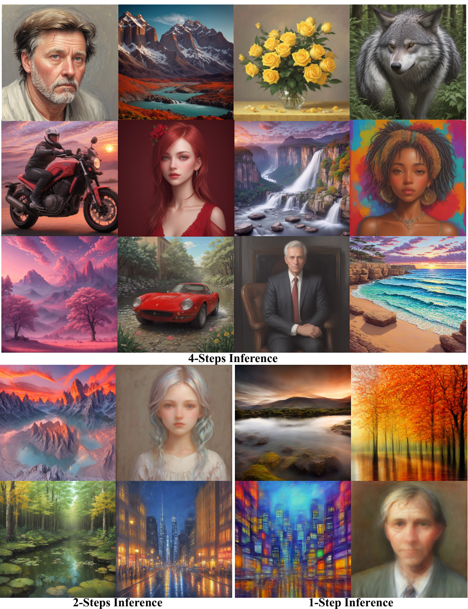
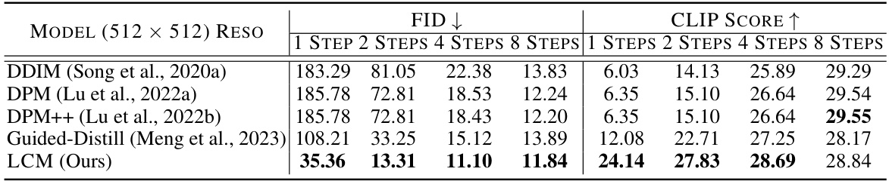
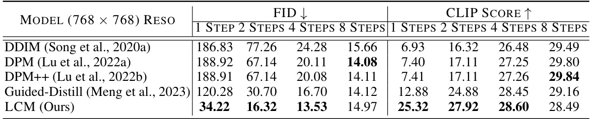
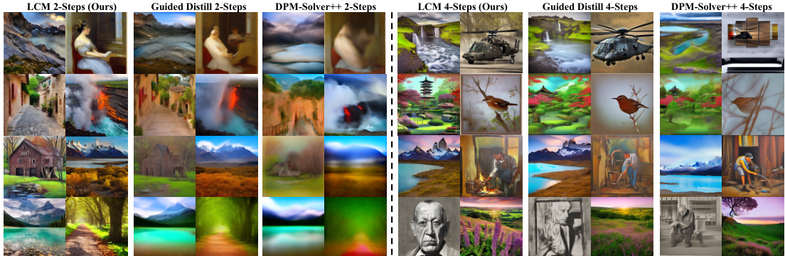
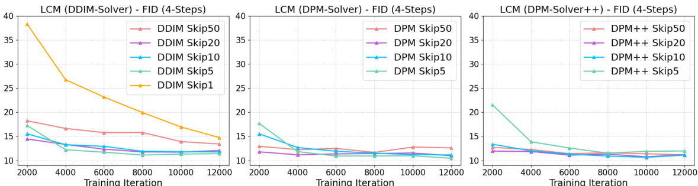
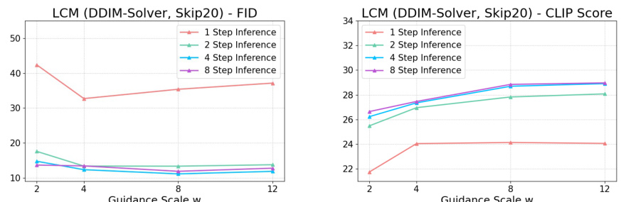
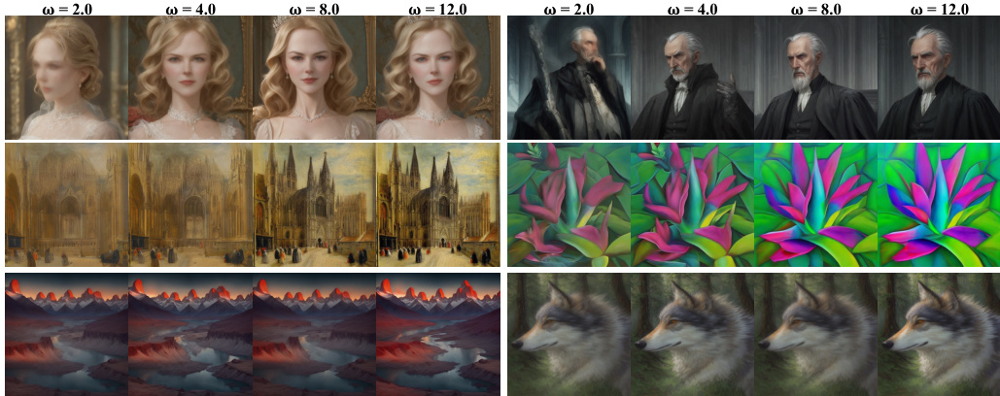
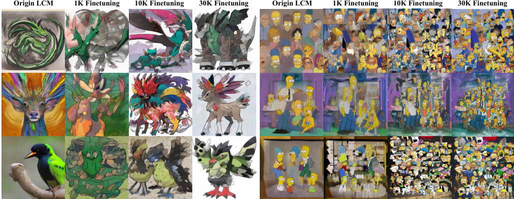
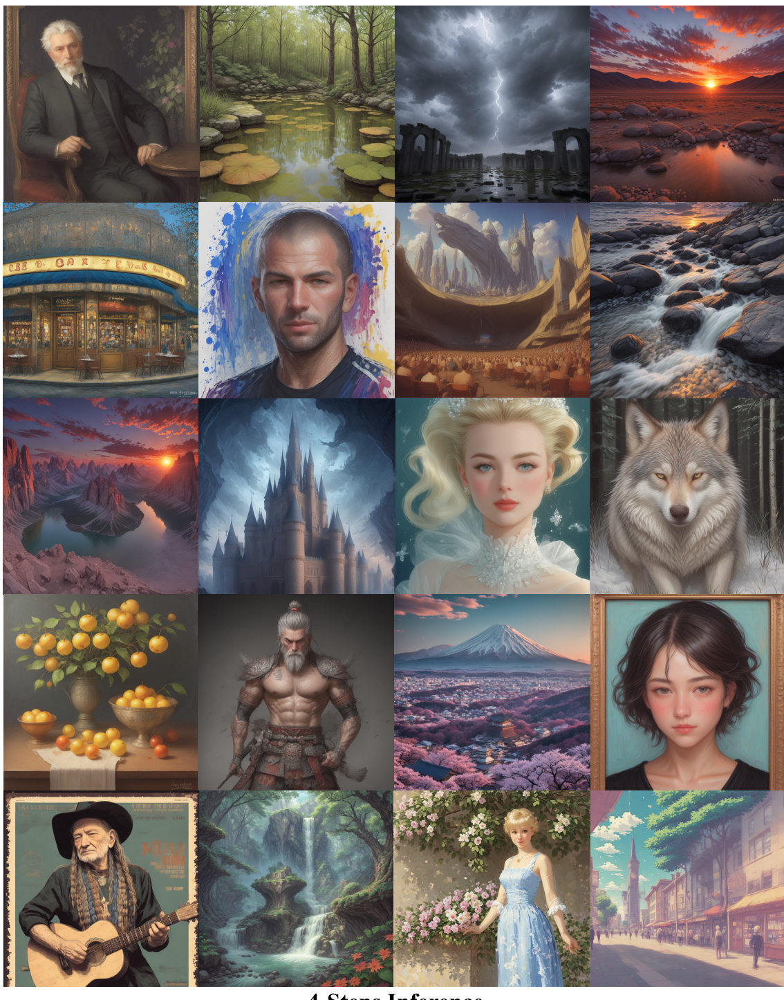
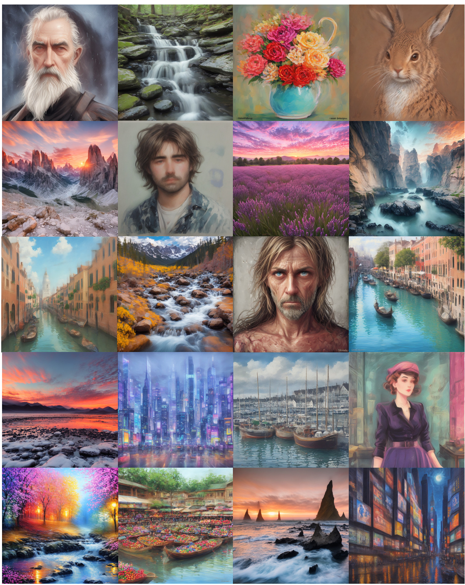

# L ATENT  C ONSISTENCY  M ODELS : S YNTHESIZING  H IGH -R ESOLUTION  I MAGES WITH  F EW - STEP  I NFERENCE  

Simian Luo ∗ Yiqin Tan ∗ Longbo Huang † Jian Li † Hang Zhao † Institute for Interdisciplinary Information Sciences, Tsinghua University  

{ luosm22, tyq22 } @mails.tsinghua.edu.cn longbohuang, lijian83, hangzhao @tsinghua.edu.cn  

# A BSTRACT  

Latent Diffusion models (LDMs) have achieved remarkable results in synthesiz- ing high-resolution images. However, the iterative sampling process is compu- tationally intensive and leads to slow generation. Inspired by Consistency Mod- els (Song et al., 2023), we propose Latent Consistency Models ( LCMs ), enabling swift inference with minimal steps on any pre-trained LDMs, including Stable Diffusion (Rombach et al., 2022). Viewing the guided reverse diffusion process as solving an augmented probability flow ODE (PF-ODE), LCMs are designed to directly predict the solution of such ODE in latent space, mitigating the need for numerous iterations and allowing rapid, high-fidelity sampling. Efficiently distilled from pre-trained classifier-free guided diffusion models, a high-quality  $768\!\times\!768$   $2{\sim}4$  -step LCM takes only 32 A100 GPU hours for training. Further- more, we introduce Latent Consistency Fine-tuning (LCF), a novel method that is tailored for fine-tuning LCMs on customized image datasets. Evaluation on the LAION-5B-Aesthetics dataset demonstrates that LCMs achieve state-of-the- art text-to-image generation performance with few-step inference. Project Page:  

# 1 I NTRODUCTION  

Diffusion models have emerged as powerful generative models that have gained significant attention and achieved remarkable results in various domains (Ho et al., 2020; Song et al., 2020a; Nichol & Dhariwal, 2021; Ramesh et al., 2022; Song & Ermon, 2019; Song et al., 2021). In particular, latent diffusion models (LDMs) (e.g., Stable Diffusion (Rombach et al., 2022)) have demonstrated excep- tional performance, especially in high-resolution text-to-image synthesis tasks. LDMs can generate high-quality images conditioned on textual descriptions by utilizing an iterative reverse sampling process that performs gradual denoising of samples. However, diffusion models suffer from a no- table drawback: the iterative reverse sampling process leads to slow generation speed, limiting their real-time applicability. To overcome this drawback, researchers have proposed several methods to improve the sampling speed, which involves accelerating the denoising process by enhancing ODE solvers (Ho et al., 2020; Lu et al., 2022a;b), which can generate images within   $10{\sim}20$   sampling steps. Another approach is to distill a pre-trained diffusion model into models that enable few-step inference Salimans & Ho (2022); Meng et al. (2023). In particular, Meng et al. (2023) proposed a two-stage distillation approach to improving the sampling efficiency of classifier-free guided mod- els. Recently, Song et al. (2023) proposed consistency models as a promising alternative aimed at speeding up the generation process. By learning consistency mappings that maintain point consis- tency on ODE-trajectory, these models allow for single-step generation, eliminating the need for computation-intensive iterations. However, Song et al. (2023) is constrained to pixel space image generation tasks, making it unsuitable for synthesizing high-resolution images. Moreover, the appli- cations to the conditional diffusion model and the incorporation of classifier-free guidance have not been explored, rendering their methods unsuitable for text-to-image generation synthesis.  

  
Figure 1:  Images generated by Latent Consistency Models (LCMs) with CFG scale  $\omega=8.0$  . LCMs can be distilled from any pre-tr ble Diffusion (SD) in  4,000 training steps (  ${\sim}32$   A100 GPU Hours ) for generating high quality 768  $768\!\times\!768$  × 768 resolution images in 2  $2{\sim}4$  ∼ 4 steps or even one step, significantly accelerating text-to-image generation. We employ LCM to distill the Dreamer-V7 version of SD in just 4,000 training iterations.  

In this paper, we introduce  Latent Consistency Models  (LCMs) for fast, high-resolution image generation. Mirroring LDMs, we employ consistency models in the image latent space of a pre- trained auto-encoder from Stable Diffusion (Rombach et al., 2022). We propose a one-stage guided distillation method to efficiently convert a pre-trained guided diffusion model into a latent consis- tency model by solving an augmented PF-ODE. Additionally, we propose Latent Consistency Fine- tuning, which allows fine-tuning a pre-trained LCM to support few-step inference on customized image datasets. Our main contributions are summarized as follows:  

• We propose Latent Consistency Models (LCMs) for fast, high-resolution image generation. LCMs employ consistency models in the image latent space, enabling fast few-step or even one-step high-fidelity sampling on pre-trained latent diffusion models (e.g., Stable Diffusion (SD)).

 • We provide a simple and efficient one-stage  guided consistency distillation  method to distill SD for few-step   $(2{\sim}4)$   or even 1-step sampling. We propose the S KIPPING -S TEP  technique to further accelerate the convergence. For 2- and 4-step inference, our method costs only 32 A100 GPU hours for training and achieves state-of-the-art performance on the LAION-5B-Aesthetics dataset.  

• We introduce a new fine-tuning method for LCMs, named Latent Consistency Fine-tuning, en- abling efficient adaptation of a pre-trained LCM to customized datasets while preserving the abil- ity of fast inference.  

# 2 R ELATED  W ORK  

Diffusion Models  have achieved great success in image generation (Ho et al., 2020; Song et al., 2020a; Nichol & Dhariwal, 2021; Ramesh et al., 2022; Rombach et al., 2022; Song & Ermon, 2019). They are trained to denoise the noise-corrupted data to estimate the  score  of data distribution. During inference, samples are drawn by running the reverse diffusion process to gradually denoise the data point. Compared to VAEs (Kingma & Welling, 2013; Sohn et al., 2015) and GANs (Goodfellow et al., 2020), diffusion models enjoy the benefit of training stability and better likelihood estimation.  

Accelerating DMs.  However, diffusion models are bottlenecked by their slow generation speed. Various approaches have been proposed, including training-free methods such as ODE solvers (Song et al., 2020a; Lu et al., 2022a;b), adaptive step size solvers (Jolicoeur-Martineau et al., 2021), predictor-corrector methods (Song et al., 2020b). Training-based approaches include optimized dis- cretization (Watson et al., 2021), truncated diffusion (Lyu et al., 2022; Zheng et al., 2022), neural operator (Zheng et al., 2023) and distillation (Salimans & Ho, 2022; Meng et al., 2023). More re- cently, new generative models for faster sampling have also been proposed (Liu et al., 2022; 2023).  

Latent Diffusion Models  (LDMs) (Rombach et al., 2022) excel in synthesizing high-resolution text- to-images. For example, Stable Diffusion (SD) performs forward and reverse diffusion processes in the data latent space, resulting in more efficient computation.  

Consistency Models  (CMs) (Song et al., 2023) have shown great potential as a new type of genera- tive model for faster sampling while preserving generation quality. CMs adopt consistency mapping to directly map any point in ODE trajectory to its origin, enabling fast one-step generation. CMs can be trained by distilling pre-trained diffusion models or as standalone generative models. Details of CMs are elaborated in the following section.  

# 3 P RELIMINARIES  

In this section, we briefly review diffusion and consistency models and define relevant notations.  

Diffusion Models:  Diffusion models, or score-based generative models Ho et al. (2020); Song et al. (2020a) is a family of generative models that progressively inject Gaussian noises into the data, and then generate samples from noise via a reverse denoising process. In particular, diffusion models define a forward process transitioning the origin data distribution    $p_{d a t a}\bar{(\boldsymbol{x})}$   to marginal distribution  $q_{t}(\pmb{x}_{t})$  , via transition kernel:    $q_{0t}\left(\pmb{x}_{t}\mid\pmb{x}_{0}\right)\,=\,\mathcal{N}\left(\pmb{x}_{t}\mid\alpha(t)\pmb{x}_{0},\sigma^{2}(t)\pmb{I}\right)$    |  , where    $\alpha(t),\sigma(t)$   s e noise schedule. In continuous time perspective, the forward process can be described by a stochastic So  Lu et a 022a); Karras et al. (2022) for  $t\in[0,T]$   ∈ :  $\mathrm{d}\mathbf{x}_{t}=f(t)\bar{\mathbf{x}_{t}}\;\mathrm{d}t+g(t)\mathrm{d}\bar{\mathbf{w}_{t}}$  ,  $\bar{\pmb{x_{0}}}\sim p_{d a t a}\left(\pmb{x}_{0}\right)$   ,  where  $\mathbf{\nabla}\mathbf{w}_{t}$   is the standard Brownian motion, and  

$$
f(t)=\frac{\mathrm{d}\log\alpha(t)}{\mathrm{d}t},\quad g^{2}(t)=\frac{\mathrm{d}\sigma^{2}(t)}{\mathrm{d}t}-2\frac{\mathrm{d}\log\alpha(t)}{\mathrm{d}t}\sigma^{2}(t).
$$  

By considering the reverse time SDE (see Appendix A for more details), one can show that the marginal distribution    $q_{t}(\pmb{x})$   satisfies the following ordinary differential equation, called the  Proba- bility Flow   $O D E$   (PF-ODE) (Song et al., 2020b; Lu et al., 2022a):  

$$
\frac{\mathrm{d}\pmb{x}_{t}}{\mathrm{d}t}=\pmb{f}(t)\pmb{x}_{t}-\frac{1}{2}g^{2}(t)\nabla_{\pmb{x}}\log q_{t}\left(\pmb{x}_{t}\right),\ \pmb{x}_{T}\sim q_{T}\left(\pmb{x}_{T}\right).
$$  

In diffusion models, we train the noise prediction model  $\mathbf{\boldsymbol{\epsilon}}_{\theta}(\mathbf{\boldsymbol{x}}_{t},t)$   to fit    $-\nabla\log q_{t}({\pmb x}_{t})$   (called the score function ). Approximating the score function by the noise prediction model in 21, one can obtain the following  empirical  $P F$  -ODE  for sampling:  

$$
\frac{\mathrm{d}\pmb{x}_{t}}{\mathrm{d}t}=f(t)\pmb{x}_{t}+\frac{g^{2}(t)}{2\sigma_{t}}\pmb{\epsilon}_{\theta}\left(\pmb{x}_{t},t\right),\quad\pmb{x}_{T}\sim\mathcal{N}\left(\mathbf{0},\tilde{\sigma}^{2}\pmb{I}\right).
$$  

For class-conditioned diffusion models, Classifier-Free Guidance (CFG) (Ho & Salimans, 2022) is an effective technique to significantly improve the quality of generated samples and has been widely used in several large-scale diffusion models including GLIDE Nichol et al. (2021), Stable Diffusion (Rombach et al., 2022), DALL·E 2 (Ramesh et al., 2022) and Imagen (Saharia et al., 2022). Given a CFG scale  $\omega$  , the original noise prediction is replaced by a linear combination of conditional and unconditional noise prediction, i.e.,  $\begin{array}{r}{\tilde{\epsilon}_{\theta}(z_{t},\omega,c,t)=(1+\omega)\epsilon_{\theta}(z_{t},c,t)-\omega\epsilon_{\theta}(z,\emptyset,t).}\end{array}$  .  

Consistency Models:  The Consistency Model (CM) (Song et al., 2023) is a new family of generative models that enables one-step or few-step generation. The core idea of the CM is to learn the function that maps any points on a trajectory of the PF-ODE to that trajectory’s origin (i.e., the solution of the PF-ODE). More formally, the consistency function is defined as    $\pmb{f}\,:\,(\mathbf{\bar{x}}_{t},t)\,\longmapsto\,\pmb{x}_{\epsilon}$  → ,  where  $\epsilon$  is a fixed small positive number. One important observation is that the consistency function should satisfy the  self-consistency property :  

$$
\pmb{f}(\pmb{x}_{t},t)=\pmb{f}(\pmb{x}_{t^{\prime}},t^{\prime}),\forall t,t^{\prime}\in[\epsilon,T].
$$  

The key idea in (Song et al., 2023) for learning a consistency model    $f_{\theta}$   is to learn a consistency function from data by effectively enforcing the self-consistency property in Eq. 4. To ensure that  $f_{\theta}(x,\epsilon)=x$  , the consistency model  $f_{\theta}$   is parameterized as:  

$$
\pmb{f}_{\pmb{\theta}}(\pmb{x},t)=c_{\mathrm{skin}}(t)\pmb{x}+c_{\mathrm{out}}(t)\pmb{F}_{\pmb{\theta}}(\pmb{x},t),
$$  

where  $c_{\mathrm{skin}}(t)$   and  $c_{\mathrm{out}}(t)$   are differentiable functions with    $c_{\mathrm{skin}}(\epsilon)=1$   and    $c_{\mathrm{out}}(\epsilon)=0$  , and  $F_{\theta}(\pmb{x},t)$   is a deep neural network. A CM can be either distilled from a pre-trained diffusion model or trained from scratch. The former is known as  Consistency Distillation . To enforce the self-consistency property, we maintain a target model  $\theta^{-}$  , updated with exponential moving average (EMA) of the parameter  $\pmb{\theta}$   we intend to learn, i.e.,  $\pmb{\theta}^{-}\leftarrow\mu\bar{\pmb{\theta}}^{-}+(1-\mu)\pmb{\theta}$  , and define the consistency loss as follows:  

$$
\begin{array}{r}{\mathcal{L}(\pmb{\theta},\pmb{\theta}^{-};\Phi)=\mathbb{E}_{\pmb{x},t}\left[d\left(\pmb{f}_{\pmb{\theta}}(\pmb{x}_{t_{n+1}},t_{n+1}),\pmb{f}_{\pmb{\theta}^{-}}(\hat{\pmb{x}}_{t_{n}}^{\phi},t_{n})\right)\right],}\end{array}
$$  

where  $d(\cdot,\cdot)$   is a chosen metric function for measuring the distance between two samples, e.g., the squared  $\ell_{2}$   distance    $d(\pmb{x},\pmb{y})=||\pmb{x}-\pmb{y}||_{2}^{2}.~\hat{\pmb{x}}_{t_{n}}^{\phi}$    is a one-step estimation of  $\pmb{x}_{t_{n}}$    from    $\pmb{x}_{t_{n+1}}$    as:  

$$
\hat{\pmb{x}}_{t_{n}}^{\phi}\leftarrow\pmb{x}_{t_{n+1}}+(t_{n}-t_{n+1})\Phi(\pmb{x}_{t_{n+1}},t_{n+1};\phi).
$$  

where    $\Phi$   denotes the one-step ODE solver applied to PF-ODE in Eq. 24. (Song et al., 2023) used Euler (Song et al., 2020b) or Heun solver (Karras et al., 2022) as the numerical ODE solver. More details and the pseudo-code for consistency distillation (Algorithm 2) are provided in Appendix A.  

# 4 L ATENT  C ONSISTENCY  M ODELS  

Consistency Models (CMs) (Song et al., 2023) only focused on image generation tasks on Ima- geNet   $64\!\times\!64$   (Deng et al., 2009) and LSUN   $256\!\times\!256$   (  $\mathrm{Nu}$   et al., 2015). The potential of CMs to generate higher-resolution text-to-image tasks remains unexplored. In this paper, we introduce Latent Consistency Models  (LCMs) in Sec 4.1 to tackle these more challenging tasks, unleashing the potential of CMs. Similar to LDMs, our LCMs adopt a consistency model in the image latent space. We choose the powerful Stable Diffusion (SD) as the underlying diffusion model to distill from. We aim to achieve few-step  $(2{\sim}4)$   and even one-step inference on SD without compromising image quality. The classifier-free guidance (CFG) (Ho & Salimans, 2022) is an effective technique to further improve sample quality and is widely used in SD. However, its application in CMs re- mains unexplored. We propose a simple one-stage guided distillation method in  $\mathrm{96c\,4.2}$   that solves an  augmented PF-ODE , integrating CFG into LCM effectively. We propose S KIPPING -S TEP  tech- nique to accelerate the convergence of LCMs in Sec. 4.3. Finally, we propose Latent Consistency Fine-tuning to finetune a pre-trained LCM for few-step inference on a customized dataset in Sec 4.4.  

# 4.1 C ONSISTENCY  D ISTILLATION IN THE  L ATENT  S PACE  

Utilizing image latent space in large-scale diffusion models like Stable Diffusion (SD) (Rombach et al., 2022) has effectively enhanced image generation quality and reduced computational load. In toencoder  $(\mathcal{E},\mathcal{D})$   is first trained to compress high-d data into low-dim latent vector  $z=\mathcal{E}(x)$   E , which is then decoded to reconstruct the image as  $\hat{x}=\bar{\mathcal{D}(z)}$   D . Training diffusion models in the latent space greatly reduces the computation costs compared to pixel-based models and speeds up the inference process; LDMs make it possible to generate high-resolution images on laptop GPUs. For LCMs, we leverage the advantage of the latent space for consistency distillation, contrasting with the pixel space used in CMs (Song et al., 2023). This approach, termed  Latent Consistency Distillation (LCD)  is applied to pre-trained SD, allowing the synthesis of high-resolution (e.g.,  $768\!\times\!768)$  ) images in   $1{\sim}4$   steps. We focus on conditional generation. Recall that the PF-ODE of the reverse diffusion process (Song et al., 2020b; Lu et al., 2022a) is  

$$
\frac{\mathrm{d}z_{t}}{\mathrm{d}t}=f(t)z_{t}+\frac{g^{2}(t)}{2\sigma_{t}}\epsilon_{\theta}\left(z_{t},\boldsymbol{c},t\right),\quad z_{T}\sim\mathcal{N}\left(\mathbf{0},\tilde{\sigma}^{2}\pmb{I}\right),
$$  

where  $z_{t}$   are image latents,    $\mathbf{\boldsymbol{\epsilon}}_{\theta}\left(\mathbf{\boldsymbol{z}}_{t},\mathbf{\boldsymbol{c}},t\right)$   is the noise prediction model, and  $^c$   is the given condition (e.g text). Samples can be drawn by solving the PF-ODE from    $T$   to  0 . To perform  LCD , we introduce t nsistency function    $\check{f_{\underline{{{\theta}}}}}\vdots(z_{t},\bar{c_{\mathrm{}}},t)\mapsto z_{\bf0}$   to directly p dict the solution of  $P F{\cdot}O D E$  (Eq. 8) for  t  $t=0$  . We parameterize  $f_{\theta}$   by the noise prediction model  $\hat{\epsilon}_{\theta}$  , as follows:  

$$
\pmb{f}_{\theta}(z,c,t)=c_{\mathrm{skin}}(t)z+c_{\mathrm{out}}(t)\left(\frac{z-\sigma_{t}\hat{\epsilon}_{\theta}(z,c,t)}{\alpha_{t}}\right),\quad(\epsilon\mathrm{-Predicted})
$$  

where    $c_{\mathrm{skin}}(0)\,=\,1,c_{\mathrm{out}}(0)\,=\,0$   and    $\hat{\epsilon}_{\theta}(z,c,t)$   is a noise prediction model that initializes with the same parameters as the teacher diffusion model. Notably,    $f_{\theta}$   can be parameterized in various ways, depending on the teacher diffusion model parameter iz at ions of predictions (e.g.,    $\textbf{\em x}$  ,    $\epsilon$   (Ho et al., 2020),    $\mathbfit{v}$   (Salimans & Ho, 2022)). We discuss other possible parameter iz at ions in Appendix D.  

We assume that an efficient ODE solver    $\Psi(z_{t},t,s,c)$   is available for approximating the integration of the right-hand side of Eq equation 8 from time    $t$   to    $s$  . In practice, we can use DDIM (Song et al., 2020a), DPM-Solver (Lu et al., 2022a) or DPM-Solver+  $-+$   (Lu et al., 2022b) as    $\Psi(\cdot,\cdot,\cdot,\cdot)$  . Note that we only use these solvers in training/distillation, not in inference. We will discuss these solvers further when we introduce the  SKIPPING - STEP  technique in Sec. 4.3. LCM aims to predict the solution of the PF-ODE by minimizing the consistency distillation loss (Song et al., 2023):  

$$
\begin{array}{r}{\mathcal{L}_{\mathcal{C D}}\left(\pmb{\theta},\pmb{\theta}^{-};\Psi\right)=\mathbb{E}_{z,c,n}\left[d\left(\pmb{f}_{\pmb{\theta}}(z_{t_{n+1}},c,t_{n+1})\right.,\pmb{f}_{\pmb{\theta}^{-}}(\hat{z}_{t_{n}}^{\Psi},c,t_{n})\right)\right].}\end{array}
$$  

Here,  $\hat{\boldsymbol{z}}_{t_{n}}^{\Psi}$    is an estimation of the evolution of the  $P F{\cdot}O D E$   from  $t_{n+1}\to t_{n}$    using ODE solver    $\Psi$  :  

$$
\dot{z}_{t_{n}}^{\Psi}-z_{t_{n+1}}=\int_{t_{n+1}}^{t_{n}}\left(f(t)z_{t}+\frac{g^{2}(t)}{2\sigma_{t}}\epsilon_{\theta}\left(z_{t},c,t\right)\right)\mathrm{d}t\approx\Psi(z_{t_{n+1}},t_{n+1},t_{n},c),
$$  

where the solver    $\Psi(\cdot,\cdot,\cdot,\cdot)$   is used to approximate the integration from  $t_{n+1}\to t_{n}$  .  

# 4.2 O NE -S TAGE  G UIDED  D ISTILLATION BY SOLVING AUGMENTED  PF-ODE  

Classifier-free guidance (CFG) (Ho & Salimans, 2022) is crucial for synthesizing high-quality text- aligned images in SD, typically needing a CFG scale  $\omega$   over  6 . Thus, integrating CFG into a distilla- tion method becomes indispensable. Previous method Guided-Distill (Meng et al., 2023) introduces a two-stage distillation to support few-step sampling from a guided diffusion model. However, it is computationally intensive (e.g. at least  45  A100 GPUs  Days  for 2-step inference, estimated in (Liu et al., 2023)). An LCM demands merely  32  A100 GPUs  Hours  training for 2-step inference, as de- picted in Figure 1. Furthermore, the two-stage guided distillation might result in accumulated error, leading to suboptimal performance. In contrast, LCMs adopt efficient one-stage guided distillation by solving an augmented PF-ODE. Recall the CFG used in reverse diffusion process:  

$$
\begin{array}{r}{\tilde{\epsilon}_{\theta}\left(\boldsymbol{z}_{t},\omega,\boldsymbol{c},t\right):=(1+\omega)\epsilon_{\theta}\left(\boldsymbol{z}_{t},\boldsymbol{c},t\right)-\omega\epsilon_{\theta}\left(\boldsymbol{z}_{t},\emptyset,t\right),}\end{array}
$$  

where the original noise prediction is replaced by the linear combination of conditional and uncon- ditional noise and    $\omega$   is called the  guidance scale . To sample from the guided reverse process, we need to solve the following  augmented  $P F$  -ODE : (i.e., augmented with the terms related to    $\omega$  )  

$$
\frac{\mathrm{d}z_{t}}{\mathrm{d}t}=f(t)z_{t}+\frac{g^{2}(t)}{2\sigma_{t}}\tilde{\epsilon}_{\theta}\left(z_{t},\omega,\mathbf{c},t\right),\quad z_{T}\sim\mathcal{N}\left(\mathbf{0},\tilde{\sigma}^{2}\boldsymbol{I}\right).
$$  

To efficiently perform one-stage guided distillation, we introduce an  augmented consistency func-  $\pmb{f_{\theta}}\,:\,(\dot{z_{t}},\dot{\omega},\pmb{c},t)\,\mapsto\,z_{0}$   directly predict the solution of  augment E  (Eq. 13) for  $t=0$  . We parameterize the  $f_{\theta}$   in the same way as in Eq. 9, except that  $\hat{\epsilon}_{\theta}(z,c,t)$   is replaced by  $\hat{\epsilon}_{\theta}(z,\omega,c,\bar{t})$  , which is a noise prediction model initializing with the same parameters as the teacher diffusion model, but also contains additional trainable parameters for conditioning on  $\omega$  . The consis- tency loss is the same as Eq. 10 except that we use augmented consistency function    $f_{\theta}(z_{t},\omega,c,t)$  .  

$$
\mathcal{L}_{\mathcal{C D}}\left(\pmb{\theta},\pmb{\theta}^{-};\Psi\right)=\mathbb{E}_{z,c,\omega,n}\left[d\left(\pmb{f}_{\pmb{\theta}}(z_{t_{n+1}},\omega,\pmb{c},t_{n+1})\,,\pmb{f}_{\pmb{\theta}^{-}}(\hat{z}_{t_{n}}^{\Psi,\omega},\omega,\pmb{c},t_{n})\right)\right]
$$  

In Eq 14,  $\omega$   and  $n$   are uniformly sampled from interval    $[\omega_{\mathrm{min}},\omega_{\mathrm{max}}]$   and    $\{1,.\,.\,.\,,N{-}1\}$   respectively.  $\hat{\boldsymbol z}_{t_{n}}^{\Psi,\omega}$  is estimated using the new noise model    $\tilde{\epsilon}_{\theta}\left(z_{t},\omega,\boldsymbol{c},t\right)$  , as follows:  

$$
\begin{array}{l}{\displaystyle\iota_{t_{n}}^{\Psi,\omega}-z_{t_{n+1}}=\int_{t_{n+1}}^{t_{n}}\left(f(t)z_{t}+\frac{g^{2}(t)}{2\sigma_{t}}\bar{\epsilon}_{\theta}\left(z_{t},\omega,c,t\right)\right)\mathrm{d}t}\\ {\displaystyle\qquad\qquad=(1+\omega)\int_{t_{n+1}}^{t_{n}}\left(f(t)z_{t}+\frac{g^{2}(t)}{2\sigma_{t}}\epsilon_{\theta}\left(z_{t},c,t\right)\right)\mathrm{d}t-\omega\int_{t_{n+1}}^{t_{n}}\left(f(t)z_{t}+\frac{g^{2}(t)}{2\sigma_{t}}\epsilon_{\theta}\left(z_{t},\varpi,t\right)\right)\mathrm{d}t}\\ {\displaystyle\qquad\qquad\approx(1+\omega)\Psi(z_{t_{n+1}},t_{n+1},t_{n},c)-\omega\Psi(z_{t_{n+1}},t_{n+1},t_{n},\varpi).}\end{array}
$$  

Again, we can use DDIM (Song et al., 2020a), DPM-Solver (Lu et al., 2022a) or DPM-Solver++

 (Lu et al., 2022b) as the PF-ODE solver  $\Psi(\cdot,\cdot,\cdot,\cdot)$  .  

4.3 A CCELERATING  D ISTILLATION WITH  S KIPPING  T IME  S TEPS  

Discrete diffusion models (Ho et al., 2020; Song & Ermon, 2019) typically train noise prediction models with a long time-step schedule    $\{t_{i}\}_{i}$   (also called discretization schedule or time schedule) to achieve high quality generation results. For instance, Stable Diffusion (SD) has a time schedule of length 1,000. However, directly applying Latent Consistency Distillation ( LCD ) to SD with such an extended schedule can be problematic. The model needs to sample across all 1,000 time steps, and the consistency loss attempts to aligns the prediction of LCM model    $f_{\theta}(z_{t_{n+1}},c,t_{n+1})$   with the pred    $f_{\theta}(\boldsymbol{z}_{t_{n}},\boldsymbol{c},t_{n})$  ent s ame trajectory. Since  $t_{n}-t_{n+1}$   is tiny,  $\boldsymbol{\mathcal{Z}}_{t_{n}}$  and  $\pmb{z}_{t_{n+1}}$   (and thus  $f_{\theta}(z_{t_{n+1}},c,t_{n+1})$   and  $f_{\theta}(\boldsymbol{z}_{t_{n}},\boldsymbol{c},t_{n}))$  ) are already close to each other, incurring small consistency loss and hence leading to slow convergence. To address this issues, we introduce the  SKIPPING - STEP  method to considerably shorten the length of time schedule (from thousands to dozens) to achieve fast convergence while preserving generation quality.  

Consistency Models (CMs) (Song et al., 2023) use the EDM (Karras et al., 2022) continuous time schedule, and the Euler, or Heun Solver as the numerical continuous PF-ODE solver. For LCMs, in order to adapt to the discrete-time schedule in Stable Diffusion, we utilize DDIM (Song et al., 2020a), DPM-Solver (Lu et al., 2022a), or DPM-Solver  $^{++}$   (Lu et al., 2022b) as the ODE solver. (Lu et al., 2022a) shows that these advanced solvers can solve the PF-ODE efficiently in Eq. 8. Now, we introduce the S KIPPING -S TEP  method in Latent Consistency Distillation (LCD). Instead of ensuring consistency between djacent tim  $t_{n+1}\to t_{n}$  , LCMs ai ensure consistency between the current time step and  k -step away,  $t_{n+k}\to t_{n}$   → . Note that setting  $k{=}1$  reduces to the original schedule in (Song et al., 2023), leading to slow convergence, and very large  k  may incur large approximation errors of the ODE solvers. In our main experiments, we set    $k{=}20$  , drastically reducing the length of time schedule from thousands to dozens. Results in Sec. 5.2 show the effect of various  $k$   values and reveal that the  SKIPPING - STEP  method is crucial in accelerating the LCD process. Specifically, consistency distillation loss in Eq. 14 is modified to ensure consistency from    $t_{n+k}$   to  $t_{n}$  :  

$$
\begin{array}{r}{\mathcal{L}_{\mathcal{C D}}\left(\pmb{\theta},\pmb{\theta}^{-};\Psi\right)=\mathbb{E}_{z,c,\omega,n}\left[d\left(\pmb{f}_{\pmb{\theta}}(z_{t_{n+k}},\omega,\pmb{c},t_{n+k})\right.,\pmb{f}_{\pmb{\theta}^{-}}(\hat{z}_{t_{n}}^{\Psi,\omega},\omega,\pmb{c},t_{n})\right)\right],}\end{array}
$$  

with  $\hat{\boldsymbol z}_{t_{n}}^{\Psi,\omega}$  being an estimate of  $\boldsymbol{\mathscr{z}}_{t_{n}}$   using numerical  augmented PF-ODE  solver    $\Psi$  :  

$$
\acute{z}_{t_{n}}^{\Psi,\omega}\longleftarrow z_{t_{n+k}}+(1+\omega)\Psi(z_{t_{n+k}},t_{n+k},t_{n},\pmb{c})-\omega\Psi(z_{t_{n+k}},t_{n+k},t_{n},\pmb{\mathcal{D}}).
$$  

The above derivation is similar to Eq. 15. For LCM, we use three possible ODE solvers here: DDIM (Song et al., 2020a), DPM-Solver (Lu et al., 2022a), DPM-Solver+  $^{\cdot+}$   (Lu et al., 2022b), and we compare their performance in Sec 5.2. In fact, DDIM (Song et al., 2020a) is the first-order discretization approximation of the DPM-Solver (Proven in (Lu et al., 2022a)). Here we provide the detailed formula of the DDIM PF-ODE solver    $\Psi_{\mathrm{{DIM}}}$   from  $t_{n+k}$   to  $t_{n}$  . The formulas of the other two solver    $\Psi_{\mathrm{DPM-Slower}}$  ,    $\Psi_{\mathrm{DPM-Solveer++}}$   are provided in Appendix  $\mathrm{E}$  .  

$$
\Psi_{\mathrm{DDM}}(z_{t_{n+k}},t_{n+k},t_{n},c)=\frac{\alpha_{t_{n}}}{\alpha_{t_{n+k}}}z_{t_{n+k}}-\sigma_{t_{n}}\left(\frac{\sigma_{t_{n+k}}\cdot\alpha_{t_{n}}}{\alpha_{t_{n+k}}\cdot\sigma_{t_{n}}}-1\right)\hat{\epsilon}_{\theta}(z_{t_{n+k}},c,t_{n+k})-z_{t_{n+k}}
$$  

We present the pseudo-code for  LCD  with CFG and  SKIPPING - STEP  techniques in Algorithm 1 The modifications from the original Consistency Distillation (CD) algorithm in Song et al. (2023) are highlighted in blue. Also, the LCM sampling algorithm 3 is provided in Appendix B.  

  
Table 1:  Quantitative results with    $\omega\,=\,8$  t  $512\!\times\!512$   resolution. LCM significantly surpasses baselines in the 1-4 step region on LAION-Aesthetic-6+ dataset. For LCM, DDIM-Solver is used with a skipping step of  $k=20$  .  

  
Table 2:  Quantitative results with  $\omega=8$   $768\!\times\!768$   resolution. LCM significantly surpasses the baselines in the 1-4 step region on LAION-Aesthetic-6.5+ dataset. For LCM, DDIM-Solver is used with a skipping step of  $k=20$  .  

# Algorithm 1  Latent Consistency Distillation (LCD)  

Input:  da set  $\mathcal{D}$  , initial mo eter    $\pmb{\theta}$  , learning r  $\eta$  solver    $\Psi(\cdot,\cdot,\cdot,\cdot)$  ,  stance metric  $d(\cdot,\cdot)$  EMA rate  µ ,  noise schedule  $\alpha(t),\sigma(t)$  , guidance scale  [  $[w_{\mathrm{min}},w_{\mathrm{max}}]$  , skipping interval  k , and encoder  $E(\cdot)$  · g training data into latent space:    $\mathcal{D}_{z}=\{(z,\pmb{c})|\pmb{z}=E(\pmb{x}),(\pmb{x},\pmb{c})\in\mathcal{D}\}$   $\pmb{\theta}^{-}\leftarrow\check{\pmb{\theta}}$  repeat Sample    $(z,c)\sim\mathcal{D}_{z}$   $n\sim\mathcal{U}[1,N_{-}k]$   $\omega\sim\left[\omega_{\operatorname*{min}},\omega_{\operatorname*{max}}\right]$  Sample  $\boldsymbol{z}_{t_{n+k}}\sim\mathcal{N}(\alpha(t_{n+k})\boldsymbol{z};\sigma^{2}(t_{n+k})\mathbf{I})$   ∼N  $\acute{z}_{t_{n}}^{\Psi,\omega}\gets z_{t_{n+k}}+(1+\omega)\Psi\big(z_{t_{n+k}},t_{n+k},t_{n},c\big)-\omega\Psi\big(z_{t_{n+k}},t_{n+k},t_{n},\emptyset\big)$   $\begin{array}{r}{\mathcal{L}(\pmb{\theta},\pmb{\theta}^{-};\Psi)\gets d(\pmb{f}_{\pmb{\theta}}(z_{t_{n+k}},\omega,\pmb{c},t_{n+k}),\pmb{f}_{\pmb{\theta}^{-}}(\hat{z}}\end{array}$  t n ,ω   , ω,  c , t n ))  $\pmb\theta^{-}\leftarrow\mathrm{stopgrad}(\mu\pmb\theta^{-}+(1-\mu)\pmb\theta)$  ←  − until  convergence  

4.4 L ATENT  C ONSISTENCY  F INE - TUNING FOR CUSTOMIZED DATASET  

Foundation generative models like Stable Diffusion excel in diverse text-to-image generation tasks but often require fine-tuning on customized datasets to meet the requirements of downstream tasks. We propose Latent Consistency Fine-tuning (LCF), a fine-tuning method for pretrained LCM. In- spired by Consistency Training (CT) (Song et al., 2023), LCF enables efficient few-step inference on customized datasets without relying on a teacher diffusion model trained on such data. This approach presents a viable alternative to traditional fine-tuning methods for diffusion models. The pseudo-code for LCF is provided in Algorithm 4, with a more detailed illustration in Appendix C.  

# 5 E XPERIMENT  

In this section, we employ latency consistency distillation to train LCM on two subsets of LAION- 5B. In Sec 5.1, we first evaluate the performance of LCM on text-to-image generation tasks. In Sec 5.2, we provide a detailed ablation study to test the effectiveness of using different solvers, skipping step schedules and guidance scales. Lastly, in Sec 5.3, we present the experimental results of latent consistency finetuning on a pretrained LCM on customized image datasets.  

# 5.1 T EXT - TO -I MAGE  G ENERATION  

Datasets  We use two subsets of LAION-5B (Schuhmann et al., 2022): LAION-Aesthetics-  $\cdot6+\left(12\mathbf{M}\right)$  and LAION-Aesthetics-  $\cdot6.5+$   (650K) for text-to-image generation. Our experiments consider reso- lutions of   $512\!\times\!512$   and  $768\!\times\!768$  . For 512 resolution, we use LAION-Aesthetics-  $^{.6+}$  , which com- prises 12M text-image pairs with predicted aesthetics scores higher than 6. For 768 resolution, we use LAION-Aesthetics  $\cdot6.5+$  , with 650K text-image pairs with aesthetics score higher than 6.5.  

Model Configuration  For 512 resolution, we use the pre-trained Stable Diffusion-V2.1-Base (Rom- bach et al., 2022) as the teacher model, which was originally trained on resolution  $512\!\times\!512$   with    $\epsilon$  - Prediction (Ho et al., 2020). For 768 resolution, we use the widely used pre-trained Stable Diffusion-  

  
Figure 2:  Text-to-Image generation results on LAION-Aesthetic  $\cdot6.5+$   with 2-, 4-step inference. Images gen- erated by LCM exhibit superior detail and quality, outperforming other baselines by a large margin.  

  
Figure 3:  Ablation study on different ODE solvers and skipping step  $k$  . Appropriate skipping step    $k$   can significantly accelerate convergence and lead to better FID within the same number of training steps.  

V2.1, originally trained on resolution   $768\!\times\!768$   with    $\mathbfit{v}$  -Predictio  & Ho, 2022). We t with 100K iterations and we use a batch size of 7  $(512\times512)$   setting, and 16 for  $(768\times768)$  ×  setting, the same learning  e 8e-6 and EMA r e  $\mu=0.999943$   as used in (Song et al., 2023). For  augmented PF-ODE  solver  Ψ  and skipping step  k  in Eq. 17, we use DDIM-Solver (Song et al., 2020a) with skipping step  $k\,=\,20$  . We set the guidance scale range    $[w_{\mathrm{min}},w_{\mathrm{max}}]\,=\,[2,14]$  , consistent with (Meng et al., 2023). More training details are provided in the Appendix F.  

Baselines & Evaluation  We use DDIM (Song et al., 2020a), DPM (Lu et al., 2022a),  $\mathrm{\bfDPM++}$   (Lu et al., 2022b) and Guided-Distill (Meng et al., 2023) as baselines. The first three are training-free samplers requiring more peak memory per step with classifier-free guidance. Guided-Distill requires two stages of guided distillation. Since Guided-Distill is not open-sourced, we strictly followed the training procedure outlined in the paper to reproduce the results. Due to the limited resource (Meng et al. (2023) used a large batch size of 512, requiring at least 32 A100 GPUs), we reduce the batch size to  72 , the same as ours, and trained for the same 100K iterations. Reproduction details are provided in Appendix G. We admit that longer training and more computational resources can lead to better results as reported in (Meng et al., 2023). However, LCM achieves faster convergence and superior results under the same computation cost. For evaluation, We generate 30K images from 10K text prompts in the test set (3 images per prompt), and adopt FID and CLIP scores to evaluate the diversity and quality of the generated images. We use ViT-g/14 for evaluating CLIP scores.  

Results.  The quantitative results in Tables 1 and 2 show that LCM notably outperforms baseline methods at  512  and  768  resolutions, especially in the l regime   $(1{\sim}4)$  , highlighting its effi- cency and superior performance. Unlike DDIM, DPM, DPM++, which require more peak memory per sampling step with CFG, LCM requires only one forward pass per sampling step, saving both time and memory. Moreover, in contrast to the two-stage distillation procedure employed in Guided- Distill, LCM only needs one-stage guided distillation, which is much simpler and more practical. The  qualitative results  in Figure 2 further show the superiority of LCM with 2- and 4-step inference. 5.2 A BLATION  S TUDY  

ODE Solvers & Skipping-Step Schedule.  We compare various solvers    $\Psi$   (DDIM (Song et al., 2020a), DPM (Lu et al., 2022a),   $\mathrm{\bfDPM++}$   (Lu et al., 2022b)) for solving the  augmented  $P F{\cdot}O D E$  specified in Eq 17, and explore different skipping step schedules with different    $k$  . The results are depicted in Figure 3. We observe that: 1) Using S KIPPING -S TEP  techniques (see Sec 4.3), LCM achieves fast convergence within 2,000 iterations in the 4-step inference setting. Specifically, the DDIM solver converges slowly at skipping step    $k\,=\,1$  , while setting    $k\,=\,5,10,20$   leads to  

  
Figure 4:  Ablation study on different classifier-free guidance scales  $\omega$  . Larger  $\omega$   leads to better sample quality (CLIP Scores). The performance gaps across 2, 4, and 8 steps are minimal, showing the efficacy of LCM.  

  
Figure 5:  4-step LCMs using different CFG scales  $\omega$  . LCMs utilize one-stage guided distillation to directly incorporate CFG scales  $\omega$  . Larger  $\omega$   enhances image quality.  

much faster convergence, underscoring the effectiveness of the Skipping-Step method. 2) DPM and  $\mathrm{\bfDPM++}$   solvers perform better at a larger skipping step   $k\,=\,50$  ) compared to the DDIM solver which suffers from increased ODE approximation error with larger  $k$  . This phenomenon is also dis- cussed in (Lu et al., 2022a). 3) Very small    $k$   values (1 or 5) result in slow convergence and very large ones (e.g., 50 for DDIM) may lead to inferior results. Hence, we choose    $k\,=\,20$  , which provides competitive performance for all three solvers, for our main experiment in Sec 5.1.  

The Effect of Guidance Scale  $\omega$  .  We examine the effect of using different CFG scales    $\omega$   in LCM. Typically,    $\omega$   balances sample quality and diversity. A larger  $\omega$   generally tends to improve sample quality (indicated by CLIP), but may compromise diversity (measured by FID). Beyond a certain threshold, an increased    $\omega$   yields better CLIP scores at the expense of FID. Figure 4 presents the results for various    $\omega$   across different inference steps. Our findings include: 1) Using large    $\omega$   en- hances sample quality (CLIP Scores) but results in relatively inferior FID. 2) The performance gaps across 2, 4, and 8 inference steps are negligible, highlighting LCM’s efficacy in  $2{\sim}8$   step regions. However, a noticeable gap exists in one-step inference, indicating rooms for further improvements. We present visualizations for different  $\omega$   in Figure 5. One can see clearly that a larger    $\omega$   enhances sample quality, verifying the effectiveness of our one-stage guided distillation method.  

# 5.3 D OWNSTREAM  C ONSISTENCY  F INE - TUNING  R ESULTS  

We perform  Latent Consistency Fine-tuning  (LCF) on two customized image datasets, Pokemon dataset (Pinkney, 2022) and Simpsons dataset (Norod78, 2022), to demonstrate the efficiency of LCF. Each dataset, comprised of hundreds of customized text-image pairs, is split such that  $90\%$  is used for fine-tuning and the rest   $10\%$   for testing. For LCF, we utilize pretrained LCM that was originally trained at the resolution of  $768\!\times\!768$   used in Table 2. For these two datasets, we fine-tune the pre-trained LCM for 30K iterations with a learning rate 8e-6. We present qualitative results of adopting LCF on two customized image datasets in Figure 6. The finetuned LCM is capable of generating images with customized styles in few steps, showing the effectiveness of our method.  

# 6 C ONCLUSION  

We present Latent Consistency Models (LCMs), and a highly efficient one-stage guided distillation method that enables few-step or even one-step inference on pre-trained LDMs. Furthermore, we present latent consistency fine-tuning (LCF), to enable few-step inference of LCMs on customized image datasets. Extensive experiments on the LAION-5B-Aesthetics dataset demonstrate the supe-  

  
Figure 6:  4-step LCMs using Latent Consistency Fine-tuning (LCF) on two customized datasets: Pokemon Dataset (left), Simpsons Dataset (right). Through LCF, LCM produces images with customized styles.  

rior performance and efficiency of LCMs. Future work include extending our method to more image generation tasks such as text-guided image editing, inpainting and super-resolution.  

# R EFERENCES  

Jia Deng, Wei Dong, Richard Socher, Li-Jia Li, Kai Li, and Li Fei-Fei. Imagenet: A large-scale hi- erarchical image database. In  2009 IEEE conference on computer vision and pattern recognition , pp. 248–255. Ieee, 2009.  

Ian Goodfellow, Jean Pouget-Abadie, Mehdi Mirza, Bing Xu, David Warde-Farley, Sherjil Ozair, Aaron Courville, and Yoshua Bengio. Generative adversarial networks.  Communications of the ACM , 63(11):139–144, 2020.  

Jonathan Ho and Tim Salimans. Classifier-free diffusion guidance. arXiv preprint arXiv:2207.12598 , 2022.  

Jonathan Ho, Ajay Jain, and Pieter Abbeel. Denoising diffusion probabilistic models.  Advances in Neural Information Processing Systems , 33:6840–6851, 2020.  

Aapo Hyv¨ arinen and Peter Dayan. Estimation of non-normalized statistical models by score match- ing.  Journal of Machine Learning Research , 6(4), 2005.  

Alexia Jolicoeur-Martineau, Ke Li, R´ emi Pich´ e-Taillefer, Tal Kachman, and Ioannis Mitliagkas. Gotta go fast when generating data with score-based models.  arXiv preprint arXiv:2105.14080 , 2021.  

Tero Karras, Miika Aittala, Timo Aila, and Samuli Laine. Elucidating the design space of diffusion- based generative models.  Advances in Neural Information Processing Systems , 35:26565–26577, 2022.  

Diederik   $\mathrm{P}$   Kingma and Max Welling. Auto-encoding variational bayes. arXiv preprint arXiv:1312.6114 , 2013.  

Liyuan Liu, Haoming Jiang, Pengcheng He, Weizhu Chen, Xiaodong Liu, Jianfeng Gao, and Jiawei Han. On the variance of the adaptive learning rate and beyond.  arXiv preprint arXiv:1908.03265 , 2019.  

Xingchao Liu, Chengyue Gong, and Qiang Liu. Flow straight and fast: Learning to generate and transfer data with rectified flow.  arXiv preprint arXiv:2209.03003 , 2022.  

Xingchao Liu, Xiwen Zhang, Jianzhu Ma, Jian Peng, and Qiang Liu. Instaflow: One step is enough for high-quality diffusion-based text-to-image generation. arXiv preprint arXiv:2309.06380 , 2023.  

Cheng Lu, Yuhao Zhou, Fan Bao, Jianfei Chen, Chongxuan Li, and Jun Zhu. Dpm-solver: A fast ode solver for diffusion probabilistic model sampling in around 10 steps.  arXiv preprint arXiv:2206.00927 , 2022a.  

Cheng Lu, Yuhao Zhou, Fan Bao, Jianfei Chen, Chongxuan Li, and Jun Zhu. Dpm-solver++: Fast solver for guided sampling of diffusion probabilistic models.  arXiv preprint arXiv:2211.01095 , 2022b. Zhaoyang Lyu, Xudong Xu, Ceyuan Yang, Dahua Lin, and Bo Dai. Accelerating diffusion models via early stop of the diffusion process.  arXiv preprint arXiv:2205.12524 , 2022. Chenlin Meng, Robin Rombach, Ruiqi Gao, Diederik Kingma, Stefano Ermon, Jonathan Ho, and Tim Salimans. On distillation of guided diffusion models. In  Proceedings of the IEEE/CVF Conference on Computer Vision and Pattern Recognition , pp. 14297–14306, 2023. Alex Nichol, Prafulla Dhariwal, Aditya Ramesh, Pranav Shyam, Pamela Mishkin, Bob McGrew, Ilya Sutskever, and Mark Chen. Glide: Towards photorealistic image generation and editing with text-guided diffusion models.  arXiv preprint arXiv:2112.10741 , 2021. Alexander Quinn Nichol and Prafulla Dhariwal. Improved denoising diffusion probabilistic models. In  International Conference on Machine Learning , pp. 8162–8171. PMLR, 2021. Norod78. Simpsons blip captions. https://huggingface.co/datasets/Norod78/ simpsons-blip-captions , 2022. Justin N. M. Pinkney. Pokemon blip captions. https://huggingface.co/datasets/ lambdalabs/pokemon-blip-captions/ , 2022. Aditya Ramesh, Prafulla Dhariwal, Alex Nichol, Casey Chu, and Mark Chen. Hierarchical text- conditional image generation with clip latents.  arXiv preprint arXiv:2204.06125 , 2022. Robin Rombach, Andreas Blattmann, Dominik Lorenz, Patrick Esser, and Bj¨ orn Ommer. High- resolution image synthesis with latent diffusion models. In  Proceedings of the IEEE/CVF Con- ference on Computer Vision and Pattern Recognition , pp. 10684–10695, 2022. Chitwan Saharia, William Chan, Saurabh Saxena, Lala Li, Jay Whang, Emily L Denton, Kamyar Ghasemipour, Raphael Gontijo Lopes, Burcu Karagol Ayan, Tim Salimans, et al. Photorealistic text-to-image diffusion models with deep language understanding.  Advances in Neural Informa- tion Processing Systems , 35:36479–36494, 2022. Tim Salimans and Jonathan Ho. Progressive distillation for fast sampling of diffusion models.  arXiv preprint arXiv:2202.00512 , 2022. Christoph Schuhmann, Romain Beaumont, Richard Vencu, Cade Gordon, Ross Wightman, Mehdi Cherti, Theo Coombes, Aarush Katta, Clayton Mullis, Mitchell Wortsman, et al. Laion-5b: An open large-scale dataset for training next generation image-text models. arXiv preprint arXiv:2210.08402 , 2022. Kihyuk Sohn, Honglak Lee, and Xinchen Yan. Learning structured output representation using deep conditional generative models.  Advances in neural information processing systems , 28, 2015. Jiaming Song, Chenlin Meng, and Stefano Ermon. Denoising diffusion implicit models.  arXiv preprint arXiv:2010.02502 , 2020a. Yang Song and Stefano Ermon. Generative modeling by estimating gradients of the data distribution. Advances in Neural Information Processing Systems , 32, 2019. Yang Song, Jascha Sohl-Dickstein, Diederik P Kingma, Abhishek Kumar, Stefano Ermon, and Ben Poole. Score-based generative modeling through stochastic differential equations.  arXiv preprint arXiv:2011.13456 , 2020b. Yang Song, Conor Durkan, Iain Murray, and Stefano Ermon. Maximum likelihood training of score- based diffusion models.  Advances in Neural Information Processing Systems , 34:1415–1428, 2021. Yang Song, Prafulla Dhariwal, Mark Chen, and Ilya Sutskever. Consistency models.  arXiv preprint arXiv:2303.01469 , 2023.  

Daniel Watson, Jonathan Ho, Mohammad Norouzi, and William Chan. Learning to efficiently sam- ple from diffusion probabilistic models.  arXiv preprint arXiv:2106.03802 , 2021.  

Fisher Yu, Ari Seff, Yinda Zhang, Shuran Song, Thomas Funkhouser, and Jianxiong Xiao. Lsun: Construction of a large-scale image dataset using deep learning with humans in the loop.  arXiv preprint arXiv:1506.03365 , 2015.  

Lvmin Zhang and Maneesh Agrawala. Adding conditional control to text-to-image diffusion models. arXiv preprint arXiv:2302.05543 , 2023.  

Hongkai Zheng, Weili Nie, Arash Vahdat, Kamyar Azizzadenesheli, and Anima Anandkumar. Fast sampling of diffusion models via operator learning. In  International Conference on Machine Learning , pp. 42390–42402. PMLR, 2023.  

Huangjie Zheng, Pengcheng He, Weizhu Chen, and Mingyuan Zhou. Truncated diffusion proba- bilistic models.  stat , 1050:7, 2022.  

# A M ORE  D ETAILS ON  D IFFUSION AND  C ONSISTENCY  M ODELS  

A.1 D IFFUSION  M ODELS  

Consider the forward process, described by the following SDE for    $t\in[0,T]$  :  

$$
\mathrm{d}\pmb{x}_{t}=f(t)\pmb{x}_{t}\;\mathrm{d}t+g(t)\mathrm{d}\pmb{w}_{t},\quad\pmb{x}_{0}\sim p_{d a t a}\left(\pmb{x}_{0}\right),
$$  

where    $\mathbf{\nabla}\mathbf{w}_{t}$   denotes the standard Brownian motion. Leveraging the classic result of Anderson (1982), Song et al. (2020b) show that the reverse process of the above forward process is also a diffusion process, specified by the following reverse-time SDE:  

$$
\mathrm{d}\pmb{x}_{t}=\left[f(t)\pmb{x}_{t}-g^{2}(t)\nabla_{\pmb{x}}\log q_{t}\left(\pmb{x}_{t}\right)\right]\mathrm{d}t+g(t)\mathrm{d}\overline{{\pmb{w}}}_{t},\quad\pmb{x}_{T}\sim q_{T}\left(\pmb{x}_{T}\right),
$$  

where  $\overline{{\mathbf{\nabla}}}\overline{{\mathbf{\nabla}}}_{t}$   is a standard reverse-time Brownian motion. One can leverage the reverse SDE for data sampling from  $T$   to  0 , starting with    $q_{T}(\pmb{x}_{T})$  , which follows a Gaussian distribution approximately. However, directly sampling from the reverse SDE requires a large number of discretization steps and is typically very slow. To accelerate the sampling process, prior work (e.g., (Song et al., 2020b; Lu et al., 2022a) leveraged the relation between the above SDE and ODE and designed ODE solvers for sampling. In particular, it is known that for SDE (Eq.20), the following ordinary differential equation (ODE), called the  Probability Flow ODE  (PF-ODE), has the same marginal distribution  $\bar{q_{t}(\pmb{x})}$   (Song et al., 2020b; Lu et al., 2022a):  

$$
\frac{\mathrm{d}\pmb{x}_{t}}{\mathrm{d}t}=f(t)\pmb{x}_{t}-\frac{1}{2}g^{2}(t)\nabla_{\pmb{x}}\log q_{t}\left(\pmb{x}_{t}\right),\quad\pmb{x}_{T}\sim q_{T}\left(\pmb{x}_{T}\right)
$$  

The term    $-\nabla\log q_{t}({\pmb x}_{t})$   in Eq. 21 is typi led the  score function  of    $q_{t}(\pmb{x}_{t})$  . In diffusion models, we train the noise prediction model  $\epsilon_{\theta}(\mathbf{\boldsymbol{x}}_{t},t)$   to fit the scaled score function, via minimizing the following score matching objective:  

$$
\begin{array}{r l}&{\mathcal{L}(\boldsymbol{\theta})=\mathbb{E}_{t\in[0,T],x_{t}\sim q_{t}}\left[w(t)||\epsilon_{\boldsymbol{\theta}}(\pmb{x}_{t},t)+\sigma(t)\nabla\log q_{t}(\pmb{x}_{t}))||^{2}\right]}\\ &{\quad\quad=\mathbb{E}_{t\in[0,T],\pmb{x}_{0}\sim q_{0},\pmb{\epsilon}}\left[w(t)||\epsilon_{\boldsymbol{\theta}}(\pmb{x}_{t},t)-\pmb{\epsilon}||^{2}\right]}\end{array}
$$  

where  $w(t)$   is the weight function,  $\epsilon\sim N(0,I)$   and    ${\pmb x}_{t}=\alpha(t){\pmb x}_{0}+\sigma(t){\pmb\epsilon}$  . By substituting the score function with the noise prediction model in Eq. 21, we obtain the following ODE, which can be used for sampling:  

$$
\frac{\mathrm{d}\pmb{x}_{t}}{\mathrm{d}t}=f(t)\pmb{x}_{t}+\frac{g^{2}(t)}{2\sigma_{t}}\pmb{\epsilon}_{\theta}\left(\pmb{x}_{t},t\right),\quad\pmb{x}_{T}\sim\mathcal{N}\left(\mathbf{0},\tilde{\sigma}^{2}\pmb{I}\right).
$$  

A.2 M ORE  D ETAILS ON  C ONSISTENCY  M ODELS IN  (S ONG ET AL ., 2023)  

In this subsection, we provide more details on the consistency models and consistency distillation algorithm in (Song et al., 2023). The pre-trained diffusion model used in (Song et al., 2023) adopts the continuous noise schedule from EDM (Karras et al., 2022), therefore the PF-ODE in Eq. 23 can be simplified as:  

$$
\frac{\mathrm{d}\mathbf{x}_{t}}{\mathrm{d}t}=-t\nabla\log{q_{t}(\pmb{x}_{t})}\approx-t\pmb{s}_{\phi}\left(\mathbf{x}_{t},t\right),
$$  

where the    $\pmb{s}_{\phi}\left(\mathbf{x}_{t},t\right)~\approx~\nabla\log q_{t}(\pmb{x}_{t})$   is a score prediction model trained via score matching (Hyv¨ arinen & Dayan, 2005; Song & Ermon, 2019). Note that different noise schedules result in different PF-ODE and the PF-ODE in Eq. 24 corresponds to the EDM noise schedule (Karras et al., 2022). We denote the one-step ODE solver applied to PF-ODE in Eq. 24 as    $\Phi(\pmb{x}_{t},t;\phi)$  . One can either use Euler (Song et al., 2020b) or Heun solver (Karras et al., 2022) as the numerical ODE solver. Then, we use the ODE solver to estimate the evolution of a sample  $\pmb{x}_{t_{n}}$   from    $\pmb{x}_{t_{n+1}}$   as:  

$$
\hat{\pmb{x}}_{t_{n}}^{\phi}\leftarrow\pmb{x}_{t_{n+1}}+(t_{n}-t_{n+1})\Phi(\pmb{x}_{t_{n+1}},t_{n+1};\phi).
$$  

(Song et al., 2020b) used the same time schedule as in (Karras et al., 2022):    $\begin{array}{r}{t_{i}=\big(\epsilon^{1/\rho}+\frac{i-1}{N-1}(T^{1/\rho}-}\end{array}$  −

  $\epsilon^{1/\rho}))^{\rho}$  , and  $\rho=7$  . To enforce the self-consistency property in Eq. 4, we maintain a target model

  $\pmb{\theta}^{-}$  , which is updated with exponential moving average (EMA) of the parameter    $\pmb{\theta}$   we intend to learn, i.e.,    $\theta^{-}\leftarrow\mu\theta^{-}+(1-\mu)\theta$  , and define the consistency loss as follows:  

$$
\begin{array}{r}{\mathcal{L}(\pmb{\theta},\pmb{\theta}^{-};\Phi)=\mathbb{E}_{\pmb{x},t}\left[d\left(\pmb{f}_{\pmb{\theta}}(\pmb{x}_{t_{n+1}},t_{n+1}),\pmb{f}_{\pmb{\theta}^{-}}(\hat{\pmb{x}}_{t_{n}}^{\phi},t_{n})\right)\right],}\end{array}
$$  

where  $d(\cdot,\cdot)$   is a ch n for measuring the distance between two samples, e.g., the squared  $\ell_{2}$   distance  $d({\pmb x},{\pmb y})=||{\pmb x}-{\pmb y}||_{2}^{2}$   ||  − || . The pseudo-code for consistency distillation in Song et al. (2023). is presented in Algorithm 2. In their original paper, an Euler solver was used as the ODE solver for the continuous-time setting.  

# Algorithm 2  Consistency Distillation (CD) (Song et al., 2023)  

t:  dataset    $\mathcal{D}$  , init l model parameter  $\pmb{\theta}$  , learning rate  $\eta$  , ODE solver    $\Phi(\cdot,\cdot,\cdot)$  , distance metric  $d(\bar{\cdot},\cdot)$  d EMA rate  µ  $\pmb{\theta}^{-}\leftarrow\pmb{\theta}$  ← repeat Sample  $\pmb{x}\sim\mathcal{D}$   $n\sim\mathcal{U}[1,N-1]$  Sample  $\mathbf{\boldsymbol{x}}_{t_{n+1}}\sim\mathcal{N}(\mathbf{\boldsymbol{x}};t_{n+1}^{2}\mathbf{\dot{I}})$   ∼N  $\hat{\pmb{x}}_{t_{n}}^{\phi}\gets\pmb{x}_{t_{n+1}}+(t_{n}-t_{n+1})\Phi(\pmb{x}_{t_{n+1}},t_{n+1},\phi)$    ←   −  $\mathcal{L}(\pmb{\theta},\pmb{\theta}^{-};\Phi)\gets d\big(\pmb{f_{\theta}}(\pmb{x}_{t_{n+1}},t_{n+1}),\pmb{f_{\theta^{-}}}(\hat{\pmb{x}}_{t_{n}}^{\phi},t_{n})\big)$   $\pmb{\theta}\leftarrow\pmb{\theta}-\eta\nabla_{\pmb{\theta}}\mathcal{L}(\pmb{\theta},\pmb{\theta}^{-};\Phi)$   $\theta^{-}\gets\mathrm{stored}(\mu\pmb\theta^{-}+(1-\mu)\pmb\theta)$  ←  − ) until  convergence  

# B M ULTISTEP  L ATENT  C ONSISTENCY  S AMPLING  

Now, we present the multi-step sampling algorithm for latent consistency model. The sampling algorithm for LCM is very similar to the one in consistency models (Song et al., 2023) except the incorporation of classifier-free guidance in LCM. Unlike multi-step sampling in diffusion models, in which we predict    $\mathbf{\Delta}z_{t-1}$   from    $z_{t}$  , the latent consistency models directly predicts the origin  $z_{\mathrm{0}}$   of augmented PF-ODE trajectory (the solution of the augmented of PF-ODE), given guidance scale  $\omega$  . This generates samples in a single step. The sample quality can be improved by alternating the denoising and noise injection steps. In particular, in the    $n$  -th iteration, we first perform noise- injecting forward process to the previous predicted sample  $_z$   as  $\hat{\boldsymbol z}_{\tau_{n}}\sim\mathcal{N}(\alpha(\tau_{n})\boldsymbol z;\sigma^{\hat{2}}(\tau_{n})\mathbf I)$   ∼N , where  $\tau_{n}$   is a decreasing sequence of time steps. This corresponds to going back to point  $\hat{\pmb{z}}_{\pmb{\tau}_{n}}$   on the PF- ODE trajectory. Then, we perform the next  $\ensuremath{\boldsymbol{z}}_{0}$   prediction again using the trained latent consistency function. In our experiments, one can see the second iteration can already refine the generation quality significantly, and high quality images can be generated in just 2-4 steps. We provide the pseudo-code in Algorithm 3.  

Algorithm 3  Multistep Latent Consistency Sampling Input:  Latent  onsistency Model    $f_{\theta}(\cdot,\cdot,\cdot,\cdot)$  , S quence of timest  $\tau_{1}\,>\,\tau_{2}\,>\,\cdot\cdot\cdot\,>\,\tau_{N-1}$  , Text condition  c , Cl uidance Scale  ω , Noise schedule  $\alpha(t),\sigma(t)$  , Decoder    $D(\cdot)$  Sample initial noise  $\hat{z}_{T}\sim\mathcal{N}(\mathbf{0};I)$   ∼N  $z\gets\bar{\mathbf{\nabla}}f_{\theta}(\hat{z}_{T},\omega,\mathbf{\boldsymbol{c}},T)$  for  $n=1$   to    $N-1$   do  $\hat{\boldsymbol{z}}_{\tau_{n}}\sim\mathcal{N}(\alpha(\tau_{n})\boldsymbol{z};\sigma^{2}(\tau_{n})\mathbf{I})$   $z\stackrel{\cdot\cdot n}{\leftarrow}f_{\theta}(\grave{\hat{z}}_{\tau_{n}},\omega,c,\tau_{n})$  end for  $\pmb{x}\leftarrow D(z)$  Output:  x  

# C A LGORITHM  D ETAILS OF  L ATENT  C ONSISTENCY  F INE - TUNING  

In this section, we provide further details of Latent Consistency Fine-tuning (LCF). The pseudo-code of LCF is provided in Algorithm 4. During the Latent Consistency Fine-tuning (LCF) process, we randomly select two time steps  $t_{n}$   and    $t_{n+k}$   that are  $k$   time steps apart and apply the  same  Gaussian noise  $\epsilon$   to obtain the noised data  $\mathscr{z}_{t_{n}},\mathscr{z}_{t_{n+k}}$   as follows:  

$$
z_{t_{n+k}}=\alpha(t_{n+k})z+\sigma(t_{n+k})\epsilon\quad,\quad z_{t_{n}}=\alpha(t_{n})z+\sigma(t_{n})\epsilon.
$$  

Then, we can directly calculate the consistency loss for these two time steps to enforce self- consistency property in Eq.4. Notably, this method can also utilize the skipping-step technique to speedup the convergence. Furthermore, we note that latent consistency fine-tuning is independent of the pre-trained teacher model, facilitating direct fine-tuning of a pre-trained latent consistency model without reliance on the teacher diffusion model.  

# Algorithm 4  Latent Consistency Fine-tuning (LCF)  

t:  customize  dataset    ${\mathcal{D}}^{(s)}$  , pr CM parameter  $\pmb{\theta}$  ate  $\eta$  , distance met c  $d(\bar{\cdot},\cdot)$  ·  · , EMA  µ , noise schedule  $\alpha(t),\sigma(t)$  , guidance scale  $[w_{\mathrm{min}},w_{\mathrm{max}}]$  , skipping interval  k , and encoder  $E(\cdot)$  ·  

raining data into the latent space:    $\mathcal{D}_{z}^{(s)}=\{(z,\pmb{c})|z=E(\pmb{x}),(\pmb{x},\pmb{c})\in\mathcal{D}^{(s)}\}$   { |  ∈D }  

repeat Sample  $(z,c)\sim\mathcal{D}_{z}^{(s)}$  ,    $n\sim\mathcal{U}[1,N-k]$   and  $w\sim[w_{\mathrm{min}},w_{\mathrm{max}}]$   $\mathbf{\boldsymbol{\epsilon}}\sim\mathcal{N}\left(\mathbf{0},\mathbf{\boldsymbol{I}}\right)$   $z_{t_{n+k}}\gets\alpha(t_{n+k})z+\sigma(t_{n+k})\epsilon$  , z t n  ← α ( t n ) z  +  σ ( t n ) ϵ  $\mathcal{L}(\pmb{\theta},\pmb{\theta}^{-})\leftarrow d(\pmb{f_{\theta}}(\boldsymbol{z}_{t_{n+k}},t_{n+k},\pmb{c},w),\pmb{f_{\theta^{-}}}(\boldsymbol{z}_{t_{n}},t_{n},\pmb{c},w))$  L  ←  $\pmb{\theta}\leftarrow\pmb{\theta}-\eta\nabla_{\pmb{\theta}}\mathcal{L}(\pmb{\theta},\pmb{\theta}^{-})$   $\pmb\theta^{-}\leftarrow\mathrm{stopgrad}(\mu\pmb\theta^{-}+(1-\mu)\pmb\theta)$  ←  − until  convergence  

# D D IFFERENT WAYS TO PARAMETERIZE THE CONSISTENCY FUNCTION  

As previously discussed in  $\operatorname{Eq}\,9$  , we can parameterize our consistency model function    $f_{\theta}(z,c,t)$  in different ways, depending on the way the teacher diffusion model is parameterized. For  $\epsilon$  -Prediction (Song et al., 2020a), we use the following parameter iz ation:  

$$
\pmb{f}_{\theta}(z,c,t)=c_{\mathrm{skin}}(t)z+c_{\mathrm{out}}(t)\hat{z}_{0}\quad(\epsilon\mathrm{-Predicted})
$$  

where  

$$
\hat{z}_{0}=\left(\frac{z_{t}-\sigma(t)\hat{\epsilon}_{\boldsymbol{\theta}}(z,c,t)}{\alpha(t)}\right).
$$  

Recalling that    $z_{t}=\alpha(t)z_{0}+\sigma(t)\epsilon,\hat{z}_{0}$   can be seen as a prediction of    $z_{\mathrm{0}}$   at time    $t$  .  

Next, we provide the parameter iz ation of  (  $\textbf{\em x}$  -Prediction )  (Ho et al., 2020; Salimans & Ho, 2022) with the following form:  

$$
{\bf f}_{\boldsymbol{\theta}}(z,c,t)=c_{\mathrm{kin}}(t)z+c_{\mathrm{out}}(t){\bf x}_{\boldsymbol{\theta}}(z_{t},c,t),\quad({\bf x}\mathrm{-}\mathrm{Predicted})
$$  

where  ${\mathbfit{x}}_{\theta}(z_{t},c,t)$   corresponds to the teacher diffusion model with  $_{\pmb{x}}$  -prediction.  

Finally, for    $\mathbfit{v}$  -prediction (Salimans & Ho, 2022), the consistency function is parameterized as  

$$
f_{\theta}(z,c,t)=c_{\mathrm{kin}}(t)z+c_{\mathrm{out}}(t)\left(\alpha_{t}z_{t}-\sigma_{t}{\pmb v}_{\theta}(z_{t},c,t)\right),\quad({\pmb v}\mathrm{-}\mathrm{Predicted})
$$  

where  $\mathbf{\boldsymbol{v}}_{\theta}(\mathbf{\boldsymbol{z}}_{t},\mathbf{\boldsymbol{c}},t)$   corresponds to the teacher diffusion model with  $\mathbfit{v}$  -prediction.  

As mentioned in Sec 5.1, we use the    $\epsilon$  -Parameter iz ation in Eq. 27 to train LCM at   $512\!\times\!512$  resolution using the teacher diffusion model, Stable-Diffusion-V2.1-Base (originally trained with    $\epsilon$  -Prediction at 512 resolution). For resolution   $768\!\times\!768$  , we train the LCM using the  $\mathbfit{v}$  -Parameter iz ation in Eq. 30, adopting the teacher diffusion model, Stable-Diffusion-V2.1 (orig- inally trained with  $\mathbfit{v}$  -Prediction at 768 resolution).  

# E F ORMULAS OF  O THER  ODE S OLVERS  

As discussed in   $\mathrm{96c~4.3}$  , we use the DDIM (Song et al., 2020a), DPM-Solver (Lu et al., 2022a) and DPM-Solver  $^{++}$   (Lu et al., 2022b) as the PF-ODE solvers. Proven in (Lu et al., 2022a), the DDIM-Solver is actually the first-order discretization approximation of the DPM-Solver.  

For  DDIM  (Song et al., 2020a) , the detailed formula of DDIM PF-ODE solver    $\Psi_{\mathrm{{DIM}}}$   from    $t_{n+k}$  to    $t_{n}$   is provided as follows.  

$$
\begin{array}{l}{\Psi_{\mathrm{DDIM}}(z_{t_{n+k}},t_{n+k},t_{n},\mathbf{c})=\hat{z}_{t_{n}}-z_{t_{n+k}}}\\ {\qquad\qquad\qquad\qquad=\underbrace{\alpha_{t_{n}}}_{\alpha_{t_{n+k}}}z_{t_{n+k}}-\sigma_{t_{n}}\left(\frac{\sigma_{t_{n+k}}\cdot\alpha_{t_{n}}}{\alpha_{t_{n+k}}\cdot\sigma_{t_{n}}}-1\right)\hat{\epsilon}_{\theta}(z_{t_{n+k}},\mathbf{c},t_{n+k})-z_{t_{n+k}}}\end{array}
$$  

For  DPM-Solver  (Lu et al., 2022a), we only consider the case for    $o r d e r\:=\:2$  , and the detailed formula of PF-ODE solver  $\Psi_{\mathrm{DPM-Slower}}$   is provided as follows. First we define some notations. We denote    $\begin{array}{r}{\lambda_{t_{n}}\,=\,\log\!\left(\frac{\alpha_{t_{n}}}{\sigma_{t_{n}}}\right)}\end{array}$  , which is the Log-SNR,  $h_{t_{n}}^{0}\,=\,\lambda_{t_{n}}\,-\,\lambda_{t_{n+k}},h_{t_{n}}^{1}\,=\,\lambda_{t_{n}}\,-\,\lambda_{t_{n+k/2}}$      , and  $r_{t_{n}}=h_{t_{n}}^{1}/h_{t_{n}}^{0}$  .  

$$
\begin{array}{r l}&{\Psi_{\mathrm{DPM-Slow}}(z_{t_{n+k}},t_{n+k},t_{n},c)}\\ &{\ =\cfrac{\alpha_{t_{n}}}{\alpha_{t_{n+k}}}z_{t_{n+k}}-\sigma_{t_{n}}(e^{h_{t_{n}}^{0}}-1)\hat{\epsilon}_{\theta}(z_{t_{n+k}},c,t_{n+k})}\\ &{\ -\ \frac{\sigma_{t_{n}}}{2r_{t_{n}}}(e^{h_{t_{n}}^{0}}-1)\left(\hat{\epsilon}_{\theta}(z_{t_{n+k/2}}^{\Psi},c,t_{n+k/2})-\hat{\epsilon}_{\theta}(z_{t_{n+k}},c,t_{n+k})\right)-z_{t_{n+k}},}\end{array}
$$  

where  $\hat{\epsilon}$   is the noise prediction model, and    $z_{t_{n+k/2}}^{\Psi}$    is the middle point between    $n+k$   and    $n$  , given by the following formula:  

$$
z_{t_{n+k/2}}^{\Psi}=\frac{\alpha_{t_{n+k/2}}}{\alpha_{t_{n+k}}}z_{t_{n+k}}-\sigma_{t_{n+k/2}}(e^{h_{t_{n}}^{1}}-1)\hat{\epsilon}_{\theta}(z_{t_{n+k}},c,t_{n+k})
$$  

For  DPM-Solver  $^{++}$   (Lu et al., 2022b), we consider the case for    $o r d e r\,=\,2$  , DPM-Solver  $^{++}$   re- places the original noise prediction to data prediction (Lu et al., 2022b), with the detailed formula of    $\Psi_{\mathrm{DPM-Solveer++}}$   provided as follows.  

$$
\begin{array}{l}{\Psi_{\mathrm{DPM-Solvent+}}(z_{t_{n+k}},t_{n+k},t_{n},c)}\\ {\ =\displaystyle\frac{\sigma_{t_{n}}}{\sigma_{t_{n+k}}}z_{t_{n+k}}-\alpha_{t_{n}}(e^{-h_{t_{n}}^{0}}-1)\hat{x}_{\theta}(z_{t_{n+k}},c,t_{n+k})}\\ {\ -\displaystyle\frac{\alpha_{t_{n}}}{2r_{t_{n}}}(e^{-h_{t_{n}}^{0}}-1)\left(\hat{x}_{\theta}(z_{t_{n+k/2}}^{\Psi},c,t_{n+k/2})-\hat{x}_{\theta}(z_{t_{n+k}},c,t_{n+k})\right)-z_{t_{n+k}},}\end{array}
$$  

where  $\hat{\pmb x}$   is the data prediction model (Lu et al., 2022a) and    $z_{t_{n+k/2}}^{\Psi}$    is the middle point between  $n+k$   and    $n$  , given by the following formula:  

$$
z_{t_{n+k/2}}^{\Psi}=\frac{\sigma_{t_{n+k/2}}}{\sigma_{t_{n+k}}}z_{t_{n+k}}-\alpha_{t_{n+k/2}}(e^{-h_{t_{n}}^{1}}-1)\hat{x}_{\theta}(z_{t_{n+k}},c,t_{n+k})
$$  

# F T RAINING  D ETAILS OF  L ATENT  C ONSISTENCY  D ISTILLATION  

oned in Section 5.1, we conduct our experiments in tw solution settings  $512\!\times\!512$   and  $768\!\times\!768$  × 768. For the former setting, we use the LAION-Aesthetics-6+ (Schuhmann et al., 2022) 12M dataset, consisting of 12M text-image pairs with predicted aesthetics scores higher than 6. For the latter setting, we use the LAIOIN-Aesthetic-  $\cdot6.5+$   (Schuhmann et al., 2022), which comprise 650K text-image pairs with predicted aesthetics scores higher than 6.5.  

For   $512\!\times\!512$   resolution, we train the LCM with the teacher diffusion model St sion-V2.1- Base (SD-V2.1-B se) (Rombach et al., 2022), which is originall n 512  $512\!\times\!512$  × 512 resolution images using the  ϵ -Prediction (Ho et al., 2020). We train LCM (512  $(512\!\times\!512)$  × 512) with 1 on 8 A100 GPUs, using a batch size of 72, the same learning rate 8e-6 , EMA rate  $\mu=0.999943$  and Rectified Adam optimizer (Liu et al., 2019) used in (Song et al., 2023). We select the DDIM- Solver (Song et al., 2020a) and skipping step    $k\,=\,20$   in Eq. 17. We set the guidance scale range  $\left[\omega_{\mathrm{min}},\omega_{\mathrm{max}}\right]\,=\,\left[2,14\right]$  , which is consistent with the setting in Guided-Distill (Meng et al., 2023). During training, we initialize the consistency function  $f_{\theta}(\boldsymbol{z}_{t_{n}},\omega,\boldsymbol{c},t_{n})$   with the same parameters as the teacher diffusion model (SD-V2.1-Base). To encode the CFG scale  $\omega$   into the LCM, we apply- ing Fourier embedding to    $\omega$  , integrating it into the origin LCM backbone by adding the projected  $\omega$  -embedding into the original embedding, as done in (Meng et al., 2023). We use a zero param- eter initialization method mentioned in (Zhang & Agrawala, 2023) on projected  $\omega$  -embedding for better training st ility. For training LCM   $(512\!\times\!512)$  , we use a augmented consistency function parameterized in  ϵ -prediction as discussed in Appendix. D.  

For   $768\!\times\!768$   resolution, we train the LCM with the teacher diffu el Stable-Diffusion-V2.1 (SD V2.1) (Rombach et al., 2022), which is originally tr  $768\!\times\!768$  × 768 resolution images using the  v -Prediction (Salimans & Ho, 2022). We train LCM (768  $768\!\times\!768)$  × 768) with 100K iterations o GPUs using a batch size of 16, while the other hyper-parameters remain the same as in 512  $512\!\times\!512$  × resolution setting.  

# G R EPRODUCTION  D ETAILS OF  G UIDED -D ISTILL  

Guided-Distill (Meng et al., 2023) serves as a significant baseline for guided distillation but is not open-sourced. We adhered strictly to the training procedure described in the paper, reproducing the method for accurate comparisons. For   $512\!\times\!512$   resolution setting, Guided-Distill (Meng et al., 2023) used a large batch size of 512, which requires at least 32 A100 GPUs for training. Due to limited resource, we reduced the batch size to 72 (512 resolution), while set the batchsize to 16 for 768 resolution, the same as ours, and trained for 100K iterations, also the same as in LCM.  

Specifically, Guided Distill involves two stages of distillation. For the first stage, it use a student model to fit the outputs of the pre-trained guided diffusion model using classifier-free guidance scales  $\omega$  . The loss function is as follows:  

$$
\mathbb{E}_{w\sim p_{w},t\sim\mathcal{U}[0,1],\mathbf{x}\sim p_{\mathrm{data}}}(\mathbf{x})[\omega(\lambda_{t})||\hat{\mathbf{x}}_{\eta_{1}}(z_{t},w)-\hat{\mathbf{x}}_{\theta}^{w}(z_{t})||_{2}^{2}],
$$  

where  $\hat{\pmb{x}}_{\pmb{\theta}}(\pmb{z}_{t})=(1+w)\hat{\pmb{x}}_{c,\pmb{\theta}}(\pmb{z}_{t})-w\hat{\pmb{x}}_{\pmb{\theta}}(\pmb{z}_{t}),\pmb{z}_{t}\sim q(\pmb{z}_{t}|\pmb{x})$   − |  and  $p_{w}(w)=\mathcal{U}[w_{\mathrm{min}},w_{\mathrm{max}}]$  .  

In our implementation, we follow the same training procedure in (Meng et al., 2023) except the difference of computation resources. For  first stage distillation , we train the student model with 25,000 gradient updates (batch size 72), roughly the same computation costs in (Meng et al., 2023) (3,000 gradient updates, batch size 512), and we reduce the original learning rate    $1e-4$   to  $5e-5$  for smaller batch size. For  second stage distillation , we progressively train the student model using the same schedule as in Guided-Distill (Meng et al., 2023) except for batch size difference. We train the student model with 2500 gradient updates except when the sampling step equals to 1,2, or 4, where we train for 20000 gradient updates, the same schedule used in (Meng et al., 2023). We trained until the total number of gradient iterations for the entire stage reached 100K the same as LCM training. The generation results of Guided Distill are shown in Figure 2. We can also see that the performances in Table 1 and Table 2 are similar, further verifying the correctness of our Guided- Distill implementation. Nevertheless, we acknowledge that longer training and more computational resources can lead to better results as reported in (Meng et al., 2023). However, LCM achieves faster convergence and superior results under the same computation cost (same batch size, same number of iterations), demonstrating its practicability and superiority.  

  

# H M ORE FEW - STEP  I NFERENCE  R ESULTS  

We present more images   $.768\!\times\!768)$   generation results with LCM using 4 and 2-steps inference in Figure 7 and Figure 8. It is evident that LCM is capable of synthesizing high-resolution images with just 2, 4 steps of inference. Moreover, LCM can be derived from any pre-trained Stable Diffusion (SD) (Rombach et al., 2022) in merely 4,000 training steps, equivalent to around 32 A100 GPU Hours, showcasing the effectiveness and superiority of LCM.  

  
2-Steps Inference  