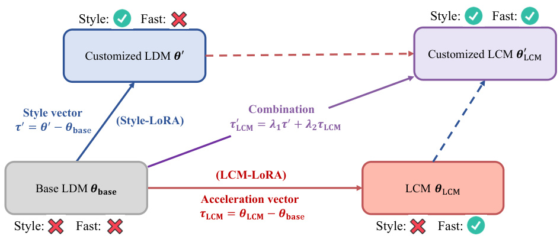
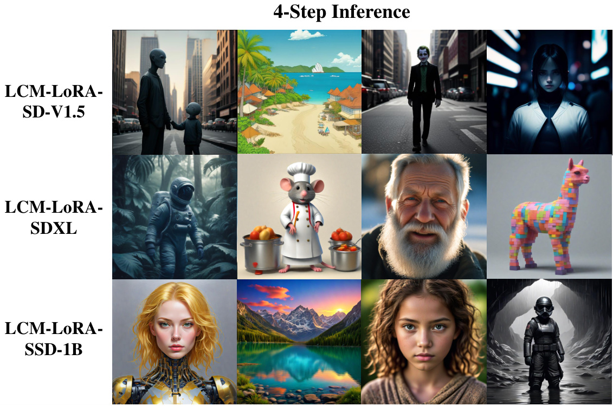
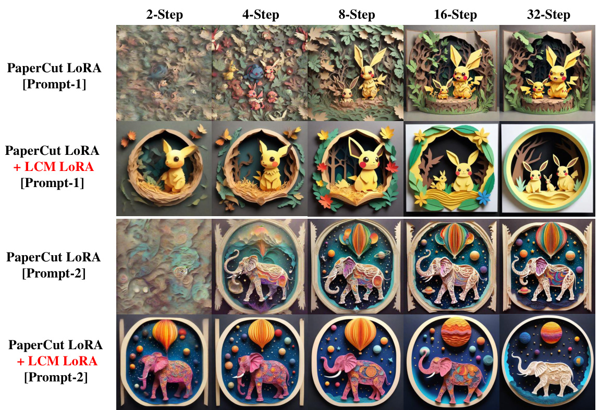

# LCM-L O RA: A U NIVERSAL  S TABLE -D IFFUSION A CCELERATION  M ODULE  

Simian Luo ∗ , Yiqin Tan ∗ , Suraj Patil † , Daniel  $\mathbf{G}\mathbf{u}^{\dagger}$  Patrick von Platen 2 Apolin´ario Passos2Longbo Huang1Jian Li1Hang Zhao11  IIIS, Tsinghua University 2  Hugging Face  

{ luosm22, tyq22 } @mails.tsinghua.edu.cn { suraj, patrick, apolinario } @huggingface.co { dgu8957 } @gmail.com { longbohuang, lijian83, hangzhao } @tsinghua.edu.cn  

# A BSTRACT  

Latent Consistency Models  (LCMs)  (Luo et al., 2023) have achieved impres- sive performance in accelerating text-to-image generative tasks, producing high- quality images with minimal inference steps. LCMs are distilled from pre- trained latent diffusion models (LDMs), requiring only    ${\sim}32$   A100 GPU train- ing hours. This report further extends LCMs’ potential in two aspects: First, by applying LoRA distillation to Stable-Diffusion models including SD-V1.5 (Rombach et al., 2022), SSD-1B (Segmind., 2023), and SDXL (Podell et al., 2023), we have expanded LCM’s scope to larger models with significantly less memory consumption, achieving superior image generation quality. Second, we identify the LoRA parameters obtained through LCM distillation as a  universal Stable-Diffusion acceleration module , named  LCM-LoRA . LCM-LoRA can be directly plugged into various Stable-Diffusion fine-tuned models or LoRAs  with- out training , thus representing a universally applicable accelerator for diverse image generation tasks. Compared with previous numerical PF-ODE solvers such as DDIM (Song et al., 2020), DPM-Solver (Lu et al., 2022a;b), LCM-LoRA can be viewed as a plug-in neural PF-ODE solver that possesses strong gen- eralization abilities. Project page:  https://github.com/luosiallen/ latent-consistency-model .  

  
Figure 1:  Overview of LCM-LoRA. By introducing LoRA into the distillation process of LCM, we signif- icantly reduce the memory overhead of distillation, which allows us to train larger models, e.g., SDXL and SSD-1B, with limited resources. More importantly, LoRA parameters obtained through LCM-LoRA training (‘acceleration vector’) can be directly combined with other LoRA parameters (‘style vetcor’) obtained by fine- tuning on a particular style dataset. Without any training, the model obtained by a linear combination of the acceleration vector and style vetcor acquires the ability to generate images of a specific painting style in mini- mal sampling steps.  

# 1 I NTRODUCTION  

Latent Diffusion Models (LDMs) (Rombach et al., 2022) have been pivotal in generating highly detailed and creative imagery from various inputs such as text and sketches. Despite their success, the slow reverse sampling process inherent to LDMs hampers real-time application, compromising the user experience. Current open-source models and acceleration techniques have yet to bridge the gap to real-time generation on standard consumer GPUs. Efforts to accelerate LDMs generally fall into two categories: the first involves advanced ODE-Solvers, like DDIM (Song et al., 2020), DPM- Solver (Lu et al., 2022a) and DPM-Solver+  $^{\cdot+}$   (Lu et al., 2022b), to expedite the generation process. The second strategy involves distillation of LDMs to streamline their functioning. The ODE-Solver methods, despite reducing the number of inference steps needed, still demand a significant compu- tational overhead, especially when incorporating classifier-free guidance (Ho & Salimans, 2022). Meanwhile, distillation methods such as Guided-Distill (Meng et al., 2023), although promising, face practical limitations due to their intensive computational requirements. The quest for a balance between speed and quality in LDM-generated imagery continues to be a challenge in the field.  

Recently, Latent Consistency Models (LCMs) (Luo et al., 2023) have emerged, inspired by Consis- tency Models (CMs) (Song et al., 2023), as a solution to the slow sampling issue in image genera- tion. LCMs approach the reverse diffusion process by treating it as an augmented probability flow ODE (PF-ODE) problem. They innovatively predict the solution in the latent space, bypassing the need for iterative solutions through numerical ODE-Solvers. This results in a remarkably efficient synthesis of high-resolution images, taking only 1 to 4 inference steps. Additionally, LCMs stand out in terms of distillation efficiency, requiring merely 32 A100 training hours for a minimal-step inference.  

Building on this, Latent Consistency Finetuning (LCF) (Luo et al., 2023) has been developed as a method to fine-tune pre-trained LCMs without starting from the teacher diffusion model. For specialized datasets—like those for anime, photo-realistic, or fantasy images—additional steps are necessary, such as employing Latent Consistency Distillation (LCD) (Luo et al., 2023) to distill a pre-trained LDM into an LCM or directly fine-tuning an LCM using LCF. However, this extra training can be a barrier to the quick deployment of LCMs across diverse datasets, posing the critical question of whether fast, training-free inference on custom datasets is attainable.  

To answer the above question, we introduce  LCM-LoRA , a  universal training-free acceleration module  that can be directly plugged into various Stable-Diffusion (SD) (Rombach et al., 2022) fine- tuned models or SD LoRAs (Hu et al., 2021) to support fast inference with minimal steps. Compared to earlier numerical probability flow ODE (PF-ODE) solvers such as DDIM (Song et al., 2020), DPM-Solver (Lu et al., 2022a), and DPM-Solver++ (Lu et al., 2022b), LCM-LoRA represents a novel class of neural network-based PF-ODE solvers module. It demonstrates robust generalization capabilities across various fine-tuned SD models and LoRAs.  

# 2 R ELATED  W ORK  

Consistency Models Song et al. (2023) have showcased the remarkable potential of consistency models (CMs), a novel class of generative models that enhance sampling efficiency without sacri- ficing the quality of the output. These models employ a consistency mapping technique that deftly maps points along the Ordinary Differential Equation (ODE) trajectory to their origins, thus en- abling expeditious one-step generation. Their research specifically targets image generation tasks on ImageNet 64x64 (Deng et al., 2009) and LSUN 256x256 (Yu et al., 2015), demonstrating CMs’ effectiveness in these domains. Further advancing the field, Luo et al. (2023) has pioneered latent consistency models  (LCMs)  within the text-to-image synthesis landscape. By viewing the guided reverse diffusion process as the resolution of an augmented Probability Flow ODE (PF-ODE), LCMs adeptly predict the solution of such ODEs in latent space. This innovative approach significantly re- duces the need for iterative steps, thereby enabling the rapid generation of high-fidelity images from text inputs and setting a new standard for state-of-the-art performance on LAION-5B-Aesthetics dataset (Schuhmann et al., 2022).  

Parameter-Efficient Fine-Tuning Parameter-Efficient Fine-Tuning (PEFT) (Houlsby et al., 2019) enables the customization of pre-existing models for particular tasks while limiting the number of parameters that need retraining. This reduces both computational load and storage demands. Among the assorted techniques under the PEFT umbrella, Low-Rank Adaptation (LoRA) (Hu et al., 2021) stands out. LoRA’s strategy involves training a minimal set of parameters through the integration of low-rank matrices, which succinctly represent the required adjustments in the model’s weights for fine-tuning. In practice, this means that during task-specific optimization, only these matrices are learned and the bulk of pre-trained weights are left unchanged. Consequently, LoRA significantly trims the volume of parameters to be modified, thereby enhancing computational efficiency and permitting model refinement with considerably less data.  

Task Arithmetic in Pretrained Models Task arithmetic (Ilharco et al., 2022; Ortiz-Jimenez et al., 2023; Zhang et al., 2023) has become a notable method for enhancing the abilities of pre-trained models, offering a cost-effective and scalable strategy for direct edits in weight space. By apply- ing fine-tuned weights of different tasks to a model, researchers can improve its performance on these tasks or induce forgetting by negating them. Despite its promise, the understanding of task arithmetic’s full potential and the principles that underlie it remain areas of active exploration.  

# 3 LCM-L O RA  

# 3.1 L O RA D ISTILLATION FOR  LCM  

The Latent Consistency Model (LCM) (Luo et al., 2023) is trained using a one-stage guided dis- tillation method, leveraging a pre-trained auto-encoder’s latent space to distill a guided diffusion model into an LCM. This process involves solving an augmented Probability Flow ODE (PF-ODE), a mathematical formulation that ensures the generated samples follow a trajectory that results in high-quality images. The distillation focuses on maintaining the fidelity of these trajectories while significantly reducing the number of required sampling steps. The method includes innovations like the Skipping-Steps technique to quicken convergence. The pseudo-code of LCD is provided in Algorithm 1.  

# Algorithm 1  Latent Consistency Distillation (LCD) (Luo et al., 2023)  

Input:  dataset  $\mathcal{D}$  , initial mo eter    $\pmb{\theta}$  , learning r  $\eta$  solver    $\Psi(\cdot,\cdot,\cdot,\cdot)$  ,  stance metric  $d(\cdot,\cdot)$  , EMA rate    $\mu$  , noise schedule  $\alpha(t),\sigma(t)$  , g  $[w_{\mathrm{min}},w_{\mathrm{max}}]$  erval  k , and encoder  $E(\cdot)$  · g training data into latent space:  D  $\mathcal{D}_{z}=\{(z,\mathbf{\bar{c}})|\mathbf{\bar{z}}=E(\mathbf{\bar{x),\bar{(x,\bar{c})\in\mathcal{D}}}}\}$   { |  ∈D}  $\pmb{\theta}^{-}\leftarrow\check{\pmb{\theta}}$  repeat Sample    $(z,c)\sim\mathcal{D}_{z}$   $n\sim\mathcal{U}[1,N-k]$   $\omega\sim\left[\omega_{\operatorname*{min}},\omega_{\operatorname*{max}}\right]$  Sample  $\boldsymbol{z}_{t_{n+k}}\sim\mathcal{N}(\alpha(t_{n+k})\boldsymbol{z};\sigma^{2}(t_{n+k})\mathbf{I})$   $\begin{array}{r l}&{\widehat{\boldsymbol{z}}_{t_{n}}^{\Psi,\omega}\leftarrow\widehat{\boldsymbol{z}}_{t_{n+k}}+(1+\omega)\Psi\big(\boldsymbol{z}_{t_{n+k}},t_{n+k},t_{n},\boldsymbol{c}\big)-\omega\Psi\big(\boldsymbol{z}_{t_{n+k}},t_{n+k},t_{n},\emptyset\big)}\\ &{\mathcal{L}(\pmb{\theta},\pmb{\theta}^{-};\Psi)\leftarrow d\big(\pmb{f_{\theta}}(\boldsymbol{z}_{t_{n+k}},\omega,\boldsymbol{c},t_{n+k}),\pmb{f_{\theta^{-}}}(\widehat{\boldsymbol{z}}_{t_{n}}^{\Psi,\omega},\omega,\boldsymbol{c},t_{n})\big)}\\ &{\pmb{\theta}\leftarrow\pmb{\theta}-\eta\nabla_{\theta}\mathcal{L}(\pmb{\theta},\pmb{\theta}^{-})}\\ &{\theta^{-}\leftarrow\mathrm{stopgrad}(\mu\pmb{\theta}^{-}+(1-\mu)\pmb{\theta})}\end{array}$  until  convergence  

Since the distillation process of Latent Consistency Models (LCM) is carried out on top of the parameters from a pre-trained diffusion model, we can consider latent consistency distillation as a fine-tuning process for the diffusion model. This allows us to employ parameter-efficient fine- tuning methods, such as LoRA (Low-Rank Adaptation) (Hu et al., 2021). LoRA updates a pre- trained weight matrix by a position e    $\mathbf{\dot{}}W_{0}\in\mathbb{R}^{\hat{d}\times k}$  , xpressed as  $W_{0}+\Delta W\,=\,W_{0}+B A$  , where  $B\,\in\,\mathbb{R}^{d\times r}$   ∈ ,  A  $\breve{A}\in\mathbb{R}^{r\times k}$   ∈ , and th rank  $r\leq\operatorname*{min}(d,k)$  ≤ . During training,  $W_{0}$   is kept onstant, and gradient updates are applied only to  A  and  $B$  . The modified forward pass for an input  x  is:  

$$
h=W_{0}x+\Delta W x=W_{0}x+B A x.
$$  

In this equation,    $h$   represents the output vector, and the outputs of    $W_{0}$   and    $\Delta W=B A$   are added together after being multiplied by the input  $x$  . By decomposing the full parameter matrix into the product of two low-rank matrices, LoRA significantly reduces the number of trainable parameters, thereby lowering memory usage. Table 3.1 compares the total number of parameters in the full  

  
Figure 2:  Images generated using latent consistency models distilled from different pretrained diffusion mod- els. We generate  $512\!\times\!512$   resolution images with LCM-LoRA-SD-V1.5 and   $1024\!\times\!1024$   resol ges with LCM-LoRA-SDXL and LCM-LoRA-SSD-1B. We use a fixed classifier-free guidance scale  $\omega=7.5$   for all models during the distillation process. All images were obtained by 4-step sampling .  

model with the trainable parameters when using the LoRA technique. It is evident that by incorpo- rating the LoRA technique during the LCM distillation process, the quantity of trainable parameters is significantly reduced, effectively decreasing the memory requirements for training.  

  

Table 1: Full parameter number and trainable parameter number with LoRA for SD-V1.5 (Rombach et al., 2022), SSD-1B (Segmind., 2023) and SDXL (Podell et al., 2023).  

Luo et al. (2023) primarily distilled the base stable diffusion model, such as SD-V1.5 and SD-V2.1. We extended this distillation process to more powerful models with enhanced text-to-image capa- bilities and larger parameter counts, including SDXL (Podell et al., 2023) and SSD-1B (Segmind., 2023). Our experiments demonstrate that the LCD paradigm adapts well to larger models. The generated results of different models are displayed in Figure 2.  

# 3.2 LCM-L O RA  AS  U NIVERSAL  A CCELERATIION  M ODULE  

Based on parameter-efficient fine-tuning techniques, such as LoRA, one can fine-tune pretrained models with substantially reduced memory requirements. Within the framework of LoRA, the re- sultant LoRA parameters can be seamlessly integrated into the original model parameters. In Sec- tion 3.1, we demonstrate the feasibility of employing LoRA for the distillation process of Latent Consistency Models (LCMs). On the other hand, one can fine-tune on customized datasets for spe- cific task-oriented applications. There is now a broad array of fine-tuning parameters available for selection and utilization. We discover that the LCM-LoRA parameters can be directly combined with other LoRA parameters fine-tuned on datasets of particular styles. Such an amalgamation yields a model capable of generating images in specific styles with minimal sampling steps, without  

  
Figure 3:  The generation results of the specific style LoRA parameters and the combination with LCM- LoRA parameters. We use SDXL as the base model. All images are   $1024\!\times\!1024$   resolution. We select LoRA parameters fine-tuned on specific painting style datasets and combine them with LCM-LoRA parameters. We compare the quality of images generated by these models at different sampling steps. For the original LoRA parameters, we use DPM-Solver+  $^{+}$   (Lu et al., 2022b) sampler and classifier-free guidance scale    $\omega\:=\:7.5$  . For the parameters obtained after combining LCM-LoRA with specific style LoRA, we use LCM’s multi-step sampler. We use    $\lambda_{1}=0.8$   and    $\lambda_{2}=1.0$   for the combination.  

the need for any further training. As shown in Figure 1, denote the LCM-LoRA fine-tuned param- eters as  $\boldsymbol{\tau_{\mathrm{LCM}}}$  , which is identified as the “acceleration vector”, and the LoRA parameters fine-tuned on customized dataset as  $\tau^{\prime}$  , which is the “style vector”, we find that an LCM which generates customized images can be obtained as  

$$
\begin{array}{r}{\pmb{\theta}_{\mathrm{LCM}}^{\prime}=\pmb{\theta}_{\mathrm{pre}}+\pmb{\tau}_{\mathrm{LCM}}^{\prime},}\end{array}
$$  

where  

$$
\tau_{\mathrm{LCM}}^{\prime}=\lambda_{1}\pmb{\tau}^{\prime}+\lambda_{2}\pmb{\tau}_{\mathrm{LCM}}
$$  

is the linear combination of acceleration vector  $\boldsymbol{\tau_{\mathrm{LCM}}}$   and style vector  $\tau^{\prime}$  . Here    $\lambda_{1}$   and    $\lambda_{2}$   are hy- perparameters. The generation results of the specific style LoRA parameters and their combination with LCM-LoRA parameters are shown in Figure 3. Note that we do not make further training on the combined parameters.  

# 4 C ONCLUSION  

We present LCM-LoRA, a universal training-free acceleration module for Stable-Diffusion (SD). LCM-LoRA can serve as an independent and efficient neural network-based solver module to pre- dict the solution of PF-ODE, enabling fast inference with minimal steps on various finetuned SD models and SD LoRAs. Extensive experiments on text-to-image generation have demonstrated LCM-LoRA’s strong generalization capabilities and superiority.  

# 5 C ONTRIBUTION  & A CKNOWLEDGEMENT  

This work builds upon Simian Luo and Yiqin Tan’s Latent Consistency Models (LCMs) (Luo et al., 2023). Based on LCMs, Simian Luo wrote the original LCM-SDXL distillation code, and together with Yiqin Tan, primarily completed this technical report. Yiqin Tan discovered the arithmetic prop- erty of LCM parameters. Suraj Patil first completed the training of LCM-LoRA, discovering its strong generalization abilities, and conducted most of the training. Suraj Patil and Daniel Gu con- ducted excellent refactoring of the original LCM-SDXL codebase and improved training efficiency, seamlessly integrating it into the Diffusers library. Patrick von Platen revised and polished this tech- nical report, as well as integrating LCM into the Diffusers library. Longbo Huang, Jian Li, Hang Zhao co-advised the original LCMs paper, and polished this technical report. We further thanks Apolin´ ario Passos and Patrick von Platen for making excellent LCMs demo and deployment. We also want to thank Sayak Paul and Pedro Cuenca for helping with writing documentation as well as Radam´ es Ajna for creating demos. We appreciate the computing resources provided by the Hugging Face Diffusers teams to support our experiments. Finally, we value the insightful discussions from LCM community members.  

# R EFERENCES  

Jia Deng, Wei Dong, Richard Socher, Li-Jia Li, Kai Li, and Li Fei-Fei. Imagenet: A large-scale hi- erarchical image database. In  2009 IEEE conference on computer vision and pattern recognition ,  

pp. 248–255. Ieee, 2009. Jonathan Ho and Tim Salimans. Classifier-free diffusion guidance. arXiv preprint arXiv:2207.12598 , 2022. Neil Houlsby, Andrei Giurgiu, Stanislaw Jastrzebski, Bruna Morrone, Quentin De Laroussilhe, An- drea Gesmundo, Mona Attariyan, and Sylvain Gelly. Parameter-efficient transfer learning for nlp. In  International Conference on Machine Learning , pp. 2790–2799. PMLR, 2019. Edward J Hu, Yelong Shen, Phillip Wallis, Zeyuan Allen-Zhu, Yuanzhi Li, Shean Wang, Lu Wang, and Weizhu Chen. Lora: Low-rank adaptation of large language models. arXiv preprint arXiv:2106.09685 , 2021. Gabriel Ilharco, Marco Tulio Ribeiro, Mitchell Wortsman, Suchin Gururangan, Ludwig Schmidt, Hannaneh Hajishirzi, and Ali Farhadi. Editing models with task arithmetic. arXiv preprint arXiv:2212.04089 , 2022. Cheng Lu, Yuhao Zhou, Fan Bao, Jianfei Chen, Chongxuan Li, and Jun Zhu. Dpm-solver: A fast ode solver for diffusion probabilistic model sampling in around 10 steps.  arXiv preprint arXiv:2206.00927 , 2022a. Cheng Lu, Yuhao Zhou, Fan Bao, Jianfei Chen, Chongxuan Li, and Jun Zhu. Dpm-solver++: Fast solver for guided sampling of diffusion probabilistic models.  arXiv preprint arXiv:2211.01095 , 2022b. Simian Luo, Yiqin Tan, Longbo Huang, Jian Li, and Hang Zhao. Latent consistency models: Synthe- sizing high-resolution images with few-step inference.  arXiv preprint arXiv:2310.04378 , 2023. Chenlin Meng, Robin Rombach, Ruiqi Gao, Diederik Kingma, Stefano Ermon, Jonathan Ho, and Tim Salimans. On distillation of guided diffusion models. In  Proceedings of the IEEE/CVF Conference on Computer Vision and Pattern Recognition , pp. 14297–14306, 2023. Guillermo Ortiz-Jimenez, Alessandro Favero, and Pascal Frossard. Task arithmetic in the tangent space: Improved editing of pre-trained models.  arXiv preprint arXiv:2305.12827 , 2023. Dustin Podell, Zion English, Kyle Lacey, Andreas Blattmann, Tim Dockhorn, Jonas M¨ uller, Joe Penna, and Robin Rombach. Sdxl: improving latent diffusion models for high-resolution image synthesis.  arXiv preprint arXiv:2307.01952 , 2023. Robin Rombach, Andreas Blattmann, Dominik Lorenz, Patrick Esser, and Bj¨ orn Ommer. High- resolution image synthesis with latent diffusion models. In  Proceedings of the IEEE/CVF Con- ference on Computer Vision and Pattern Recognition , pp. 10684–10695, 2022.  

Christoph Schuhmann, Romain Beaumont, Richard Vencu, Cade Gordon, Ross Wightman, Mehdi Cherti, Theo Coombes, Aarush Katta, Clayton Mullis, Mitchell Wortsman, et al. Laion-5b: An open large-scale dataset for training next generation image-text models. arXiv preprint arXiv:2210.08402 , 2022. Segmind. Announcing ssd-1b: A leap in efficient t2i generation. https://blog.segmind.com/introducing-segmind-ssd-1b/, 2023. Jiaming Song, Chenlin Meng, and Stefano Ermon. Denoising diffusion implicit models.  arXiv preprint arXiv:2010.02502 , 2020. Yang Song, Prafulla Dhariwal, Mark Chen, and Ilya Sutskever. Consistency models.  arXiv preprint arXiv:2303.01469 , 2023. Fisher Yu, Ari Seff, Yinda Zhang, Shuran Song, Thomas Funkhouser, and Jianxiong Xiao. Lsun: Construction of a large-scale image dataset using deep learning with humans in the loop.  arXiv preprint arXiv:1506.03365 , 2015. Jinghan Zhang, Shiqi Chen, Junteng Liu, and Junxian He. Composing parameter-efficient modules with arithmetic operations.  arXiv preprint arXiv:2306.14870 , 2023.  