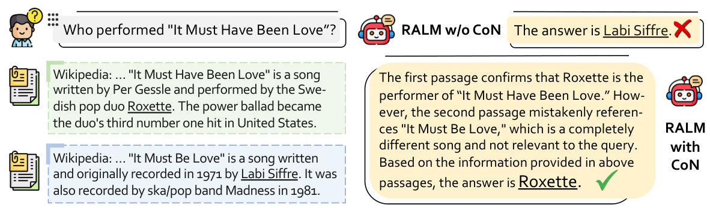
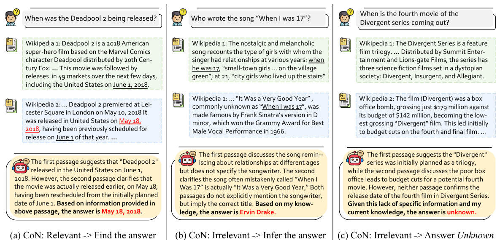
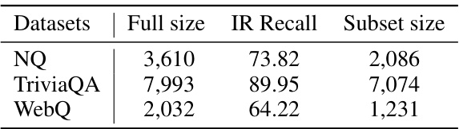
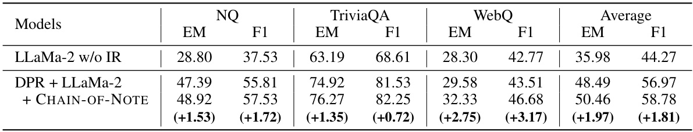
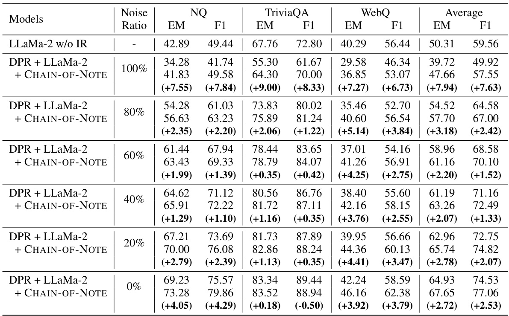
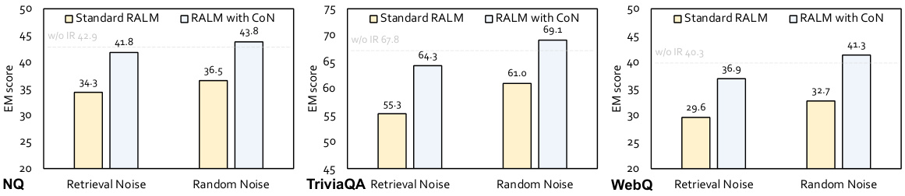
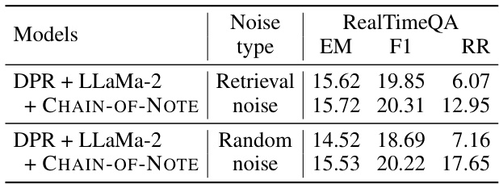

# C HAIN - OF -N OTE : E NHANCING  R OBUSTNESS IN R ETRIEVAL -A UGMENTED  L ANGUAGE  M ODELS  

Wenhao Yu, Hongming Zhang, Xiaoman Pan, Kaixin Ma, Hongwei Wang, Dong Yu Tecent AI Lab, Seattle wenhaowyu@global.tencent.com  

# A BSTRACT  

Retrieval-augmented language models (RALMs) represent a substantial advance- ment in the capabilities of large language models, notably in reducing factual hallucination by leveraging external knowledge sources. However, the reliability of the retrieved information is not always guaranteed. The retrieval of irrelevant data can lead to misguided responses, and potentially causing the model to overlook its inherent knowledge, even when it possesses adequate information to address the query. Moreover, standard RALMs often struggle to assess whether they possess adequate knowledge, both intrinsic and retrieved, to provide an accurate answer. In situations where knowledge is lacking, these systems should ideally respond with “unknown” when the answer is unattainable. In response to these challenges, we introduces C HAIN - OF -N OTING  (C O N), a novel approach aimed at improving the robustness of RALMs in facing noisy, irrelevant documents and in handling unknown scenarios. The core idea of C O N is to generate sequential reading notes for retrieved documents, enabling a thorough evaluation of their relevance to the given question and integrating this information to formulate the final answer. We employed ChatGPT to create training data for C O N, which was subsequently trained on an LLaMa-2 7B model. Our experiments across four open-domain QA benchmarks show that RALMs equipped with C O N significantly outperform standard RALMs. Notably, C O N achieves an average improvement of  $+7.9$   in EM score given entirely noisy retrieved documents and  $+10.5$   in rejection rates for real-time questions that fall outside the pre-training knowledge scope.  

# 1 I NTRODUCTION  

Retrieval-augmented language models (RALMs) represent a novel framework that significantly advances large language models ( Touvron et al. ,  2023 ;  OpenAI ,  2023 ) by addressing key limitations such as reducing factual hallucinations ( Ji et al. ,  2023 ;  Zhang et al. ,  2023a ), injecting up-to-date knowledge in a plug-and-play manner ( Dhingra et al. ,  2022 ;  Vu et al. ,  2023 ), and enhancing domain- specific expertise ( Li et al. ,  2023 ;  Qin et al. ,  2023 ). These enhancements primarily stem from integrating large language models (LLMs) with external knowledge sources ( Guu et al. ,  2020 ;  Lewis et al. ,  2020 ;  Borgeaud et al. ,  2022 ;  Shi et al. ,  2023c ). In a typical RALM setup, a query is first processed by a retriever that searches a vast evidence corpus for pertinent documents. A reader then examines these documents, extracting useful information and formulating the final output answer. The potential benefit of the RALM framework is its ability to integrate relevant external knowledge, thereby enriching the LLMs’ understanding of input text and generating answers based on this information. This is particularly beneficial when LLMs lack direct knowledge of a subject, allowing them to acquire and utilize relevant information in a plug-and-play manner ( Yu et al. ,  2022b ).  

However, there exist several issues with the current RALM framework. First, there is no guarantee that the information retrieval (IR) system will always yield the most pertinent or trustworthy information. The retrieval of irrelevant data can lead to misguided responses ( Shi et al. ,  $2023\mathrm{a}$  ;  Yoran et al. , 2023 ), and potentially causing the model to overlook its inherent knowledge, even when it possesses adequate information to address the query ( Mallen et al. ,  2023 ). Secondly, state-of-the-art LLMs often hallucinate when addressing fact-oriented questions, a deficiency that can be risky and may discourage users ( Ji et al. ,  2023 ;  Zhang et al. ,  2023a ). Ideally, an intelligent system should be capable of determining whether it has enough knowledge, both intrinsic and retrieved, to provide an accurate  

  
Figure 1: Compared with the current RALMs, the core idea behind C HAIN - OF -N OTE  (C O N) is to generate sequential reading notes for the retrieved documents, ensuring a systematic assessment of their relevance to the input question before formulating a final response.  

answer. In cases where knowledge is insufficient, the system should respond with “unknown” when the answer cannot be determined. Based on the shortcomings of the standard RALM system, in this paper, we aims to improve the robustness of RALMs, mainly focusing on two pivotal aspects:  

(1) Noise Robustness:  The ability of a RALM to discern and disregard noisy information present in irrelevant retrieved documents, while appropriately leveraging its intrinsic knowledge.  

(2) Unknown Robustness:  The capacity of a RALM to acknowledge its limitations by responding with “unknown” when given a query it does not have the corresponding knowledge to answer,  and the relevant information is not found within the retrieved documents.  

In this work, we introduce a novel framework named  CHAIN - OF - NOTING  (C O N), designed to enhance the robustness of RALMs. The cornerstone of C O N is to generate a series of reading notes for retrieved documents, enabling a comprehensive assessment of their relevance to the input query. This approach not only evaluates each document’s pertinence but also pinpoints the most critical and reliable information therein. This process effectively filters out irrelevant or less credible content, leading to responses that are more precise and contextually relevant, as exemplified in Figure  1 . Besides, C O N enhances the capability of RALM to handle queries fall outside the scope of their training data. In cases where the retrieved documents do not provide any relevant information, C O N can guide the model to acknowledge its limitations and respond with an “unknown” or provide the best possible explanation based on available data, enhancing the model’s reliability.  

To validate the effectiveness of the C O N idea, we first prompt ChatGPT ( OpenAI ,  2023 ) to generate a 10K training data based on questions collected from Natural Questions (NQ) ( Kwiatkowski et al. ,  2019 ). Subsequently, we trained a LLaMa-2 7B model to incorporate the note-taking ability integral to C O N. Our evaluation of the RALM, integrated with C O N and compared to the standard RALM system, focused on three major aspects: (1) overall QA performance using DPR-retrieved documents, (2) noise robustness, assessed by introducing noisy information to the system, and (3) unknown robustness, evaluated through queries not covered in the LLaMa-2 pre-training data, i.e., real-time questions. The evaluations were conducted on the NQ and three additional out-of-domain open-domain QA datasets, namely TriviaQA ( Joshi et al. ,  2017 ), WebQ ( Berant et al. ,  2013 ), and RealTimeQA ( Kasai et al. ,  2023 ). Our experiments demonstrate that C HAIN - OF -N OTE  (C O N) not only improves overall QA performance when employed with DPR-retrieved documents but also significantly enhances robustness in both noise and unknown aspects. This includes a   $+7.9$   increase in accuracy (measured by the exact match score) with noisy retrieved documents, and a  $+10.5$   increase in the rejection rate for real-time questions that are beyond the pre-training knowledge scope.  

# 2 R ELATED  W ORK  

# 2.1 R ETRIEVAL -A UGMENTED  L ANGUAGE  M ODELS  

Retrieval-Augmented Language Models (RALMs) represent a significant advancement in natural language processing, combining the power of large language models with the specificity and detail provided by external knowledge sources ( Guu et al. ,  2020 ;  Lewis et al. ,  2020 ;  Izacard et al. ,  2022 ). These models first leverage a retriever to scan a vast evidence corpus, such as Wikipedia, to identify a set of documents pertinent to the user’s query. Following this, a reader component is employed to meticulously analyze these documents and formulate a response. This two-pronged approach ensures both relevance and depth in the generated answers. Recent follow-up work has mainly focused on improving the retriever ( Karpukhin et al. ,  2020 ;  Qu et al. ,  2021 ;  Sachan et al. ,  2022 ;  Ma et al. ,  2023 ) or the reader ( Izacard & Grave ,  2021 ;  Cheng et al. ,  2021 ;  Yu et al. ,  2022a ), training the system end-to-end ( Lewis et al. ,  2020 ;  Singh et al. ,  2021 ), and integrating the retrieval systems with large-scale black-box language models ( Yu et al. ,  2023a ;  Shi et al. ,  2023c ;  Yu et al. ,  2023b ;  Trivedi et al. ,  2023 ). Another line of RALMs such as kNN-LM ( Khandelwal et al. ,  2020 ;  Zhong et al. ,  2022 ) retrieves a set of tokens and interpolates between the next token distribution and kNN distributions computed from the retrieved tokens at inference. The evolution has also led to the emergence and popularity of retrieval-augmented products, such as ChatGPT plugin, Langchain, and New Bing.  

Robustness of RALMs.  Recent studies highlight the impact of context relevance on language model performance ( Creswell et al. ,  2022 ;  Shi et al. ,  2023a ;  Yoran et al. ,  2023 ). Notably,  Creswell et al. ( 2022 ) demonstrated that incorporating random or irrelevant contexts could adversely affect QA performance. In contrast,  Shi et al.  ( 2023a ) discovered that adding irrelevant context to exemplars or task-specific instructions can sometimes enhance model performance, implying that models might intrinsically possess capabilities, developed during pre-training, to manage such scenarios. Most pertinent to our research is the study by  Yoran et al.  ( 2023 ), which focused on training RALMs to disregard irrelevant contexts. This approach, while distinct from our proposed solution, underscores the importance of context relevance in enhancing the effectiveness of RALMs.  

# 2.2CHAIN-OF-X APPROACHES IN LARGE LANGUAGE MODELS  

Recent research shows that large language models (LLMs) are capable of decomposing complex problems into a series of intermediate steps, pioneered by the concept of Chain-of-Thought (CoT) prompting ( Wei et al. ,  2022 ;  Kojima et al. ,  2022 ). The CoT approach mirrors human problem-solving methods, where complex issues are broken down into smaller components. By doing so, LLMs can tackle each segment of a problem with focused attention, reducing the likelihood of overlooking critical details or making erroneous assumptions. This sequential breakdown makes the reasoning process more transparent, allowing for easier identification and correction of any logical missteps.  

The CoT methodology has been effectively applied in various contexts, including multi-modal reasoning ( Zhang et al. ,  2023b ), multi-lingual scenarios ( Shi et al. ,  2023b ), and knowledge-driven applications ( Wang et al. ,  2023b ). And additionally, there has been a surge in the development of other chain-of-X methods, addressing diverse challenges in LLM applications. These include chain-of-explanation ( Huang et al. ,  2023 ), chain-of-knowledge ( Wang et al. ,  2023a ), chain-of- verification ( Dhuliawala et al. ,  2023 ) and IR chain-of-thought ( Trivedi et al. ,  2023 ). For instance, Chain-of-Verification ( Dhuliawala et al. ,  2023 ) generates an initial response, formulates verification questions, and revises the response based on these questions, reducing factual errors and hallucina- tions in the response. Closely related to our work is IR chain-of-thought ( Trivedi et al. ,  2023 ), which employs CoT to infer and supplement unretrieved information, thereby improving the accuracy of complex reasoning tasks. While chain-of-  ${\bf\nabla}\cdot{\bf X}$   approaches have shown promise in enhancing LLMs’ performance across various domains, their application in RALMs, particularly for improving robust- ness in noisy and unknown scenarios, is relatively unexplored. This gap signifies further research in applying these strategies to augment RALMs, thereby enhancing their robustness and reliability.  

# 3 P ROPOSED  M ETHOD  

# 3.1 O VERVIEW  

In this section, we introduce C HAIN - OF -N OTE , an innovative advancement for retrieval-augmented language models (RALMs). Specifically, C O N framework generates sequential reading notes for the retrieved documents, which enables a systematic evaluation of the relevance and accuracy of information retrieved from external documents. By creating sequential reading notes, the model not only assesses the pertinence of each document to the query but also identifies the most critical and reliable pieces of information within these documents. This process helps in filtering out irrelevant or less trustworthy content, leading to more accurate and contextually relevant responses.  

  

Figure 2: Illustration of the C HAIN - OF -N OTE  (C O N) framework with three distinct types of reading notes. Type (a) depicts the scenario where the language model identifies a document that directly answers the query, leading to a final answer formulated from the retrieved information. Type (b) represents situations where the retrieved document, while not directly answering the query, provides contextual insights, enabling the language model to integrate this context with its inherent knowledge to deduce an answer. Type (c) illustrates instances where the language model encounters irrelevant documents and lacks the necessary knowledge to respond, resulting in an “unknown” answer. This figure exemplifies the CoN framework’s capability to adaptively process information, balancing direct information retrieval, contextual inference, and the recognition of its knowledge boundaries.  

# 3.2 B ACKGROUND OF  E XISTING  RALM S  

RALMs signify a transformative development in language models, enhancing their output by incor- porating external knowledge. These models operate by introducing an auxiliary variable, denoted as  $d$  , which represents retrieved documents. This inclusion allows them to consider a range of possible documents, thereby producing responses that are more informed and precise ( Lazaridou et al. ,  2022 ; Shi et al. ,  2023c ). The RALM  odels can be represented as  $\begin{array}{r}{p(y|x)=\sum_{i}p(y|d_{i},x)p(d_{i}|x)}\end{array}$  | | . Here,  $x$  represents the input query, and  y  signifies the model’s generated response. In practice, it is infeasible to compute the sum over all possible documents due to the vast number of potential sources. Con- sequently, the most common approach involves approximating the sum over  $d$   using the  $k$   highest ranked documents, and providing all these documents as part of the input. We assume, w.l.o.g., that these documents are    $[d_{1},.\,.\,.\,,d_{k}]$  , yielding  $\begin{array}{r}{p(y|x)=\sum_{i=1}^{k}p(y|d_{i},x)p(d_{i}|x)}\end{array}$  .  

However, the existing RALMs suffer from several limitations:  

•  Risk of Surface-Level Processing: When directly generating an answer, language models might rely on surface-level information without deep comprehension. Thus, language models could easily overlook the nuances of question or documents, particularly in complex or indirect questions.  

•  Difficulty in Handling Contradictory Information: When faced with documents containing contra- dictory information, directly generating an answer becomes challenging. The model may struggle to resolve these contradictions or to determine which piece of information is more credible or relevant. •  Reduced Transparency and Interpret ability: Direct answer generation offers limited insight into how the model arrived at its conclusion. This lack of transparency makes it challenging for users to understand the basis of the model’s conclusions.  

•  Overdependence on Retrieved Documents: Direct generation can lead to an overreliance on the content of the retrieved documents (i.e. tendency to extract information from retrieved documents ( Shi et al. ,  2023a )), ignoring the model’s inherent knowledge base. This can be particularly limiting when the retrieved documents are noisy or out-of-date.  

# 3.3 T HE  C HAIN - OF -N OTE  F RAMEWORK  

The C HAIN - OF -N OTE  (C O N) framework presents a solution to the challenges faced by retrieval- augmented language models (RALMs). This framework significantly enhances the ability of RALMs to critically assess retrieved documents through a structured note-taking process. Specifically, it involves generating concise and contextually relevant summaries or notes for each document. This method allows the model to systematically evaluate the relevance and accuracy of information drawn from external documents. By creating sequential reading notes, C O N not only assesses the pertinence of each document to the query but also pinpoints the most reliable information and resolves conflicting information. This approach effectively filters out irrelevant or less trustworthy content, leading to responses that are both more accurate and contextually relevant.  

Given an input question    $x$   and  $k$   retrieve  $[d_{1},\cdot\cdot\cdot\ ,d_{k}]$  he model aims to generate tex ual outputs comprising multiple segments  $\left[y_{d_{1}},\cdot\cdot\cdot,y_{d_{k}},y\right]$   · · · . Here,  $y_{d_{i}}$   s ifies the tokens for the  i -th i segment, representing the reading note for the corresponding document  $d_{i}$  , as shown in Figure  2 . After generating individual reading notes, the model synthesizes the information to create a consolidated final response  $y$  . The implementation of the C HAIN - OF -N OTE  (C O N) involves three key steps: (1) designing the notes  $y_{d_{i}}$  , (2) collecting the data, and (3) training the model.  

# 3.3.1 N OTES  D ESIGN  

The framework primarily constructs three types of reading notes, as shown in Figure  2  , based on the relevance of the retrieved documents to the input question: First, when a document directly answers the query, the model formulates the final response based on this information, as shown in Figure  2 (a). Second, if the retrieved document does not directly answer the query but provides useful context, the model leverages this information along with its inherent knowledge to deduce an answer, as shown in Figure  2 (b). Third, in cases where the retrieved documents are irrelevant, and the model lacks sufficient knowledge to answer, it defaults to responding with “unknown”, as shown in Figure  2 (c). This nuanced approach mirrors human information processing, striking a balance between direct retrieval, inferential reasoning, and the acknowledgment of knowledge gaps.  

# 3.3.2 D ATA  C OLLECTION  

To equip the model with the ability to generate such reading notes, it’s essential to gather appropriate training data. Manual annotation for each reading note is resource-intensive, so we employ a state-of- the-art language model – ChatGPT – to generate the notes data. This method is both cost-effective and enhances reproducibility. We initiate this process by randomly sampling 10k questions from the NQ ( Kwiatkowski et al. ,  2019 ) training dataset. ChatGPT is then prompted with specific instructions and in-context examples to the three distinct types of note generation (detailed in Appendix  A.3 ). The quality of ChatGPT’s predictions is subsequently assessed through human evaluations on a small subset of the data before proceeding to the entire set. The NQ dataset is chosen as our primary dataset due to its diverse range of real user queries from search engines. However, to ensure the model’s adaptability, we also test its performance on three additional open-domain datasets, including TriviaQA, WebQ, and RealTimeQA, showing its generalization capabilities to out-of-domain data.  

# 3.3.3 M ODEL  T RAINING  

After collecting 10K training data from ChatGPT, the next step is to use them to train our C HAIN - OF -N OTE  model, which is based on an open-source LLaMa-2 7B ( Touvron et al. ,  2023 ) model. To do this, we concatenate the instruction, question and documents as a prompt and train the model to generate notes and answer in a standard supervised way. Our in-house LLaMa-2 7B model learns to sequentially generate reading notes for each document to assess their relevance to the input query. Responses are generated based on the document’s relevance, enhancing accuracy and reducing misinformation. For irrelevant documents, the model either relies on inherent knowledge for an answer or responds with “unknown” if the answer cannot be determined.  

Weighted Loss on Notes and Answers.  A unique aspect of our training approach is the implementa- tion of a weighted loss strategy. This involves varying the loss weights assigned to reading notes and answers. In our preliminary studies, We observed that assigning equal loss to both components can reduce the quality of the final answer and prolong the training time for convergence. This issue arises mainly because notes, being lengthier, contribute disproportionately to the loss. To overcome the drawback, we alternate the focus of the loss function:  $50\%$   of the time, the next token prediction loss is computed on the entire notes and answer sequence    $\left[y_{d_{1}},\cdot\cdot\cdot\ ,y_{d_{k}},y\right]$  , a d the remaining   $50\%$   of the time, the next token prediction loss is calculated solely on the answer  y . This strategy is designed to ensure that while the model learns to generate contextually rich reading notes, the primary focus remains on the accuracy and reliability of the final answer.  

# 4 E XPERIMENTS  

4.1 E XPERIMENTAL  S ETTINGS AND  E VALUATIONS  

# 4.1.1 D ATASETS AND  S PLITS  

We conducted comprehensive experiments us- ing three benchmark datasets in open-domain question answering (QA): NQ ( Kwiatkowski et al. ,  2019 ), TriviaQA ( Joshi et al. ,  2017 ), and WebQ ( Berant et al. ,  2013 ), with further details provided in Appendix  A.1 . Additionally, we em- ployed RealTimeQA ( Kasai et al. ,  2023 ) as a spe- cial case to evaluate “unknown” robustness.  

  
Table 1: Dataset statistics. The recall evaluation is based on DPR retrieval on the full test set..  

The evaluation was conducted based on two evaluations sets:  full set and subset evaluation.  Firstly, akin to traditional open-domain QA evaluation, we assessed the models using all questions from the test set to evaluate the  overall QA performance . The documents were retrieved using DPR, and the top-  $\cdot k$   documents were fed into the generator. We adhered to the same test splits for the open-domain QA setting as used by  Izacard & Grave  ( 2021 );  Karpukhin et al.  ( 2020 ). For TriviaQA, evaluations from LLaMa-2 ( Touvron et al. ,  2023 ) were conducted on the Wikipedia dev set comprising 7,993 examples. Therefore, we also follow the same evaluation on this dev set to facilitate comparisons with their performance. Secondly, to assess the model’s  noise robustness and unknown robustness , we extracted subsets from the above test sets that contained relevant documents in the retrieved list. We then enumerated each retrieved document to determine if it was a golden document for the given question. Based on the noise ratio  $r$  , for instance, if the top-  $\cdot k$   documents are needed for the generator, then  $k\cdot r$   would be the number of noisy document d  $k\cdot(1-r)$   would be the number of relevant documents. For example, when noise ratio is 20% and top-5 documents are needed, then 4 are relevant documents, and 1 is irrelevant documents. During the enumeration of the retrieved documents, we populated two lists; when one list reached its limit, we stopped adding more documents to that list until both lists were complete. In instances where no relevant documents are retrieved by the DPR for certain questions, we exclude these from robustness evaluation. Therefore, the subset is smaller than the original test set, as shown in Table  1 .  

# 4.1.2BASELINE METHODS  

For fair comparability, we trained all models using the same training set, with the main difference being in the input and output formats. As outlined in the methods section, we denote an input question as  $x$   and its corresponding answer as  $y$  . Besides,  $d_{i}$   represents the  $i$  -th retrieved document, and  $y_{d_{i}}$   is the associated reading note for that document. Here we show the difference of methods to compare.  

LLaMa-2 w/o IR : This model is trained to directly generate an answer from the input question, without relying on any extern  retrieved information. Essentially, it learns the function    $f:x\rightarrow y$  , transforming a given question  x  directly into an answer    $y$  .  

$\mathbf{DPR}+\mathbf{LLa}\mathbf{Ma}.2$  : This approach trains the model to generate an answer not only from the question but also by incorporating retrieve  documents. It learns the funct  $f\,:\,\{x,d_{1},\cdot\cdot\cdot\,,d_{k}\}\,\rightarrow\,y$  , meaning it transforms the question  x  and a set of retrieved documents  {  $\{d_{1},\cdot\cdot\cdot\ ,d_{k}\}$   · · · }  into an answer  y .  

$\mathbf{DPR}+\mathbf{LLa}\mathbf{Ma}.2$   with C HAIN - OF -N OTE : In this model, the training process involves generating reading notes for each retrieved document before formulating the final answer. It learns the function  $f:\{x,d_{1},\cdot\cdot\cdot,d_{k}\}\rightarrow\{y_{d_{1}},\cdot\cdot\cdot,y_{d_{k}},y\}$  , thereby enabling  ocess the question  $x$   a d retrieved documents  $\{d_{1},\cdot\cdot\cdot\ ,d_{k}\}$   to produce reading notes  $\{y_{d_{1}},\cdot\cdot\cdot\ ,y_{d_{k}}\}$   and the final answer  y .  

  

  
Table 3: Evaluation on Noise Robustness. The C HAIN - OF -N OTE  framework shows superior perfor- mance compared to the standard RALM system, particularly notable at higher noise ratios.  

# 4.1.3 E VALUATION  M ETRICS  

For the evaluation of open-domain QA performance, we have employed two widely recognized metrics: Exact Match (EM) and F1 score, as suggested by prior work in the  Chen et al.  ( 2017 ); Karpukhin et al.  ( 2020 );  Zhu et al.  ( 2021 ). For EM score, an answer is deemed correct if its normalized form – obtained through the normalization procedure delineated by  Karpukhin et al. ( 2020 ) – corresponds to any acceptable answer in the provided list. Similar to EM score, F1 score treats the prediction and ground truth as bags of tokens, and compute the average overlap between the prediction and ground truth answer ( Chen et al. ,  2017 ). Besides, we use reject rate (RR) to evaluate the unknown robustness when given questions beyond a language model’s knowledge scope.  

# 4.2 E VALUATION ON  O VERALL  QA P ERFORMANCE  

In our evaluation, we compared our method and various baselines across three open-domain QA benchmarks, as detailed in Table  2 . We noted that RALM   $(\mathrm{DPR}+\mathrm{LLa}\mathrm{Ma}–2)$  ) with retrieval func- tionality consistently outperformed LLaMa-2 without retrieval. This improvement is closely tied to the effectiveness of the retrieval process. As indicated in Table  1 , DPR demonstrates markedly superior retrieval performance on the NQ and TriviaQA datasets compared to WebQ. Consequently, the benefits of retrieval are more pronounced on NQ and TriviaQA.  

Furthermore, when comparing our enhanced RALM, which integrates C O N, with the standard RALM, our method persistently shows better performance. There is an average improvement of  $+1.97$   in EM scores across all three datasets. Delving deeper, we find that this improvement varies depending on whether DPR successfully retrieves relevant documents. Specifically, the average improvement  

  
Figure 3: Evaluation on Noise Robustness with two different scenarios: noisy documents obtained through retrieval and completely random documents sampled from the entire Wikipedia.  

is  $+1.2$   when DPR retrieves relevant documents and  $+2.3$   when it does not on the NQ dataset. This disparity suggests that our C O N improve RALM’s in scenarios where more noisy documents are fetched in the first retrieval stage. This observation aligns with our findings on noise robustness, which are elaborated upon in the subsequent sections detailing our experimental results.  

# 4.3 E VALUATION ON  N OISE  R OBUSTNESS  

Our evaluation of noise robustness was carried out under two scenarios: using noisy documents obtained through retrieval (by removing relevant documents from the retrieved sets and retaining the top-ranked irrelevant ones) and using completely random documents sampled from the entire Wikipedia. Noisy retrieved documents often contain misleading information due to their semantic similarity to the input question, contrasting with random documents which represent total noise.  

Table  3  shows that RALM enhanced with C O N consistently outperforms the standard RALM, especially in scenarios with exclusively noisy documents. An average improvement of  $+7.9$   in EM score on fully noisy documents is observed on three open-domain QA datasets, in average. Experiments with lower noise ratios also consistently demonstrate the improvements brought by C O N, aligning the overall performance with that presented in Table  2 . We observed that when presented with entirely noisy documents, both the standard RALM and our C O N performed worse than the original LLaMa-2 without IR. This suggests that RALMs can be misled by noisy information, leading to more hallucinations. However, our model can perform almost as well as the original LLaMa-2 without IR, indicating its noise robustness and its capability to ignore irrelevant information.  

Furthermore, our comparison with random noise revealed several important observations. Figure  3 illustrates that both standard RALM and RALM with C O N perform better with random documents than with noisy retrieved ones. This indicates that semantically relevant noisy documents are more likely to mislead the language model into producing incorrect information. Moreover, in both noisy scenarios, our method shows enhanced robustness compared to the standard RALM.  

# 4.4 E VALUATION ON  U NKNOWN  R OBUSTNESS  

Table  4  illustrates that our RALM equipped with C O N exhibits superior robustness in han- dling unknown scenario, particularly evident in the RealTimeQA benchmark. This benchmark falls completely outside the model’s domain and contains real-time information that was not part of the LLaMa-2 pre-training data. De- spite this, models are still capable of providing correct answers in some cases, as the answers remain consistent over time. In comparison to  

  
Table 4: Dataset statistics. The recall evaluation is based on DPR retrieval on the full test set..  

the standard RALM system, our method shows a significant improvement, exceeding  $+10.5$   in its ability to reject to answer questions in unknown scenario. The evaluation is based on reject rate (RR), i.e., number of rejected questions / total questions. This highlights our model’s enhanced capability to discern and disregard information that is unfamiliar or not learned during its initial training phase.  

Question:  When was the last Summer Olympics in the USA  Answer:  1996  

Wikipedia document #1:  In  Chicago’s 2016 Summer Olympics bid , the games would have been held from July 22 to August 7, with the Paralympics held between August 12 and 28. The plan emphasized use of Chicago Park District ... (Wikipedia page: Chicago bid for the 2016 Summer Olympics)  

Wikipedia document #2:  The 1996 Olympics are the most recent edition  of the Summer Olympics to be held in the United States. Los Angeles will host the 2028 Summer Olympics, 32 years after the games were held in Atlanta. ... (Wikipedia page: 1996 Summer Olympics)  

# Standard RALM:  2016  ✘  

RALM with C HAIN - OF -N OTE :  Wikipedia passage #1 discusses Chicago’s bid for the 2016 Summer Olympics, but does not mention whether it is a successful bid. Wikipedia passage #2 confirms that the 1996 Summer Olympics were the most recent edition of the Summer Olympics to be held in the United States. Based on the information given in above passages, the answer is  1996  ✔  

Question:  The first Jnanpith Award recipient was an author in which language?  Answer:  Malayalam Wikipedia document #1:  The first Jnanpith Award was given to G. Sankara Kurup in 1965 for his collection of poems, Odakkuzhal ( The Bamboo Flute ), ... (Wikipedia page: Jnanpith Award)  

Wikipedia document #2:  ... The final round had four authors; Kazi Nazrul Islam (Bengali), D. V. Gundappa (Kannada), Viswanatha Satyanarayana (Telugu), and  G. Sankara Kurup (Malayalam) . On 19 November 1966, Kurup presented with... (Wikipedia page: Jnanpith Award)  

(Other retrieved Wikipedia documents are omitted.)  

# Standard RALM:  G. Sankara Kurup  ✘  

RALM with C HAIN - OF -N OTE :  Wikipedia passage #1 states that the first Jnanpith Award was given to G. Sankara Kurup in 1965 for his collection of poems, Odakkuzhal. Wikipedia passage #2 mentions that the Jnanpith Award was given to G. Sankara Kurup in 1966 for his work in Malayalam. Based on the information given in above passages, the answer is  Malayalam  ✔  

Table 5: Case Study. Compared to Standard RALM, our RALM with C HAIN - OF -N OTE  exhibits a deeper understanding of how documents reveal information relevant to the question. It goes beyond merely capturing surface-level terms, leading to more accurate responses.  

# 4.5 C ASE  S TUDIES  

In our case studies, as illustrated in Table  5 , we compare the responses generated by the standard RALM and our enhanced RALM with C O T. These examples highlight the differences in how each model processes and interprets information from retrieved documents.  

In the first case study, the question pertains to the most recent Summer Olympics held in the USA. The standard RALM is misled by the mention of ”Chicago’s bid for the 2016 Summer Olympics.” Lacking a deep comprehension of the content, it incorrectly focuses on the more recent year (2016), resulting in an inaccurate answer. In contrast, the RALM with C O N carefully analyzes the information. It notes that while Chicago bid for the 2016 Olympics, there’s no confirmation of it being a successful bid. This leads to the correct conclusion that the most recent Olympics in the USA were held in 1996.  

The second case study involves identifying the language of the first Jnanpith Award recipient. Here, the standard RALM fails to synthesize information across documents. It identifies G. Sankara Kurup as the award recipient but does not connect this information to the language of his work. Conversely, the RALM with C O N effectively combines details from both documents. It recognizes that while the first document mentions Kurup’s award, the second document provides the missing language detail, leading to the correct answer of Malayalam. Both cases demonstrate the superior capability of our C O N in understanding and integrating information from multiple sources. Unlike the standard RALM, which often grasps only surface-level details, our model delves deeper, discerning more nuanced and contextually relevant information to arrive at accurate conclusions.  

# 5 C ONCLUSION  

In this paper, we introduce the C HAIN - OF -N OTING  (C O N) framework, a novel methodology designed to enhance the robustness of RALMs. The central concept of C O N revolves around the generation of sequential reading notes for each retrieved document. This process allows for an in-depth assessment of document relevance to the posed question and aids in synthesizing this information to craft the final answer. We utilized ChatGPT to generate the initial training data for C O N, which was further refined using an LLaMa-2 7B model. Our tests across various open-domain QA benchmarks reveal that RALMs integrated with C O N considerably surpass traditional RALMs in performance.  

# R EFERENCES  

Jonathan Berant, Andrew Chou, Roy Frostig, and Percy Liang. Semantic parsing on freebase from question-answer pairs. In  EMNLP , pp. 1533–1544, 2013.  

Sebastian Borgeaud, Arthur Mensch, Jordan Hoffmann, Trevor Cai, Eliza Rutherford, Katie Millican, George Bm Van Den Driessche, Jean-Baptiste Lespiau, Bogdan Damoc, Aidan Clark, et al. Improving language models by retrieving from trillions of tokens. In  International conference on machine learning , pp. 2206–2240. PMLR, 2022. Danqi Chen, Adam Fisch, Jason Weston, and Antoine Bordes. Reading wikipedia to answer open- domain questions. In  Proceedings of the 55th Annual Meeting of the Association for Computational Linguistics (Volume 1: Long Papers) , pp. 1870–1879, 2017. Hao Cheng, Yelong Shen, Xiaodong Liu, Pengcheng He, Weizhu Chen, and Jianfeng Gao. Unitedqa: A hybrid approach for open domain question answering. In  Proceedings of the 59th Annual Meeting of the Association for Computational Linguistics and the 11th International Joint Conference on Natural Language Processing (Volume 1: Long Papers) , pp. 3080–3090, 2021. Antonia Creswell, Murray Shanahan, and Irina Higgins. Selection-inference: Exploiting large language models for interpretable logical reasoning.  arXiv preprint arXiv:2205.09712 , 2022. Bhuwan Dhingra, Jeremy R Cole, Julian Martin Eisenschlos, Daniel Gillick, Jacob Eisenstein, and William W Cohen. Time-aware language models as temporal knowledge bases.  Transactions of the Association for Computational Linguistics , 10:257–273, 2022. Shehzaad Dhuliawala, Mojtaba Komeili, Jing Xu, Roberta Raileanu, Xian Li, Asli Celikyilmaz, and Jason Weston. Chain-of-verification reduces hallucination in large language models.  arXiv preprint arXiv:2309.11495 , 2023. Kelvin Guu, Kenton Lee, Zora Tung, Panupong Pasupat, and Ming-Wei Chang. Realm: Retrieval- augmented language model pre-training.  arXiv preprint arXiv:2002.08909 , 2020. Fan Huang, Haewoon Kwak, and Jisun An. Chain of explanation: New prompting method to generate quality natural language explanation for implicit hate speech. In  Proceedings of the ACM Web Conference 2023 , pp. 90–93, 2023. Gautier Izacard and Edouard Grave. Leveraging passage retrieval with generative models for open domain question answering. In  EACL , pp. 874–880, 2021. Gautier Izacard, Patrick Lewis, Maria Lomeli, Lucas Hosseini, Fabio Petroni, Timo Schick, Jane Dwivedi-Yu, Armand Joulin, Sebastian Riedel, and Edouard Grave. Few-shot learning with retrieval augmented language models.  arXiv preprint arXiv:2208.03299 , 2022. Ziwei Ji, Nayeon Lee, Rita Frieske, Tiezheng Yu, Dan Su, Yan Xu, Etsuko Ishii, Ye Jin Bang, Andrea Madotto, and Pascale Fung. Survey of hallucination in natural language generation.  ACM Computing Surveys , 55(12):1–38, 2023. Mandar Joshi, Eunsol Choi, Daniel S Weld, and Luke Zettlemoyer. Triviaqa: A large scale distantly supervised challenge dataset for reading comprehension. In  ACL , pp. 1601–1611, 2017. Vladimir Karpukhin, Barlas Oguz, Sewon Min, Patrick Lewis, Ledell Wu, Sergey Edunov, Danqi Chen, and Wen-tau Yih. Dense passage retrieval for open-domain question answering. In Proceedings of the 2020 Conference on Empirical Methods in Natural Language Processing (EMNLP) , pp. 6769–6781, 2020. Jungo Kasai, Keisuke Sakaguchi, Yoichi Takahashi, Ronan Le Bras, Akari Asai, Xinyan Yu, Dragomir Radev, Noah A Smith, Yejin Choi, and Kentaro Inui. Realtime qa: What’s the answer right now? Advances in Neural Information Processing Systems , 2023.  

Urvashi Khandelwal, Omer Levy, Dan Jurafsky, Luke Zettlemoyer, and Mike Lewis. Generalization through memorization: Nearest neighbor language models. In  International Conference on Learning Representations , 2020.  

Takeshi Kojima, Shixiang Shane Gu, Machel Reid, Yutaka Matsuo, and Yusuke Iwasawa. Large language models are zero-shot reasoners.  arXiv preprint arXiv:2205.11916 , 2022.  

Tom Kwiatkowski, Jennimaria Palomaki, Olivia Redfield, Michael Collins, Ankur Parikh, Chris Alberti, Danielle Epstein, Illia Polosukhin, Jacob Devlin, Kenton Lee, et al. Natural questions: A benchmark for question answering research.  TACL , pp. 452–466, 2019.  

Angeliki Lazaridou, Elena Gribovskaya, Wojciech Stokowiec, and Nikolai Grigorev. Internet- augmented language models through few-shot prompting for open-domain question answering. arXiv preprint arXiv:2203.05115 , 2022.  

Patrick Lewis, Ethan Perez, Aleksandra Piktus, Fabio Petroni, Vladimir Karpukhin, Naman Goyal, Heinrich K uttler, Mike Lewis, Wen-tau Yih, Tim Rockt aschel, et al. Retrieval-augmented genera- tion for knowledge-intensive nlp tasks.  Advances in Neural Information Processing Systems , 33: 9459–9474, 2020.  

Xianzhi Li, Xiaodan Zhu, Zhiqiang Ma, Xiaomo Liu, and Sameena Shah. Are chatgpt and gpt-4 general-purpose solvers for financial text analytics? an examination on several typical tasks.  arXiv preprint arXiv:2305.05862 , 2023.  

Ji Ma, Ivan Korotkov, Yinfei Yang, Keith Hall, and Ryan McDonald. Zero-shot neural passage retrieval via domain-targeted synthetic question generation. In  Proceedings of the 16th Conference of the European Chapter of the Association for Computational Linguistics: Main Volume , pp. 1075–1088, 2021.  

Kaixin Ma, Hao Cheng, Yu Zhang, Xiaodong Liu, Eric Nyberg, and Jianfeng Gao. Chain-of-skills: A configurable model for open-domain question answering.  Proceedings of the 61st Annual Meeting of the Association for Computational Linguistic , 2023.  

Alex Mallen, Akari Asai, Victor Zhong, Rajarshi Das, Daniel Khashabi, and Hannaneh Hajishirzi. When not to trust language models: Investigating effectiveness and limitations of parametric and non-parametric memories. In  Proceedings of the 61st Annual Meeting of the Association for Computational Linguistics (Volume 1: Long Papers) , pp. 9802–9822, 2023.  

OpenAI. Gpt-4 technical report.  arXiv preprint arXiv:2303.08774 , 2023.  

Chengwei Qin, Aston Zhang, Zhuosheng Zhang, Jiaao Chen, Michihiro Yasunaga, and Diyi Yang. Is chatgpt a general-purpose natural language processing task solver? arXiv preprint arXiv:2302.06476 , 2023.  

Yingqi Qu, Yuchen Ding, Jing Liu, Kai Liu, Ruiyang Ren, Wayne Xin Zhao, Daxiang Dong, Hua Wu, and Haifeng Wang. Rocketqa: An optimized training approach to dense passage retrieval for open-domain question answering. In  Proceedings of the 2021 Conference of the North American Chapter of the Association for Computational Linguistics: Human Language Technologies , pp. 5835–5847, 2021.  

Jeff Rasley, Samyam Rajbhandari, Olatunji Ruwase, and Yuxiong He. Deepspeed: System optimiza- tions enable training deep learning models with over 100 billion parameters. In  Proceedings of the 26th ACM SIGKDD International Conference on Knowledge Discovery & Data Mining , pp. 3505–3506, 2020.  

Devendra Singh Sachan, Mike Lewis, Dani Yogatama, Luke Zettlemoyer, Joelle Pineau, and Manzil Zaheer. Questions are all you need to train a dense passage retriever.  arXiv preprint arXiv:2206.10658 , 2022.  

Freda Shi, Xinyun Chen, Kanishka Misra, Nathan Scales, David Dohan, Ed H Chi, Nathanael Sch arli, and Denny Zhou. Large language models can be easily distracted by irrelevant context. In International Conference on Machine Learning , pp. 31210–31227. PMLR, 2023a.  

Freda Shi, Mirac Suzgun, Markus Freitag, Xuezhi Wang, Suraj Srivats, Soroush Vosoughi, Hyung Won Chung, Yi Tay, Sebastian Ruder, Denny Zhou, et al. Language models are mul- tilingual chain-of-thought reasoners. In  The Eleventh International Conference on Learning Representations , 2023b. Weijia Shi, Sewon Min, Michihiro Yasunaga, Minjoon Seo, Rich James, Mike Lewis, Luke Zettle- moyer, and Wen-tau Yih. Replug: Retrieval-augmented black-box language models.  arXiv preprint arXiv:2301.12652 , 2023c. Devendra Singh, Siva Reddy, Will Hamilton, Chris Dyer, and Dani Yogatama. End-to-end training of multi-document reader and retriever for open-domain question answering.  Advances in Neural Information Processing Systems , 34:25968–25981, 2021. Hugo Touvron, Louis Martin, Kevin Stone, Peter Albert, Amjad Almahairi, Yasmine Babaei, Nikolay Bashlykov, Soumya Batra, Prajjwal Bhargava, Shruti Bhosale, et al. Llama 2: Open foundation and fine-tuned chat models.  arXiv preprint arXiv:2307.09288 , 2023. Harsh Trivedi, Niranjan Balasubramanian, Tushar Khot, and Ashish Sabharwal. Interleaving retrieval with chain-of-thought reasoning for knowledge-intensive multi-step questions.  Proceedings of the 61st Annual Meeting of the Association for Computational Linguistics , 2023. Tu Vu, Mohit Iyyer, Xuezhi Wang, Noah Constant, Jerry Wei, Jason Wei, Chris Tar, Yun-Hsuan Sung, Denny Zhou, Quoc Le, et al. Freshllms: Refreshing large language models with search engine augmentation.  arXiv preprint arXiv:2310.03214 , 2023. Jianing Wang, Qiushi Sun, Nuo Chen, Xiang Li, and Ming Gao. Boosting language models reasoning with chain-of-knowledge prompting.  arXiv preprint arXiv:2306.06427 , 2023a. Keheng Wang, Feiyu Duan, Sirui Wang, Peiguang Li, Yunsen Xian, Chuantao Yin, Wenge Rong, and Zhang Xiong. Knowledge-driven cot: Exploring faithful reasoning in llms for knowledge-intensive question answering.  arXiv preprint arXiv:2308.13259 , 2023b. Jason Wei, Xuezhi Wang, Dale Schuurmans, Maarten Bosma, Ed Chi, Quoc Le, and Denny Zhou. Chain of thought prompting elicits reasoning in large language models.  arXiv preprint arXiv:2201.11903 , 2022. Ori Yoran, Tomer Wolfson, Ori Ram, and Jonathan Berant. Making retrieval-augmented language models robust to irrelevant context.  arXiv preprint arXiv:2310.01558 , 2023. Donghan Yu, Chenguang Zhu, Yuwei Fang, Wenhao Yu, Shuohang Wang, Yichong Xu, Xiang Ren, Yiming Yang, and Michael Zeng. Kg-fid: Infusing knowledge graph in fusion-in-decoder for open-domain question answering. In  Proceedings of the 60th Annual Meeting of the Association for Computational Linguistics (Volume 1: Long Papers) , pp. 4961–4974, 2022a. Wenhao Yu, Chenguang Zhu, Zaitang Li, Zhiting Hu, Qingyun Wang, Heng Ji, and Meng Jiang. A survey of knowledge-enhanced text generation.  ACM Computing Surveys (CSUR) , 2022b. Wenhao Yu, Dan Iter, Shuohang Wang, Yichong Xu, Mingxuan Ju, Soumya Sanyal, Chenguang Zhu, Michael Zeng, and Meng Jiang. Generate rather than retrieve: Large language models are strong context generators.  International Conference for Learning Representation (ICLR) , 2023a. Wenhao Yu, Zhihan Zhang, Zhenwen Liang, Meng Jiang, and Ashish Sabharwal. Improving language models via plug-and-play retrieval feedback.  arXiv preprint arXiv:2305.14002 , 2023b. Yue Zhang, Yafu Li, Leyang Cui, Deng Cai, Lemao Liu, Tingchen Fu, Xinting Huang, Enbo Zhao, Yu Zhang, Yulong Chen, et al. Siren’s song in the ai ocean: A survey on hallucination in large language models.  arXiv preprint arXiv:2309.01219 , 2023a. Zhuosheng Zhang, Aston Zhang, Mu Li, Hai Zhao, George Karypis, and Alex Smola. Multimodal chain-of-thought reasoning in language models.  arXiv preprint arXiv:2302.00923 , 2023b. Zexuan Zhong, Tao Lei, and Danqi Chen. Training language models with memory augmentation. In Proceedings of the 2022 Conference on Empirical Methods in Natural Language Processing , pp. 5657–5673, 2022.  

Fengbin Zhu, Wenqiang Lei, Chao Wang, Jianming Zheng, Soujanya Poria, and Tat-Seng Chua. Retrieving and reading: A comprehensive survey on open-domain question answering.  arXiv preprint arXiv:2101.00774 , 2021.  

# A A PPENDIX  

# A.1 D ATASETS  

•  TriviaQA ( Joshi et al. ,  2017 ) contains a set of trivia questions with answers originally scraped from trivia and quiz-league websites. •  WebQ ( Berant et al. ,  2013 ) consists of questions selected using Google Suggest API, where the answers are entities in Freebase. •  NQ ( Kwiatkowski et al. ,  2019 ) were collected from real Google search queries and the answers are one or multiple spans in Wikipedia articles identified by human annotators.  

A.2 I MPLEMENTATION  D ETAILS  

In the retrieval phase, we employed DPR  Karpukhin et al.  ( 2020 ) to retrieve documents from Wikipedia. We accessed the model via direct loading from the official DPR repository hosted on GitHub. Subsequent to retrieval, our fine-tuning process for the LLaMA-2  Touvron et al.  ( 2023 ) model runs for 3 epochs with a batch size set to 128, leveraging the DeepSpeed library  Rasley et al.

 ( 2020 ) and the ZeRO optimizer  Ma et al.  ( 2021 ), with bfloat16 precision. The learning rates are set to

  $\{1e\mathrm{-}6,2e\mathrm{-}6,5e\mathrm{-}6,1e\mathrm{-}5,2e\mathrm{-}5\}$  , and the empirical results indicated that  5 e - 6  yielded the best model performance, hence we standardized the learning rate for all reported numbers. Greedy decoding is applied during inference on all experiments to ensure deterministic generations.  

A.3 I NSTRUCTION  P ROMPTS  

(1) For standard RALM, the instruction is:  

Task Description: The primary objective is to briefly answer a specific question.  

(1) For RALM with C O N, the instruction is:  

Task Description:

 1. Read the given question and five Wikipedia passages to gather relevant information.

 2. Write reading notes summarizing the key points from these passages.

 3. Discuss the relevance of the given question and Wikipedia passages.

 4. If some passages are relevant to the given question, provide a brief answer based on the passages.

 5. If no passage is relevant, direcly provide answer without considering the passages.  