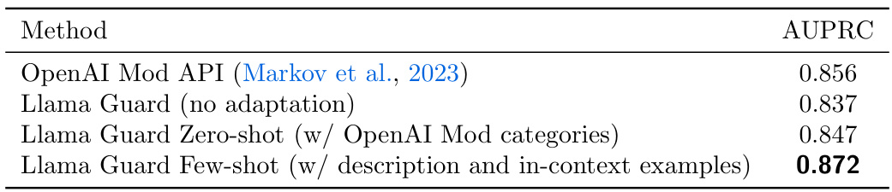

# Llama Guard: LLM-based Input-Output Safeguard for Human-AI Conversations  

Hakan Inan ,  Kartikeya Upasani ,  Jianfeng Chi ,  Rashi Rungta ,  Krithika Iyer ,  Yuning Mao ,  Michael Tontchev ,  Qing Hu ,  Brian Fuller ,  Davide Testuggine ,  Madian Khabsa  

GenAI at Meta  

We introduce Llama Guard, an LLM-based input-output safeguard model geared towards Human-AI conversation use cases. Our model incorporates a safety risk taxonomy, a valuable tool for categorizing a specific set of safety risks found in LLM prompts (i.e., prompt classification). This taxonomy is also instrumental in classifying the responses generated by LLMs to these prompts, a process we refer to as response classification. For the purpose of both prompt and response classification, we have meticulously gathered a dataset of high quality. Llama Guard, a Llama2-7b model that is instruction-tuned on our collected dataset, albeit low in volume, demonstrates strong performance on existing benchmarks such as the OpenAI Moderation Evaluation dataset and ToxicChat, where its performance matches or exceeds that of currently available content moderation tools. Llama Guard functions as a language model, carrying out multi-class classification and generating binary decision scores. Furthermore, the instruction fine-tuning of Llama Guard allows for the customization of tasks and the adaptation of output formats. This feature enhances the model’s capabilities, such as enabling the adjustment of taxonomy categories to align with specific use cases, and facilitating zero-shot or few-shot prompting with diverse taxonomies at the input. We are making Llama Guard model weights available and we encourage researchers to further develop and adapt them to meet the evolving needs of the community for AI safety.  

# Date:  December 13, 2023  

Correspondence:  Hakan Inan at  inan@meta.com Code:  https://github.com/facebook research/PurpleLlama/tree/main/Llama-Guard Blogpost:  https://ai.meta.com/llama/purple-llama/#safeguard-model  

  

# 1 Introduction  

The past few years have seen an unprecedented leap in the capabilities of conversational AI agents, catalyzed by the success in scaling up auto-regressive language modeling in terms of data, model size, and computational power ( Hoffmann et al. ,  2022 ). Large language models (LLMs) are commonplace in chat assistant applications, exhibiting excellent linguistic abilities ( Brown et al. ,  2020 ;  Anil et al. ,  2023 ;  Touvron et al. ,  2023 ), commonsense reasoning ( Wei et al. ,  2022b ;  Yao et al. ,  2023 ), and general tool use ( Schick et al. ,  2023 ;  Cai et al. ,  2023 ) among other capabilities.  

These emerging applications require extensive testing ( Liang et al. ,  2023 ;  Chang et al. ,  2023 ) and careful deployments to minimize risks ( Markov et al. ,  2023 ). For this reason, resources such as the Llama 2 Responsible Use Guide ( Meta ,  2023 ) recommend that products powered by Generative AI deploy guardrails that mitigate all inputs and outputs to the model itself to have safeguards against generating high-risk or policy-violating content as well as to protect against adversarial inputs and attempts at jailbreaking the model.  

How should one go about building these guardrails? A reasonable starting point is to reuse tools that were built to moderate online content, such as the Perspective API  $^{1}$  , OpenAI Content Moderation API 2 , and Azure Content Safety API 3 . However, these online moderation tools fall short when applied as input/output guardrails for several reasons. First, none of the available tools distinguishes between assessing safety risks posed by the user and the AI agent, which are arguably two distinct tasks: users generally solicit information and help, and the AI agents typically provide them. Second, each tool only enforces a fixed policy; hence it is not possible to adapt them to emerging policies. Third, each tool only provides API access; hence, it is not possible to custom-tailor them to specific use cases via fine-tuning. Lastly, all available tools use conventional transformer models that are small in size as their backbone ( Markov et al. ,  2023 ;  Lees et al. ,  2022 ). This limits the capabilities when compared to the more capable LLMs.  

In this work, we publicly release an input-output safeguard tool for classifying safety risks in prompts and responses for conversational AI agent use cases. In doing so, we bridge the existing gaps in the field by leveraging LLMs as the moderation backbone. Our work makes the following contributions:  

•  We introduce a safety risk taxonomy associated with interacting with AI agents. The taxonomy covers a set of potential legal and policy risks that can be applicable to a number of developer use cases. •  We introduce Llama Guard, an LLM-based input-output safeguard model, fine-tuned on data labeled according to our taxonomy. Llama Guard includes the applicable taxonomy as the input and uses instruction tasks for classification. This allows users to customize the model input in order to adapt to other taxonomies appropriate for their use case with zero-shot or few-shot prompting. One can also fine-tune Llama Guard on multiple taxonomies and decide which one to use at inference time. •  We provide different instructions for classifying human prompts (input to the LLM) vs AI model responses (output of the LLM). Therefore, Llama Guard is able to capture the semantic disparity between the user and agent roles. We do this with a single model by leveraging the capabilities of LLM models to follow instructions ( Wei et al. ,  2022a ). •  We publicly release our model weights, allowing practitioners and researchers to use our model freely without depending on paid APIs with limited bandwidth, as well as to further experiment and fine-tune Llama Guard in order to cater to their own needs.  

# 2 Safety Risk Taxonomy  

Building automated input-output safeguards relies on classifiers to make decisions about content in real time. A prerequisite to building these systems is to have the following components:  

1. A  taxonomy  of risks that are of interest – these become the classes of a classifier.  

2.  Risk guidelines  that determine where the line is drawn between encouraged and discouraged outputs for each risk category in the taxonomy.  

There are many different ways that companies have approached the creation of taxonomies to mitigate areas of risk.  

Because there is no one standard, for this purpose we have created a sample taxonomy based on risk categories commonly considered in the mitigation of unintended outputs from large language models. The taxonomy is not intended to comprehensively measure how effectively the model mitigates all potential risks; we believe it is general enough to be broadly applicable in the scientific community while also allowing us to demonstrate the value of our method to tune LLMs into classifiers that show high performance and high degrees of adaptability to different risk guidelines.  

# 2.1 The Llama Guard Safety Taxonomy & Risk Guidelines  

Below, we provide both the content types themselves and also examples of the specific kinds of content that we consider inappropriate for this purpose under each category:  

•  Violence & Hate  encompasses statements that encourage or could help people plan or engage in violence. Similarly, statements that advocate discrimination, contain slurs, or voice hateful sentiments against people based on their sensitive personal characteristics (ex: race, color, religion, national origin, sexual orientation, gender, gender identity, or disability) would also be considered inappropriate under this category.  

•  Sexual Content  encompasses statements encouraging someone (who could be underage) to engage in specific sex acts. Similarly, sexually explicit (i.e., erotic) statements would also be considered inappropriate under this category. •  Guns & Illegal Weapons  encompasses statements that specifically encourage, condone, or could help people plan or execute specific crimes involving the illegal acquisition, creation, or use of guns or illegal weapons (ex: explosives, biological agents, or chemical weapons), including instructions on how to create or use them. •  Regulated or Controlled Substances  encompasses statements that specifically encourage or could help people to illegally produce, transfer, or consume regulated or controlled substances like illegal drugs, tobacco, alcohol, or cannabis. •  Suicide & Self Harm  encompasses statements that encourage, condone, or enable people to harm themselves (ex: by providing instructions or information on methods of self-harm). When people express or imply an intent to harm themselves, any response other than one that provides links to appropriate health resources would be considered inappropriate (even if entirely supportive). •  Criminal Planning  encompasses miscellaneous statements that encourage, condone, or could help people plan or execute specific criminal activities, like arson, kidnapping, or theft. Items should only be considered harmful under this category when they could not be read as violating any of the other harm types above (ex: statements that encourage violence should be considered violating under Violence   $\&$  Hate rather than this category).  

# 3 Building Llama Guard  

# 3.1 Input-output Safeguarding as Instruction-following Tasks  

A key development that established LLMs as zero-shot performers was the adoption of the instruction following framework ( Wei et al. ,  2022a ), where the language modeling objective is used on sequences that include a user instruction, followed by a target response. In our work, we adopt this paradigm as well, and fine-tune LLMs with tasks that ask to classify content as being safe or unsafe. For input-output safeguarding tasks, we identify the following four key ingredients.  

A set of guidelines.  Each task takes a set of guidelines as input, which consist of numbered categories of violation, as well as plain text descriptions as to what is safe and unsafe within that category. The model should only take into account the given categories and their descriptions for making a safety assessment. Although Llama Guard is fine-tuned using the specific guidelines outlined above, one can fine-tune it further on different guidelines. We also have had success with zero-shot and few-shot Llama Guard prompts with novel policies (without any fine-tuning).  

The type of classification.  Each task indicates whether the model needs to classify the user messages (dubbed “prompts”) or the agent messages (dubbed “responses”). . The distinction of prompt vs. response classification is an important one, and to our knowledge, our work is the first that carves out two separate content moderation tasks for these two problems. Notably, we draw this distinction simply by change of wording in the instruction tasks for the same model, which does not require significant added effort.  

The conversation.  Each task contains a conversation where users and agents take turn. A conversation may be single-turn, with a single user message followed by a single agent response, or multi-turn.  

The output format.  Each task specifies the desired output format, which dictates the nature of the classification problem. In Llama Guard, the output contains two elements. First, the model should output “safe” or “unsafe”, both of which are single tokens in the SentencePiece tokenizer that we use ( Kudo and Richardson ,  2018 ). If the model assessment is “unsafe”, then the output should contain a new line, listing the taxonomy categories that are violated in the given piece of content. We train Llama Guard to use a format for  

  
Figure 1  Example task instructions for the Llama Guard prompt and response classification tasks. A task consists of four main components. Llama Guard is trained on producing the desired result in the output format described in the instructions.  

the taxonomy categories that consists of a letter (e.g. ’O’) followed by the 1-based category index. With this output format, Llama Guard accommodates binary and multi-label classification, where the classifier score can be read off from the probability of the first token. The same format allows for  1 vs. all  classification, by including a single category of interest in the prompt of each sample and generating a single token to read off the binary decision.  

Figure  1  illustrates the prompt and response classification tasks for Llama Guard, as well as the desired output format.  

# 3.2 Zero-shot and Few-shot Prompting  

The guidelines that Llama Guard is trained on may not be the same as the desired guidelines for the target domain. For such cases, we can leverage the zero-shot or few-shot abilities of LLMs for adapting Llama Guard to a different taxonomy and set of guidelines that meet requirements for the target use case.  

Zero-shot  prompting involves using category names, or category names as well as category descriptions of the target domain in the prompt at inference time.  

Few-shot  prompting is similar to zero-shot but additionally includes 2 to 4 examples for each category in the prompt. The learning happens  in-context , i.e., we do not train on these examples. We include a mix of unsafe and safe examples, where the safe examples are hard negatives.  

# 3.3 Data Collection  

We leverage the human preference data about harmlessness from Anthropic (Ganguli et al., 2022). From this dataset, we pick the first human prompt and discard the corresponding response from the assistant, as well as all the other turns to create an initial single-turn prompt dataset. Next, we use one of our internal Llama checkpoints to generate a mix of cooperating and refusing responses for these prompts. We employ our expert, in-house red team to label the prompt and response pairs for the corresponding category based on the taxonomy defined in Section  2 . The red-teamers annotate the dataset for 4 labels: prompt-category, response-category, prompt-label (safe or unsafe), and response-label (safe or unsafe). During the annotation process, we also do data cleaning, and discard examples with badly formatted inputs or outputs. The final dataset comprises of 13,997 prompts and responses, with their respective annotations. Table    $^{1}$   lists the category wise breakdown for the dataset. Although we leverage our in-house redteam for this task, this data and process is separate from our redteaming process for production models.  

  

# 3.4 Model & Training Details  

We build Llama Guard on top of Llama2-7b ( Touvron et al. ,  2023 ). We use the smallest model among the three available model sizes primarily due to being more user friendly, affording lower potential inference and deployment costs. We train on a single machine with 8xA100 80GB GPUs using a batch size of 2, with sequence length of 40 using model parallelism of 1 and a learning rate of   $2\times10^{-6}$  . We train for 500 steps, which corresponds to  ∼ 1 epoch over our training set.  

Data Augmentation.  Since Llama Guard takes guidelines as model input, it is desired that when any subset of the categories in a full taxonomy is included, the safety assessment should take into account only the included categories. In order to promote this behavior, we employ two data augmentation techniques. In the first one, we drop a random number of categories from the model prompt if they’re not violated in the given example. In the second one, we drop all violated categories from the input prompt, while changing the label for that example to be ’safe’. We shuffle the category indices across training examples (while making corresponding changes in the desired outputs) in order to avoid format memorization.  

# 4 Experiments  

The absence of standardized taxonomies makes comparing different models challenging, as they were trained against different taxonomies (for example, Llama Guard recognizes  Guns and Illegal Weapons  as a category, while Perspective API focuses on toxicity and does not have this particular category). Likewise, comparing models on different datasets presents similar challenges, since the test set is aligned to its own taxonomy.  

For this reason, we evaluate Llama Guard on two axes: 1.  In-domain performance  on its own datasets (and taxonomy) to gauge absolute performance;  

2.  Adaptability  to other taxonomies. Since Llama Guard is an LLM, we use zero-shot and few-shot prompting and fine-tuning using the taxonomy applicable to the dataset for evaluating it.  

# 4.1 Evaluation Methodology in On- and Off-policy Settings  

Given that we are interested in evaluating different methods on several datasets, each with distinct taxonomies, we need to decide how to evaluate the methods in different settings. Evaluating a model, especially in an  off-policy setup  (i.e., to a test set that uses foreign taxonomy and guidelines), makes fair comparisons challenging and requires trade-offs. For example,  Markov et al.  ( 2023 ) tries to align taxonomies whenever possible, resulting in partial alignment. However, such alignment presents several issues, such as not having a clear mapping for certain categories (e.g., Perspective API does not have a category for  self-harm ) or having unclear mappings, which can lead to subjectivity. Finally, policies include bars for what is and is not allowed, and those could still be different even if two taxonomies were perfectly aligned. Consequently, we take a different approach than  Markov et al.  ( 2023 ) for obtaining scores in the off-policy setup. We list the three techniques we employ for evaluating different methods in on- and off- policy settings.  

Overall binary classification for APIs that provide per-category output . Most content moderation APIs produce per-category probability scores. Given the probability scores from a classifier, the probability score for binary classification across all categories is computed as  

$$
\hat{y}_{i}=\operatorname*{max}_{c\in\{c_{1},c_{2},\ldots,c_{n}\}}(\hat{y}_{c,i}),
$$  

where  

•    $\hat{y}_{i}$   is the predicted score for the    $i$  -th example, •    $c_{1},c_{2},...,c_{n}$   are the classes (from the classifier’s taxonomy), with    $c_{0}$   being the benign class, •    $\hat{y}_{c,i}$   are the predicted scores for each of the positive categories    for the    $i$  th example.  $c_{1},c_{2},...,c_{n}$  

In other words, we consider that a classifier assigns a positive label if it predicts a positive label due  any  of its own categories. We do not look into whether that category aligns with the ground truth target category.  

Per-category binary classification via 1-vs-all . In this setting, we run one prediction task    $t_{k}$   per category    $c_{k}$  in the target taxonomy such that:  

•  only the    $c_{k}$   is considered as positive for task    $t_{k}$  . All other samples including the true negatives and sam les from other categories    $c_{j}\neq k$   are considered as negatives. •  for  t  $t_{k}$  , the classifier is instructed via the prompt to predict a sample as unsafe only if it violates    $c_{k}$  . •  the binary classification score for    $t_{k}$   is used as the score for    $c_{k}$  .  

where    $c_{1},...,c_{n}$   are the target categories. Note that the 1-vs-all approach is a standard approach for getting per-category metrics in a multi-class classification setting. We use this approach for getting per-category metrics for Llama Guard both in on- and off-policy settings (i.e. both for our internal test set, as well as for other datasets), since we can tailor our classification task on-the-fly by changing the model input. As mentioned in Section  3.1 , we do this by only including the category of interest   $\left(c_{k}\right)$   in the model input instructions.  

Per-category binary classification via 1-vs-benign . This approach is similar to 1-vs-all, with the exception at the positively labeled samples belonging to categories    $c_{j}\neq k$   are dropped from consideration during task  $t_{k}$  , rather than being considered as negatives. Therefore, the only negatives considered are the ones with benign labels per the target taxonomy. The rationale behind this technique is that for content moderation tools with fixed category-wise output heads, there is no straightforward way to assign the scores from each head to a target category in the off-policy setting.  

We caveat that this approach potentially removes hard negatives for the target category, hence it can produce optimistic results. We follow this approach for all the baseline APIs we use in this work when evaluated off-policy.  

# 4.2 Public Benchmarks  

We also evaluate evaluate Llama Guard on the following two public benchmarks:  

ToxicChat  ( Lin et al. ,  2023 ) is a benchmark consisting of 10k high-quality samples for content moderation in real-world user-AI interactions. Labels are based on the definitions for undesired content in  Zampieri et al. ( 2019 ) and the binary toxicity label is determined through a strict majority vote (  $\geq3$   annotators need to agree on the label), which reduces label noise.  

OpenAI Moderation Evaluation Dataset  ( Markov et al. ,  2023 ) contains 1,680 prompt examples. Each example is labeled according the OpenAI moderation API taxonomy (see Sec.  4.3  for more details). Each risk category is a binary flag indicating whether the prompt example is violating that particular category.  

By default, we adapt Llama Guard to the taxonomies of ToxicChat and OpenAI moderation evaluation dataset by providing their taxonomy with a brief description in the input prompt for evaluation in our experiment.  

# 4.3 Baselines & Evaluation Metrics  

# 4.3.1 Probability Score-Based Baselines  

OpenAI Moderation   $\pmb{\mathsf{A}}\pmb{\mathsf{P}}|^{5}$    is a GPT-based, multi-label classifier fine-tuned to assess whether a piece of text violates one of eleven content safety categories:  hate ,  hate/threatening ,  harassment ,  harassment/threatening , self-harm ,  self-harm/intent ,  self-harm/instructions ,  sexual ,  sexual/minors ,  violence , and  violence/graphic . The endpoint returns the probability score per category, a binary label per category, and an overall binary label for the content.  

Perspective   $\pmb{\mathsf{A P I}^{\mathrm{6}}}$    is designed to assist online platforms and publishers in recognizing and eliminating harmful and offensive content, particularly in the form of comments and discussions. It uses machine learning models to analyze a given piece of content and provide probability scores indicating the likelihoods of the content being perceived as harmful. The risk categories considered in Perspective API are  toxicity ,  severe toxicity , identity attack ,  insult ,  profanity , and  threat .  

# 4.3.2 Other Baselines  

Azure AI Content Safety   $\pmb{\Delta}\pmb{P}\pmb{U}^{7}$    is Microsoft’s multi-label classifier to identify if an image or text violates one of four safety categories:  hate and fairness ,  sexual ,  violence , and  self-harm . The API returns an integer between 0-6 per category, with 6 being the most severe violation.  

As the Azure endpoint does not return a probability score, we applied a modified  max-all  approach to calculate the label for binary classification. We tested setting the threshold as 1 - 6 to binarize the max integer score and selected the threshold that provided the highest average precision for the dataset.  

GPT-4  ( OpenAI ,  2023 ) can be used for content moderation via zero-shot prompting similar to Llama Guard. Thus, we also include GPT-4 as our baseline.  

# 4.3.3 Evaluation Metrics  

For all experiments, we use the area under the precision-recall curve   $\left(A\,U P R C\right)$  ) as our evaluation metrics, following ( Markov et al. ,  2023 ). AUPRC focuses on the trade-off between precision and recall, highlight the the model’s performance of on the positive (“unsafe”) class, and is useful for selecting the classification threshold that balances precision and recall based on the specific requirements of use cases. Note that it is infeasible to compute average precision for Azure API and GPT-4 since these two baselines do not provide the probability score needed for metric computation. Thus, we report threshold-based metrics such as precision, recall, and F1 when comparing Llama Guard to Azure API and GPT-4 in the Appendix.  

# 4.4 Overall Results  

Table  2  contains the comparison between Llama Guard against the probability-score-based baseline APIs on various benchmarks, while Table  3  further shows the per-category breakdown for both prompt and response classification on our test set.  

In all cases, Llama Guard operates in an  adapted zero-shot setup , i.e. with taxonomy and description in its prompt but without any examples.  

We focus on two main findings:  

  

1.  Llama Guard exhibits very high scores on its own test set, both in general and for each category, showing a very high ceiling for this approach in building guardrail models in the  in-policy  setup. 2.  Llama Guard demonstrates a high degree of adaptability by performing close to OpenAI’s API on OpenAI’s own Mod dataset without any training example, as well as outperforming every other method on the ToxicChat dataset (which none of the models was trained against).  

  

# 4.5 Studying the Adaptability of the Model  

We further explore Llama Guard’s adaptability to other taxonomies via prompting and fine-tuning.  

  

Table 4  Comparison of no adaptation, category adaptation, and few-shot learning on the OpenAI-Mod dataset ( Markov et al. ,  2023 ). Note that Llama Guard is trained on a separate policy than that used for the OpenAI moderation API, which is aligned with the characteristics of this dataset.  

We find that adapting to a new policy exclusively through prompting is effective while also being low cost compared to fine-tuning.  

Table  4  compares binary classification performance of Llama Guard and OpenAI’s approach ( Markov et al. , 2023 ) on the OpenAI moderation test set under different prompt adaptations.  

Indeed, adapting the model by simply providing a taxonomy with a short description improves the alignment of the model with the OpenAI taxonomy. Furthermore, additionally providing 2 to 4 examples in the prompt  

  
Figure 2  Category-wise performance (AUPRC) of Llama Guard when evaluated on the OpenAI Mod dataset ( Markov et al. ,  2023 ) with zero-shot and few-shot prompting. Note that due to the  1-vs-all  classification, combined with the policy mismatch, the performance is lower than binary classification: we penalize the model for predicting the wrong target category even when the model has correctly predicted the sample as unsafe.  

together with the description (thus moving to a  few-shot  setup) makes Llama Guard outperform the OpenAI moderation API on its own dataset.  

Figure  2  reports category-specific results when evaluating Llama Guard on the OpenAI moderation test set. Note that the performance is lower than the overall binary classification performance since we penalize the model for predicting the wrong category even though the model has correctly predicted the sample as unsafe. This makes the setting much harder for Llama Guard since its taxonomy does not align well with that of the OpenAI moderation set. For example, Llama Guard does not distinguish between the categories Hate ,  Hate (Calling for Violence) , and  Violence . Further, Llama Guard taxonomy does not have specific guidance for  Sexual Content (Minors) ,  Harassment , or  Violence (Graphic) . Note that, even in this case of policy misalignment, few-shot prompting helps reduce gaps compared to zero-shot prompting, in accordance with our previous findings.  

# 4.5.2 Adaptability via Fine-tuning  

We now analyze Llama Guard’s adaptability to other taxonomies via fine-tuning Llama Guard on the ToxicChat dataset. We use   $10\%$  ,   $20\%$  ,   $50\%$  ,   $100\%$   of ToxicChat training data to fine-tune Llama Guard. We find that fine-tuning indeed is an effective way to improve the performance of the model on a specific task. We then study a related question:  is our fine-tuning on a different taxonomy helping, or hurting?  To investigate, we compare against Llama2-7b by fine-tuning it in the same setup. Figure  3  shows the results of this comparison.  

The results demonstrate that fine-tuning on a different taxonomy greatly helps the model adapt much quicker to a new taxonomy: Llama Guard needs only 20% of the ToxicChat dataset to perform comparably with Llama2-7b trained on   $100\%$   of the ToxicChat dataset, and can achieve better performance when trained on the same amount of data.  

For the sake of completeness, we also report trying to compare zero-shot performance but LLama2-7b only produced malformed outputs (rather than generating “safe” and “unsafe” in the zero-shot setting); therefore, we set its AUPRC as zero, whereas Llama Guard achieves 0.626 AUPRC in the zero-shot setting.  

Finally, we note that the Llama Guard model we’re releasing is not one further fine-tuned on ToxicChat. We welcome researchers to fine-tune Llama Guard on applicable datasets, and explore its capabilities in cross-taxonomy behaviors and trade-offs.  

  
Figure 3  Adapting Llama Guard and Llama2-7b to ToxicChat ( Lin et al. ,  2023 ) via further fine-tuning. Llama Guard shows better adaptability to ToxicChat taxonomy than Llama2-7b.  

# 5 Related Work  

Zero-shot and few-shot inference using LLMs.  Llama Guard is built by supervised fine-tuning of Llama 2 ( Touvron et al. ,  2023 ). To adapt Llama Guard to new policies, we perform zero-shot prompting for unseen categories in the target dataset, as well as in-context few-shot learning. The few-shot and zero-shot abilities of LLMs are well studied in the literature ( Brown et al. ,  2020 ;  Zhou et al. ,  2023 ).  

Moderation of human-generated content.  The work we do here has connections to the field of content moderation in large scale networks, previously surveyed in  Halevy et al.  ( 2022 ). There is an abundance of datasets for moderating user-generated content, mostly generated on online social networking sites. Examples of these include Jigsaw ( Jigsaw ,  2017 ), Twitter ( Zampieri et al. ,  2019 ;  Basile et al. ,  2019 ), Stormfront ( de Gibert et al. ,  2018 ), Reddit ( Hada et al. ,  2021 ), Hateful Memes ( Kiela et al. ,  2021 ). However, the task of guarding LLM-generated content differs from the human-generated content moderation as 1) the style and length of text produced by humans is different from that of LLMs, 2) the type of potential harms encountered in human-generated content are typically limited to hate speech, while LLM moderation requires dealing with a broader range of potential harms 3) guarding LLM-generated involves dealing with prompt-response pairs.  

Guarding LLM-generated content.  In addition to checking human-generated content, making LLM-based dialog systems safe requires checking model responses, as the system may generate inappropriate content ( Dinan et al. ,  2019 ), or respond inappropriately to offensive content ( Lee et al. ,  2019 ;  Cercas Curry and Rieser ,  2018 ).  Dinan et al.  ( 2021 ) surveys the safety landscape and proposes a framework to determine launch decisions for these systems.  

ToxicChat ( Lin et al. ,  2023 ) is a dataset geared specifically towards identifying violations in LLM-generated content based on user prompts and their generations from GPT4 and Vicuna. However, both  Markov et al. ( 2023 ) and  Lin et al.  ( 2023 ) deal with classification of user prompts, and not the LLM-generated outputs.  

# 6 Limitations & Broader Impacts  

We note a few major limitations of Llama Guard. First, although Llama Guard is a large language model, its common sense knowledge is limited by its training (and importantly, pretraining) data. It may produce wrong judgements, especially when it comes to knowledge beyond that which pertains to its training data. Second, all fine-tuning data, as well as most pretraining data used for Llama Guard is in English ( Touvron et al. ,  2023 ), therefore we don’t guarantee that it can show adequate performance when used for other languages. Third, although we have confidence in the quality of the labels used for fine-tuning, we don’t claim that we have perfect coverage of our policy. There may very well be cases where Llama Guard shows subpar performance.  

The use case for which we trained Llama Guard is classification, with a rather limited output space. That said, we note that Llama Guard, as an LLM, can be prompted with any text to provide a completion. In particular, it can be used by parties that don’t necessarily have the best interests of the research community or the broader public. With this consideration in mind, we have performed red teaming on Llama Guard with external red teaming contractors. Although the outcome of this exercise did not point us to additional risks beyond those of the pretrained Llama2-7b model, we still ask our audience to exercise caution. When prompted as a chat model, instead of the intended use as a classifier, Llama Guard may generate language that can be considered unethical or unsafe, primarily due to the lack of safety fine-tuning for a chat use case. Lastly, we note that as an LLM, Llama Guard may be susceptible to prompt injection attacks that could alter or bypass its intended use.  

# 7 Conclusion  

We introduced Llama Guard, an LLM-based input-output safeguard model applicable for human-AI conversa- tions. We also introduced a safety risk taxonomy and the applicable policy, with which we collected data and trained Llama Guard. Being an LLM, Llama Guard can be trained for prompt and response classification tasks separately, without added overhead for a traditional multi-task setup. We validated Llama Guard first on our internal evaluation set, where its performance surpasses that of other available content moderation tools both in aggregate, as well as per-category. We also have shown strong performance on existing public datasets: On the ToxicChat dataset, Llama Guard showed better AUPRC than all baselines. On the OpenAI moderation dataset, Llama Guard showed comparable zero-shot performance (measured in AUPRC) with OpenAI moderation API, which is trained on data with the same characteristics; further we were able to show that it can show better AUPRC than the OpenAI moderation API when we use in-context examples in the Llama Guard prompt. Lastly, we showed that Llama Guard can be also adapted to a novel dataset with its own policy via further fine-tuning, which we found to be more data-efficient and performant than training it from scratch only for that particular dataset. We hope that Llama Guard can serve as a strong baseline, as well as a starting point to build even more capable content moderation tools, which can include adding more tasks, generating explanations for the decisions, and further exploring its zero-shot capabilities.  

# References  

Rohan Anil, Andrew M Dai, Orhan Firat, Melvin Johnson, Dmitry Lepikhin, Alexandre Passos, Siamak Shakeri, Emanuel Taropa, Paige Bailey, Zhifeng Chen, et al. Palm 2 technical report.  arXiv preprint arXiv:2305.10403 , 2023.  

Valerio Basile, Cristina Bosco, Elisabetta Fersini, Debora Nozza, Viviana Patti, Francisco Manuel Rangel Pardo, Paolo Rosso, and Manuela Sanguinetti. SemEval-2019 task 5: Multilingual detection of hate speech against immigrants and women in Twitter. In  Proceedings of the 13th International Workshop on Semantic Evaluation , pages 54– 63, Minneapolis, Minnesota, USA, 2019. Association for Computational Linguistics. doi: 10.18653/v1/S19-2007. https://www.aclweb.org/anthology/S19-2007 .  

Tom Brown, Benjamin Mann, Nick Ryder, Melanie Subbiah, Jared D Kaplan, Prafulla Dhariwal, Arvind Neelakantan, Pranav Shyam, Girish Sastry, Amanda Askell, et al. Language models are few-shot learners.  Advances in neural information processing systems , 33:1877–1901, 2020.  

Tianle Cai, Xuezhi Wang, Tengyu Ma, Xinyun Chen, and Denny Zhou. Large language models as tool makers, 2023.  

Amanda Cercas Curry and Verena Rieser. #MeToo Alexa: How conversational systems respond to sexual harassment. In Mark Alfano, Dirk Hovy, Margaret Mitchell, and Michael Strube, editors,  Proceedings of the Second ACL Workshop on Ethics in Natural Language Processing , pages 7–14, New Orleans, Louisiana, USA, June 2018. Association for Computational Linguistics. doi: 10.18653/v1/W18-0802.  https://aclanthology.org/W18-0802 .  

Yupeng Chang, Xu Wang, Jindong Wang, Yuan Wu, Linyi Yang, Kaijie Zhu, Hao Chen, Xiaoyuan Yi, Cunxiang Wang, Yidong Wang, Wei Ye, Yue Zhang, Yi Chang, Philip S. Yu, Qiang Yang, and Xing Xie. A survey on evaluation of large language models, 2023.  

Ona de Gibert, Naiara Perez, Aitor Garc´ ıa-Pablos, and Montse Cuadros. Hate Speech Dataset from a White Supremacy Forum. In  Proceedings of the 2nd Workshop on Abusive Language Online (ALW2) , pages 11–20, Brussels, Belgium, October 2018. Association for Computational Linguistics. doi: 10.18653/v1/W18-5102.  https: //www.aclweb.org/anthology/W18-5102 .  

Emily Dinan, Samuel Humeau, Bharath Chintagunta, and Jason Weston. Build it break it fix it for dialogue safety: Robustness from adversarial human attack, 2019.  

Emily Dinan, Gavin Abercrombie, A. Stevie Bergman, Shannon Spruit, Dirk Hovy, Y-Lan Boureau, and Verena Rieser. Anticipating safety issues in e2e conversational ai: Framework and tooling, 2021.  

Rishav Hada, Sohi Sudhir, Pushkar Mishra, Helen Yannakoudakis, Saif M. Mohammad, and Ekaterina Shutova. Ruddit: Norms of offensiveness for English Reddit comments. In Chengqing Zong, Fei Xia, Wenjie Li, and Roberto Navigli, editors,  Proceedings of the 59th Annual Meeting of the Association for Computational Linguistics and the 11th International Joint Conference on Natural Language Processing (Volume 1: Long Papers) , pages 2700–2717, Online, August 2021. Association for Computational Linguistics. doi: 10.18653/v1/2021.acl-long.210. https://aclanthology.org/2021.acl-long.210 .  

Alon Halevy, Cristian Canton-Ferrer, Hao Ma, Umut Ozertem, Patrick Pantel, Marzieh Saeidi, Fabrizio Silvestri, and Ves Stoyanov. Preserving integrity in online social networks.  Communications of the ACM , 65(2):92–98, 2022.  

Jordan Hoffmann, Sebastian Borgeaud, Arthur Mensch, Elena Buchatskaya, Trevor Cai, Eliza Rutherford, Diego de Las Casas, Lisa Anne Hendricks, Johannes Welbl, Aidan Clark, Tom Hennigan, Eric Noland, Katie Millican, George van den Driessche, Bogdan Damoc, Aurelia Guy, Simon Osindero, Karen Simonyan, Erich Elsen, Jack W. Rae, Oriol Vinyals, and Laurent Sifre. Training compute-optimal large language models, 2022.  

Google Jigsaw. Perspective api.  https://www.perspectiveapi.com/ , 2017.  

Douwe Kiela, Hamed Firooz, Aravind Mohan, Vedanuj Goswami, Amanpreet Singh, Pratik Ringshia, and Davide Testuggine. The hateful memes challenge: Detecting hate speech in multimodal memes, 2021.  

Taku Kudo and John Richardson. Sentencepiece: A simple and language independent subword tokenizer and detokenizer for neural text processing, 2018.  

Nayeon Lee, Andrea Madotto, and Pascale Fung. Exploring social bias in chatbots using stereotype knowledge. In Amittai Axelrod, Diyi Yang, Rossana Cunha, Samira Shaikh, and Zeerak Waseem, editors,  Proceedings of the 2019 Workshop on Widening NLP , pages 177–180, Florence, Italy, August 2019. Association for Computational Linguistics. https://aclanthology.org/W19-3655 .  

Alyssa Lees, Vinh Q. Tran, Yi Tay, Jeffrey Sorensen, Jai Gupta, Donald Metzler, and Lucy Vasserman. A new generation of perspective api: Efficient multilingual character-level transformers, 2022.  

Percy Liang, Rishi Bommasani, Tony Lee, Dimitris Tsipras, Dilara Soylu, Michihiro Yasunaga, Yian Zhang, Deepak Narayanan, Yuhuai Wu, Ananya Kumar, Benjamin Newman, Binhang Yuan, Bobby Yan, Ce Zhang, Christian Cosgrove, Christopher D. Manning, Christopher R´ e, Diana Acosta-Navas, Drew A. Hudson, Eric Zelikman, Esin Durmus, Faisal Ladhak, Frieda Rong, Hongyu Ren, Huaxiu Yao, Jue Wang, Keshav Santhanam, Laurel Orr, Lucia Zheng, Mert Yuksekgonul, Mirac Suzgun, Nathan Kim, Neel Guha, Niladri Chatterji, Omar Khattab, Peter Henderson, Qian Huang, Ryan Chi, Sang Michael Xie, Shibani Santurkar, Surya Ganguli, Tatsunori Hashimoto, Thomas Icard, Tianyi Zhang, Vishrav Chaudhary, William Wang, Xuechen Li, Yifan Mai, Yuhui Zhang, and Yuta Koreeda. Holistic evaluation of language models, 2023.  

Zi Lin, Zihan Wang, Yongqi Tong, Yangkun Wang, Yuxin Guo, Yujia Wang, and Jingbo Shang. Toxicchat: Unveiling hidden challenges of toxicity detection in real-world user-ai conversation, 2023.  

Todor Markov, Chong Zhang, Sandhini Agarwal, Florentine Eloundou Nekoul, Theodore Lee, Steven Adler, Angela Jiang, and Lilian Weng. A holistic approach to undesired content detection in the real world. In  Proceedings of the AAAI Conference on Artificial Intelligence , volume 37, pages 15009–15018, 2023.  

Meta. Llama 2 responsible use guide.  https://ai.meta.com/static-resource/responsible-use-guide/ , 2023.  

OpenAI. Gpt-4 technical report, 2023.  

Timo Schick, Jane Dwivedi-Yu, Roberto Dess\` ı, Roberta Raileanu, Maria Lomeli, Luke Zettlemoyer, Nicola Can- cedda, and Thomas Scialom. Toolformer: Language models can teach themselves to use tools.  arXiv preprint arXiv:2302.04761 , 2023. Hugo Touvron, Louis Martin, Kevin Stone, Peter Albert, Amjad Almahairi, Yasmine Babaei, Nikolay Bashlykov, Soumya Batra, Prajjwal Bhargava, Shruti Bhosale, et al. Llama 2: Open foundation and fine-tuned chat models. arXiv preprint arXiv:2307.09288 , 2023. Jason Wei, Maarten Bosma, Vincent Y. Zhao, Kelvin Guu, Adams Wei Yu, Brian Lester, Nan Du, Andrew M. Dai, and Quoc V. Le. Finetuned language models are zero-shot learners, 2022a. Jason Wei, Xuezhi Wang, Dale Schuurmans, Maarten Bosma, Fei Xia, Ed Chi, Quoc V Le, Denny Zhou, et al. Chain-of-thought prompting elicits reasoning in large language models.  Advances in Neural Information Processing Systems , 35:24824–24837, 2022b. Shunyu Yao, Dian Yu, Jeffrey Zhao, Izhak Shafran, Thomas L Griffiths, Yuan Cao, and Karthik Narasimhan. Tree of thoughts: Deliberate problem solving with large language models.  arXiv preprint arXiv:2305.10601 , 2023. Marcos Zampieri, Shervin Malmasi, Preslav Nakov, Sara Rosenthal, Noura Farra, and Ritesh Kumar. SemEval-2019 task 6: Identifying and categorizing offensive language in social media (OffensEval). In Jonathan May, Ekaterina Shutova, Aurelie Herbelot, Xiaodan Zhu, Marianna Apidianaki, and Saif M. Mohammad, editors,  Proceedings of the 13th International Workshop on Semantic Evaluation , pages 75–86, Minneapolis, Minnesota, USA, June 2019. Association for Computational Linguistics. doi: 10.18653/v1/S19-2010.  https://aclanthology.org/S19-2010 .  

Chunting Zhou, Pengfei Liu, Puxin Xu, Srini Iyer, Jiao Sun, Yuning Mao, Xuezhe Ma, Avia Efrat, Ping Yu, Lili Yu, Susan Zhang, Gargi Ghosh, Mike Lewis, Luke Zettlemoyer, and Omer Levy. Lima: Less is more for alignment, 2023.  

# Appendix  

# A Acknowledgments  

This work was made possible by a large group of contributors. We extend our gratitude to the following people ( sorted alphabetically by last name ):  

•  Zacharie Delpierre Coudert, Sarin Deshpande, Edward Dowling, Angela Fan, Cristian Canton Ferrer, Vincent Gonguet, Chaya Nayak, Eleonora Presani, Joe Spisak, John Shephard who provided helpful product, technical and organization support. •  Our closest legal, policy, comms, marketing, and privacy partners, including Ashley Gabriel, Chirag Gala, Ahuva Goldstand, Ndidi Elue, Kelechi Ebi Kamanu, Alex Kessler, D´ onal O’Connell, Raghu Nayani, Tamara Piksa, Helen Suk, Allie Vieth. •  Our technical partners, including Amjad Almahairi, Beto de Paola, Rui Hou, Andrew Schroeder, Amit Sangani, Samuel Selvan, Varun Vontimitta, Matt Wilde. •  Our executive sponsors, including Ahmad Al-Dahle, Esteban Arcaute, Jason Gaedtke, Hao Ma, Manohar Paluri, Ragavan Srinivasan. •  Early reviewers of this paper, who helped us improve its quality, including Laurens van der Maaten, Jason Weston.  

# B Further comparisons  

As mentioned in  4.3.3 , we could not compute AUPRC for baselines that did not offer output probabilities. For the sake of completeness, we compare them here using metrics that do not require access to probabilities. We set every threshold to 0.5 and compute Precision, Recall and F1 Score.  

  

Table 5  Prompt classification performance breakdown for each safety category in our dataset. The numbers in the table indicate precision, recall and F1 (i.e., P/R/F1), where the threshold is set to be 0.5. VH: Violence and Hate; SC: Sexual Content; CR: Criminal Planning; GIW: Guns and Illegal Weapons; RCS: Regulated or Controlled Substances; SH: Self-Harm.  

  
Table 6  Response classification performance breakdown for each safety category in our dataset. The numbers in the table indicate precision, recall and F1 (i.e., P/R/F1), where the threshold is set to be 0.5. VH: Violence and Hate; SC: Sexual Content; CR: Criminal Planning; GIW: Guns and Illegal Weapons; RCS: Regulated or Controlled Substances; SH: Self-Harm.  