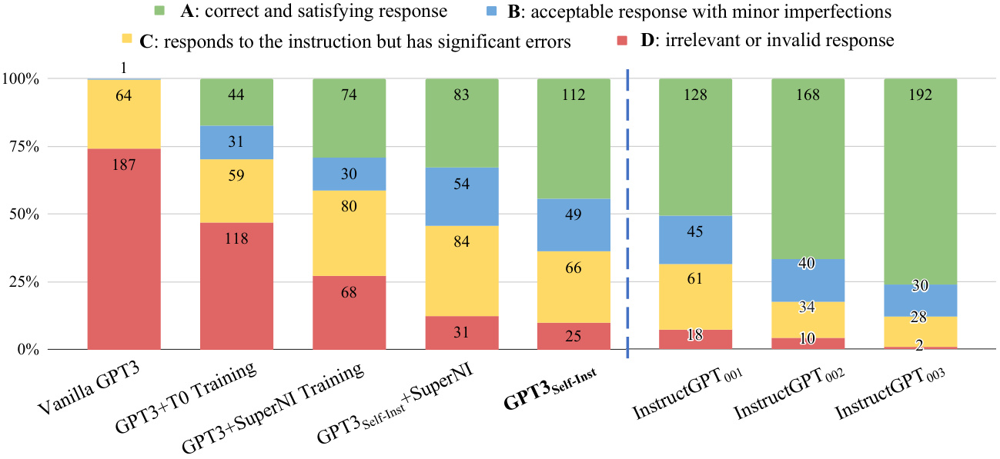

# S ELF -I NSTRUCT : Aligning Language Models with Self-Generated Instructions  

Yizhong Wang ♣ Yeganeh Kordi ♢ Swaroop Mishra ♡ Alisa Liu ♣ Noah A. Smith ♣ + Daniel Khashabi ♠ Hannaneh Hajishirzi ♣ + ♣ University of Washington ♢ Tehran Polytechnic ♡ Arizona State University ♠ Johns Hopkins University  + Allen Institute for AI yizhongw@cs.washington.edu  

# Abstract  

Large “instruction-tuned” language models (i.e., finetuned to respond to instructions) have demonstrated a remarkable ability to gener- alize zero-shot to new tasks. Nevertheless, they depend heavily on human-written instruc- tion data that is often limited in quantity, di- versity, and creativity, therefore hindering the generality of the tuned model. We introduce S ELF -I NSTRUCT , a framework for improving the instruction-following capabilities of pre- trained language models by bootstrapping off their own generations. Our pipeline generates instructions, input, and output samples from a language model, then filters invalid or sim- ilar ones before using them to finetune the original model. Applying our method to the vanilla GPT3, we demonstrate a   $33\%$   abso- lute improvement over the original model on S UPER -N ATURAL I NSTRUCTIONS , on par with the performance of  Instruc  ${\tt t G P T}_{001}$  ,   which was trained with private user data and human annotations. For further evaluation, we curate a set of expert-written instructions for novel tasks, and show through human evaluation that tuning GPT3 with S ELF -I NSTRUCT  outperforms using existing public instruction datasets by a large margin, leaving only a  $5\%$   absolute gap behind Instruc  ${\tt t G P T}_{001}$  . S ELF -I NSTRUCT  provides an almost annotation-free method for aligning pre- trained language models with instructions, and we release our large synthetic dataset to facili- tate future studies on instruction tuning.  

# 1 Introduction  

The recent NLP literature has witnessed a tremen- dous amount of activity in building models that  

  

Figure 1: Selected tasks from the generated instruction data using vanilla GPT3. Some texts are reformatted for presentation. See  Table 10  for more examples.  

can follow natural language instructions ( Mishra et al. ,  2022 ;  Wei et al. ,  2022 ;  Sanh et al. ,  2022 ; Wang et al. ,  2022 ;  Ouyang et al. ,  2022 ;  Chung et al. , 2022 , i.a.). These developments are powered by two key components: large pretrained language mod- els (LM) and human-written instruction data (e.g., P ROMPT S OURCE  ( Bach et al. ,  2022 ) and S UPER - N ATURAL I NSTRUCTIONS  ( Wang et al. ,  2022 , S U - PER NI for short)). However, collecting such in- struction data is costly and often suffers limited diversity given that most human generations tend to be popular NLP tasks, falling short of covering a  

  
Figure 2: A high-level overview of S ELF -I NSTRUCT . The process starts with a small seed set of tasks as the task pool. Random tasks are sampled from the task pool, and used to prompt an off-the-shelf LM to generate both new instructions and corresponding instances, followed by filtering low-quality or similar generations, and then added back to the initial repository of tasks. The resulting data can be used for the instruction tuning of the language model itself later to follow instructions better. Tasks shown in the figure are generated by GPT3.  

true variety of tasks and different ways to describe them. Continuing to improve the quality and cov- erage of instruction-tuned models necessitates the development of alternative approaches for supervis- ing the instruction tuning process.  

In this work, we introduce S ELF -I NSTRUCT , a semi-automated process for instruction-tuning a pretrained LM using instructional signals from the model itself. The overall process is an iterative boot- strapping algorithm (see  Figure 2 ), which starts off with a limited (e.g., 175 in our study) seed set of manually-written tasks that are used to guide the overall generation. In the first phase, the model is prompted to generate instructions for new tasks. This step leverages the existing collection of instruc- tions to create more broad-coverage instructions that define (often new) tasks. Given the newly- generated set of instructions, the framework also creates input-output instances for them, which can be later used for supervising the instruction tuning. Finally, various heuristics are used to automatically filter low-quality or repeated instructions, before adding the remaining valid tasks to the task pool. This process can be repeated for many iterations until reaching a large number of tasks.  

To evaluate S ELF -I NSTRUCT  empirically, we run this framework on GPT3 ( Brown et al. ,  2020 ), which is a vanilla LM (§ 3 ). The iterative S ELF - I NSTRUCT  process on this model leads to about  $52\mathrm{k}$  instructions, paired with about 82K instance inputs and target outputs. We observe that the resulting data provides a diverse range of creative tasks, as is demonstrated by examples in  Figure 1 . These generated tasks deviate from the distribution of typ- ical NLP tasks, and also have fairly small overlap with the seed tasks (§ 3.2 ). On this resulting data, we build GPT3 S -I  by finetuning GPT3 (i.e., the same model used for generating the instruction data). We evaluate GPT3 S -I  in comparison to various other models on both typical NLP tasks in- cluded in S UPER NI ( Wang et al. ,  2022 ), and a set of new instructions that are created for novel usage of instruction-following models (§ 4 ). The results in- dicate that GPT3 S -I  outperforms GPT3 (the original model) by a large margin   $(+33.1\%)$   and nearly matches the performance of  Instruc  ${\tt t G P T}_{001}$  . Moreover, our human evaluation on the newly- created instruction set shows that GPT3 S -I demonstrates a broad range of instruction follow- ing ability, outperforming models trained on other publicly available instruction datasets and leaving only a  $5\%$   gap behind Instruc  ${\tt t G P T}_{001}$  .  

In summary, our contributions are: (1) we introduce S ELF -I NSTRUCT , a method for induc- ing instruction following capabilities with mini- mal human-labeled data; (2) we demonstrate its effectiveness via extensive instruction-tuning ex- periments; and (3) we release a large synthetic dataset of 52K instructions and a set of manually- written novel tasks for building and evaluating fu- ture instruction-following models.  

# 2 Method  

Annotating large-scale instruction data can be chal- lenging for humans because it requires 1) creativity to come up with novel tasks and 2) expertise for writing the solutions to each task. Here, we de- tail our process for S ELF -I NSTRUCT , which refers to the pipeline of generating tasks with a  vanilla pretrained language model  itself, filtering the gen- erated data, and then conducting instruction tuning with this generated data in order to align the LM to follow instructions better. This pipeline is depicted in  Figure 2 .  

# 2.1 Defining Instruction Data  

The instruction data we want to generate contains a set of instructions    $\{I_{t}\}$  , each of which defines a task  $t$  in natural language. Task  $t$  has  $n_{t}\ge1$   input-output instances    $\{(X_{t,i},Y_{t,i})\}_{i=1}^{n_{t}}$  . A model    $M$  is expected to produce the output, given the task instruction and the corresponding input:    $M(I_{t},X_{t,i})\,=\,Y_{t,i},$  , for    $i\,\in\,\{1,\ldots,n_{t}\}$  . Note that the instruction and instance input does not have a strict boundary in many cases. For example, “write an essay about school safety” can be a valid instruction that we expect models to respond to directly, while it can also be formulated as “write an essay about the fol- lowing topic” as the instruction, and “school safety” as an instance input. To encourage the diversity of the data format, we allow such instructions that do not require additional input (i.e.,    $X$  is empty).  

# 2.2 Automatic Instruction Data Generation  

Our pipeline for data generation consists of four steps: 1) generating task instructions, 2) determin- ing if the instruction represents a classification task, 3) instance generation with either an input-first or output-first approach, and 4) filtering low-quality data.  

Instruction Generation. At the first step, S ELF - I NSTRUCT  generates new instructions from a small set of seed human-written instructions in a boot- strapping fashion. We initiate the task pool with 175 tasks (1 instruction and 1 instance for each task).   For every step, we sample 8 task instruc- tions from this pool as in-context examples. Of the 8 instructions, 6 are from the human-written tasks, and 2 are from the model-generated tasks in previous steps to promote diversity. The prompting template is shown in  Table 5 .  

Classification Task Identification. Because we need two different approaches for classification and non-classification tasks, we next identify whether the generated instruction represents a classification task or not.   We prompt the LM in a few-shot way to determine this, using 12 classification instructions and 19 non-classification instructions from the seed tasks. The prompting template is shown in  Table 6 .  

Instance Generation. Given the instructions and their task type, we generate instances for each in- struction independently. This is challenging be- cause it requires the model to understand what the target task is, based on the instruction, figure out what additional input fields are needed and gener- ate them, and finally complete the task by produc- ing the output. We found that pretrained LMs can achieve this to a large extent when prompted with instruction-input-output in-context examples from other tasks. A natural way to do this is the  Input- first Approach , where we can ask an LM to come up with the input fields first based on the instruc- tion, and then produce the corresponding output. This generation order is similar to how models are used to respond to instruction and input, but here with in-context examples from other tasks. The prompting template is shown in  Table 7 .  

However, we found that this approach can gen- erate inputs biased toward one label, especially for classification tasks (e.g., for grammar error detec- tion, it usually generates grammatical input). There- fore, we additionally propose an  Output-first Ap- proach  for classification tasks, where we first gener- ate the possible class labels, and then condition the input generation on each class label. The prompting template is shown in  Table 8 .   We apply the output- first approach to the classification tasks identified in the former step, and the input-first approach to the remaining non-classification tasks.  

Filtering and Postprocessing. To encourage di- versity, a new instruction is added to the task pool only when its ROUGE-L similarity with any exist- ing instruction is less than 0.7. We also exclude instructions that contain some specific keywords (e.g., image, picture, graph) that usually can not be processed by LMs. When generating new instances for each instruction, we filter out instances that are exactly the same or those with the same input but different outputs. Invalid generations are identified and filtered out based on heuristics (e.g., instruc- tion is too long or too short, instance output is a repetition of the input).  

# 2.3 Finetuning the LM to Follow Instructions  

After creating large-scale instruction data, we use it to finetune the original LM (i.e., S ELF -I NSTRUCT ). To do this, we concatenate the instruction and in- stance input as a prompt and train the model to generate the instance output in a standard super- vised way. To make the model robust to different formats, we use multiple templates to encode the instruction and instance input together. For exam- ple, the instruction can be prefixed with “Task:” or not, the input can be prefixed with “Input:” or not, “Output:” can be appended at the end of the prompt or not, and different numbers of break lines can be put in the middle, etc.  

# 3 S ELF -I NSTRUCT  Data from GPT3  

In this section, we apply our method for inducing instruction data to GPT3 as a case study. We use the largest GPT3 LM (“davinci” engine) accessed through the OpenAI API.   The parameters for mak- ing queries are described in Appendix  A.2 . Here we present an overview of the generated data.  

# 3.1 Statistics  

Table 1  describes the basic statistics of the gener- ated data. We generate a total of over 52K instruc- tions and more than 82K instances corresponding to these instructions after filtering.  

  
Table 1: Statistics of the generated data by applying S ELF -I NSTRUCT  to GPT3.  

# 3.2 Diversity  

To study what types of instructions are generated and how diverse they are, we identify the verb-noun structure in the generated instructions. We use the Berkeley Neural Parser 7   ( Kitaev and Klein ,  2018 ; Kitaev et al. ,  2019 ) to parse the instructions and then extract the verb that is closest to the root as well as its first direct noun object. 26,559 out of the 52,445 instructions contain such structure; other instructions usually contain more complex clauses (e.g., “Classify whether this tweet contains political content or not.”) or are framed as questions (e.g., “Which of these statements are true?”). We plot the top 20 most common root verbs and their top 4 direct noun objects in  Figure 3 , which account for  $14\%$   of the entire set. Overall, we see quite diverse intents and textual formats in these instructions.  

We further study how the generated instructions differ from the seed instructions used to prompt the generation. For each generated instruction, we compute its highest ROUGE-L overlap with the 175 seed instructions. We plot the distribution of these ROUGE-L scores in  Figure 4 . The results indicate a decent number of new instructions were generated, which do not have much overlap with the seeds. We also demonstrate diversity in the length of the instructions, instance inputs, and instance outputs in  Figure 5 .  

# 3.3 Quality  

So far, we have shown the quantity and diversity of the generated data, but its quality remains un- certain. To investigate this, we randomly sample 200 instructions and randomly select 1 instance per instruction. We asked an expert annotator (author of this work) to label whether each instance is cor- rect or not, in terms of the instruction, the instance input, and the instance output. Evaluation results in Table 2  show that most of the generated instructions are meaningful, while the generated instances may contain more noise (to a reasonable extent). How- ever, we found that even though the generations may contain errors, most of them are still in the correct format or partially correct, which can pro- vide useful guidance for training models to follow instructions. We listed a number of good examples and bad examples in  Table 10  and  11 , respectively.  

  
Figure 3: The top 20 most common root verbs (inner circle) and their top 4 direct noun objects (outer circle) in the generated instructions. Despite their diversity, the instructions shown here only account for  $14\%$   of all the generated instructions because many instructions (e.g., “Classify whether the user is satisfied with the service.”) do not contain such a verb-noun structure.  

  
Figure 4: Distribution of the ROUGE-L scores between generated instructions and their most similar seed instructions.  

  
Figure 5: Length distribution of the generated instructions, non-empty inputs, and outputs.  

  

and input, and train the model to generate the output. This finetuning is done through the OpenAI fine- tuning API.   We use the default hyper-parameters, except that we set the prompt loss weight to 0, and we train the model for 2 epochs. We refer the reader to Appendix  A.3  for additional finetuning details. The resulting model is denoted by GPT3 S ELF -I NST .  

# 4.2 Baselines  

Off-the-shelf LMs. We evaluate T5-LM ( Lester et al. ,  2021 ;  Raffel et al. ,  2020 ) and GPT3 ( Brown et al. ,  2020 ) as the vanilla LM baselines (only pre- training, no additional finetuning). These baselines will indicate the extent to which off-the-shelf LMs are capable of following instructions naturally im- mediately after pretraining.  

Table 2: Data quality review for the instruction, input, and output of the generated data. See  Table 10  and Table 11  for representative valid and invalid examples.  

# 4 Experimental Results  

We conduct experiments to measure and compare the performance of models under various instruc- tion tuning setups. We first describe our models and other baselines, followed by our experiments.  

Publicly available instruction-tuned models. T 0  and T 𝑘 -I NSTRUCT  are two instruction-tuned models proposed in  Sanh et al.  ( 2022 ) and  Wang et al.  ( 2022 ), respectively, and are demonstrated to be able to follow instructions for many NLP tasks. Both of these models are finetuned from the T5 ( Raffel et al. ,  2020 ) checkpoints and are pub- licly available.   For both of these models, we use  

# 4.1 GPT3 S ELF -I NST : finetuning GPT3 on its own instruction data  

Given the instruction-generated instruction data, we conduct instruction tuning with the GPT3 model itself (“davinci” engine). As described in   $\S2.3$  , we use various templates to concatenate the instruction  

Instruction-tuned GPT3 models. We evaluate InstructGPT  ( Ouyang et al. ,  2022 ), which is devel- oped by OpenAI based on GPT3 to follow human instructions better and has been found by the com- munity to have impressive zero-shot abilities. There are various generations of these models, where newer ones use more expansive data or algorithmic novelties.   For our S UPER NI experiments in   $\S4.3$  , we only compare with their  text-davinci-001 engine, because their newer engines are trained with the latest user data and are likely to have already seen the S UPER NI test set. For our human evalua- tion on newly written instructions, we include their 001, 002 and 003 engines for completeness.  

Additionally, to compare S ELF -I NSTRUCT  train- ing with other publicly available instruction tuning data, we further finetune GPT3 model with data from P ROMPT S OURCE  and S UPER NI, which are used to train the T 0  and  $\mathrm{T}k$  -I NSTRUCT  models. We call them T 0  training and S UPER NI training for short, respectively. To save the training budget, we sampled 50K instances (but covering all their in- structions) for each dataset, which has a comparable size to the instruction data we generated. Based on the findings from  Wang et al.  ( 2022 ) and our early experiments, reducing the number of instances per training task does not degrade the model’s general- ization performance to unseen tasks.  

# 4.3 Experiment 1: Zero-Shot Generalization on S UPER NI benchmark  

We first evaluate the models’ ability to follow in- structions on typical NLP tasks in a zero-shot fash- ion. We use the evaluation set of S UPER NI ( Wang et al. ,  2022 ), which consists of 119 tasks with 100 in- stances in each task. In this work, we mainly focus on the zero-shot setup, i.e., the model is prompted with the definition of the tasks only, without in- context demonstration examples. For all our re- quests to the GPT3 variants, we use the determin- istic generation mode (temperature as 0 and no nu- cleus sampling) without specific stop sequences.  

Results. We make the following observations from the results in  Table 3 . S ELF -I NSTRUCT  boosts the instruction-following ability of GPT3 by a large margin. The vanilla GPT3 model basically can- not follow human instructions at all. Upon manual analysis, we find that it usually generates irrele-  

  

Table 3: Evaluation results on  unseen  tasks from S U - PER NI (§ 4.3 ). From the results, we see that S ELF - I NSTRUCT  can boost GPT3 performance by a large mar- gin   $(+33.1\%)$   and nearly matches the performance of Instruc  $\boldsymbol{\mathrm{tGPT}_{001}}$  . Additionally, it can further improve the performance even when a large amount of labeled instruction data is present.  

vant and repetitive text, and does not know when to stop generation. Compared with other mod- els that are not specifically trained for S UPER NI,  $\mathrm{GPT}3_{\mathrm{ELF-INT}}$   achieves better performance than T 0 or the GPT3 finetuned on the  $\mathrm{T0}$   training set, which takes tremendous human labeling efforts. Notably,  $\mathrm{GPT}3_{\mathrm{ELF-INT}}$   also nearly matches the performance of  Instruc  ${\tt i G P T}_{001}$  , which is trained with private user data and human-annotated labels.  

Models trained on the S UPER NI training set still achieve better performance on its evaluation set, which we attribute to the similar instruction style and formatting. However, we show that S ELF - I NSTRUCT  still brings in additional gains when com- bined with the S UPER NI training set, proving its value as complementary data.  

# 4.4 Experiment 2: Generalization to User-oriented Instructions on Novel Tasks  

Despite the comprehensiveness of S UPER NI in col- lecting existing NLP tasks, most of these NLP tasks were proposed for research purposes and skewed toward classification. To better access the practi- cal value of instruction-following models, a sub- set of the authors curate a new set of instructions motivated by user-oriented applications. We first brainstorm various domains where large LMs may be useful (e.g., email writing, social media, pro- ductivity tools, entertainment, programming), then craft instructions related to each domain along with an input-output instance (again, input is optional). We aim to diversify the styles and formats of these tasks (e.g., instructions may be long or short; in-  

  
Figure 6: Performance of GPT3 model and its instruction-tuned variants, evaluated by human experts on our 252 user-oriented instructions (§ 4.4 ). Human evaluators are instructed to rate the models’ responses into four levels. The results indicate that  $\mathrm{GPT}3_{\mathrm{SELF-INST}}$   outperforms all the other GPT3 variants trained on publicly available instruction datasets. Additionally,  $\mathrm{GPT}3_{\mathrm{SELF-INST}}$   scores nearly as good as Instruct  ${\tt I G P T}_{001}$   (cf.  footnote 1 ).  

put/output may take the form of bullet points, ta- bles, codes, equations, etc.). In total, we create 252 instructions with 1 instance per instruction. We believe it can serve as a testbed for evaluating how instruction-based models handle diverse and unfa- miliar instructions.  Table 9  presents a small portion of them. The entire set is available in our GitHub repository. We analyze the overlap between this set set and the seed instructions in   $\S\mathrm{A}.1$  .  

Human evaluation setup. Evaluating models’ performance on this evaluation set of diverse tasks is extremely challenging because different tasks re- quire different expertise. Indeed, many of these tasks cannot be measured by automatic metrics or even be judged by normal crowdworkers (e.g., writ- ing a program, or converting first-order logic into natural language). To get a more faithful evaluation, we asked the authors of the instructions to judge model predictions. Details on how we set up this human evaluation are described in Appendix  B . The evaluators were asked to rate the output based on whether it accurately and effectively completes the task. We implemented a four-level rating system for categorizing the quality of the models’ outputs:  

•  R ATING -A: The response is valid and satisfying.

 •  R ATING -B: The response is acceptable but has minor errors or imperfections.

 •  R ATING -C: The response is relevant and re- sponds to the instruction, but it has significant errors in the content. For example, GPT3 might generate a valid output first, but continue to gen- erate other irrelevant things.  

•  R ATING -D: The response is irrelevant or com- pletely invalid.  

Results. Figure 6  shows the performance of GPT3 model and its instruction-tuned counterparts on this newly written instruction set (w. inter-rater agreement    $\kappa=0.57$   on the 4-class categorical scale, see Appendix  B  for details). As anticipated, the vanilla GPT3 LM is largely unable to respond to in- structions, and all instruction-tuned models demon- strate comparatively higher performance. Nonethe- less,   $\mathbf{G P T}3_{\mathrm{ELF-INT}}$   (i.e., GPT3 model finetuned with S ELF -I NSTRUCT ) outperforms those counter- parts trained on T 0  or S UPER NI data by a large mar- gin, demonstrating the value of the generated data despite the noise. Compared with  Instruc  ${\sf t G P T}_{001}$  ,  $\mathbf{G P T}3_{\mathrm{ELF-INT}}$   is quite close in performance—if we count acceptable response with minor imper- fections (R ATING -B) as valid,   $\mathbf{G P T}3_{\mathrm{SELF-INST}}$   is only  $5\%$   behind  Instruc  ${\tt t G P T}_{001}$  . Lastly, our evalua- tion confirms the impressive instruction-following ability of  Instruc  ${\tt I G P T}_{002}$   and  Instruct  ${\tt t G P T}_{003}$  . Al- though there are many factors behind this success, we conjecture that future work can largely benefit from improving the quality of our generated data by using human annotators or training a reward model to select better generations, similar to the algorithm used by  Ouyang et al.  ( 2022 ).  

# 4.5 Effect of Data Size and Quality  

Data size. S ELF -I NSTRUCT  provides a way to grow instruction data at a low cost with almost no human labeling; could more of this generated data lead to better instruction-following ability? We conduct an analysis of the size of generated data by subsampling different numbers of instructions from the generated dataset, finetuning GPT3 on the sampled subsets, and evaluating how the resulting models perform on the 252 user-oriented instruc- tion set. We conduct the same human evaluation as in   $\S4.4$  .  Figure 7  presents the performance of  $\mathrm{GPT}3_{\mathrm{ELF-INT}}$   models finetuned with different sizes of generated data. Overall, we see consistent im- provement as we grow the data size. However, this improvement almost plateaus after 16K. This is in- line with the data scaling experiments in  Wang et al. ( 2022 , Fig. 5). Interestingly, when evaluating on S UPER NI we found the model’s performance gain plateaus earlier at around hundreds of instructions. This may be due to the fact that the new generated data is distinct from typical NLP tasks in S UPER NI, indicating that future research may benefit from us- ing a combination of different instruction data for better performance on various types of tasks.  

Data quality. Another direction to improve the model’s performance is to take our generated data and get better supervision (with less noise). We explore this idea by using  Instruc  ${\cdot\mathrm{GPT}_{003}}$   (the best available general-purpose model) to regenerate the output field of all our instances given the instruction and input. We then use this improved version of our data to finetune GPT3. This can be regarded as a distillation of  Instruct  ${\cdot\mathrm{GPT}_{003}}$   with our data. As is shown in  Figure 7 , the resulting model outperforms the counterpart trained with the original data by  $10\%$  , which suggests big room for future work on using our generation pipeline to get initial data and then improving the data quality with human experts or distillation from better models.  

# 5 Related Work  

Instruction-following LMs. A series of works have found evidence that vanilla LMs can be effec- tive at following general language instructions if tuned with annotated “instructional” data—datasets containing language instructional commands and their desired outcomes based on human annota- tion ( Weller et al. ,  2020 ;  Mishra et al. ,  2022 ;  Wei et al. ,  2022 ;  Sanh et al. ,  2022 , i.a.). Additionally, they show a direct correlation between the size and diversity of the “instructional” data and the general- izability of resulting models to unseen tasks ( Wang et al. ,  2022 ;  Chung et al. ,  2022 ). However, since  

  
Figure 7: Human evaluation performance of  $\mathrm{GPT}3_{\mathrm{SELF-INST}}$   models tuned with different sizes of instructions.  $x$  -axis is in log scale. The smallest size is 175, where only the seed tasks are used for instruction tuning. We also evaluate whether improving the data quality will further improve the performance by distilling the outputs from  Instruc  ${\tt t G P T}_{003}$  . We see consistent improvement from using larger data with better quality.  

these developments largely focus on existing NLP tasks and depend on human-annotated instructions, this poses a bottleneck for progress toward more generalizable models (e.g., see Fig. 5a in  Wang et al. ,  2022 ). Our work aims to move beyond classi- cal NLP tasks and tackle the challenges of creating diverse instruction data by employing pretrained LMs.  InstructGPT  ( Ouyang et al. ,  2022 ) shares a similar goal as ours in building more general- purpose LMs, and has demonstrated remarkable performance in following diverse user instructions. However, as a commercial system, their construc- tion process still remains quite opaque. In partic- ular, the role of  data  has remained understudied due to limited transparency and the private user data they used in their study. Addressing such chal- lenges necessitates the creation of a large-scale, public dataset covering a broad range of tasks.  

Language models for data generation and aug- mentation. A variety of works have proposed using LMs for data generation ( Schick and Schütze , 2021 ;  Wang et al. ,  2021 ;  Liu et al. ,  2022 ;  Meng et al. ,  2023 ) or augmentation ( Feng et al. ,  2021 ; Yang et al. ,  2020 ;  Mekala et al. ,  2022 ). Our work differs from this line in that it is  not  specific to a particular task (say, QA or NLI). In contrast, a dis- tinct motivation for S ELF -I NSTRUCT  is to bootstrap new task definitions that may not have been defined before by NLP practitioners (though potentially still important for real users). In parallel with our work, Honovich et al.  ( 2022a ) also propose to generate large-scale instruction data (so-called Unnatural Instructions) with GPT3 models. The major differ- ences are that 1) they use tasks in S UPER NI ( Wang et al. ,  2022 ) as their seed tasks, resulting in a differ- ent distribution of generated tasks; 2) they employ Instruc  ${\tt t G P T}_{002}$   for generating the data, in which sense they are distilling knowledge from an already instruction-tuned model, while we solely rely on the vanilla LM; 3) the detailed generation pipeline and templates are different. Nevertheless, we be- lieve that both efforts in expanding instruction data are complementary, and the community will benefit from these diverse datasets.  

Instruction generation. A series of recent works ( Zhou et al. ,  2022b ;  Ye et al. ,  2022 ;  Singh et al. ,  2022 ;  Honovich et al. ,  2022b ) generate in- structions of a task given a few examples. While S ELF -I NSTRUCT  also involves instruction genera- tion, a major difference in our case is it is task- agnostic; we generate new tasks (instructions along with instances) from scratch.  

Model self-training. A typical self-training framework ( He et al. ,  2019 ;  Xie et al. ,  2020 ;  Du et al. ,  2021 ;  Amini et al. ,  2022 ;  Huang et al. ,  2022 ) uses trained models to assign labels to unlabeled data and then leverages the newly labeled data to improve the model. In a similar line,  Zhou et al. ( 2022a ) use multiple prompts to specify a single task and propose to regularize via prompt consis- tency, encouraging consistent predictions over the prompts. This allows either finetuning the model with extra unlabeled training data, or direct applica- tion at inference time. While S ELF -I NSTRUCT  has similarities with the self-training literature, most self-training methods assume a specific  target task as well as  unlabeled examples  under it; in contrast, S ELF -I NSTRUCT  produces a variety of tasks from scratch.  

Knowledge distillation. Knowledge distilla- tion ( Hinton et al. ,  2015 ;  Sanh et al. ,  2019 ;  West et al. ,  2021 ;  Magister et al. ,  2022 ) often involves the transfer of knowledge from larger models to smaller ones. S ELF -I NSTRUCT  can also be viewed as a form of “knowledge distillation", however, it differs from this line in the following ways: (1) the source and target of distillation are the same, i.e., a model’s knowledge is distilled to itself; (2)  

the content of distillation is in the form of an instruction task (i.e., instructions that define a task, and a set of examples that instantiate it).  

Bootstrapping with limited resources. A se- ries of recent works use language models to boot- strap some inferences using specialized methods. NPPrompt ( Zhao et al. ,  2022 ) provides a method to generate predictions for semantic labels without any finetuning. It uses a model’s own embeddings to automatically find words relevant to the label of the data sample and hence reduces the dependency on manual mapping from model prediction to la- bel (verbalizers). STAR ( Zelikman et al. ,  2022 ) iteratively leverages a small number of rationale examples and a large dataset without rationales, to bootstrap a model’s ability to perform reasoning. Self-Correction ( Welleck et al. ,  2023 ) decouples an imperfect base generator (model) from a separate corrector that learns to iteratively correct imperfect generations and demonstrates improvement over the base generator. Our work instead focuses on boot- strapping new tasks in the instruction paradigm.  

Multi-modal instruction-following. Instruction- following models have also been of interest in the multi-modal learning literature ( Fried et al. ,  2018 ; Shridhar et al. ,  2020 ;  Min et al. ,  2022 ;  Weir et al. , 2022 ). S ELF -I NSTRUCT , as a general approach to expanding data, can potentially also be helpful in those settings, which we leave to future work.  

# 6 Conclusion  

We introduce S ELF -I NSTRUCT , a method to im- prove the instruction-following ability of LMs via their own generation of instruction data. On ex- perimenting with vanilla GPT3, we automatically construct a large-scale dataset of 52K instructions for diverse tasks, and finetuning GPT3 on this data leads to a  $33\%$   absolute improvement on S UPER NI over the original GPT3. Furthermore, we curate a set of expert-written instructions for novel tasks. Human evaluation on this set shows that tuning GPT3 with S ELF -I NSTRUCT  outperforms using ex- isting public instruction datasets by a large margin and performs closely to  Instruct  ${\bf\cdot}{\bf G}{\bf P}{\bf T}_{001}$  . We hope S ELF -I NSTRUCT  can serve as the first step to align pretrained LMs to follow human instructions, and future work can build on top of this data to improve instruction-following models.  

#  

Beyond the immediate focus of this paper, we believe that S ELF -I NSTRUCT  may help bring more transparency to what happens “behind the scenes” of widely-used instruction-tuned models like  InstructGPT  or ChatGPT. Unfortunately, such industrial models remain behind API walls as their datasets are not released, and hence there is lit- tle understanding of their construction and why they demonstrate impressive capabilities. The bur- den now falls on academia to better understand the source of success in these models and strive for better—and more open—models. We believe our findings in this paper demonstrate the importance of diverse instruction data, and our large synthetic dataset can be the first step toward higher-quality data for building better instruction-following mod- els. At this writing, the central idea of this paper has been adopted in several follow-up works for such endeavors ( Taori et al. ,  2023 ;  Xu et al. ,  2023 ; Sun et al. ,  2023 , i.a.).  

# 8 Limitations  

Here, we discuss some limitations of this work to inspire future research in this direction.  

Tail phenomena. S ELF -I NSTRUCT  depends on LMs, and it will inherit all the limitations that carry over with LMs. As recent studies have shown ( Razeghi et al. ,  2022 ;  Kandpal et al. ,  2022 ), tail phenomena  pose a serious challenge to the suc- cess of LMs. In other words, LMs’ largest gains correspond to the frequent uses of languages (head of the language use distribution), and there might be minimal gains in the low-frequency contexts. Similarly, in the context of this work, it would not be surprising if the majority of the gains by S ELF - I NSTRUCT  are skewed toward tasks or instructions that present more frequently in the pretraining cor- pus. As a consequence, the approach might show brittleness with respect to uncommon and creative instructions.  

Dependence on large models. Because of S ELF - I NSTRUCT ’s dependence on the inductive biases extracted from LMs, it might work best for larger models. If true, this may create barriers to access for those who may not have large computing resources. We hope future studies will carefully study the gains as a function of model size or various other parame- ters. It is worthwhile to note that instruction-tuning with human annotation also suffers from a similar limitation: gains of instruction-tuning are higher for larger models ( Wei et al. ,  2022 ).  

Reinforcing LM biases. A point of concern for the authors is the unintended consequences of this iterative algorithm, such as the amplification of problematic social biases (stereotypes or slurs about gender, race, etc.). Relatedly, one observed chal- lenge in this process is the algorithm’s difficulty in producing balanced labels, which reflected models’ prior biases. We hope future work will lead to better understanding of the pros and cons of the approach.  

# Acknowledgements  

The authors would like to thank the anonymous reviewers for their constructive feedback. We espe- cially thank Sewon Min, Eric Wallace, Ofir Press, and other members of UWNLP and AllenNLP for their encouraging feedback and intellectual sup- port. This work was supported in part by DARPA MCS program through NIWC Pacific (N66001-19- 2-4031), ONR N00014-18-1-2826, ONR MURI N00014-18-1-2670, and gifts from AI2 and an Allen Investigator award.  

#  

Massih-Reza Amini, Vasilii Feofanov, Loic Pauletto, Emilie Devijver, and Yury Maximov. 2022.  Self- training: A survey .  arXiv preprint arXiv:2202.12040 .  

Stephen H Bach, Victor Sanh, Zheng-Xin Yong, Al- bert Webson, Colin Raffel, Nihal V Nayak, Abheesht Sharma, Taewoon Kim, M Saiful Bari, Thibault Fevry, et al. 2022.  PromptSource: An Integrated Development Environment and Repository for Nat- ural Language Prompts . In  Annual Meeting of the Association for Computational Linguistics  (ACL)  - System Demonstrations .  

Tom B. Brown, Benjamin Mann, Nick Ryder, Melanie Subbiah, Jared Kaplan, Prafulla Dhariwal, Arvind Neelakantan, Pranav Shyam, Girish Sastry, Amanda Askell, Sandhini Agarwal, and et al. 2020.  Language models are few-shot learners . In  Advances in Neural Information Processing Systems  (NeurIPS).  

Hyung Won Chung, Le Hou, Shayne Longpre, Barret Zoph, Yi Tay, William Fedus, Eric Li, Xuezhi Wang, Mostafa Dehghani, Siddhartha Brahma, et al. 2022. Scaling instruction-finetuned language models .  arXiv preprint arXiv:2210.11416 .  

Jingfei Du, Édouard Grave, Beliz Gunel, Vishrav Chaud- hary, Onur Celebi, Michael Auli, Veselin Stoyanov, and Alexis Conneau. 2021.  Self-training improves pre-training for natural language understanding . In  

Conference of the North American Chapter of the As- sociation for Computational Linguistics  (NAACL) :  

Steven Y Feng, Varun Gangal, Jason Wei, Sarath Chan- dar, Soroush Vosoughi, Teruko Mitamura, and Ed- uard Hovy. 2021.  A survey of data augmentation approaches for nlp . In  Annual Meeting of the Asso- ciation for Computational Linguistics  (ACL)  ACL- IJCNLP - Findings , pages 968–988. Daniel Fried, Ronghang Hu, Volkan Cirik, Anna Rohrbach, Jacob Andreas, Louis-Philippe Morency, Taylor Berg-Kirkpatrick, Kate Saenko, Dan Klein, and Trevor Darrell. 2018.  Speaker-follower models for vision-and-language navigation . In  Advances in Neural Information Processing Systems  (NeurIPS). Junxian He, Jiatao Gu, Jiajun Shen, and Marc’Aurelio Ranzato. 2019.  Revisiting self-training for neural sequence generation . In  International Conference on Learning Representations  (ICLR). Geoffrey Hinton, Oriol Vinyals, Jeff Dean, et al. 2015. Distilling the knowledge in a neural network . In Advances in Neural Information Processing Systems (NeurIPS)  Workshop on Deep Learning . Or Honovich, Thomas Scialom, Omer Levy, and Timo Schick. 2022a.  Unnatural instructions: Tuning lan- guage models with (almost) no human labor .  arXiv preprint arXiv:2212.09689 . Or Honovich, Uri Shaham, Samuel R Bowman, and Omer Levy. 2022b.  Instruction induction: From few examples to natural language task descriptions .  arXiv preprint arXiv:2205.10782 . Jiaxin Huang, Shixiang Shane Gu, Le Hou, Yuexin Wu, Xuezhi Wang, Hongkun Yu, and Jiawei Han. 2022. Large language models can self-improve . arXiv preprint arXiv:2210.11610 . Nikhil Kandpal, Haikang Deng, Adam Roberts, Eric Wallace, and Colin Raffel. 2022.  Large language models struggle to learn long-tail knowledge .  arXiv preprint arXiv:2211.08411 . Nikita Kitaev, Steven Cao, and Dan Klein. 2019.  Multi- lingual constituency parsing with self-attention and pre-training . In  Annual Meeting of the Association for Computational Linguistics  (ACL), pages 3499–3505. Nikita Kitaev and Dan Klein. 2018.  Constituency pars- ing with a self-attentive encoder . In  Annual Meet- ing of the Association for Computational Linguistics (ACL), pages 2676–2686. Brian Lester, Rami Al-Rfou, and Noah Constant. 2021. The power of scale for parameter-efficient prompt tun- ing . In  Conference on Empirical Methods in Natural Language Processing  (EMNLP). Alisa Liu, Swabha Swayamdipta, Noah A. Smith, and Yejin Choi. 2022.  WANLI: Worker and ai collabora- tion for natural language inference dataset creation .  

In  Conference on Empirical Methods in Natural Lan- guage Processing  (EMNLP)  - Findings . Lucie Charlotte Magister, Jonathan Mallinson, Jakub Adamek, Eric Malmi, and Aliaksei Severyn. 2022. Teaching small language models to reason .  arXiv preprint arXiv:2212.08410 . Dheeraj Mekala, Tu Vu, Timo Schick, and Jingbo Shang. 2022. Leveraging qa datasets to improve generative data augmentation . arXiv preprint arXiv:2205.12604 . Yu Meng, Martin Michalski, Jiaxin Huang, Yu Zhang, Tarek Abdelzaher, and Jiawei Han. 2023. Tun- ing language models as training data generators for augmentation-enhanced few-shot learning . In  Inter- national Conference on Machine Learning  (ICML). So Yeon Min, Devendra Singh Chaplot, Pradeep Raviku- mar, Yonatan Bisk, and Ruslan Salakhutdinov. 2022. FILM: Following Instructions in Language with Mod- ular Methods . In  International Conference on Learn- ing Representations  (ICLR). Swaroop Mishra, Daniel Khashabi, Chitta Baral, and Hannaneh Hajishirzi. 2022.  Cross-Task Generaliza- tion via Natural Language Crowdsourcing Instruc- tions . In  Annual Meeting of the Association for Com- putational Linguistics  (ACL). Long Ouyang, Jeff Wu, Xu Jiang, Diogo Almeida, Car- roll L Wainwright, Pamela Mishkin, Chong Zhang, Sandhini Agarwal, Katarina Slama, Alex Ray, et al. 2022.  Training Language Models to Follow Instruc- tions with Human Feedback . In  Advances in Neural Information Processing Systems  (NeurIPS). Colin Raffel, Noam Shazeer, Adam Roberts, Katherine Lee, Sharan Narang, Michael Matena, Yanqi Zhou, Wei Li, and Peter J Liu. 2020.  Exploring the lim- its of transfer learning with a unified text-to-text transformer .  Journal of Machine Learning Research (JMLR). Yasaman Razeghi, Robert L Logan IV, Matt Gardner, and Sameer Singh. 2022.  Impact of pretraining term frequencies on few-shot reasoning .  arXiv preprint arXiv:2202.07206 . Victor Sanh, Lysandre Debut, Julien Chaumond, and Thomas Wolf. 2019.  Distilbert, a distilled version of bert: smaller, faster, cheaper and lighter . In  Advances in Neural Information Processing Systems  (NeurIPS) Workshop on Energy Efficient Machine Learning and Cognitive Computing . Victor Sanh, Albert Webson, Colin Raffel, Stephen Bach, Lintang Sutawika, Zaid Alyafeai, Antoine Chaffin, Arnaud Stiegler, Arun Raja, Manan Dey, M Saiful Bari, Canwen Xu, Urmish Thakker, Shanya Sharma Sharma, Eliza Szczechla, Taewoon Kim, Gunjan Chhablani, Nihal Nayak, Debajyoti Datta, Jonathan Chang, Mike Tian-Jian Jiang, Han Wang, Matteo Manica, Sheng Shen, Zheng Xin Yong, Harshit Pandey, Rachel Bawden, Thomas Wang, Trishala  

Neeraj, Jos Rozen, Abheesht Sharma, Andrea San- tilli, Thibault Fevry, Jason Alan Fries, Ryan Tee- han, Teven Le Scao, Stella Biderman, Leo Gao, Thomas Wolf, and Alexander M Rush. 2022.  Multi- task Prompted Training Enables Zero-Shot Task Gen- eralization . In  International Conference on Learning Representations  (ICLR).  

Timo Schick and Hinrich Schütze. 2021.  Generating datasets with pretrained language models . In  Con- ference on Empirical Methods in Natural Language Processing  (EMNLP).  

Mohit Shridhar, Jesse Thomason, Daniel Gordon, Yonatan Bisk, Winson Han, Roozbeh Mottaghi, Luke Zettlemoyer, and Dieter Fox. 2020.  ALFRED: A Benchmark for Interpreting Grounded Instructions for Everyday Tasks . In  IEEE Conference on Com- puter Vision and Pattern Recognition  (CVPR).  

Chandan Singh, John X Morris, Jyoti Aneja, Alexan- der M Rush, and Jianfeng Gao. 2022.  Explaining pat- terns in data with language models via interpretable autoprompting .  arXiv preprint arXiv:2210.01848 .  

Zhiqing Sun, Yikang Shen, Qinhong Zhou, Hongxin Zhang, Zhenfang Chen, David Cox, Yiming Yang, and Chuang Gan. 2023. Principle-driven self- alignment of language models from scratch with minimal human supervision . arXiv preprint arXiv:2305.03047 .  

Rohan Taori, Ishaan Gulrajani, Tianyi Zhang, Yann Dubois, Xuechen Li, Carlos Guestrin, Percy Liang, and Tatsunori B. Hashimoto. 2023. Stanford al- paca: An instruction-following llama model.  https: //github.com/tatsu-lab/stanford_alpaca .  

Yizhong Wang, Swaroop Mishra, Pegah Alipoor- molabashi, Yeganeh Kordi, Amirreza Mirzaei, Anjana Arunkumar, Arjun Ashok, Arut Selvan Dhanasekaran, Atharva Naik, David Stap, Eshaan Pathak, Giannis Karamanolakis, Haizhi Gary Lai, Is- han Purohit, Ishani Mondal, Jacob Anderson, Kirby Kuznia, Krima Doshi, Maitreya Patel, Kuntal Ku- mar Pal, Mehrad Moradshahi, Mihir Parmar, Mi- rali Purohit, Neeraj Varshney, Phani Rohitha Kaza, Pulkit Verma, Ravsehaj Singh Puri, Rushang Karia, Shailaja Keyur Sampat, Savan Doshi, Siddhartha Mishra, Sujan Reddy, Sumanta Patro, Tanay Dixit, Xudong Shen, Chitta Baral, Yejin Choi, Noah A. Smith, Hannaneh Hajishirzi, and Daniel Khashabi. 2022.  Super-natural instructions: Generalization via declarative instructions on   $1600+$   tasks . In  Confer- ence on Empirical Methods in Natural Language Pro- cessing  (EMNLP).  

Zirui Wang, Adams Wei Yu, Orhan Firat, and Yuan Cao. 2021.  Towards zero-label language learning .  arXiv preprint arXiv:2109.09193 .  

Jason Wei, Maarten Bosma, Vincent Zhao, Kelvin Guu, Adams Wei Yu, Brian Lester, Nan Du, Andrew M. Dai, and Quoc V Le. 2022.  Finetuned Language Models are Zero-Shot Learners . In  International Conference on Learning Representations  (ICLR).  

Nathaniel Weir, Xingdi Yuan, Marc-Alexandre Côté, Matthew Hausknecht, Romain Laroche, Ida Momen- nejad, Harm Van Seijen, and Benjamin Van Durme. 2022. One-Shot Learning from a Demonstration with Hierarchical Latent Language .  arXiv preprint arXiv:2203.04806 . Sean Welleck, Ximing Lu, Peter West, Faeze Brah- man, Tianxiao Shen, Daniel Khashabi, and Yejin Choi. 2023.  Generating sequences by learning to self-correct . In  International Conference on Learn- ing Representations  (ICLR). Orion Weller, Nicholas Lourie, Matt Gardner, and Matthew Peters. 2020.  Learning from Task Descrip- tions . In  Conference on Empirical Methods in Natu- ral Language Processing  (EMNLP). Peter West, Chandra Bhagavatula, Jack Hessel, Jena D Hwang, Liwei Jiang, Ronan Le Bras, Ximing Lu, Sean Welleck, and Yejin Choi. 2021. Symbolic knowledge distillation: from general language mod- els to commonsense models . In  Conference of the North American Chapter of the Association for Com- putational Linguistics  (NAACL). Qizhe Xie, Minh-Thang Luong, Eduard Hovy, and Quoc V Le. 2020.  Self-training with noisy student improves imagenet classification . In  IEEE Confer- ence on Computer Vision and Pattern Recognition (CVPR), pages 10687–10698. Canwen Xu, Daya Guo, Nan Duan, and Julian McAuley. 2023. Baize: An open-source chat model with parameter-efficient tuning on self-chat data .  arXiv preprint arXiv:2304.01196 . Yiben Yang, Chaitanya Malaviya, Jared Fernandez, Swabha Swayamdipta, Ronan Le Bras, Ji-Ping Wang, Chandra Bhagavatula, Yejin Choi, and Doug Downey. 2020.  Generative data augmentation for common- sense reasoning . In  Conference on Empirical Meth- ods in Natural Language Processing  (EMNLP)  - Find- ings . Seonghyeon Ye, Doyoung Kim, Joel Jang, Joongbo Shin, and Minjoon Seo. 2022.  Guess the instruction! making language models stronger zero-shot learners . arXiv preprint arXiv:2210.02969 . Eric Zelikman, Jesse Mu, Noah D Goodman, and Yuhuai Tony Wu. 2022.  STar: Self-taught reasoner bootstrapping reasoning with reasoning . In  Advances in Neural Information Processing Systems  (NeurIPS). Xuandong Zhao, Siqi Ouyang, Zhiguo Yu, Ming Wu, and Lei Li. 2022. Pre-trained language models can be fully zero-shot learners . arXiv preprint arXiv:2212.06950 . Chunting Zhou, Junxian He, Xuezhe Ma, Taylor Berg- Kirkpatrick, and Graham Neubig. 2022a.  Prompt Consistency for Zero-Shot Task Generalization . In Conference on Empirical Methods in Natural Lan- guage Processing  (EMNLP)  - Findings .  

Yongchao Zhou, Andrei Ioan Muresanu, Ziwen Han, Keiran Paster, Silviu Pitis, Harris Chan, and Jimmy Ba. 2022b.  Large language models are human-level prompt engineers .  arXiv preprint arXiv:2211.01910 .  

# Supplemental Material  

# A Implementation Details  

# A.1 Writing the Seed Tasks  

Our method relies on a set of seed tasks to bootstrap the generation. The seed tasks are important for both encouraging the task diversity and demonstrating correct ways for solving the diverse tasks. For example, with coding tasks to prompt the model, it has a larger chance to generate coding-related tasks; it’s also better to have coding output to guide the model in writing code for new tasks. So, the more diverse the seed tasks are, the more diverse and better quality the generated tasks will be.  

Our seed tasks were written when we initiated this project, and targeted for the diverse and interesting usages of LLMs. The tasks were written by the authors and our labmates at UWNLP, without explicit reference to existing datasets or specific testing tasks. We further categorized the tasks into classification and non-classification tasks, based on whether the task has a limited output label space. In total, there are 25 classification tasks and 150 non-classification tasks. We release this data in our GitHub repository.  

To provide a sense of how much the model is generalizing beyond these seed tasks, we further quantify the overlap between the instructions of these seed tasks and the instructions of our test sets, including both S UPER NI task instructions (§ 4.3 ) and the user-oriented instructions in our human evaluation(§ 4.4 ). We compute ROUGE-L similarities between each seed instruction and its most similar instruction in the test set. The distribution of the ROUGE-L scores are plotted in  Figure 8 , with the average ROUGE-L similarity between the seed instructions and S UPER NI as 0.21, and the average ROUGE-L similarity between the seed instructions and user-oriented instructions as 0.34. We see a decent difference between the seed tasks and both test sets. There is exactly one identical seed instruction occurring in the user-oriented instruction test set, which is “answer the following question” and the following questions are actually very different.  

  
Figure 8: Distribution of the ROUGE-L scores between seed instructions and their most similar instructions in S UPER NI (left) and the 252 user-oriented instructions (right).  

# A.2 Querying the GPT3 API  

We use different sets of hyperparameters when querying GPT3 API for different purposes. These hyperpa- rameters are found to work well with the GPT3 model (“davinci” engine) and the other instruction-tuned GPT3 variants. We listed them in  Table 4 . OpenAI charges  $\S0.02$   per 1000 tokens for making completion request to the “davinci” engine as of December, 2022. The generation of our entire dataset cost around  $\S600$  .  

# A.3 Finetuning GPT3  

GPT3 parameters). We conduct this finetuning via OpenAI’s finetuning API. S -I  and some of our baselines are finetuned from GPT3 model (“davinci” engine with 175B   While the details of how the model is finetuned with this API are not currently available (e.g., which parameters are updated, or what  

  

the optimizer is), we tune all our models with the default hyperparameters of this API so that the results are comparable. We only set the “prompt loss weight” to 0 since we find this works better in our case, and every finetuning experiment is trained for two epochs to avoid overfitting the training tasks. Finetuning is charged based on the number of tokens in the training file. In our case, finetuning   $\mathrm{GPT}3_{\mathrm{SELF-INST}}$   from the GPT3 model on the entire generated data cost  $\S338$  .  

# A.4 Prompting Templates for Data Generation  

S ELF -I NSTRUCT  relies on a number of prompting templates in order to elicit the generation from language models. Here we provide our four templates for generating the instruction ( Table 5 ), classifying whether an instruction represents a classification task or not ( Table 6 ), generating non-classification instances with the input-first approach ( Table 7 ), and generating classification instances with the output-first approach ( Table 8 ).  

  

Table 5: Prompt used for generating new instructions. 8 existing instructions are randomly sampled from the task pool for in-context demonstration. The model is allowed to generate instructions for new tasks, until it stops its generation, reaches its length limit or generates “Task   $16^{\circ}$   tokens.  

Can the following task be regarded as a classification task with finite output labels? Task: Given my personality and the job, tell me if I would be suitable. Is it classification? Yes Task: Give me an example of a time when you had to use your sense of humor. Is it classification? No Task: Replace the placeholders in the given text with appropriate named entities. Is it classification? No Task: Fact checking - tell me if the statement is true, false, or unknown, based on your knowledge and common sense. Is it classification? Yes Task: Return the SSN number for the person. Is it classification? No Task: Detect if the Reddit thread contains hate speech. Is it classification? Yes Task: Analyze the sentences below to identify biases. Is it classification? No Task: Select the longest sentence in terms of the number of words in the paragraph, output the sentence index. Is it classification? Yes Task: Find out the toxic word or phrase in the sentence. Is it classification? No Task: Rank these countries by their population. Is it classification? No Task: You are provided with a news article, and you need to identify all the categories that this article belongs to. Possible categories include: Music, Sports, Politics, Tech, Finance, Basketball, Soccer, Tennis, Entertainment, Digital Game, World News. Output its categories one by one, seperated by comma. Is it classification? Yes Task: Given the name of an exercise, explain how to do it. Is it classification? No Task: Select the oldest person from the list. Is it classification? Yes Task: Find the four smallest perfect numbers. Is it classification? No Task: Does the information in the document supports the claim? You can answer "Support" or "Unsupport". Is it classification? Yes Task: Create a detailed budget for the given hypothetical trip. Is it classification? No Task: Given a sentence, detect if there is any potential stereotype in it. If so, you should explain the stereotype. Else, output no. Is it classification? No ⋯ Task: To make the pairs have the same analogy, write the fourth word. Is it classification? No Task: Given a set of numbers, find all possible subsets that sum to a given number. Is it classification? No Task: {instruction for the target task}  

Come up with examples for the following tasks. Try to generate multiple examples when possible. If the task doesn’t require additional input, you can generate the output directly. Task: Which exercises are best for reducing belly fat at home? Output:

 - Lying Leg Raises

 - Leg In And Out

 - Plank

 - Side Plank

 - Sit-ups Task: Extract all the country names in the paragraph, list them separated by commas. Example 1 Paragraph: Dr. No is the sixth novel by the English author Ian Fleming to feature his British Secret Service agent James Bond. Written at Fleming’s Goldeneye estate in Jamaica, it was first published in the United Kingdom by Jonathan Cape in 1958. In the novel Bond looks into the disappearance in Jamaica of two fellow MI6 operatives who had been investigating Doctor No. Bond travels to No’s Caribbean island and meets Honeychile Rider, who is there to collect shells. They are captured and taken to a luxurious facility carved into a mountain. The character of Doctor No, the son of a German missionary and a Chinese woman, was influenced by Sax Rohmer’s Fu Manchu stories. Dr. No was the first of Fleming’s novels to face widespread negative reviews in Britain, but it was received more favourably in the United States. Output: English, British, Jamaica, the United Kingdom, German, Chinese, Britain, the United States. Task: Converting 85 F to Celsius. Output:  $85^{\circ}\mathrm{F}\ =\ 29.44^{\circ}\mathrm{C}$  Task: Sort the given list ascendingly. Example 1 List: [10, 92, 2, 5, -4, 92, 5, 101] Output: [-4, 2, 5, 5, 10, 92, 92, 101] Example 2 Input 2 - List: [9.99, 10, -5, -1000, 5e6, 999] Output: [-1000, -5, 9.99, 10, 999, 5e6] Task: Suggest a better and more professional rephrasing of the following sentence. Example 1 Sentence: This house is surprisingly not constructed very well, and you probably need more money to fix it after you buy it. If you ask me, I would suggest you to consider other candidates. Output: This house does not seem to be constructed well, so you may need to spend more money to fix it after you purchase it. I would suggest that you look at other properties. Example 2 Sentence: Just so you know, we did an experiment last week and found really surprising results - language model can improve itself! Output: Our experiments last week demonstrated surprising results, proving that the language model can improve itself. ⋯ Task: Turn down a job offer by sending an email to a recruiter explaining the reason. Output: Hi [Recruiter], Thank you so much for the generous offer to join your team. As we discussed, I’ve admired the company for a number of years, and am a proud endorser of its products. However, after further consideration of where I currently am in my career, I’ve decided to accept an offer at another company. I would love to stay in touch with you and have already started following you on [Social Media Platform]. Again, thank you so much for your time and consideration. Thanks again, [Your Name]  

Task: {Instruction for the target task}  

Table 7: Prompt used for the input-first approach of instance generation. The model is prompted to generate the instance first, and then generate the corresponding output. For instructions that don’t require additional input, the output is allowed to be generated directly.  

  

Table 8: Prompt used for the output-first approach of instance generation. The model is prompted to generate the class label first, and then generate the corresponding input. This prompt is used for generating the instances for classification tasks.  

# B Human Evaluation Details for Following the User-oriented Instructions  

# B.1 Human Evaluation Setup  

Here we provide more details for the human evaluation described in  $\S4.4$   for rating the models’ responses to the 252 user-oriented instructions. To ensure faithful and reliable evaluation, we asked two authors of these instructions (and of this paper) to judge model predictions. These two evaluators coordinated the standards for the 4-level rating system before starting annotation and then each of them rated all the instances independently. They were presented with the instruction, instance input, target output (as a reference), and model responses. Model responses are listed in random order, with all the model information anonymized. Figure 9  provides a screenshot of the annotation interface. The reported performance in this paper is based on the results from one of the evaluators, and the trends from the other evaluator’s results are the same.  

  

Figure 9: Human evaluation in done using a Google sheet, with predictions from different models present in random order and the model information being anonymized. Our expert evaluators are required to read the instruction and input, refer to the target, and then select the rating for the model’s response from A/B/C/D, corresponding to the 4 levels described in   $\S4.4$  .  

# B.2 Human Evaluation Agreement  

To measure how reliable our human evaluation is, we calculate the inner-rater agreement between our two evaluators.  

We first report Cohen’s    $\kappa$  , which is commonly used to measure inter-rater agreement for  categorical items. When calculating this, we treat the 4-level rating (A-D) as a categorical variable, leading to a 0.58, which is a moderate agreement according to common practice.   Furthermore, we also calculate the    $\kappa$  of agreement of our evaluators on classifying acceptable responses ((A or B) vs. (C or D)), with a final    $\kappa$  of 0.75, indicating substantial agreement.  

We also compute the Spearman correlation coefficient    $\rho$  between the ratings of our two evaluators by treating the rating as an ordinal variable   $\mathrm{A}{>}\mathrm{B}{>}\mathrm{C}{>}\mathrm{D}$  ). The final coefficient is  $\rho=0.81$  , indicating a high  

# B.3 Example Predictions from GPT3 S ELF -I NST  

We present a selection of user-oriented tasks, the corresponding   $\mathbf{G P T}3_{\mathrm{ELF-INT}}$  -produced responses and annotator ratings in  Table 9 . We see that even for responses rated as level C, the model demonstrates extensive steps in solving the task, even though its final output is incorrect.  

  

Table 9: Examples in the user-oriented instructions dataset   $(\S4.4)$   and predictions from   $\mathrm{GPT}3_{\mathrm{ELF-INT}}$  . The right column indicates one of the four quality ratings assigned to the model’s response, with “A” indicating “valid and satisfying” responses (highest) and “D” indicating “irrelevant or invalid response” (lowest).  

  

Table 10: Representative  valid  tasks generated by GPT3. As is discussed in   $\S3$  , these generated tasks cover a broad range of formats, text types, and underlying expertise, while being correct on more than half of all the generated tasks.  

  