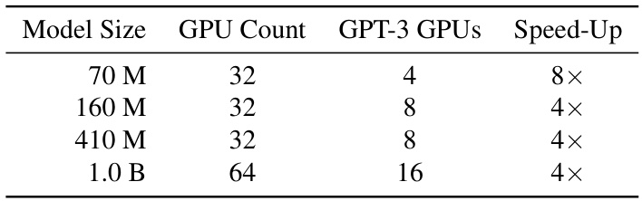
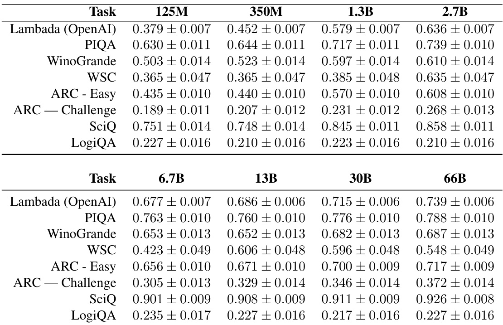

# Pythia : A Suite for Analyzing Large Language Models Across Training and Scaling  

# Stella Biderman     Hailey Schoelkopf     Quentin Anthony   1   Herbie Bradley   1 4   Kyle O’Brien   1 Eric Hallahan   1   Mohammad Aflah Khan   5   Shivanshu Purohit   6 1   USVSN Sai Prashanth   1   Edward Raff   2 Aviya Skowron   1   Lintang Sutawika   1 7   Oskar van der Wal   8  

# Abstract  

How do large language models (LLMs) develop and evolve over the course of training? How do these patterns change as models scale? To an- swer these questions, we introduce  Pythia , a suite of 16 LLMs all trained on public data seen in the exact same order and ranging in size from 70M to 12B parameters. We provide public ac- cess to 154 checkpoints for each one of the 16 models, alongside tools to download and recon- struct their exact training dataloaders for further study. We intend  Pythia  to facilitate research in many areas, and we present several case stud- ies including novel results in memorization, term frequency effects on few-shot performance, and reducing gender bias. We demonstrate that this highly controlled setup can be used to yield novel insights toward LLMs and their training dynam- ics. Trained models, analysis code, training code, and training data can be found at  https:  

//github.com/EleutherAI/pythia .  

# 1. Introduction  

Over the past several years, large transformer models have established themselves as the premier methodology for gen- erative tasks in natural language processing ( Brown et al. , 2020 ;  Sanh et al. ,  2021 ;  Chowdhery et al. ,  2022 ). Beyond NLP, transformers have also made big splashes as genera- tive models in areas as diverse as text-to-image synthesis ( Ramesh et al. ,  2022 ;  Crowson et al. ,  2022 ;  Rombach et al. , 2022 ), protein modeling ( Jumper et al. ,  2021 ;  Ahdritz et al. , 2022 ), and computer programming ( Chen et al. ,  2021 ;  Xu et al. ,  2022 ;  Fried et al. ,  2022 ). Despite these successes, very little is known about how and why these models are so successful.  

Critical to understanding the functioning of transformers is better understanding how these models behave along two axes: training and scaling. It is well established that there are regular and predictable patterns in the behavior of trained language models as they scale ( Kaplan et al. ,  2020 ; Henighan et al. ,  2020 ;  Hernandez et al. ,  2021 ;  Mikami et al. , 2021 ;  Pu et al. ,  2021 ;  Sharma & Kaplan ,  2020 ;  Ghorbani et al. ,  2021 ), but prior work connecting these “Scaling Laws” to the learning dynamics of language models is minimal. One of the driving reasons for this gap in research is a lack of access to appropriate model suites to test theories: al- though there are more publicly available LLMs than ever, they do not meet common requirements for researchers, as discussed in Section  2  of this paper. Of the research along these lines that does exist ( McGrath et al. ,  2021 ;  Tirumala et al. ,  2022 ;  Xia et al. ,  2022 ), it is overwhelmingly done on non-public models or model checkpoints, further emphasiz- ing the importance of having publicly available model suites for scientific research.  

In this paper we introduce  Pythia , a suite of decoder-only autoregressive language models ranging from 70M to 12B parameters designed specifically to facilitate such scientific research. The  Pythia  suite is the only publicly released suite of LLMs that satisfies three key properties:  

1.  Models span several orders of magnitude of model scale. 2.  All models were trained on the same data in the same order. 3.  The data and intermediate checkpoints are publicly available for study.  

We train 8 model sizes each on both the Pile ( Gao et al. , 2020 ;  Biderman et al. ,  2022 ) and the Pile after deduplication, providing 2 copies of the suite which can be compared.  

  
Table 1.  Models in the Pythia suite and select hyperparameters. For a full list of hyper-parameters, see Appendix  E . Models are named based on their total number of parameters, but for most analyses we recommend people use the number of non-embedding parameters as the measure of “size.” Models marked as “equivalent” have the same architecture and number of non-embedding parameters.  

We use these key properties of  Pythia  in order to study for the first time how properties like gender bias, memorization, and few-shot learning are affected by the precise training data processed and model scale. We intend the following ex- periments to be case studies demonstrating the experimental setups  Pythia  enables, and to additionally provide directions for future work.  

Mitigating Gender Bias There is much work cataloging how language models reflect the biases encoded in their training data. However, while some work has explored finetuning’s effects on bias in language models ( Gira et al. 2022 ;  Kirtane et al. ,  2022 ;  Choenni et al. ,  2021 ), or the relationship between the corpus statistics and the measured bias ( Bordia & Bowman ,  2019 ;  Van der Wal et al. ,  2022b ), researchers have generally lacked the tools to study the role of the training data on the learning dynamics of bias in large language models of different sizes. To demonstrate what is now possible with Pythia, we analyze whether deliberately modifying the frequency of gendered terms in the pretrain- ing data of a language model can have an impact on its downstream behavior and biases. We leverage the known pretraining data and public training codebase of our model suite, and counter factually retrain models such that the last  $7\%$   and   $21\%$   of model training has a majority of pronouns modified such that their grammatical gender is feminine rather than masculine. We demonstrate that such interven- tions are successful at reducing bias measures on a targeted benchmark, and propose counterfactual interventions and retrainability of portions of our models as a key tool for future study of the influence of training corpora on model behavior.  

Memorization is a Poisson Point Process Building on the extensive literature on memorization in large language models ( Carlini et al. ,  2019 ;  2021 ;  Hu et al. ,  2022 ), we ask the following question: does the location of a particular sequence in the training dataset influence the likelihood of it being memorized? Leveraging  Pythia ’s reproducible dataloader setup we answer this question in the negative, and furthermore find that a poisson point process is a very good model for the occurrence of memorized sequences over the course of training.  

Emergence of the Impact of Pretraining Frequencies Recent work has identified the frequency of specific facts within a corpus as an important factor in how likely a model is capable of applying that fact in response to a natural lan- guage question ( Razeghi et al. ,  2022 ;  Elazar et al. ,  2022 ; Kandpal et al. ,  2022 ;  Mallen et al. ,  2022 ). Existing work has been heavily dependent on the handful of models trained on public data, such as GPT-J ( Wang & Komatsuzaki ,  2021 ) and BLOOM ( Scao et al. ,  2022 ), which lack frequent in- termediate checkpoints, so none of these papers are able to look at the fine-grained evolution of this phenomenon over the course of training. To address this gap in the literature, we examine how the role of pretraining term frequencies changes over the course of training. We find that a signifi- cant phase change occurs after 65,000 training steps   $45\%$  through training): the models with 2.8 billion parameters or more start to exhibit a correlation between task accuracy and occurrence of task-relevant terms which is not present in prior checkpoints and which is largely absent from smaller models.  

# 2. The Pythia Suite  

Following the advice of  Birhane et al.  ( 2021 ), in this section we seek to explicitly document our choices, rationales, and values in designing and implementing  Pythia . As our goal is to promote scientific research on large language models, we prioritize consistency in model design and controlling for as many potential sources of variation as possible, rather than trying to eke out the most performance from each model. For example, we use the parallel attention and feedforward approach for all models, as it is becoming widely used for the largest models, even though it is generally not recom- mended for models with less than 6B parameters. To our surprise, we find that despite making choices we expect to hurt performance at smaller scales, we find that our models perform the same as equi-parameter OPT models across all scales. We discuss areas where our results contradict widely accepted maxims for training LLMs in Section  2.6 .  

# 2.1. Requirements for a Scientific Suite of LLMs  

Pythia is envisioned as a suite for enabling and empowering scientific research on the capacities and limitations of large language models. After surveying the existing literature, we found no existing suite of models which satisfied all of the following conditions:  

Public Access Models are publicly released and are trained on publicly available data.  

Training Provenance Intermediate checkpoints are avail- able for analysis, all models are trained with the same data ordering, and intermediate checkpoints can be linked with the exact data seen up to that checkpoint. Training pro- cedure as well as model and training hyperparameters are well-documented.  

Consistency Across Scale Model scaling sequences should have self-consistent design decisions that reason- ably adhere to common practice for training state-of-the-art large models. Model sizes should cover a variety of scales across multiple orders of magnitude.  

Table  2  provides our assessment of a number of popular language model suites along these criteria. We note that for “number of checkpoints” we go with the number of checkpoints by the model in the model suite with  the fewest checkpoints . While some model suites (e.g., GPT-Neo, OPT, BLOOM) have a subset that have more available, for most research purposes this is insufficient. This is exacerbated by the fact that typically smaller models are the ones with more checkpoints; the only model suite from the above list whose largest model has more checkpoints than smaller ones is GPT-Neo.  

# 2.2. Training Data  

We train our models on the Pile ( Gao et al. ,  2020 ;  Bi- derman et al. ,  2022 ), a curated collection of English lan- guage datasets for training large language models that is popular for training large autoregressive transformers. This dataset has three major benefits over its competitors: first, it is freely and publicly available; second, it reports a higher downstream performance ( Le Scao et al. ,  2022 ) than popular crawl-based datasets C4 ( Raffel et al. ,  2020 ; Dodge et al. ,  2021 ) and OSCAR ( Su arez et al. ,  2019 ); and third, it has been widely used by state-of-the-art mod- els including  GPT-J-6B  ( Wang & Komatsuzaki ,  2021 ), GPT-NeoX-20B  ( Black et al. ,  2022 ),  Jurassic-1  ( Lieber et al. ,  2021 ) 1 , Megatron-Turing NLG 530B ( Smith et al. , 2022 ), OPT ( Zhang et al. ,  2022 ), and WuDao ( Tang ,  2021 ). We use the tokenizer developed by  Black et al.  ( 2022 ), which is a BPE tokenizer that is trained specifically on the Pile.  

While we considered training on a multilingual corpus in- stead of a monolingual one, we ultimately opted against doing so for the following reasons:  

1.  While we are confident that we are generally aware of the contents and quality of the Pile, we cannot say the same for multilingual datasets. Existing mas- sive multilingual datasets can be of dubious quality ( Caswell et al. ,  2020 ;  Kreutzer et al. ,  2021 ) and we do not feel qualified to vet existing multilingual datasets well enough to determine issues that may arise due to using them. ROOTS ( Lauren c on et al. ,  2022 ), the dataset that BLOOM ( Scao et al. ,  2022 ) was trained on, was styled after the Pile and would potentially be a good candidate, but it was not publicly available when we started training our models.  

2.  As this framework is intended to be used as a baseline for future research, we feel it is important to stay close to currently accepted common practices. While the Pile is widely used for training English-language models, there is no equally widespread multilingual dataset. In particular, ROOTS has not been used to train models beyond BLOOM.  

3.  We do not have access to a multilingual evaluation framework that is anywhere near as comprehensive as Gao et al.  ( 2021 ).  

We train 2 copies of the  Pythia  suite using identical archi- tectures. Each suite contains 8 models spanning 8 different sizes. We train one suite of 8 models on the Pile, and the other on a copy of the Pile after applying near-deduplication with MinHashLSH and a threshold of 0.87, following the advice that LLMs trained on deduplicated data are better and memorize less of their data ( Lee et al. ,  2021 ). After deduplication, the deduplicated Pile is approximately 207B tokens in size, compared to the original Pile which contains 300B tokens.  

# 2.3. Architecture  

Our model architecture and hyperparameters largely follow Brown et al.  ( 2020 ), with a few notable deviations based on recent advances in best practices for large scale language  

  
Table 2.  Commonly used model suites and how they rate according to our requirements. Further information can be found in Appendix  F.1  

modeling ( Black et al. ,  2022 ;  Chowdhery et al. ,  2022 ;  Zeng et al. ,  2022 ):  

1.  Brown et al.  ( 2020 ) describes using sparse and dense attention layers in alternation, while we follow all sub- sequent work and use fully dense layers for our models. 2.  We use Flash Attention ( Dao et al. ,  2022 ) during train- ing for improved device throughput. 3.  We use rotary embeddings introduced by  Su et al. ( 2021 ) and now in widespread use ( Black et al. ,  2022 ; Chowdhery et al. ,  2022 ;  Zeng et al. ,  2022 ) as our posi- tional embedding type of choice. 4.  We use the parallelized attention and feedforward tech- nique and model initialization methods introduced by Wang & Komatsuzaki  ( 2021 ) and adopted by ( Black et al. ,  2022 ;  Chowdhery et al. ,  2022 ), because they im- prove training efficiency and do not harm performance. 5. We use untied embedding / unembedding matrices, as prior work has suggested that this makes interpretabil- ity research easier ( Belrose et al. ,  2023 ).  

# 2.4. Training  

We train our models using the open source library GPT- NeoX ( Andonian et al. ,  2021 ) developed by EleutherAI. We train using Adam and leverage the Zero Redundancy Opti- mizer (ZeRO) ( Rajbhandari et al. ,  2020 ) to efficiently scale to multi-machine set-ups. We additionally leverage data par- allelism ( Goyal et al. ,  2017 ) and tensor parallelism ( Shoeybi et al. ,  2019 ) as appropriate to optimize performance. We use Flash Attention ( Dao et al. ,  2022 ) for improved hardware throughput.  

The most notable divergence from standard training proce- dures is that we use a much larger batch size than what is standard for training small language models. It is widely held ( McCandlish et al. ,  2018 ;  Zhang et al. ,  2019 ;  Kaplan et al. ,  2020 ;  Brown et al. ,  2020 ;  Hoffmann et al. ,  2022 )  

that using larger batch sizes is desirable, but that smaller LLMs require smaller batch sizes to avoid convergence is- sues. Contrary to this literature, we find no convergence issues with using batch sizes  $4\times$   to  $8\times$   what is considered standard for models with less than 1 billion parameters. Consequently, we use a batch size of 1024 samples with a sequence length of 2048 (2,097,152 tokens) for all models, in order to maintain consistency across all  Pythia  model training runs.  

  

Table 3.  Models in the Pythia suite, number of GPUs used during training, and the number of GPUs we would have been able to use had we used the GPT-3 suite’s batch sizes. Due to the ability of GPT-NeoX to scale linearly as the number of GPUs increases, this produces substantial wall-clock speed-ups for small models. All GPUs are A100s with 40 GiB VRAM.  

A large batch size is essential to training models quickly: in a regime where one is not bottlenecked by access to GPUs or high quality interconnect, doubling the batch size halves the training time. A maximum batch size therefore directly implies a  minimum  wall-clock training time and maximum  number of compute-saturated GPUs. By inflating batch sizes beyond previous standards, we achieve wall- clock speed-ups of factors as large as  $10\times$   compared with standard batch sizes on our smaller models (Table  5 ). We also note that our models still perform on par with widely used models of the same size like GPT-Neo ( Black et al. , 2021 ) or OPT ( Zhang et al. ,  2022 ) (see Appendix  G  for plots on common benchmarks).  

We save model checkpoints at initialization and every 2,097,152,000 tokens (or 1,000 iterations), resulting in  144 checkpoints evenly spaced throughout training. Addition- ally, we save log-spaced checkpoints early in training at iterations    $\{1,2,4,8,16,32,64,128,256,512\}$  . This gives a total of  154  checkpoints per model, far more than any other suite of publicly available language models.  

We train all models for   $299{,}892{,}736{,}000\approx3000$   tokens, token-matching our models to the original GPT-3 and OPT model suites. The standard (duplicated) Pile is 334B tokens using the GPT-NeoX tokenizer, so some data in the Pile may not be seen by the standard Pythia models. For this reason we urge anyone seeking to study the effect of training data on the Pythia models use our provided data loaders to ensure accurate counts. The deduplicated Pile only contains 207B tokens, so we run for  ${\approx}1.5$   epochs on it. This allows users of the Pythia suite to study deduplication in greater detail by comparing models shortly before the epoch boundary to those slightly after the epoch boundary. We find that there is no evidence that the second epoch negatively impacts evaluation scores on a variety of benchmarks (for more information, see Section  2.6  and Appendix  G ).  

We refer to the models trained on the original Pile as “Pythia-xxx”, where ‘xxx’ is the model’s total parameter count rounded to 2 significant figures, and their counterparts trained on the deduplicated Pile as “Pythia-xxx-deduped”.  

# 2.5. Evaluation  

While the primary focus of this work is to promote scien- tific research on the behaviors of large language models, and state-of-the-art performance is not necessarily a core requirement, we find that Pythia and Pythia (Deduplicated) perform very similarly to OPT and BLOOM models on a variety of NLP benchmarks. These results are presented in Appendix  G . We use the Language Model Evaluation Har- ness ( Gao et al. ,  2021 ) to run evaluations on eight common language modeling benchmarks (Appendix  G ). We consis- tently find that Pythia and Pythia (Deduplicated) perform very similarly to OPT and BLOOM models.  

# 2.6. Novel Observations in Evaluation  

We find three interesting phenomena that run counter to the prevailing narratives in the literature. Firstly, we find that deduplication of our training data has no clear bene- fit on language modeling performance. This is consistent with the results of  Black et al.  ( 2022 ), but inconsistent with other papers. This may indicate that the upsampling of cer- tain subsets of the Pile does not accord with conventional assumptions about duplicated data, or that the general ten- dency of deduplicated data to outperform non-deduplicated data is primarily a statement about the quality of the data used in other works. Secondly, we find that we achieve (equi-token and equi-parameter) performance on-par with OPT despite the use of parallel attention  $+\,\mathbf{MLP}$   sublayers at all model scales. Both  Black et al.  ( 2022 ) and  Chowdhery et al.  ( 2022 ) state that this architecture choice causes a per- formance regression at scales  $<6\mathrm{B}$   parameters. Thirdly, we find a minimal and inconsistent “curse of multilinguality” ( Conneau et al. ,  2020 ;  Pfeiffer et al. ,  2022 ) for BLOOM. While BLOOM certainly underperforms other models on LAMBADA, PIQA, and WSC, it does not appear to do so on WinoGrande, ARC-easy, ARC-challenge, SciQ, and LogiQA. We interpret this as a sign that some of the existing literature on the curse of multilinguality may need to be revisited using more diverse evaluation benchmarks. Plots supporting all of these claims can be found in Appendix  G .  

# 2.7. Public Release and Reproducibility  

To ensure that our work is fully reproducible, we seek to only make use of codebases and dependencies that are freely and publicly available. As previously mentioned, we use the open source GPT-NeoX and DeepSpeed libraries for training. For evaluating our models we use the Language Model Evaluation Harness ( Gao et al. ,  2021 ) and run all evaluations ourselves instead of copying claimed results from previous papers.  

We release all of our models and checkpoints to the public under the Apache 2.0 license via the HuggingFace Hub ( Wolf et al. ,  2019 ) 2   We additionally release the code used for all evaluations and the raw benchmark scores generated on GitHub.  

In addition to training our models on the public Pile dataset, we also provide a tool for downloading the pre-tokenized data files utilized by our dataloader in the GPT-NeoX library, as well as a script that can be used to reproduce the exact dataloader used by our models during training, so that the contents of each batch at each training step can be read out or saved to disk by researchers.  

# 3. Case Studies  

We perform three case studies in language modeling re- search that would not have been possible to perform using any pre-existing model suites. These case studies were cho- sen to cover a variety of topical domains and address small but important questions in their respective fields. We es- pecially seek to leverage the public training data order to derive novel insights about these models that have not been previously studied.  

# 3.1. How Does Data Bias Influence Learned Behaviors?  

Large language models are typically trained on minimally curated human-authored data. While it is widely known that models typically learn the biases encoded in their training data, virtually nothing is known about the actual learning dynamics of how these biases develop throughout training. This is particularly concerning as one of the best established phenomena in the study of bias in deep learning models is  bias amplification —the fact that social biases in deep learning models tend to be more extreme than those found in their training data ( Zhao et al. ,  2017 ;  Hirota et al. ,  2022 ; Hall et al. ,  2022 ). To mitigate the biases learned from data, previous works have used finetuning on balanced datasets to reduce the gender bias of language models with some success ( Levy et al. ,  2021 ;  Gira et al. ,  2022 ;  Kirtane et al. , 2022 ), yet little is known about the role of specific corpus statistics in the emergence of bias during pretraining.  

We seek to investigate a counterfactual claim—if we were to train our models on a corpus with different properties, how would these models’ properties change downstream? To test the effects of corpus statistics on the biases learned by lan- guage models, we repeat segments of pretraining on specific models, with altered corpus statistics. In particular, for the size 70M, 410M, 1.4B, and 6.9B Pythia (deduplicated) mod- els, we take a checkpoint and optimizer state 21B tokens  $(7\%)$   prior to the end of training, and resume training of the model such that it sees the exact same data until the end of training, but with morphologically masculine pronouns replaced by their feminine counterparts. We also repeat this intervention for 63B tokens   $(21\%)$   prior to the end of training on just the Pythia-1.4B-deduped model. We then measure model performance on the WinoBias ( Zhao et al. , 2018 ) benchmark and the English subset of the multilin- gual CrowS-Pairs ( N ev eol et al. ,  $2022)^{4}$    to observe whether this altered pretraining data affects downstream gender bias. Neither of these benchmarks were originally intended for autoregressive language models or text generation, so we describe our modifications to the evaluation setups in Ap- pendix  C.1 .  

The controlled setup provided by Pythia—with precise ac- cess to the data samples seen during training—enables us to isolate the effect of pronoun frequency in pretraining. If instead we chose to compare two different training datasets, we would change a large number of potential explanatory factors that we cannot control for. In fact, it has been suggested that even the choice of hyperparameters, such as the data ordering, can have an effect on the resulting bias ( D’Amour et al. ,  2020 ). Therefore, without being able to resume pretraining on the exact same data in the exact same order, we could not be confident our experiment was indeed measuring only the effect of particular gendered terms’ frequency.  

For our WinoBias implementation (see Appendix  C.1 ), we see a clear effect of the intervention in Figure  2 : a de- crease in stereotypical accuracy for each intervention and across model scale. On the largest model scale tested, 6.9B, applying the intervention also successfully changes the model throughout training on the intervention from a pro-stereotypical bias to an anti-stereotypical one. We hy- pothesize that these results indicate that larger capacity mod- els show less pro-stereotypical bias due to their ability to learn more complex relationships between occupation and pronouns, and that the intervention effect size increases across scale for similar reasons.  

  
Figure 1.  The CrowS-Pairs gender bias, shown as the percentage of times that the perplexity of the stereotyping sentence is lower than its less stereotyped counterpart (  $\%$   Stereotype) for the Pythia models of different sizes at the end of training. We also show the effect of the gender swapping intervention on the measured bias for the partially retrained models.  

  
Figure 2.  The WinoBias gender bias results, shown as the propor- tion of the time that the model placed a higher log probability on the more stereotyped pronoun as an answer to a multiple choice gender–occupation co-reference question.  

Figure  1  shows the progression of the CrowS-Pairs gen- der bias metric and the effect of the interventions. We can clearly see a reduction in the bias as a result of swap- ping the gendered pronouns in the last  $7\%$   or   $21\%$   of the training for all model sizes, but most prominently for the larger ones, although these are also more biased to begin with. We hypothesize that because larger models are bet- ter at modeling correlations and distributions within their corpora, their increased capacity causes features of bias to be more strongly or robustly learned. We also see that the interventions only lead to a marginal decrease in the model perplexity on LAMBADA ( Paperno et al. ,  2016 ) (Ap- pendix  C.1 ), which demonstrates the effectiveness of the bias mitigation without hurting language modeling perfor- mance downstream to a large degree. Whether the noisiness of the progression reflects actual changes in the language model’s bias or poor reliability of CrowS-Pairs is an open question we leave for future work.  

We propose that performing such modifications to portions of language model training data, retraining, and comparing to the baseline model (“interventions”) should be studied further for applications including but not limited to investi- gating bias amplification and devising new mitigation strate- gies. For example, while not explored in this case study, we think that the finegrained information that Pythia provides on the data seen during training could benefit the promis- ing literature on influence functions to estimate the role of specific training samples on the encoded bias ( Brunet et al. , 2019 ;  Silva et al. ,  2022 ). While this was beyond the scope of this case study, we believe that the extensive availability of checkpoints, consistent training order, and retrainabil- ity could be useful in assessing the  test-retest reliability  of existing bias measures ( Van der Wal et al. ,  2022a ).  

# 3.2. Does Training Order Influence Memorization?  

Although memorization in neural language models is widely studied, many basic questions about the dynamics of mem- orization remain unanswered. Prior work on the dynamics of memorization is generally limited to a few models in isolation ( Jagielski et al. ,  2022 ;  Elazar et al. ,  2022 ) or pa- pers which train (but do not release) custom models for their studies ( Tirumala et al. ,  2022 ;  Hernandez et al. ,  2022 ). Carlini et al.  ( 2022 ) studies the impact of scaling on memo- rization and repeatedly remark on the lack of suitable model suites for their study. They ultimately focus on the GPT-Neo model suite ( Black et al. ,  2021 ;  Wang & Komatsuzaki ,  2021 ; Black et al. ,  2022 ), despite the fact that these models were trained on slightly different datasets, in different orders, and with inconsistent checkpointing.  

In this experiment we test whether training order influences memorization. This is an explicitly theoretically-driven ex- periment: several authors realized that their mental model of transformers was that they work iteratively—by adding new information to a latent space and then processing the space as a whole to obtain a better representation. This mental model predicts that data encountered later in training will be memorized more, as the model has had less time to incorporate it more fully into its representation space. If true, this would potentially be highly useful for mitigating the memorization of sequences for which verbatim memo- rization would be undesirable, by intentionally modifying a model’s training data order prior to training.  

To test our hypothesis, we measure the memorization of an initial segment of each sequence in the training corpus. While there are several reasonable definitions of memoriza- tion, we use the one from  Carlini et al.  ( 2021 ) as it has received considerable attention in the literature ( Yoon & Lee ,  2021 ;  Huang et al. ,  2022 ;  Ginart et al. ,  2022 ;  Ippolito et al. ,  2022 ;  Biderman et al. ,  2023 ). In their context, a string is    $(k,\ell)$  -memorized if prompting the model with a string of length    $k$   from the training data induces the model to gener- ate the next  $\ell$  tokens from the training data correctly. We choose    $k=\ell=32$   largely arbitrarily, and note that doing all reasonable pairs of    $(k,\ell)$   would have a computational cost comparable to retraining all of our models from scratch. To avoid potential covariate effects, we only use the first 64 tokens from each context seen during training.  

Surprisingly, we find that a Poisson model fits the data ex- tremely well (Figure  3 ), indicating that training order has little impact on memorization. This model implies that mem- orized sequences are not spaced more densely toward the beginning or end of training, and that between each check- point roughly the same number of memorized sequences can be found.  

The Poisson process here describes an event of the occur- rence of a memorized sequence within a batch of training data. As the evaluation was performed on the first 64 tokens of every sequence within the training corpus, in the same order of training, we can consider each batch to represent a hypothetical time interval, where a unit of time corresponds to a sequence of the training corpus, with sample distribu- tion defined as the number of memorized sequences in a batch of training data, and the theoretical distribution as the best fit Poisson distribution from samples. We use a batch size of 512 sequences for these plots, but we observe similar results for various batch sizes.  

The count (color bar to the right in Figure  3 ) indicates the density of plotted points (also indicated by size) on the Q-Q plot. Q-Q plots serve the purpose of being a goodness of fit test for asserting the fact that the rate of occurrence of memorized sequences in training data is uniform.  

This finding is important for practitioners seeking to control which sequences are memorized by a model. It implies that one cannot simply place sequences that are undesir- able to memorize at the beginning or end of training and  

  
Figure 3.  Quantile-Quantile plot of rate of occurrence of memo- rized sequences in 12B model compared to a Poisson Point Process, with (top) and without (bottom) deduplication. Color and dot size indicates number of points. We assume each mini-batch to be a time-slice in a Poisson process where we count the events (number of memorized sequences) within a time-slice.  

successfully reduce the chance of memorization. However, we propose that a practitioner especially worried about the memorization of certain sequences place those sequences at the beginning of training, thus increasing the odds that the practitioner may observe prior to the completion of the training run that undesirable memorization behavior occurs in the partially-trained model.  

# 3.3. Do Pretraining Term Frequencies Influence Task Performance Throughout Training?  

Recent work has explored the effect of statistics of language model corpora on numerous downstream tasks. Findings presented in  Shin et al.  ( 2022 ) demonstrate how the pre- training corpus can impact few-shot performance, while Razeghi et al.  ( 2022 ) investigates how models are able to perform numerical reasoning from in a few-shot setting. By charting the performance of a arithmetic task given an input operand and the frequency at which it is found in the pre- training corpus, they concluded that accuracy tends to be higher for terms that are found more frequently compared to terms that are less frequent. Other works also suggest that the pretraining corpus has a significant impact on few- shot behavior ( Elazar et al. ,  2022 ;  Kandpal et al. ,  2022 ). These works observe a correlational and causal relationship between the ability to answer factual questions and the fre- quency of salient entities found in the pretraining corpus. While the aforementioned works experiment with various model sizes, it is not yet studied when during training and at what model sizes this effect occurs. We further investigate this phenomenon across model checkpoints and model sizes by adapting arithmetic tasks of multiplication and addition ( Razeghi et al. ,  2022 ) and a QA task ( Kandpal et al. ,  2022 ) using natural language prompts evaluated over a set of    $k\cdot$  - shot settings. We calculate the relevant term frequencies for all model checkpoints based on the pretraining data seen by each checkpoint, which means counting through each subset of the pretraining corpus sampled and seen by the model up to each chosen train step. Model evaluation was performed on the  Pythia  (Deduplicated) suite using the LM Evaluation Harness ( Gao et al. ,  2021 ).  

Following  Razeghi et al.  ( 2022 ), the formulation of the ask consists of  put operands    $x_{1}\in[0,99]$   and  $x_{2}\in[1,50]$   ∈  and an output  y . The input operan  are con- verted into a prompt with the prompt template  “Q:What is  $x_{1}\#\,x_{2}\,?\,A$  :”  with # being  “plus”  for addition and  “times” for multiplication. We measure the accuracy of a prompt instance by checking the model’s prediction against  $y$  . To measure the term frequency and task performance correla- tion, the average accuracy of all prompts with the same    $x_{1}$  over all values of    $x_{2}$   is mapped to the number of times    $x_{1}$  is found in the sampled pretraining data that each evaluated model checkpoint sees. In few-shot settings, we sample examples with digits that differ from the  $x_{1}$   values being measured.  

As a QA task, we use TriviaQA ( Joshi et al. ,  2017 ) with a simple tem late of    ${}^{**}Q\colon x_{1}\ \backslash n\ A\colon y^{**}$   with  $x_{1}$   being the question and  y  answer, where  y  is included for a few-shot sample or left blank for the sample being evaluated. The model prediction is evaluated with exact match over the set of possible answers. The term frequencies of a single question-answer pair (“QA pair”) are calculated based on the number of times all salient entities of that QA pair appear in a sampled pretraining data sequence seen by a given checkpoint. We follow the original experiment using 4 shots and evaluate both the training and the validation split of the dataset. Performance is averaged over a group of log-spaced bins.  

We observe that for both arithmetic and QA experiments, model sizes affect the correlation between average perfor- mance and the term frequencies, indicating that this corre- lation is an emergent property in larger models. Smaller  

  
Figure 4.  Accuracy on Trivia QA plotted againts the number of relevant entity counts found in a QA-pair. Each subfigure shows the impact of performance across various model sizes over multiple intermediate checkpoints. (With train step counts denoted by color on the right) Each point represents the average accuracy (  $y$  -axis) of binned counts (  $x$  -axis).  

models rarely produce accurate results on the task despite being given up to 16 few-shot examples, as shown in Fig- ure  7 , where models at sizes below 1 billion are unable to perform well even in later stages of training, suggesting that these models are not successful at learning these tasks regardless of frequency of pertinent information in their training data. Similar patterns can be seen in Figure  4  where performance increase as training progresses mainly happens for larger models only. For the multiplication task, we also calculate the performance discrepancy between the top  $10\%$  most frequent input operands and the bottom   $10\%$   least fre- quent input operands also following  Razeghi et al.  ( 2022 ) (see Table  4 ). We find that this performance gap widens over the course of training.  

Pythia  allows the observation of the dynamics of which term frequencies affect performance in greater clarity than previ- ous works. With confounding factors such as difference in model architecture, pretraining datasets, and training hyper- parameters removed, we can better understand when effects that term frequencies have over a model’s task performance occur. In practice, observing the phenomenon with respect to model size and intermediate checkpoints allows for better choices in future training runs. For example, if one cares about a model knowing the answer to some given question, one can calculate how many times that information occurs in the training data to predict whether it is likely or less likely a model of X size will be capable of retaining and recalling this information from its training data.  

# 4. Conclusion  

tiple orders of magnitude of scale. We demonstrate how Pythia can be used to empower experiments at unprece- dented levels of detail for a public model suite by present- ing novel analyses and results on gender debiasing, mem- orization, and term frequency effects. We hope that these analyses will inspire further follow-up work showing how pretraining data drives the acquisition and emergence of capabilities across more complex tasks and that these mod- els and their dataset tooling will be broadly useful for a variety of practitioners, and recommend using the suite as a framework for novel experimental setups on LLMs.  

# Acknowledgments  

We are grateful to Stability AI for providing the compute required to train these models, and to CoreWeave for pro- viding compute for some of the evaluations. OW’s contribu- tions are financed by the Dutch Research Council (NWO) as part of project 406.DI.19.059. HB’s contributions were supported by the UKRI Centre for Doctoral Training in Application of Artificial Intelligence to the study of Envi- ronmental Risks (reference EP/S022961/1).  

We thank Nora Belrose, Tim Dettmers, Percy Liang, Yasaman Razeghi, Mengzhou Xia, and various members of the EleutherAI Discord Server for their feedback.  

We also thank the developers of the GPT-NeoX, Megatron- DeepSpeed, and NeMo Megatron libraries for their assis- tance and support, and Vincent Hellendoorn for contributing the implementation of Flash Attention, enabling us to save substantial time training the models.  

We release  Pythia , a suite of language models trained with consistent data ordering and model architecture across mul-  

# References  

Ahdritz, G., Bouatta, N., Kadyan, S., Xia, Q., Gerecke, W., O’Donnell, T. J., Berenberg, D., Fisk, I., Zanichelli, N., Zhang, B., et al. Openfold: Retraining alphafold2 yields new insights into its learning mechanisms and capacity for generalization.  bioRxiv , 2022.  

Andonian, A., Anthony, Q., Biderman, S., Black, S., Gali, P., Gao, L., Hallahan, E., Levy-Kramer, J., Leahy, C., Nestler, L., Parker, K., Pieler, M., Purohit, S., Songz, T., Phil, W., and Weinbach, S. GPT-NeoX: Large scale autoregressive language modeling in PyTorch, 8 2021. URL  https://www.github.com/eleutherai/ gpt-neox .  

Bach, S. H., Sanh, V., Yong, Z.-X., Webson, A., Raffel, C., Nayak, N. V., Sharma, A., Kim, T., Bari, M. S., Fevry, T., Alyafeai, Z., Dey, M., Santilli, A., Sun, Z., Ben-David, S., Xu, C., Chhablani, G., Wang, H., Fries, J. A., Al-shaibani, M. S., Sharma, S., Thakker, U., Almubarak, K., Tang, X., Tang, X., Jiang, M. T.-J., and Rush, A. M. Promptsource: An integrated development environment and repository for natural language prompts, 2022.  

Belrose, N., Furman, Z., Smith, L., Halawi, D., Ostrovsky, I., McKinney, L., Biderman, S., and Steinhardt, J. Eliciting latent predictions from transformers with the tuned lens. arXiv preprint arXiv:2303.08112 , 2023.  

Biderman, S., Bicheno, K., and Gao, L. Datasheet for the Pile.  Computing Research Repository , 2022. doi: 10.48550/arXiv.2201.07311. URL  https://arxiv. org/abs/2201.07311v1 . Version 1.  

Biderman, S., Prashanth, U. S., Sutawika, L., Purohit, S., Schoelkopf, H., Anthony, Q., and Raff, E. Emergent and predictable memorization in large language models. Preprint under review , 2023.  

Birhane, A., Kalluri, P., Card, D., Agnew, W., Dotan, R., and Bao, M. The values encoded in machine learning research.  Computing Research Repository , 2021. doi: 10.48550/arXiv.2106.15590. URL  https://arxiv. org/abs/2106.15590v2 . Version 2.  

Black, S., Gao, L., Wang, P., Leahy, C., and Biderman, S. GPT-Neo: Large scale autoregressive language modeling with Mesh-TensorFlow.  GitHub , 2021. URL  https: //www.github.com/eleutherai/gpt-neo .  

Black, S., Biderman, S., Hallahan, E., Anthony, Q., Gao, L., Golding, L., He, H., Leahy, C., McDonell, K., Phang, J., et al. GPT-NeoX-20B: An open-source autoregressive language model. In  Proceedings of BigScience Episode #5–Workshop on Challenges & Perspectives in Creating Large Language Models , pp. 95–136, 2022.  

Blodgett, S. L., Lopez, G., Olteanu, A., Sim, R., and Wallach, H. Stereotyping Norwegian salmon: An in- ventory of pitfalls in fairness benchmark datasets. In Proceedings of the 59th Annual Meeting of the Associa- tion for Computational Linguistics and the 11th Interna- tional Joint Conference on Natural Language Process- ing (Volume 1: Long Papers) , pp. 1004–1015, Online, August 2021. Association for Computational Linguis- tics. doi: 10.18653/v1/2021.acl-long.81. URL  https: //aclanthology.org/2021.acl-long.81 .  

Bordia, S. and Bowman, S. Identifying and reducing gender bias in word-level language models. In  Proceedings of the 2019 Conference of the North American Chapter of the Association for Computational Linguistics: Student Research Workshop , pp. 7–15, 2019.  

Brown, T., Mann, B., Ryder, N., Subbiah, M., Kaplan, J. D., Dhariwal, P., Neelakantan, A., Shyam, P., Sastry, G., Askell, A., Agarwal, S., Herbert-Voss, A., Krueger, G., Henighan, T., Child, R., Ramesh, A., Ziegler, D., Wu, J., Winter, C., Hesse, C., Chen, M., Sigler, E., Litwin, M., Gray, S., Chess, B., Clark, J., Berner, C., McCandlish, S., Radford, A., Sutskever, I., and Amodei, D. Language models are few-shot learners. In  Advances in Neural Information Processing Systems , volume 33, pp. 1877– 1901, 2020.  

Brunet, M.-E., Alkalay-Houlihan, C., Anderson, A., and Zemel, R. Understanding the origins of bias in word embeddings. In  International conference on machine learning , pp. 803–811. PMLR, 2019.  

Carlini, N., Liu, C., Erlingsson,   U., Kos, J., and Song, D. The secret sharer: Evaluating and testing unintended memorization in neural networks. In  28th USENIX Se- curity Symposium (USENIX Security 19) , pp. 267–284, 2019.  

Carlini, N., Tramer, F., Wallace, E., Jagielski, M., Herbert- Voss, A., Lee, K., Roberts, A., Brown, T., Song, D., Erlingsson, U., et al. Extracting training data from large language models. In  30th USENIX Security Symposium (USENIX Security 21) , pp. 2633–2650, 2021.  

Carlini, N., Ippolito, D., Jagielski, M., Lee, K., Tramer, F., and Zhang, C. Quantifying memorization across neu- ral language models.  arXiv preprint arXiv:2202.07646 , 2022.  

Caswell, I., Breiner, T., van Esch, D., and Bapna, A. Lan- guage id in the wild: Unexpected challenges on the path to a thousand-language web text corpus. In  Proceedings of the 28th International Conference on Computational Linguistics , pp. 6588–6608, 2020.  

Chen, M., Tworek, J., Jun, H., Yuan, Q., Pinto, H. P. d. O., Kaplan, J., Edwards, H., Burda, Y., Joseph, N., Brockman, G., Ray, A., Puri, R., Krueger, G., Petrov, M., Khlaaf, H., Sastry, G., Mishkin, P., Chan, B., Gray, S., Ryder, N., Pavlov, M., Power, A., Kaiser, L., Bavarian, M., Winter, C., Tillet, P., Such, F. P., Cummings, D., Plappert, M., Chantzis, F., Barnes, E., Herbert-Voss, A., Guss, W. H., Nichol, A., Paino, A., Tezak, N., Tang, J., Babuschkin, I., Balaji, S., Jain, S., Saunders, W., Hesse, C., Carr, A. N., Leike, J., Achiam, J., Misra, V., Morikawa, E., Radford, A., Knight, M., Brundage, M., Murati, M., Mayer, K., Welinder, P., McGrew, B., Amodei, D., McCandlish, S., Sutskever, I., and Zaremba, W. Evaluating large language models trained on code.  Computing Research Repository , 2021. doi: 10.48550/arXiv.2107.03374. URL  https: //arxiv.org/abs/2107.03374v2 . Version 2.  

Choenni, R., Shutova, E., and van Rooij, R. Stepmothers are mean and academics are pretentious: What do pretrained language models learn about you? In  Proceedings of the 2021 Conference on Empirical Methods in Natural Language Processing , pp. 1477–1491, 2021.  

Chowdhery, A., Narang, S., Devlin, J., Bosma, M., Mishra, G., Roberts, A., Barham, P., Chung, H. W., Sutton, C., Gehrmann, S., et al. PaLM: Scaling language model- ing with Pathways. Computing Research Repository , 2022. doi: 10.48550/arXiv.2204.0231. URL  https: //arxiv.org/abs/2204.02311v5 . Version 5.  

Conneau, A., Khandelwal, K., Goyal, N., Chaudhary, V., Wenzek, Guillaume andGuzm an, F., Grave, E., Ott, Myle andZettlemoyer, L., and Stoyanov, V. Unsuper- vised cross-lingual representation learning at scale. In Jurafsky, D., Chai, J., Schluter, N., and Tetreault, J. R. (eds.),  Proceedings of the 58th Annual Meeting of the As- sociation for Computational Linguistics , pp. 8440–8451, Online, 07 2020. Association for Computational Linguis- tics. doi: 10.18653/v1/2020.acl-main.747. URL  https: //aclanthology.org/2020.acl-main.747 .  

Crowson, K., Biderman, S., Kornis, D., Stander, D., Halla- han, E., Castricato, L., and Raff, E. VQGAN-CLIP: Open domain image generation and editing with nat- ural language guidance.  Computing Research Repos- itory , 2022. doi: 10.48550/arXiv.2204.08583. URL https://arxiv.org/abs/2204.08583v2 . Ver- sion 2.  

Dao, T., Fu, D. Y., Ermon, S., Rudra, A., and R e, C. Flashat- tention: Fast and memory-efficient exact attention with io-awareness.  arXiv preprint arXiv:2205.14135 , 2022.  

Dodge, J., Sap, M., Marasovi c, A., Agnew, W., Ilharco, G., Groeneveld, D., Mitchell, M., and Gardner, M. Docu- menting large webtext corpora: A case study on the colos- sal clean crawled corpus. In  Proceedings of the 2021  

Conference on Empirical Methods in Natural Language Processing , pp. 1286–1305, 2021.  

D’Amour, A., Heller, K., Moldovan, D., Adlam, B., Ali- panahi, B., Beutel, A., Chen, C., Deaton, J., Eisenstein, J., Hoffman, M. D., et al. Under specification presents challenges for credibility in modern machine learning. Journal of Machine Learning Research , 2020.  

Elazar, Y., Kassner, N., Ravfogel, S., Feder, A., Ravichan- der, A., Mosbach, M., Belinkov, Y., Sch utze, H., and Goldberg, Y. Measuring causal effects of data statistics on language model’sfactual’predictions.  arXiv preprint arXiv:2207.14251 , 2022.  

Fried, D., Aghajanyan, A., Lin, J., Wang, S., Wallace, E., Shi, F., Zhong, R., Yih, W.-t., Zettlemoyer, L., and Lewis, M. InCoder: A generative model for code infilling and synthesis.  Computing Research Repository , 2022. doi: 10.48550/arXiv.2204.05999. URL  https://arxiv. org/abs/2204.05999v2 . Version 2.  

Gao, L. On the sizes of openai api models.  EleutherAI Blog , 2021.  

Gao, L., Biderman, S., Black, S., Golding, L., Hoppe, T., Foster, C., Phang, J., He, H., Thite, A., Nabeshima, N., Presser, S., and Leahy, C. The Pile: An 800GB dataset of diverse text for language modeling.  Computing Research Repository , 2020. doi: 10.48550/arXiv.2101.00027. URL https://arxiv.org/abs/2101.00027v1 . Ver- sion 1.  

Gao, L., Tow, J., Biderman, S., Black, S., DiPofi, A., Foster, C., Golding, L., Hsu, J., McDonell, K., Muennighoff, N., Phang, J., Reynolds, L., Tang, E., Thite, A., Wang, B., Wang, K., and Zou, A. A framework for few-shot language model evaluation. September 2021. doi: 10. 5281/zenodo.5371628. URL  https://doi.org/10. 5281/zenodo.5371628 .  

Ghorbani, B., Firat, O., Freitag, M., Bapna, A., Krikun, M., Garcia, X., Chelba, C., and Cherry, C. Scaling laws for neural machine translation. Computing Research Repository , 2021. doi: 10.48550/arXiv.2109.07740. URL https://arxiv.org/abs/2109.07740v1 . Ver- sion 1.  

Ginart, A., van der Maaten, L., Zou, J., and Guo, C. Sub- mix: Practical private prediction for large-scale language models.  arXiv preprint arXiv:2201.00971 , 2022.  

Gira, M., Zhang, R., and Lee, K. Debiasing pre-trained language models via efficient fine-tuning. In  Proceedings of the Second Workshop on Language Technology for Equality, Diversity and Inclusion , pp. 59–69, 2022.  

Goyal, P., Doll ar, P., Girshick, R. B., Noordhuis, P., Wesolowski, L., Kyrola, A., Tulloch, A., Jia, Y., and He, K. Accurate, large minibatch SGD: training ima- genet in 1 hour.  CoRR , abs/1706.02677, 2017. URL http://arxiv.org/abs/1706.02677 .  

Hall, M., van der Maaten, L., Gustafson, L., and Adcock, A. A systematic study of bias amplification.  arXiv preprint arXiv:2201.11706 , 2022.  

Henighan, T., Kaplan, J., Katz, M., Chen, M., Hesse, C., Jackson, J., Jun, H., Brown, T. B., Dhariwal, P., Gray, S., Hallacy, C., Mann, B., Radford, A., Ramesh, A., Ryder, N., Ziegler, D. M., Schulman, J., Amodei, D., and McCandlish, S. Scaling laws for autoregres- sive generative modeling.  Computing Research Repos- itory , 2020. doi: 10.48550/arXiv.2010.14701. URL https://arxiv.org/abs/2010.14701v2 . Ver- sion 2.  

Hernandez, D., Kaplan, J., Henighan, T., and McCandlish, S. Scaling laws for transfer.  Computing Research Repos- itory , 2021. doi: 10.48550/arXiv.2102.01293. URL https://arxiv.org/abs/2102.01293v1 . Ver- sion 1.  

Hernandez, D., Brown, T., Conerly, T., DasSarma, N., Drain, D., El-Showk, S., Elhage, N., Hatfield-Dodds, Z., Henighan, T., Hume, T., Johnston, S., Mann, B., Olah, C., Olsson, C., Amodei, D., Joseph, N., Kaplan, J., and McCandlish, S. Scaling laws and interpret ability of learn- ing from repeated data.  Computing Research Reposi- tory, 05 2022. doi: 10.48550/arXiv.2205.10487. URLhttps://arxiv.org/abs/2205.10487v1 . Ver- sion 1.  

Hirota, Y., Nakashima, Y., and Garcia, N. Quantifying soci- etal bias amplification in image captioning. In  Proceed- ings of the IEEE/CVF Conference on Computer Vision and Pattern Recognition , pp. 13450–13459, 2022.  

Hoffmann, J., Borgeaud, S., Mensch, A., Buchatskaya, E., Cai, T., Rutherford, E., Casas, D. d. L., Hendricks, L. A., Welbl, J., Clark, A., et al. Training compute-optimal large language models.  arXiv preprint arXiv:2203.15556 , 2022.  

Hu, H., Salcic, Z., Sun, L., Dobbie, G., Yu, P. S., and Zhang, X. Membership inference attacks on machine learning: A survey.  ACM Computing Surveys (CSUR) , 54(11s):1–37, 2022.  

Huang, J., Shao, H., and Chang, K. C.-C. Are large pre- trained language models leaking your personal informa- tion?  arXiv preprint arXiv:2205.12628 , 2022.  

Ippolito, D., Tram er, F., Nasr, M., Zhang, C., Jagielski, M., Lee, K., Choquette-Choo, C. A., and Carlini, N. Prevent- ing verbatim memorization in language models gives a false sense of privacy.  arXiv preprint arXiv:2210.17546 , 2022.  

Jagielski, M., Thakkar, O., Tramer, F., Ippolito, D., Lee, K., Carlini, N., Wallace, E., Song, S., Thakurta, A., Papernot, N., et al. Measuring forgetting of memorized training examples.  arXiv preprint arXiv:2207.00099 , 2022.  

Jernite, Y., Nguyen, H., Biderman, S., Rogers, A., Masoud, M., Danchev, V., Tan, S., Luccioni, A. S., Subramani, N., Johnson, I., et al. Data governance in the age of large-scale data-driven language technology. In  2022 ACM Conference on Fairness, Accountability, and Trans- parency , pp. 2206–2222, 2022.  

Joshi, M., Choi, E., Weld, D. S., and Zettlemoyer, L. Trivi- aqa: A large scale distantly supervised challenge dataset for reading comprehension. In  Proceedings of the 55th Annual Meeting of the Association for Computational Linguistics (Volume 1: Long Papers) , pp. 1601–1611, 2017.  

Jumper, J., Evans, R., Pritzel, A., Green, T., Figurnov, M., Ronneberger, O., Tunyasuvunakool, K., Bates, R.,   Z ıdek, A., Potapenko, A., et al. Highly accurate protein structure prediction with alphafold.  Nature , 596(7873):583–589, 2021.  

Kandpal, N., Deng, H., Roberts, A., Wallace, E., and Raffel, C. Large language models struggle to learn long-tail knowledge.  arXiv preprint arXiv:2211.08411 , 2022.  

Kaplan, J., McCandlish, S., Henighan, T., Brown, T. B., Chess, B., Child, R., Gray, S., Radford, A., Wu, J., and Amodei, D. Scaling laws for neural language models.  Computing Research Repository , 2020. doi: 10.48550/arXiv.2001.08361. URL  https://arxiv. org/abs/2001.08361v1 . Version 1.  

Karamcheti, S., Orr, L., Bolton, J., Zhang, T., Goel, K., Narayan, A., Bommasani, R., Narayanan, D., Hashimoto, T., Jurafsky, D., Manning, C. D., Potts, C., R e, C., and Liang, P. Mistral - a journey towards reproducible lan- guage model training, 2021. URL  https://github. com/stanford-crfm/mistral.  

Kirtane, N., Manushree, V., and Kane, A. Efficient gender debiasing of pre-trained indic language models.  arXiv preprint arXiv:2209.03661 , 2022.  

Kreutzer, J., Caswell, I., Wang, L., Wahab, A., van Esch, D., Ulzii-Orshikh, N., Tapo, A., Subramani, N., Sokolov, A., Sikasote, C., Setyawan, M., Sarin, S., Samb, S., Sagot, B., Rivera, C., Rios, A., Papadimitriou, I., Osei,  

S., Su arez, P. O., Orife, I., Ogueji, K., Rubungo, A. N., Nguyen, T. Q., M uller, M., M uller, A., Muhammad, S. H., Muhammad, N., Mnyakeni, A., Mirzakhalov, J., Matan- gira, T., Leong, C., Lawson, N., Kudugunta, S., Jernite, Y., Jenny, M., Firat, O., Dossou, B. F. P., Dlamini, S., de Silva, N.,  C  abuk Ballı, S., Biderman, S., Battisti, A., Baruwa, A., Bapna, A., Baljekar, P., Azime, I. A., Awokoya, A., Ataman, D., Ahia, O., Ahia, O., Agrawal, S., and Adeyemi, M. Quality at a glance: An audit of web-crawled multilingual datasets.  Computing Research Repository , 2021. doi: 10.48550/arXiv.2103.12028. URL https://arxiv.org/abs/2103.12028v3 . Ver- sion 4.  

Lauren c on, H., Saulnier, L., Wang, T., Akiki, C., del Moral, A. V., Scao, T. L., Werra, L. V., Mou, C., Ponferrada, E. G., Nguyen, H., Frohberg, J.,   Sa sko, M., Lhoest, Q., McMillan-Major, A., Dupont, G., Biderman, S., Rogers, A., allal, L. B., Toni, F. D., Pistilli, G., Nguyen, O., Nikpoor, S., Masoud, M., Colombo, P., de la Rosa, J., Villegas, P., Thrush, T., Longpre, S., Nagel, S., Weber, L., Mu noz, M. R., Zhu, J., Strien, D. V., Alyafeai, Z., Almubarak, K., Chien, V. M., Gonzalez-Dios, I., Soroa, A., Lo, K., Dey, M., Suarez, P. O., Gokaslan, A., Bose, S., Adelani, D. I., Phan, L., Tran, H., Yu, I., Pai, S., Chim, J., Lepercq, V., Ilic, S., Mitchell, M., Luccioni, S., and Jernite, Y. The bigscience ROOTS corpus: A 1.6TB composite multilingual dataset. In  Thirty-sixth Conference on Neural Information Processing Systems Datasets and Benchmarks Track , 2022. URL  https: //openreview.net/forum?id  $=$  UoEw6KigkUn .  

Le Scao, T., Wang, T., Hesslow, D., Saulnier, L., Bekman, S., Bari, M. S., Biderman, S., Elsahar, H., Phang, J., Press, O., et al. What language model to train if you have one million GPU hours? In  Proceedings of BigScience Episode #5–Workshop on Challenges & Perspectives in Creating Large Language Models , 2022.  

Lee, K., Ippolito, D., Nystrom, A., Zhang, C., Eck, D., Callison-Burch, C., and Carlini, N. Deduplicating train- ing data makes language models better. In  Annual Meet- ing of the Association for Computational Linguistics , 2021.  

Levy, S., Lazar, K., and Stanovsky, G. Collecting a large- scale gender bias dataset for coreference resolution and machine translation. In  Findings of the Association for Computational Linguistics: EMNLP 2021 , pp. 2470– 2480, 2021.  

Lieber, O., Sharir, O., Lenz, B., and Shoham, Y. Jurassic-1: Technical details and evaluation.  White Paper. AI21 Labs , 2021.  

Mallen, A., Asai, A., Zhong, V., Das, R., Hajishirzi, H., and Khashabi, D. When not to trust language models: Investi-  

gating effectiveness and limitations of parametric and non- parametric memories.  arXiv preprint arXiv:2212.10511 , 2022.  

McCandlish, S., Kaplan, J., Amodei, D., and Team, O. D. An empirical model of large-batch training. arXiv preprint arXiv:1812.06162 , 2018.  

McGrath, T., Kapishnikov, A., Toma sev, N., Pearce, A., Hassabis, D., Kim, B., Paquet, U., and Kramnik, V. Ac- quisition of chess knowledge in AlphaZero.  Computing Research Repository , 2021. doi: 10.48550/arXiv.2111. 09259. URL  https://arxiv.org/abs/2111. 09259v3 . Version 3.  

McMillan-Major, A., Alyafeai, Z., Biderman, S., Chen, K., De Toni, F., Dupont, G., Elsahar, H., Emezue, C., Aji, A. F., Ili c, S., et al. Documenting geographically and con- textually diverse data sources: The BigScience catalogue of language data and resources.  Computing Research Repository , 2022. doi: 10.48550/arXiv.2201.10066. URL https://arxiv.org/abs/2201.10066v1 . Ver- sion 1.  

Mikami, H., Fukumizu, K., Murai, S., Suzuki, S., Kikuchi, Y., Suzuki, T., Maeda, S.-i., and Hayashi, K. A scaling law for synthetic-to-real transfer: How much is your pre-training effective?  Computing Research Repository , 2021. doi: 10.48550/arXiv.2108.11018. URL  https: //arxiv.org/abs/2108.11018v3 . Version 3.  

Nangia, N., Vania, C., Bhalerao, R., and Bowman, S. R. CrowS-pairs: A challenge dataset for measuring so- cial biases in masked language models. In  Proceed- ings of the 2020 Conference on Empirical Methods in Natural Language Processing (EMNLP) , pp. 1953– 1967, Online, November 2020. Association for Computa- tional Linguistics. doi: 10.18653/v1/2020.emnlp-main. 154. URL  https://aclanthology.org/2020. emnlp-main.154 .  

N ev eol, A., Dupont, Y., Bezan c on, J., and Fort, K. French CrowS-pairs: Extending a challenge dataset for measur- ing social bias in masked language models to a language other than English. In  Proceedings of the 60th Annual Meeting of the Association for Computational Linguistics (Volume 1: Long Papers) , pp. 8521–8531, Dublin, Ire- land, May 2022. Association for Computational Linguis- tics. doi: 10.18653/v1/2022.acl-long.583. URL  https: //aclanthology.org/2022.acl-long.583 .  

Paperno, D., Kruszewski, G., Lazaridou, A., Pham, Q. N., Bernardi, R., Pezzelle, S., Baroni, M., Boleda, G., and Fern andez, R. The lambada dataset: Word prediction requiring a broad discourse context. arXiv preprint arXiv:1606.06031 , 2016.  

Pfeiffer, J., Goyal, N., Lin, X. V., Li, X., Cross, J., Riedel, S., and Artetxe, M. Lifting the curse of multilinguality by pre-training modular transformers.  Computing Re- search Repository , 05 2022. doi: 10.48550/arXiv.2205. 06266. URL  https://arxiv.org/abs/2205. 06266v1 . Version 1.  

Phang, J., Bradley, H., Gao, L., Castricato, L., and Bider- man, S. Eleutherai: Going beyond” open science” to” science in the open”.  arXiv preprint arXiv:2210.06413 , 2022.  

Pu, J., Yang, Y., Li, R., Elibol, O., and Droppo, J. Scaling ef- fect of self-supervised speech models.  Proc. Interspeech 2021 , pp. 1084–1088, 2021.  

Radford, A., Wu, J., Child, R., Luan, D., Amodei, D., and Sutskever, I. Language models are unsupervised multitask learners.  OpenAI Blog , 2019. URL  https://openai. com/blog/better-language-models/ .  

Raffel, C., Shazeer, N., Roberts, A., Lee, K., Narang, S., Matena, M., Zhou, Y., Li, W., and Liu, P. J. Exploring the limits of transfer learning with a unified text-to-text transformer.  Journal of Machine Learning Research , 21 (140):1–67, 01 2020. ISSN 1532-4435. URL  http: //jmlr.org/papers/v21/20-074.html .  

Rajbhandari, S., Rasley, J., Ruwase, O., and He, Y. ZeRO: Memory optimizations toward training trillion parameter models. In  Proceedings of the Interna- tional Conference for High Performance Computing, Net- working, Storage and Analysis , SC ’20. IEEE Press, 2020. ISBN 9781728199986. doi: 10.5555/3433701. 3433727. URL  https://dl.acm.org/doi/10. 5555/3433701.3433727 .  

Ramesh, A., Dhariwal, P., Nichol, A., Chu, C., and Chen, M. Hierarchical text-conditional image generation with clip latents.  arXiv preprint arXiv:2204.06125 , 2022.  

Razeghi, Y., Logan IV, R. L., Gardner, M., and Singh, S. Impact of pretraining term frequencies on few-shot rea- soning.  arXiv preprint arXiv:2202.07206 , 2022.  

Rombach, R., Blattmann, A., Lorenz, D., Esser, P., and Ommer, B. High-resolution image synthesis with latent diffusion models. In  Proceedings of the IEEE/CVF Con- ference on Computer Vision and Pattern Recognition , pp. 10684–10695, 2022.  

Sanh, V., Webson, A., Raffel, C., Bach, S. H., Sutawika, L., Alyafeai, Z., Chaffin, A., Stiegler, A., Scao, T. L., Raja, A., Dey, M., Bari, M. S., Xu, C., Thakker, U., Sharma, S. S., Szczechla, E., Kim, T., Chhablani, G., Nayak, N., Datta, D., Chang, J., Jiang, M. T.-J., Wang, H., Manica, M., Shen, S., Yong, Z. X., Pandey, H., Bawden, R., Wang,  

T., Neeraj, T., Rozen, J., Sharma, A., Santilli, A., F evry, T., Fries, J. A., Teehan, R., Biderman, S., Gao, L., Bers, T., Wolf, T., and Rush, A. M. Multitask prompted training en- ables zero-shot task generalization.  Computing Research Repository , 2021. doi: 10.48550/arXiv.2110.08207. URL https://arxiv.org/abs/2110.08207v3 . Ver- sion 3.  

Scao, T. L., Fan, A., Akiki, C., Pavlick, E., Ili c, S., Hesslow, D., Castagn e, R., Luccioni, A. S., Yvon, F., Gall e, M., Tow, J., Rush, A. M., Biderman, S., Webson, A., Am- manamanchi, P. S., Wang, T., Sagot, B., Muennighoff, N., del Moral, A. V., Ruwase, O., Bawden, R., Bekman, S., McMillan-Major, A., Beltagy, I., Nguyen, H., Saulnier, L., Tan, S., Suarez, P. O., Sanh, V., Lauren c on, H., Jer- nite, Y., Launay, J., Mitchell, M., Raffel, C., Gokaslan, A., Simhi, A., Soroa, A., Aji, A. F., Alfassy, A., Rogers, A., Nitzav, A. K., Xu, C., Mou, C., Emezue, C., Klamm, C., Leong, C., van Strien, D., Adelani, D. I., Radev, D., Ponferrada, E. G., Levkovizh, E., Kim, E., Natan, E. B., De Toni, F., Dupont, G., Kruszewski, G., Pis- tilli, G., Elsahar, H., Benyamina, H., Tran, H., Yu, I., Abdulmumin, I., Johnson, I., Gonzalez-Dios, I., de la Rosa, J., Chim, J., Dodge, J., Zhu, J., Chang, J., Fro- hberg, J., Tobing, J., Bhattacharjee, J., Almubarak, K., Chen, K., Lo, K., Von Werra, L., Weber, L., Phan, L., allal, L. B., Tanguy, L., Dey, M., Mu noz, M. R., Masoud, M., Grandury, M.,   Sa sko, M., Huang, M., Coavoux, M., Singh, M., Jiang, M. T.-J., Vu, M. C., Jauhar, M. A., Ghaleb, M., Subramani, N., Kassner, N., Khamis, N., Nguyen, O., Espejel, O., de Gibert, O., Villegas, P., Hen- derson, P., Colombo, P., Amuok, P., Lhoest, Q., Har- liman, R., Bommasani, R., L opez, R. L., Ribeiro, R., Osei, S., Pyysalo, S., Nagel, S., Bose, S., Muhammad, S. H., Sharma, S., Longpre, S., Nikpoor, S., Silberberg, S., Pai, S., Zink, S., Torrent, T. T., Schick, T., Thrush, T., Danchev, V., Nikoulina, V., Laippala, V., Lepercq, V., Prabhu, V., Alyafeai, Z., Talat, Z., Raja, A., Heinzer- ling, B., Si, C., Ta s ar, D. E., Salesky, E., Mielke, S. J., Lee, W. Y., Sharma, A., Santilli, A., Chaffin, A., Stiegler, A., Datta, D., Szczechla, E., Chhablani, G., Wang, H., Pandey, H., Strobelt, H., Fries, J. A., Rozen, J., Gao, L., Sutawika, L., Bari, M. S., Al-shaibani, M. S., Manica, M., Nayak, N., Teehan, R., Albanie, S., Shen, S., Ben-David, S., Bach, S. H., Kim, T., Bers, T., Fevry, T., Neeraj, T., Thakker, U., Raunak, V., Tang, X., Yong, Z.-X., Sun, Z., Brody, S., Uri, Y., Tojarieh, H., Roberts, A., Chung, H. W., Tae, J., Phang, J., Press, O., Li, C., Narayanan, D., Bourfoune, H., Casper, J., Rasley, J., Ryabinin, M., Mishra, M., Zhang, M., Shoeybi, M., Peyrounette, M., Patry, N., Tazi, N., Sanseviero, O., von Platen, P., Cor- nette, P., Lavall ee, P. F., Lacroix, R., Rajbhandari, S., Gandhi, S., Smith, S., Requena, S., Patil, S., Dettmers, T., Baruwa, A., Singh, A., Cheveleva, A., Ligozat, A.-  

L., Subramonian, A., N´ ev´ eol, A., Lovering, C., Garrette, D., Tunuguntla, D., Reiter, E., Taktasheva, E., Voloshina, E., Bogdanov, E., Winata, G. I., Schoelkopf, H., Kalo, J.-C., Novikova, J., Forde, J. Z., Clive, J., Kasai, J., Kawa- mura, K., Hazan, L., Carpuat, M., Clinciu, M., Kim, N., Cheng, N., Serikov, O., Antverg, O., van der Wal, O., Zhang, R., Zhang, R., Gehrmann, S., Mirkin, S., Pais, S., Shavrina, T., Scialom, T., Yun, T., Limisiewicz, T., Rieser, V., Protasov, V., Mikhailov, V., Pruksachatkun, Y., Belinkov, Y., Bamberger, Z., Kasner, Z., Rueda, A., Pestana, A., Feizpour, A., Khan, A., Faranak, A., San- tos, A., Hevia, A., Unldreaj, A., Aghagol, A., Abdol- lahi, A., Tammour, A., HajiHosseini, A., Behroozi, B., Ajibade, B., Saxena, B., Ferrandis, C. M., Contractor, D., Lansky, D., David, D., Kiela, D., Nguyen, D. A., Tan, E., Baylor, E., Ozoani, E., Mirza, F., Ononiwu, F., Rezanejad, H., Jones, H., Bhattacharya, I., Solaiman, I., Sedenko, I., Nejadgholi, I., Passmore, J., Seltzer, J., Sanz, J. B., Dutra, L., Samagaio, M., Elbadri, M., Mieskes, M., Gerchick, M., Akinlolu, M., McKenna, M., Qiu, M., Ghauri, M., Burynok, M., Abrar, N., Rajani, N., Elkott, N., Fahmy, N., Samuel, O., An, R., Kromann, R., Hao, R., Alizadeh, S., Shubber, S., Wang, S., Roy, S., Viguier, S., Le, T., Oyebade, T., Le, T., Yang, Y., Nguyen, Z., Kashyap, A. R., Palasciano, A., Callahan, A., Shukla, A., Miranda-Escalada, A., Singh, A., Beilharz, B., Wang, B., Brito, C., Zhou, C., Jain, C., Xu, C., Fourrier, C., Peri n an, D. L., Molano, D., Yu, D., Manjavacas, E., Barth, F., Fuhrimann, F., Altay, G., Bayrak, G., Burns, G., Vrabec, H. U., Bello, I., Dash, I., Kang, J., Giorgi, J., Golde, J., Posada, J. D., Sivaraman, K. R., Bulchandani, L., Liu, L., Shinzato, L., de Bykhovetz, M. H., Takeuchi, M., P amies, M., Castillo, M. A., Nezhurina, M., S anger, M., Samwald, M., Cullan, M., Weinberg, M., De Wolf, M., Mihaljcic, M., Liu, M., Freidank, M., Kang, M., See- lam, N., Dahlberg, N., Broad, N. M., Muellner, N., Fung, P., Haller, P., Chandrasekhar, R., Eisenberg, R., Martin, R., Canalli, R., Su, R., Su, R., Cahyawijaya, S., Garda, S., Deshmukh, S. S., Mishra, S., Kiblawi, S., Ott, S., Sang-aroonsiri, S., Kumar, S., Schweter, S., Bharati, S., Laud, T., Gigant, T., Kainuma, T., Kusa, W., Labrak, Y., Bajaj, Y. S., Venkatraman, Y., Xu, Y., Xu, Y., Xu, Y., Tan, Z., Xie, Z., Ye, Z., Bras, M., Belkada, Y., and Wolf, T. BLOOM: A 176B-parameter open-access multi- lingual language model.  Computing Research Repos- itory , 2022. doi: 10.48550/arXiv.2211.05100. URL https://arxiv.org/abs/2211.05100v2 . Ver- sion 2.  

Sellam, T., Yadlowsky, S., Wei, J., Saphra, N., D’Amour, A., Linzen, T., Bastings, J., Turc, I., Eisenstein, J., Das, D., et al. The multiberts: Bert reproductions for robustness analysis.  arXiv preprint arXiv:2106.16163 , 2021.  

Sharma, U. and Kaplan, J. A neural scaling law from the  

dimension of the data manifold.  Computing Research Repository, 2020. doi: 10.48550/arXiv.2004.10802. URLhttps://arxiv.org/abs/2004.10802v1 . Ver- sion 1.  

Shin, S., Lee, S.-W., Ahn, H., Kim, S., Kim, H., Kim, B., Cho, K., Lee, G., Park, W., Ha, J.-W., and Sung, N. On the effect of pretraining corpora on in-context learning by a large-scale language model. 2022.  

Shoeybi, M., Patwary, M., Puri, R., LeGresley, P., Casper, J., and Catanzaro, B. Megatron-LM: Training multi- billion parameter language models using model paral- lelism. Computing Research Repository , 2019. doi: 10.48550/arXiv.1909.08053. URL  https://arxiv. org/abs/1909.08053v4 . Version 4.  

Silva, A., Chopra, R., and Gombolay, M. Cross-loss influ- ence functions to explain deep network representations. In  International Conference on Artificial Intelligence and Statistics , pp. 1–17. PMLR, 2022.  

Smith, S., Patwary, M., Norick, B., LeGresley, P., Rajbhan- dari, S., Casper, J., Liu, Z., Prabhumoye, S., Zerveas, G., Korthikanti, V., Zhang, E., Child, R., Aminabadi, R. Y., Bernauer, J., Song, X., Shoeybi, M., He, Y., Hous- ton, M., Tiwary, S., and Catanzaro, B. Using deepspeed and megatron to train megatron-turing nlg 530b, a large- scale generative language model.  Computing Research Repository , 2022. doi: 10.48550/arXiv.2201.11990. URL https://arxiv.org/abs/2201.11990v3 . Ver- sion 3.  

Su, J., Lu, Y., Pan, S., Wen, B., and Liu, Y. Ro- Former: Enhanced transformer with rotary position em- bedding.  Computing Research Repository , 2021. doi: 10.48550/arXiv.2104.09864. URL  https://arxiv. org/abs/2104.09864v4 . Version 4.  

Su arez, P. J. O., Sagot, B., and Romary, L. Asynchronous pipeline for processing huge corpora on medium to low resource infrastructures. In  7th Workshop on the Chal- lenges in the Management of Large Corpora (CMLC-7) . Leibniz-Institut f¨ ur Deutsche Sprache, 2019.  

Tang, J. WuDao: Pretrain the world. Keynote adress at the European Conference on Machine Learning and Princi- ples and Practice of Knowledge Discovery in Databases, 2021.  

Tirumala, K. N. B., Markosyan, A. H., Zettlemoyer, L., and Aghajanyan, A. Memorization without overfitting: An- alyzing the training dynamics of large language models. ArXiv , abs/2205.10770, 2022.  

Van der Wal, O., Bachmann, D., Leidinger, A., van Maanen, L., Zuidema, W., and Schulz, K. Undesirable biases in  

nlp: Averting a crisis of measurement.  arXiv preprint arXiv:2211.13709 , 2022a.  

Van der Wal, O., Jumelet, J., Schulz, K., and Zuidema, W. The birth of bias: A case study on the evolution of gender bias in an english language model. In  Proceedings of the 4th Workshop on Gender Bias in Natural Language Processing (GeBNLP) , pp. 75–75, 2022b.  

Zhao, J., Wang, T., Yatskar, M., Ordonez, V., and Chang, K.-W. Gender bias in coreference resolution: Evalua- tion and debiasing methods. In  Proceedings of the 2018 Conference of the North American Chapter of the Associ- ation for Computational Linguistics: Human Language Technologies, Volume 2 (Short Papers) , pp. 15–20, 2018.  

Wang, B. and Komatsuzaki, A. GPT-J-6B: A 6 billion parameter autoregressive language model, 2021.  

Wolf, T., Debut, L., Sanh, V., Chaumond, J., Delangue, C., Moi, A., Cistac, P., Rault, T., Louf, R., Funtowicz, M., et al. Huggingface’s transformers: State-of-the-art natural language processing.  arXiv preprint arXiv:1910.03771 2019.  

Xia, M., Artetxe, M., Zhou, C., Lin, X. V., Pasunuru, R., Chen, D., Zettlemoyer, L., and Stoyanov, V. Training trajectories of language models across scales, 2022. URL https://arxiv.org/abs/2212.09803 .  

Xu, F. F., Alon, U., Neubig, G., and Hellendoorn, V. J. A systematic evaluation of large language models of code. Computing Research Repository , 2022. doi: 10.48550/arXiv.2202.13169. URL  https://arxiv. org/abs/2202.13169v3 . Version 3.  

Yoon, S. and Lee, H. Which model is helpful in solving privacy, memorization, and bias problems? 2021. URL  https://soyoung97.github.io/ profile/assets/papers/CS774.pdf .  

Zeng, A., Liu, X., Du, Z., Wang, Z., Lai, H., Ding, M., Yang, Z., Xu, Y., Zheng, W., Xia, X., et al. Glm-130b: An open bilingual pre-trained model. arXiv preprint arXiv:2210.02414 , 2022.  

Zhang, G., Li, L., Nado, Z., Martens, J., Sachdeva, S., Dahl, G., Shallue, C., and Grosse, R. B. Which algorithmic choices matter at which batch sizes? insights from a noisy quadratic model.  Advances in neural information processing systems , 32, 2019.  

Zhang, S., Roller, S., Goyal, N., Artetxe, M., Chen, M., Chen, S., Dewan, C., Diab, M., Li, X., Lin, X. V., Mi- haylov, T., Ott, M., Shleifer, S., Shuster, K., Simig, D., Koura, P. S., Sridhar, A., Wang, T., and Zettle- moyer, L. OPT: Open pre-trained transformer language models.  Computing Research Repository , 2022. doi: 10.48550/arXiv.2205.01068. URL  https://arxiv. org/abs/2205.01068v4 . Version 4.  

Zhao, J., Wang, T., Yatskar, M., Ordonez, V., and Chang, K.-W. Men also like shopping: Reducing gender bias am- plification using corpus-level constraints.  arXiv preprint arXiv:1707.09457 , 2017.  

# A. Author Contributions  

All authors other than the first two are listed in alphabetical order.  

Stella Biderman Conceived, organized, and lead the project. Designed the experiments for the memorization and pretraining frequencies case studies. Lead the writing of the paper.  

Hailey Schoelkopf Trained the models, wrote the paper, uploaded and converted all model checkpoints for hosting, and planned the gender bias case study.  

Quentin Anthony Optimized the model implementation, advised the choice of hyper-parameters, and wrote the paper.  

Herbie Bradley Carried out the WinoBias analysis and wrote portions of the gender bias case study.  

Kyle O’Brien Conducted zero- and five-shot evaluations of several of the models on NLP benchmarks.  

Eric Hallahan Evaluated the models on standard NLP benchmarks and authored most plots in the paper.  

Mohammad Aflah Khan Helped in implementing the CrowS-Pairs evaluation and performed analysis on the results.  

Shivanshu Purohit Optimized the model implementation, advised the choice of hyperparameters.  

USVSN Sai Prashanth Conducted the memorization case study, evaluated the models on standard NLP benchmarks and wrote the paper.  

Edward Raff Advised on the project and wrote the paper.  

Aviya Skowron Wrote documentation for the model suite and analysis, including the model card. Edited the paper.  

Lintang Sutawika Conducted the experiments and wrote the section for the pretraining frequencies case study.  

Oskar van der Wal Helped with the CrowS-Pairs evaluation and writing up the gender bias case study.  

# B. Corrections and Updates  

Following the value of “doing science in the open” ( Phang et al. ,  2022 ), we released a variety of artifacts over the course of training our models for the public to use. However, after this initial release of preliminary versions of the  Pythia  suite (“ Pythia  v0”), we decided that in order to make  Pythia  as controlled as possible, it was necessary to update the model suite with slightly better-controlled hyperparameter selection.  

The updated version of the  Pythia  suite (“v1”) features several small changes to hyperparameters in a redone version, detailed below:  

•  All model sizes are now trained with uniform batch size of 2M tokens. Previously, the models of size 160M, 410M, and 1.4B parameters were trained with batch sizes of 4M tokens, but in the course of training the initial suite we discovered that it was feasible to train all models with uniform batch size, though based on prior literature we had not been certain of this fact before performing our own experiments on batch size. •  We configured additional model checkpoint saving in order to obtain checkpoints at initialization (step 0) and steps    $\{1,2,4,8,16,32,64,128,256,512\}$   in addition to every 1000 training steps. This enables practitioners to use our new suite to study training dynamics and emergent behaviors early in training, as well as access the random weight initializations easily. •  Before retraining the suite, we received a contribution to our codebase integrating Flash Attention ( Dao et al. ,  2022 ). Utilizing the Flash Attention fused attention kernel greatly increased per-device throughput for the second set of training runs.  

•  We remedied a minor inconsistency that existed in the original suite: all models of size 2.8B parameters or smaller had a learning rate (LR) schedule which decayed to a minimum LR of   $10\%$   the starting LR rate, but the 6.9B and 12B models all used an LR schedule which decayed to a minimum LR of 0. In the redone training runs, we rectified this inconsistency: all models now were trained with LR decaying to a minimum of  $0.1\times$   their maximum LR.  

We did not expect these changes to significantly impact any experimental findings in the paper, and we reran all analyses and evaluations on the new models to confirm this was indeed the case. All experiments in the paper report results from this updated version of the suite. We chose to rerun the training runs in order to make the  Pythia  suite maximally useful to practitioners, and report this change for full transparency.  

We overwrote the previously public preliminary ver- sion of the suite (which now remains available at  https://huggingface.co/models?other  $=$  pythia_v0  to enable replicability of experiments us- ing v0 of the suite) on March 31, 2023. Going forward, we will use semantic versioning for additional fixes as needed. Current best practices and details on further fixes can be found at  https://www.github.com/ EleutherAI/pythia .  

Additionally, on January 20, 2023, we chose to rename the  Pythia  model suite to better reflect including both em- bedding layer and unembedding layer parameters in our total parameter counts, following the naming conventions from the GPT-2, BLOOM, and OPT suites, among others. We chose to do so to minimize documentation debt ac- crued in the field across model releases, and recommend  

  

Figure 5.  Model Names used for the  Pythia  suite, before and after up- dating nomenclature to include the untied embedding / unembedding layers we use.  

future work explicitly use parameter counts derived from including embedding layers to obtain estimates more closely matching on-device memory required for running a given model.  

# C. Additional Plots for Case Studies  

# C.1. Gender Bias Interventions  

We also describe our modifications to the evaluation setups in the gender bias case study (see Section  3.1 ), as neither of the benchmarks were originally intended for autoregressive language models or text generation.  

WinoBias is a coreference resolution benchmark testing how a model links gendered pronouns to stereotypical occupations for each gender ( Zhao et al. ,  2018 ). WinoBias contains both pro and anti-stereotypical versions of these tasks (the latter created by swapping pronouns), but we formulate the benchmark by taking only the pro-stereotypical subset and prompting the language model in multiple choice fashion with both pronouns, then obtaining log probabilities. To use this benchmark with our autoregressive language models, we use PromptSource ( Bach et al. ,  2022 ) to prompt our models with templates: Given a sentence containing two occupations and a pronoun, the model is asked which of two pronouns an occupation refers to. We then take the pronoun with the highest  log probability  and calculate a ‘stereotype accuracy’ metric in which 1 represents perfectly predicting stereotypes and 0.5 represents random accuracy, or no bias.   This formulation is different from the original WinoBias setup ( Zhao et al. ,  2018 ), which measured the gender bias of older coreference approaches such as rule-based systems that do not require prompting.  

CrowS-Pairs is a stereotype benchmark that presents a model with two versions of a sentence: a stereotyped version and a version which is less stereotyping ( N ev eol et al. ,  2022 ). While the original task was designed for masked language models ( Nangia et al. ,  2020 ), we measure the percentage of sentences for which the language model assigns a lower perplexity for the stereotyping sentence over the less stereotyping sentence. We evaluate our models only on the English subset for gender bias, since our models are monolingual and we intervene on gendered pronouns.  

Figure  6  demonstrates the performance of different models in the  Pythia  suite on the LAMBADA Dataset ( Paperno et al. , 2016 ). The plots also show how intervening by swapping gendered pronouns does not lead to major dips in accuracy. Hence the interventions are successful in reducing bias while preserving the text understanding capabilities of the model.  

  

Figure 6.  Zero-shot evaluations of Pythia models over training, as well as their intervened counterparts, on the LAMBADA dataset.  

  
Table 4.  Performance gap on the arithmetic multiplication task for various model sizes with varying number of shots across checkpoints.  

  

Figure 7.  Accuracy of the arithmetic addition task with 16 shots, across various model sizes (divided by subfigure). For each model, multiple intermediate checkpoints (differentiated by color and their step number) are plotted. Each point represents the average accuracy (  $\it{\Delta}y$  -axis) of binned term frequency (  $x$  -axis).  

# D. Training Hardware and GPU hours  

We additionally report the number of accelerators used to train each  Pythia  model size, alongside counts of total GPU-hours required for training our models at the throughputs that we achieve.  

  

Table 5.  Model sizes in the  Pythia  suite, number of GPUs used during training, and the total number of GPU hours, calculated via (iteration time   $(s)\times$   number of iterations  $\times$   number of GPUs  $\div\ 3600$  s/hour). All GPUs are A100s with 40GB of memory.  

Here “total” refers to training one model of each size in our suite. For this paper, we trained two models of each size (one on the Pile and one on the Pile deduplicated) and had to retrain both model suites an additional time as discussed in Appendix  B Thus the total compute required for training the models for this paper was 544,280 A100-hours.  

# E. Full Configuration Details  

In Table  6  we attach the full configuration details to train the models in this paper. Individual configuration files are available in the config files in our  GitHub Repository .  

Table 6.  The full configuration details for  Pythia  training. Exact model config files are also made available via our Github repository.  

Configuration values marked with “–” differ between models. Table  1  provides particular model dimensions. Additionally, some modifications are necessary to enable appropriate parallelism: while most models are trained with “model-parallel-size

  $=1^{\ast}$  , the  $6.9\mathsf{b}$   models were trained with “model-parallel-size  $=2^{\circ}$   and the 12b models were trained with “model-parallel-size

  $=4^{\circ}$  . Both these larger models were trained using “zero-optimization.allgather-bucket-size  $=$   zero-optimization.reduce- bucket-size  $=1260000000^{\ast},$  , while all other models were trained with a value of 500000000. Exact number of GPUs, microbatch size per accelerator, and gradient accumulation steps per train step, for each model, are available in the config files in our Github repository.  

# F. Additional Details on Design and Considerations  

# F.1. Assessment of Existing Suites  

We assessed existing model suites to determine if any pre-existing models met all of researchers’ requirements and expectations for rigorous scientific study on language models.  

GPT-2 ( Radford et al. ,  2019 ) No further notes.  

GPT-3 ( Brown et al. ,  2020 ) These models receive a half-mark for “Public Models” because while they have a publicly accessible API, the API costs money and OpenAI places substantial limitations on the research they allow you to do with the API. While these models are known to be similar to the models described in  Brown et al.  ( 2020 ), they are not the same models.  Gao  ( 2021 ) estimates the size of these models as being 350M, 1.3B, 6.7B, and 175B parameters respectively, which has been generally adopted by subsequent work.  

GPT-Neo ( Black et al. ,  2021 ;  Wang & Komatsuzaki ,  2021 ;  Black et al. ,  2022 ) These models strictly speaking do not form a suite and have some non-negligible differences between them with respect to model architecture implementation, training codebase, tokenizer, and training data setup and order. Despite that, they are commmonly used  as if they were  a consistent model suite.  

OPT ( Zhang et al. ,  2022 ) While more checkpoints of OPT models exist (as is seen by their use in  Xia et al.  ( 2022 )) they largely are not publicly available (less than 10 checkpoints available, only for the 2.7b, 6.7b, and 13b parameter models). Additionally, the training dataset for OPT is not public.  

T5 ( Raffel et al. ,  2020 ) The original paper did not release its training data, but it did release code for producing it which was subsequently run and released by  Dodge et al.  ( 2021 ).  

BLOOM ( Scao et al. ,  2022 ) The ROOTS dataset that BLOOM was trained on is available via application to researchers, but the authors suggest that they may not make the full data indefinitely available in accompanying work ( Jernite et al. ,  2022 ; McMillan-Major et al. ,  2022 ). The BLOOM models were  mostly  trained in a known and consistent order, however they handled training divergences by rewinding and skipping the offending sequences. Thus there are small (and undocumented) differences in the exact training composition and ordering across BLOOM models.  

# F.2. Contrast with Multiply Trained Models  

A kind of dual question to the one considered in this paper regards how stable analysis of a particular model is when the random seed is allowed to vary. There are several model suites designed to answer this question, including the causal decoder Mistral suite ( Karamcheti et al. ,  2021 ) and the multiBERT suite ( Sellam et al. ,  2021 ). While we view this research as valuable, we ultimately decided against including several training runs of the same model in our suite because it would be ruinously expensive to do rigorously (doing 25 random seeds would cost approximately 10 million USD in compute) and we felt that the way to make the biggest impact with the resources we had available was to train one copy of each model.  

# G. Evaluations  

We provide detailed evaluation scores and plots over the course of training for select benchmarks. In Appendix  G.1 and Appendix  G.2  we report raw scores for the final trained models, as well as comparisons to baseline model suites (Appendix  G.3 ), on a number of standard NLP tasks, as well as scores for both model suites prior to the deduplicated Pythia models starting the second epoch on their training data, and in Appendix  G.4  we provide plots of benchmarks over training. Full evaluation data, as well as evaluations on a wider range of tasks, can be found at  https://github.com/EleutherAI/pythia .  

# G.1. Raw Benchmark Scores - Zero Shot  

  

  
Table 8.  Zero-shot results on selected NLP Benchmarks, for the fully-trained Pythia (Deduplicated) suite.  

  
Table 9.  Zero-shot results on selected NLP Benchmarks, for the Pythia suite after 93k steps of pretraining (the closest step we measure prior to Pythia (Deduplicated) entering a second epoch at the 207B token mark).  

  
Table 10.  Zero-shot results on selected NLP Benchmarks, for the Pythia (Deduplicated) suite after 93k steps of pretraining (the closest step we measure prior to Pythia (Deduplicated) entering a second epoch at the 207B token mark).  

  
Table 11.  Five-shot results on selected NLP Benchmarks, for the fully-trained Pythia suite.  

  
Table 12.  Five-shot results on selected NLP Benchmarks, for the fully-trained Pythia (Deduplicated) suite.  

  
Table 13.  Five-shot results on selected NLP Benchmarks, for the Pythia suite after 93k steps of pretraining (the closest step we measure prior to Pythia (Deduplicated) entering a second epoch at the 207B token mark).  

  
Table 14.  Five-shot results on selected NLP Benchmarks, for the Pythia (Deduplicated) suite after 93k steps of pretraining (the closest step we measure prior to Pythia (Deduplicated) entering a second epoch at the 207B token mark).  

# G.3. Comparison to Baseline Models  

  

  

  
G.4. Graphs  

  
Figure 9.  Zero-shot evaluations of last Pythia checkpoints prior to the second epoch for deduplicated models.  

  
Figure 10.  LAMBADA (OpenAI) over the course of training. Left is the standard Pile, while the right is the deduplicated Pile. The dashed line indicates where the deduplicated Pile began its second epoch.  

  
Figure 11.  Winogrand Schema Challenge over the course of training. Left is the standard Pile, while the right is the deduplicated Pile. The dashed line indicates where the deduplicated Pile began its second epoch.  

  
Figure 12.  Winogrande over the course of training. Left is the standard Pile, while the right is the deduplicated Pile. The dashed line indicates where the deduplicated Pile began its second epoch.  

  
Figure 13.  AI2 Reasoning Challenge — Easy Set over the course of training. Left is the standard Pile, while the right is the deduplicated Pile. The dashed line indicates where the deduplicated Pile began its second epoch.  

  
Figure 14.  SciQ over the course of training. Left is the standard Pile, while the right is the deduplicated Pile. The dashed line indicates where the deduplicated Pile began its second epoch.  

  
Figure 15.  LogiQA over the course of training. Left is the standard Pile, while the right is the deduplicated Pile. The dashed line indicates where the deduplicated Pile began its second epoch.  