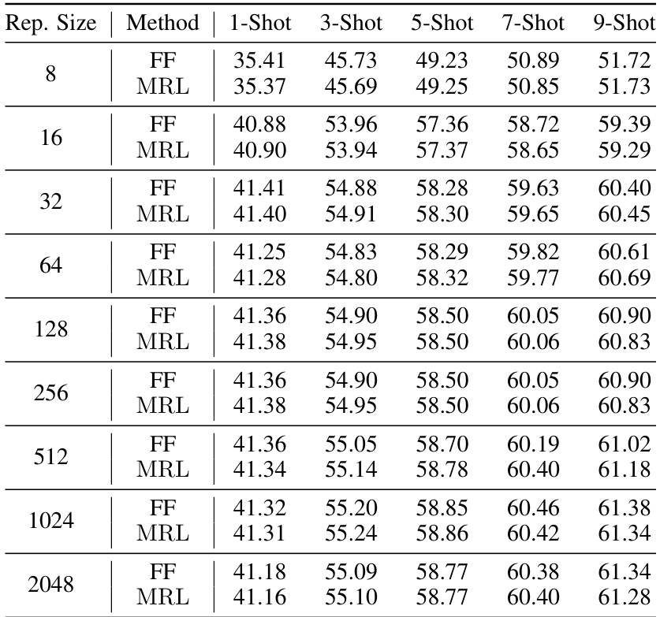

# Matryoshka Representation Learning  

Aditya Kusupati ∗†⋄ , Gantavya Bhatt ∗† , Aniket Rege ∗† , Matthew Wallingford † , Aditya  $\mathbf{Sinh a^{\diamond}}$  , Vivek Ramanujan † , William Howard-Snyder † , Kaifeng Chen ⋄ , Sham Kakade ‡ , Prateek   $\mathbf{Jain}^{\diamond}$  and Ali Farhadi † † University of Washington,  ⋄ Google Research,  ‡ Harvard University {kusupati,ali}@cs.washington.edu ,  prajain@google.com  

# Abstract  

Learned representations are a central component in modern ML systems, serv- ing a multitude of downstream tasks. When training such representations, it is often the case that computational and statistical constraints for each down- stream task are unknown. In this context, rigid fixed-capacity representations can be either over or under-accommodating to the task at hand. This leads us to ask:  can we design a flexible representation that can adapt to multiple down- stream tasks with varying computational resources?  Our main contribution is Matryoshka Representation Learning  ( MRL ) which encodes information at different granularities and allows a single embedding to adapt to the computational constraints of downstream tasks.  MRL  minimally modifies existing representation learning pipelines and imposes no additional cost during inference and deployment. MRL  learns coarse-to-fine representations that are at least as accurate and rich as independently trained low-dimensional representations. The flexibility within the learned  Matryoshka Representations  offer: (a) up to  ${\bf14\times}$   smaller embed size for ImageNet-1K classification at the same level of accuracy; (b) up to  ${\bf14\times}$  × real-world speed-ups for large-scale retrieval on ImageNet-1K and 4K; and (c) up to    $\mathbf{2}\%$   accuracy improvements for long-tail few-shot classification, all while being as robust as the original representations. Finally, we show that  MRL  extends seam- lessly to web-scale datasets (ImageNet, JFT) across various modalities – vision (ViT, ResNet), vision  $^+$   language (ALIGN) and language (BERT).  MRL  code and pretrained models are open-sourced at  https://github.com/RAIVNLab/MRL .  

# 1 Introduction  

Learned representations [ 57 ] are fundamental building blocks of real-world ML systems [ 66 ,  91 ]. Trained once and frozen,  $d$  -dimensional representations encode rich information and can be used to perform multiple downstream tasks [ 4 ]. The deployment of deep representations has two steps: (1) an expensive yet constant-cost forward pass to compute the representation [ 29 ] and (2) utilization of the representation for downstream applications [ 50 ,  89 ]. Compute costs for the latter part of the pipeline scale with the embedding dimensionality as well as the data size   $(N)$   and label space  $(L)$  . At web-scale [ 15 ,  85 ] this utilization cost overshadows the feature computation cost. The rigidity in these representations forces the use of high-dimensional embedding vectors across multiple tasks despite the varying resource and accuracy constraints that require flexibility.  

Human perception of the natural world has a naturally coarse-to-fine granularity [ 28 ,  32 ]. However, perhaps due to the inductive bias of gradient-based training [ 84 ], deep learning models tend to diffuse “information” across the entire representation vector. The desired elasticity is usually enabled in the existing flat and fixed representations either through training multiple low-dimensional models [ 29 ], jointly optimizing sub-networks of varying capacity [ 9 ,  100 ] or post-hoc compression [ 38 ,  60 ]. Each of these techniques struggle to meet the requirements for adaptive large-scale deployment either due to training/maintenance overhead, numerous expensive forward passes through all of the data, storage and memory cost for multiple copies of encoded data, expensive on-the-fly feature selection or a significant drop in accuracy. By encoding coarse-to-fine-grained representations, which are as accurate as the independently trained counterparts, we learn with minimal overhead a representation that can be deployed  adaptively  at no additional cost during inference.  

We introduce Matryoshka Representation Learning  ( MRL ) to induce flexibility in the learned representation.  MRL  learns representations of varying capacities within the same high-dimensional vector through explicit optimization of    $O(\log(d))$   lower-dimensional vectors in a nested fashion, hence the name  Matryoshka .  MRL  can be adapted to any existing representation pipeline and is easily extended to many standard tasks in computer vision and natural language processing. Figure  1  illustrates the core idea of  Matryoshka Representation Learning  ( MRL ) and the adaptive deployment settings of the learned  Matryoshka Representations .  

The first    $m$  -dimensions,    $m\in[d]$  , of the  Matryoshka Representation  is an information-rich low-dimensional vector, at no additional training cost, that is as accurate as an indepen- dently trained    $m$  -dimensional repre- sentation. The information within the  Matryoshka Representation  in- creases with the dimensionality creat- ing a coarse-to-fine grained represen- tation, all without significant training or additional deployment overhead. MRL  equips the representation vector with the desired flexibility and multi- fidelity that can ensure a near-optimal accuracy-vs-compute trade-off. With these advantages,  MRL  enables adap- tive deployment based on accuracy and compute constraints.  

  
Figure 1: Matryoshka Representation Learning is adaptable to any representation learning setup and begets a  Matryoshka Representation    $z$  by optimizing the orig- inal loss  $\mathcal{L}(.)$  at  $O(\log(d))$  chosen representation sizes. Matryoshka Representation  can be utilized effectively for adap- tive deployment across environments and downstream tasks.  

The  Matryoshka Representations  improve efficiency for large-scale classification and retrieval without any significant loss of accuracy. While there are potentially several applications of coarse-to- fine  Matryoshka Representations , in this work we focus on two key building blocks of real-world ML systems: large-scale classification and retrieval. For classification, we use adaptive cascades with the variable-size representations from a model trained with  MRL , significantly reducing the average dimension of embeddings needed to achieve a particular accuracy. For example, on ImageNet-1K, MRL  $^+$  adaptive classification results in up to a  $14\times$   smaller representation size at the same accuracy as baselines (Section  4.2.1 ). Similarly, we use  MRL  in an adaptive retrieval system. Given a query, we shortlist retrieval candidates using the first few dimensions of the query embedding, and then successively use more dimensions to re-rank the retrieved set. A simple implementation of this approach leads to    $128\times$   theoretical (in terms of FLOPS) and    $14\times$   wall-clock time speedups compared to a single-shot retrieval system that uses a standard embedding vector; note that  MRL ’s retrieval accuracy is comparable to that of single-shot retrieval (Section  4.3.1 ). Finally, as  MRL  explicitly learns coarse-to-fine representation vectors, intuitively it should share more semantic information among its various dimensions (Figure  5 ). This is reflected in up to  $2\%$   accuracy gains in long-tail continual learning settings while being as robust as the original embeddings. Furthermore, due to its coarse-to-fine grained nature,  MRL  can also be used as method to analyze hardness of classification among instances and information bottlenecks.  

# We make the following key contributions:  

1.  We introduce Matryoshka Representation Learning  ( MRL ) to obtain flexible representa- tions ( Matryoshka Representations ) for adaptive deployment (Section  3 ).

 2. Up to  $14\times$   faster yet accurate large-scale classification and retrieval using  MRL  (Section  4 ).

 3.  Seamless adaptation of  MRL  across modalities (vision - ResNet & ViT, vision  $+$   language - ALIGN, language - BERT) and to web-scale data (ImageNet-1K/4K, JFT-300M and ALIGN data).

 4. Further analysis of  MRL ’s representations in the context of other downstream tasks (Section  5 ).  

# 2 Related Work  

Representation Learning. Large-scale datasets like ImageNet [ 16 ,  76 ] and JFT [ 85 ] enabled the learning of general purpose representations for computer vision [ 4 ,  98 ]. These representations are typically learned through supervised and un/self-supervised learning paradigms. Supervised pretraining [ 29 ,  51 ,  82 ] casts representation learning as a multi-class/label classification problem, while un/self-supervised learning learns representation via proxy tasks like instance classification [ 97 ] and reconstruction [ 31 ,  63 ]. Recent advances [ 12 ,  30 ] in contrastive learning [ 27 ] enabled learning from web-scale data [ 21 ] that powers large-capacity cross-modal models [ 18 ,  46 ,  71 ,  101 ]. Similarly, natural language applications are built [ 40 ] on large language models [ 8 ] that are pretrained [ 68 ,  75 ] in a un/self-supervised fashion with masked language modelling [ 19 ] or autoregressive training [ 70 ].  

Matryoshka Representation Learning  ( MRL ) is complementary to all these setups and can be adapted with minimal overhead (Section  3 ).  MRL  equips representations with multifidelity at no additional cost which enables adaptive deployment based on the data and task (Section  4 ).  

Efficient Classification and Retrieval. Efficiency in classification and retrieval during inference can be studied with respect to the high yet constant deep featurization costs or the search cost which scales with the size of the label space and data. Efficient neural networks address the first issue through a variety of algorithms [ 25 ,  54 ] and design choices [ 39 ,  53 ,  87 ]. However, with a strong featurizer, most of the issues with scale are due to the linear dependence on number of labels   $(L)$  , size of the data   $(N)$   and representation size   $(d)$  , stressing RAM, disk and processor all at the same time.  

The sub-linear complexity dependence on number of labels has been well studied in context of compute [ 3 ,  43 ,  69 ] and memory [ 20 ] using Approximate Nearest Neighbor Search (ANNS) [ 62 ] or leveraging the underlying hierarchy [ 17 ,  55 ]. In case of the representation size, often dimensionality reduction [ 77 ,  88 ], hashing techniques [ 14 ,  52 ,  78 ] and feature selection [ 64 ] help in alleviating selective aspects of the  $O(\bar{d})$   scaling at a cost of significant drops in accuracy. Lastly, most real-world search systems [ 11 ,  15 ] are often powered by large-scale embedding based retrieval [ 10 ,  66 ] that scales in cost with the ever increasing web-data. While categorization [ 89 ,  99 ] clusters similar things together, it is imperative to be equipped with retrieval capabilities that can bring forward every instance [ 7 ]. Approximate Nearest Neighbor Search (ANNS) [ 42 ] makes it feasible with efficient indexing [ 14 ] and traversal [ 5 ,  6 ] to present the users with the most similar documents/images from the database for a requested query. Widely adopted HNSW [ 62 ]   $(O(d\log(N)))$   is as accurate as exact retrieval   $(O(d N))$   at the cost of a graph-based index overhead for RAM and disk [ 44 ].  

MRL  tackles the linear dependence on embedding size,  $d$  , by learning multifidelity Matryoshka Representations . Lower-dimensional  Matryoshka Representations  are as accu- rate as independently trained counterparts without the multiple expensive forward passes. Matryoshka Representations  provide an  intermediate abstraction  between high-dimensional vec- tors and their efficient ANNS indices through the adaptive embeddings nested within the original representation vector (Section  4 ). All other aforementioned efficiency techniques are complementary and can be readily applied to the learned  Matryoshka Representations  obtained from  MRL .  

Several works in efficient neural network literature [ 9 ,  93 ,  100 ] aim at packing neural networks of varying capacity within the same larger network. However, the weights for each progressively smaller network can be different and often require distinct forward passes to isolate the final representations. This is detrimental for adaptive inference due to the need for re-encoding the entire retrieval database with expensive sub-net forward passes of varying capacities. Several works [ 23 ,  26 ,  65 ,  59 ] investigate the notions of intrinsic dimensionality and redundancy of representations and objective spaces pointing to minimum description length [ 74 ]. Finally, ordered representations proposed by Rippel et al.  [ 73 ] use nested dropout in the context of autoencoders to learn nested representations.  MRL  differentiates itself in formulation by optimizing only for  $O(\log(d))$   nesting dimensions instead of    $O(d)$  . Despite this,  MRL  diffuses information to intermediate dimensions interpolating between the optimized Matryoshka Representation  sizes accurately (Figure  5 ); making web-scale feasible.  

# 3 Matryoshka Representation Learning  

For    $d\in\mathbb{N}$  , consider a set    $\mathcal{M}\,\subset\,[d]$   of representation sizes. For a int    $x$   in the  - main , our goal is to learn a  d -dimensional representation vector  z  $z\,\in\,\mathbb{R}^{d}$  . For every  $m\in\mathcal{M}$  , Matryoshka Representation Learning  ( MRL ) enables each of the first  $m$   dimensions of the em- bedding vector,    $\boldsymbol{z}_{1:m}\in\mathbb{R}^{m}$    to b independentl capable of being a transferable representation of the datapoint  x . e obt  $z$  deep neural network  $F(\,\cdot\,;\bar{\theta}_{F})\colon\bar{\mathcal{X}}\to\mathbb{R}^{d}$   ·  X → parameterized by learnable weights  $\theta_{F}$   , i.e.,  $z:=F(x;\theta_{F})$  . The multi-granularity is captured through the set of the  sen dimensions    $\mathcal{M}$  , that contains less than  $\log(d)$   elements, i.e.,    $|\bar{\mathcal{M}}|\leq\lfloor\log(\bar{d})\rfloor$  . The usual set  M  consists of consistent halving until the representation size hits a low information bottleneck. We discuss the design choices in Section  4  for each of the representation learning settings.  

For the ease of exposition, we present the formulation for fully supervised representation learning via multi-class classification.  Matryoshka Representation Learning  modifies the typical setting to become a multi-scale representation learning problem on the same task. For example, we train ResNet50 [ 29 ] on ImageNet-1K [ 76 ] which embeds a  $224\times224$   pixel image into    $d\,=\,2048$  representation vector and then passed through a linear classifier to make a prediction,  ˆ  among the  $L=1000$   labels. For  MRL , we choose  $\mathcal{M}=\{8,16,.\,.\,,1024,2048\}$   as the nesting dimensions.  

Suppose  iven a labelle ataset    $\mathcal{D}=\{(x_{1},y_{1}),.\,.\,.\,,(x_{N},y_{N})\}$   where  $x_{i}\in\mathcal{X}$   is an input point and  $y_{i}\in[\bar{L}]$   ∈  is the label of  $x_{i}$  l  $i\in[N]$   ∈ .  MRL  optimizes the multi-class classification loss for each of the nested dimension  $m\in\mathcal{M}$  dard empirical risk minimization using a separate linear classifier, paramet  $\mathbf{W}^{(m)}\in\mathbb{R}^{L\times m}$    ∈ . All the losses are aggregated after scaling with their relative importance  $(c_{m}\geq0)_{m\in\mathcal{M}}$   respectively. That is, we solve  

$$
\operatorname*{min}_{\left\{\mathbf{W}^{(m)}\right\}_{m\in\mathcal{M}},\ \theta_{F}}\frac{1}{N}\sum_{i\in[N]}\sum_{m\in\mathcal{M}}c_{m}\cdot\mathcal{L}\left(\mathbf{W}^{(m)}\cdot F(x_{i};\theta_{F})_{1:m}\ ;\ y_{i}\right)\ ,
$$  

where  $\mathcal{L}\colon\mathbb{R}^{L}\times[L]\to\mathbb{R}_{+}$   is the multi-class softmax cross-entropy loss function. This is a standard optimization problem that can be solved using sub-gradient descent methods. We set all the impor- tan  $c_{m}=1$   for all    $m\in\mathcal{M}$  ; see Section  5  for ablations. Lastly, despite only optimizing for  $O(\log(d))$   nested dimensions,  MRL  results in accurate representations, that interpolate, for dimensions that fall between the chosen granularity of the representations (Section  4.2 ).  

We call this formulation as  Matryoshka Representation Learning  ( MRL ). A natural way to make this efficient is through weight-tying across all the linear classifiers, i.e., by defining  $\bar{\mathbf{W}^{(m)}}=\mathbf{W}_{1:m}$  for a set of common weights    $\check{\mathbf{W}}\check{\in}\mathbb{R}^{L\times d}$  . This would reduce the memory cost due to the linear classifiers by almost half, which would be crucial in cases of extremely large output spaces [ 89 ,  99 ]. This variant is called  Efficient  Matryoshka Representation Learning  ( MRL – E ). Refer to   $\mathrm{Avg1}$  and  $\operatorname{Alg}2$   in Appendix  A  for the building blocks of  Matryoshka Representation Learning  ( MRL ).  

Adaptation to Learning Frameworks. MRL  can be adapted seamlessly to most representation learning frameworks at web-scale with minimal modifications (Section  4.1 ). For example,  MRL ’s adaptation to masked language modelling reduces to  MRL – E  due to the weight-tying between the input embedding matrix and the linear classifier. For contrastive learning, both in context of vision & vision  $^+$   language,  MRL  is applied to both the embeddings that are being contrasted with each other. The presence of normalization on the representation needs to be handled independently for each of the nesting dimension for best results (see Appendix  C  for more details).  

# 4 Applications  

In this section, we discuss  Matryoshka Representation Learning  ( MRL ) for a diverse set of ap- plications along with an extensive evaluation of the learned multifidelity representations. Further, we showcase the downstream applications of the learned  Matryoshka Representations  for flexible large-scale deployment through (a) Adaptive Classification (AC) and (b) Adaptive Retrieval (AR).  

# 4.1 Representation Learning  

We adapt  Matryoshka Representation Learning  ( MRL ) to various representation learning setups (a) Supervised learning for vision: ResNet50 [ 29 ] on ImageNet-1K [ 76 ] and ViT-B/16 [ 22 ] on JFT-300M [ 85 ], (b) Contrastive learning for vision  $^+$   language: ALIGN model with ViT-B/16 vision encoder and BERT language encoder on ALIGN data [ 46 ] and (c) Masked language modelling: BERT [ 19 ] on English Wikipedia and BooksCorpus [ 102 ]. Please refer to Appendices  B  and  C  for details regarding the model architectures, datasets and training specifics.  

  
Figure 2: ImageNet-1K linear classification ac- Figure 3: ImageNet-1K 1-NN accuracy of curacy of ResNet50 models.  MRL  is as accurate ResNet50 models measuring the representation as the independently trained FF models for every quality for downstream task.  MRL  outperforms representation size. all the baselines across all representation sizes.  

We do not search for best hyper-parameters for all  MRL  experiments but use the same hyper- parameters as the independently trained baselines. ResNet50 outputs a  2048 -dimensional repre- sentation while ViT-B/16 and BERT-Base output  768 -dimensional embeddings for each data point. We use  $\mathcal{M}=\{8,16,32,64,128,256,512,10\bar{2}4,2048\}$   and    $\mathcal{M}=\{12,24,48,96,192,384,768\}$   as the explicitly optimized nested dimensions respectively. Lastly, we extensively compare the  MRL and  MRL – E  models to independently trained low-dimensional (fixed feature) representations (FF), dimensionality reduction (SVD), sub-net method (slimmable networks [ 100 ]) and randomly selected features of the highest capacity FF model.  

In section  4.2 , we evaluate the quality and capacity of the learned representations through linear classification/probe (LP) and 1-nearest neighbour (1-NN) accuracy. Experiments show that  MRL models remove the dependence on    $|\mathcal{M}|$   resource-intensive independently trained models for the coarse-to-fine representations while being as accurate. Lastly, we show that despite optimizing only or    $|\mathcal{M}|$   dimensions,  MRL  models diffuse the information, in an interpolative fashion, across all the  $d$   dimensions providing the finest granularity required for adaptive deployment.  

# 4.2 Classification  

Figure  2  compares the linear classification accuracy of ResNet50 models trained and evaluated on ImageNet-1K. ResNet50– MRL  model is at least as accurate as each FF model at every rep- resentation size in    $\mathcal{M}$   while  MRL – E  is within    $1\%$   starting from  16 -dim. Similarly, Figure  3 showcases the comparison of learned representation quality through 1-NN accuracy on ImageNet-1K (trainset with   $1.3\mathbf{M}$   samples as the database and validation set with 50K samples as the queries). Matryoshka Representations  are up to  $2\%$   more accurate than their fixed-feature counterparts for the lower-dimensions while being as accurate elsewhere. 1-NN accuracy is an excellent proxy, at no additional training cost, to gauge the utility of learned representations in the downstream tasks.  

We also evaluate the quality of the representations from training ViT-B/16 on JFT-300M alongside the ViT-B/16 vision encoder of the ALIGN model – two web-scale setups. Due to the expensive nature of these experiments, we only train the highest capacity fixed feature model and choose random features for evaluation in lower-dimensions. Web-scale is a compelling setting for  MRL  due to its relatively inexpensive training overhead while providing multifidelity representations for downstream tasks. Figure  4 , evaluated with 1-NN on ImageNet-1K, shows that all the  MRL  models for JFT and ALIGN are highly accurate while providing an excellent cost-vs-accuracy trade-off at lower-dimensions. These experiments show that  MRL  seamlessly scales to large-scale models and web-scale datasets while providing the otherwise prohibitively expensive multi-granularity in the process. We also have similar observations when pretraining BERT; please see Appendix  D.2  for more details. Our experiments also show that post-hoc compression (SVD), linear probe on random features, and sub-net style slimmable networks drastically lose accuracy compared to  MRL  as the representation size decreases. Finally, Figure  5  shows that, while  MRL  explicitly optimizes    $O(\log(d))$   nested representations – removing the    $O(d)$   dependence [ 73 ] –, the coarse-to-fine grained information is interpolated across all    $d$   dimensions providing highest flexibility for adaptive deployment.  

  
Figure 4: ImageNet-1K 1-NN accuracy for ViT-B/16 models trained on JFT-300M & as part of ALIGN.  MRL  scales seamlessly to web-scale with minimal training overhead.  

  
Figure 5: Despite optimizing  MRL  only for  $O(\log(d))$   dimensions for ResNet50 and ViT- B/16 models; the accuracy in the intermediate dimensions shows interpolating behaviour.  

# 4.2.1 Adaptive Classification  

The flexibility and coarse-to-fine granularity within  Matryoshka Representations  allows model cascades [ 90 ] for Adaptive Classification (AC) [ 28 ]. Unlike standard model cascades [ 95 ],  MRL  does not require multiple expensive neural network forward passes. To perform AC with an  MRL  trained model, we learn thresholds on the maximum softmax probability [ 33 ] for each nested classifier on a holdout validation set. We then use these thresholds to decide when to transition to the higher dimensional representation (  $({\mathrm{e.g~8}}\to16\to32)$  ) of the  MRL  model. Appendix  D.1  discusses the implementation and learning of thresholds for cascades used for adaptive classification in detail.  

Figure  6  shows the comparison between cascaded  MRL  representations ( MRL –AC) and indepen- dently trained fixed feature (FF) models on ImageNet-1K with ResNet50. We computed the expected representation size for  MRL –AC based on the final dimensionality used in the cascade. We observed that  MRL –AC was as accurate,  $76.30\%$  , as a 512-dimensional FF model but required an expected dimensionality of    $\sim37$   while being only    $0.8\%$   lower than the 2048-dimensional FF baseline. Note that all  MRL –AC models are significantly more accurate than the FF baselines at comparable repre- sentation sizes.  MRL –AC uses up to  $\sim14\times$   smaller representation size for the same accuracy which affords computational efficiency as the label space grows [ 89 ]. Lastly, our results with  MRL –AC indicate that instances and classes vary in difficulty which we analyze in Section  5  and Appendix  J .  

# 4.3 Retrieval  

Nearest neighbour search with learned representations powers a plethora of retrieval and search appli- cations [ 15 ,  91 ,  11 ,  66 ]. In this section, we discuss the image retrieval performance of the pretrained ResNet50 models (Section  4.1 ) on two large-scale datasets ImageNet-1K [ 76 ] and ImageNet-4K. ImageNet-1K has a database size of  ${\sim}1.3\mathbf{M}$   and a query set of 50K samp formly spanning asses. We also introduce ImageNet-4K which has a database size of  ∼ 4.2M and query set of ∼ 200K samples uniformly spanning 4202 classes (see Appendix  B  for details). A single forward pass on ResNet50 costs 4 GFLOPs while exact retrieval costs 2.6 GFLOPs per query for ImageNet-1K. Although retrieval overhead is    $40\%$   of the total cost, retrieval cost grows linearly with the size of the database. ImageNet-4K presents a retrieval benchmark where the exact search cost becomes the computational bottleneck ( 8 . 6  GFLOPs per query). In both these settings, the memory and disk usage are also often bottlenecked by the large databases. However, in most real-world applications exact search,  $O(d N)$  , is replaced with an approximate nearest neighbor search (ANNS) method like HNSW [ 62 ],  $O(d\log(N))$  , with minimal accuracy drop at the cost of additional memory overhead.  

The goal of image retrieval is to find images that belong to the same class as the query using representations obtained from a pretrained model. In this section, we compare retrieval performance using mean Average Precision   $\mathrm{\textregistered}~10~(\mathrm{mAP@10})$   which comprehensively captures the setup of relevant image retrieval at scale. We measure the cost per query using exact search in MFLOPs. All embeddings are unit normalized and retrieved using the L2 distance metric. Lastly, we report  

  
Figure 6: Adaptive classification on  MRL Figure 7:   $\mathrm{mAP@10}$   for Image Retrieval on ResNet50 using cascades results in    $14\times$   smaller ImageNet-1K with ResNet50.  MRL  consistently representation size for the same level of accuracy produces better retrieval performance over the on ImageNet-1K   $\sim37$   vs  512  dims for  $76.3\%$  ). baselines across all the representation sizes.  

an extensive set of metrics spanning   $\operatorname{mAP@}k$   and  $\operatorname{P@}k$   for    $k=\{10,25,50,100\}$   and real-world wall-clock times for exact search and HNSW. See Appendices  E  and  F  for more details.  

Figure  7  compares the   $\mathrm{mAP@10}$   performance of ResNet50 representations on ImageNet-1K across dimensional i ties for  MRL ,  MRL – E , FF, slimmable networks along with post-hoc compression of vectors using SVD and random feature selection.  Matryoshka Representations  are often the most accurate while being up to    $3\%$   better than the FF baselines. Similar to classification, post-hoc compression and slimmable network baselines suffer from significant drop-off in retrieval mAP  $@10$  with  $\leq256$   dimensions. Appendix  $\mathrm{E}$   discusses the  $\mathrm{mAP@10}$   of the same models on ImageNet-4K.  

MRL  models are capable of performing accurate retrieval at various granularities without the additional expense of multiple model forward passes for the web-scale databases. FF models also generate independent databases which become prohibitively expense to store and switch in between.  Matryoshka Representations  enable adaptive retrieval (AR) which alleviates the need to use full-capacity representations,  $d=2048$  , for all data and downstream tasks. Lastly, all the vector compression techniques [ 60 ,  45 ] used as part of the ANNS pipelines are complimentary to Matryoshka Representations  and can further improve the efficiency-vs-accuracy trade-off.  

# 4.3.1 Adaptive Retrieval  

We benchmark  MRL  in the adaptive retrieval setting (AR) [ 50 ]. For a given query image, we obtained a shortlist,    $K=200$  , of images from the database using a lower-dimensional representation, e.g.  $D_{s}=16$   followed by reranking with a higher capacity representation, e.g.    $D_{r}=2048$  . In real-world scenarios where top ranking performance is the key objective, measured with  $\operatorname{mAP@}k$   where  $\mathbf{k}$  covers a limited yet crucial real-estate, AR provides significant compute and memory gains over single-shot retrieval with representations of fixed dimensionality. Finally, the most expensive part of AR, as with any retrieval pipeline, is the nearest neighbour search for shortlisting. For example, even naive re-ranking of 200 images with 2048 dimensions only costs 400 KFLOPs. While we report exact search cost per query for all AR experiments, the shortlisting component of the pipeline can be sped-up using ANNS (HNSW). Appendix  I  has a detailed discussion on compute cost for exact search, memory overhead of HNSW indices and wall-clock times for both implementations. We note that using HNSW with 32 neighbours for shortlisting does not decrease accuracy during retrieval.  

Figure 8 showcases the compute-vs-accuracy trade-off for adaptive retrieval using Matryoshka Representations  compared to single-shot using fixed features with ResNet50 on ImageNet-1K. We observed that all AR settings lied above the Pareto frontier of single-shot retrieval with varying representation sizes. In particular for ImageNet-1K, we show that the AR model with    $D_{s}=16$   &    $D_{r}=2048$   is as accurate as single-shot retrieval with    $d=2048$   while being  $\sim\mathbf{128}\times$   more efficient in theory and  $\sim\mathbf{1}4\times$   faster in practice (compared using HN e same hardware). We show similar trends with ImageNet-4K, but note that we require  $D_{s}\,=\,64$   given the increased difficulty of the datas sults in  $\sim32\times$   and  $\sim6\times$   theoretical and in-practice speedups respectively. Lastly, while  $K=200$   works well for our adaptive retrieval experiments, we ablated over the shortlist size    $k$   in Appendix  K.2  and found that the accuracy gains stopped after a  

  
Figure 8: The trade-off between mAP  $@10$   vs MFLOPs/Query for Adaptive Retrieval (AR) on ImageNet-1K (left) and ImageNet-4K (right). Every combination of    $D_{s}$   &    $D_{r}$   falls above the Pareto line (orange dots) of single-shot retrieval with a fixed representation size while having configurations that are as accurate while being up to  $14\times$   faster in real-world deployment. Funnel retrieval is almost as accurate as the baseline while alleviating some of the parameter choices of Adaptive Retrieval.  

point, further strengthening the use-case for  Matryoshka Representation Learning  and adaptive retrieval.  

Even with adaptive retrieval, it is hard to determine the choice of  $D_{s}$   &  $D_{r}$  . In order to alleviate this issue to an extent, we propose  Funnel Retrieval , a consistent cascade for adaptive retrieval. Funnel thins out the initial shortlist by a repeated re-ranking and shortlisting with a series of increasing capacity representations. Funnel halves the shortlist size and doubles the representation size at every step of re-ranking. For example on ImageNet-1K, a funnel with the shortlist progression of  $200\,\rightarrow\,100\,\rightarrow\,50\,\rightarrow\,25\,\rightarrow\,10$   with the cascade of    $16\,\rightarrow\,32\,\rightarrow\,64\,\rightarrow\,128\,\rightarrow\,256\,\rightarrow\,2048$  representation sizes within  Matryoshka Representation  is as accurate as the single-shot 2048-dim retrieval while being    $\sim128\times$   more efficient theoretically (see Appendix  F  for more results). All these results showcase the potential of  MRL  and AR for large-scale multi-stage search systems [ 15 ].  

# 5 Further Analysis and Ablations  

Robustness. We evaluate the robustness of the  MRL  models trained on ImageNet-1K on out-of- domain datasets, ImageNetV2/R/A/Sketch [ 72 ,  34 ,  35 ,  94 ], and compare them to the FF baselines. Table  17  in Appendix  H  demonstrates that  Matryoshka Representations  for classification are at least as robust as the original representation while improving the performance on ImageNet-A by  $0.6\%-\mathrm{a}\;20\%$  ImageNetV2 as the query set for ImageNet-1K database. Table  9  in Appendix  E  shows that  MRL models have more robust retrieval compared to the FF baselines by having up to    $3\%$   higher  $\mathrm{mAP@10}$  performance. This observation also suggests the need for further investigation into robustness using nearest neighbour based classification and retrieval instead of the standard linear probing setup. We also find that the zero-shot robustness of ALIGN- MRL  (Table  18  in Appendix  H ) agrees with the observations made by Wortsman et al.  [ 96 ] . Lastly, Table  6  in Appendix  D.2  shows that  MRL  also improves the cosine similarity span between positive and random image-text pairs.  

Few-shot and Long-tail Learning. We exhaustively evaluated few-shot learning on  MRL  models using nearest class mean [ 79 ]. Table  15  in Appendix  G  shows that that representations learned through  MRL  perform comparably to FF representations across varying shots and number of classes.  

Matryoshka Representations  realize a unique pattern while evaluating on FLUID [ 92 ], a long-tail sequential learning framework. We observed that  MRL  provides up to    $2\%$   accuracy higher on novel classes in the tail of the distribution, without sacrificing accuracy on other classes (Table  16  in Appendix  G ). Additionally we find the accuracy between low-dimensional and high-dimensional representations is marginal for pretrain classes. We hypothesize that the higher-dimensional represen- tations are required to differentiate the classes when few training examples of each are known. This results provides further evidence that different tasks require varying capacity based on their difficulty.  

Disagreement across Dimensions. The information packing in  Matryoshka Representations often results in gradual increase of accuracy with increase in capacity. However, we observed that  

  
Figure 9: Grad-CAM [ 80 ] progression of predictions in  MRL  model across  8 ,  16 ,  32  and  2048 dimensions. (a)  8 -dimensional representation confuses due to presence of other relevant objects (with a larger field of view) in the scene and predicts “shower cap” ; (b)  8 -dim model confuses within the same super-class of “boa” ; (c)  8  and  16 -dim models incorrectly focus on the eyes of the doll ("sunglasses") and not the "sweatshirt" which is correctly in focus at higher dimensions;  MRL  fails gracefully in these scenarios and shows potential use cases of disagreement across dimensions.  

this trend was not ubiquitous and certain instances and classes were more accurate when evaluated with lower-dimensions (Figure  12  in Appendix  J ). With perfect routing of instances to appropriate dimension,  MRL  can gain up to  $4.6\%$   classification accuracy. At the same time, the low-dimensional models are less accurate either due to confusion within the same superclass [ 24 ] of the ImageNet hierarchy or presence of multiple objects of interest. Figure  9  showcases 2 such examples for  8 - dimensional representation. These results along with Appendix  J  put forward the potential for  MRL to be a systematic framework for analyzing the utility and efficiency of information bottlenecks.  

Superclass Accuracy. As the information bottleneck becomes smaller, the overall accuracy on fine-grained classes decreases rapidly (Figure  3 ). However, the drop-off is not as significant when evaluated at a superclass level (Table  24  in Appendix  J ). Figure  10  presents that this phenomenon  

  
sification across representation size for  MRL  & FF models showing the capture of underlying hierarchy through tight information bottlenecks.  

occurs with both  MRL  and FF models;  MRL  is more accurate across dimensions. This shows that tight information bottlenecks while not highly accurate for fine-grained classification, do capture required semantic information for coarser classification that could be leveraged for adaptive routing for retrieval and classification. Mutifidelity of  Matryoshka Representation  naturally captures the underlying hierarchy of the class labels with one single model. Lastly, Figure  11  showcases the accuracy trends per superclass with  MRL . The utility of additional dimensions in distinguishing a class from others within the same superclass is evident for “garment” which has up to   $11\%$  improvement for   $8\to16$   dimensional representation transition. We also observed that superclasses such as “oscine (songbird)” had a clear visual distinction between the object and background and thus predictions using 8 dimensions also led to a good inter-class separability within the superclass.  

# 5.1 Ablations  

Table  26  in Appendix  K  presents that  Matryoshka Representations  can be enabled within off-the- shelf pretrained models with inexpensive partial finetuning thus paving a way for ubiquitous adoption of  MRL . At the same time, Table  27  in Appendix  C  indicates that with optimal weighting of the nested losses we could improve accuracy of lower-dimensions representations without accuracy loss. Tables  28  and  29  in Appendix  C  ablate over the choice of initial granularity and spacing of the granularites. Table  28  reaffirms the design choice to shun extremely low dimensions that have poor classification accuracy as initial granularity for  MRL  while Table  29  confirms the effectiveness of logarthmic granularity spacing inspired from the behaviour of accuracy saturation across dimensions over uniform. Lastly, Tables  30  and  31  in Appendix  K.2  show that the retrieval performance saturates after a certain shortlist dimension and length depending on the complexity of the dataset.  

# 6 Discussion and Conclusions  

The results in Section  5.1  reveal interesting weaknesses of  MRL  that would be logical directions for future work. (1) Optimizing the weightings of the nested losses to obtain a Pareto optimal accuracy-vs-efficiency trade-off – a potential solution could emerge from adaptive loss balancing aspects of anytime neural networks [ 41 ]. (2) Using different losses at various fidelities aimed at solving a specific aspect of adaptive deployment – e.g. high recall for  8 -dimension and robustness for  2048 -dimension. (3) Learning a search data-structure, like differentiable k-d tree, on top of Matryoshka Representation  to enable dataset and representation aware retrieval. (4) Finally, the joint optimization of multi-objective  MRL  combined with end-to-end learnable search data-structure to have data-driven adaptive large-scale retrieval for web-scale search applications.  

In conclusion, we presented Matryoshka Representation Learning  ( MRL ), a flexible represen- tation learning approach that encodes information at multiple granularities in a single embedding vector. This enables the  MRL  to adapt to a downstream task’s statistical complexity as well as the available compute resources. We demonstrate that  MRL  can be used for large-scale adaptive classification as well as adaptive retrieval. On standard benchmarks,  MRL  matches the accuracy of the fixed-feature baseline despite using    $14\times$   smaller representation size on average. Furthermore, the Matryoshka Representation  based adaptive shortlisting and re-ranking system ensures comparable  $\mathrm{mAP@10}$   to the baseline while being    $128\times$   cheaper in FLOPs and    $14\times$   faster in wall-clock time. Finally, most of the efficiency techniques for model inference and vector search are complementary to  MRL further assisting in deployment at the compute-extreme environments.  

# Acknowledgments  

We are grateful to Srinadh Bhojanapalli, Lovish Madaan, Raghav Somani, Ludwig Schmidt, and Venkata Sailesh Sanampudi for helpful discussions and feedback. Aditya Kusupati also thanks Tom Duerig and Rahul Sukthankar for their support. Part of the paper’s large-scale experimentation is supported through a research GCP credit award from Google Cloud and Google Research. Gantavya Bhatt is supported in part by the CONIX Research Center, one of six centers in JUMP, a Semicon- ductor Research Corporation (SRC) program sponsored by DARPA. Sham Kakade acknowledges funding from the NSF award CCF-1703574 and ONR N00014-22-1-2377. Ali Farhadi acknowledges funding from the NSF awards IIS 1652052, IIS 17303166, DARPA N66001-19-2-4031, DARPA W911NF-15-1-0543 and gifts from Allen Institute for Artificial Intelligence.  

# References  

[1]  M. Abadi, A. Agarwal, P. Barham, E. Brevdo, Z. Chen, C. Citro, G. S. Corrado, A. Davis, J. Dean, M. Devin, S. Ghemawat, I. Goodfellow, A. Harp, G. Irving, M. Isard, Y. Jia, R. Joze- fowicz, L. Kaiser, M. Kudlur, J. Levenberg, D. Mané, R. Monga, S. Moore, D. Murray, C. Olah, M. Schuster, J. Shlens, B. Steiner, I. Sutskever, K. Talwar, P. Tucker, V. Vanhoucke, V. Vasudevan, F. Viégas, O. Vinyals, P. Warden, M. Wattenberg, M. Wicke, Y. Yu, and X. Zheng. TensorFlow: Large-scale machine learning on heterogeneous systems, 2015. URL https://www.tensorflow.org/ . Software available from tensorflow.org.

 [2]  A. Barbu, D. Mayo, J. Alverio, W. Luo, C. Wang, D. Gutfreund, J. Tenenbaum, and B. Katz. Objectnet: A large-scale bias-controlled dataset for pushing the limits of object recognition models.  Advances in neural information processing systems , 32, 2019.

 [3]  S. Bengio, J. Weston, and D. Grangier. Label embedding trees for large multi-class tasks. Advances in Neural Information Processing Systems , 23, 2010.

 [4]  Y. Bengio. Deep learning of representations for unsupervised and transfer learning. In Proceedings of ICML workshop on unsupervised and transfer learning , pages 17–36. JMLR Workshop and Conference Proceedings, 2012.

 [5]  J. L. Bentley. K-d trees for semidynamic point sets. In  Proceedings of the sixth annual symposium on Computational geometry , pages 187–197, 1990.

 [6]  A. Beygelzimer, S. Kakade, and J. Langford. Cover trees for nearest neighbor. In  Proceedings of the 23rd international conference on Machine learning , pages 97–104, 2006.

 [7]  S. Brin and L. Page. The anatomy of a large-scale hypertextual web search engine.  Computer networks and ISDN systems , 30(1-7):107–117, 1998.

 [8]  T. Brown, B. Mann, N. Ryder, M. Subbiah, J. D. Kaplan, P. Dhariwal, A. Neelakantan, P. Shyam, G. Sastry, A. Askell, et al. Language models are few-shot learners.  Advances in neural information processing systems , 33:1877–1901, 2020.

 [9]  H. Cai, C. Gan, T. Wang, Z. Zhang, and S. Han. Once-for-all: Train one network and specialize it for efficient deployment.  arXiv preprint arXiv:1908.09791 , 2019.

 [10]  W.-C. Chang, F. X. Yu, Y.-W. Chang, Y. Yang, and S. Kumar. Pre-training tasks for embedding- based large-scale retrieval.  arXiv preprint arXiv:2002.03932 , 2020.

 [11]  W.-C. Chang, D. Jiang, H.-F. Yu, C. H. Teo, J. Zhang, K. Zhong, K. Kolluri, Q. Hu, N. Shandilya, V. Ievgrafov, et al. Extreme multi-label learning for semantic matching in product search. In  Proceedings of the 27th ACM SIGKDD Conference on Knowledge Discov- ery & Data Mining , pages 2643–2651, 2021.

 [12]  T. Chen, S. Kornblith, M. Norouzi, and G. Hinton. A simple framework for contrastive learning of visual representations. In  International conference on machine learning , pages 1597–1607. PMLR, 2020.

 [13]  Y. Chen, Z. Liu, H. Xu, T. Darrell, and X. Wang. Meta-baseline: exploring simple meta- learning for few-shot learning. In  Proceedings of the IEEE/CVF International Conference on Computer Vision , pages 9062–9071, 2021.

 [14]  M. Datar, N. Immorlica, P. Indyk, and V. S. Mirrokni. Locality-sensitive hashing scheme based on p-stable distributions. In  Proceedings of the twentieth annual symposium on Computational geometry , pages 253–262, 2004.

 [15]  J. Dean. Challenges in building large-scale information retrieval systems. In  Keynote of the 2nd ACM International Conference on Web Search and Data Mining (WSDM) , volume 10, 2009.

 [16]  J. Deng, W. Dong, R. Socher, L.-J. Li, K. Li, and L. Fei-Fei. Imagenet: A large-scale hierarchical image database. In  2009 IEEE conference on computer vision and pattern recognition , pages 248–255. Ieee, 2009.  

[17]  J. Deng, A. C. Berg, and L. Fei-Fei. Hierarchical semantic indexing for large scale image retrieval. In  CVPR 2011 , pages 785–792. IEEE, 2011.

 [18]  K. Desai and J. Johnson. Virtex: Learning visual representations from textual annotations. In Proceedings of the IEEE/CVF Conference on Computer Vision and Pattern Recognition , pages 11162–11173, 2021.

 [19]  J. Devlin, M.-W. Chang, K. Lee, and K. Toutanova. Bert: Pre-training of deep bidirectional transformers for language understanding.  arXiv preprint arXiv:1810.04805 , 2018.

 [20]  T. G. Dietterich and G. Bakiri. Solving multiclass learning problems via error-correcting output codes.  Journal of artificial intelligence research , 2:263–286, 1994.

 [21]  S. K. Divvala, A. Farhadi, and C. Guestrin. Learning everything about anything: Webly- supervised visual concept learning. In  Proceedings of the IEEE Conference on Computer Vision and Pattern Recognition , pages 3270–3277, 2014.

 [22]  A. Dosovitskiy, L. Beyer, A. Kolesnikov, D. Weissenborn, X. Zhai, T. Unterthiner, M. De- hghani, M. Minderer, G. Heigold, S. Gelly, et al. An image is worth 16x16 words: Transformers for image recognition at scale.  arXiv preprint arXiv:2010.11929 , 2020.

 [23]  J. J. Engelsma, A. K. Jain, and V. N. Boddeti. Hers: Homomorphically encrypted representation search.  IEEE Transactions on Biometrics, Behavior, and Identity Science , 4(3):349–360, 2022.

 [24]  L. Engstrom, A. Ilyas, H. Salman, S. Santurkar, and D. Tsipras. Robustness (python library), 2019. URL  https://github.com/MadryLab/robustness .

 [25]  A. Gholami, S. Kim, Z. Dong, Z. Yao, M. W. Mahoney, and K. Keutzer. A survey of quantization methods for efficient neural network inference.  arXiv preprint arXiv:2103.13630 , 2021.

 [26]  S. Gong, V. N. Boddeti, and A. K. Jain. On the intrinsic dimensionality of image representations. In  Proceedings of the IEEE/CVF Conference on Computer Vision and Pattern Recognition , pages 3987–3996, 2019.

 [27]  M. Gutmann and A. Hyvärinen. Noise-contrastive estimation: A new estimation principle for unnormalized statistical models. In  Proceedings of the thirteenth international conference on artificial intelligence and statistics , pages 297–304. JMLR Workshop and Conference Proceedings, 2010.

 [28]  M. G. Harris and C. D. Giachritsis. Coarse-grained information dominates fine-grained information in judgments of time-to-contact from retinal flow.  Vision research , 40(6):601–611, 2000.

 [29]  K. He, X. Zhang, S. Ren, and J. Sun. Deep residual learning for image recognition. In Proceedings of the IEEE conference on computer vision and pattern recognition , pages 770– 778, 2016.

 [30]  K. He, H. Fan, Y. Wu, S. Xie, and R. Girshick. Momentum contrast for unsupervised visual representation learning. In  Proceedings of the IEEE/CVF conference on computer vision and pattern recognition , pages 9729–9738, 2020.

 [31]  K. He, X. Chen, S. Xie, Y. Li, P. Dollár, and R. Girshick. Masked autoencoders are scalable vision learners.  arXiv preprint arXiv:2111.06377 , 2021.

 [32]  J. Hegdé. Time course of visual perception: coarse-to-fine processing and beyond.  Progress in neurobiology , 84(4):405–439, 2008.

 [33]  D. Hendrycks and K. Gimpel. A baseline for detecting misclassified and out-of-distribution examples in neural networks.  arXiv preprint arXiv:1610.02136 , 2016.

 [34]  D. Hendrycks, S. Basart, N. Mu, S. Kadavath, F. Wang, E. Dorundo, R. Desai, T. Zhu, S. Parajuli, M. Guo, et al. The many faces of robustness: A critical analysis of out-of- distribution generalization. In  Proceedings of the IEEE/CVF International Conference on Computer Vision , pages 8340–8349, 2021.  

[35]  D. Hendrycks, K. Zhao, S. Basart, J. Steinhardt, and D. Song. Natural adversarial examples. In  Proceedings of the IEEE/CVF Conference on Computer Vision and Pattern Recognition , pages 15262–15271, 2021.

 [36]  S. Hooker, A. Courville, G. Clark, Y. Dauphin, and A. Frome. What do compressed deep neural networks forget?  arXiv preprint arXiv:1911.05248 , 2019.

 [37]  S. Hooker, N. Moorosi, G. Clark, S. Bengio, and E. Denton. Characterising bias in compressed models.  arXiv preprint arXiv:2010.03058 , 2020.

 [38]  H. Hotelling. Analysis of a complex of statistical variables into principal components.  Journal of educational psychology , 24(6):417, 1933.

 [39]  A. G. Howard, M. Zhu, B. Chen, D. Kalenichenko, W. Wang, T. Weyand, M. Andreetto, and H. Adam. Mobilenets: Efficient convolutional neural networks for mobile vision applications. arXiv preprint arXiv:1704.04861 , 2017.

 [40]  J. Howard and S. Ruder. Universal language model fine-tuning for text classification.  arXiv preprint arXiv:1801.06146 , 2018.

 [41]  H. Hu, D. Dey, M. Hebert, and J. A. Bagnell. Learning anytime predictions in neural networks via adaptive loss balancing. In  Proceedings of the AAAI Conference on Artificial Intelligence , volume 33, pages 3812–3821, 2019.

 [42]  P. Indyk and R. Motwani. Approximate nearest neighbors: towards removing the curse of dimensionality. In  Proceedings of the thirtieth annual ACM symposium on Theory of computing , pages 604–613, 1998.

 [43]  H. Jain, V. Balasubramanian, B. Chunduri, and M. Varma. Slice: Scalable linear extreme classifiers trained on 100 million labels for related searches. In  Proceedings of the Twelfth ACM International Conference on Web Search and Data Mining , pages 528–536, 2019.

 [44]  S. Jayaram Subramanya, F. Devvrit, H. V. Simhadri, R. Krishnawamy, and R. Kadekodi. Diskann: Fast accurate billion-point nearest neighbor search on a single node.  Advances in Neural Information Processing Systems , 32, 2019.

 [45]  H. Jegou, M. Douze, and C. Schmid. Product quantization for nearest neighbor search.  IEEE transactions on pattern analysis and machine intelligence , 33(1):117–128, 2010.

 [46]  C. Jia, Y. Yang, Y. Xia, Y.-T. Chen, Z. Parekh, H. Pham, Q. Le, Y.-H. Sung, Z. Li, and T. Duerig. Scaling up visual and vision-language representation learning with noisy text supervision. In International Conference on Machine Learning , pages 4904–4916. PMLR, 2021.

 [47]  J. Johnson, M. Douze, and H. Jégou. Billion-scale similarity search with GPUs.  IEEE Transactions on Big Data , 7(3):535–547, 2019.

 [48]  W. B. Johnson. Extensions of lipschitz mappings into a hilbert space.  Contemp. Math. , 26: 189–206, 1984.

 [49]  N. P. Jouppi, C. Young, N. Patil, D. Patterson, G. Agrawal, R. Bajwa, S. Bates, S. Bhatia, N. Boden, A. Borchers, et al. In-datacenter performance analysis of a tensor processing unit. In  Proceedings of the 44th annual international symposium on computer architecture , pages 1–12, 2017.

 [50]  T. C. Kaz Sato. Vertex ai matching engine. Microsoft AI Blog , 2021. URL https://cloud.google.com/blog/topics/developers-practitioners/ find-anything-blazingly-fast-googles-vector-search-technology .

 [51]  A. Krizhevsky, I. Sutskever, and G. E. Hinton. Imagenet classification with deep convolutional neural networks.  Advances in neural information processing systems , 25, 2012.

 [52]  B. Kulis, P. Jain, and K. Grauman. Fast similarity search for learned metrics.  IEEE Transactions on Pattern Analysis and Machine Intelligence , 31(12):2143–2157, 2009.  

[53]  A. Kusupati, M. Singh, K. Bhatia, A. Kumar, P. Jain, and M. Varma. Fastgrnn: A fast, accurate, stable and tiny kilobyte sized gated recurrent neural network.  Advances in Neural Information Processing Systems , 31, 2018.

 [54]  A. Kusupati, V. Ramanujan, R. Somani, M. Wortsman, P. Jain, S. Kakade, and A. Farhadi. Soft threshold weight re parameter iz ation for learnable sparsity. In  International Conference on Machine Learning , pages 5544–5555. PMLR, 2020.

 [55]  A. Kusupati, M. Wallingford, V. Ramanujan, R. Somani, J. S. Park, K. Pillutla, P. Jain, S. Kakade, and A. Farhadi. Llc: Accurate, multi-purpose learnt low-dimensional binary codes. Advances in Neural Information Processing Systems , 34, 2021.

 [56]  G. Leclerc, A. Ilyas, L. Engstrom, S. M. Park, H. Salman, and A. Madry. ffcv.  https: //github.com/libffcv/ffcv/ , 2022. commit 607d117.

 [57] Y. LeCun, Y. Bengio, and G. Hinton. Deep learning.  nature , 521(7553):436–444, 2015.

 [58]  S. Lee, S. Purushwalkam Shiva Prakash, M. Cogswell, V. Ranjan, D. Crandall, and D. Batra. Stochastic multiple choice learning for training diverse deep ensembles.  Advances in Neural Information Processing Systems , 29, 2016.

 [59]  C. Li, H. Farkhoor, R. Liu, and J. Yosinski. Measuring the intrinsic dimension of objective landscapes.  arXiv preprint arXiv:1804.08838 , 2018.

 [60]  Y. Linde, A. Buzo, and R. Gray. An algorithm for vector quantizer design.  IEEE Transactions on communications , 28(1):84–95, 1980.

 [61]  I. Loshchilov and F. Hutter. Decoupled weight decay regularization. arXiv preprint arXiv:1711.05101 , 2017.

 [62]  Y. A. Malkov and D. A. Yashunin. Efficient and robust approximate nearest neighbor search using hierarchical navigable small world graphs.  IEEE transactions on pattern analysis and machine intelligence , 42(4):824–836, 2018.

 [63]  J. Masci, U. Meier, D. Cire¸ san, and J. Schmidhuber. Stacked convolutional auto-encoders for hierarchical feature extraction. In  International conference on artificial neural networks , pages 52–59. Springer, 2011.

 [64]  P. Mitra, C. Murthy, and S. K. Pal. Unsupervised feature selection using feature similarity. IEEE transactions on pattern analysis and machine intelligence , 24(3):301–312, 2002.

 [65]  V. Nanda, T. Speicher, J. P. Dickerson, S. Feizi, K. P. Gummadi, and A. Weller. Diffused redundancy in pre-trained representations.  arXiv preprint arXiv:2306.00183 , 2023.

 [66]  P. Nayak. Understanding searches better than ever before.  Google AI Blog , 2019. URL  https: //blog.google/products/search/search-language-understanding-bert/ .

 [67]  A. Paszke, S. Gross, F. Massa, A. Lerer, J. Bradbury, G. Chanan, T. Killeen, Z. Lin, N. Gimelshein, L. Antiga, et al. Pytorch: An imperative style, high-performance deep learning library.  Advances in neural information processing systems , 32, 2019.

 [68]  M. E. Peters, M. Neumann, M. Iyyer, M. Gardner, C. Clark, K. Lee, and L. Zettlemoyer. Deep contextualized word representations. In  Proceedings of the 2018 Conference of the North American Chapter of the Association for Computational Linguistics: Human Language Technologies, Volume 1 (Long Papers) , pages 2227–2237, New Orleans, Louisiana, June 2018. Association for Computational Linguistics. doi: 10.18653/v1/N18-1202. URL  https: //aclanthology.org/N18-1202 .

 [69]  Y. Prabhu, A. Kusupati, N. Gupta, and M. Varma. Extreme regression for dynamic search advertising. In  Proceedings of the 13th International Conference on Web Search and Data Mining , pages 456–464, 2020.

 [70]  A. Radford, K. Narasimhan, T. Salimans, and I. Sutskever. Improving language understand- ing by generative pre-training.  OpenAI Blog , 2018. URL  https://openai.com/blog/ language-unsupervised/ .  

[71]  A. Radford, J. W. Kim, C. Hallacy, A. Ramesh, G. Goh, S. Agarwal, G. Sastry, A. Askell, P. Mishkin, J. Clark, et al. Learning transferable visual models from natural language su- pervision. In  International Conference on Machine Learning , pages 8748–8763. PMLR, 2021.

 [72]  B. Recht, R. Roelofs, L. Schmidt, and V. Shankar. Do imagenet classifiers generalize to imagenet? In  International Conference on Machine Learning , pages 5389–5400. PMLR, 2019.

 [73] O. Rippel, M. Gelbart, and R. Adams. Learning ordered representations with nested dropout. In  International Conference on Machine Learning , pages 1746–1754. PMLR, 2014.

 [74] J. Rissanen. Modeling by shortest data description.  Automatica , 14(5):465–471, 1978.

 [75]  S. Ruder, M. E. Peters, S. Swayamdipta, and T. Wolf. Transfer learning in natural language processing. In  Proceedings of the 2019 conference of the North American chapter of the association for computational linguistics: Tutorials , pages 15–18, 2019.

 [76]  O. Russakovsky, J. Deng, H. Su, J. Krause, S. Satheesh, S. Ma, Z. Huang, A. Karpathy, A. Khosla, M. Bernstein, et al. Imagenet large scale visual recognition challenge.  International journal of computer vision , 115(3):211–252, 2015.

 [77]  R. Salakhutdinov and G. Hinton. Learning a nonlinear embedding by preserving class neigh- bourhood structure. In  Artificial Intelligence and Statistics , pages 412–419. PMLR, 2007.

 [78]  R. Salakhutdinov and G. Hinton. Semantic hashing.  International Journal of Approximate Reasoning , 50(7):969–978, 2009.

 [79]  J. S. Sánchez, F. Pla, and F. J. Ferri. On the use of neighbourhood-based non-parametric classifiers.  Pattern Recognition Letters , 18(11-13):1179–1186, 1997.

 [80]  R. R. Selvaraju, M. Cogswell, A. Das, R. Vedantam, D. Parikh, and D. Batra. Grad-cam: Visual explanations from deep networks via gradient-based localization. In  Proceedings of the IEEE international conference on computer vision , pages 618–626, 2017.

 [81]  N. Shazeer and M. Stern. Adafactor: Adaptive learning rates with sublinear memory cost. In International Conference on Machine Learning , pages 4596–4604. PMLR, 2018.

 [82]  K. Simonyan and A. Zisserman. Very deep convolutional networks for large-scale image recognition.  arXiv preprint arXiv:1409.1556 , 2014.

 [83]  L. N. Smith. Cyclical learning rates for training neural networks. In  2017 IEEE winter conference on applications of computer vision (WACV) , pages 464–472. IEEE, 2017.

 [84]  D. Soudry, E. Hoffer, M. S. Nacson, S. Gunasekar, and N. Srebro. The implicit bias of gradient descent on separable data.  The Journal of Machine Learning Research , 19(1):2822–2878, 2018.

 [85]  C. Sun, A. Shrivastava, S. Singh, and A. Gupta. Revisiting unreasonable effectiveness of data in deep learning era. In  Proceedings of the IEEE international conference on computer vision , pages 843–852, 2017.

 [86]  I. Sutskever, J. Martens, G. Dahl, and G. Hinton. On the importance of initialization and momentum in deep learning. In  International conference on machine learning , pages 1139– 1147. PMLR, 2013.

 [87]  M. Tan and Q. Le. Efficientnet: Rethinking model scaling for convolutional neural networks. In  International conference on machine learning , pages 6105–6114. PMLR, 2019.

 [88]  L. Van Der Maaten, E. Postma, J. Van den Herik, et al. Dimensionality reduction: a comparative. J Mach Learn Res , 10(66-71):13, 2009.

 [89] M. Varma. Extreme classification.  Communications of the ACM , 62(11):44–45, 2019.  

[90]  P. Viola and M. Jones. Rapid object detection using a boosted cascade of simple features. In Proceedings of the 2001 IEEE computer society conference on computer vision and pattern recognition. CVPR 2001 , volume 1, pages I–I. Ieee, 2001.

 [91]  C. Waldburger. As search needs evolve, microsoft makes ai tools for better search available to researchers and developers.  Microsoft AI Blog , 2019. URL  https://blogs.microsoft. com/ai/bing-vector-search/ .

 [92]  M. Wallingford, A. Kusupati, K. Alizadeh-Vahid, A. Walsman, A. Kembhavi, and A. Farhadi. Are we overfitting to experimental setups in recognition?  arXiv preprint arXiv:2007.02519 , 2020.

 [93]  M. Wallingford, H. Li, A. Achille, A. Ravichandran, C. Fowlkes, R. Bhotika, and S. Soatto. Task adaptive parameter sharing for multi-task learning.  arXiv preprint arXiv:2203.16708 , 2022.

 [94]  H. Wang, S. Ge, Z. Lipton, and E. P. Xing. Learning robust global representations by penalizing local predictive power. In  Advances in Neural Information Processing Systems , pages 10506– 10518, 2019.

 [95]  X. Wang, D. Kondratyuk, K. M. Kitani, Y. Movshovitz-Attias, and E. Eban. Multiple networks are more efficient than one: Fast and accurate models via ensembles and cascades.  arXiv preprint arXiv:2012.01988 , 2020.

 [96]  M. Wortsman, G. Ilharco, M. Li, J. W. Kim, H. Hajishirzi, A. Farhadi, H. Namkoong, and L. Schmidt. Robust fine-tuning of zero-shot models.  arXiv preprint arXiv:2109.01903 , 2021.

 [97]  Z. Wu, Y. Xiong, S. Yu, and D. Lin. Unsupervised feature learning via non-parametric instance-level discrimination.  arXiv preprint arXiv:1805.01978 , 2018.

 [98] J. Yosinski, J. Clune, Y. Bengio, and H. Lipson. How transferable are features in deep neural networks?  Advances in neural information processing systems , 27, 2014.

 [99]  H.-F. Yu, K. Zhong, J. Zhang, W.-C. Chang, and I. S. Dhillon. Pecos: Prediction for enormous and correlated output spaces.  Journal of Machine Learning Research , 23(98):1–32, 2022.

 [100]  J. Yu, L. Yang, N. Xu, J. Yang, and T. Huang. Slimmable neural networks.  arXiv preprint arXiv:1812.08928 , 2018.

 [101]  R. Zellers, J. Lu, X. Lu, Y. Yu, Y. Zhao, M. Salehi, A. Kusupati, J. Hessel, A. Farhadi, and Y. Choi. Merlot reserve: Neural script knowledge through vision and language and sound. arXiv preprint arXiv:2201.02639 , 2022.

 [102]  Y. Zhu, R. Kiros, R. Zemel, R. Salakhutdinov, R. Urtasun, A. Torralba, and S. Fidler. Aligning books and movies: Towards story-like visual explanations by watching movies and reading books. In  Proceedings of the IEEE international conference on computer vision , pages 19–27, 2015.  

# Checklist  

1. For all authors...  

(a)  Do the main claims made in the abstract and introduction accurately reflect the paper’s contributions and scope?  [Yes] (b) Did you describe the limitations of your work?  [Yes]  See Section  6 (c)  Did you discuss any potential negative societal impacts of your work?  [N/A]  Our work does not have any additional negative societal impact on top of the existing impact of representation learning. However, a study on the trade-off between representation size and the tendency to encode biases is an interesting future direction along the lines of existing literature [ 36 ,  37 ]. A part of this is already presented in Section  5 . (d)  Have you read the ethics review guidelines and ensured that your paper conforms to them?  [Yes]  

2. If you are including theoretical results...  

(a) Did you state the full set of assumptions of all theoretical results?  [N/A] (b) Did you include complete proofs of all theoretical results?  [N/A]  

3. If you ran experiments...  

(a)  Did you include the code, data, and instructions needed to reproduce the main ex- perimental results (either in the supplemental material or as a URL)?  [Yes]  See sup- plemental material and Appendix  A . All the code and public models will be open sourced. (b)  Did you specify all the training details (e.g., data splits, hyperparameters, how they were chosen)?  [Yes]  See Section  4  and Appendix  C . (c)  Did you report error bars (e.g., with respect to the random seed after running experi- ments multiple times)?  [No]  We benchmarked on large-scale datasets like ImageNet- 1K, JFT-300M and ALIGN data with models like ResNet and ViT making it extremely expensive to run things multiple times. (d)  Did you include the total amount of compute and the type of resources used (e.g., type of GPUs, internal cluster, or cloud provider)?  [Yes]  See Appendix  C  and Appendix  I .  

4. If you are using existing assets (e.g., code, data, models) or curating/releasing new assets...  

(a) If your work uses existing assets, did you cite the creators?  [Yes] (b)  Did you mention the license of the assets?  [No]  All the non-proprietary datasets and code used are public under MIT, BSD or CC licenses. (c)  Did you include any new assets either in the supplemental material or as a URL?  [Yes] We created a new subset of ImageNet-21K for downstream evaluation of retrieval performance at scale. See Section  4.3  and Appendix  B (d)  Did you discuss whether and how consent was obtained from people whose data you’re using/curating?  [N/A] (e)  Did you discuss whether the data you are using/curating contains personally identifiable information or offensive content?  [N/A]  

5. If you used crowdsourcing or conducted research with human subjects...  

(a)  Did you include the full text of instructions given to participants and screenshots, if applicable?  [N/A]  

(b)  Did you describe any potential participant risks, with links to Institutional Review Board (IRB) approvals, if applicable?  [N/A]  

(c)  Did you include the estimated hourly wage paid to participants and the total amount spent on participant compensation?  [N/A]  

# Contents  

1 Introduction 1  

2 Related Work 3 3 Matryoshka Representation Learning 3 4 Applications 4 4.1 Representation Learning . . . . . . . . . . . . . . . . . . . . . . . . . . . . . . . 4 4.2 Classification  . . . . . . . . . . . . . . . . . . . . . . . . . . . . . . . . . . . . . 5 4.2.1 Adaptive Classification  . . . . . . . . . . . . . . . . . . . . . . . . . . . . 6 4.3 Retrieval  . . . . . . . . . . . . . . . . . . . . . . . . . . . . . . . . . . . . . . . . 6 4.3.1 Adaptive Retrieval  . . . . . . . . . . . . . . . . . . . . . . . . . . . . . . 7 5 Further Analysis and Ablations 8 5.1 Ablations . . . . . . . . . . . . . . . . . . . . . . . . . . . . . . . . . . . . . . . 10 6 Discussion and Conclusions 10 A Code for  Matryoshka Representation Learning ( MRL ) 19 B Datasets 20 C  Matryoshka Representation Learning  Model Training 20 D Classification Results 21 D.1 Adaptive Classification ( MRL –AC) . . . . . . . . . . . . . . . . . . . . . . . . . 21 D.2 JFT, ALIGN and BERT  . . . . . . . . . . . . . . . . . . . . . . . . . . . . . . . . 22 E Image Retrieval 22 F Adaptive Retrieval 24 G Few-shot and Sample Efficiency 25 H Robustness Experiments 27 I In Practice Costs 27 J Analysis of Model Disagreement 29 K Ablation Studies 32 K.1 MRL  Training Paradigm  . . . . . . . . . . . . . . . . . . . . . . . . . . . . . . . 32 K.2 Retrieval  . . . . . . . . . . . . . . . . . . . . . . . . . . . . . . . . . . . . . . . . 33  

# A Code for  Matryoshka Representation Learning ( MRL )  

We use  $\mathrm{Alg\1}$   and  2  provided below to train supervised ResNet50– MRL  models on ImageNet-1K. We provide this code as a template to extend  MRL  to any domain.  

# Algorithm 1  Pytorch code for  Matryoshka  Cross-Entropy Loss  

class  Matryoshka CE Loss(nn.Module): def  __init__(self, relative importance, \*\*kwargs): super (Matryoshka CE Loss, self).__init__() self.criterion  $=$   nn.Cross Entropy Loss(\*\*kwargs) self.relative importance  $=$   relative importance  # usually set to all ones def  forward(self, output, target): loss  $\mathord{=}0$  for  i  in range ( len (output)): loss  $+=$   self.relative importance[i]  $^*$   self.criterion(output[ i], target) return  loss  

# Algorithm 2  Pytorch code for  MRL  Linear Layer  

class MRL_Linear_Layer(nn.Module):def  __init__(self, nesting_list: List, num_classes=1000, efficient  $=$  False, \*\*kwargs): super (MR L Linear Layer, self).__init__() self.nesting_list  $=$  nesting_list  # set of m in M (Eq. 1) self.num_classes  $=$  num_classes self.is_efficient  $=$  efficient  # flag for MRL-E if not  is_efficient: for  i, num_feat  in enumerate (self.nesting_list): setattr (self, f"nesting class i fier{i}", nn.Linear( num_feat, self.num_classes, \*\*kwargs)) else : setattr (self, "nesting class i fier 0", nn.Linear(self. nesting_list[-1], self.num_classes, \*\*kwargs))  # Instantiating one nn.Linear layer for MRL-E def  forward(self, x): nesting_logits  $=$   () for  i, num_feat  in enumerate (self.nesting_list): if (self.is_efficient): efficient_logit  $=$   torch.matmul(x[:, :num_feat], (self.nesting class i fier 0.weight[:, : num_feat]).t())else : nesting_logits.append( getattr (self, f" nesting class i fier{i}")(x[:, :num_feat])) if (self.is_efficient): nesting_logits.append(efficient_logit) return  nesting_logits  

# B Datasets  

ImageNet-1K  [ 76 ] contains 1,281,167 labeled train images, and 50,000 labelled validation images across 1,000 classes. The images were transformed with standard procedures detailed by FFCV [ 56 ].  

ImageNet-4K  dataset was constructed by selecting 4,202 classes, non-overlapping with ImageNet- 1K, from ImageNet-21K [ 16 ] with 1,050 or more examples. The train set contains 1,000 examples and the query/validation set contains 50 examples per class totalling to    ${\sim}4.2\mathbf{M}$   and  ${\sim}200\mathrm{K}$   respectively. We will release the list of images curated together to construct ImageNet-4K.  

JFT-300M  [ 85 ] is a large-scale multi-label dataset with 300M images labelled across 18,291 cate- gories.  

ALIGN  [ 46 ] utilizes a large scale noisy image-text dataset containing 1.8B image-text pairs.  

ImageNet Robustness Datasets We experimented on the following datasets to examine the robust- ness of  MRL  models:  

ImageNetV2  [ 72 ] is a collection of 10K images sampled a decade after the original construction of ImageNet [ 16 ]. ImageNetV2 contains 10 examples each from the 1,000 classes of ImageNet-1K.  

ImageNet-A  [ 35 ] contains 7.5K real-world adversarially filtered images from 200 ImageNet- 1K classes.  

ImageNet-R  [ 34 ] contains 30K artistic image renditions for 200 of the original ImageNet-1K classes.  

ImageNet-Sketch  [ 94 ] contains 50K sketches, evenly distributed over all 1,000 ImageNet-1K classes.  

ObjectNet  [ 2 ] contains 50K images across 313 object classes, each containing    $\mathord{\sim}160$   images each.  

C Matryoshka Representation Learning  Model Training  

We trained all ResNet50– MRL  models using the efficient dataloaders of FFCV [ 56 ]. We utilized the rn50_40_epochs.yaml  configuration file of FFCV to train all  MRL  models defined below:  

•  MRL : ResNet50 model with the fc layer replaced by  MRL_Linear_Layer(efficient  $=$  False)  

•  MRL – E : ResNet50 model with the fc layer replaced by  MRL_Linear_Layer(efficient  $=$  True)  

•  FF–k: ResNet50 model with the fc layer replaced by  torch.nn.Linear(k, num_classes) , where  $\mathbf{k}\in$  [8 ,  16 ,  32 ,  64 ,  128 ,  256 ,  512 ,  1024 ,  2048] . We will henceforth refer to these models as simply FF, with the k value denoting representation size.  

We trained all ResNet50 models with a learning rate of  0 . 475  with a cyclic learning rate schedule [ 83 ]. This was after appropriate scaling   $(0.25\times)$   of the learning rate specified in the configuration file to accommodate for 2xA100 NVIDIA GPUs available for training, compared to the 8xA100 GPUs utilized in the FFCV benchmarks. We trained with a batch size of 256 per GPU, momentum [ 86 ] of 0.9, and an SGD optimizer with a weight decay of 1e-4.  

Our code (Appendix  A ) makes minimal modifications to the training pipeline provided by FFCV to learn  Matryoshka Representations .  

We trained ViT-B/16 models for JFT-300M on a 8x8 cloud TPU pod [ 49 ] using Tensorflow [ 1 ] with a batchsize of 128 and trained for 300K steps. Similarly, ALIGN models were trained using Tensorflow on 8x8 cloud TPU pod for 1M steps with a batchsize of 64 per TPU. Both these models were trained with adafactor optimizer [ 81 ] with a linear learning rate decay starting at 1e-3.  

Lastly, we trained a BERT-Base model on English Wikipedia and BookCorpus. We trained our models in Tensorflow using a 4x4 cloud TPU pod with a total batchsize of 1024. We used AdamW [ 61 ] optimizer with a linear learning rate decay starting at 1e-4 and trained for 450K steps.  

In each configuration/case, if the final representation was normalized in the FF implementation,  MRL models adopted the same for each nested dimension for a fair comparison.  

  

# D Classification Results  

We show the top-1 classification accuracy of ResNet50– MRL  models on ImageNet-1K in Table  1 and Figure  2 . We compare the performance of  MRL  models ( MRL ,  MRL – E ) to several baselines:  

• FF: We utilize the FF  $\cdot\mathrm{k}$   models described in Appendix  C  for  $k\in\{8,...2048\}$  .

 •  SVD : We performed a low rank approximation of the 1000-way classification layer of FF-2048, with rank  $=1000$  .

 •  Rand. LP : We compared against a linear classifier fit on randomly selected features [ 30 ].

 •  Slim. Net : We take pretrained slimmable neural networks [ 100 ] which are trained with a flexible width backbone (  $25\%$  ,  $50\%$  ,  $75\%$   and full width). For each representation size, we consider the first    $k$   dimensions for classification. Note that training of slimmable neural networks becomes unstable when trained below  $25\%$   width due to the hardness in optimization and low complexity of the model.  

At lower dimensions (  $d\leq128)$  ),  MRL  outperforms all baselines significantly, which indicates that pretrained models lack the multifidelity of  Matryoshka Representations  and are incapable of fitting an accurate linear classifier at low representation sizes.  

We compared the performance of  MRL  models at various representation sizes via 1-nearest neighbors (1-NN) image classification accuracy on ImageNet-1K in Table  2  and Figure  3 . We provide detailed information regarding the  $\mathbf{k}\cdot$  -NN search pipeline in Appendix  E . We compared against a baseline of attempting to enforce nesting to a FF-2048 model by 1) Random Feature Selection (Rand. FS): considering the first    $m$   dimensions of FF-2048 for NN lookup, and 2)  $\mathrm{FF+SWD}$  : performing SVD on the FF-2048 representations at the specified representation size, 3)  $\mathrm{FF+HL}$  : performing random projection according to the Johnson-Lindenstrauss lemma [ 48 ] on the FF-2048 representations at the specified representation size. We also compared against the 1-NN accuracy of slimmable neural nets [ 100 ] as an additional baseline. We observed these baseline models to perform very poorly at lower dimensions, as they were not explicitly trained to learn  Matryoshka Representations .  

  

# D.1 Adaptive Classification ( MRL –AC)  

In an attempt to use the smallest representation that works well for classification for every image in the ImageNet-1K validation set, we learned a policy to increase the representation size from  $m_{i}$   to Table 3: Threshold-based adaptive classification performance of ResNet50  MRL  on a 40K sized held-out subset of the ImageNet-1K validation set. Results are averaged over 30 random held-out subsets.  

  

$m_{i+1}$   using a 10K sized subset of the ImageNet-1K validation set. This policy is based on whether the prediction confidence  $p_{i}$   using representation size    $m_{i}$   exceeds a learned threshold  $t_{i}^{*}$    . If  $p_{i}\geq t_{i}^{*}$    , we used predictions from representation size  $m_{i}$   otherwise, we increased to representation size  $m_{i+1}$  . To learn the optimal threshold    $t_{i}^{*}$  , we performed a grid search between 0 and 1 (100 samples). For each threshold    $t_{k}$  , we computed the classification accuracy over our 10K image subset. We set  $t_{i}^{*}$    equal to the smallest threshold  $t_{k}$   that gave the best accuracy. We use this procedure to obtain thresholds for successive models, i.e.,    $\{t_{j}^{*}\mid j\in\{8,16,32,64,.\,.\,.\,.\,.\,.\,.\,.\,.\,.\,.\,.\,.\,.\,.\,.\,.\,.\,.\,.\,.\,.\,.\,.\,.\,.\,.\,.\,.\,.\,.\,.\,.\,.\,.\,.\,.\,.\,.\,.\,.\,.\,.\,.\,.\,.\,.\,.\,.\,.\,.\,.\,.\,.\,.\,.\,.\,.\,.\,.\,.\,.\,.\,.\,.\,.\,.\,.\,.\,.\,.\,.\,.\,.\,.\,.\,.\,.\,.\,.\,.\,.\,.\,.\,.\,.\,.\,.\,.\,.\,.\,.\,.\,.\,.\,.\,.\,.\,.\,.\,.\,.\,.\,.\,.\,.\,.\,.\,.\,.\,.\,.\,.\,.\,.\,.\,.\,.\,.\,.\,.\,.\,.\,.\,.\,.\,.\,.\,.\,.\,.\,.\,.\,.\,.\,.\,.\,.\,.\,.\,.\,.\,.\,.\,.\,.\,.\,.\,.\,.\,.\,.\,.\,.\,.\,.\,.\,.\,.\,.\,.\,.\,.\,.\,.\,.\,.\,.\,.\,.\,.\,.\,.\,.\,.\,.\,.\,.\,.\,.\,.\,.\,.\,.\,.\,.\,.\,.\,.\,.\,.\,.\,.\,.\,.\,.\,.\,.\,.\,.\,.\,.\,.\,.\,.\,.\,.\,.\,.\,.\,.\,.\,.\,.\,.\,.\,.\,.\,.\,.\,.\,.\,.\,.\,.\,.\,.\,.\,.\,.\,.\,.\,.\,.\,.\,.\,.\,.\,.\,.\,.\,.\,.\,.\,.\,.\,.\,.\,.\,.\,.\,.\,.\,.\,.\,.\,.\,.\,.\,.\,.\,.\,.\,.\,.\,.\,.\,.\,.\,.\,.\,.\,.\,.\,.\,.\,.\,.\,.\,.\,.\,.\,.\,.\,.\,.\,.\,.\,.\,.\,.\,.\,.\,.\,.\,.\,.\,.\,.\,.\,.\,.\,.\,.\,.\,.\,.\,.\,.\,.\,.\,.\,.\,.\,.\,.\,.\,.\,.\,.\,.\,.\,.\,.\,.\,.\,.\,.\,.\,.\,.\,.$    }} . To improve reliability of threshold based greedy policy, we use test time augmentation which has been used successfully in the past [ 82 ].  

For inference, we used the remaining held-out 40K samples from the ImageNet-1K validation set. We began with smallest sized representation (  $(m=8)$  ) and compared the computed prediction confidence  $p_{8}$   to learned optimal threshold    $t_{8}^{*}$  . If  $p_{8}\;\leq\;t_{8}^{*}$  , then we increased    $m\,=\,16$  , and repeated this procedure until    $m=d=2048$  . To compute the expected dimensions, we performed early stopping at    $m=\{16,32,64,.\,.\,.\,2048\}$   and computed the expectation using the distribution of represen sizes. As shown in Table  3  and e  6 , we observed that in expectation, we only needed a  ∼  $\sim37$  sized representation to achieve  $76.{\bar{3}}\%$   classification accuracy on ImageNet-1K, which was roughly  $14\times$   smaller than the FF–512 baseline. Even if  e expectation as a weighted average over the cumulative sum of representation sizes  {  $\{8,24,56,.\,.\,.\}$  } , due to the nature of  ple linear heads for  MRL , we ended up with an expected size of  62  that still provided a roughly  $8.2\times$  ×  efficient representation than the FF–512 baseline. However,  MRL – E  alleviates this extra compute with a minimal drop in accuracy.  

# D.2 JFT, ALIGN and BERT  

We examine the k-NN classification accuracy of learned  Matryoshka Representations  via ALIGN– MRL  and JFT-ViT– MRL  in Table  4 . For ALIGN [ 46 ], we observed that learning Matryoshka Representations  via ALIGN– MRL  improved classification accuracy at nearly all dimensions when compared to ALIGN. We observed a similar trend when training ViT-B/16 [ 22 ] for JFT-300M [ 85 ] classification, where learning  Matryoshka Representations  via  MRL  and MRL – E  on top of JFT-ViT improved classification accuracy for nearly all dimensions, and signif- icantly for lower ones. This demonstrates that training to learn  Matryoshka Representations is feasible and extendable even for extremely large scale datasets. We also demonstrate that Matryoshka Representations  are learned at interpolated dimensions for both ALIGN and JFT- ViT, as shown in Table  5 , despite not being trained explicitly at these dimensions. Lastly, Table  6 shows that  MRL  training leads to a increase in the cosine similarity span between positive and random image-text pairs.  

We also evaluated the capability of  Matryoshka Representations  to extend to other natural language processing via masked language modeling (MLM) with BERT [ 19 ], whose results are tabulated in Table  7 . Without any hyper-parameter tuning, we observed  Matryoshka Representations  to be within    $0.5\%$   of FF representations for BERT MLM validation accuracy. This is a promising initial result that could help with large-scale adaptive document retrieval using BERT– MRL .  

# E Image Retrieval  

We evaluated the strength of  Matryoshka Representations  via image retrieval on ImageNet-1K (the training distribution), as well as on out-of-domain datasets ImageNetV2 and ImageNet-4K for all  

  

  

MRL  ResNet50 models. We generated the database and query sets, containing  $N$   and  $Q$   samples respectively, with a standard PyTorch [ 67 ] forward pass on each dataset. We specify the representation size at which we retrieve a shortlist of  $\mathbf{k}$  -nearest neighbors   $\mathbf{(k\mathrm{-}N N)}$   by    $D_{s}$  . The database is a thus a   $[N,\,D_{s}]$   array, the query set is a   $[Q,\,D_{s}]$   array, and the neighbors set is a   $[Q,\,\mathbf{k}]$   array. For metrics, we utilized corrected mean average precision   $(\operatorname{mAP@k})$   [ 55 ] and precision   $(\mathbf{P}@\mathbf{k})$  :  $P@k={\frac{c o r r e c t\_p r e d}{k}}$  where  correct _ pred  is the average number of retrieved NN with the correct label over the entire query set using a shortlist of length    $k$  .  

We performed retrieval with FAISS [ 47 ], a library for efficient similarity search. To obtain a shortlist of   $\mathbf{k}$  -NN, we built an index to search the database. We performed an exhaustive NN search with the L2 distance metric with  faiss.IndexFlatL2 , as well as an approximate NN search (ANNS) via HNSW [ 47 ] with  faiss.IndexHNSWFlat . We used HNSW with    $M=32$   unless otherwise mentioned, and henceforth referred to as HNSW32. The exact search index was moved to the GPU for fast  $\mathbf{k}$  -NN search computation, whereas the HNSW index was kept on the CPU as it currently lacks GPU support. We show the wall clock times for building the index as well as the index size in Table  20 . We observed exact search to have a smaller index size which was faster to build when compared to HNSW, which trades off a larger index footprint for fast NN search (discussed in more detail in Appendix  K ). The database and query vectors are normalized with  faiss.normalize_L2 before building the index and performing search.  

Retrieval performance on ImageNet-1K,  i.e.  the training distribution, is shown in Table  8 .  MRL  out- performs FF models for nearly all representation size for both top-1 and  $\mathrm{mAP@10}$  , and especially at low representation size   $(D_{s}\leq32)$  ).  MRL – E  loses out to FF significantly only at  $D_{s}=8$  . This indicates that training ResNet50 models via the  MRL  training paradigm improves retrieval at low representation size over models explicitly trained at those representation size (FF- 8 ... 2048 ).  

We carried out all retrieval experiments at    $D_{s}\ \in\ \{8,16,32,64,128,256,512,1024,2048\}.$  , as these were the representation sizes which were a part of the  nesting_list  at which losses were added during training, as seen in Algorithm  1 , Appendix  A . To examine whether  MRL is able to learn  Matryoshka Representations  at dimensions in between the representation size o tabulate the performance of  MRL  at interpolated    $D_{s}\ \in$   $\{12,24,48,96,192,384,768,1536\}$  { }  as  MRL –Interpolated and  MRL – E –Interpolated (see Table  8 ). We observed that performance scaled nearly monotonically between the original representation  

  

  

size and the interpolated representation size as we increase  $D_{s}$  , which demonstrates that  MRL  is able to learn  Matry ka Representations  at nearly all representation size    $m\in[8,2048]$   despite optimizing only for  nested representation sizes.  

We examined the robustness of  MRL  for retrieval on out-of-domain datasets ImageNetV2 and ImageNet-4K, as shown in Table  9  and Table  10  respectively. On ImageNetV2, we observed that  MRL outperformed FF at all  $D_{s}$   on top-1 Accuracy and   $\mathrm{mAP@10}$  , and  MRL – E  outperformed FF at all  $D_{s}$   except    $D_{s}=8$  . This demonstrates the robustness of the learned  Matryoshka Representations for out-of-domain image retrieval.  

# F Adaptive Retrieval  

The time complexity of retrieving a shortlist of k-NN often scales as  $O(d)$  , where    $d=\!D_{s}$  , for a fixed  $\mathbf{k}$   and  $N$  . We thus will have a theoretical  $256\times$   higher cost for  $D_{s}=2048$   over    $D_{s}=8$  . We discuss search complexity in more detail in Appendix  I . In an attempt to replicate performance at higher  $D_{s}$   while using less FLOPs, we perform adaptive retrieval via retrieving a k-NN shortlist with representation size    $D_{s}$  , and then re-ranking the shortlist with representations of size    $D_{r}$  . Adaptive retrieval for a shortlist length  $k=200$   is shown in Table  11  for ImageNet-1K, and in Table  12  for ImageNet-4K. On ImageNet-1K, we are able to achieve comparable performance to retrieval with  $D_{s}=2048$   (from Table  8 ) with    $D_{s}=16$   at    $128\times$   less MFLOPs/Query (used interchangeably with MFLOPs). Similarly, on ImageNet-4K, we are able to achieve comparable performance to retrieval with  $D_{s}=2048$   (from Table  10 ) with    $D_{s}=64$   on ImageNet-1K and ImageNet-4K, at    $32\times$   less MFLOPs. This demonstrates the value of intelligent routing techniques which utilize appropriately sized  Matryoshka Representations  for retrieval.  

Table 8: Retrieve a shortlist of 200-NN with  $D_{s}$   sized representations on ImageNet-1K via exact search with L2 distance metric. Top-1 and  $\mathrm{mAP@10}$   entries  $(\%)$   where  MRL – E  and  MRL  outperform FF at their respective representation sizes are bolded.  

  

Funnel Retrieval. We also designed a simple cascade policy which we call funnel retrieval to successively improve and refine the k-NN shortlist at increasing    $D_{s}$  . This was an attempt to remove the dependence on manual choice of    $D_{s}$   &  $D_{r}$  . We retrieved a shortlist at  $D_{s}$   and then re-ranked the shortlist five times while simultaneously increasing    $D_{r}$   (rerank cascade) and decreasing the shortlist length (shortlist cascade), which resembles a funnel structure. We tabulate the performance of funnel retrieval in various configurations in Table  13  on ImageNet-1K, and in Table  14  on ImageNet-4K. With funnel retrieval on ImageNet-1K, we were able to achieve top-1 accuracy within  $0.1\%$   of retrieval with    $D_{s}=\,2048$   (as in Table  8 ) with a funnel with    $D_{s}=16$  with    $128\times$   les Similarly, we are able to achieve equivalent top-1 accuracy within  $0.15\%$   of retrieval at  $D_{s}=2048$  (as in Table  10 ) with funnel retrieval at  $D_{s}=32$   on ImageNet-4K, with  $64\times$   less MF demonstrates that with funnel retrieval, we can emulate the performance of retrieval with  $D_{s}=2048$  with a fraction of the MFLOPs.  

# G Few-shot and Sample Efficiency  

We compared  MRL ,  MRL – E , and FF on various benchmarks to observe the effect of representation size on sample efficiency. We used Nearest Class Means [ 79 ] for classification which has been shown to be effective in the few-shot regime [ 13 ].  

ImageNetV2. Representations are evaluated on ImageNetV2 with the  $\mathbf{n}$  -shot  $\mathbf{k}$  -way setup. Ima- geNetV2 is a dataset traditionally used to evaluate the robustness of models to natural distribution shifts. For our experiments we evaluate accuracy of the model given    $n$   examples from the Ima- geNetV2 distribution. We benchmark representations in the traditional small-scale (10-way) and Table 9: Retrieve a shortlist of 200-NN with    $D_{s}$   sized representations on ImageNetV2 via exact search with L2 distance metric. Top-1 and  $\mathrm{mAP@10}$   entries  $(\%)$   where  MRL – E  outperforms FF are bolded.  MRL  outperforms FF at all    $D_{s}$   and is thus not bolded.  

  

Table 10: Retrieve a shortlist of 200-NN with    $D_{s}$   sized representations on ImageNet-4K via exact search with L2 distance metric.  MRL –  $\cdot\mathrm{E}$   and FF models are omitted for clarity and compute/infer- ence time costs. All entries are in  $\%$  .  

  

rge-scale (1000-way) setting. We evaluate for    $n\in{1,3,5,7,9}$   with 9 being the maximum value for  $n$   because there are 10 images per class.  

We observed that  MRL  had equal performance to FF across all representation sizes and shot numbers. We also found that for both  MRL  and FF, as the shot number decreased, the required representa- tion size to reach optimal accuracy decreased (Table  15 ). For example, we observed that 1-shot performance at  32  representation size had equal accuracy to  2048  representation size.  

FLUID. For the long-tailed setting we evaluated  MRL  on the FLUID benchmark [ 92 ] which contains a mixture of pretrain and new classes. Table  16  shows the evaluation of the learned representation on FLUID. We observed that  MRL  provided up to  $2\%$   higher accuracy on novel classes in the tail of the distribution, without sacrificing accuracy on other classes. Additionally we found the accuracy between low-dimensional and high-dimensional representations was marginal for pretrain classes. For example, the 64-dimensional  MRL  perfo  $\sim\bar{1\%}$  to the 2048-dimensional counterpart on pretrain-head classes (84.46% vs 85.60%). However for novel- tail classes the gap was far larger (  $6.22\%$   vs   $12.88\%$  ). We hypothesize that the higher-dimensional representations are required to differentiate the classes when few training examples of each are known.  

Table 11: Retrieve a shortlist of  $\mathbf{k}$  -NN with  $D_{s}$   sized representations on ImageNet-1K with  MRL  rep- resentations, and then re-order the neighbors shortlist with L2 distances using  $D_{r}$   sized representations. Top-1 and   $\mathrm{mAP@10}$   entries   $(\%)$   that are within    $0.1\%$   of the maximum value achievable without reranking on  MRL  representations, as seen in Table  8 , are bolded.  

  

These results provide further evidence that different tasks require varying capacity based on their difficulty.  

# H Robustness Experiments  

We evaluated the robustness of  MRL  models on out-of-domain datasets (ImageNetV2/R/A/Sketch) and compared them to the FF baseline. Each of these datasets is described in Appendix  B . The results in Table  17  demonstrate that learning  Matryoshka Representations  does not hurt out-of- domain generalization relative to FF models, and  Matryoshka Representations  in fact improve the performance on ImageNet-A. For a ALIGN– MRL  model, we examine the the robustness via zero-shot retrieval on out-of-domain datasets, including ObjectNet, in Table  18 .  

# I In Practice Costs  

All approximate NN search experiments via HNSW32 were run on an Intel Xeon 2.20GHz CPU with 24 cores. All exact search experiments were run with CUDA 11.0 on 2xA100-SXM4 NVIDIA GPUs with 40G RAM each.  

MRL  models. As  MRL  makes minimal modifications to the ResNet50 model in the final fc layer via multiple heads for representations at various scales, it has only an 8MB storage overhead when compared to a standard ResNet50 model.  MRL – E  has no storage overhead as it has a shared head for logits at the final fc layer.  

Retrieval Exact search has a search time complexity of    $O(d k N)$  , and HNSW has a search time complexity of    $O(d k\log(N))$  , where    $N$   is the database size,  $d$   is the representation size, and    $k$   is the  

  

  

shortlist length. To examine real-world performance, we tabulated wall clock search time for every query in the ImageNet-1K and ImageNet-4K validation sets over all representation sizes  $d$   in Table  19 for both Exact Search and HNSW32, and ablated wall clock query time over shortlist length  $k$   on the ImageNet-1K validation set in Table  21 . The wall clock time to build the index and the index size is also shown in Table  20 .  

Table 14: Retrieve a shortlist of  $\mathbf{k}$  -NN with  $D_{s}$   sized representations on ImageNet-4K with  MRL . This shortlist is then reranked with funnel retrieval, which uses a rerank cascade with a one-to- one mapping with a monotonically decreasing shortlist length as shown in the shortlist cascade. Top-1 and   $\mathrm{mAP@10}$   entries   $(\%)$   within  $0.15\%$   of the maximum achievable without reranking on MRL  representations, as seen in Table  10 , are bolded.  

  

Table 15: Few-shot accuracy   $(\%)$   on ImageNetV2 for 1000-way classification.  MRL  performs equally to FF across all shots and representation sizes. We also observed that accuracy saturated at a lower dimension for lower shot numbers. E.g. for 1-shot, 32-dim performed comparably to 2048-dim.  

  

# J Analysis of Model Disagreement  

Class Trends Does increasing representation size necessarily help improve classification per- formance across all classes in ImageNet-1K?  We studied this question by examining trends in performance with increasing representation size from    $d=8,...2048$  . For  MRL  models, we observed that  244  classes showed a monotonic improvement in performance with increasing  $d$  ,  177  classes first improved but then observed a slight dip (one or two mis classifications per class),  49  classes showed a decline first and then an improvement, and the remaining classes did not show a clear trend. When we repeated this experiment with independently trained FF models, we noticed that  950 classes did not show a clear trend. This motivated us to leverage the disagreement as well as gradual improvement of accuracy at different representation sizes by training  Matryoshka Representations . Figure  12  showcases the progression of relative per-class accuracy distribution compared to the  

  

  

Matryoshka Representation Learning -2048 dimensional model. This also showed that some in- stances and classes could benefit from lower-dimensional representations.  

Discussion of Oracle Accuracy Based on our observed model disagreements for different rep- resentation sizes  $d$  , we defined an optimal  oracle  accuracy [ 58 ] for  MRL . We labeled an image as correctly predicted if classification using any representation size was correct. The percentage of total samples of ImageNet-1K that were firstly correctly predicted using each representation size  $d$   is shown in Table  22 . This defined an upper bound on the performance of  MRL  models, as  $18.46\%$  of the ImageNet-1K validation set were incorrectly predicted    $\forall d\in\{8,16,.\,.\,,2048\}$  . We show the oracle performance on  MRL  models for ImageNet-1K/V2/A/R/Sketch datasets in Table  23 .  

In an attempt to derive an optimal routing policy to emulate oracle accuracy, we designed the adaptive classification via cascading method as discussed in Appendix  D.1 . This led to an interesting Table 18: Zero-shot top-1 image classification accuracy   $(\%)$   of a ALIGN- MRL  model on ImageNet- V1/V2/R/A and ObjectNet.  

  

![Table 20: FAISS [ 47 ] index size and build times for exact  $\mathbf{k}$  -NN search with L2 Distance metric and approximate  $\mathbf{k}$  -NN search with HNSW32 [ 62 ]. ](images/5ba0613823425f3a90c42d748d9a75f4cbd4d2f176eed21ab4c430e40f9a78cb.jpg)  

  

Table 21: Retrieval k-NN wall clock search times (s) over entire validation (query) set of ImageNet- 1K over various shortlist lengths    $k$  .  

  

observation on the expected dimensionality for    $76.30\%$   top-1 classification accuracy being just  $d\sim37$  . We leave the design and learning of a more optimal policy for future work.  

Grad-CAM Examples We analyzed the nature of model disagreement across representation sizes with  MRL  models with the help of Grad-CAM visualization [ 80 ]. We observed there were certain classes in ImageNet-1K such as "tools", "vegetables" and "meat cutting knife" which were occasionally located around multiple objects and a cluttered environment. In such scenarios, we observed that smaller representation size models would often get confused due to other objects and fail to extract the object of interest which generated the correct label. We also observed a different nature  

  
Figure 12: Progression of relative per-class accuracy vs  MRL -2048. As the dimensionality increases, the spread shrinks while the class marked   $\mathbf{\eta}(\mathbf{x})$   (Madagascar cat) loses accuracy.  

  

of disagreement arising when the models got confused within the same superclass. For example, ImageNet-1K has multiple "snake" classes, and models often confuse a snake image for an incorrect species of snake.  

Superclass Performance We created a 30 superclass subset of the validation set based on wordnet hierarchy (Table  24 ) to quantify the performance of  MRL  model on ImageNet-1K superclasses. Table  25  quantifies the performance with different representation size.  

# K Ablation Studies  

# K.1 MRL  Training Paradigm  

Matryoshka Representations  via Finetuning. To observe if nesting can be induced in models that were not explicitly trained with nesting from scratch, we loaded a pretrained FF-2048 ResNet50 model and initialized a new  MRL  layer, as defined in Algorithm  2 , Appendix  C . We then unfroze different layers of the backbone to observe how much non-linearity in the form of unfrozen conv layers needed to be present to enforce nesting into a pretrained FF model. A description of these layers can be found in the ResNet50 architecture [ 29 ]. All models were finetuned with the FFCV pipeline, with same training configuration as in the end-to-end training aside from changing  $\mathrm{lr}\!=0.1$   and epochs  $=10$  . We observed that finetuning the linear layer alone was insufficient to learn  Matryoshka Representations at lower dimensional i ties. Adding more and more non-linear conv+ReLU layers steadily improved classification accuracy of  $d=8$   from    $5\%$   to  $60\%$   after finetuning, which was only  $6\%$   less than training  MRL  end-to-end for 40 epochs. This difference was successively less pronounced as we increased dimensionality past  $d=64$  , to within  $1.5\%$   for all larger dimensional i ties. The full results of this ablation can be seen in Table  26 .  

Relative Importance. We performed an ablation of  MRL  over the relative importance,    $c_{m}$  , of different nesting dimensions  $m\in\mathcal{M}$  , as defined in Sec.  3  an attempt to improve performance at lower dimensional i ties, we boosted the relative importance  $c_{m}$   of training loss at lower dimensions as in Eq.  1  with two models,  MRL -8boo nd  MRL -  $_{8+1}$  6boost. The  MRL -8boost model had    $c_{m\in\mathcal{M}}=$   $[2,1,1,1,1,1,1,1]$   and the  MRL -8+16boost model had  $c_{m\in\mathcal{M}}=[2,1.5,1,1,1,1,1,1,1]$  relative importance list  $c_{m\in\mathcal{M}}$   had a 1-to-1 correspondence with tin ension set  M . In Table  27 , we observed that  MRL -8boost improves top-1 accuracy by  $3\%$   at  $d=8$  , and also improves top-1 accuracy of all representation scales from 16 to 256 over  MRL , while only hurting the performance at 512 to 2048 representation scales by a maximum of  $0.1\%$  . This suggests that the relative importance    $c_{m}$   can be tuned/set for optimal accuracy for all    $m\in\mathcal{M}$  , but we leave this extension for future work.  

  

  

  

Matryoshka Representations  at Arbitrary Granularities. To train  MRL , we used nested di- mensions at logarithmic granularities    $\mathcal{M}=\{8,16,.\,.\,,1024,2048\}$   as detailed in Section  3 . We made this choice for two empirically-driven reasons: a) The accuracy improvement with increasing representation size was more logarithmic than linear (as shown by FF models in Figure  2 ). This indi- cated that optimizing for granularities increasing in a non-logarithmic fashion would be sub-optimal both for maximum performance and expected efficiency; b) If we have    $m$   arbitrary granularities, the expected cost of  ifier to train  MRL  scales as    $O(L*(m^{2}))$   while logarithmic granularities result in  $O(L*2l o g(d))$   space and compute costs.  

To demonstrate this effect, we learned  Matryoshka Representations  with uniform ( MRL -Uniform ) nesting dimensions    $\begin{array}{r c l}{m}&{\in}&{\mathcal{M}\,\,\,=\,\,\,}\\ {m}&{\in}&{\mathcal{M}\,\,\,=\,\,\,\{8,212,416,620,824,1028,1232,1436,1640,1844,2048\}}\end{array}$  ∈ M { . We evaluated this model at the standard ( MRL -log ) dimensions  $\begin{array}{r l r l}{m}&{{}\in}&{\mathcal{M}}&{{}=}\end{array}$  ∈ M  $\{8,16,32,64,128,256,512,1024,2048\}$   for ease of comparison to reported numbers using 1-NN ac- curacy (%). As shown in Table  29 , we observed that while performance interpolated,  MRL -Uniform suffered at low dimensions as the logarithmic spacing of  MRL -log  resulted in tighter packing of information in these initial dimensions. The higher nesting dimensions of  MRL -Uniform  did not help in significant accuracy improvement due to accuracy saturation, which is often logarithmic in representation size as shown by FF models. Note that the slight improvement at dimensions higher than 512 for  MRL -Uniform  is due to multiple granularities around them compared to just three for MRL -log , which are not useful in practice for efficiency.  

Lower Dimensionality. We experimented with training  MRL  with smaller nesting dimension than  $m=8$  , as shown in Table  28 , with two models: MRL-4 and MRL-6. We found that using lower than 8-dimensions to train  MRL , i.e.    $m_{0}\,\in\,\{4,6\}$   for MRL-4 and MRL-6 respectively, did not affect the top-1 accuracy of other granularities significantly. However, granularities smaller than 8-dimensions had very low accuracy and were often unusable for deployment along with additional training difficulty. We also observed a small dip in accuracy at higher dimensions which we attribute to the joint loss that now also included the harder optimization of the smallest dimension. Lastly, we hypothesize the dimensionality of 8 is an empirically validated design choice due to the considerable accuracy it provided along with the ease of training.  

# K.2 Retrieval  

Adaptive Retrieval. To examine the effect of increasing shortlist lengths on search time, we performed a reranking ablation over shortlist lengths for    $D_{s}{=}\,16$   and  $D_{r}\!\!=\!2048$   over ImageNet-1K in Table  30 , and over ImageNet-4K in Table  31 . We observed that using a larger shortlist  $k$   saturated ImageNet-1K performance at  $k{=}200$  . But using larger shortlists until  $k=2048$  , the maximum value Table 26: Top-1 classification accuracy   $(\%)$   on ImageNet-1K of various ResNet50 models which are finetuned on pretrained FF-2048 model. We observed that adding more non-linearities is able to induce nesting to a reasonable extent even if the model was not pretrained with nesting in mind.  

  

  

Table 28: An ablation over training with smaller nesting dimensional i ties in terms of Top-1 accu- racy   $(\%)$  . MRL-4 and MRL-6 are variations of the or odel (MRL-8) with    $m_{0}\,\in\,\{4,6\}$  , where  $m\in\mathcal{M}$   ∈M  is part of the nesting_list as seen in Alg  2 .  

  

  

supported by the FAISS framework, steadily improved performance on ImageNet-4K. This is likely due to the increased database size, but could also indicate a correlation with ImageNet-4K being slightly out-of-distribution making the task at hand harder.  

  

  